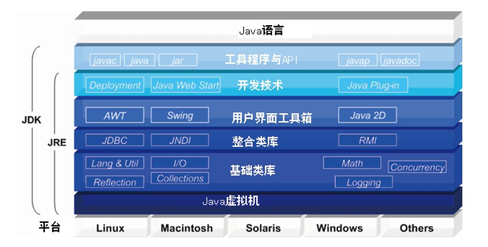

# 背景+基本概念

# 编译环境介绍+基本语法

# 编程规范+初始化

javac

- 编译器，将.java源码编译成字节码.class文件
- `javac [选项]* xx.java`
- `-classpath classpath`定义javac搜索类的路径
- `-d directory`指明编译生成的类存放的根目录

java：解释器，解释运行java字节码

jar

- 存档压缩工具，java应用程序，将多个文件合并为单个jar归档文件
- `jar [选项] [mainfest] destination input-file [input-files]`
- `jar cf file.jar *.class`将当前目录下的所有.class文件打包称file.jar
- `jar tf file.jar`显示jar文件中的文件列表

jarap：类文件解析器，解析类文件，输出public域及其方法，快速查看类的可用属性和方法

javadoc：Java API文档生成器，解释Java源文件中类的定义和文档注释，生成响应的文档

appletviwer：Java applet浏览器（viewer），web调试运行

jdb：调试器

javah：生成c头文件和源文件

环境配置：配置Path和ClassPath

命名规范：包`顶级域名.包名.子功能包名`，类（首字母大写），放啊（首单词小写，动词），变量（首单词小写）


# Android简介+初始化与清理+访问权限控制

## 初始化

**重载：**相同方法名和返回类型，独一无二的参数列表

声明对象

```java
Box b1=new Box();
Box b2=b1;
//b1和b2 指向同一个对象 bi.equals(b2)==true
```

一个方法调用自身：不会产生新的副本、重新分配堆栈（递归）

基本数据类型：不使用new

构造器：静态方法、类同名、无return、有参无参

this关键字：不能串行调用两个构造器

方法作用域：作用域内，变量创建；作用域终止，变量销毁

**static关键字：**

- 静态域（数据，全局变量）、静态方法（不能引用this和super，只能访问静态方法和静态域）、静态块（类第一次加载时执行，初始化静态域）
- 只与类关联，不与对象关联，通过类调用

**初始化和清理**

清理：释放new分配的内存，`finalize()`方法（类的结束器）

**数组初始化**

- `类型[] 数组名称`

  ```java
  int[] a
  Random rand=new Random(47);
  a=new int[rand.nextInt(20)];
  ```

- 数组初始化

  - 可变参数列表

    ```java
    class A{}
    public class VarArgs{
    	static void printArray(Object[]args){
    		for(Object obj:args)print(obj);// 47 3.14 11.11
    	}
    	public static void main(String[]args){
    		printArray(new Object[]{
    			new Integer(47),new Float(3.14f),new Double(11.11)
    		})
    	}
    }
    ```

  - 枚举类型

    ```java
    public enum Spiciness{NOT,MILD,MEDIUM,HOT,FLAMING}
    public class EumOrder{
    	public static void main(String[]args){
    		for(Spiciness s:Spiciness.values()){
    			print(s);//Not,ordinal 0...
    		}
    	}
    }
    ```

## 访问控制权限

包

- 关键字：`package`，Java源文件第一句

- 库单元：该文件内声明的所有类都属于指定的包，缺省为默认包，没有名字

- Java可运行程序是一组**.class文件**，可以打包并压缩为一个**jar文档**

- 存储路径：层次目录，`pacakge foo.bar.baz表示env/foo/bar/baz`，需要在env目录下叫用Java编译命令

- 包的存储和查找：当前工作目录/包目录（存储和查找），CLASSPATH/包目录（查找）

  ```java
  package MyPack;
  class Balance{}
  class AccountBalance{}
  //AccountBalance.java和AccountBalance.class都在MyPack目录
  ```

- public>protected>包权限default>private

  在同一个包内除了private都差不多，不同包才有default、protected的区别
  
  |                        | private | default | protected | public |
  | ---------------------- | ------- | ------- | --------- | ------ |
  | 同一个类可见           | 是      | 是      | 是        | 是     |
  | 同一个包中对子类可见   | 否      | 是      | 是        | 是     |
  | 同一个包中对非子类可见 | 否      | 是      | 是        | 是     |
  | 不同包中对子类可见     | 否      | 否      | 是        | 是     |
  | 不同包中对非子类可见   | 否      | 否      | 否        | 是     |

  - 类权限：
  
    - 只能是public或default
    - private构造器
    - static方法
  
    ```java
    class Soup1{
    	private Soup1(){}
    	public static Soup1 makSoup(){return new Soup1();}
    }
    class Soup2{
    	private static Soup2 ps1=new Soup2();
    	public static Soup2 access(){return ps1;}
    	public void f(){}
    }
    public class Lunch{
    	void testPrivate(){
    		//!Soup1 soup=new Soup1();
    	}
    	void testStatic(){Soup1 soup=Soup1.makSoup();}
    	void testSingleton(){Soup2.access().f();}
    }
    ```
  
    

# 编程思想+复用+多态+eclipse编译环境

## 继承

## 关键字

- extends：`classA extends classB`

  - classA子类或导出类，classB超类、父类或基类，按层分类
  - 方法的扩展、方法的覆盖、super关键字
  - 构造器初始化：先初始化基类

- super：指代基类的数据或方法

  - `super.method()`基类和导出类有相同方法
  - `Super()`基类构造器有参

- final：适用于数据、方法、类

  - 对于基本数据类型，**数值恒定不变**
    - 永不改变的编译时常量
    - 必须是基本数据类型，**必须赋值**
    - 编译时执行包含final数据的计算式
  - 对于对象，**引用恒定不变**
    - final对象数据本身可以修改
    - 数组也是一种数组
  - static+final：只占据一个**不能改变的存储空间**，变量名全部大写、下划线分词（类似于宏定义？）

  - 空白final：被声明为final但没赋初值
    - 数据被**使用前必须初始化**
    - 一个类中的final域在不同对象中不同，但又保持恒定不变
  - final参数：无法在方法中改变参数引用的对象（类似于**const&**）
  - final方法：锁定方法，继承类无法覆盖
    - private隐式指定为final，继承类不可见
  - final类：不允许被继承

  - final vs static
    - static：static变量本质是全局变量，不能是泛型；static方法，只能访问其他static的变量和方法，不能使用super和this；代码块仅在类被加载时加载一次；只属于类，不属于对象，通过类名访问。
    - final：final变量必须初始化且无法更改（const），变量名全部大写；final方法不能被重写；final类不能被继承；final对象引用不能更改，但成员可以改（指针引用锁定？）；不能同时是abstract、final，抽象类不完整。

## 向上转型

定义：**将导出类引用转化为基类引用的动作**（父指针？）

## 初始化顺序

1. 编译时
   1. 先初始化**主类的基类的静态定义**（包括静态块）
   2. 再初始化**导出类的静态定义**
2. 执行主类的**main方法**
3. 声明**主类对象**：
   1. 依次初始化**主类的基类的非静态定义和构造器**
   2. 再初始化**主类的导出类的非静态定义和构造器**
4. 声明其他类对象：
   1. 依次初始化**其它类的基类的**静态定义、非静态定义、构造器
   2. 再初始化**导出类的**

先**静态定义**、再**非静态定义**、**再构造器**，变量定义初始化在任何方法调用前

先基类再导出类，区别是主类的静态定义要提到最前

```java
class Bowl{Bowl(int mark){print("Bowl:"+marker);}}
class Cupboard{
    Bowl bowl3=new Bowl(3);
    static Bowl Bowl4=new Bowl(4);
    static{
        System.out.println("in static field");
        Bowl bowl5=new Bowl(5);
    }
    Cupboard(){print("Cupboard");}
}
public class InitializeTest{
    public statci void main(String[]args){
        print("in main");
        new Cupboard();
        new Cupboard();
    }
}
//in main
//Bowl:4
//in static field
//Bowl:5
//Bowl:3
//Cupboard
//Bowl:3
//Cupboard
```

```java
class Bowl{Bowl(int mark){print("Bowl:"+marker);}}
class Cupboard{
    Bowl bowl3=new Bowl(3);
    static Bowl Bowl4=new Bowl(4);
    static{
        System.out.println("in static field");
    }
    Cupboard(){print("Cupboard");}
}
public class InitializeTest{
    Bowl Bowl40=new Bowl(40);
    static Bowl Bowl10=new Bowl(10);
    static void printTest(){print("printTest");}
    public statci void main(String[]args){
        print("in main");
        new Cupboard();
    }
}
//Bowl:10
//in main
//Bowl:4
//in static field
//Bowl:3
//Cupboard
```

```java
class Insect{
    private int i=9;
    protected int j;
    Insect(){print(i);print(j);j=39;}
	private static int x1=printInit("static Insect.x1");
    static int printInit(String s){print(s);return 47;}
}
public class Beetle extends Insect{
	private int k=printInit("Beetle.k");
    public Beetle(){print(k);print(j);}
    private static int x2=printInit("static Beetle.x2");
    public static void main(String[]args){
        print("in main");
        Beetle b=new Beetle();
    }
}
//static Insect.x1
//static Beetle.x2
//in main
//9 0
//Beetle.k
//47 39
```

## Java类库和核心类库



- 以基础类库JFC（Java Foundation Class）的形式为程序员提供编程接口API；

- 类库中的类按照用途归属于不同的包中；java.lang，java.awt，javax.swing，java.io，java.util，java.net，java.applet

  - java.lang：Java最常用的包都属于该包，default包含；

    - String类，提供了字符串连接、比较、字符定位、字符串打印等处理方法。

    - StringBuffer类，提供字符串进一步的处理方法，包括子字符串处理、字符添加插入、字符替换等。

    - System类，提供对标准输入、输出设备io的读写方法，包括键盘、屏幕的in/out控制。常用的System.out.print()、System.out.println()都是该类的静态变量输出流out所提供的方法。

    - Thread类，提供Java多线程处理方法，包括线程的悬挂、睡眠、终止和运行等。

    - Math类，提供大量的数学计算方法。

    - Object类，这是Java类的祖先类，该类为所有Java类提供了调用Java垃圾回收对象方法以及基于对象线程安全的等待、唤醒方法等。

    - Throwable类，该类是Java错误、异常类的祖先类，为Java处理错误、异常提供了方法。

  - java.awt：提供了图形界面的创建方法，包括按钮、文本框、列表框、容器、字体、颜色和图形等元素的建立和设置。

  - javax.swing：提供100%Java编写的图形界面创建类，利用该包的类建立的界面元素可调整为各种操作系统的界面风格，支持各种操作平台的界面的开发。还提供了树形控件、标签页控件、表格控件的类。从java.awt中继承，更推荐使用。

  - java.io：

    - 提供数据流方式的系统输入输出控制、文件和对象的读写串行化处理;

    - 常见的类有：`BufferInputStream、BufferOutputStream、BufferedReader、BufferedWriter、DataInputStream、DataOutputStream、File、FileReader、FileWriter、FileInputStream和FileOutputStream`等

  - java.util：

    - 提供时间日期、随机数以及列表、集合、哈希表和堆栈等创建复杂数据结构的类。
      - 常见的类有：`Date、Timer、Random和LinkedList`等。

  - java.net：

    - 提供网络开发的支持;
    - 包括封装了Socket套接字功能的服务器Serversocket类、客户端Socket类以及访问互联网上的各种资源的URL类；

  - java.applet：

    - 只有一个Applet类，用于开发或嵌入到网页上的Applet小应用程序，使网页具有更强的交互能力以及多媒体、网络功能。

- Object类：位于java.lang包中，是所有其他类的超类
  - `toString()`：对象内容作为字符串返回，对象无值，返回对象地址
  - `==`：对基本类型变量，比较值，对**引用数据类型，比较地址**
  - `equals()`：**比较对象的内容**是否相同
  - `clone()`：创建调用它的对象的**重复样本**
  - `getClass()`：返回对象的运行时类

# 多态

面向对象编程：封装、继承（向上转型，基类操作导出类）、多态（消除类型之间的耦合关系，允许一种类型表现出与其他相似类型的**区别**）

方法覆盖：覆盖一个方法时，子类方法的**权限**不能低于超类方法；私有方法不能被覆盖

```java
class Super{public int field=0;public int getField(){return field;}}
class Sub extends Super{
	public int field=1;
	public int getField(){return field;}
	public int getSupField(){return super.field();}
}
public class FieldAccess{
	public static void main(String[]args){
		Super sup=new Sub();
		print(sup.field);//0
		print(sup.getField());//1，调用了重写函数
		Sub sub=new Sub();
		print(sub.field);//1
		print(sub.geteField());//1
		print(sub.getSuperField());//0
	}
}
```

前期绑定vs后期绑定

绑定：将一个方法调用同另一个方法主题关联起来

**多态：后期绑定**，再运行时根据对象的类型（Java）

```java
class StaticSuper{
	public static String staticGet(){return "base static";}
	public String dynamicGet(){return "base dynamic";}
}
class StaticSub extends StaticSuper{
	public static String staticGet(){return "derived static";}
	public String dynamicGet(){return "derived dynamic";}
}
public class test{
	pubic static void main(String[]args){
		StaticSup sup=new StaticSub();//upcast
		print(sup.staticGet());//base static
		print(sup.dynamicGet());//derived dynamic
	}
}
```

**基类和导出类的upcast向上转型**

- 不能覆盖的部分是基类的：域和静态方法
- 可以覆盖的部分是导出类的：非静态方法

**构造器和多态**

- 构造器：static方法
- 清理

**接口**

- 抽象类：包含一个或多个抽象方法，`abstract void f()`抽象方法只有声明没有方法体
- 接口：全都是抽象方法，默认`abstract和public`，导出类必须全部覆盖接口方法
  - 可以向上转型，避免创建该接口的对象

**工厂模式**

- 简单工厂模式，静态工厂方法模式
  - 定义创建对象的接口：工厂类（java具体类），抽象产品（接口或抽象类），具体产品（实例）


# 内部类+持有对象

### 内部类

- 特殊的继承关系，类的定义在外部类的里面

  ```java
  class Parcell{
  	class Destination{
  		private String label;
  		String readLable(){return label;}
  	}
  	public void ship(String dest){
  		Destination d =new Destination(dest);
  		System.out.println(d.readLabel());
  	}
  	public static void main(Sting[]args){
  		Parcelll p =new Parcell();
  		p.ship("Tasmania");
  	}
  }
  ```

- 内部类可以访问**外部类**定义所在的**作用域中的数据，包括私有数据**，可以对同一个包中的其他类进行隐藏
  外部类不能访问内部类的数据

  ```java
  //: innerclasses/Sequence.java
  package innerclasses; /* Added by Eclipse.py */
  // Holds a sequence of Objects.
  
  interface Selector {
    boolean end();
    Object current();
    void next();
  }
  
  public class Sequence {
    private Object[] items;
    private int next = 0;
    public Sequence(int size) { items = new Object[size]; }
    public void add(Object x) {
      if(next < items.length)
        items[next++] = x;
    }
    private class SequenceSelector implements Selector {
      private int i = 0;
      public boolean end() { return i == items.length; }
      public Object current() { return items[i]; }
      public void next() { if(i < items.length) i++; }
    }
    public Selector selector() {
      return new SequenceSelector();
    }
  }
  
  public static void main(String[] args) {
      Sequence sequence = new Sequence(10);
      for(int i = 0; i < 10; i++)
        sequence.add(Integer.toString(i));
      Selector selector = sequence.selector();
      while(!selector.end()) {
        System.out.print(selector.current() + " ");
        selector.next();
      }
    }
  }
  ```

- this关键字：

  - 方法需要引用调用它的对象

  - 在构造器中调用构造器：可以加参数，**不能调用两个构造器，不能在其他方法内调用构造器**

  - 区分同一个名称声明的局部变量

  - this vs new

    ```java
    public class DotThis{
    	public class Inner{}
    	public Inner inner{return new Inner();}
    	public static void main(String[]args){
    		DotThis dt=new DotThis();
    		DotThis.Inner dti=dt.inner();
            DotThis.Inner dtii=dt.new Inner();
    	}
    }
    ```

- 内部类对象的创建

  - 必须**先创建外部类对象**
  - 外部类的的方法：直接声明内部类对象
  - 外部类对象.new 内部类对象

- 内部类的权限：**无法访问私有内部类**

  ```java
  class Parcel4{
  	private class PContents implements Contents{
  		private int i=11;
  		public int value(){return i;}
  	}
  	protected class PDestination implements Destination{
  		private PDestination(String s){}
  	}
  	public Contents contents(){return new PContents();}
  	public Destination destination(String s){return new PDestination(s);}
  }
  public class test{
  	public static void main(String[]args){
  		Parcel4 p=new Parcel4();
  		Contents c=p.contents();
  		Destination d=p.destination("test");
  		// --非法操作--无法访问私有类，后面有问题
          // ! Parcel4.PContents pc=p.new PContents();
  	}
  }
  ```

- 内部类分类

  - 局部内部类：**定义在方法的作用域**

    - 局部内部类**不能**用public或private**访问说明符**声明
    - 作用域仅限定在声明局部类的块中
    - 对外部世界可以完美地**隐藏**起来
    - 不仅能够访问**外部类的域**，还可以访问**局部变量**
    - 外部类的局部变量需要被内部类使用，必须是final变量

    ```java
    public class Parcel5{
    	public Destination destination(String s){
    		class PDestination implements Destination{
    			private String label;
    			private PDestination(String whereTo){label=whereTo;}
    			public String readLabel(){return label;}
    		}
    		return new PDestination(s);
    	}
    	public static void  main(String[]args){
    		Parcel5 p=new Parcel5();
    		Destination d=p.destination("Tasmania");
    	}
    }
    ```

    ```java
    public void start(int interval,final boolean beep){
    	class TimePrinter implements ActionLinstener{
    		public void actionPerformed(ActionEvent event){
    			if(beep){}
    		}
    	}
    	ActionListener listener=new TimePrinter();
    }
    ```

  - 匿名内部类

    - 只创建这个类的一个对象，**无需命名**
    - 用于构造对象的任何参数都要放在超类名后面的括号()内，**构造器参数传递给超类superclass构造器（接口或抽象类）**

    ```java
    public class Parcel8{
    	public Wrapping wrapping(int x){
    		return new Wrapping(x){
    			public int value(){return super.value()*47;}
    		}
    	}
    	public static void main(String[]args){
    		Parcel8 p =new Parcel8();
    		Wrapping w=p.wrapping(1);
    	}
    }
    ```

    - 构造器的名字必须和类名相同，**匿名类不能有构造类**

    ```java
    interface Contents{int value();}
    public class Parcel7{
    	public Contents contents(){
    		return new Contents{
    			private int i=11;
    			public int value(){return i;}
    		}
    	}
        class MyContents implements Contents{
            private int i=11;
            public int value(){return i;}
        }
    	public static void main(String[]args){
    		Parcel7 p=new Parcel7();
    		Contents c=p.contents();
    	}
    }
    ```

    - 匿名内部类使用外部类的非局部数据不要求是final变量，使用**外部方法**的任何数据都要求是**final变量**

    ```java
    public class Parcel9 {
      // Argument must be final to use inside
      // anonymous inner class:
     //int test1 = 100;
      public Destination destination(final String dest) {
        //int test2 = 300;
        return new Destination() {
          private String label = dest;
          //private int dest1 = test1;
          //private int dest2 = test2;
          public String readLabel() { return label; }
        };
      }
      public static void main(String[] args) {
        Parcel9 p = new Parcel9();
        Destination d = p.destination("Tasmania");
      }
    } 
    ```

    - 匿名内部类既可以扩展类，也可以实现接口，**但仅能实现一个扩展类或接口**

  - 嵌套类

    - 静态内部类（嵌套类）：

      - 对象生成：new 外部类.内部类()
      - 必须通过对象访问外部类数据

    - 非静态内部类

      - 对象生成：外部类.new 内部类()
      - 可以直接访问外部类的数据

    - 嵌套内部类：接口内可放置**内部类**，内部类**自动是public static**

      - 用嵌套内部做测试

      ```java
      public interface ClassInInterface{
      	void dowdy();
      	class Test implements ClassInInterface{
      		public void howdy(){}
      		public void static main(String[]args){
      			new Test().howdy();
      		}
      	}
      }
      ```

      ```java
      public class TestBed{
      	public void f(){}
      	public static class Tester{
      		public static void main(String[]args){
      			TestBed t=new TestBed();
      			t.f();
      		}
      	}
      }
      ```

    - 一个内部类可以被嵌套很多层，能够**透明地访问所有它所嵌入的外部类**的所有成员（数据+方法）

      ```java
      class MNA{
      	private void f(){};
      	class A{
      		private void g(){};
      		public class B{
      			void h(){f();g();}
      		}
      	}
      }
      public class test{
      	public static void main(String[]args){
              MNA mna=new MNA();
              MNA.A a=mna.new A(); // 
              MNA.A.B b=a.new B();
              b.h();
          }
      }
      ```

- 内部类的继承

  ```java
  class WithInner{
  	class Inner();
  }
  public class InheritInner extends WithInner.Inner{
      // ! InheritInner(){} 不会编译
  	InheritInner(WithInner wi){
  		wi.super();
  	}
  	public static void main(String[]args){
  		WithInner wi=new WithInner();
  		InheritInner ii=new InheritInner(wi);
  	}
  }
  ```

- 内部类的覆盖

  - 内部类和外围类是两个独立的个体，**不存在内部类覆盖**

    ```java
    class Egg{
    	private Yolk y;
    	protected class Yolk{
    		public Yolk(){print("Egg.Yolk()");}
    	}
    	public Egg(){
    		print("new Egg()");
    		y=new Yolk();
    	}
    }
    public class BigEgg extends Egg{
    	public class Yolk{
    		public Yolk(){print("BigEgg.Yolk()");}
    	}
    	public static void main(String[]args){
    		new BigEgg();
    	}
    }
    ```

  - 声明主类对象，先初始化主类的基类的非静态定义和构造器，再初始化主类的

    ```java
    class Egg2{
    	protected class Yolk{
    		public Yolk(){print("Egg2.Yolk()");}
    		public void f(){print("Egg2.Yolk.f()");}
    	}
    	private Yolk y=new Yolk();
    	public Egg2(){print("new Egg2()");}
    	public void incertYolk(Yolk yy){y=yy;}
    	public void g(){y.f();}
    }
    public class BigEgg2 extends Egg2{
    	public class Yolk extends Egg2.Yolk{
    		public Yolk(){print("BigEgg2.Yolk()");}
    		public void f(){print("BigEgg2.Yolk.f()");}
    	}
    	public BigEgg2(){insertYolk(new Yolk());}
    	public static void main(String[]args){
    		Egg2 e2=new BigEgg2();
    		e2.g();
    	}
    }
    ```

    ```bash
    Egg2.Yolk()
    new Egg2()
    Egg2.Yolk()
    BigEgg2.Yolk()
    BigEgg2.Yolk.f()
    ```

## 持有对象

- 保存一组对象——容器类库

  - Collection：一个独立元素的序列，这些元素服从一条或多条规则

    - List 处理有顺序的、可重复的对象，随机访问的线性表
      新增的方法`add、addAll、get、indexOf、lastIndexOf、listIterator、remove、set、subList`
      - LinkedList 经常从表中插入删除
        
        新增`get、remove、insert`在首部和尾部，可作为stack、queue、deque
        
        **没有同步**
      - ArrayList 元素随机访问
        可变大小数组，允许包括null的所有元素
        capacity，存储元素数组的大小，可自动扩容
        ensureCapacity保证插入正确，没有同步
      - Vector 线程安全，但效率差，几乎不用
        **同步的**：不同线程的iterator同时使用抛出ConcurrentModificationException异常
        - Stack（新增`push、pop、peek、empty、search`方法）、Queue 行为由LinkedList提供支持
    - Set 不允许由重复的对象
      - HashSet 提供最快的查询速度
        无序、无下标、底层数组
      - LinkedHashSet 以插入顺序保存元素
      - SortSet 按照数字将元素排序，为可排序集合，默认升序
        基于TreeSet实现
      - TreeSet 保持元素处于排序状态，按二叉树排序
        实现Comparable接口的compareTo()方法实现元素不重复
        每次插入会再排序，低效率
    - Queue 队列
      - PriorityQueue 优先队列，构造队列时提供Comparator排序
  
    ```java
    import java.util.*
    public class test{
    	public static void main(String[]args){
    		Collection<Integer>c=new ArrayList<Integer>();
    		for(int i=0;i<10;i++)c.add(i) // 自动包装
    		for(Integer i:c)...
    	}
    }
    ```

  - 迭代器
  
    - Iterator()，准备好序列的第一个元素
    - Next()，获得序列的下一个元素
    - hasNext()，检查是否还有元素
    - remove()，删除最近返回的元素
  
    ```java
    Iterator it=collection.iterators();//获得一个迭代子
    while(it.hasNext()){
    	Object obj=it.next();//得到下一个元素
    }
    ```

  - foreach和迭代器
  
  - Map：一组成对的“键值对”对象，允许使用键来查找值
    **提供对象到对象的映射**
  
    - Hashtable
      HashMap和HashTable的区别等同于ArrayList和Vector的区别
    - HashMap
      使用hash实现的Map
      改变操作（增减键值对）`put、remove、clear`
      查询操作`get、intsize、isEmpty`
      键值对作为集合处理`keySet、values`
      - LinkedHashMap
    - TreeMap
      **vs HashMap**
      Hash便于插入，Tree便于遍历
      使用Hash构造，然后映射到Tree可能更快
      TreeMap的元素可排序
      均实现了Cloneable接口
    - WeakHashMap

# 类型信息

## RTTI

RTTI-runtime type information运行时类型信息

**运行时识别一个对象的类型：**当一个指向对象基类的引用时，**RTTI机制**可以找到对象的**确切类型**

- 两种方法

  - 传统RTTI，假定编译时已经知道了所有的类型
  - “反射”机制，允许运行时发现和使用类的信息

- RTTI的优点

  - 向上转型，丢失具体的类型信息，但总是安全的
  - 向下转型，必须检查

- 三种形式

  - 传统类型转换：`(Apple)Fruit`，如果转换类型错误，抛出`ClassCastException`异常

  - 通过Class对象获取对象的类型

    ```java
    Class c=Class.forName("Apple");
    Object o=c.newInstance();
    ```

    `关键字instanceof、方法Class.isInstance()`确定对象是否属于特定类或其基类

    - 每个类都有Class对象，当编写并编译了一个新类就会产生一个Class对象，被保存在同名.class文件中
    
    - 当类的class对象载入到内存，就被用来创建这个类的所有对象
    
    - Java程序运行前不是全部被加载，在各部分必须的时候才加载
    
    - 三种获得Class对象的引用方法
      - `Class.forName("xx.class")`
        - 参数：目标类的文本名
        - 目的：返回目标类的引用并操作它
      - 类字面量`Gum.class`
        - 更简单更安全，应用于类、接口、数组、基本类型
        - 对于基本类型的包装类，还有标准字段TYPE，指向基本类型的class引用
      - `obj.getClass()`获得Class引用（已知某个对象）
      
      ```java
      class Candy{static{System.out.println("loading candy")};}
      class Gum{static{System.out.println("loading gum")};}
      class Cookie{static{System.out.println("loading cookie")};}
      public class SweetShop{
          public static void main(String[]args){
              new Candy();
              try{
                  Class.forName("Gum");
              }catch(ClassNotFoundException e){
                  System.out.println("not found")
              }
              new Cookie();
          }
      }
      ```
      
      ```java
      //: typeinfo/toys/ToyTest.java
      pacakge typeinfo.toys;
      import static net.mindview.util.Print.*;
      interface HasBatteries{}
      interface Waterproof{}
      interface Shoots{}
      class Toy{Toy(int i){}}
      Class FancyToy extends Toy implements HasBatteries,Waterproff,Shoots{
      	FancyToy(int i){super(i);}
      }
      public class ToyTest{
      	static void printInfo(Class cc){
      		print("class name: "+cc.getName());
      		print("is interface?: "+cc.isInterface());
      		print("simple name: "+cc.getSimpleName());
      		print("canonical name: "+cc.getCanonicalName());
      	}
      	public static void main(String[]args){
      		Class c=null;
      		try{
      			c=Class.forName("typeinfo.toys.FancyToy");
      		}catch(ClassNotFoundException e){
      			print("not found FancyToy");
      		}
      		printInfo(c);
              //FancyToy False FancyToy typeinfo.toys.FancyToy
      		for(Class face:c.getInterfaces()){
      			printInfo(face);
                  //typeinfo.toys.HasBatteries true HasBatteries 
                  //typeinfo.toys.HasBatteries
      		}
      		class up=c.getSuperclass();
      		Object obj=null;
      		try{
      			obj=up.newInstance();
      		}catch(InstantiationException e){
      			print("cannot instantiate");
      		}catch(IllegalAccessException e){
      			print("cannot access");
      		}
      		printInfo(obj.getClass);
              //typeinfo.toys.Toy false Toy typeinfo.toys.Toy
      	}
      }
      ```
    
  - Class对象：**可以查出它的祖宗十八代**
  
    `getInterfaces(): Class[]、newInstance(): Object`
    `static Class.forName("Gum"): Class`
    `isInterface(): bool、getName(): string、getSuperclass()`
  
- 类字面常量

  - 类字面常量不仅可以用于普通的类，也可以用应用于接口、数组、基本数据类型

  - 对于基本数据类型的包装器类，该有一个标准字段TYPE
    `boolean.class==Boolean.TYPE、char.class==Character.TYPE`

  - TPYE字段可以是一个引用，指向对应的基本数据类型Class对象

  - 语法：`类名.class`

  - 过程：

    - 加载：类加载器执行，查找字节码（通过classpath在指定的路径查找），**从字节码中创建Class对象**
    - 链接：验证类中的字节码，为静态域**分配存储空间**，可能会解释这个类创建的对其他类的所有引用
    - 初始化：先初始化超类，执行静态初始化器、静态初始化模块

    ```java
    //: typeinfo/ClassInitialization.java
    import java.util.*;
    class Initable{
        //有static+final的编译常量，不需要初始化类
    	static final int staticFinal=47;
        //有static+final的非编译常量，需要初始化类
    	static final int staticFianl2=
    	ClassInitializaition.rand.nextInt(1000);
    	static{System.out.println("initializaiton initable");}
    }
    class Initable2{
        //只有static，先链接和初始化
    	static int staticNonFinal=147;
    	static{System.out.println("initialization initable2");}
    }
    class Initable3{
    	static int staticNonFinal=74;
    	static{System.out.println("initialization initable3");}
    }
    public class ClassInitialization{
    	public static Random rand=new Random(47);
    	public static void main(String[]args) throws Exception{
            Class initable=Initable.class;//不用初始化类
    		System.out.println(Initable.staticFianl);//47
    		System.out.println(Initable.staticFinal2);//initializing initable 258
    		System.out.println(initable2.staticNonFinal);//initializing initable2 147
    		Class initable3=Class.forName("Initable3");//要初始化类 initializing initable3
    		System.out.println(Initable3.staticNonFinal);//74
    	}
    }
    ```

  - `x instanceof Dog`：判断对象是不是某些类的实例，返回一个布尔值
    注意：Dog是一个命名类型，而不是Class对象

    动态的instanceof——isInstance

    - 语法：`类.isInstance(对象)`，动态测试对象的路径

      - `导出类.isInstance(基类对象)`：基类对象是否导出类的对象，`基类对象 instanceof 导出类`
      - `基类.isInstance(导出类对象)`：导出类对象是否基类的对象，`导出类对象 instanceof 基类`

      ```java
      //: generics/ClassTypeCapture.java
      package generics; /* Added by Eclipse.py */
      
      class Building {}
      class House extends Building {}
      
      public class ClassTypeCapture<T> {
        Class<T> kind;
        public ClassTypeCapture(Class<T> kind) {
          this.kind = kind;
        }
        public boolean f(Object arg) {
          return kind.isInstance(arg);
        }
        public static void main(String[] args) {
          ClassTypeCapture<Building> ctt1 =
            new ClassTypeCapture<Building>(Building.class);
          System.out.println(ctt1.f(new Building()));//true
          System.out.println(ctt1.f(new House()));//ture
          ClassTypeCapture<House> ctt2 =
            new ClassTypeCapture<House>(House.class);
          System.out.println(ctt2.f(new Building()));//false
          System.out.println(ctt2.f(new House()));//true
        }
      
      ```


## 反射

Java被视为动态（准动态）语言的关键性质

- 动态语言：程序运行时，允许改变程序的结构或变量类型，比如Perl、python、ruby
- 程序运行后才知道要调用哪个对象，根据客户端的String参数判断执行的方法

- 在运行时加载、探知、使用编译期间完全未知的classes

反射的方式

- 类的**Class对象**
- 传统的RTTI方式：在编译时打开和检查.class文件
- 反射机制：在运行时打开和检查.class文件

反射

- java.lang.Class：类对象，对构造器、属性、方法提供了四种独立的反射调用，以不同的方式来获得信息
- java.lang.reflect：
  - Constructor：类的构造器对象
    - `Constructor getConstructor(Class[] params) `获得使用特殊的参数类型的公共构造函数。
    - `Constructor[] getConstructors() `获得类的所有公共构造函数。
    - `Constructor getDeclaredConstructor(Class[] params) `获得使用特定参数类型的构造函数(与接入级别无关)
    - `Constructor[] getDeclaredConstructors()`获得类的所有构造函数(与接入级别无关)
  - Field：类的属性对象
    - `Field getField(**String name**)`获得命名的公共字段
    - `Field[] getFields()`获得类的所有公共字段
    - `Field getDeclaredField(**String name**)`获得类声明的命名的字段
    - `Field[] getDeclaredFields()`获得类声明的所有字段
  - Method：类的方法对象
    - `Method getMethod(String name, Class[] params) `使用特定的参数类型，获得命名的公共方法
    - `Method[] getMethods()`获得类的所有公共方法
    - `Method getDeclaredMethod(String name, Class[] params)`使用特写的参数类型，获得类声明的命名的方法
    - `Method[] getDeclaredMethods()`获得类声明的所有方法

使用反射的原则

- 获得操作的类的java.lang.Class对象

  ```java
  Class c=Class.forName("java.lang.Class");
  Class c=init.getClass();
  Class c=Integer.TYPE;
  ```

- 调用诸如`getDeclaredMethods`的方法，获得类中定义所有方法的列表

  ```java
  Method m[]=c.getDeclaredMethods();
  ```

- 使用reflection API操作这些信息

  ```java
  System.out.println(m[0].toString());
  ```

```java
import java.lang.reflect.*;
import java.awt.*;
class SampleGet {
	public static void main(String[] args) {
		Rectangle r = new Rectangle(100, 325);
		printHeight(r);
	}
	static void printHeight(Rectangle r) {
        Field heightField;
        Integer heightValue;
        Class c = r.getClass();//创建一个class对象
        try {
            heightField = c.getField("height");//通过getField创建一个Field对象
            heightValue = (Integer) heightField.get(r);
            System.out.println("Height: " + heightValue.toString());
        } catch (NoSuchFieldException e) {
            System.out.println(e);
        } catch (SecurityException e) {
            System.out.println(e);
        } catch (IllegalAccessException e) {
        	System.out.println(e);
        }
	}
}
```

反射的功能：运行时

- 判断对象属于的类
- 构造任意一个类的对象
- 判断任意一个类具有的成员变量和方法
- 调用任意一个对象的方法

```java
//得到某个对象的属性
public Object getProperty(Object owner, String fieldName) throws exception
{
	Class ownerClass = owner.getClass();
	Field field = ownerClass.getField(fieldName); 
	Object property = field.get(owner);
	return property;
}
//得到某个类的静态属性
public Object getStaticProperty(String className, String fieldName) throws Exception
{
	Class ownerClass = Class.forName(className);
	Field field = ownerClass.getField(fieldName);  
	Object property = field.get(ownerClass);
	return property;
}
//执行某对象的方法
public Object invokeMethod(Object owner, String methodName, Object[] args) throws Exception 
{
	Class ownerClass = owner.getClass();
	Class[] argsClass = new Class[args.length];
	for (int i = 0, j = args.length; i < j; i++) {   
		argsClass[i] = args[i].getClass();
	}
	Method method = ownerClass.getMethod(methodName, argsClass);
	return method.invoke(owner, args);
}
//执行某个类的静态方法
public Object invokeStaticMethod(String className, String methodName,Object[] args) throws Exception
{
	Class ownerClass = Class.forName(className);
	Class[] argsClass = new Class[args.length];
	for (int i = 0, j = args.length; i < j; i++) {  
		argsClass[i] = args[i].getClass();
	}
	Method method = ownerClass.getMethod(methodName, argsClass); 
	return method.invoke(null, args);
}
//新建实例
public Object newInstance(String className, Object[] args) throws Exception
{
    Class newoneClass = Class.forName(className);
    Class[] argsClass = new Class[args.length];
    for (int i = 0, j = args.length; i < j; i++) {
        argsClass[i] = args[i].getClass();
	}  
	Constructor cons = newoneClass.getConstructor(argsClass);
	return cons.newInstance(args);
}
//判断是否为某个类的实例
public boolean isInstance(Object obj, Class cls) {
	return cls.isInstance(obj); }
//得到数组钟的某个元素
public Object getByArray(Object array, int index) {
    return Array.get(array,index); }

```

反射与安全性：对反射实施应用与源代码接入相同的限制

- 从任意位置导类公共组件的接入
- 类自身外部无任何到私有组件的接入
- 受保护和打包（缺省接入）组件的有限接入

反射与性能：反射是一种解释操作，告诉JVM我们希望做什么，总是更慢

null：伴随着空指针异常

空对象：可以假设所有对象是有效的，避免检查null异常

## 接口和类型信息

接口：允许隔离构建，降低耦合性

```java
//: typeinfo/InterfaceViolation.java 
// Sneaking around an interface. 
import typeinfo.interfacea.*; 
class B implements A { 
    public void f() {} 
    public void g() {} 
} 
public class InterfaceViolation { 
    public static void main(String[] args) { 
        A a = new B(); 
        a.f(); 
        // a.g(); // 编译错误
        System.out.println(a.getClass().getName()); 
        if(a instanceof B) { // true
            B b = (B)a; 
            b.g(); 
        } 
    } 
} /* Output: 
```

# 自动拆箱+泛型

## 泛型

- 泛型：创建一个类，使用类型作为参数（类似于C++**类模板**），作用于类、接口、方法

- `class Java_Class<K,V>或interface Java_Interface<K,V>`
- 在**泛型之前**，使用**Object类型**进行多种数据类型操作
  - 使用Object进行**数据强制转换**，基于开发者明确数据类型（比如Object转String）
  - 类型不一致，**编译器不报错**，运行时出错
  - 所以**编译时**需要**类型安全检查**，运行时强制类型转化、隐式转化（使用泛型）
- 泛型作用
  - 告诉编译器每个**集合**接收哪些**对象类型**，编译器**自动**做类型转换
  - 编译时就可知是否向集合中插入**错误类型**元素
  - 提高程序**复用**性
  - 创造容器，**指定容器持有什么类型的对象**，由编译器保证类型正确

```java
public class test{ 
    public class getObj<T>{  // 普通泛型，类型外部指定；复杂泛型，指定两个泛型类型
        private T myObj;
        public T getObj(){return myObj;}
        public void setObj(T obj){myObj=obj;}
    }
    public void main(String args[]){
		getObj<String>strObj=new getObj<String>();
        strObj.setObj("string");
        System.out.println(strObj.getObj());
        getObj<double>douObj=new getObj<double>();
    }
}
```

- 注意：

  - 定义泛型类，在<>之间定义形式类型参数
  - 实例化泛型类，指定类型参数，共两次书写
  - 泛型中`<K extends Object>`中extends关键字不代表继承，是**类型范围约束**
  - 通配符仅在声明时使用

- 无界通配符

  ```java
  public class test{ 
      public class Info<T>{ 
   		...
      }
      public void main(String args[]){
  		Info<String>i=new Info<String>();
          fun(i);
      }
      public static void fun(info<?>temp){
          System.out.println(temp); // 可以接收任意类型的泛型对象
      }
  }
  ```

- 上界通配符

  ```java
  public class test{ 
      public class Info<T>{ 
   		...
      }
      public void main(String args[]){
  		Info<Integer>i1=new Info<Integer>(); //Integer泛型对象
          fun(i1);
          Info<Float>i2=new Info<Float>(); //Float泛型对象
          i2.setVar(30.1f) // 设置小数，自动装箱
          fun(i2);
      }
      public static void fun(info<? extends Number>temp){
          System.out.println(temp); // 只能接收Number及其子类
      }
  }
  ```

- 下界通配符

  ```java
  public class test{ 
      public class Info<T>{ 
   		...
      }
      public void main(String args[]){
  		Info<String>i1=new Info<String>(); //Integer泛型对象
          fun(i1);
          Info<Object>i2=new Info<Object>(); //Float泛型对象
          i2.setVar(new Object()`) // 设置小数，自动装箱
          fun(i2);
      }
      public static void fun(info<? super String>temp){
          System.out.println(temp); // 只能接收String或Object类型的泛型
          //只能接收类和超类
      }
  }
  ```

- 泛型不能向上转型

  ```java
  public class test{ 
      public class Info<T>{ 
   		...
      }	
      public void main(String args[]){
  		Info<String>i1=new Info<String>();
  		Info<Object>i2=null;
          i2=i1;// 错误，i1!=i2 泛型不能向上转型
      }
  }
  ```

- Java泛型接口：使用泛型接口还是实类型接口

  ```java
  interface Info< T>{  // 在接口上定义泛型
      public T getVar() ; // 定义抽象方法，抽象方法的返回值就是泛型类型
  }  
  class InfoImpl< T> implements Info< T>{ // 定义泛型接口的子类   
      private T var ;    // 定义属性   
      public InfoImpl(T var){  // 通过构造方法设置属性内容    
          this.setVar(var) ;    }
      public void setVar(T var){    this.var = var ;   }
      public T getVar(){    return this.var ;   }  
  };
  public class GenericsDemo24{
      public static void main(String arsg[]){
           Info< String> i = null;  // 声明接口对象，接口需要类型参数
           i = new InfoImpl< String>("汤姆") ; // 通过子类实例化对象
           System.out.println("内容：" + i.getVar()) ;
      }  }; 
  }
  ```

  ```java
  interface Info< T>{  // 在接口上定义泛型
      public T getVar() ; // 定义抽象方法，抽象方法的返回值就是泛型类型
  }  
  class InfoImpl implements Info< String>{  // 定义泛型接口的子类   
      private String var   ;    // 定义属性   
      public InfoImpl(String  var){  // 通过构造方法设置属性内容    
          this.setVar(var) ;    }
      public void setVar(String  var){    this.var = var ;   }
      public T getVar(){    return this.var ;   }  
  };
  public class GenericsDemo25{
      public static void main(String args[]){
           Info i = null;  // 声明接口对象，接口可以不用类型参数
           i = new InfoImpl ("汤姆") ; // 通过子类实例化对象
           System.out.println("内容：" + i.getVar()) ;
      }  }; 
  }
  ```

- Java泛型方法

  ```java
  class Demo{
  	public <T> T fun(T t){   // 可以接收任意类型的数据
      	return t ;     // 直接把参数返回
      }
  };  
  public class GenericsDemo26{
  	public static void main(String args[]){
  		Demo d = new Demo() ; // 实例化Demo对象，不用类型参数
  		String str = d.fun("汤姆") ; // 传递字符串
  		int i = d.fun(30) ;  // 传递数字，自动装箱
  		System.out.println(str) ; // 输出内容
  		System.out.println(i) ;  // 输出内容
  	}
  };  
  ```
  
- 使用泛型方法返回泛型实例

  ```java
  class Info< T extends Number>{ // 指定上限，只能是数字类型
     private T var ;  // 此类型由外部决定
     public T getVar(){    return this.var ;    }
     public void setVar(T var){    this.var = var ;   }
     public String toString(){  // 覆写Object类中的toString()方法
        return this.var.toString() ;
     }  
  };  
  public class GenericsDemo27{
     public static void main(String args[]){
        Info< Integer> i = fun(30) ;
        System.out.println(i.getVar()) ;   }
     public static < T extends Number> Info< T> fun(T param){
      //方法中传入或返回的泛型类型由调用方法时所设置的参数类型决定 ！！！
        Info< T> temp = new Info< T>() ;  // 根据传入的数据类型实例化
        Info temp.setVar(param) ;
        // 将传递的内容设置到Info对象的var属性之中
        return temp ; // 返回实例化对象
     }
  };  
  
  ```

- 泛型数组

  ```java
  public class GenericsDemo30{ 
      public static void main(String args[]){  
          Integer i[] = fun1(1,2,3,4,5,6) ; // 返回泛型数组
          fun2(i) ;
      }
      public static < T> T[] fun1(T...arg){ // 接收可变参数！！！
          return arg ;   // 返回泛型数组   
      }
       public static < T> void fun2(T param[]){ // 输出    
          System.out.print("接收泛型数组：") ;    
          for(T t:param){
              System.out.print(t + "、") ;
          }   
      }  
  }
  ```

- Java泛型的嵌套设置：比如`<List<String>>`

  ```java
  class Info< T,V>{  // 接收两个泛型类型
      private T var ;
      private V value ;
      public Info(T var,V value){
          this.setVar(var) ;    
          this.setValue(value) ; }
      public void setVar(T var){ 
          this.var = var ;   }   
      public void setValue(V value){
          this.value = value ;   }   
      public T getVar(){
          return this.var ;   }   
      public V getValue(){
          return this.value ;   }  };  
          
  class Demo< S>{   
      private S info ;   
      public Demo(S info){
          this.setInfo(info) ;   }
      public void setInfo(S info){
          this.info = info ;   }
      public S getInfo(){    
          return this.info ;   }  };  
  public class GenericsDemo31{   
    public static void main(String args[]){    
      Demo< Info< String,Integer>> d = null ;  
  // 将Info作为Demo的泛型类型
      Info< String,Integer> i = null ; 
  // Info指定两个泛型类型
      i = new Info< String,Integer>("汤姆",30) ;
  // 实例化Info对象
      d = new Demo< Info
                    < String,Integer>>(i) ; 
  // 在Demo类中设置Info类的对象
      System.out.println(“内容一：  
                    " + d.getInfo().getVar()) ;
       System.out.println("内容二：
                    " + d.getInfo().getValue()) ;   
      }  
  };  
  ```

- Java的泛型使用了”消磁“，也就是说如果希望表示”任何类型”，Java会将这个任何类型**转化为Object**
  如果需要在泛型方法中使用其他方法method，需要定义包含了method方法的接口interface，并且限制只能传入这个接口

  ```java
  interface Speaks{void talk();}
  class Dog implements Speaks{public void talk();}
  class Cat implements Speaks{public void talk();}
  class Comment{
      public static <T> void speak(T speaker){
          speaker.talk();
      }
  }
  public test{
      public static void main(String[]args){
          Dog d=new Dog();Cat c=new Cat();
          Comment.speak(d);Comment.speak(c);
      }
  }
  ```

- Java的泛型只是对**Object类型的一个泛化**而已，解决了容器类之间的自动转型
  Java中的泛型是真正的自动转型，真正的泛型，是隐式类型

## 自动拆箱

- 打包基本数据类型：Long、Integer、Boolean就是**Wrapper类**

  - 目的：将基本数据类型当作对象操作

  - ```java
    Char='x';Character ch='x';Character ch=new Character('x');Char c=ch
    ```

- 自动装箱：java.lang.Number类`Number num=3.14f`
  自动拆箱：将对象的基本数据形态从对象中**自动取出**`int fooInt=new Integer(10);`

  - 运算时也能自动装箱和拆箱

  - 编译器在编译时根据语法，决定装箱或拆箱

  - ```java
    public class test{
    	public static void main(String[]args){
    		Integer i1=20;Integer i2=20;
    		System.out.println(i1==i2);
            Integer i3=200;Integer i4=200;
            System.out.println(i3==i4);
    	}
    }
    ```

    - -128~127：装箱为Integer对象后，**会**在内存中被重用，i1和i2被拷贝至**同一个对象**
    - 超过上述范围：**不会**在内存中被重用


数组、内部类、父类子类 、重载、红字