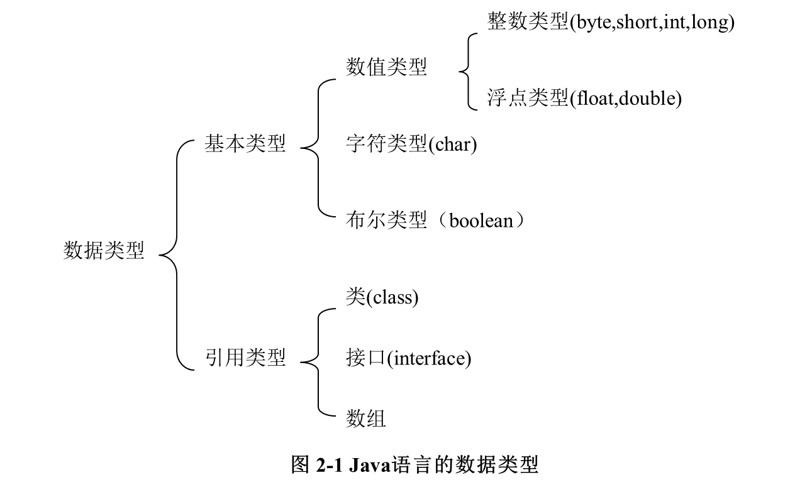
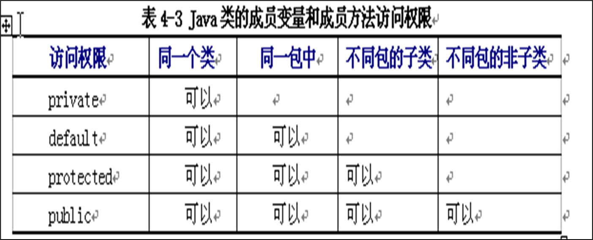
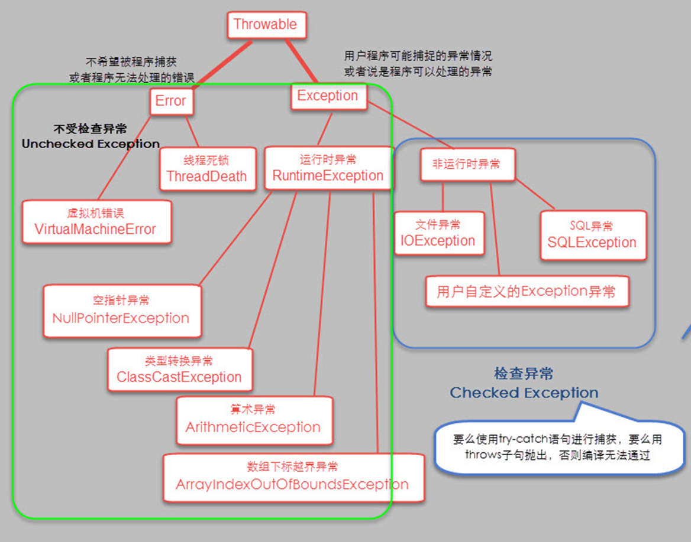
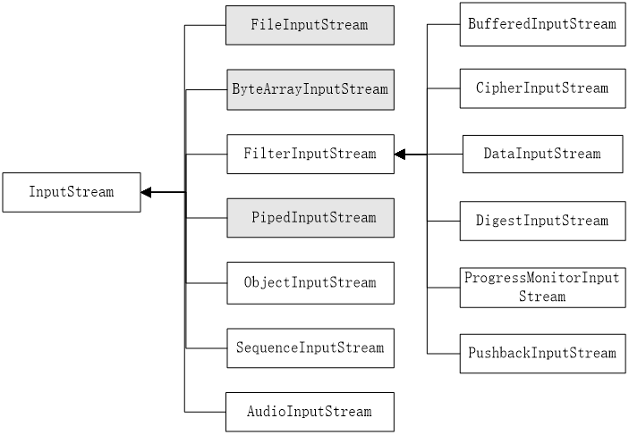
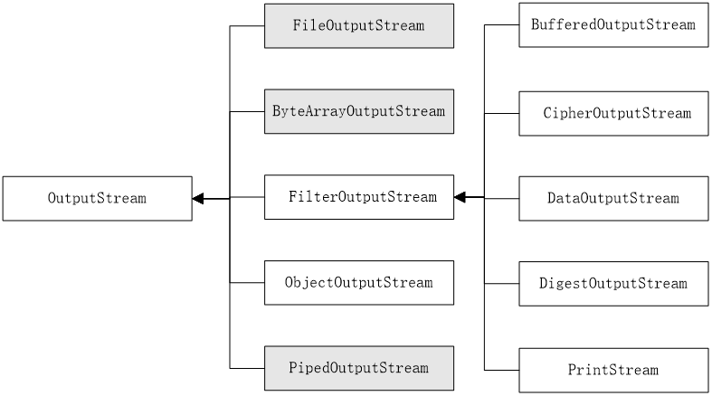
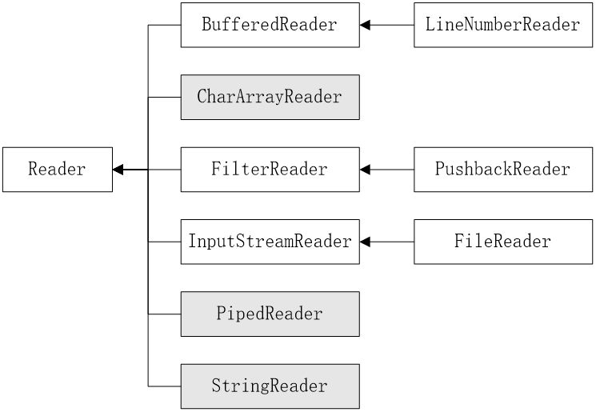
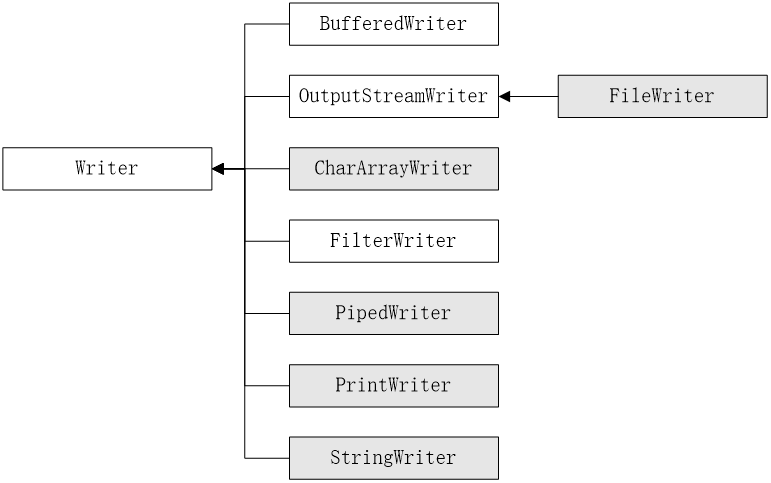

# 数据类型及其运算



## 基本数据类型

字符类型

- 16位unicode码表示

类型转换：自动类型转换、强制类型转换

算数运算注意

- 在Java中,"%"（求模运算符）的操作数可为浮点数,如52.3%10=2.3；

- Java对"+"运算进行了扩展,可作**字符串连接运算符**,如"ab"+"efd"得"abefd"；

- 做"+"运算时,如果一个操作数是字符串,**其它操作数自动转换成字符串**.如: String s; s="s:"+4*5; //结果是s="s:20"；

- byte，short，char等类型进行混合运算时，会先**自动转换为int**类型再运算。

- ~取反、^异或、>>>无符号右移、>>符号位填充右移、**长度不同的对短的符号扩充**

## 数组

- 数组的定义：`int a[] 或 int[] a`未分配空间，空引用
- 使用new为数组分配空间`int a[]=new int[5]{0,1,2,3,4}`，每个数组对象有属性length
- 自动赋初值，char为`\0`
- 二维数组分配空间：`int two[][]=new int[2][3]、int two[][];two=new int[2][];two[0]=new int[2];two[1]=new int[2]`

# 程序控制语句

# 面向对象技术基础

## 面向对象的基本概念

- 封装：独立单元、信息隐蔽
- 继承：继承并增加状态和行为
- 多态：静态重载和动态重写

## 类的定义

```
[修饰符] class 类名 [extends 超类名] [implements接口名列表] {
……
}
[public][abstract|final] class 类名 [extends 超类名] 
[implements 接口名列表]{
……
}
```

- 成员变量的修饰符有以下几种：缺省访问修饰符default、public、protected、private、final、static、transient和volatile。

- [public | protected | private ]   \[static\]  [final | abstract]   [native] [synchronized] 

  returnType methodName ([paramList]) [throws exceptionList]  //方法声明
   {……} //方法体

## 类、对象的使用

## 包package

- 同名的类可能发生冲突，包提供了一种命名机制和可见性限制机制
- package在源文件首句，指明指定文件中定义的类所在的包
- 包层次的根目录由环境变量classpath确定
- classpath查询路径优先级：
  - 缺省值，当前路径
  - 用户指定的环境变量
  - 命令行参数`-classpath`指定

## 成员变量及方法的访问权限



## final、this和其他

- final成员变量：常量、方法：不能被子类覆盖、类：不能被继承
- this：指向当前对象
- super：对父类的引用
- null：不代表任何实例

# 面向对象高级程序设计

## 继承

- 创建子类：从已有的类创建新的类

  - 子类继承父类的状态和行为，修改父类的状态或重写父类的行为，添加新的状态和行为

  - 子类可以继承父类访问权限为public、protected、default的成员变量和方法

  - 隐式调用`super()`父类的构造方法，使用extends关键字

  - 子类父类在同一个包中，子类继承父类的非private成员变量和方法

    子类父类不在同一个包中，子类继承父类protected、public的成员变量和方法，也就是非private和非default

- 成员变量的隐藏和方法重写

  - 子类成员变量和父类同名，子类成员变量隐藏了父类的成员变量
  - 子类方法和父类方法定义相同，子类方法重写父类方法

- super：引用对象的父类

  - 访问父类被隐藏的成员变量`super.variable`
  - 调用父类中被重写的方法`super.Method([param])`
  - 调用父类的构造方法`super([paramlist])`

- 对象的向上转型对象：用子类创建对象，用父类引用该对象，称为向上转型

  - 上转型对象不能操作子类新增的成员变量和方法
  - 子类重写了父类的方法后，上转型对象调用的是重写的方法
  - 可以将上转型对象强制转换到子类对象，子类对象又具备所有的属性和功能。

## 多态

- 多态：使用相同的名字定义不同的方法，包括**重载和重写**
  - 方法重载：静态多态性，编译时多态，形参不同
  - 方法重写：动态多态性，运行时多态，全部相同
- 重写了父类的方法，运行时系统调用子类的方法；
  子类继承了父类的方法（未重写），运行时调用父类的方法
- 重写的原则：不能是原来的子集
  - 重写后得到方法**不能**比被重写的方法有**更严格的访问权限**
  - 重写后的方法不能比被重写的方法产生**更多的异常**

## 抽象方法和抽象类

- 抽象方法：使用abstract来修饰一个方法
  抽象类：使用abstract来修饰一个类
- 抽象类必须被继承且不能实例化，抽象方法必须被重写且没有方法体

## 接口

- 接口声明：关键字interface

  - Java不支持多继承，一个类只能由一个父类

  - 一个接口可以有多个父接口，子接口继承父接口所有的常量和方法，使用extends

    ```java
    [public] interface interfaceName [extends  listOfSuperInterface]{
    ……
    }
    
    ```

    public指明任何类都可以使用该接口，缺省情况下，只有同一个包中的类才可以访问该接口

  - 接口体：常量定义和方法定义

    - 常量均具有**static、final、public**属性（隐式说明）
    - 接口方法均有public和abstract属性（保证能被类使用）

  - 类通过关键字implements实现多个接口

    - 如果一个类使用了某个接口，该类必须实现接口的所有方法
    - 接口方法**默认public**，所以类实现时，**一定要用public来修饰**

- 接口优点

  - 特殊抽象类，只包含常量和方法的定义，没有变量和方法的实现；方法定义和常量值的集合
  - 接口把方法的定义和类的层次区分开来；同时及口中可以实现多车哦那个继承，同一个类实现多个接口

## 内部类和匿名类

- 内部类的定义
  - 嵌套类：一个类被嵌套定义在另一个类中，除了静态嵌套类，嵌套类是内部类
  - 类或接口中声明一个类
  - 类或接口中声明一个接口
  - 类和接口声明可嵌套任意深度
- 内部类特性
  - 用在定义它的类或语句块内，外部引用必须给出它的完整名称
  - 可以使用外部类的静态成员变量和实例成员变量，所在方法内的局部变量
  - 可以定义为abstract、
  - 可以被声明为private、protected
  - 被声明为static，成为顶层类，不能使用实例成员变量和局部变量
  - 有static成员的内部类，必须声明为static内部类
  - 内部类作为外部类的成员，如同成员变量和成员方法，外部类通过内部类对象引用其成员
  - 静态内部类和非静态内部类的区别
    - 能否拥有静态成员：非静态内部类不能有静态成员
    - 访问外部类的成员：静态内部类只能访问外部类的静态成员
    - 静态内部类和非静态内部类在创建对象时有区别
- 匿名类
  - 不能有名称的类，无法引用，创建时用new语句声明
  - 非静态内部类
  - 提供更好的封装

# 字符串处理

初始化后不能改变的字符串类String、字符串内容可以动态改变的类StringBuffer、字符串词法分析类StringTokenizer

在C/C++中，字符串以字符数组的形式处理，以'\0'作为字符串结束符，容易发生错误

在Java中，字符串作为对象处理，对象中封装方法进行字符串处理

## String类

- 字符串构造

  ```java
  String s; s=new String("s"); s="s";
  char cDemo0[]={66,67,68};  String strDemo0=new String(cDemo0);
  byte cDemo1[]={66,67,68};  String strDemo1=new String(cDemo1);
  ```

- String类的常用方法

  ```java
  //字符串长度计算
  String s="xxx"; int n=s.length();
  
  //字符串比较：
  //equals、equalsIgnoreCase忽略大小写、
  //startsWith前缀是否有指定字符串s、endsWith后缀、
  //regionMatches从字符串中截取字串和参数比较、
  //compareTo按照字典顺序和参数比较大小、compareToIgnoreCase
  String a=new String("xxx"); String b=new String("XXX"); 
  a.equals(b); a.equalsIgnoreCase(b);
  String c=new String("aaabbb"); c.startsWith("aa");
  c.regionMatches(2,"ab",2);
  String d=new String("baabbb"); d.compareTo("aaabbb");
  ```

  ```java
  //字符串检索
  //搜索指定字符串的位置
  String str="i love java";  int nPos=str.indexOf('v');//4
  nPos=str.indexOf('a',9); //11，从9开始后第一次出现a
  nPos=str.indexOf("love",0); //2
  ```

  ```java
  //字符串截取
  String str="i love java";
  String subStr=str.substring(5); //e java
  String subStr2=str.substring(5,6); //e
  ```

  ```java
  //字符串替换
  String s="i mist theep";
  String temp=s.replace('t','s'); // i miss sheep
  String s="  i am a student  "; 
  String temp=s.trim();  // "i am a student"
  ```

## StringBuffer类

- StringBuffer类的构造

  ```java
  StringBuffer s=new StringBuffer("hello");
  s.setCharAt(1,'o'); // hollo
  public StringBuffer();
  public StringBuffer(int);//初始容量的字符缓冲区
  public StringBuffer(String);
  ```

- StringBuffer类的常用方法

  ```java
  //添加操作
  StringBuffer sbSource=new StringBuffer("1+2=");
  int nTree=3;
  sbSource.append(nTree);//1+2=3
  //StringBuffer和String的转换
  println(sbSource.toString());
  ```

  ```java
  //插入操作
  StringBuffer sbSource=new StringBuffer("1+=2");
  int nOne=1;
  sbSource.insert(2,nOne);//1+1=2
  ```

  ```java
  //取字符
  StringBuffer sbfSource=new StringBuffer(10);
  sbfSource.append("My");
  //charAt(int index)
  char c=sbfSource.charAt(0); // 'M'
  
  StringBuffer sbfSource=new StringBuffer("you are the best!");
  char[] str;
  //getChars(int srcBegin,int srcEnd,char[]dst,int dstBegin)
  sbfSource.getChars(0,2,str,0) // "yo"
  ```

  ```java
  //删除字符
  StringBuffer sbfSource=new StringBuffer("you are the best");
  sbfSource.delete(0,3);// " are the best"
  ```

  ```java
  //重设字符串长度
  public void ensureCapacity(int minimumCapacity);
  public void SetLength(int new Length);
  ```

  ```java
  //内容替换
  StringBuffer sbfSource=new StringBuffer("you are the best");
  String str="i'm";
  sbfSource.replace(0,7,str);//"i'm the best"
  ```

  ```java
  //取子串
  StringBuffer sbfSource=new StringBuffer("you are the best");
  String str=sbfSource.substring(0,2);//yo
  ```

  ```java
  //字符反转
  String str=sbfSource.reverse();//tseb eht era uoy
  ```

  ```java
  //获取长度
  capacity,length
  ```

## StringTokenizer类

- 构造方法：对字符串解析时，字符串中必须有分隔符号，默认为空格、\t、\n、\r

  ```java
  StringTokenizer fenxi=new StringTokenizer("we are students");
  StringTokenizer fenxi=new StringTokenizer("we,are;students",",;");
  ```
- 常用方法

  ```java
  //统计分隔符数量
  StringTokenizer st=new StringTokenizer("i love java");
  int nTokens=st.countTokens();//3
  
  //匹配和寻找分隔符
  //利用StringTokenizer类进行简单词法分析
  //TestToken.java
  import java.util.*;
  public class TestToken
  {
     public static void main(String args[])
     {
        //构造StringTokenizer对象
  	StringTokenizer st = new StringTokenizer
          ("this is a Java programming");
    	//在字符串中匹配默认的分隔符
          while(st.hasMoreTokens())
          {
              //打印当前分隔符和下一分隔符之间的内容
  		     System.out.println(st.nextToken());
        }
     }
  }
  // this  is  a  Java  Programming
  ```

## 数据类型转换

String提供了静态方法`valueOf()`，将不同的简单数据转化为字符串

其他数据转化为String，提供了`toString()`方法

String转为其他数据，对应的数据类型提供了`valueOf()`方法

```java
int nInt = 10;    //转换为整型
Integer obj1 = new Integer(nInt);  //转换为浮点数类型
String strString1 = obj1.toString();
strString1=String.valueOf(nint);
Integer obj11=Integer.valueOf(strString1); //转化为基本数据类型
int nInt1=stringString1.intValue();
int nInt2=Int.parseInt(strString1);
```

```java
//【例6-7】将简单数据转换成字符串
public class CovertString
{
  public static void main(String args[])
  {
      int nInt = 10;
      float fFloat = 3.14f;
      double dDouble = 3.1415926;       //转换为整型
      Integer obj1 = new Integer(nInt);  //转换为浮点数类型
      Float obj2= new Float(fFloat);        //转换为双精度类型
      Double obj3 = new Double(dDouble);    //分别调用toString方法转换为字符串
      String strString1 = obj1.toString(); // strString1=String.valueOf(nint);
      System.out.println(strString1);
      String strString2 = obj2.toString();
      System.out.println(strString2);
      String strString3 = obj3.toString();
      System.out.println(strString3);
  }
}

```

```java
//【例6-8】 将字符串转换为相应的简单数据类型。
public class CovertSimple{
  public static void main(String args[]){
      char[] cArray;
      int nInt;
      float fFloat;
      double dDouble;
      String strString = new String("I love Java");
      String strInteger = new String("314");
      String strFloat = new String("3.14");
      String strDouble = new String("3.1416");
      cArray = strString.toCharArray();
      System.out.println(cArray);
      nInt = Integer.parseInt(strInteger);
      System.out.println(nInt);
      fFloat = Float.parseFloat(strFloat);
      System.out.println(fFloat);
      dDouble = Double.parseDouble(strDouble);
      System.out.println(dDouble);
  } } 
```


# Java标准类库

# 异常

## 什么是异常

- 异常exception：硬件设备问题、软件设计缺陷导致的程序错误

- 在Java中，产生异常就是产生一个异常对象

- `java.io.IOException、java.lang.ArrayIndexOutOfBoundsException、java.lang.ArithmeticException`指明了**异常类型和异常所在的包**
  - 对于部分异常，编译不通过；对于另一些异常，运行时系统处理

## 异常处理机制

- 异常类的类层次



- Java异常处理机制
  - 捕获catch异常：积极的异常处理机制。Java生成异常对象后，沿着**方法的调用栈逐层回溯**，寻找处理异常对象的方法，找到后，将该异常对象**交给这个方法**处理。
  - 声明抛弃throws异常：如果一个方法可能会出现异常，但没有处理该异常的能力，可以在方法声明时，声明抛弃throws异常

## 异常处理

- 捕获异常`try-catch-finally`，可以嵌套

  - try：选定捕获异常的范围
  - catch：处理try代码块中的异常事件，形参说明异常类型（Throwable子类）
    - 异常捕获顺序和catch顺序有关，从特殊到一般
  - finally：统一出口，可选，不论是否有异常，都要执行finally

- 抛弃异常

  - `public int read()throws IOException,IndexOutOfBoundsException{}`

  - 抛出异常就是产生异常对象的过程

    ```java
    IOException e=new IOException();
    throw e;
    ```

  - 抛出的异常必须是Throwable及其子类实例

    ```java
    public class Exception6{
    	public static void main(String[]args){
    		try{
    			throw new Exception("My Exception");
    		}catch(Exception e){
    		   System.err.println("Caught Exception");
    		   System.err.println("getMessage():" + e.getMessage());
    		   System.err.println("getLocalizedMessage():"+ e.getLocalizedMessage());
    		   System.err.println("toString():" + e);
    		   System.err.println("printStackTrace():");
    		   e.printStackTrace();
    		}
    	}
    }
    //程序运行结果如下:
    //d:\user\chap08>java Exception6
    //Caught Exception
    //getMessage():My Exception
    //getLocalizedMessage():My Exception
    //toString():java.lang.Exception: My Exception
    //printStackTrace():
    //java.lang.Exception: My Exception
    //				at Exception6.main(Exception6.java:5)
    ```

## 创建用户异常类

Java提供的系统异常类型无法满足程序设计需求

```java
class UserException extends Exception{
	UserException(String msg){super(msg);}
}
public class Exception8 {
  public static void f() throws UserException {
    System.out.println("Throwing UserException from f()");
    throw new UserException();
  }
  public static void g() throws UserException {
    System.out.println("Throwing UserException from g()");
    throw new UserException("Originated in g()");
  }
  public static void main(String[] args) {
    try { f();
    } catch (UserException e) {
      e.printStackTrace();
    }
    try {  g();
    } catch (UserException e) {
      e.printStackTrace();
    }
}
}
//程序的运行结果如下：
//Throwing UserException from f()
//Throwing UserException from g()
//UserException
//				at Exception8.f(Exception8.java:13)
//				at Exception8.main(Exception8.java:21)
//UserException: Originated in g()
//				at Exception8.g(Exception8.java:17)
//				at Exception8.main(Exception8.java:26)
```

- 运行时异常，不能预测，可以不做处理
- 自定义异常类，可定义为运行时异常

# 输入输出处理

## IO流的概念和划分

- 数据流stream：有顺序、有起点、有终点的字节集合；Java通过流来输入和输出，连接物理设备

- Java流的划分：字节流和字符流，读写单位不同，都用`Read(),Write()`方法

  字节流输入类

  

  字节流输出类

  

  字符流输入类

  

  字符流输出类

  

## 文件的操作

- File类：对文件的引用和表示，通过File类获得文件、目录的描述信息

- File对象构造

  ```java
  File f1 = new File("D:/Java");
  File f2 = new File("D:/Java","test.txt");
  File f3 = new File(f1,"test.txt");
  File f4 = new File("file://D:/Java/test.txt");
  ```

- File类的方法

  ```java
  boolean canRead()//测试文件是否可读
  boolean delete()//删除文件
  File getAbsoluteFile()//返回绝对文件名
  boolean isDirectory()//是否是目录
  long lastModified()//上次修改时间，从1970年1月1号开始的标准时间(UTC)的毫秒数
  ```

## 字节Byte流处理

- InputStream/OutputStream：

  ```java
  int read( )
  int read(byte b[ ])
  int read(byte b[ ], int offset, int len)
  
  void close( )
  void flush( )
  void write(int b)
  void write(byte b[ ])
  void write(byte b[ ], int offset, int len)
  ```

- 标准输入/输出流：通过System类实现，定义三个流变量in、out、err

  - System.in作为字节输入流类InputStream的对象实现标准输入。通过read（）方法从键盘接受数据。
  - System.out作为打印流类PrintStream的对象实现标准输出。对PrintStream类进行了扩充，支持数据的格式化输出，增加了printf（）方法。

  ```java
  import java.io.IOException;
  import java.io.InputStream;
  import java.io.OutputStream;
  
  public class StandardInputStreamOutputStreamExample {
      public static void main(String[] args) {
          // 使用System.in获取标准输入流
          InputStream inputStream = System.in;
  
          // 使用System.out获取标准输出流
          OutputStream outputStream = System.out;
  
          try {
              // 从标准输入流读取字节数据
              System.out.print("Enter something: ");
              int data = inputStream.read();
  
              // 处理读取的数据
              System.out.println("You entered: " + (char) data);
  
              // 将数据写入到标准输出流
              String message = "Hello, StandardOutputStream!";
              byte[] messageBytes = message.getBytes();
              outputStream.write(messageBytes);
          } catch (IOException e) {
              e.printStackTrace();
          }
      }
  }
  
  
  //static PrintStream err 
  //static InputStream in  
  //static PrintStream out 
  ```

  ```JAVA
  //JDK5.0新功能
  import java.util.Scanner;
  public class TestScanner {
  	public static void main(String[] args) {
  		Scanner cin = new Scanner(System.in);
  		int a = cin.nextInt(), b = cin.nextInt();
  		System.out.println(a + b);
  	}
  }	
  ```

- 文件字节流：inputstream/outputstream都是抽象类，不能实例化，都是使用其子类

  FileInputStream和FileOutputStream数据源和接收器都是文件

  - 构造方法

    ```java
    FileInputStream f1 = new FileInputStream(“Test.java”);
    File f = new File("Test.java");
    FileInputStream f2 = new FileInputStream(f);
    //能引发FileNotFoundException异常
    
    FileOutputStream(String filePath)
    FileOutputStream(File fileObj)
    FileOutputStream(String filePath, boolean append)
    FileOutputStream(File fileObj, boolean append)
    //文件输出流创建不依赖于文件是否存在
    ```

  - 方法

    ```java
    import java.io.FileInputStream;
    import java.io.IOException;
    
    public class FileInputStreamExample {
        public static void main(String[] args) {
            String filePath = "path/to/your/file.txt";
    
            try (FileInputStream fileInputStream = new FileInputStream(filePath)) {
                int data;
                // 输入流结束则返回-1
                while ((data = fileInputStream.read()) != -1) {
                    // 处理读取的数据，这里简单地打印到控制台
                    System.out.print((char) data);
                }
            } catch (IOException e) {
                e.printStackTrace();
            }
        }
    }
    
    ```

    ```java
    import java.io.FileOutputStream;
    import java.io.IOException;
    
    public class FileOutputStreamExample {
        public static void main(String[] args) {
            String filePath = "path/to/your/output.txt";
    
            try (FileOutputStream fileOutputStream = new FileOutputStream(filePath)) {
                String data = "Hello, FileOutputStream!";
                fileOutputStream.write(data.getBytes());
            } catch (IOException e) {
                e.printStackTrace();
            }
        }
    }
    
    //public void write(int b) throws IOException
    //b是int类型时，占用4个字节，只有最低的一个字节被写入输出流，忽略其余字节。
    ```

- 过滤流：在读写数据时对数据处理，**提供了同步机制**，线程互斥访问流对象

  过滤对象：文件输入输出流

  ```java
  BufferedInputStream(InputStream input)
  BufferedInputStream(InputStream input, int bufSize)
  BufferedOutputStream(OutputStream output)
  BufferedOutputStream(OutputStream output, int bufSize)
  ```

- 随机存取流：RandomAccessFile类提供了随机访问文件模式，可同时读写、任意位置读写

## 字符流Char处理

- Reader/Writer：字符流操作的抽象类。它们分别用于读取和写入字符数据

  - Reader：定义字符流输入模式下的抽象类，IOException异常，`int read()`
  - Writer：输出模式下的抽象类，返回void，`void write(int ch)`

- 文件字符流类

  ```java
  import java.io.FileReader;
  import java.io.FileWriter;
  import java.io.IOException;
  
  public class ReaderWriterExample {
      public static void main(String[] args) {
          String inputFilePath = "path/to/your/input.txt";
          String outputFilePath = "path/to/your/output.txt";
  
          // 使用FileReader读取文件
          try (FileReader fileReader = new FileReader(inputFilePath);
               FileWriter fileWriter = new FileWriter(outputFilePath)) {
  
              int data;
              while ((data = fileReader.read()) != -1) {
                  // 处理读取的字符数据
                  System.out.print((char) data);
  
                  // 使用FileWriter写入文件
                  fileWriter.write(data);
              }
          } catch (IOException e) {
              e.printStackTrace();
          }
      }
  }
  
  ```

  使用适合大文件的效率更高的Buffer字符流

  ```java
  import java.io.BufferedReader;
  import java.io.BufferedWriter;
  import java.io.FileReader;
  import java.io.FileWriter;
  import java.io.IOException;
  
  public class BufferedReaderWriterExample {
      public static void main(String[] args) {
          String inputFilePath = "path/to/your/input.txt";
          String outputFilePath = "path/to/your/output.txt";
  
          // 使用BufferedReader读取文件
          try (BufferedReader bufferedReader = new BufferedReader(new FileReader(inputFilePath));
               BufferedWriter bufferedWriter = new BufferedWriter(new FileWriter(outputFilePath))) {
  
              String line;
              while ((line = bufferedReader.readLine()) != null) {
                  // 处理读取的一行数据
                  System.out.println("Read line: " + line);
  
                  // 使用BufferedWriter写入文件
                  bufferedWriter.write(line);
                  bufferedWriter.newLine(); // 写入换行符
              }
          } catch (IOException e) {
              e.printStackTrace();
          }
      }
  }
  
  ```

## 字节流和字符流的转化

- 字节流和字符流的读写单位不同，特别是在不同编码情况下

- InputStreamReader和OutputStreamWriter作为字符和字节的中介，**字节流转化为字符流**

- 可以指定编码规范

  ```java
  import java.io.BufferedReader;
  import java.io.IOException;
  import java.io.InputStreamReader;
  import java.io.PrintWriter;
  
  public class StandardInputOutputExample {
      public static void main(String[] args) {
          // 使用BufferedReader读取标准输入流
          try (BufferedReader reader = new BufferedReader(new InputStreamReader(System.in))) {
              System.out.print("Enter something: ");
              String userInput = reader.readLine();
              System.out.println("You entered: " + userInput);
          } catch (IOException e) {
              e.printStackTrace();
          }
  
          // 使用PrintWriter写入标准输出流
          try (PrintWriter writer = new PrintWriter(System.out, true)) {
              writer.println("This message will be printed to standard output.");
          }
      }
  }
  ```

  ```java
  File file = new File("src/StreamToReaderWriter.java");
  FileInputStream fin = new FileInputStream(file);
  InputStreamReader isr = new InputStreamReader(fin, "GBK");
  
  FileOutputStream fout = new FileOutputStream("copy-of-file.txt");
  OutputStreamWriter osw = new OutputStreamWriter(fout, "GBK");
  ```

## 串行化

- 串行化的概念

  - 持续化persistence：对象记录自己的状态以便再生
  - 串行化serialization：对象通过写出描述自己状态的数值来记录自己的过程
    串行化的主要任务：写出对象实例变量的数值

- 串行化的方法

  - 实现了Serializable接口的对象才可以被串行化，该接口没有定义任何成员，仅用来标记一个类可以被串行化。串行化可以被继承。

    ```java
    import java.io.*;
    
    class Student implements Serializable {
        private static final long serialVersionUID = 1L;
    
        private String name;
        private int age;
    
        public Student(String name, int age) {
            this.name = name;
            this.age = age;
        }
    
        @Override
        public String toString() {
            return "Student{name='" + name + "', age=" + age + '}';
        }
    }
    
    public class SerializationExample {
        public static void main(String[] args) {
            // 创建一个Student对象
            Student student = new Student("John", 20);
    
            // 串行化对象
            serializeObject(student, "serialized_student.ser");
    
            // 反串行化对象
            Student deserializedStudent = (Student) deserializeObject("serialized_student.ser");
            System.out.println("Deserialized Student: " + deserializedStudent);
        }
    
        // 串行化对象到文件
        private static void serializeObject(Object obj, String filePath) {
            try (ObjectOutputStream oos = new ObjectOutputStream(new FileOutputStream(filePath))) {
                oos.writeObject(obj);
                System.out.println("Object serialized to " + filePath);
            } catch (IOException e) {
                e.printStackTrace();
            }
        }
    
        // 反串行化对象
        private static Object deserializeObject(String filePath) {
            try (ObjectInputStream ois = new ObjectInputStream(new FileInputStream(filePath))) {
                Object obj = ois.readObject();
                System.out.println("Object deserialized from " + filePath);
                return obj;
            } catch (IOException | ClassNotFoundException e) {
                e.printStackTrace();
                return null;
            }
        }
    }
    ```

    ```java
    ObjectOutputStream (OutputStream out);
    FileOutputStream fout = new FileOutputStream("data1.ser");
    ObjectOutputStream oout = new ObjectOutputStream(fout);
    
    ObjectInputStream(InputStream in);
    FileInputStream fin = new FileInputStream("data1.ser");
    ObjectInputStream oin = new ObjectInputStream(fin);
    ```

# 线程

## 线程概念

进程就是执行中的程序，每个进程都有自己独立的内存空间、系统资源

Java程序通过流控制来执行程序流

- 程序中单个顺序的流控制：线程
- 多线程：多个线程同时运行

## 线程创建

- 继承方式创建线程

  继承`java.lang.Thread`，覆盖Thread类的run()方法创建线程，Thread是具体类

  ```java
  Thread(ThreadGroup group, Runnable target, String  name);
  //参数target是线程执行的目标对象，即线程执行的代码；
  //group是线程所在的组；
  //name是线程的名字。
  ```

  ```java
  class MyThread extends Thread {
      public void run() {
          for (int i = 0; i < 5; i++) {
              System.out.println(Thread.currentThread().getId()
                                 + " Value " + i);
          }
      }
  }
  public class Example {
      public static void main(String args[]) {
          MyThread t1 = new MyThread();
          t1.start();  // 启动第一个线程
          MyThread t2 = new MyThread();
          t2.start();  // 启动第二个线程
      }
  }
  
  ```

- 实现接口创建线程

  实现`java.lang.Runnable`，只定义了run()方法

  ```java
  class MyRunnable implements Runnable {
      public void run() {
          for (int i = 0; i < 5; i++) {
              System.out.println(Thread.currentThread().getId()
                                 + " Value " + i);
          }
      }
  }
  public class Example {
      public static void main(String args[]) {
          Thread t1 = new Thread(new MyRunnable());
          t1.start();
          Thread t2 = new Thread(new MyRunnable());
          t2.start();
      }
  }
  ```

## 线程生命周期和调度

- 线程生命周期
  - run方法：线程体thread body
  - sleep：以毫秒为单位，线程阻塞一段时间，**线程不释放占用的资源**
  - suspend和resume：配套使用，suspend使线程进入阻塞，不会自动会恢复，必须其对应的resume被调用，线程才重新唤醒，**线程释放占用的资源**，JVM调度进入临时空间
  - wait和notify：配套使用，wait使得线程进入阻塞，可以指定一段时间后恢复，也可以不主动恢复。前者当对应的notify被调用或超出指定时间时重新就绪，后者必须要notify被调用才能被唤醒
- 线程调度和优先级
  - 调度scheduling：只有一个CPU，以某种顺序在单CPU情况下执行多线程
  - 抢先式调度：可被抢占，相同优先级，交替运行
  - Java线程分10个优先级，守护进程daemon优先级最低

## 线程互斥

- 临界资源：多线程共享的资源

- 临界代码段

- Java提供关键字synchronized，配合对象使用互斥锁

  - 同步方法

  ```Java
  public class MyClass {
      private int count = 0;
  
      // 同步方法
      public synchronized void increment() {
          count++;
      }
  
      public synchronized int getCount() {
          return count;
      }
  }
  //在方法的声明中使用 synchronized 关键字可以确保整个方法在同一时刻只能被一个线程执行
  ```

  - 同步代码块

  ```java
  public class MyClass {
      private int count = 0;
      private Object lock = new Object();
  
      public void increment() {
          synchronized (lock) {
              count++;
          }
      }
  
      public int getCount() {
          synchronized (lock) {
              return count;
          }
      }
  }
  //使用一个对象 lock 作为锁对象
  //然后在 increment 和 getCount 方法中使用 synchronized 块
  //确保对 count 的操作是线程安全的
  ```

  使用 `synchronized` 会带来一定的性能开销，因此在某些情况下，可能会选择使用更轻量级的同步机制，如 `java.util.concurrent` 包中的工具类，例如 `ReentrantLock`、`ReadWriteLock` 等。这些工具类提供了更灵活的同步控制选项

## 线程同步

```java
import java.util.LinkedList;
class Buffer {
    private LinkedList<Integer> buffer = new LinkedList<>();
    private int capacity;
    public Buffer(int capacity) {
        this.capacity = capacity;
    }
    public void produce(int item) throws InterruptedException {
        synchronized (this) {
            while (buffer.size() == capacity) {
                // 缓冲区满，等待消费者消费
                wait();
            }
            buffer.add(item);
            System.out.println("Produced: " + item);
            // 通知消费者可以消费了
            notify();
        }
    }
    public int consume() throws InterruptedException {
        synchronized (this) {
            while (buffer.isEmpty()) {
                // 缓冲区空，等待生产者生产
                wait();
            }
            int item = buffer.remove();
            System.out.println("Consumed: " + item);
            // 通知生产者可以生产了
            notify();
            return item;
        }
    }
}
class Producer extends Thread {
    private Buffer buffer;
    public Producer(Buffer buffer) {
        this.buffer = buffer;
    }
    public void run() {
        for (int i = 0; i < 10; i++) {
            try {
                buffer.produce(i);
                sleep(100); // 模拟生产过程
            } catch (InterruptedException e) {
                e.printStackTrace();
            }
        }
    }
}
class Consumer extends Thread {
    private Buffer buffer;
    public Consumer(Buffer buffer) {
        this.buffer = buffer;
    }
    public void run() {
        for (int i = 0; i < 10; i++) {
            try {
                int item = buffer.consume();
                sleep(200); // 模拟消费过程
            } catch (InterruptedException e) {
                e.printStackTrace();
            }
        }
    }
}
public class ProducerConsumerExample {
    public static void main(String[] args) {
        Buffer buffer = new Buffer(5);
        Producer producer = new Producer(buffer);
        Consumer consumer = new Consumer(buffer);
        producer.start();
        consumer.start();
    }
}
```

## 线程通讯

```java
import java.io.IOException;
import java.io.PipedInputStream;
import java.io.PipedOutputStream;

class Sender extends Thread {
    private PipedOutputStream pipedOutputStream;

    public Sender(PipedOutputStream pipedOutputStream) {
        this.pipedOutputStream = pipedOutputStream;
    }

    public void run() {
        try {
            for (int i = 0; i < 5; i++) {
                pipedOutputStream.write(i);
                System.out.println("Sent: " + i);
                Thread.sleep(500);
            }
            pipedOutputStream.close();
        } catch (IOException | InterruptedException e) {
            e.printStackTrace();
        }
    }
}

class Receiver extends Thread {
    private PipedInputStream pipedInputStream;

    public Receiver(PipedInputStream pipedInputStream) {
        this.pipedInputStream = pipedInputStream;
    }

    public void run() {
        try {
            int data;
            while ((data = pipedInputStream.read()) != -1) {
                System.out.println("Received: " + data);
            }
            pipedInputStream.close();
        } catch (IOException e) {
            e.printStackTrace();
        }
    }
}

public class PipeExample {
    public static void main(String[] args) {
        try {
            PipedOutputStream pipedOutputStream = new PipedOutputStream();
            PipedInputStream pipedInputStream = new PipedInputStream(pipedOutputStream);

            Sender sender = new Sender(pipedOutputStream);
            Receiver receiver = new Receiver(pipedInputStream);

            sender.start();
            receiver.start();
        } catch (IOException e) {
            e.printStackTrace();
        }
    }
}

```

## 线程死锁

```java
import java.util.concurrent.locks.Lock;
import java.util.concurrent.locks.ReentrantLock;

class Philosopher extends Thread {
    private int id;
    private Lock leftFork;
    private Lock rightFork;

    public Philosopher(int id, Lock leftFork, Lock rightFork) {
        this.id = id;
        this.leftFork = leftFork;
        this.rightFork = rightFork;
    }

    private void think() throws InterruptedException {
        System.out.println("Philosopher " + id + " is thinking");
        Thread.sleep(1000);
    }

    private void eat() throws InterruptedException {
        System.out.println("Philosopher " + id + " is eating");
        Thread.sleep(1000);
    }

    @Override
    public void run() {
        try {
            while (true) {
                think();
                leftFork.lock();
                System.out.println("Philosopher " + id + " picked up left fork");
                rightFork.lock();
                System.out.println("Philosopher " + id + " picked up right fork");
                eat();
                leftFork.unlock();
                System.out.println("Philosopher " + id + " put down left fork");
                rightFork.unlock();
                System.out.println("Philosopher " + id + " put down right fork");
            }
        } catch (InterruptedException e) {
            e.printStackTrace();
        }
    }
}

public class DiningPhilosophers {
    public static void main(String[] args) {
        int numPhilosophers = 5;
        Lock[] forks = new Lock[numPhilosophers];

        for (int i = 0; i < numPhilosophers; i++) {
            forks[i] = new ReentrantLock();
        }

        Philosopher[] philosophers = new Philosopher[numPhilosophers];
        for (int i = 0; i < numPhilosophers; i++) {
            philosophers[i] = new Philosopher(i, forks[i], forks[(i + 1) % numPhilosophers]);
            philosophers[i].start();
        }
    }
}

```


# GUI

# Applet

# JDBC

# 网络通讯

## 网络通信简介

网络通信协议主要包含两个方面的定义：

- 定义了进程之间交换消息所必需遵循的**顺序**。

- 定义进程之间所交换的消息的**格式**。

两个进程只要遵循相同的协议，就可以相互交换信息，而这两个进程可以用不同的编程语言编写，可以位于两个完全不同的计算机上。

## URL通信

- 统一资源定位符：<传输协议>://<主机名>:<端口号>/<文件名>＃<引用>

- URL类

  ```java
  import java.io.*;
  import java.net.*;
  public class URL1{
  	public static void main(String[] args) throws IOException	{
  		URL url = new URL("http://www.javajeff.com/articles/articles/html");
  		System.out.println("Authority = " + url.getAuthority());
  		System.out.println("Default port = " + url.getDefaultPort());
  		System.out.println("File = " + url.getFile());
  		System.out.println("Host = " + url.getHost());
  		System.out.println("Path = " + url.getPath());
  		System.out.println("Port = " + url.getPort());
  		System.out.println("Protocol = " + url.getProtocol());
  		System.out.println("Query = " + url.getQuery());
  		System.out.println("Ref = " + url.getRef());
  		System.out.println("User Info = " + url.getUserInfo());
  	}
  
  ```

- 字节流访问www资源：通过URL对象访问指定的www资源，调用URL的**openStream**方法

  ```java
  import java.io.*; 
  import java.net.*; 
  public class URL2{
  public static void main (String [] args) throws IOException{
  	URL url = new URL (“http://www.javajeff.com/articles/articles/html”);
  	InputStreamReader isr = new InputStreamReader (url.openStream ());
  	BufferedReader br=new BufferedReader(isr);
  	String s;
  	while ((s = br.readLine ()) != null)
  		System.out.print(s);
      br.close();
  } 
  
  ```

- URLConnection实现双向通信：

  ```java
  import java.io.*;
  import java.net.*;
  public class ComWithCgi{
  	public static void main(String[] args) throws Exception	{
                                // 建立指向本地磁盘上cgi的URL对象
  		URL url = new URL(“http:/java.sun.com/test.cgi”);	                     		
          URLConnection connection = url.openConnection();
  		connection.setDoOutput(true);
  		PrintStream ps = new PrintStream(connection.getOutputStream());
  		ps.println("0123456789");
  		ps.close(); // 向服务器输出数据
  		DataInputStream dis = new DataInputStream(connection. getInputStream());
  		String inputLine;
  		while ((inputLine = dis.readLine()) != null) {
  			System.out.println(inputLine);
  		}
  		dis.close();// 从服务器读数据
  	}
  }
  ```

- HttpURLConnection：提供了对http协议的支持

## Socket通信

- 服务端

  ```java
  import java.io.BufferedReader;
  import java.io.IOException;
  import java.io.InputStreamReader;
  import java.net.ServerSocket;
  import java.net.Socket;
  
  public class Server {
      public static void main(String[] args) {
          final int PORT = 12345;
  
          try (ServerSocket serverSocket = new ServerSocket(PORT)) {
              System.out.println("Server is running and waiting for connections...");
  
              // 等待客户端连接
              Socket clientSocket = serverSocket.accept();
              System.out.println("Client connected.");
  
              // 从客户端接收数据
              BufferedReader reader = new BufferedReader(new InputStreamReader(clientSocket.getInputStream()));
              String message = reader.readLine();
              System.out.println("Received message from client: " + message);
  
              // 关闭连接
              clientSocket.close();
          } catch (IOException e) {
              e.printStackTrace();
          }
      }
  }
  
  ```

- 客户端

  ```java
  import java.io.IOException;
  import java.io.PrintWriter;
  import java.net.Socket;
  
  public class Client {
      public static void main(String[] args) {
          final String SERVER_ADDRESS = "localhost";
          final int PORT = 12345;
  
          try (Socket socket = new Socket(SERVER_ADDRESS, PORT)) {
              System.out.println("Connected to server.");
  
              // 发送数据到服务端
              PrintWriter writer = new PrintWriter(socket.getOutputStream(), true);
              writer.println("Hello, Server!");
  
              // 关闭连接
              socket.close();
          } catch (IOException e) {
              e.printStackTrace();
          }
      }
  }
  
  ```

- 服务多个客户：调用accept等待新的连接，一旦accept返回，获得对应的socket，创建新的线程，然后调用accept，继续等待下一次连接请求

  - 服务端

    ```java
    import java.io.BufferedReader;
    import java.io.IOException;
    import java.io.InputStreamReader;
    import java.io.PrintWriter;
    import java.net.ServerSocket;
    import java.net.Socket;
    import java.util.ArrayList;
    import java.util.List;
    
    class ClientHandler extends Thread {
        private Socket clientSocket;
        private MultiClientServer server;
        private BufferedReader reader;
        private PrintWriter writer;
    
        public ClientHandler(Socket clientSocket, MultiClientServer server) {
            this.clientSocket = clientSocket;
            this.server = server;
    
            try {
                reader = new BufferedReader(new InputStreamReader(clientSocket.getInputStream()));
                writer = new PrintWriter(clientSocket.getOutputStream(), true);
            } catch (IOException e) {
                e.printStackTrace();
            }
        }
    
        public Socket getClientSocket() {
            return clientSocket;
        }
    
        public void sendMessage(String message) {
            writer.println(message);
        }
    
        @Override
        public void run() {
            try {
                String username = reader.readLine();
                System.out.println("New user joined: " + username);
    
                // 向所有客户端广播新用户加入的消息
                server.broadcastMessage(username + " joined the chat.", this);
    
                String clientMessage;
                while ((clientMessage = reader.readLine()) != null) {
                    // 向所有客户端广播收到的消息
                    server.broadcastMessage(username + ": " + clientMessage, this);
                }
            } catch (IOException e) {
                e.printStackTrace();
            } finally {
                // 客户端断开连接，移除自身
                server.removeClient(this);
                server.broadcastMessage("User disconnected.", this);
    
                try {
                    clientSocket.close();
                } catch (IOException e) {
                    e.printStackTrace();
                }
            }
        }
    }
    
    public class MultiClientServer {
        private List<ClientHandler> clients = new ArrayList<>();
    
        public static void main(String[] args) {
            MultiClientServer server = new MultiClientServer();
            server.startServer();
        }
    
        public void startServer() {
            final int PORT = 12345;
    
            try (ServerSocket serverSocket = new ServerSocket(PORT)) {
                System.out.println("Server is running and waiting for connections...");
    
                while (true) {
                    Socket clientSocket = serverSocket.accept();
                    System.out.println("Client connected: " + clientSocket);
    
                    // 创建新的客户端处理线程
                    ClientHandler clientHandler = new ClientHandler(clientSocket, this);
                    clients.add(clientHandler);
                    clientHandler.start();
                }
            } catch (IOException e) {
                e.printStackTrace();
            }
        }
    
        // 向所有客户端广播消息
        public void broadcastMessage(String message, ClientHandler sender) {
            for (ClientHandler client : clients) {
                // 不向消息发送者发送消息
                if (client != sender) {
                    client.sendMessage(message);
                }
            }
        }
    
        // 移除断开连接的客户端
        public void removeClient(ClientHandler client) {
            clients.remove(client);
            System.out.println("Client disconnected: " + client.getClientSocket());
        }
    }
    ```

  - 客户端

    ```java
    import java.io.BufferedReader;
    import java.io.IOException;
    import java.io.InputStreamReader;
    import java.io.PrintWriter;
    import java.net.Socket;
    
    public class ChatClient {
        public static void main(String[] args) {
            ChatClient client = new ChatClient();
            client.startClient();
        }
    
        public void startClient() {
            final String SERVER_ADDRESS = "localhost";
            final int PORT = 12345;
    
            try (Socket socket = new Socket(SERVER_ADDRESS, PORT)) {
                BufferedReader consoleReader = new BufferedReader(new InputStreamReader(System.in));
                BufferedReader serverReader = new BufferedReader(new InputStreamReader(socket.getInputStream()));
                PrintWriter writer = new PrintWriter(socket.getOutputStream(), true);
    
                System.out.print("Enter your username: ");
                String username = consoleReader.readLine();
                writer.println(username);
    
                Thread messageReceiver = new Thread(() -> {
                    try {
                        String serverMessage;
                        while ((serverMessage = serverReader.readLine()) != null) {
                            System.out.println(serverMessage);
                        }
                    } catch (IOException e) {
                        e.printStackTrace();
                    }
                });
                messageReceiver.start();
    
                String clientMessage;
                while (true) {
                    clientMessage = consoleReader.readLine();
                    writer.println(clientMessage);
                }
            } catch (IOException e) {
                e.printStackTrace();
            }
        }
    }
    
    ```

- 数据报通信

  - 服务端

    ```java
    import java.net.DatagramPacket;
    import java.net.DatagramSocket;
    
    public class DatagramServer {
        public static void main(String[] args) {
            final int PORT = 9876;
    
            try (DatagramSocket serverSocket = new DatagramSocket(PORT)) {
                System.out.println("Server is running and waiting for messages...");
    
                byte[] receiveData = new byte[1024];
    
                while (true) {
                    DatagramPacket receivePacket = new DatagramPacket(receiveData, receiveData.length);
                    serverSocket.receive(receivePacket);
    
                    String message = new String(receivePacket.getData(), 0, receivePacket.getLength());
                    System.out.println("Received message from client: " + message);
                }
            } catch (Exception e) {
                e.printStackTrace();
            }
        }
    }
    
    ```

  - 客户端

    ```java
    import java.net.DatagramPacket;
    import java.net.DatagramSocket;
    import java.net.InetAddress;
    import java.util.Scanner;
    
    public class DatagramClient {
        public static void main(String[] args) {
            final String SERVER_ADDRESS = "localhost";
            final int PORT = 9876;
    
            try (DatagramSocket clientSocket = new DatagramSocket()) {
                InetAddress serverAddress = InetAddress.getByName(SERVER_ADDRESS);
    
                Scanner scanner = new Scanner(System.in);
    
                while (true) {
                    System.out.print("Enter a message to send to server: ");
                    String message = scanner.nextLine();
    
                    byte[] sendData = message.getBytes();
    
                    DatagramPacket sendPacket = new DatagramPacket(sendData, sendData.length, serverAddress, PORT);
                    clientSocket.send(sendPacket);
                }
            } catch (Exception e) {
                e.printStackTrace();
            }
        }
    }
    
    ```

## 远程方法调用（RMI）

程序可以方便调用远程计算机上的函数

# Java安全技术

# Web服务器端编程

# 流行轻型框架

