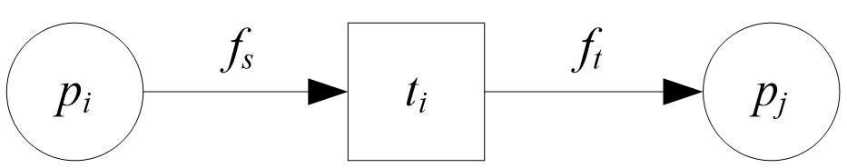
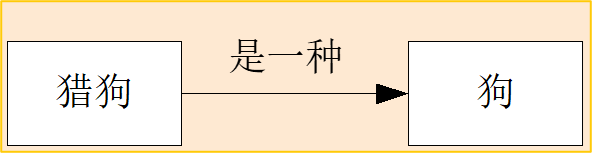

# 人工智能导论

## 第二章 知识工程

- 2.1 概述
- 2.2 知识表示方法
- 2.3 知识获取与管理
- 2.4 基于知识的系统

### 2.1概述

#### 1、什么是知识？
- 费根鲍姆（Feigenbaum）：
知识是经过裁剪，塑造，解释，选择和转换了的信息。
- 伯恩斯坦（Bernstein）：
知识是由特定领域的描述，关系和过程组成的。
- 海叶斯—罗斯（Heyes-Roth）：
知识=事实+信念+启发式。

一般来说，把有关信息关联在一起所形成的**信息结构**称为知识。
知识反映了客观世界中事物之间的关系，不同事物或者相同事物间的不同关系形成了不同的知识。

例如：
- 冬天会下雪。
- 如果冬天来了，那么春天还会远吗。

#### 2、知识的特性
- 相对正确性
	- 例如：1＋1＝10在不同的进制下有不同的正确性。
- 不确定性
	- 知识并不总是只有“真”和“假”两种状态。引起知识不确定性的原因有：
         - 随机性：我有八成的把握打中目标。
         - 模糊性：高个子适合于打篮球。
         - 不完全性：莲花清瘟对新冠病毒有一定功效。
         - 经验性：土干了就给花浇水。
- 可表示性与可利用性

#### 3、知识表示分类
- 就知识的**形成**而言，知识是由概念、命题、公理、定理、规则、方法等组成。
- 就知识的**层次**而言，知识可以分为表层知识和深层知识。
- 就知识的**确定性程度**而言，知识可以分为确定性知识和不确定性知识。
- 就知识的**等级**而言，知识可以分为元知识和非元知识。
- 就知识的**作用**而言，知识可以分为陈述性知识和过程性知识。
  - 陈述性知识
    - 显式表示
    - 描述客观事物所涉及的对象以及对象之间的联系。
  - 过程性知识
    - 隐含在程序之中
    - 表示如何做的
    - eg.矩阵求逆程序，程序中描述了矩阵的逆和求解方法的知识

#### 4、人工智能对知识表示方法的要求
- 知识表示方法要有较强的表达能力和足够的精细程度
   - 表示能力。
   - 可理解性。
   - 自然性。
- 从知识利用上讲
   - 便于获取和表示新知识，并以合适方式与已有知识相连接。   
   - 便于搜索，在求解问题时，能够较快地在知识库中找出有关知识。因此，知识库应具有较好的记忆组织结构。    
   - 便于推理，要能够从已有知识中推出需要的答案或结论。 
- 混合知识表示为人工智能提供了新的研究课题 

### 2.2知识表示方法

#### 2.2.1经典逻辑表示法
把数学中的逻辑论证进行符号化，使人们能够采用数学演绎的方式。

#### 一阶谓词逻辑表示法
用谓词公式表示知识时，需要首先**定义谓词**，指出每个谓词的确切语义，然后再用连接词把有关的**谓词连接**起来，**形成一个谓词公式**表达一个完整的意义。

例如：
姚明比他父亲有名。
- 首先，定义谓词：
- Famous(x,y): x比y有名。
- 然后用谓词公式表示：
- Famous(Yaoming,father(Yaoming))

#### 2.2.2 产生式表示法
目前已经成为人工智能中应用最多的一种知识表示方法。

产生式通常用于表示具有因果关系的知识，其基本形式是：

	P→Q
	或者
	If	P Then  Q	[Else   S]

其中，P是前件，用于指出该产生式是否可用的条件。Q是一组结论或者操作，用于指出当前提P满足时，应该得出的结论或者应该执行的操作。

例如：
- 手被扎→缩手
- 下雨→地面湿
- 下雨∧甲未打伞→甲被淋湿
- 所有人都会死∧甲是人→甲会死

#### 产生式与谓词逻辑蕴含式的区别：
- 谓词逻辑蕴含式只能表示精确知识；而产生式不仅可以表示精确知识，还可以表示不精确知识。
- 产生式中前提条件的匹配可以是精确的，也可以是非精确的；而谓词逻辑蕴含式总要求精确匹配。

**一个产生式系统一般由三部分组成：规则集、黑板、控制策略。**


正向推理的一般步骤:
- 第一步 用黑板中的事实与可用规则集中所有规则的前件进行匹配，得到匹配的规则集合。
- 第二步 从匹配规则集合中选择一条规则作为使用规则。
- 第三步 执行使用规则，将该使用规则后件的执行结果送入黑板；并将已执行规则从可用规则集中删除。
- 第四步 重复这个过程，直到达到目标或者无可匹配规则为止。

动物识别的例子——正向推理

已知事实：一动物{有毛，吃草，黑条纹，哺乳类，有蹄类，斑马}
- **R1：动物有毛 → 哺乳类**
- R2：动物产奶 → 哺乳类 
- R3：哺乳类 ∧ 吃肉 → 食肉类 
- **R4：哺乳类 ∧ 吃草 → 有蹄类**
- R5：食肉类 ∧ 黄褐色 ∧ 有斑点→ 猎狗 
- R6：食肉类 ∧ 黄褐色 ∧ 黑条纹→ 虎 
- R7：有蹄类 ∧ 长脖 → 长颈鹿 
- **R8：有蹄类 ∧ 黑条纹 → 斑马**

逆向推理的一般步骤：
- 第一步 用假设的目标事实与规则集中的规则后件进行匹配，得到匹配的规则集合。
- 第二步 从匹配规则集合中选择一条规则作为使用规则。
- 第三步 将使用规则的前件作为新的假设子目标送入黑板；并将已执行规则从可用规则集中删除。
- 第四步 重复这个过程，直至各子目标均为已知事实或者无可匹配规则为止。 

#### 规则匹配：
- 精确匹配
  - 要求各项事实与规则前件（或者后件）中的各子条件完全一致，或者经过**符号代换**之后完全一致 

- 不精确匹配
  - 事实和规则前件（或者后件）不必完全一致，二者只要达到某种程度的匹配就可以了。 

#### 冲突消解
- 从多条可用规则之中选取一条作为当前执行规则。思路就是给所有可用规则**排序，然后依次从队列中取出候选规则。
- 通用的方法
   - 专用与通用性排序
   - 规则排序
   - 数据排序
   - 规模排序
   - 就近排序
   - 按上下文限制将规则分组
- 对包含启发式的推理
   - 成功率高的规则优先执行
   - 按规则先前执行的性能/代价比排序

**产生式表示法的特点：**
- 产生式易于表示，且知识单元间相互独立，易于建立知识库。
- 推理方式单纯，适于模拟强数据驱动特点的智能行为。
- 知识库与推理机相分离。这种结构易于修改知识库。
- 易于对系统的推理路径作出解释。

#### 2.2.3 层次结构表示法
层次结构表示法主要指框架表示法和面向对象表示法。 
#### 1、框架理论
1975年美国著名的人工智能学者明斯基在其论文“A framework for representing knowledge”中提出了框架理论，并把它作为理解视觉、自然语言对话及复杂行为的基础。

#### 2、框架结构
框架是一种描述所论对象(一个事物、一个事件或一个概念)属性的数据结构。
一个框架由若干个“槽”组成，一个槽又可划分为若干个“侧面”。一个槽用于描述所论对象某一方面的属性，一个侧面用于描述相应属性的一个方面。

一个框架的例子                                                             

```
框架名：<教师>
	姓名：单位(姓、名)
	年龄：单位(岁)
	性别：范围(男、女)
		   缺省：男
	职称：范围(教授、副教授、讲师、助教)
		   缺省：讲师
	部门：单位(系，教研室)
	住址：<住址框架>
	工资：<工资框架>
	开始工作时间：单位(年、月)
	截止时间：单位(年、月)
		  缺省：现在
```

框架之间的联系:
- 框架中的槽值或侧面值都可以是另外一个框架，也就是说框架之中还可以包含框架。这就在框架之间建立起了联系。这种联系是一种包含关系，称为横向联系。
- 框架之间还可以有继承关系，称为纵向联系。框架中可以有“继承”槽，指明上下关系。

一个框架网络的例子：
		
		
#### 3、框架表示下的推理：
在用框架表示知识的系统中，求解问题主要通过匹配与填槽实现，称为基于案例的推理（CBR）。
- 首先把这个问题用一个框架表示出来；
- 然后与知识库中已有的框架进行匹配，找出一个或者多个可匹配的预选框架作为初步假设；
- 在初步假设的引导下收集进一步的信息；
-最后用某种评价方法对预选框架进行评价，决定是否接受。

框架的匹配是通过对相应槽的槽名及槽值逐个进行比较实现的。
		
#### 2.2.4 网络结构表示法
#### 1. Petri网		
Petri网由德国学者卡尔·A·佩特里（Cah Abam Petri）在1962年首先提出。



基本的Petri网可用三元组（P, T, F）来表示。
- P（Place）表示位置集合，一般表示事物属性或状态
- T（Transition）表示转换集合，表示从一种状态转变为另一种状态
- F表示有向弧集合，用于指明转换的方向，有向弧只能存在于P和T或者T和P之间

在并发系统中，一个位置可以拥有多个令牌（Token），用于进行并发控制 

Petri网表示法的特点：
- 便于描述系统状态的变化以及对系统动态特性进行分析；
- 可以在不同层次上变换描述，而不必注意细节及相应的物理表示。 
		

#### 2. 语义网络		
结构：


语义网络是通过概念及其语义关系来表达知识的一种网络图。

从图论的观点看，它就是一个“带标识的有向图”。有向图的节点表示各种事物、概念、情况、属性、状态动作等等。弧表示各种语义联系，也称为联想弧。
	
eg.



特点：
- 结构性 
- 联想性
- 直观性
- 非严格性
- 处理复杂性

#### 2.2.5其他表示法
- 脚本表示法
   - 夏克（R．C．Schank）根据他的概念依赖理论提出的一种知识表示方法。脚本与框架类似，由一组槽组成，用来表示特定领域内一些事件的发生序列。 
- 过程表示法
   - 认为知识主要是过程性的。其表示方法应将知识及如何使用这些知识的控制性策略均表述为求解问题的过程。 
过程性表示方法着重于对知识的利用，它把与问题有关的知识以及如何运用这些知识求解问题的控制策略都表述为一个或多个求解问题的过程。 

### 2.3 知识获取与管理
#### 2.3.1 知识获取的任务
- 获取知识，建立起健全、完善、有效的知识库，以满足求解领域问题的需要。 
- 抽取知识
- 转换知识
- 输入知识
- 检测知识

#### 2.3.2 知识获取方式
非自动知识获取

自动知识获取


#### 2.3.3知识管理的任务
- 指具体地、物理地组建知识库，保存知识；
- 在知识库中安排具体的知识；
- 实现知识的增加、删除、修改、查询等功能；
- 记录知识库的变更；
- 保证知识库的安全。

组建知识库：
应该注意以下基本原则 
- 知识库具有相对独立性
- 便于对知识的搜索
- 便于对知识进行维护及管理
- 对知识的增、删、改、查。
- 便于存储用多种模式表示的知识

知识管理的其它重要功能 
- 重组知识库
- 记录系统运行的实例
- 记录系统的运行史
- 记录知识库的发展史
- 知识库的安全保护与保密

#### 2.3.4本体论
在人工智能领域，本体是关于概念化的明确表达。本体论研究特定领域知识的对象分类、对象属性和对象间的关系，为描述领域知识提供术语。 

#### 本体论的性质：
- 本体描述的是客观事物的存在。
- 本体独立于对本体的描述。
- 本体独立于个体对本体的认识。
- 本体本身不存在与客观事物的误差。
   - 因为它就是客观事物的本质所在。
   - 但对本体的描述，即以任何形式或自然语言写出的本体，作为本体的一种投影，可能会与本体本身存在误差。
- 描述的本体代表了人们对某个领域的知识的公共观念。
    - 这种公共观念能够被共享、重用，进而消除不同人对同一事物理解的不一致性。
- 对本体的描述应该是形式化的、清晰的、无歧义的。 

#### 本体论的作用：
目的：为了实现某种程度的知识共享和重用。 
- 人与组织之间的信息交流。
- 系统之间的互操作。
- 需求分析和系统设计的基础。
- 支持知识重用。
- 显式定义对领域的认识。
- 将领域知识同使用领域知识的操作性知识分离开来。


#### 根据本体在主题上的不同层次:
- 顶级本体
（Top Level Ontology）
- 领域本体
（Domain Ontology）
- 任务本体
（Task Ontology）
- 应用本体
（Application Ontology） 

#### 2.3.5知识图谱
知识图谱是一种揭示实体之间关系的语义网络，可以对现实世界的事物及其相互关系进行形式化地描述。

知识图谱一般用三元组来表示：
G=(E, R, S)
- G是知识图谱，
- E是知识库中的实体集合，
- R是知识库中的关系集合，
- S⊆E×R×E代表知识库中的三元组集合。

三元组的基本形式主要包括
- （实体1，关系，实体2）
- （概念，属性，属性值）

其中，
- 实体是知识图谱中的基本元素，不同实体间存在不同关系。
- 概念主要指集合、类别、对象类型、事物的种类等。
- 属性指对象可能具有的属性、特征、特性、特点以及参数等。
- 属性值是指对象指定属性的值。
- 属性-属性值对(attribute-value pair)可用来刻画实体的内在特性。
- 关系可用来连接两个实体，刻画它们之间的关联。

#### 知识图谱的逻辑结构
在逻辑上可分为数据层和模式层
数据层主要由一系列事实组成，知识以事实为单位进行存储。
如用三元组来表达事实，则可选择图数据库作为存储介质，例如开源的Neo4j、Twitter的FlockDB等等。
模式层构建在数据层之上，主要是通过本体库来规范数据层的一系列事实表达。
本体是结构化知识库的概念模板
通过本体库而形成的知识库不仅层次结构较强，并且冗余程度较小

#### 知识图谱的体系结构
指其构建模式。
主要有**自顶向下(top-down)** 与 **自底向上(bottom-up)** 两种构建方式。
- 自顶向下是指先为知识图谱定义好本体与数据模式，再将实体加入到知识库。
   - 该构建方式需要利用一些现有的结构化知识库作为其基础知识库。
   - 例如Freebase项目就是采用这种方式，它的绝大部分数据是从维基百科中得到的。
- 自底向上是指从一些开放链接数据中提取出实体，选择其中置信度较高的加入到知识库，然后再构建顶层的本体模式。

知识抽取
知识融合
知识图谱上的推理

### 2.4 基于知识的系统
#### 知识系统
一类具有专门知识和经验的计算机系统，并通过对人类知识和问题求解过程的建模，采用知识表示和知识推理技术来模拟通常由人类解决的复杂问题。

**知识系统与一般计算机系统的主要区别：**
基于知识的系统以知识库和推理机为核心。知识系统把知识与系统其它部分分离开，并且知识系统强调知识而不是方法。

#### 建造一个知识系统的过程可以称为“知识工程”。 
知识工程包括以下几个方面：
获取系统所用的知识，即知识获取。
选择合适的知识表示形式，即知识表示。
设计知识库和推理机。
用适当的计算机语言实现系统。
常见的知识系统有：
专家系统（Expert System）
智能决策支持系统（Intelligent Decision Support System）
计算机辅助诊断系统（Computer Aided Diagnostic System）
自动问答系统（Question Answering System）
…… 

#### 知识系统的特点：
- 启发性   
- 灵活性
   - 一般知识系统的体系结构都采用了知识库与推理机分离的原则。
- 交互性
   - 知识系统一般采用交互方式进行人机通信。
- 实用性
   - 知识系统是根据具体应用领域的问题开发的，针对性强。
- 易推广
   - 知识系统使人类专家的领域知识突破了时间和空间的限制，使专家的知识和技能更易于推广和传播。 

#### 专家系统
#### 问答系统