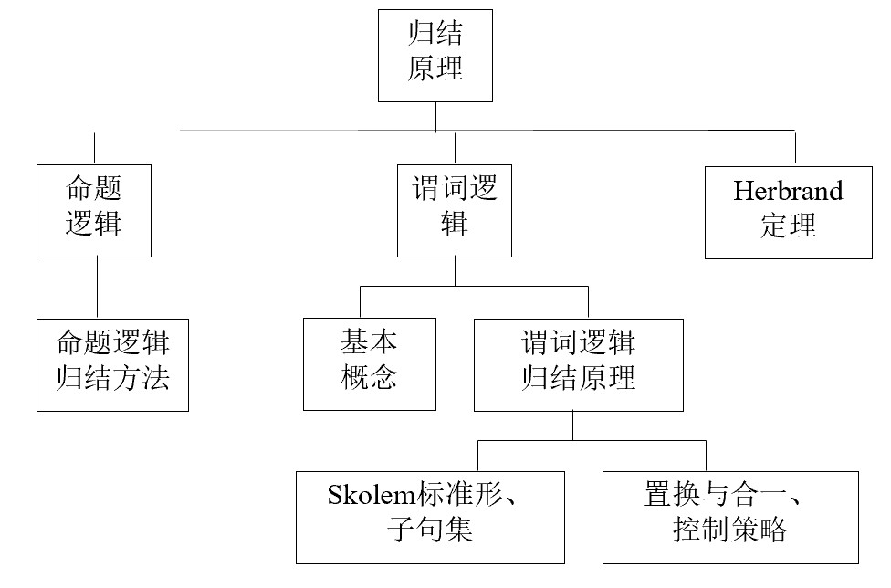

# 人工智能导论

## 第三章 确定性推理
- 命题逻辑
- 谓词逻辑
- 谓词逻辑归结原理
- Herbrand定理

### 3.1命题逻辑

#### 命题
- 能判断真假（不是既真又假）的陈述句。
- 简单陈述句描述事实、事物的状态、关系等性质。
- 
eg：
- 1．  1+1=2
- 2．  雪是黑色的。
- 3．  北京是中国的首都。
- 4．  到冥王星去渡假。

#### 命题公式
- 合取式：p与q，记做p Λ q
- 析取式： p或q，记做p ∨ q
- 蕴含式： 如果p则q，记做p → q
- 等价式：p当且仅当q，记做p <=> q

#### 命题公式的分类：
- 若A无成假赋值，则称A为**重言式或永真式**；
- 若A无成真赋值，则称A为**矛盾式或永假式**；
- 若A至少有一个成真赋值，则称A为**可满足**的；
- **析取范式**：仅由有限个简单合取式组成的析取式。
- **合取范式**：仅由有限个简单析取式组成的合取式。

#### 基本等值式
- 交换律：
  - p∨q <=> q ∨p 
  - p Λ q <=> q Λp 
- 结合律： 
  - (p∨q) ∨ r<=> p∨(q ∨r);
  - (p Λ q) Λ r<=> p Λ(q Λ r)
- 分配律： 
  - p∨(q Λ r) <=> (p∨q)Λ(p ∨r) ；
  - p Λ(q ∨ r) <=> (p Λ q) ∨(p Λ r) 
- 摩根律:
  -  ～ (p∨q) <=> ～ p Λ ～ q ；
  - ～ (p Λq) <=> ～ p ∨ ～ q 
- 吸收律:
  - p∨(pΛq ) <=> p ；
  - p Λ(p∨q ) <=> p 
- 同一律: 
  - p∨0 <=> p ；
  - pΛ1 <=> p 
- 蕴含等值式:
  - p → q <=> ～ p∨q 
- 假言易位式: 
  - p → q <=> ～q → ～p

#### 常用推理规则：
- 附加：A = > ( A ∨ B)
- 简化：( A ∧ B ) = > A
- 假言推理：( ( A → B) ∧ A) = > B
- 拒取式：( ( A → B) ∧ ～ B) = > ～ A
- 析取三段论：( ( A ∨ B) ∧ ～ A) = > B
- 假言三段论：( ( A → B) ∧ ( B → C) ) = > ( A → C)
- 等价三段论：( ( A \ B) ∧ ( B \ C) ) = > ( A \ C)
- 构造性二难：( A → B) ∧ ( C → D) ∧ ( A ∨ C) = > ( B ∨ D)
- 前提引入
- 结论引入
- 置换

#### 归结法：
##### 合取范式：仅由有限个简单析取式构成的合取式， 如：
	PΛ（ P∨Q）Λ（ ～P∨Q）
##### 子句集S：合取范式形式下的所有子句（元素）的集合， 如：
    S = {P, P∨Q, ～P∨Q}

##### 归结式：消除互补对→得到归结式
    子句：C1= ～P ∨ Q, C2= P
    归结式：Q

##### 归结过程 
- 建立待归结的命题公式
- 将命题写成合取范式
- 求出子句集S
- 对子句集使用归结推理规则
- 归结式作为新子句参加归结
- 归结式为空子句□ ，S是不可满足的（矛盾），原命题成立。

**例题：**
    证明公式：(P → Q) → (～Q → ～P)

**证明：**

    （1）根据归结原理，将待证明公式转化成待归结命题公式：
			(P → Q) ∧～(～Q → ～P)
    （2）分别将公式前项化为合取范式：
			P → Q ＝ ～P ∨ Q
		结论求～后的后项化为合取范式：
			～(～Q → ～P)＝ ～(Q∨～P) ＝ ～Q ∧ P
		两项合并后化为合取范式：
		（～P ∨ Q）∧～Q ∧ P
    （3）则子句集为：
			{ ～P∨Q，～Q，P}
    子句集为：	{ ～P∨Q，～Q，P}
    （4）对子句集中的子句进行归结可得：
        1.～P∨Q
        2.～Q
        3.P
        4.Q（1，3归结）
        5.□ （2，4归结）	
    由上可得原公式成立。

### 3.2谓词逻辑

#### 基本概念
一阶谓词逻辑

**基本概念（1）**
- 个体词：表示主语的词
- 谓词：刻画个体性质或个体之间关系的词
- 量词：表示数量的词

        小王(个体词)  是个工程师(谓词)。
	    8是个自然数。
	    我去买花。
	    小丽和小华是朋友。
其中
- “小王”、“工程师”、“我”、“花”、“8”、“小丽”、“小华”都是个体词，
- “是个工程师”、“是个自然数”、“去买”、“是朋友”都是谓词。

**基本概念（2）**
- 个体常量：a,b,c
- 个体变量：x,y,z
- 谓词符号：P,Q,R
- 量词符号： ∃ ,∀

例如：

        （1）所有的人都是要死的。
        （2） 有的人活到一百岁以上。
        在个体域D为人类集合时，可符号化为：
        （1）∀xP(x)，其中P(x)表示x是要死的。
        （2）∃x Q(x), 其中Q(x)表示x活到一百岁以上。
        引入谓词R(x)表示x是人，可符号化为：
        （1）∀x（R(x) → P(x)）, 
    	其中，R(x)表示x是人；P(x)表示x是要死的。
        （2）∃x（R(x) ∧ Q(x)），
    	其中，R(x)表示x是人；Q(x)表示x活到一百岁以上。 

#### 谓词演算与推理
- 量词否定等值式：
   - ～(∀ x) M(x) <=> ( ∃ y ) ～ M(y) 
   - ～(∃ x ) M(x) <=> ( ∀ y ) ～ M(y)
- 量词分配等值式：
   - (∀ x )( P(x) ΛQ(x)) <=> (∀ x ) P(x) Λ (∀ x ) Q(x)
   - (∃ x )( P(x) ∨ Q(x)) <=> (∃ x ) P(x) ∨ (∃ x ) Q(x)
- 消去量词等值式：设个体域为有穷集合(a1, a2, …an)
   - (∀ x ) P(x) <=> P( a1 ) Λ P( a2 ) Λ …Λ P( an )
   - (∃ x )P(x) <=> P( a1 ) ∨ P( a2 ) ∨ … ∨ P( an )

- 量词辖域收缩与扩张等值式：
   - (∀ x )( P(x) ∨ Q) <=> (∀ x ) P(x) ∨ Q
   - (∀ x )( P(x) Λ Q) <=> (∀ x ) P(x) Λ Q 
   - (∀ x )( P(x) → Q) <=> (∃ x ) P(x) → Q 
   - (∀ x )(Q → P(x) ) <=>Q → (∀ x ) P(x) 
   - (∃ x )( P(x) ∨ Q) <=> (∃ x ) P(x) ∨ Q
   - (∃ x )( P(x) Λ Q) <=> (∃ x ) P(x) Λ Q 
   - (∃ x )( P(x) → Q) <=> (∀ x ) P(x) → Q 
   - (∃ x )(Q → P(x) ) <=>Q → (∃ x ) P(x)

### 谓词逻辑归结原理

**前束范式**

	定义：A是一个前束范式，如果A中的一切量词都位于该公式的最左边（不含否定词），且这些量词的辖域都延伸到公式的末端。 
	即： 把所有的量词都提到前面去(Q1x1)(Q2x2)…(Qnxn)M(x1,x2,…,xn)

- 前束范式中消去所有的量词，称这种形式的谓词公式为**Skolem标准型**。
- 任何一个谓词公式都可以化为与之对应的Skolem标准型。
- Skolem标准型不唯一。
- 量词消去原则：消去存在量词“∃”，略去全称量词“∀”。
- 注意：左边有全称量词的存在量词，消去时该变量改写成为全称量词的函数；如没有，改写成为常量。 

        例:将下式化为Skolem标准型：
        ～(∀x)(∃y)P(a, x, y) →(∃x)(～(∀y)Q(y, b)→R(x))
        解：第一步，消去→号，得：
        ～(～(∀x)(∃y)P(a, x, y)) ∨(∃x) (～～(∀y)Q(y, b)∨R(x))
        第二步，～深入到量词内部，得：
        (∀x)(∃y)P(a, x, y) ∨(∃x) ((∀y)Q(y, b)∨R(x))
        第三步，变元易名，得
        (∀x)((∃y)P(a, x, y) ∨(∃u) (∀ v)(Q(v, b) ∨R(u)))
        第四步，存在量词左移，直至所有的量词移到前面，得：
        (∀x)  (∃y) (∃u) (∀ v)P(a, x, y) ∨(Q(v, b) ∨R(u))
        由此得到前述范式
        第五步，消去“∃”（存在量词），略去“∀”（全称量词）
        消去(∃y)，因为它左边只有(∀x)，所以使用x的函数f(x)代替之，这样得到：
        (∀x) (∃u) (∀ v)( P(a, x, f(x)) ∨Q(v, b) ∨R(u))
        消去(∀u)，同理使用g(x)代替之，这样得到：
        (∀x) (∀ v) ( P(a, x, f(x)) ∨Q(v, b) ∨R(g(x)))
        略去全称变量，原式的Skolem标准型为：
        P(a, x, f(x)) ∨Q(v, b) ∨R(g(x))

任意一个谓词公式G，都可以通过Skolem标准型建立起一个与之对应的**子句集**。
子句集S的求取：

        G → 前束范式
          → SKOLEM标准形
          → 以“，”取代“Λ”，并表示为集合形式 

**定理：**
若G是给定的谓词公式，S是相应的子句集，则：G是不可满足的<=> S是不可满足的。
- G与S不等值，但在不可满足的意义下是一致的。
- G真不一定S真，而S真必有G真。即： S => G

**置换**：可以简单的理解为是在一个谓词公式中用置换项去置换变量。
- 定义：
	- 置换是形如{t1/x1, t2/x2, …, tn/xn}的有限集合。其中，x1, x2, …, xn是互不相同的变量，t1, t2, …, tn是不同于xi的项（常量、变量、函数）；ti/xi表示用ti置换xi，并且要求ti与xi不能相同，而且xi不能循环地出现在另一个ti中。
- 例如
  
        {a/x，c/y，f(b)/z}是一个置换。
	    {g(y)/x，f(x)/y}不是一个置换， 

**合一**（可以简单地理解为“寻找相对变量的置换，使两个谓词公式一致”。）
- 定义：
   - 设有公式集F＝{F1，F2，…，Fn}，若存在一个置换，可使F1θ ＝F2θ ＝…= Fnθ ，则称θ 是F的一个合一。同时称F1，F2，... ，Fn是可合一的。
- 例：
	- 设有公式集F＝{P(x, y, f(y)), P(a,g(x),z)}，则＝{a/x, g(a)/y, f(g(a))/z}是它的一个合一。

**归结原理**

方法：
- 和命题逻辑一样，消去互补对。
- 但由于有函数，所以要考虑置换和合一。

        设有两个子句C1=P(x)∨Q(x), C2= ¬P(a)∨R(y)

        由于P(x)与P(a)不同，所以C1与C2不能直接进行归结。
        但是若用最一般合一：σ={a/x}
        对两个子句分别进行代换：
        C1σ =P(a)∨Q(a)
        C2σ = ¬P(a)∨R(y)
        就可对它们进行归结，得到归结式：
        Q(a)∨R(y)

        假设任何通过计算机考试并获奖的人都是快乐的，任何肯学习或幸运的人都可以通过所有的考试，张不肯学习但他是幸运的，任何幸运的人都能获奖。求证：张是快乐的。
         解：先将问题用谓词表示如下：
        R1:“任何通过计算机考试并获奖的人都是快乐的”
            (∀x)((Pass(x, computer)∧Win(x, prize))→Happy(x))
        R2:“任何肯学习或幸运的人都可以通过所有考试”
            (∀x)(∀y)(Study(x)∨Lucky(x)→Pass(x, y))
        R3:“张不肯学习但他是幸运的”
            ～Study(zhang)∧Lucky(zhang)
        R4:“任何幸运的人都能获奖”
            (∀x)(Lucky(x)→Win(x,prize))
        结论：“张是快乐的”的否定
        ～Happy(zhang)

        由R1及逻辑转换公式:P∧W→H = ～（P∧W）∨ H ，可得
                    (1)～Pass(x, computer)∨～Win(x, prize)∨Happy(x)
        由R2：   (2)～Study(y)∨Pass(y,z)
                        (3)～Lucky(u)∨Pass(u,v)
        由R3：   (4)～Study(zhang)
                    (5)Lucky(zhang)
        由R4：  (6)～Lucky(w)∨Win(w，prize)
        由结论：(7)～Happy(zhang)	（结论的否定）
        (8)～Pass(w, computer)∨Happy(w)∨～Lucky(w)  (1)(6)，{w/x}
        (9)～Pass(zhang, computer)∨～Lucky(zhang)       (8)(7)，{zhang/w}
        (10) ～Pass(zhang, computer)                   	  (9)(5)
        (11)  ～Lucky(zhang)		          (10)(3)，{zhang/u, computer/v}
        (12)  □  			        (11)(5) 

（看不懂后面的了已经。。。）
### Herbrand定理
Herbrand的思想
定义：
	公式G永真：对于G的所有解释，G都为真。
思想：
	寻找一个已给的公式是真的解释。然而，如果所给定的公式的确是永假的，就没有这样的解释存在，并且算法在有限步内停止。 
- H域
- H解释
- 语义树
- 结论：Herbrand定理

