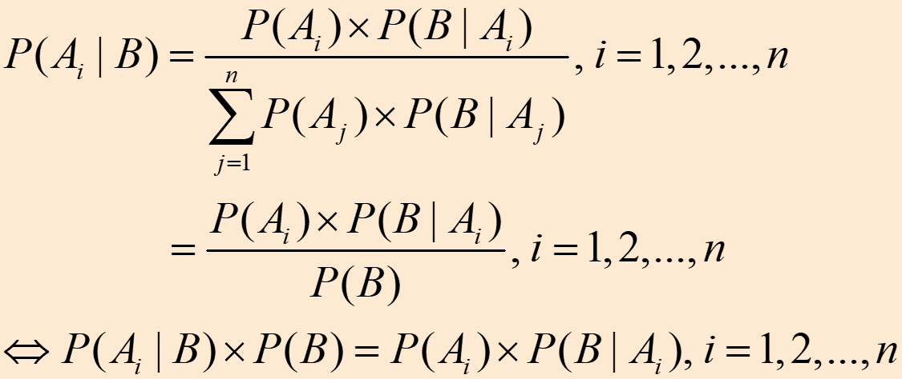

# 人工智能导论
## 第四章 不确定性推理

- 4.1 概述
- 4.2 基本概率方法
- 4.3 主观贝叶斯方法
- 4.4 可信度方法
- 4.5 模糊推理
- 4.6 证据理论
- 4.7 粗糙集理论

### 4.1 概述
#### 1. 不确定性推理是建立在非经典逻辑基础上的一种推理，它是对不确定性知识的运用与处理。

不确定性推理就是
- 从不确定性的初始证据出发，
- 通过运用不确定性的知识，
- 最终推出具有一定程度的不确定性但却是合理或者近乎合理的结论的思维过程。

引起知识不确定性的原因主要有：
- 不完全性：这种药可能会治疗COVID-19。
- 经验性：朝霞不出门，晚霞行千里。
- 概率性：我有八成的把握打中目标。
- 模糊性：高个子适合于打篮球。

#### 2. 不确定性推理的基本问题
##### (1) 不确定性的表示
不确定性推理中的“不确定性”一般分为两类：
- 知识的不确定性
- 证据的不确定性

知识不确定性的表示：静态强度、可信度。

证据不确定性的表示：动态强度。

不确定性的度量：事先规定取值范围，使每个数据都有明确的意义。
##### (2) 不确定性匹配算法
设计一个不确定性匹配算法；
指定一个匹配阈值。
##### (3) 组合证据的不确定性
在匹配时，一个简单条件对应于一个单一的证据，一个复合条件对应于一组证据，称这一组证据为**组合证据**。

        常用的组合证据不确定性计算方法有：
        最大最小法：
            T(E1 AND E2)=min{T(E1),T(E2)}
            T(E1 OR E2)=max{T(E1),T(E2)}
        概率法：
            T(E1 AND E2)=T(E1)×T(E2)
            T(E1 OR E2)=T(E1)＋T(E2)－T(E1)×T(E2)
        有界法：
            T(E1 AND E2)=max{0,T(E1)＋T(E2)－1}
            T(E1 OR E2)=min{1,T(E1)＋T(E2)}
        其中，T(E)表示证据E为真的程度，如可信度、概率等。
##### (4) 不确定性的传递算法
- 在每一步推理中，如何把证据及知识的不确定性传递给结论。
- 在多步推理中，如何把初始证据的不确定性传递给最终结论。
##### (5) 结论不确定性的合成
用不同知识进行推理得到了相同结论，但不确定性的程度却不同。此时，需要用合适的算法对它们进行合成。

#### 3. 不确定性推理方法分类
模型法
控制法

### 4.2 基本概率方法

概率论基础（简略）
- 古典概型：P(A) = m/n（样本空间共有n个基本事件，事件A中含有m个基本事件）

- 统计概型

- 条件概型:如果在事件B发生的条件下考虑事件A发生的概率，就称它为事件A的条件概率，记为P(A|B)。

#### 全概率公式
定理4.1 设事件A1,A2,…,An，满足：
- (1)两两互不相容，即当i≠j时，有Ai∩Aj=Φ；
- (2)P(Ai)>0 (1≤i≤n)
- (3)
  
则对任何事件B有下式成立：

#### 贝叶斯定理：（条件同上）

基于Bayes公式进行推理：

如果用产生式规则

    IF	E THEN Hi
中的前提条件E代替Bayes公式中的B，用Hi代替公式中的Ai ，就可得到：

逆概率方法举例：

    设H1,H2,H3分别是三个结论，E是支持这些结论的证据。已知：
    P(H1)=0.3, 		P(H2)=0.4, 		P(H3)=0.5
    P(E|H1)=0.5, 	P(E|H2)=0.3, 	P(E|H3)=0.4
    求P(H1|E),P(H2|E)及P(H3|E)的值各是多少？
解：

同理可得： P(H2|E)=0.26, P(H3|E)=0.43

#### 贝叶斯网络
表示不确定性专家知识和推理的一种流行的方法。
- 一系列变量的联合概率分布的图形表示。
- 一个表示变量之间的相互依赖关系的数据结构。
- 图论与概率论的结合。

两个部分:
- 贝叶斯网络结构图
  - 这是一个有向无环图（DAG: Directed Acyclic Graph），其中图中的每个节点代表相应的变量。当有向弧由节点A指向节点B时，则称：A是B的父节点；B是A的子节点。
- 节点和节点之间的条件概率表（Conditional Probability Table, CPT），也就是一系列的概率值，表示了局部条件概率分布。P(node|parents) 。

    例子：
    命题S(smoker)：该患者是一个吸烟者
    命题C(coal Miner)：该患者是一个煤矿矿井工人
    命题L(lung Cancer)：他患了肺癌
    命题E(emphysema)：他患了肺气肿
    由专家给定的假设可知，命题S对命题L和命题E有因果影响，而C对E也有因果影响。命题之间的关系可以描绘成因果关系网。每一个节点代表一个证据，每一条弧代表一条规则（假设），连接结点的弧表达了由规则给出的节点间的直接因果关系。

#### 联合概率：P(X1, X2, …, XN)
- 如果相互独立： 
          P(X1, X2, …, XN) = P(X1) P(X2) …P(XN)
- 条件概率：
  P(X1, X2, …, XN) = P(X1|X2, …, XN) P(X2, …, XN)
- 迭代表示：
P(X1, X2, …, XN) = P(X1) P(X2| X1) P(X3| X2X1)…P(XN|XN-1, …, X1) = P(XN) P(XN-1| XN) P(XN-2| XN-1XN)…P(X1|X2, …, XN)

#### 独立性：
- 相互独立：如果X与Y相互独立，则
  
        P(X,Y) =  P(X)P(Y)
        P(X|Y) = P(X)
- 条件独立：
  - 如果在给定Z的条件下，X与Y相互独立，则
  
              P(X|Y, Z) = P(X|Z)
  - 对于X, Y, E: X与Y在给定E的条件下独立

        P(X|Y,E) = P(X|E)
        P(Y|X,E) = P(Y|E)
  - 多个变量：D分离（d-separate）
   
        P(X1,X2,…,Xn|Y1,Y2,…,Ym,E1,E2,…,Ep) 
        =P(X1,X2,…,Xn|E1,E2,…,Ep) 

**D分离**是一种寻找条件独立的有效方法。

定义：

对于给定的结点集ε，如果对贝叶斯网中的结点Vi和Vj之间的每个无向路径（即不考虑DAG图中弧的方向性的路径），在路径上都有某个结点Vb，如果有属性：
- Vb在ε中，且路径上的两条弧都以Vb为尾（即弧在Vb处开始（出发），分叉连接）
- Vb在ε中，路径上的一条弧以Vb为头，一条以Vb为尾（串行连接）
- Vb和它的任何后继都不在ε中，路径上的两条弧都以Vb为头（即弧在Vb处结束，汇集连接，但没有后代节点）
       
则称Vi和Vj 被Vb结点阻塞。

如果Vi和Vj被证据集合ε中的任意结点阻塞，则称Vi和Vj是被ε集合**D分离**，结点Vi和Vj条件独立于给定的证据集合ε，可形式化表示为：                       

阻塞：
给定证据集合ε，当上述条件中的任何一个满足时，就说Vb阻塞相应的那条路径。

D分离：
如果Vi和Vj之间所有的路径被阻塞，就叫证据集合ε可以D分离Vi和Vj。

条件独立：
如果证据集合ε可以D分离Vi和Vj ，就说结点Vi和Vj条件独立于给定的结点集ε。

串行

如果原因证据Z是给定的，X并不能给Y更多的东西，或者说，从X那里得到更多的信息。此时称，如果Z是已知的，那么通道就被阻塞，X和Y就是独立的了。则称X和Y是被Z节点D分离的。

分叉连接

如果，父节点Z是已知的，没有更多的信息能够通过Z影响到所有子节点。同理，父节点Z是已知时，子节点X, …, N是相互独立的。称子节点X, …, N是被Z节点D分离的。 

汇集

如果不从父节点得到推断，子节点Z就一无所知，那么，父节点是相互独立的，它们之间没有相互影响。
如果，某事件影响了Z，那么，各个父节点就不是相互独立的了。该事件可以直接影响Z，也可以通过它的后代节点影响Z。这种现象称作条件依存。总之，如果子节点有了变化，或子节点的后代节点发生变化，信息是可以通过汇集连接传播的。

#### 推理分类：
推理需求：P(X|Y)
- 因果推理是从起因到征兆
    - 证据是一些起因： X是征兆， Y是起因
- 诊断推理是从征兆到起因
    - 证据是一些征兆：X是起因， Y是征兆
- 辩解推理
    - X和Y是起因，Z是两个起因的征兆。这时可以用一个起因Y解释另一个起因X。

举例（补）

### 4.3 主观贝叶斯方法
对于五个不确定性推理的基本问题，该方法定义如下：

不确定性的表示：

**知识的不确定性**

在主观Bayes方法中，知识是用产生式规则表示的，具体形式为：

        IF E THEN (LS,LN) H (P(H))
其中，
- P(H)是结论H的先验概率，由专家根据经验给出。
- LS称为充分性度量，用于指出E对H的支持程度，取值范围为[0,∞)，其定义为：
   - LS=P(E|H)/P(E|¬H)
- LN称为必要性度量，用于指出¬E对H的支持程度，取值范围为[0,∞)，其定义为：
   - LN=P(¬E|H)/P(¬E|¬H)=(1-P(E|H))/(1-P(E|¬H))
- LS和LN的值由领域专家给出，相当于知识的静态强度。

**证据的不确定性**

在主观Bayes方法中，证据的不确定性也用概率表示。对于证据E，由用户根据观察S给出P(E|S)，即动态强度。
由于主观给定P(E|S)有所困难，所以实际中可以用可信度C(E|S)代替P(E|S)。

**组合证据的不确定性**
可以采用最大最小法。
当组合证据是多个单一证据的**合取**时，即

        E=E1 AND E2 AND … AND En
则：

        P(E|S)=min{P(E1|S),P(E2|S),…,P(En|S)}

当组合证据是多个单一证据的**析取**时，即
        
        E=E1 OR E2 OR … OR En
则：
        
        P(E|S)=max{P(E1|S),P(E2|S),…,P(En|S)}
对于非“¬”运算则：
        
        P(¬E|S)=1-P(E|S)

**不确定性的传递算法:**
主观Bayes方法推理的任务就是根据初始证据E的概率P(E)及LS、LN的值，把H的先验概率P(H)更新为后验概率P(H|E)或P(H|¬E)。即

确定后验概率的方法随着证据肯定存在，肯定不存在，或者不确定而有所不同。
(三种情况的不同，补待充)

**结论不确定性的合成算法**

若有n条知识都支持相同的结论，而且每条知识的前提条件所对应的证据Ei(i=1,2,…,n)都有相应的观察Si与之对应，此时只要先对每条知识分别求出Θ(H|Si)，然后运用下述公式求出Θ(H|S1S2…Sn):
、

示例（待补充。。

#### 主观Bayes方法的特点：
优点：
- 主观Bayes方法中的计算公式大多是在概率论的基础上推导出来，具有较坚实的理论基础。
- 知识的静态强度LS及LN是由领域专家给出，避免了大量的数据统计工作。LS和LN比较全面的反映了证据与结论间的因果关系，使推出的结论有较准确的确定性。
- 主观Bayes方法不仅给出了证据肯定存在、肯定不存在时更新后验概率的方法，还给出了证据不确定时的方法，实现了不确定性的逐级传递。
  
缺点：

- 要求领域专家在给出知识时，同时给出H的先验概率P(H)，这在实践中比较困难。
- Bayes定理中关于事件间独立性的要求，使主观贝叶斯方法的应用受到限制。

### 4.4 可信度方法
根据经验对一个事物和现象为真的相信程度称为**可信度**。

**C-F模型**是基于可信度表示的不确定性推理的基本方法，其它可信度方法都是在此基础上发展起来的。

**知识不确定性的表示**

在该模型中，知识是用产生式规则表示的，其一般形式为：

        IF	E	THEN H	(CF(H,E))
其中，CF(H,E)是该条知识的可信度，称为可信度因子或规则强度，即静态强度。一般CF(H,E)∈[0, 1]。

**证据的不确定性**也用可信度因子表示。

如CF(E)=0.6
注意：
CF(H,E)表示知识的强度，即静态强度；
CF(E)表示证据的强度，即动态强度。

**组合证据的不确定性**
可采用最大最小法。
若E=E1 AND E2 AND…AND En,则
CF(E)=min{CF(E1),CF(E2),…,CF(En)}
若E=E1 OR E2 OR…OR En,则
CF(E)=max{CF(E1),CF(E2),…,CF(En)}

**不确定性的传递算法**

结论H的可信度由下式计算：
CF(H)=CF(H,E)×CF(E)

带有阈值限度的可信度模型
加权的可信度模型
前件带有不确定性的可信度模型

#### 基于可信度不确定性推理方法的特点
优点：
- 简单、直观。
  
缺点：
- 可信度因子依赖于专家主观指定，没有统一、客观的尺度，容易产生片面性。
- 可信度数字上的语义不标准。
- 随着推理延伸，可信度越来越不可靠，误差越来越大。当推理深度达到一定深度时，有可能出现推出的结论不再可信的情况。
