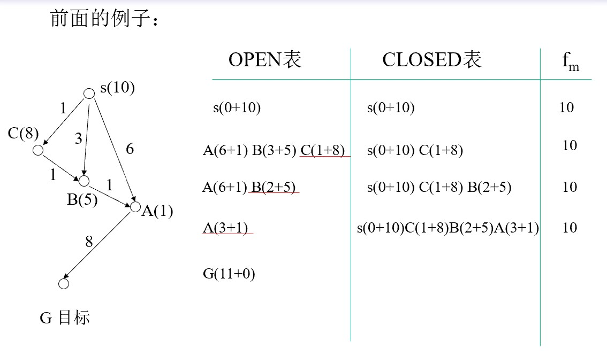

# 人工智能导论
## 第五章 搜索问题

- 5.1 回溯策略
- 5.2 图搜索策略
- 5.3 深度优先、宽度优先
- 5.4 启发式图搜索
- 5.5 博弈树搜索

### 5.1 回溯策略
例：皇后问题（不能在同一行、同一列、同一个对角线）

可行解：

回溯搜索算法：

递归过程BACKTRACK(DATA)
- DATA：当前状态。
- 返回值：从当前状态到目标状态的路径
			（以规则表的形式表示）
			或FAIL。

        1, 	IF TERM(DATA) RETURN NIL;//如果TERM(DATA)为真，则返回空值。TERM(DATA)是一个函数，用于测试数据是否达到了终止条件。
        2, 	IF DEADEND(DATA) RETURN FAIL;//如果DEADEND(DATA)为真，则返回失败。DEADEND(DATA)是一个函数，用于测试数据是否到达了无法继续搜索的死胡同。
        3, 	RULES:=APPRULES(DATA);//APPRULES(DATA)是一个函数，用于生成可能的规则列表，这些规则可以用于扩展数据。
        4,	LOOP: IF NULL(RULES) RETURN FAIL;//进入循环，如果规则列表为空，则返回失败。
        5, 	R:=FIRST(RULES);//取出规则列表中的第一个规则R。
        6,	RULES:=TAIL(RULES);//将规则列表更新为不包括第一个规则R的剩余规则。
        7,	RDATA:=GEN(R, DATA);//用规则R来扩展数据，生成新的数据RDATA。
        8,	PATH:=BACKTRACK(RDATA);//递归地调用BACKTRACK函数，传入新的数据RDATA，并将返回值存储在PATH中。
        9,	IF PATH=FAIL GO LOOP;//如果递归调用BACKTRACK返回失败，则回到循环开始。
        10,	RETURN CONS(R, PATH);//返回一个由规则R和路径PATH组成的列表，表示找到了一个解决方案。如果没有找到解决方案，则返回FAIL。

存在问题及解决办法:
问题：
- 深度问题    对搜索深度加以限制
- 死循环问题  记录从初始状态到当前状态的路径

回溯搜索算法1:

    1. DATA:=FIRST(DATALIST)
    取出数据列表DATALIST中的第一个数据，并将其存储在变量DATA中。

    2. IF MEMBER(DATA, TAIL(DATALIST))RETURN FAIL;		
    如果DATA已经出现在DATALIST的其余部分中，则返回失败。这可以防止在搜索过程中出现无限循环。

    3. IF TERM(DATA) RETURN NIL;如果DATA满足终止条件，则返回空值。

    4. IF DEADEND(DATA) RETURN FAIL;如果DATA到达了无法继续搜索的死胡同，则返回失败。

    5. IF LENGTH(DATALIST)>BOUND
    	 	RETURN FAIL;如果DATALIST的长度超过了预设的上限，返回失败。这可以防止搜索过程过于耗时。

    6. RULES:=APPRULES(DATA);用APPRULES(DATA)函数生成可能的规则列表，这些规则可以用于扩展数据。

    7. LOOP: IF NULL(RULES) RETURN FAIL;进入循环，如果规则列表为空，则返回失败。

    8. R:=FIRST(RULES);取出规则列表中的第一个规则R。

    9. RULES:=TAIL(RULES);将规则列表更新为不包括第一个规则R的剩余规则。

    10. RDATA:=GEN(R, DATA);用规则R来扩展数据，生成新的数据RDATA。

    11. RDATALIST:=CONS(RDATA, DATALIST);将新的数据RDATA添加到DATALIST的开头，生成新的数据列表RDATALIST。

    12. PATH:=BACKTRCK1(RDATALIST)递归地调用BACKTRCK1函数，传入新的数据列表RDATALIST，并将返回值存储在PATH中。

    13. IF PATH=FAIL GO LOOP;如果递归调用BACKTRCK1返回失败，则回到循环开始。

    14. RETURN CONS(R, PATH);
    返回一个由规则R和路径PATH组成的列表，表示找到了一个解决方案。如果没有找到解决方案，则返回FAIL。

回溯搜索：只保留从初始状态到当前状态的一条路径。

图搜索：保留所有已经搜索过的路径。

### 5.2 图搜索算法:
        1, G=G0 (G0=s), OPEN:=(s);
        2, CLOSED:=( );
        3, LOOP: IF OPEN=( ) THEN EXIT(FAIL);
        4, n:=FIRST(OPEN), REMOVE(n, OPEN),
            ADD(n, CLOSED);
        5, IF GOAL(n) THEN EXIT(SUCCESS);
        6, EXPAND(n)→{mi}, G:=ADD(mi, G);
        7, 标记和修改指针：
            ADD(mj, OPEN), 并标记mj到n的指针；
            计算是否要修改mk、ml到n的指针；
            计算是否要修改ml后继节点指向父节点的指针；
        8, 对OPEN中的节点按某种原则重新排序；
        9, GO LOOP；

### 5.3 深度、广度

### 5.4 启发式图搜索
*思想：定义一个评价函数f，对当前的搜索状态进行评估，找出一个最有希望的节点来扩展。*

#### A算法
评价函数的格式：

		f(n) = g(n) + h(n)
		f(n)：评价函数
		h(n)：启发函数

- g*(n)：从s到n的最小耗散值
- h*(n)：从n到g的最小耗散值
- f*(n)=g*(n)+h*(n)：从s经过n到g的最小耗散值

- g(n)、h(n)、f(n)分别是g*(n)、h*(n)、f*(n)的估计值

伪代码：

        1, OPEN:=(s), f(s):=g(s)+h(s);
        2, LOOP: IF OPEN=( ) THEN EXIT(FAIL);
        3, n:=FIRST(OPEN);
        4, IF GOAL(n) THEN EXIT(SUCCESS);
        5, REMOVE(n, OPEN), ADD(n, CLOSED);
        6, EXPAND(n) →{mi}, 
            计算f(n, mi):=g(n, mi)+h(mi);
            ADD(mj, OPEN), 标记mj到n的指针；
            IF f(n, mk)<f(mk) THEN f(mk):=f(n, mk), 
            标记mk到n的指针；
            IF f(n, ml)<f(ml) THEN f(ml):=f(n, ml),
            标记ml到n的指针, ADD(ml, OPEN);
        7, OPEN中的节点按f值从小到大排序；
        8, GO LOOP；

定义评价函数：

        f(n) = g(n) + h(n)
        g(n)为从初始节点到当前节点的耗散值
        h(n)为当前节点“不在位”的将牌数

**h(n) =4**

#### A*算法
在A算法中，如果满足条件：h(n)≤h*(n)则A算法称为A*算法。

- h1(n) = “不在位”的将牌数
- h2(n) = 将牌“不在位”的距离和

算法性质：
- 当问题有解时，A*算法一定能找到最佳路径。
- 极端情况下，若h(n)≡0，一定能找到最佳路径，此时，若g≡d，则A*算法等同于宽度优先算法。

        f*(s) = f*(t) = h*(s) = g*(t) = f*(n)
        其中s是初始节点，t是目标节点，n是s到t的最佳路径上的节点。

#### 改进：

- 对h加以限制：

- 对算法加以改进：

修正过程：

        1, OPEN:=(s), f(s)=g(s)+h(s), fm:=0;
        2, LOOP: IF OPEN=( ) THEN EXIT(FAIL);
        3, NEST:={ni|f(ni)<fm}
            IF NEST ≠ ( ) THEN n:=NEST中g最小的节点(?)
            ELSE n:=FIRST(OPEN), fm:=f(n);
        4, …, 8: 同过程A。

### 5.5 博弈树搜索
        双人
        一人一步
        双方信息完备
        零和

#### 极小极大搜索过程
评价函数：对所有棋局进行评估。
- 评价函数值大于0，对我方有利，对对方不利。
-  评价函数值小于0，对我方不利，对对方有利。
- 我方一定走评价函数值最大的一步棋。
- 对方一定走评价函数值最小的一步棋。
- 模拟人类下棋的思维过程：多看几步。
  

- 存在的问题：把搜索树的生成和估值两个过程分开进行，导致效率低。
- 解决方法：把生成和倒推估值结合起来，根据一定的条件判定，可以修剪掉一些无用的分支。

#### α-β剪枝
- 极大节点的下界为α。
- 极小节点的上界为β。
- 剪枝的条件：
    - β(后继层) ≤ α(先辈层) ， α剪枝
  - α(后继层) ≥ β(先辈层) ， β剪枝
  
