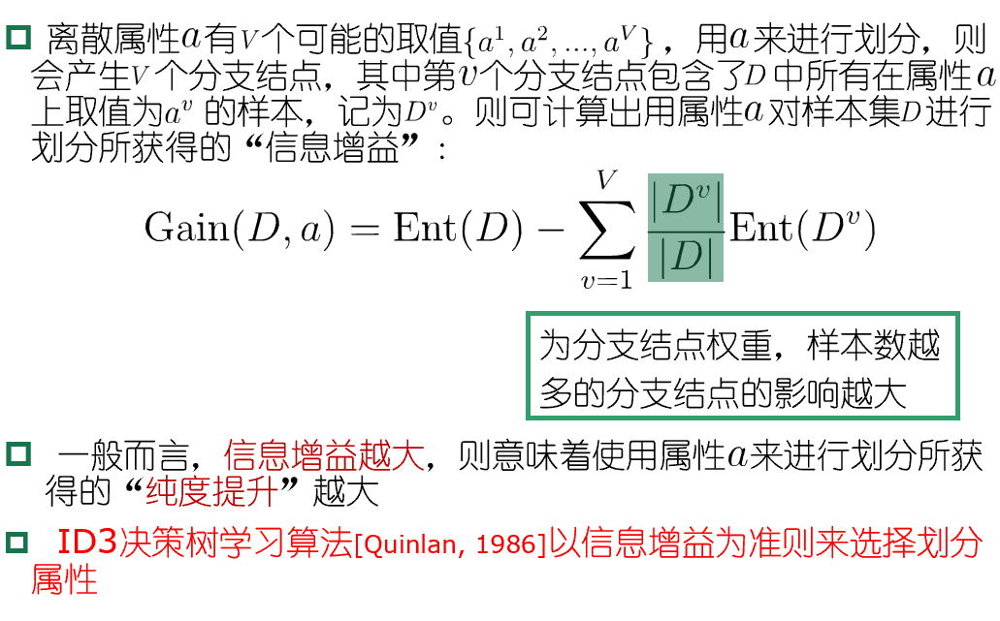
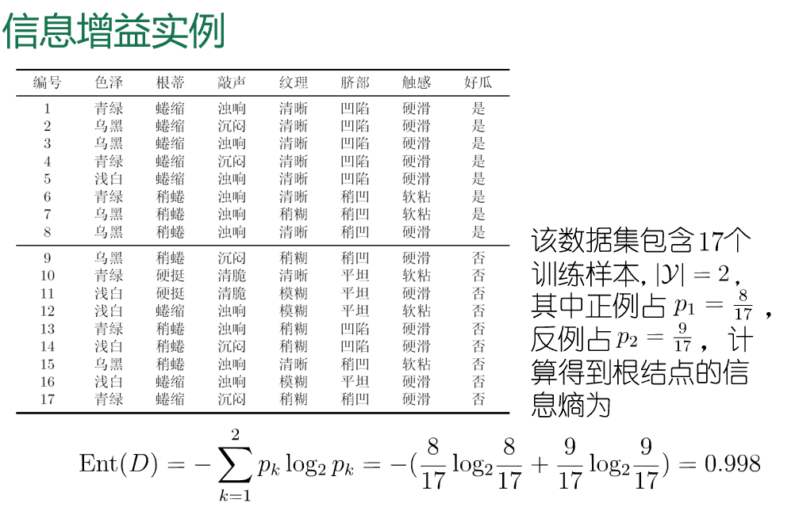
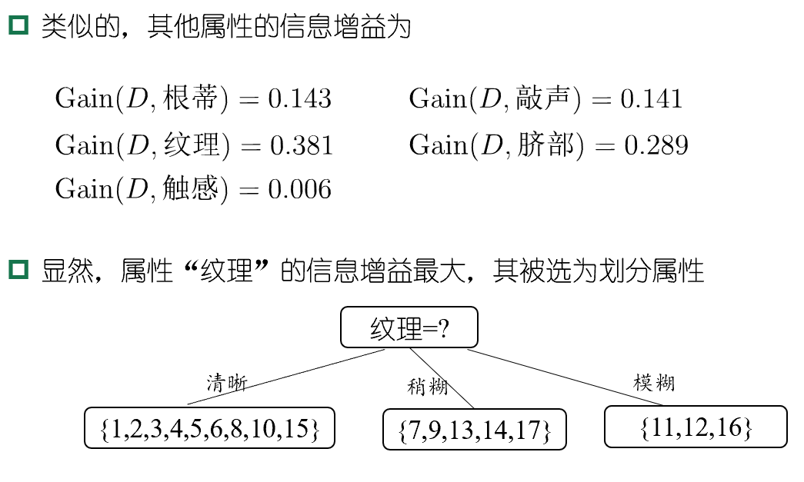
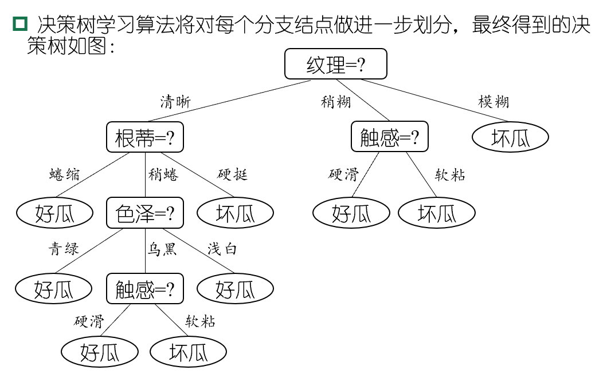
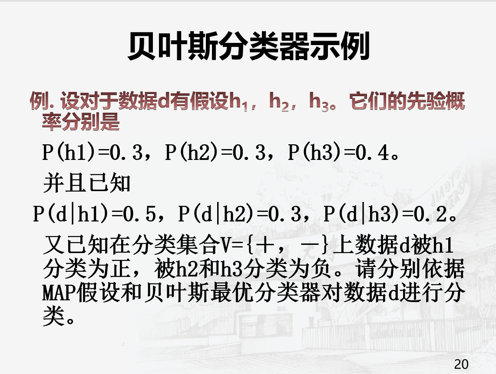
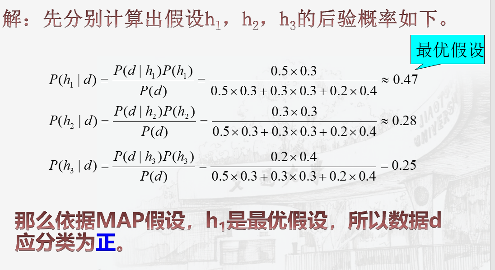
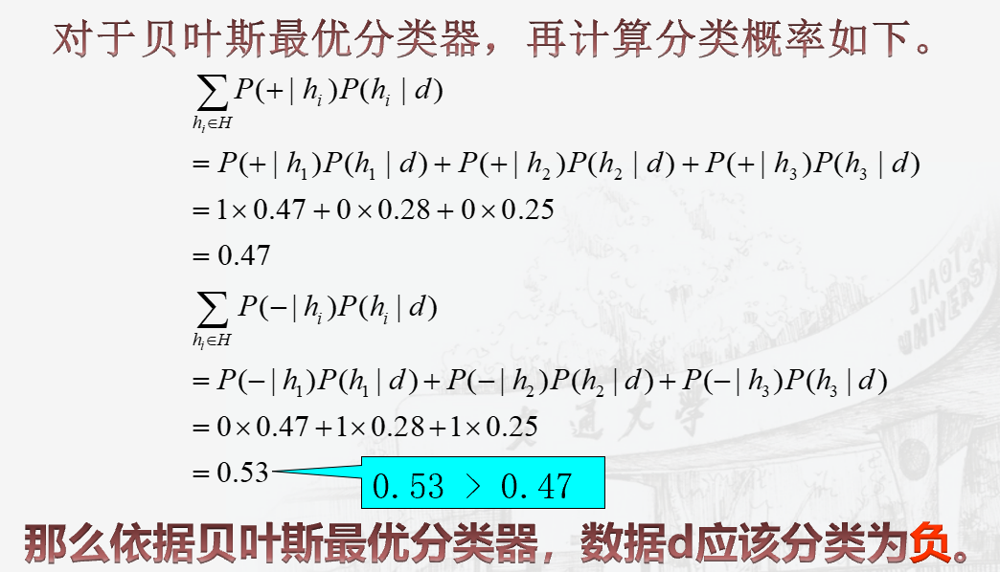
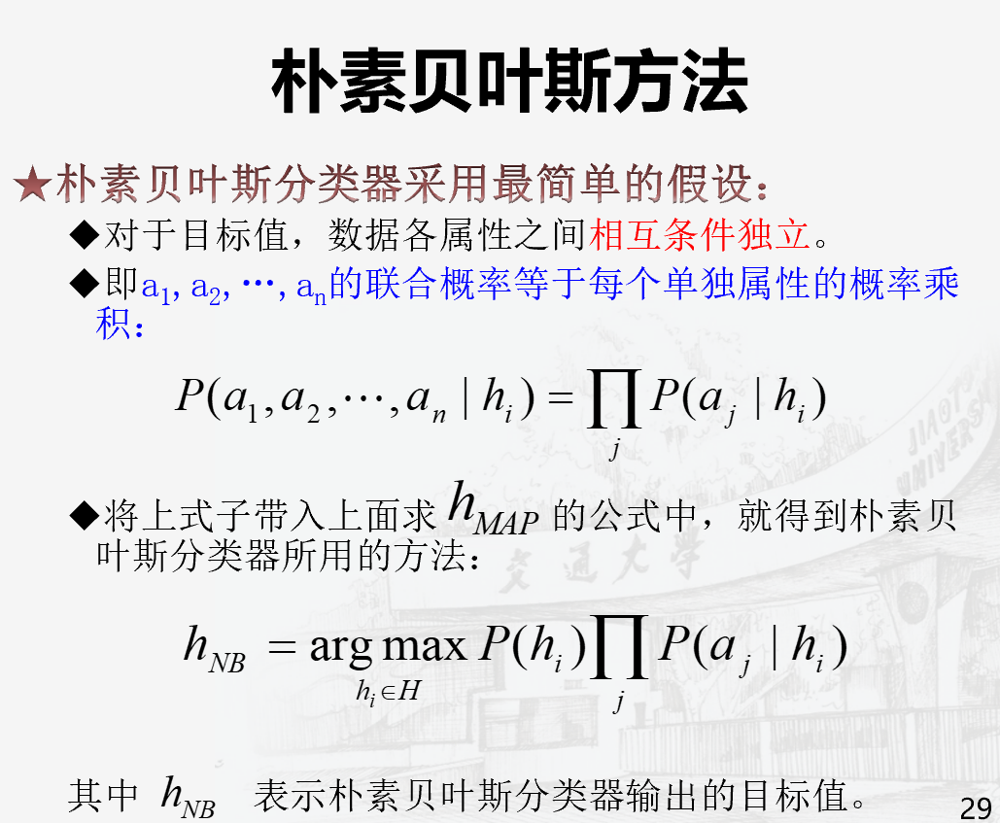
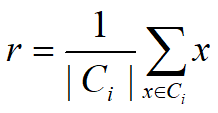

# 人工智能导论
## 第六章 机器学习

*Machine Learning ≈ Looking for a Function*

机器学习的本质是找一个将输入数据映射到输出数据的函数

重点领域：语音识别、图像识别、围棋、对话系统

框架：

### 决策树
- 基于树结构来进行预测
- 提出的每个判定问题都是对某个属性的“测试”
- 从根结点到每个叶结点的路径对应了一个判定测试序列

关键在于如何选择最优划分属性

尽可能属于同一类别，即结点的“纯度”(purity)越来越高

经典的属性划分方法：
- 信息增益
- 增益率
- 基尼指数

**信息熵**是度量样本集合纯度最常用的一种指标

假定当前样本集合D中第K类样本所占的比例为pk(K=1,2,...,|y|)，则D的信息熵定义为

**越小纯度越高**

**信息增益**：(越大越好)

剪枝：对付“过拟合”的主要手段
剪枝的基本策略
- 预剪枝
- 后剪枝

**预剪枝**：对每个结点在划分前先进行估计，分别计算划分前（即直接将该结点作为叶结点）及划分后的验证集精度，判断是否需要划分。

**后剪枝**：对完整的决策树进行考察
自底向上地对非叶结点进行考察，若将该结点对应的子树替换为叶结点能带来决策树泛化性能提升，则将该子树替换为叶结点

连续值处理
缺失值处理
多变量决策树

### 贝叶斯学习（基于贝叶斯理论的机器学习方法）
贝叶斯公式：

- P(d)表示训练数据d的先验概率，也就是在任何假设都未知或不确定时d的概率。

- P(d|h)表示已知假设h成立时d的概率，称之为类条件概率，或者给定假设h时数据d的似然度（Likelihood）。

- 后验概率就是在数据d上经过学习之后，获得的假设h成立的概率，记为P(h|d)。P(h|d)表示给定数据d时假设h成立的概率。
    - P(h|d)随着P(h)和P(d|h)的增大而增大，随着P(d)的增大而减小。

区别：
- 后验概率P(h|d)是在数据d上得到的学习结果，反映了数据d的影响。这个学习结果是与训练数据相关的。
- 与此相反，先验概率是与训练数据d无关的，是独立于d的。

**极大后验假设**

- 在候选假设集合H中寻找对于给定数据d使后验概率P(h|d)最大的那个假设。

**极大似然假设**
- 在候选假设集合H中选择使给定数据d似然度（即类条件概率）P(d|h)最大的假设。

极大似然假设和极大后验假设有很强的关联性。当假设集合H中每个假设都有相同的先验概率时，极大后验假设就蜕化为极大似然假设。

#### 贝叶斯最优分类器（复习题出现）
对所有假设的后验概率做线性组合（加权求和），然后再选择加权和最大结果作为最优分类结果。

复习题原题

贝叶斯学习为衡量多个假设的置信度提供了定量的方法，可以计算每个假设的显式概率，提供了一个客观的选择标准。

对于贝叶斯学习有两种思路可以解决高维数据问题。一种是朴素贝叶斯（Naïve Bayes）方法，也称为简单贝叶斯（Simple Bayes）方法；另一种是贝叶斯网络（Bayes Network）。

朴素贝叶斯学习的主要过程在于计算训练样例中不同数据组合的出现频率，统计出P(hi)和P(aj|hi)。

### 聚类：

#### 常用的聚类方法
- 分层聚类
- 划分聚类
- 基于密度的聚类
- 基于网格的聚类
- 基于模型的聚类

#### 分层聚类：
- 在聚类过程中生成一个聚类树
- 需要一个参数指明停止聚类的条件（通常用簇的期望个数k作为分层聚类判断停止的条件）

分成：
- 自顶向下（top-down）构造聚类树，称之为**分裂**聚类法（Divisive Clustering）；
- 自下而上（bottom-up）构造聚类树，称之为**凝聚**聚类法（Agglomerative Clustering）。

#### 常用的分层聚类算法：
- Linkage算法
  - 只能聚类凸集数据，其时间复杂度为O(N2)，其中N为数据个数。
- CURE算法
    - 可以聚类任意形状的数据集，但是不能处理具有分类属性的数据。
- CHAMELEON算法
    - 可以聚类任意形状的数据集
- BIRCH算法
    - 最少只扫描一遍数据集，时间复杂度为O(N)。所以非常适合于大规模数据的聚类。但是难以聚类非凸数据集。

#### Linkage算法
一般用距离定义相似度。在合并或者分裂簇的时候，主要考虑簇间距离。

- 单链（Single Link）
算子L取极小化算子，即两个簇的距离等于两簇最近两个点间的距离

        第一步 以每个数据点为一个簇，并将其放入有效簇集合中；
        第二步 计算有效簇集合中任意两簇之间的距离，然后将其按升序排列成簇间距离队列；
        第三步 如果距离队列首位的两个簇均为有效簇，则将二者合并为一个簇（即合并距离最小的两个簇），并把新簇放入有效簇集中，把两个旧簇删除；
        第四步 删除距离队列的首位；
        第五步 如果距离队列非空，则转至第三步，否则执行下一步；
        第六步 如果有效簇集中簇数大于预期簇数k，则转至第二步，否则算法结束。

- 均链（Average Link）

算子L取平均算子，即两个簇的距离等于两簇点间距离的平均值

- 全链（Complete Link）

算子L取极大化算子，即两个簇的距离等于两簇最远两个点间的距离

#### CURE算法：（类似slink）
- 寻找一些点作为各自簇的代表，然后取两个簇代表点中的最短距离作为簇间距离

寻找一个簇的代表点：
- 第一个代表点是距离该簇中心最远的点。
- 然后选取距全部现有代表点最远的点作为下一个代表点。如此重复共选择c个点代表该簇。
- 接下来所有这些代表点还要向簇中心收缩。收缩系数为a（a∈[0，1]）。
  
两个措施来加速聚类过程：
- 一是数据采样
- 二是分区

#### 分层聚类特点：
在聚类过程中一次性就建好了聚类树，没有回溯调整操作。

一个数据点一旦属于每个簇之后就一直属于该簇，不会更改。

一个簇一旦被合并或者分裂之后，也不会再调整其中的数据点了。

优点：
- 算法简单，适用性强，数据扫描顺序对聚类结果无影响，不用担心组合数目的不同选择。
- 
缺点：
- 没有全局优化，如果某一步没有很好地合并或者分裂，则必将导致低质量的聚类结果。

#### 划分聚类：
- 首先把数据集划分为k个簇。
- 然后逐一把数据点放入合适的簇中。
- 为了达到全局优化，算法需要重复扫描数据集多次。

#### 1、K平均（K-means）方法
簇的代表点是簇的理论中心（centroid）。
理论中心点不一定是簇内真实存在的数据点。

基本过程：
- 第一步 从数据集中选择K个数据点作为初始簇代表点；
- 第二步 数据集中每一个数据点按照距离，被分配给与其最近的簇；
- 第三步 重新计算每个簇的中心，获得新的代表点；
- 第四步 如果所有簇的新代表点均无变化，则算法结束；否则转至第二步。
  
簇理论中心常用算术平均公式计算：

**局限性**：在簇的大小悬殊、密度悬殊、簇的形状呈现非球形时，效果欠佳

#### K代表点（K-medoids）方法
- 簇的代表点是簇内最靠近理论中心的数据点（即最有代表性的数据点）。
- 与K平均聚类方法的过程基本相同。
- 在选择簇代表点时，
    - 计算候选代表点与簇内其它所有点间相似度之和。
    - 然后取相似度和最大的点作为簇代表点。

如果采用距离定义相似度，则上式就变为使其它点到代表点的距离之和最小。

**误差**一般是数据点到簇代表点距离的平方和

#### 基于密度的聚类方法
- DBSCAN算法：依赖于邻域半径和密度阈值两个参数。但是这两个参数并不易确定最优值。
- OPTICS算法：通过一系列的邻域半径来控制簇生长。
- DENCLUE算法：用密度分布函数来聚类。

**DBSCAN算法（复习题出现）**

把数据集中的所有数据点分为三类：
- 核心点

- 边界点

- 噪音点

一个簇就是
- 一堆通过邻域相互连接起来的核心点集合，
- 再加上一些边界点。
  
没有把所有的数据点都放入到某个簇中。

聚类过程：不断计算各个点的邻域密度，并把相邻核心点放入簇中。

算法步骤

        随机选择一个点p
        检索所有从p密度可达的点
        如果p是一个核心点，就形成了一个簇
        如果p是一个边界点，没有点从p密度可达，此时DBSCAN选择下一个点
        重复上述过程直到遍历完所有的点

**时间复杂度**：由于可使用树结构，所以DBSCAN算法的时间复杂度为O(Nlog(N))

优点：
- 抗噪 
- 可以处理不同形状和大小的簇

局限性：

- **对于高维数据**：数据点之间的距离往往会变得非常稀疏，使得密度定义变得更加困难。因此，在高维数据上使用DBSCAN算法时，需要进行降维或使用其他的聚类算法。

- **不同密度**：当数据集中存在密度差异很大的聚类时，DBSCAN算法可能会将它们视为噪声或将它们分成多个聚类。为了解决这个问题，可以使用基于密度的聚类算法的变体，如HDBSCAN。

- **数据集中存在大小相差很大的聚类**：因为DBSCAN算法的聚类结果是由密度可达性决定的，而不是聚类大小。

- **噪声数据点**：当数据集中存在大量噪声数据点时，DBSCAN算法可能会将它们误认为是聚类中的一部分，从而影响聚类效果。为了解决这个问题，可以使用基于噪声数据点的聚类算法的变体，如DBSCAN++。

#### 基于网格的聚类方法
基本思想
- 把数据空间量化为有限数目的单元，形成一个网格结构。
- 所有的聚类操作都在这个网格结构（即量化的空间）上进行。

主要优点：处理速度快

- STING算法：利用存储在网格单元中的统计信息聚类。

- WaveCluster算法：利用小波变换方法聚类。
- CLIQUE算法：结合网格法和密度法在子空间中进行聚类。

