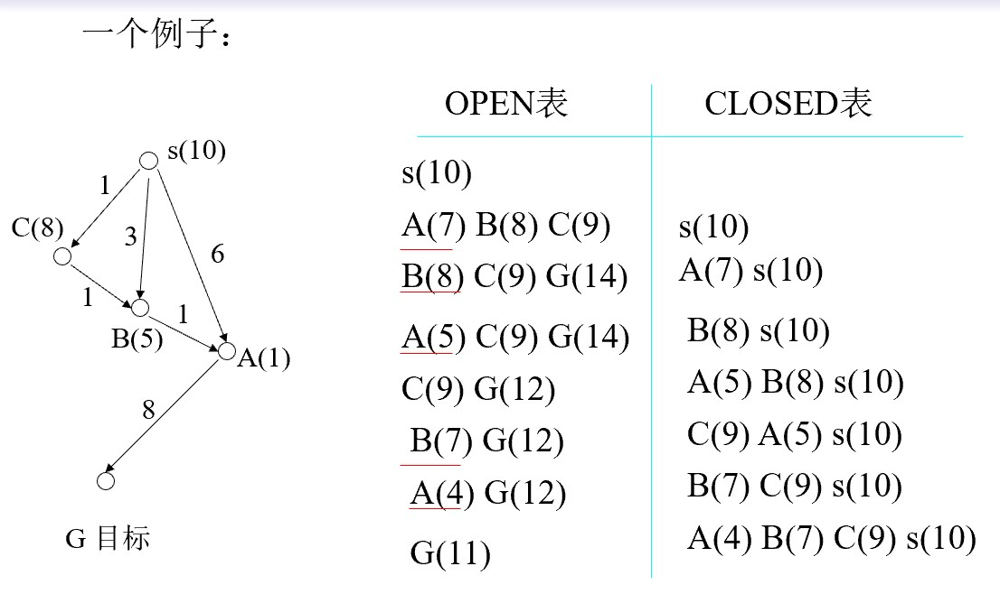
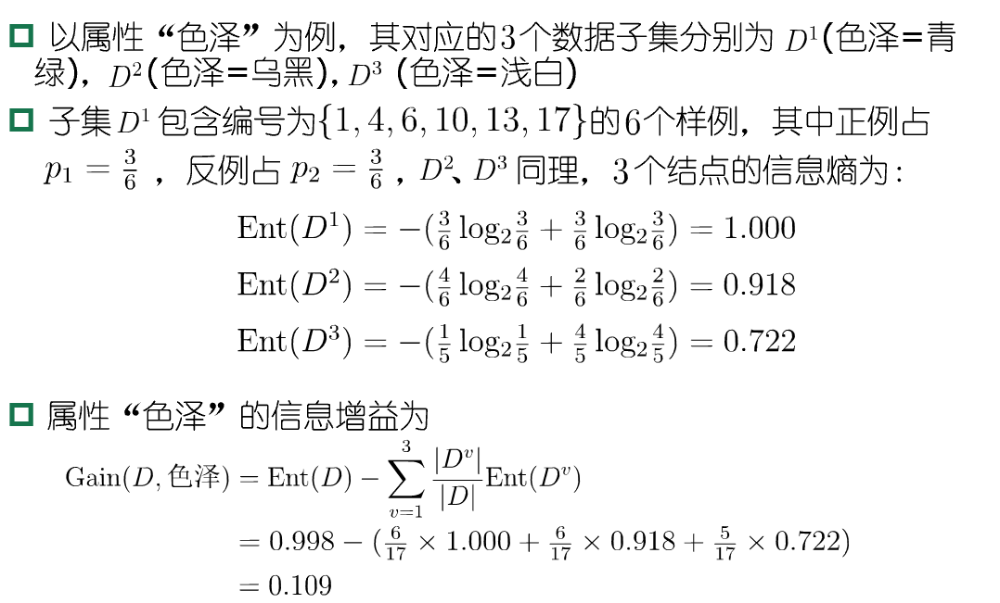

# 人工智能重点（复习题涉及知识点）

## 人工智能研究及应用领域

- 模式识别（Pattern Recognition）
- 自然语言处理（Natural Language Processing）
- 机器学习（Machine Learning）与数据挖掘
- 人工神经网络（Artificial Neural Network）与深度学习（Deep Learning）
- 问题求解（Problem Solving）与博弈（Game Playing）
- 多智能体（Multi Agent）
- 专家系统（Expert System）
- 计算机视觉（Computer Vision）
- 自动定理证明（Automatic Theorem Proving）
- 智能控制（Intelligent Control）
- 机器人学（Robotics）
- 人工生命（Artificial Life）


### 人工智能的研究途径：
- 符号主义（Symbolicism）
  - 基于物理符号系统假设和有限合理性原理的人工智能学派。
  - 把智能问题都归结为符号系统的计算问题，把一切精神活动都归结为计算。

- 联结主义（Connectionism）
  - 基于神经元及神经元之间的网络联结机制来模拟和实现人工智能。
- 行为主义（Actionism）
  - 基于控制论和“感知——动作”型控制系统的人工智能学派。

**符号主义和联结主义的主要区别如下**：

- 表示方式：符号主义使用离散的符号表示和符号操作，而连接主义使用分布式的神经网络表示和连接权重调整。

- 处理方式：符号主义通过推理和规则应用来处理符号，而连接主义通过神经网络的连接和分布式处理来进行学习和推理。

- 知识表示：符号主义将知识表示为符号和规则的集合，而连接主义将知识表示为连接权重的分布式模式。

- 学习方式：符号主义通常使用人工编码的方式来表示知识，而连接主义通过学习从数据中提取知识。

- 鲁棒性：符号主义在处理噪声和不完整数据时可能表现较差，而连接主义在处理这些情况时可能更具鲁棒性。

## 知识表示方法及其形式
###  一阶谓词逻辑表示法
- 用谓词公式表示知识时，需要首先**定义谓词**，指出每个谓词的确切语义，然后再用连接词把有关的**谓词连接**起来，**形成一个谓词公式**
例如：
姚明比他父亲有名。
- 首先，定义谓词：
- Famous(x,y): x比y有名。
- 然后用谓词公式表示：
- Famous(Yaoming,father(Yaoming))
### 产生式表示法
产生式通常用于表示具有因果关系的知识，其基本形式是：

	P→Q
	或者
	If	P Then  Q	[Else   S]

其中，P是前件，用于指出该产生式是否可用的条件。Q是一组结论或者操作，用于指出当前提P满足时，应该得出的结论或者应该执行的操作。
例如：
- 手被扎→缩手
- 下雨→地面湿
- 下雨∧甲未打伞→甲被淋湿
- 所有人都会死∧甲是人→甲会死
### 层次结构表示法
- 框架表示法
框架是一种描述所论对象(一个事物、一个事件或一个概念)属性的数据结构。
一个框架由若干个“槽”组成，一个槽又可划分为若干个“侧面”。一个槽用于描述所论对象某一方面的属性，一个侧面用于描述相应属性的一个方面。

一个框架的例子                                                             

```
框架名：<教师>
	姓名：单位(姓、名)
	年龄：单位(岁)
	性别：范围(男、女)
		   缺省：男
	职称：范围(教授、副教授、讲师、助教)
		   缺省：讲师
	部门：单位(系，教研室)
	住址：<住址框架>
	工资：<工资框架>
	开始工作时间：单位(年、月)
	截止时间：单位(年、月)
		  缺省：现在
```

### 网络结构表示法
#### 1. Petri网		
Petri网由德国学者卡尔·A·佩特里（Cah Abam Petri）在1962年首先提出。


基本的Petri网可用三元组（P, T, F）来表示。
- P（Place）表示位置集合，一般表示事物属性或状态
- T（Transition）表示转换集合，表示从一种状态转变为另一种状态
- F表示有向弧集合，用于指明转换的方向，有向弧只能存在于P和T或者T和P之间

在并发系统中，一个位置可以拥有多个令牌（Token），用于进行并发控制 

Petri网表示法的特点：
- 便于描述系统状态的变化以及对系统动态特性进行分析；
- 可以在不同层次上变换描述，而不必注意细节及相应的物理表示。 
		

#### 2. 语义网络		
结构：


语义网络是通过概念及其语义关系来表达知识的一种网络图。

从图论的观点看，它就是一个“带标识的有向图”。有向图的节点表示各种事物、概念、情况、属性、状态动作等等。弧表示各种语义联系，也称为联想弧。

eg.


### 其他

## 2.3.5知识图谱
知识图谱是一种揭示实体之间关系的语义网络，可以对现实世界的事物及其相互关系进行形式化地描述。

知识图谱一般用三元组来表示：
G=(E, R, S)
- G是知识图谱，
- E是知识库中的实体集合，
- R是知识库中的关系集合，
- S⊆E×R×E代表知识库中的三元组集合。

三元组的基本形式主要包括
- （实体1，关系，实体2）
- （概念，属性，属性值）

## 命题
- 能判断真假（不是既真又假）的陈述句。
- 简单陈述句描述事实、事物的状态、关系等性质。

### 基本等值式
- 交换律：
  - p∨q <=> q ∨p 
  - p Λ q <=> q Λp 
- 结合律： 
  - (p∨q) ∨ r<=> p∨(q ∨r);
  - (p Λ q) Λ r<=> p Λ(q Λ r)
- 分配律： 
  - p∨(q Λ r) <=> (p∨q)Λ(p ∨r) ；
  - p Λ(q ∨ r) <=> (p Λ q) ∨(p Λ r) 
- 摩根律:
  -  ～ (p∨q) <=> ～ p Λ ～ q ；
  - ～ (p Λq) <=> ～ p ∨ ～ q 
- 吸收律:
  - p∨(pΛq ) <=> p ；
  - p Λ(p∨q ) <=> p 
- 同一律: 
  - p∨0 <=> p ；
  - pΛ1 <=> p 
- 蕴含等值式:
  - p → q <=> ～ p∨q 
- 假言易位式: 
  - p → q <=> ～q → ～p

命题逻辑的归结过程：
- 建立待归结的命题公式
- 将命题写成合取范式
- 求出子句集S
- 对子句集使用归结推理规则
- 归结式作为新子句参加归结
- 归结式为空子句□ ，S是不可满足的（矛盾），原命题成立。

**例题：**
    证明公式：(P → Q) → (～Q → ～P)

**证明：**

    （1）根据归结原理，将待证明公式转化成待归结命题公式：
			(P → Q) ∧～(～Q → ～P)
    （2）分别将公式前项化为合取范式：
			P → Q ＝ ～P ∨ Q
		结论求～后的后项化为合取范式：
			～(～Q → ～P)＝ ～(Q∨～P) ＝ ～Q ∧ P
		两项合并后化为合取范式：
		（～P ∨ Q）∧～Q ∧ P
    （3）则子句集为：
			{ ～P∨Q，～Q，P}
    子句集为：	{ ～P∨Q，～Q，P}
    （4）对子句集中的子句进行归结可得：
        1.～P∨Q
        2.～Q
        3.P
        4.Q（1，3归结）
        5.□ （2，4归结）	
    由上可得原公式成立。

### 谓词逻辑归结原理
**前束范式**

	定义：A是一个前束范式，如果A中的一切量词都位于该公式的最左边（不含否定词），且这些量词的辖域都延伸到公式的末端。 
	即： 把所有的量词都提到前面去(Q1x1)(Q2x2)…(Qnxn)M(x1,x2,…,xn)

- 前束范式中消去所有的量词，称这种形式的谓词公式为**Skolem标准型**。
- 任何一个谓词公式都可以化为与之对应的Skolem标准型。
- Skolem标准型不唯一。
- 量词消去原则：消去存在量词“∃”，略去全称量词“∀”。
- 注意：左边有全称量词的存在量词，消去时该变量改写成为全称量词的函数；如没有，改写成为常量。 

        例:将下式化为Skolem标准型：
        ～(∀x)(∃y)P(a, x, y) →(∃x)(～(∀y)Q(y, b)→R(x))
        解：第一步，消去→号，得：
        ～(～(∀x)(∃y)P(a, x, y)) ∨(∃x) (～～(∀y)Q(y, b)∨R(x))
        第二步，～深入到量词内部，得：
        (∀x)(∃y)P(a, x, y) ∨(∃x) ((∀y)Q(y, b)∨R(x))
        第三步，变元易名，得
        (∀x)((∃y)P(a, x, y) ∨(∃u) (∀ v)(Q(v, b) ∨R(u)))
        第四步，存在量词左移，直至所有的量词移到前面，得：
        (∀x)  (∃y) (∃u) (∀ v)P(a, x, y) ∨(Q(v, b) ∨R(u))
        由此得到前述范式
        第五步，消去“∃”（存在量词），略去“∀”（全称量词）
        消去(∃y)，因为它左边只有(∀x)，所以使用x的函数f(x)代替之，这样得到：
        (∀x) (∃u) (∀ v)( P(a, x, f(x)) ∨Q(v, b) ∨R(u))
        消去(∀u)，同理使用g(x)代替之，这样得到：
        (∀x) (∀ v) ( P(a, x, f(x)) ∨Q(v, b) ∨R(g(x)))
        略去全称变量，原式的Skolem标准型为：
        P(a, x, f(x)) ∨Q(v, b) ∨R(g(x))

任意一个谓词公式G，都可以通过Skolem标准型建立起一个与之对应的**子句集**。
子句集S的求取：

        G → 前束范式
          → SKOLEM标准形
          → 以“，”取代“Λ”，并表示为集合形式 

**定理：**
若G是给定的谓词公式，S是相应的子句集，则：G是不可满足的<=> S是不可满足的。
- G与S不等值，但在不可满足的意义下是一致的。
- G真不一定S真，而S真必有G真。即： S => G

**置换**：可以简单的理解为是在一个谓词公式中用置换项去置换变量。
- 定义：
	- 置换是形如{t1/x1, t2/x2, …, tn/xn}的有限集合。其中，x1, x2, …, xn是互不相同的变量，t1, t2, …, tn是不同于xi的项（常量、变量、函数）；ti/xi表示用ti置换xi，并且要求ti与xi不能相同，而且xi不能循环地出现在另一个ti中。
- 例如
  
        {a/x，c/y，f(b)/z}是一个置换。
	    {g(y)/x，f(x)/y}不是一个置换， 

**置换的合成**

    设θ＝{t1/x1, t2/x2, …, tn/xn}，
      λ＝{u1/y1, u2/y2, …, un/yn}，是两个置换。
    则θ与λ的合成也是一个置换，记作θ·λ。它是从集合
      {t1·λ/x1, t2·λ/x2, …, tn·λ/xn, u1/y1, u2/y2, …, un/yn }
    中删去以下两种元素：
    当tiλ=xi时，删去tiλ/xi (i = 1, 2, …, n);
    当yj∈{x1,x2, …, xn}时，删去uj/yj (j = 1, 2, …, m)
    最后剩下的元素所构成的集合。 

例子：

    设：θ＝{f(y)/x, z/y}，λ＝{a/x, b/y, y/z}，求θ与λ的合成。
    解：先求出集合
      {f(b/y)/x, (y/z)/y, a/x, b/y, y/z}＝{f(b)/x, y/y, a/x, b/y, y/z}
      其中，f(b)/x中的f(b)是置换λ作用于f(y)的结果；y/y中的y是置换λ作用于z的结果。在该集合中，y/y满足定义中的条件1，需要删除；a/x，b/y满足定义中的条件2，也需要删除。最后得
        θ·λ＝{f(b)/x，y/z}    

**合一**（可以简单地理解为“寻找相对变量的置换，使两个谓词公式一致”。）
- 定义：
   - 设有公式集F＝{F1，F2，…，Fn}，若存在一个置换θ，可使F1θ ＝F2θ ＝…= Fnθ ，则称θ 是F的一个合一。同时称F1，F2，... ，Fn是可合一的。
- 例：
	- 设有公式集F＝{P(x, y, f(y)), P(a,g(x),z)}，则λ＝{a/x, g(a)/y, f(g(a))/z}是它的一个合一。

**归结原理**

方法：
- 和命题逻辑一样，消去互补对。
- 但由于有函数，所以要考虑置换和合一。

        设有两个子句C1=P(x)∨Q(x), C2= ¬P(a)∨R(y)

        由于P(x)与P(a)不同，所以C1与C2不能直接进行归结。
        但是若用最一般合一：σ={a/x}
        对两个子句分别进行代换：
        C1σ =P(a)∨Q(a)
        C2σ = ¬P(a)∨R(y)
        就可对它们进行归结，得到归结式：
        Q(a)∨R(y)

       


#### 1. 不确定性推理是建立在非经典逻辑基础上的一种推理，它是对不确定性知识的运用与处理。

不确定性推理就是
- 从不确定性的初始证据出发，
- 通过运用不确定性的知识，
- 最终推出具有一定程度的不确定性但却是合理或者近乎合理的结论的思维过程。

**引起知识不确定性的原因主要有**：
- 不完全性：这种药可能会治疗COVID-19。
- 经验性：朝霞不出门，晚霞行千里。
- 概率性：我有八成的把握打中目标。
- 模糊性：高个子适合于打篮球。

#### 2. 不确定性推理的基本问题
##### (1) 不确定性的表示
不确定性推理中的“不确定性”一般分为两类：
- 知识的不确定性
- 证据的不确定性

知识不确定性的表示：静态强度、可信度。

证据不确定性的表示：动态强度。

不确定性的度量：事先规定取值范围，使每个数据都有明确的意义。
##### (2) 不确定性匹配算法
设计一个不确定性匹配算法；
指定一个匹配阈值。
##### (3) 组合证据的不确定性
在匹配时，一个简单条件对应于一个单一的证据，一个复合条件对应于一组证据，称这一组证据为**组合证据**。

        常用的组合证据不确定性计算方法有：
        最大最小法：
            T(E1 AND E2)=min{T(E1),T(E2)}
            T(E1 OR E2)=max{T(E1),T(E2)}
        概率法：
            T(E1 AND E2)=T(E1)×T(E2)
            T(E1 OR E2)=T(E1)＋T(E2)－T(E1)×T(E2)
        有界法：
            T(E1 AND E2)=max{0,T(E1)＋T(E2)－1}
            T(E1 OR E2)=min{1,T(E1)＋T(E2)}
        其中，T(E)表示证据E为真的程度，如可信度、概率等。
##### (4) 不确定性的传递算法
- 在每一步推理中，如何把证据及知识的不确定性传递给结论。
- 在多步推理中，如何把初始证据的不确定性传递给最终结论。
##### (5) 结论不确定性的合成
用不同知识进行推理得到了相同结论，但不确定性的程度却不同。此时，需要用合适的算法对它们进行合成。


### 宽度优先搜索的性质：
- 当问题有解时，一定能找到解
- **当问题为单位耗散值，且问题有解时，一定能找到最优解**
- 是一个通用的与问题无关的图搜索方法
- 效率较低

### 深度优先搜索的性质：
- 不能保证找到最优解
- 当深度限制不合理时，可能找不到解
- 最坏情况时，搜索空间等同于穷举
- 是一个通用的与问题无关的图搜索方法

## A*算法解决八数码问题（大题）
A*算法性质：
- 当问题有解时，A*算法一定能找到最佳路径。
- 极端情况下，若h(n)≡0，一定能找到最佳路径，此时，若g≡d，则A*算法等同于宽度优先算法。

        f*(s) = f*(t) = h*(s) = g*(t) = f*(n)
        其中s是初始节点，t是目标节点，n是s到t的最佳路径上的节点.
- 对有限图，如果从初始节点s到目标节点t有路径存在，则算法A一定成功结束。
- 对无限图，若有从初始节点s到目标节点t的路径，则A*不结束时，在OPEN表中即使最小的一个f值也将增到任意大，或有f(n)>f*(s)。
- A*结束前，OPEN表中必存在f(n)≤f*(s)的结点（n是在最佳路径上的结点）。
- 对无限图，若从初始节点s到目标节点t有路径存在，则A*一定成功结束
- OPEN表上任一具有f(n)<f*(s)的节点n，最终都将被A*选作扩展的节点。
- A*选作扩展的任一节点n，有f(n)≤f*(s)。
- 设对同一个问题定义了两个A*算法A1和A2，若A2比A1有较多的启发信息，即对所有非目标节点有h2(n) > h1(n)，则在具有一条从s到t的路径的隐含图上，搜索结束时，由A2所扩展的每一个节点，也必定由A1所扩展，即A1扩展的节点数至少和A2一样多。
**简写：如果h2(n) > h1(n) (目标节点除外)，则A1扩展的节点数≥A2扩展的节点数**


## 博弈树α-β剪枝（大题）
- 极大节点的下界为α。
- 极小节点的上界为β。
- 剪枝的条件：
    - β(后继层) ≤ α(先辈层) ， α剪枝
  - α(后继层) ≥ β(先辈层) ， β剪枝
  


## 决策树

**信息熵**是度量样本集合纯度最常用的一种指标

假定当前样本集合D中第K类样本所占的比例为pk(K=1,2,...,|y|)，则D的信息熵定义为


**越小纯度越高**

**信息增益**：(越大越好)





## 贝叶斯最优分类器（大题）
对所有假设的后验概率做线性组合（加权求和），然后再选择加权和最大结果作为最优分类结果。


复习题原题


朴素贝叶斯学习的主要过程在于计算训练样例中不同数据组合的出现频率，统计出P(hi)和P(aj|hi)。
  
#### 常用的聚类方法
- 分层聚类：在聚类过程中生成一个聚类树
- 划分聚类： 首先把数据集划分为k个簇，然后逐一把数据点放入合适的簇中。（K-means）
- 基于密度的聚类（DBSCAN算法）
- 基于网格的聚类
- 基于模型的聚类

**K平均（K-means）方法**
簇的代表点是簇的理论中心（centroid）。
理论中心点不一定是簇内真实存在的数据点。

基本过程：
- 第一步 从数据集中选择K个数据点作为初始簇代表点；
- 第二步 数据集中每一个数据点按照距离，被分配给与其最近的簇；
- 第三步 重新计算每个簇的中心，获得新的代表点；
- 第四步 如果所有簇的新代表点均无变化，则算法结束；否则转至第二步。
  
簇理论中心常用算术平均公式计算：


**局限性**：在簇的大小悬殊、密度悬殊、簇的形状呈现非球形时，效果欠佳

**DBSCAN算法（复习题出现）**

把数据集中的所有数据点分为三类：
- 核心点

- 边界点

- 噪音点

一个簇就是
- 一堆通过邻域相互连接起来的核心点集合，
- 再加上一些边界点。
  
没有把所有的数据点都放入到某个簇中。

聚类过程：不断计算各个点的邻域密度，并把相邻核心点放入簇中。

算法步骤

        随机选择一个点p
        检索所有从p密度可达的点
        如果p是一个核心点，就形成了一个簇
        如果p是一个边界点，没有点从p密度可达，此时DBSCAN选择下一个点
        重复上述过程直到遍历完所有的点

**时间复杂度**：由于可使用树结构，所以DBSCAN算法的时间复杂度为O(Nlog(N))

优点：
- 抗噪 
- 可以处理不同形状和大小的簇

局限性：

- **对于高维数据**：数据点之间的距离往往会变得非常稀疏，使得密度定义变得更加困难。因此，在高维数据上使用DBSCAN算法时，需要进行降维或使用其他的聚类算法。

- **不同密度**：当数据集中存在密度差异很大的聚类时，DBSCAN算法可能会将它们视为噪声或将它们分成多个聚类。为了解决这个问题，可以使用基于密度的聚类算法的变体，如HDBSCAN。

- **数据集中存在大小相差很大的聚类**：因为DBSCAN算法的聚类结果是由密度可达性决定的，而不是聚类大小。

- **噪声数据点**：当数据集中存在大量噪声数据点时，DBSCAN算法可能会将它们误认为是聚类中的一部分，从而影响聚类效果。为了解决这个问题，可以使用基于噪声数据点的聚类算法的变体，如DBSCAN++。


**回溯搜索与图搜索的区别**：
   
   - **回溯搜索**：这是一种深度优先搜索策略，它尝试沿着一条路径尽可能深地探索，直到无法继续为止，然后回溯到上一个节点，尝试其他路径。这种方法通常用于解决组合优化问题或搜索树问题。
   
   - **图搜索**：这是一种系统地在状态空间中搜索的策略，可能采用不同的搜索算法，比如广度优先搜索、深度优先搜索、A*搜索等。它们逐步探索状态空间中的节点，以找到最优解或满足条件的解决方案。


**机器学习中的“泛化”能力**：
   
   泛化能力指的是模型在面对新数据时的表现能力。一个良好泛化的模型能够适应未见过的数据，并表现出合理的预测或分类能力，而不只是仅仅在训练数据上表现良好。

**分类、聚类、回归的区别**：

   - **分类**：将数据划分到已知类别中，目标是预测离散类别的标签。
   - **聚类**：将数据分组到未知的类别中，根据数据本身的相似性进行分组。
   - **回归**：预测连续型数值，目标是找到输入变量与输出变量之间的关系。

**解决分类问题常用的算法及主要思想**：
   - **决策树**：根据数据特征创建树结构，通过对特征的分割来做出决策。
   - **K近邻算法**：根据邻居的标签来预测新数据点的标签。
   - **支持向量机（SVM）**：找到数据之间的最佳决策边界，最大化间隔以分类数据。

**深度学习模型及应用**：
   - **卷积神经网络（CNN）**：用于图像识别、目标检测。
   - **循环神经网络（RNN）**：在自然语言处理、时间序列预测中应用广泛。
   - **生成对抗网络（GAN）**：用于图像生成、样本合成。

**人工智能、机器学习、神经网络的区别与联系**：
   - **人工智能**：指的是使机器能够模仿人类智能行为的科学。
   - **机器学习**：是人工智能的一个分支，通过数据训练模型，使机器从经验中学习。
   - **神经网络**：是机器学习的一种模型，模仿人脑神经元网络的结构，用于学习和识别模式。

**贝叶斯定理**：
  - 描述了在已知先验条件下，通过新的证据更新概率。
  - 解决基于先验和观测数据推断后验概率的问题，刻画的是因果关系。


**梯度下降算法步骤**：
1. **初始化参数**：选择初始的参数值，这可以是随机选择或者根据先验知识选择。

2. **计算损失函数的梯度**：对于当前的参数值，计算损失函数对各个参数的梯度。梯度是损失函数在当前参数点处的斜率或者变化率。这个步骤使用链式法则计算梯度。

3. **更新参数**：根据梯度的方向和大小来更新参数。梯度告诉我们损失函数增加最快的方向，因此我们沿着梯度的反方向更新参数，以减小损失函数的值。更新公式通常如下所示：
   
    **新参数=旧参数- 学习率*梯度**
其中，学习率是一个超参数，控制着每次更新时参数值的变化大小。

1. **重复迭代**：重复步骤 2 和步骤 3，直到满足停止条件。停止条件可以是达到指定的迭代次数，损失函数收敛到某个阈值，或者其他预先定义的条件。

2. **停止**：当达到停止条件时，算法结束。此时，参数的值应该是在给定学习率下，使损失函数达到局部最小值或者接近最小值的值。


 **支持向量机的优点及结构风险最小化**：
  - 优点：能处理高维数据，泛化性能好。
  - 结构风险最小化：在保证经验风险最小的同时，尽可能减小模型复杂度。


**交叉验证法及用处**：
  - 将数据集划分为训练集和验证集，用于评估模型的性能。
  - 有助于评估模型泛化能力和减小过拟合风险。

**产生式系统中推理机的推理方式**：
  - **前向推理**：从已知条件推导出结论。
  - **后向推理**：从目标向已知条件推理。
