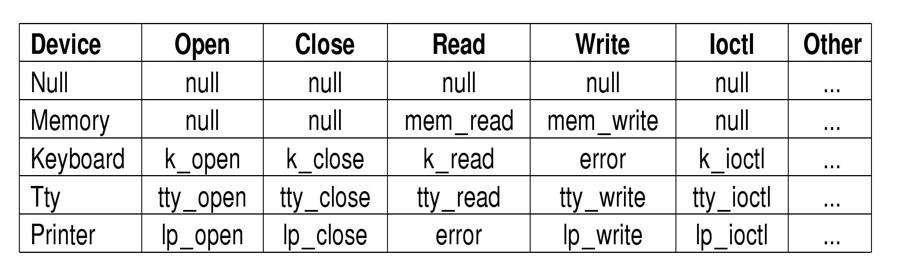

# Linux

Interfaces to Linux

内核构成：

## Linux中的进程

Linux中的主要活动实体是进程。创建进程用fork（）。

进程之间的通信用管道（pipe）、软件中断

杀死进程用kill（pid，sig），pid是进程ID。

Linux内核多线程的。系统调用是基于线程的。

- 实时先进先出
- 实时轮转
- 分时

## Linux中的内存管理

每个Linux进程都有一个地址空间，逻辑上有三段：代码、数据、堆栈段

通过内存映射文件来访问文件数据

### 物理内存管理

Linux内存分为三部分：

- 内核
- 内存映射
- 其他部分（被分为页框）

Linux内存表示：

四级分页系统：全局、上级、中级、页表

### 内存分配

伙伴算法：分成$2^i$进行分配 

### 页面置换算法：PFRA

请求换页系统，用类似时钟算法进行页面置换。

## I/O

I/O设备被当做特殊的文件进行处理。

### 网络设备

套接字Socket，可以被动态创建和销毁。

### 主要设备表

每个设备类型对应一个设备驱动

## 文件管理

文件链接

用共享锁和互斥锁

文件系统布局

## 安全

提供保护模式

