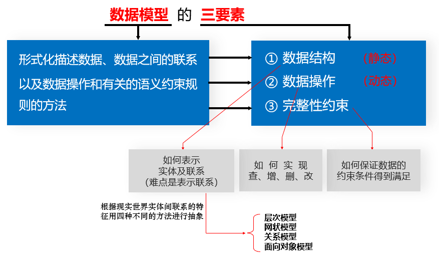
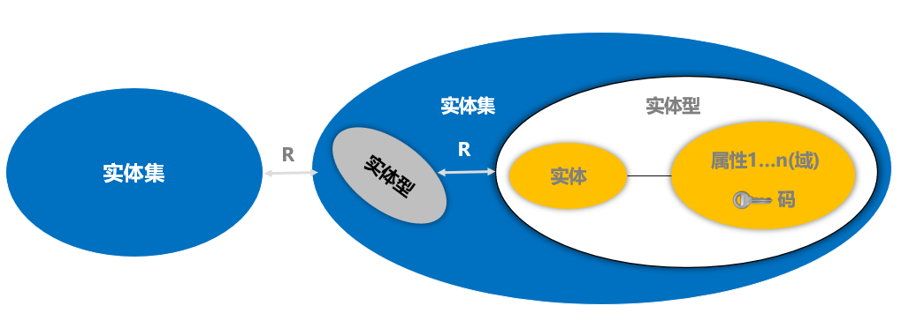
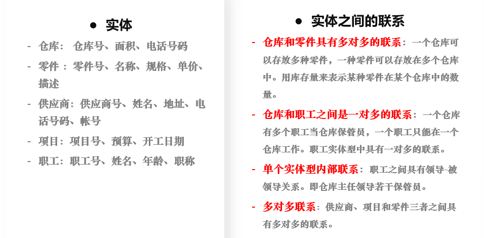
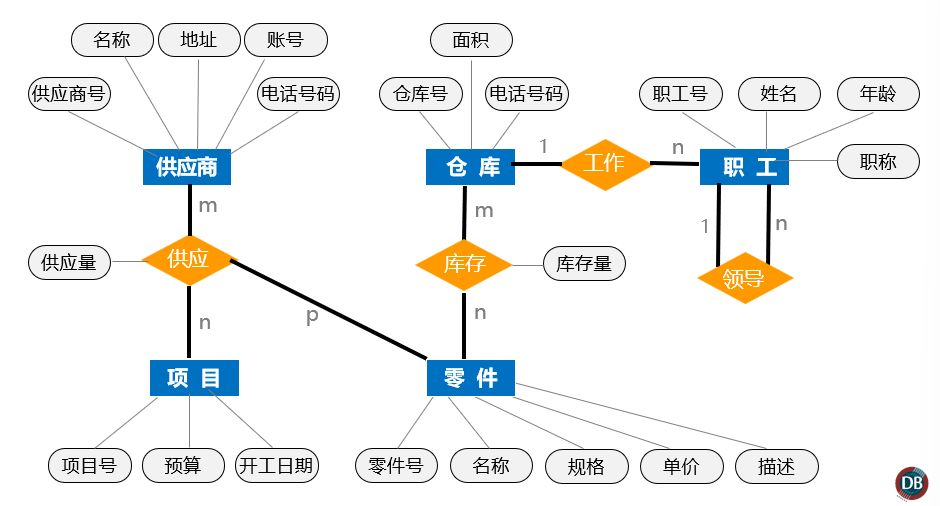
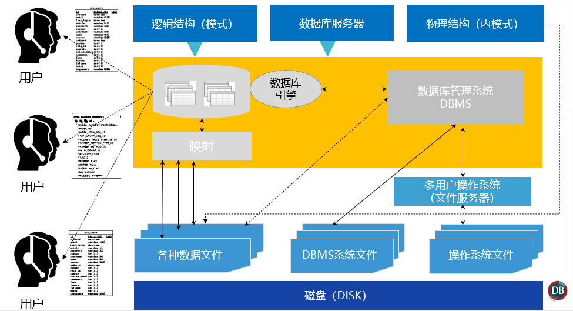
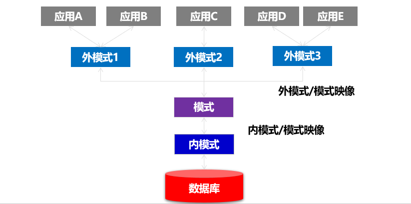
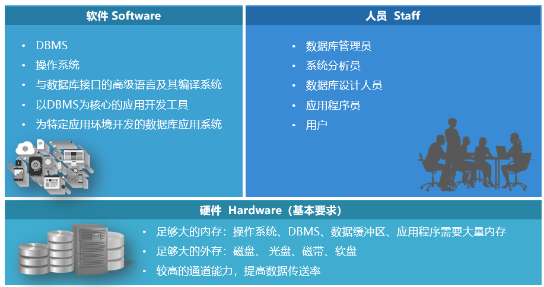

# 第一章 数据库绪论

## 复习提纲

1)  理解**E-R图**图示的表示方法
2)  **实体之间的联系**形式主要有哪几种？
3)  理解**概念模型、逻辑模型、物理模型**
4)  什么叫数据与程序的**物理独立性？**什么叫数据与程序的**逻辑独立性？**为什么数据库系统具有**数据与程序的独立性？**
5)  数据库管理系统的主要**管理功能？**
6)  能根据应用描述画出系统的E-R图

## 主要内容

### 数据库系统概论

#### 四个基本概念：

**数据**（DATA），**数据库**（Database），**数据库系统**（Database System)，**数据库管理系统**（Database Management System）详见论述题1。

- ==数据结构化==
- ==数据的共享性高，冗余度低，易扩充==
- ==数据独立性高==
- ==数据由DBMS统一管理和控制==

### 数据模型

用数据模型这个工具来抽象/表示和处理现实世界中的数据和信息。数据模型就是现实世界的模拟。

#### 两大数据模型

- **概念层数据模型**：称信息模型，它是按用户观点来对数据和信息建模，用于数据库设计。
- **组织层数据模型**
  - -**逻辑模型：**主要包括网状模型、层次模型、关系模型、面向对象模型等，按计算机系统的观点对数据建模，用于DBMS实现。
  - **物理模型：**是对数据最底层的抽象，描述数据在系统内部的表示方式和存取方法，在磁盘或磁带上的存储方式和存取方法。

#### 数据模型的组成要素

#### 概念模型

概念模型用于信息世界的建模，是现实世界到机器世界的一个中间层次，是数据库设计的有力工具，是数据库设计人员和用户之间进行交流的语言。

**基本概念**

- **实体：**客观存在并可相互区别的事物称为实体，可以是具体的人、事、物或抽象的概念。
- **属性：**实体所具有的某一特性称为属性，一个实体可以由若干个属性来刻画。
- **码**（key）：唯一标识实体的属性集称为码。
- **域**（domain）：属性的取值范围称之为该属性的域。
- **实体型：**对实体固有特性或结构的描述。用实体名及其属性名集合来抽象和刻画。（如：汽车（车牌号，车型，车主））
- **实体值**：实体型的一个实例，即一个具体的实体。（如 ：粤A00001，丰田，张三）
- **实体集**（Entity Set）：同型实体的集合，称为实体集。例如全体客户就是一个实体集。
- **联系**（relationship):
  - 实体内部的联系：通常是指组成实体的各属性之间的联系
  - 实体之间的联系：通常是指不同实体集之间的联系
    - 一对一联系 
    - 一对多联系
    - 多对多联系

#### E-R图（必须掌握）

- **矩形：**表示实体型，矩形框内写明实体名。
- **椭圆：**表示实体的属性，并用无向边将其与相应的实体连接起来。
- **菱形：**表示实体型之间的联系，在菱形框内写明联系名，并用无向边分别与有关实体型连接起来，同时在无向边旁标上联系的类型（1：1，1：n或m:n)

工厂物资管理实例

#### 常用数据模型

- 非关系模型
  - **层次模型：**有且只有一个结点没有双亲结点，这个结点称为根结点。根以外的其它结点有且只有一个双亲结点
  - **网状模型：**采用网状模型作为数据的组织方式
- **关系模型**
- 面向对象模型
- 对象关系模型

#### 关系模型（必须掌握）

- **关系**（Relation）：一个关系对应通常说的一张表。

- **元组**（Tuple）: 表中的一行即为一个元组。又称行、记录。

- **属性**（Attribute）:表中的一列即为一个属性，给每一个属性起一个名称即属性名。又称列。

- **主码**（Key）:表中的某个属性组，它可以唯一确定一个元组。

- **域**（Domain）：属性的取值范围。

- **分量**：元组中的一个属性值。

- **关系模式**：对关系的描述
  - 关系名（属性1，属性2，…，属性n）
  - 学生（学号，姓名，年龄，性别，系，年级）

​	基本规范：关系的每一个分量都必须是不可分的数据项。

**优缺点**

**优点**

- **建立在严格的数学概念的基础上**

- **概念单一。数据结构简单、清晰，用户易懂易用**

- **实体和各类联系都用关系来表示。对数据的检索结果也是关系**

- **关系模型的存取路径对用户隐藏**

- **具有更高的数据独立性，更好的安全保密性**

- **简化了程序员的工作和数据库开发建立的工作**

**缺点**

- **存取路径对用户隐藏导致查询效率往往不如非关系数据模型**

- **为提高性能，必须对用户的查询请求进行优化**

- **增加了开发数据库管理系统的难度**

### 数据库系统结构

**从最终用户角度**

- 单用户结构
- 主从式结构
- 分布式结构
- 客户/服务器结构
- 浏览器/应用服务器/数据库服务器结构

**从系统管理角度：三级模式结构**

##### ==模式（逻辑模式）==

数据库中全体数据的逻辑结构和特征的描述，所有用户的公共数据视图，综合了所有用户的需求。**一个数据库只有一个模式**

**模式的地位：是数据库系统模式结构的中间层**

- 与数据的物理存储细节和硬件环境无关

- 与具体的应用程序、开发工具及高级程序设计语言无关

**模式的定义**

- 数据的逻辑结构（数据项的名字、类型、取值范围等）

- 数据之间的联系

- 数据有关的安全性、完整性要求

##### ==外模式（用户模式）==

数据库用户（包括应用程序员和最终用户）使用的**局部数据的逻辑结构和特征的描述**。数据库用户的数据视图，是与某一应用有关的数据的逻辑表示

**外模式的地位：介于模式与应用之间**

**外模式与应用的关系：一对多**

- **同一外模式也可以为某一用户的多个应用系统所使用，**

- **但一个应用程序只能使用一个外模式。**

**外模式的用途**

- 保证数据库安全性的一个有力措施。

- 每个用户只能看见和访问所对应的外模式中的数据

##### 内模式（存储模式）

是数据物理结构和存储方式的描述，是数据在数据库内部的表示方式。

记录的存储方式（顺序存储，B+树存储，hash存储）

索引的组织方式，数据是否压缩存储，数据是否加密，数据存储记录结构的规定，**一个数据库只有一个内模式**。

##### ==三级模式和二级映像==

**外模式/模式映像：**同一个模式可以有多个外模式，**每个外模式有一个映像**。保证数据的==逻辑独立性==。

**模式/内模式映像：**模式和内模式在一个数据库中只有一个，所以该映像**唯一**。保证数据的==物理独立性。==

### 数据库系统组成

## 论述题

### 1.试述数据、数据库、数据库系统、数据库管理系统的概念。

1. 数据（ Data ) ：描述事物的符号记录称为数据。数据的种类有数字、文字、图形、图像、声音、正文等。数据与其语义是不可分的。500 这个数字可以表示一件物品的价格是 500 元，也可以表示一个学术会议参加的人数有 500 人，还可以表示一袋奶粉重 500 克。

2. 数据库（ DataBase ，简称 DB ) ：数据库是长期储存在计算机内的、有组织的、可共享的数据集合。数据库中的数据按一定的数据模型组织、描述和储存，具有较小的冗余度、较高的数据独立性和易扩展性，并可为各种用户共享。

3. 数据库系统（ DataBas 。 Sytem ，简称 DBS ) ：数据库系统是指在计算机系统中引入数据库后的系统构成，一般由数据库、数据库管理系统（及其开发工具）、应用系统、数据库管理员构成。数据库系统和数据库是两个概念。数据库系统是一个人一机系统，数据库是数据库系统的一个组成部分。但是在日常工作中人们常常把数据库系统简称为数据库。

4. 数据库管理系统（ DataBase Management sytem ，简称 DBMs ) ：数据库管理系统是位于用户与操作系统之间的一层数据管理软件，用于科学地组织和存储数据、高效地获取和维护数据。 DBMS 的主要功能包括数据定义功能、数据操纵功能、数据库的运行管理功能、数据库的建立和维护功能。  

### 2.试述数据库系统三级模式结构，这种结构的优点是什么？

​	数据库系统的三级模式结构由外模式、模式和内模式组成。外模式，亦称子模式或用户模式，是数据库用户（包括应用程序员和最终用户）能够看见和使用的局部数据的逻辑结构和特征的描述，是数据库用户的数据视图，是与某一应用有关的数据的逻辑表示。模式，亦称逻辑模式，是数据库中全体数据的逻辑结构和特征的描述，是所有用户的公共数据视图。模式描述的是数据的全局逻辑结构。外模式涉及的是数据的局部逻辑结构，通常是模式的子集。内模式，亦称存储模式，是数据在数据库系统内部的表示，即对数据的物理结构和存储方式的描述。数据库系统的三级模式是对数据的三个抽象级别，它把数据的具体组织留给 DBMS 管理，使用户能逻辑抽象地处理数据，而不必关心数据在计算机中的表示和存储。为了能够在内部实现这三个抽象层次的联系和转换，数据库系统在这三级模式之间提供了两层映像：外模式／模式映像和模式／内模式映像。正是这两层映像保证了数据库系统中的数据能够具有较高的逻辑独立性和物理独立性。

### 3．定义并解释以下术语：模式、外模式、内模式、 DDL 、 DML 

模式亦称逻辑模式，是数据库中全体数据的逻辑结构和特征的描述，是所有用户的公共数据视图。模式描述的是数据的全局逻辑结构。

外模式涉及的是数据的局部逻辑结构，通常是模式的子集。

内模式，亦称存储模式，是数据在数据库系统内部的表示，即对数据的物理结构和存储方式的描述。 

DDL ：数据定义语言，用来定义数据库模式、外模式、内模式的语言。 

DML ：数据操纵语言，用来对数据库中的数据进行查询、插入、删除和修改的语句。

### 4．什么叫数据与程序的物理独立性？什么叫数据与程序的逻辑独立性？为什么数据库系统具有数据与程序的独立性？

   数据与程序的逻辑独立性：当模式改变时（例如增加新的关系、新的属性、改变属性的数据类型等），由数据库管理员对各个外模式／模式的映像做相应改变，可以使外模式保持不变。应用程序是依据数据的外模式编写的，从而应用程序不必修改，保证了数据与程序的逻辑独立性，简称数据的逻辑独立性。

数据与程序的物理独立性：当数据库的存储结构改变了，由数据库管理员对模式／内模式映像做相应改变，可以使模式保持不变，从而应用程序也不必改变，保证了数据与程序的物理独立性，简称数据的物理独立性。数据库管理系统在三级模式之间提供的两层映像保证了数据库系统中的数据能够具有较高的逻辑独立性和物理独立性。

### 5．试述数据库系统的组成。

   数据库系统一般由数据库、数据库管理系统（及其开发工具）、应用系统、数据库管理员和用户构成。