# 第2章 关系代数

了解笛卡尔积，应该都会。

**关系的性质：**

- 每一列的数据必须来自同一个域
- 每一列必须是不可再分的数据项不能有相同的行
- 行列次序无关

#### 关系模式

$$
R(属性U，域D，映射关系dom，依赖关系F)
$$

**三类关系表：**

- 基本关系表：实际存在的表
- 查询表：查询结果对应的表
- 视图表，由基本表或者其他视图表导出来的表，一般不存储实际数据

**==关系代数基本操作：==**选择、投影、并、差、笛卡尔积，此外还有连接、除、交。

### ==完整性约束==

-  **实体完整性（行）：**如果属性A是关系R的主属性，则属性A不能取空值。
- **引用完整性（表间）：**如果关系引用了一个关系的主码，则引用的这一列中的值必须是被引用列里面有的记录。

> 外码：假设F是基本关系R的一个或者一组属性，但不是R的码，如果F和基本关系S的主码Ks对应，则F是基本关系R的外码。此时称R为参照关系，S为被参照关系。

- **域完整性（列）**：针对某一个具体的关系数据库的约束条件，数据必须满足某一些语义要求。

## 关系代数

关系代数运算符：

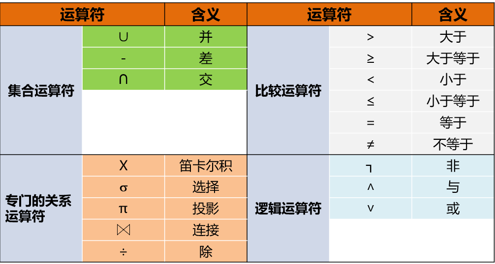

### 集合运算

- 并

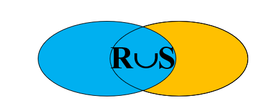

- 差

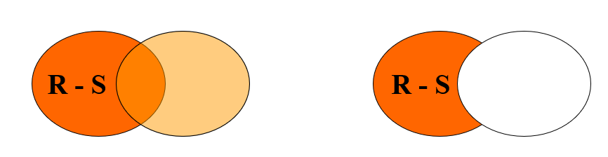

- 交

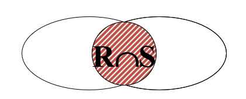

>  并的两个东东必须同类型，属性个数相同，次序相同。每一个元组在结果中只出现一次。

- 笛卡尔积

表示的是两个关系对应元组集合之间可能的组合关系，是两个关系的无条件连接。

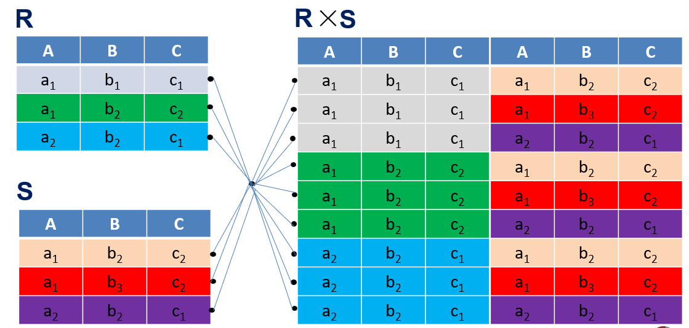

### 关系运算

- ==选择运算$\sigma$:==

  从关系R中选择满足给定条件为真的元组（从行的角度）
  $$
  \sigma_F(R) = {t | t ∈ R，F(t) = true}
  $$

举例：

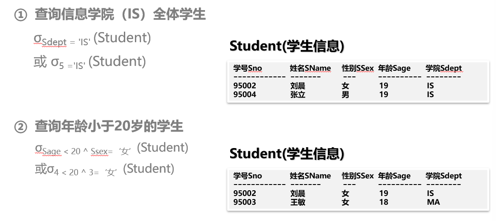

- ==投影运算$\pi$:==

从关系R中取出若干列组成新的关系（从列的角度）
$$
\Pi_A(R) = { t[A] | t∈R},t \subseteq R
$$
举例：

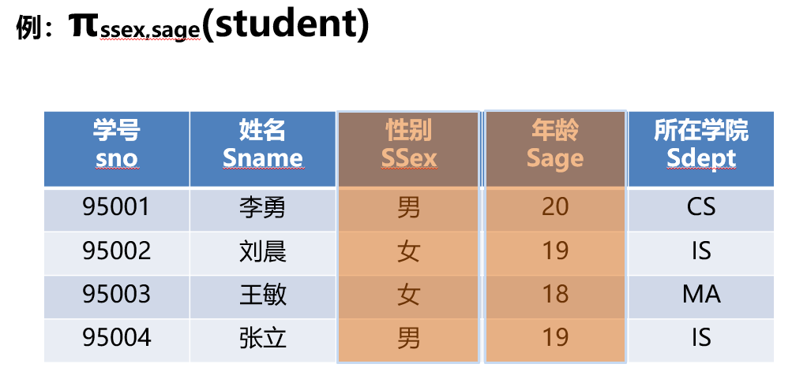

> 可以定义广义投影，就是投影的项目可以是算术表达式。
>
> 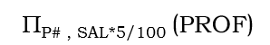

- 改名$\rho$:

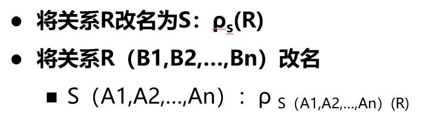

- 笛卡尔积

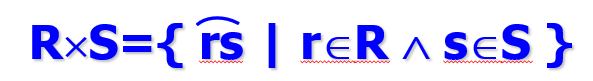

- ==内连接==

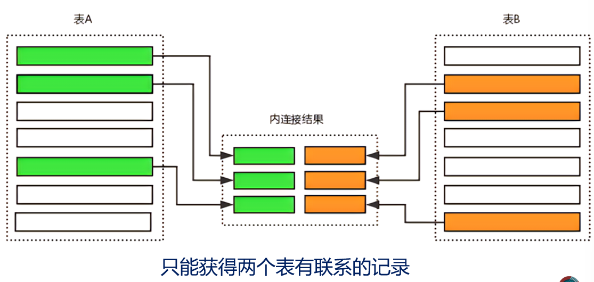

- ==$\theta$连接==

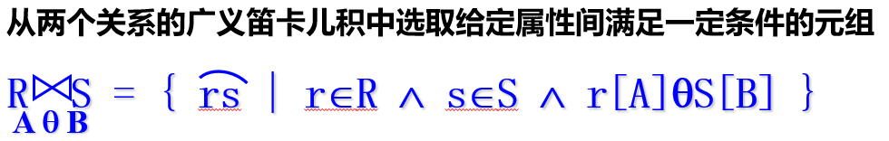

举例：求数学成绩比王红同学高的学生

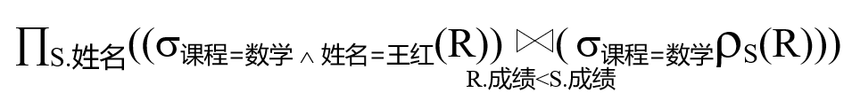

> 当$\theta$为等号的时候是等值连接

- ==自然连接==

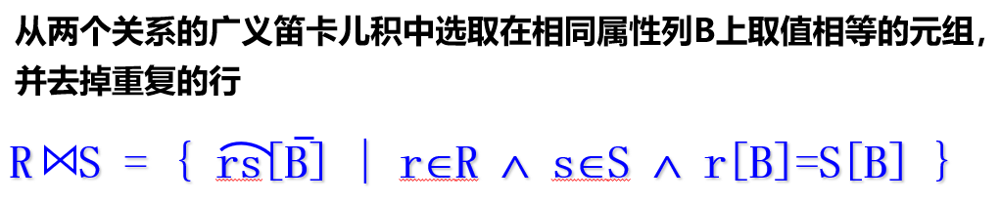

> 自然连接中相等的分量必须是相同的属性组，并且要在结果中去除重复的属性，但是 等值连接就不会去除。

- ==外连接==

保留一个表的所有数据，另一个无关联的记录为null。外连接的主要目的是为了方式因为失配产生的信息丢失。

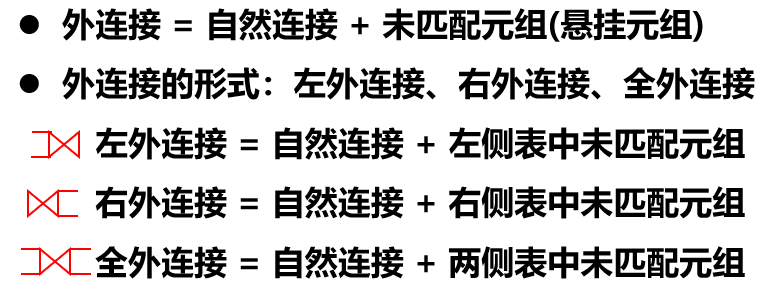

> 哪边外连接，那边的信息就会全部被保留。

#### 赋值运算

就是可以用临时的关系变量 来保存阶段性的关系运算结果。通过赋值给临时关系变量进行结果的传递。
$$
临时关系变量 \longleftarrow 关系代数表达式
$$

> 注意：给永久关系的复制意味着对数据库的修改。

#### 聚集函数

求一组值的统计信息，返回单一的值。

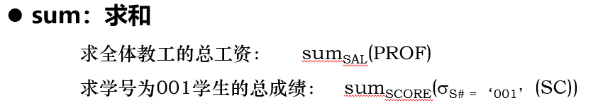

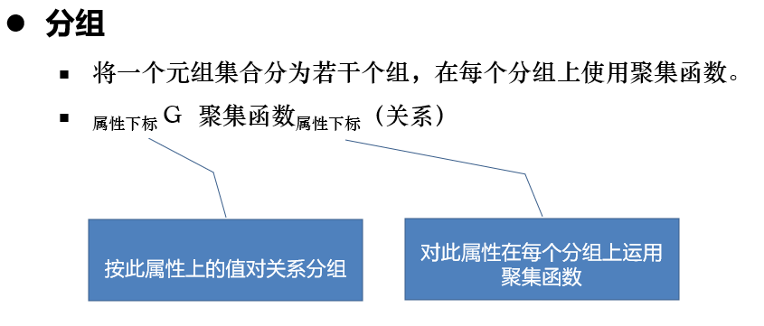

举例：

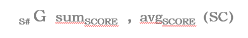
