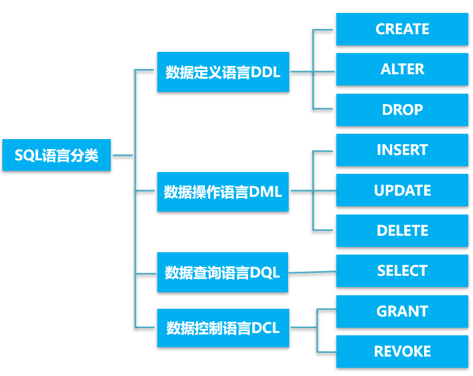
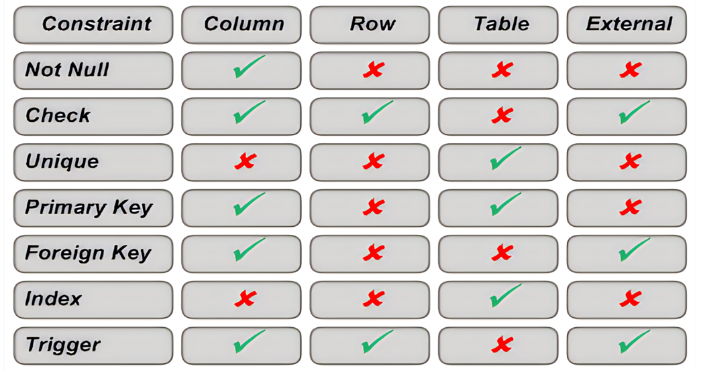
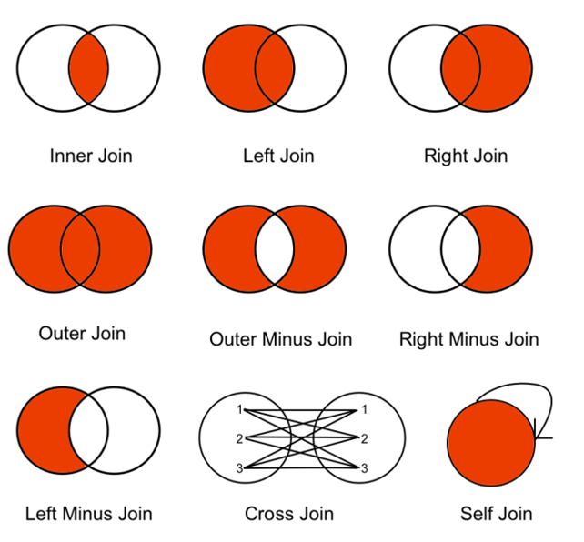

# 结构化查询语言



## 数据定义语言DDL

### create

Create操作包括定义数据库，定义表

- **创建一个仅有数据库名的数据库**

~~~
CREATE DATABASE Teach
~~~

- **创建表**

```CREATE TABLE 
CREATE TABLE School (
    SchoolID char(3) primary key,     --学院ID
    SchoolName varchar(50) not null)  --学院名称
```

### 约束

约束可以定义字列上或者是表上，可以在创建表的时候定义也可以创建之后修改约束定义。



**定义约束：**

~~~
column [CONSTRAINT constraint_name] constraint_type,
~~~

其中column是列的名字，CONSTRANIN是添加约束的关键词，后面跟着你自己给约束起的名字，然后指明约束类型

下面给出一些具体的例子：

~~~
deptno	NUMBER(7,2) NOT NULL);           --not null约束
CONSTRAINT dept_dname_uk UNIQUE(dname))  --unique key约束
CONSTRAINT dept_deptno_pk PRIMARY KEY(deptno))  --主键约束
CONSTRAINT emp_deptno_fk FOREIGN KEY (deptno)
			REFERENCES dept (deptno))           --外键约束
CONSTRAINT emp_deptno_ck  
            CHECK (DEPTNO BETWEEN 10 AND 99)  --check约束
~~~

### Alter

**修改表的定义和索引：ALTER TABLE**

~~~
ALTER TABLE table_name
ADD		   (column datatype [DEFAULT expr]    --增加一列
		   [, column datatype]...)

ALTER TABLE table_name                        --修改某一列
MODIFY/Alter (column datatype [DEFAULT expr]
		   [, column datatype]...)

ALTER TABLE table_name                       --删除某一列
DROP		   (column...)

alter table student add unique(sname)        --增加表约束

ALTER TABLE Student DROP UNIQUE(Sname)      --删除表约束

~~~

### DROP

**删除表：DROP TABLE**

~~~
DROP TABLE student
~~~

### 索引

建立索引是加快查询速度的有效方法，<u>一般是在主键以及unique上面建立索引。</u>

- **建立索引**

~~~
create [unique][clustered] index <索引名>
     on <表名>(<列名>[<次序>][，<列名>[<次序>]]…)
     
CREATE INDEX 	emp_ename_idx
ON 	emp(ename)

~~~

- **索引类型**
  - **unique：**唯一性索引，不允许表中不同的行在索引列上取相同的值。
  - **clustered：**聚簇索引，表中元组按照索引项的值排序并物理地聚簇在一起。一个表上只能建立一个聚簇索引
  - **acs/desc：**索引地排序次序

- **删除索引**

~~~
DROP INDEX index-name
~~~

## 数据操作语言

### INSERT

插入一行记录：

~~~
INSERT INTO	dept (deptno, dname, loc)
   VALUES		('50', 'DEVELOPMENT', 'DETROIT')
~~~

> 在列中可以忽略为空地列，也可以插入函数值。给出的列和值地信息必须一一对应，如果没有指定列，values地值必须和数据表结构地定义一致，包括顺序，类型，字段数等。

**插入子查询数据**

~~~
insert into CS_student
     select sno,sname            
     from Student  where schoolID='480'
~~~

> 执行插入语句的时候系统会检查完整性约束，判断是否能插入。

### UPDATE

~~~
UPDATE table
SET	 column = value [, column = value]
[WHERE condition]
~~~

用wehere明确定义要修改的行

~~~
UPDATE 	emp
     SET    	deptno = 20
     WHERE  	empno = 7782
~~~

用子查询来更新：

~~~
UPDATE  emp
     SET     (job, deptno) = 
   				  (SELECT job, deptno
                             FROM    emp
                             WHERE   empno = 7499)
     WHERE   empno = 7698
~~~

### DELETE

~~~
DELETE [FROM] table  [WHERE  condition]
~~~

用where来明确指明要删除的行

~~~
DELETE FROM	dept
  WHERE 		dname = 'DEVELOPMENT’ 
~~~

用子查询来判定要删除的行

~~~
DELETE FROM	emp
     WHERE		deptno = 
  			       (SELECT   deptno
    			        FROM     dept
    			        WHERE    dname ='SALES')
~~~

> 不能违反约束：不能删除正在被外键引用的行。

## 数据查询语言DQL

**select语法：获取列**

~~~
SELECT	[DISTINCT] {*, column [alias],...}
FROM	table
~~~

> 需要注意的是：NULL不等于0，对NULL值的运算结果还是NULL值。

**起别名：**

~~~
     SELECT ename AS name, sal salary
     FROM   emp
~~~

**连接符号：**<u>用连接符号“+”能创建一个列为组合字符串表达式</u>

~~~
SELECT	ename+ job AS 'Employees'
     FROM 	emp
~~~

#### where

<u>where语句获取满足条件的行。用在from后面</u>

#### 运算符

**between：**获取一个范围的结果

~~~
SELECT	ename, sal
     FROM 	emp
     WHERE	sal BETWEEN 1000 AND 1500
~~~

**in：**判断枚举数据中的存在性

~~~
SELECT	empno, ename, sal, mgr
     FROM 	emp
     WHERE	mgr IN (7902, 7566, 7788)
~~~

**like:**用like操作符从一个字符串中进行匹配查询。%表示0到多个字符匹配，_表示单个字符匹配。

~~~
SELECT	ename
     FROM 	emp
     WHERE	ename LIKE ‘%on'
~~~

> 如果想要搜索本身就带%之类特殊字符的内容，可以用转义符‘\’。

**IS NULL:**判断是不是空值

~~~
SELECT  ename, mgr
     FROM    emp
     WHERE   mgr IS NULL
~~~

**逻辑操作符：**AND OR NOT

#### 结果排序：ORDER BY

**ASC：升序（默认）DESC：降序**

~~~
SELECT  	 ename, job, deptno, hiredate
     FROM    	 emp
     ORDER BY hiredate DESC
~~~

#### JOIN连接

用连接从多个表中查找数据。JOIN连接条件在WHERE语句中，相同的列名在多个表中出现的时候，需要加表明来加以区分。

~~~
SELECT	table1.column, table2.column
FROM	table1, table2
WHERE	table1.column1 = table2.column2
~~~

**这一种是不用JOIN关键词，连接条件就放在where中表示。**

#### 连接的类型



#### 内连接

- **对等连接：**<u>就是JOIN连接。</u>

- **非对等连接：**

~~~
SELECT 	e.ename, e.sal, s.grade
   	FROM	emp e, salgrade s
   	WHERE 	e.sal
   	BETWEEN 	s.losal AND s.hisal
~~~

其实就是判断条件不一样而已，对等就是相等的连接，非对等就是按照给定的条件连接。

#### 外连接

用外部连接可以获取不满足连接条件的行

~~~
SELECT	table1.column, table2.column
FROM	table1 LEFT OUTER JOIN table2
ON	table1.column = table2.column
~~~

**用了JOIN关键字，连接条件就用ON来表示。**

> 连接是可以自身连接的，要给表起个别名来标识。

#### 分组函数：

- **AVG、SUM**
- **MIN、MAX**
- **COUNT**

#### GROUP BY

~~~
SELECT column, group_function(column)
  FROM   table
  [WHERE condition]
  [GROUP BY	group_by_expression]
  [ORDER BY	column]
~~~

>  **有了GROUP BY 语句就是表中的数据按照指定的列进行分组，所以说select中出现的列一定要在GROUP BY 语句中出现才行。**但是GROUP BY 语句中的列不一定出现在SELECT 中。

#### HAVING语句

用HAVING限制组的输出，相当于where的作用。**having是用在group by里面的。**

~~~
SELECT	column, group_function
FROM		table
[WHERE	condition]
[GROUP BY	group_by_expression]
[HAVING	group_condition]
[ORDER BY	column]

~~~

#### 子查询

~~~
SELECT	select_list
FROM	table
WHERE	expr operator
		 	(SELECT	select_list
		       FROM		table)
~~~

**将子查询放在（）里面，放在比较运算符的右边，不能在子查询中增加order by语句**

用**单行操作符和单行子查询**进行运算：=，>=等

用**多行操作符与多行子查询**进行运算。：IN、ANY、ALL等

#### EXISTS条件查询

指定一个子查询，检测行的存在，如果子查询包含行，则返回TRUE。

~~~
--查找与出版商住在同一城市中的作者
SELECT au_lname, au_fname
FROM authors
WHERE exists
             (SELECT 1   FROM publishers   
              WHERE authors.city = publishers.city)
~~~

#### 视图

##### 创建视图

~~~
CREATE VIEW viewname
  [(alias[, alias]...)]
AS subquery
~~~

举例子：

~~~
-- 创建部门编号为10的职工信息视图
CREATE VIEW 	empvu10
     AS SELECT	empno, ename, job
     FROM			emp
     WHERE			deptno = 10
~~~

##### 视图行的操作规则

在简单视图上可以进行DML操作。

<u>有GROUP函数、GROUP BY语句、DISTINCT关键字的时候不能更新数据。</u>

##### 删除视图

<u>删除视图并不会丢失数据</u>，从该视图导出的其他视图定义仍然在数据字典中，<u>必须显式删除。</u>

##### 视图的作用

- **提供逻辑独立性：**假设现在原来的一个表被拆分成了两个表，但是可以通过建立一个视图，将两个表连接起来，让用户模式并保持不变。
- **提供机密数据的安全保护：**对不同用户定义不同视图，让每个用户只有权看到他有权看到的数据。

## 数据控制语言DCL

数据控制功能包括对事物管理和数据保护功能。

#### 授权机制：通过超级用户DBA进行授权

### GRANT：权力授予

~~~
GRANT  权力 [，权力 ] … [ ON 对象类型  对象名 ]
TO  用户名 [，用户名] …
 [ WITH  GRANT  OPTION ]；
~~~

举例：

~~~
GRANT DELETE 
ON TABLE EMP
TO User1
~~~

> 被授权用户可以将权限再授权给其他用户，但是不允许循环授权。

##### WITH GRANT OPTION 语句

用这条语句指定权限可以在被赋予，没有指定就不可以传播

~~~
GRANT INSERT 
    ON TABLE SC 
    TO U5
    WITH GRANT OPTION
~~~


### REVOKE：权力收回

~~~
REVOKE   权力 [，权力 ] … [ ON 对象类型  对象名 ]
FROM  用户名 [，用户名] …；
~~~

举例：

~~~
REVOKE DELETE 
ON TABLE EMP
FROM User1
~~~

##### CASCADE语句

对于授权的时候使用了WITH GRANT OPTION语句的授权，回收的时候要使用CASCADE语句。

意思是说将你的权限收回，同时你给别人的权限也收回。
