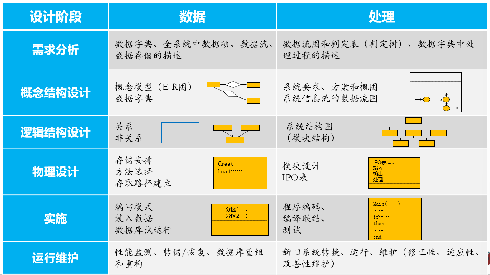
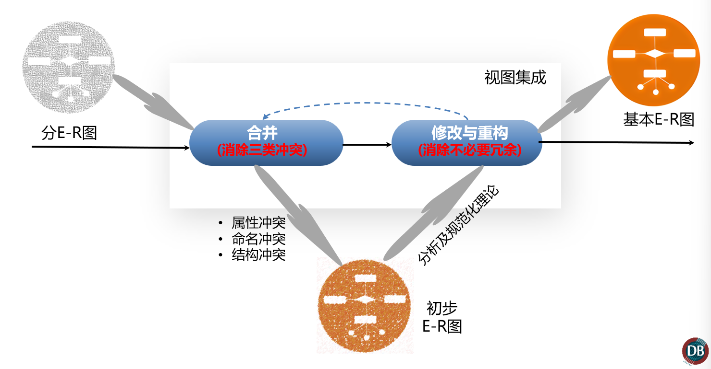
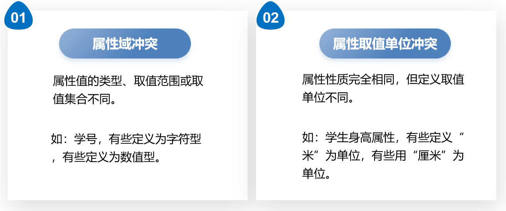
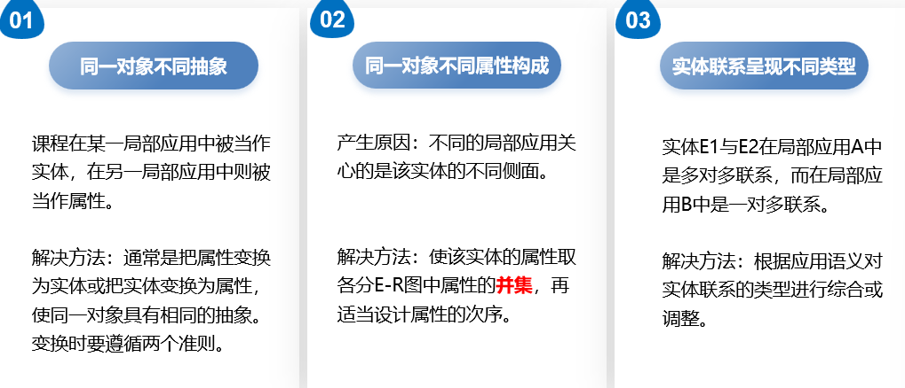
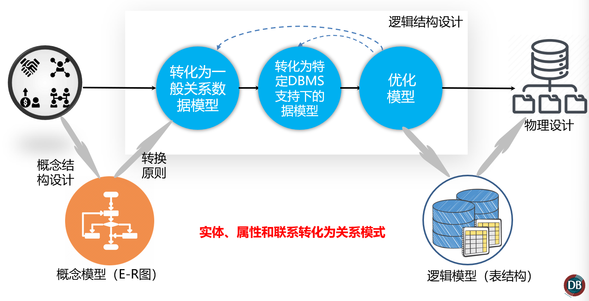
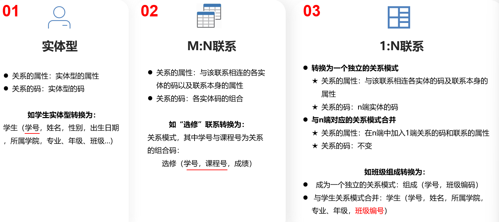
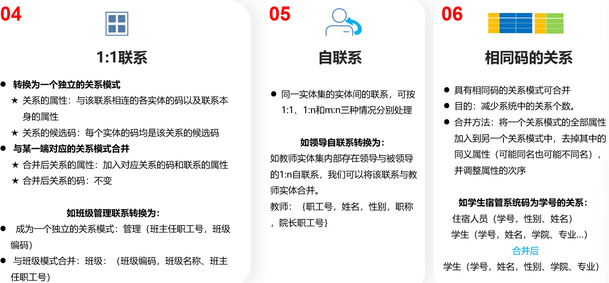

# 关系数据库设计

数据库设计是指对于一个给定的应用环境，构造最优的数据库模式，建立数据库及其应用系统，使之能够有效地存储数据，满足各种用户的应用需求。

#### 数据库设计方法

- 规范设计法：过程迭代和逐步求精（基本思想）
  - 新奥尔良四阶段方法：需求分析；概念设计；逻辑设计；物理设计
  - S.B.YAO六个步骤方法：需求分析、模式构成、模式汇总、模式重构、模式分析、物理数据库设计
  - I.R.Palmer方法：把数据库设计当成一步接一步的过程
- 计算机辅助设计

#### 数据库设计的六个阶段

> 掌握设计过程有哪一些步骤

### 需求分析

#### 数据字典

- 数据项
- 数据结构
- 数据流
- 数据存储
- 处理过程

### 概念结构设计

#### 数据抽象

概念结构是对现实世界的一种抽象，减共同特性抽取出来，忽略非本质的细节，将这些特新精确加以描述，就组成了模型。

- 实体
- 实体属性、码
- 实体间联系类型

#### 实体属性设计一般准则：

- 属性不能再具有需要描述的性质。即属性必须是不可分的数据项，不能再由另一些属性组成。
- 属性不能与其他实体具有联系。联系只发生在实体之间。

### 视图的集成

> 以下的冲突必须掌握

#### 属性冲突

- 属性域冲突
- 属性取值单位冲突

#### 命名冲突

- 同名异义
- 异名同义

#### 结构冲突

- 同一对象不同抽象
- 同一对象不同属性构成
- 实体联系呈现不同类型

#### 消除不必要的冗余

数据冗余和冗余联系要通过规范化的方法消除部分函数依赖和传递函数依赖。

> 看来一通好像概念结构设计就是想好了之后搞一个ER图

### 逻辑结构设计

> 好像逻辑结构设计就是将ER图转换为表的结构

#### E-R图向关系模型的转换

> 大纲里面有这个内容，应该是重点

> 我觉得这一部分讲了就好像讲了一样。

>  总结：关系数据库的设计其实就是从0开始构建数据库的过程，需要从需求分析入手，看清楚需求之后构建概念结构，也即是E-R图，消除了E-R图的一些冲突之后，就要将E-R图转换为逻辑结构，也就是表结构。中间设计具体的转换方法，其实就是根据不同的E-R图展现出来的联系进行不同的表转换。最后还要考虑物理结构和后面的调试和维护。

==重点就在设计概念结构和从概念结构转换到逻辑结构。==