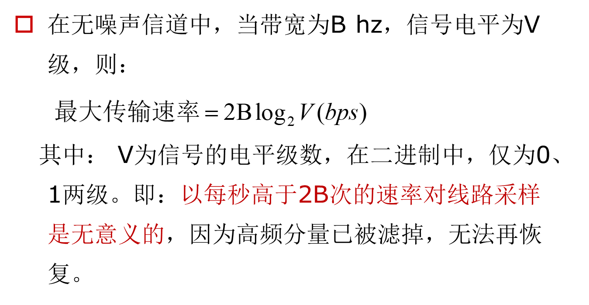
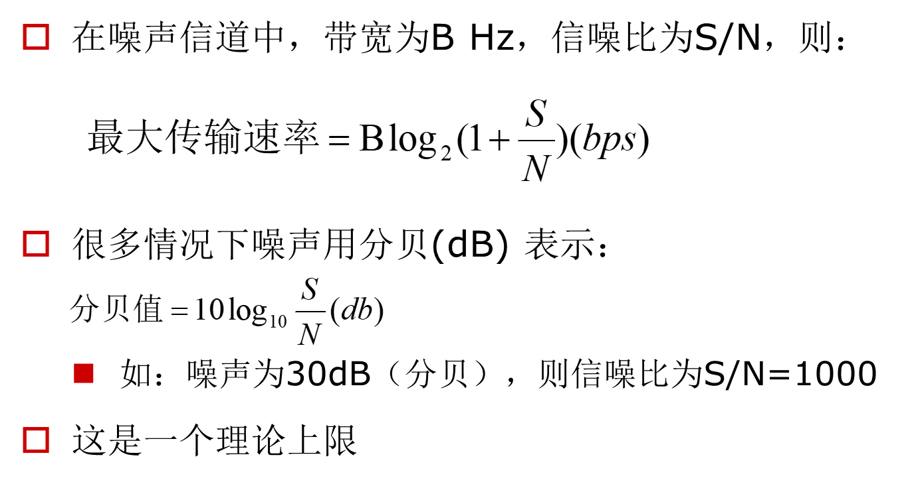
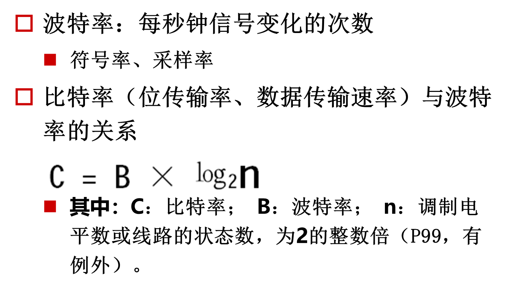
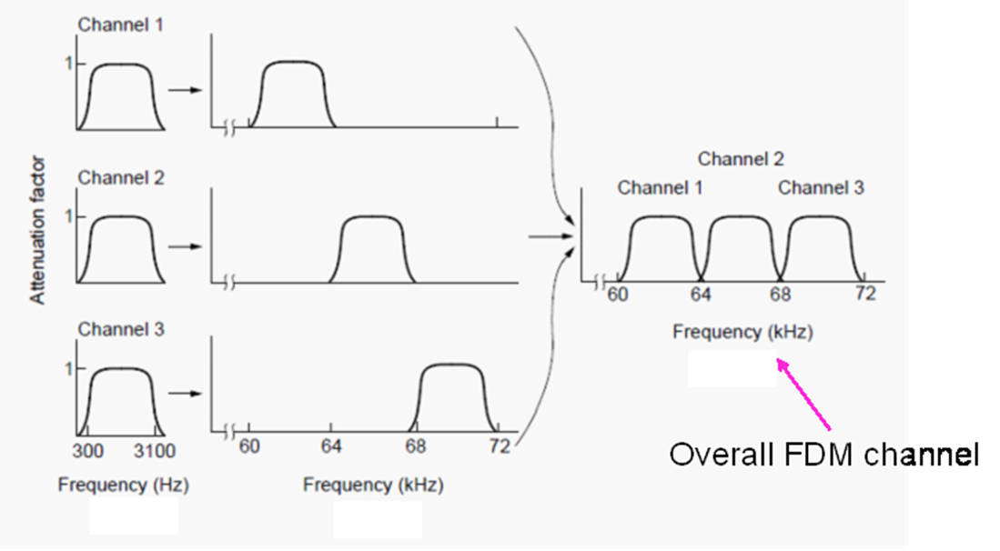
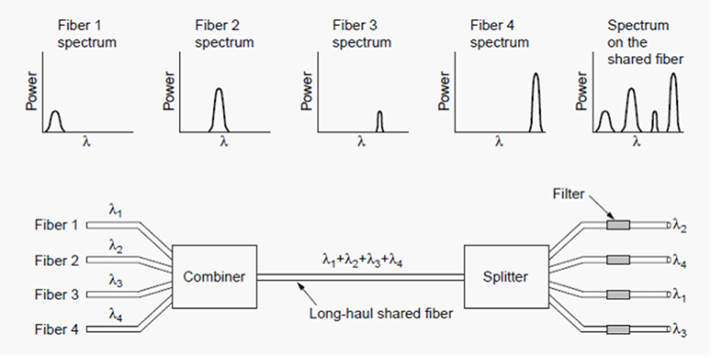
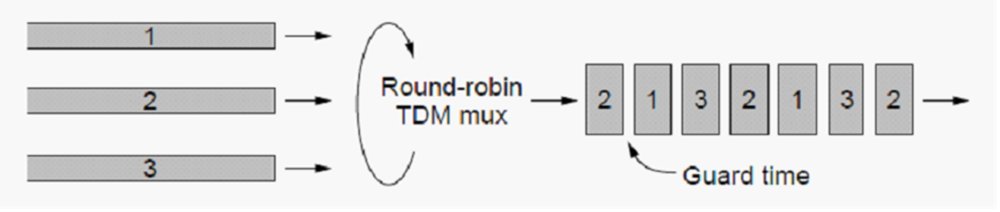
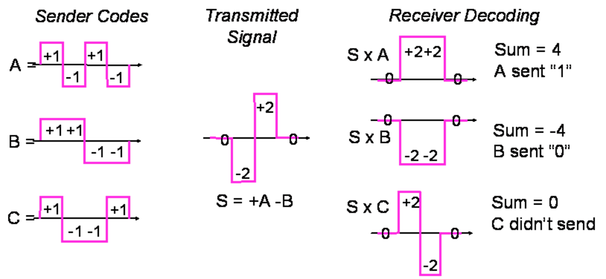

# 物理层

> 物理层的功能
> 在两个网络设备之间提供透明的比特流传输。

## 基本通信理论

>两个关于介质最大传输数据速率的经典定律
>乃奎斯特定理：理想信道，无噪声信道
>香农定理：有噪声信道

### 奈奎斯特定理

注意理解：V表示的是不同码元的个数，假设有16种码元V就是16，取对数的意思其实就是求出需要多少个二进制位取表示一个码元。比如有16个码元就是16个状态，用4位二进制数可以表示。

> 奈奎斯特定理定义了在避免码间干扰的情况下，码元的极限传输率为2W，由此定义了极限传输率。

### 香农定理

**波特率和比特率**

> 奈奎斯特定理讲的是给定带宽下的极限波特率，对码元所表示的种类没有限制。香农定理是对信道的极限数据传输率进行了界定。但是实际计算的时候要根据每一个码元所能表示的离散值数量来计算最大数据传输率，也就是有可能香农定理和奈奎斯特定理都要用。

## 有线传输介质

- 磁介质，如磁带
- 双绞线
  - 非屏蔽双绞线
  - 屏蔽双绞线 
- 同轴电缆
- 电力线
- 光纤
  - 光导纤维的简称；
  - 由极细的玻璃纤维构成，把光封闭在其中并沿轴向进行传播；
  - 优点：重量轻、损耗低、不受电磁辐射干扰、传输频带宽、通信容量大
  - 缺点：昂贵、易断裂
  
  多模光纤适合短距离传输，单模光纤适合长距离传输。

## 数字调制与多路复用技术

**将数据变成模拟信号的过程叫调制，将数据变成数字信号的过程叫做编码**

- **将数据转换为数字信号**

>  重点看曼彻斯特编码（以太网使用的编码）

4B/5B编码，将数据每4位作为一组，将其转换为5位码，32种组合中16种对应4位码，剩下的作为控制码。

- 将数据转换成模拟信号

  - 幅移键控（ASK)
  - 频移键控(FSK)
  - 相移键控(PSK)

  

  - 正交振幅调制(QAM)

### **复用技术是让多用户共享同一根信道**

- **频分多路复用FDM**

  

- **波分多路复用WDM** 

WDM (Wavelength Division Multiplexing), 本质跟 FDM一样,在光纤上复用信号

- **时分多路复用TDM**

在时间上共享信道，用户轮流使用信道
  

- 统计时分多路复用技术
  - **Statistic TDM（STDM）**
  - 动态分配信道，不使用信道的用户不分配，分给有需要的用户使用
  - 利用率可提高2~4倍
  - 实现技术较复杂，通常只在高速远程通信中使用，如ATM
  - 用户平均使用信道的情况不适用

- **码分多路复用（CDM）**

  - 每个用户拥有一个唯一码片序列。码片是正交的，能够同时传输
  
  

> 这样讲吧，CDM是基于正交的向量内积是0，所以无论叠加了多少的正交向量进去传输，只要我用对应的码片去做内积，能得到结果的一定是我要的那一个。

