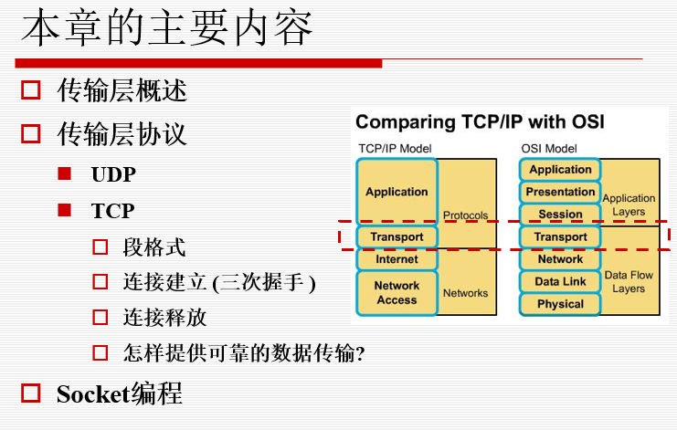
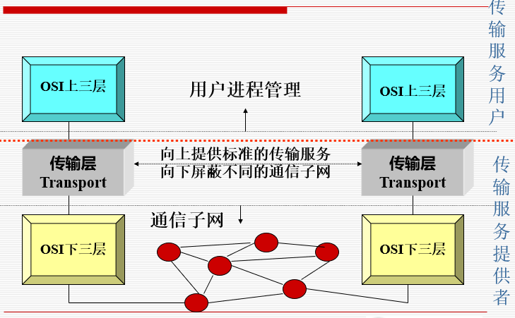
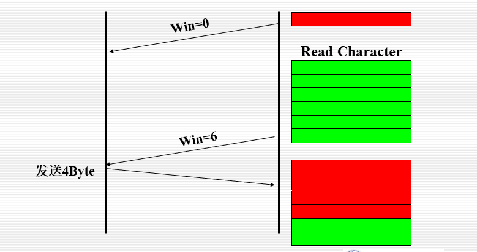

# 传输层

## 参考资料

[tcp三次握手和各个字段的含义](https://blog.csdn.net/weixin_48684274/article/details/108263608)

## 传输层概述

**传输层是整个协议栈**(TCP/IP)的核心

> 传输层的任务是提供**可靠的、高效的**数据传输

### **传输层的地位**

传输层在应用层和网络层之间提供了无缝接口
下四层被看作传输服务提供者，而上三层是传输服务使用者

**传输层的最终目标**是向它的用户（应用层）提供**高效、可靠和性价比高**的服务
完成这项工作的硬件或软件被称为**传输实体**（ transport entity）

**传输实体可能位于：**

- 操作系统内核
- 独立的用户进程中
- 绑定在网络应用中的链接库
- 网络接口卡

### **传输层服务**

有两种传输层服务：

- 面向连接的服务
- 无连接的服务Connectionless

这和网络层提供的服务相似，那为什么需要两个独立的不同的层？

- **网络层运行在由承运商操作的路由器上**，因此用户无法真正控制到网络层
- 把另一层放在网络层之上，可以让用户能够**控制到服务质量（some control）**.
- **传输层原语独立于网络层原语**，而网络层原语会因为网络的不同而不同

### **传输层提供的功能**

1. 端点标识

2. 传输服务

   **面向连接**		  L4与L2的比较
   端到端的连接管理

   - **建立连接**
   - **数据传输**
   - **释放连接**
   - 流控制
   - 差错控制

   **无连接**

作用范围比较

### **传输服务原语**

**传输服务原语让应用程序**可以有途径访问到传输服务

传输服务和网络服务的两个主要差别是：

- **网络服务试图按照实际网络提供的服务来建模**（不可靠的）；而面向连接的传输服务是可靠的
- 网络服务仅被传输实体所使用；而**传输服务直接被应用程序所使用**，必须方便易用

**传输服务原语的一个例子**

连接建立：

- **服务器调用 LISTEN 原语**，阻塞该服务器，直到有客户来连接

- **当一个客户想和服务器通信**，它调用 CONNECT 原语，阻塞该客户，且发送一个分组（封装了传输消息）
- **当分组到达服务器端**，传输实体检查看是否服务器阻塞在 LISTEN 调用中，然后，他解除阻塞，并向客户发回一个CONNECT ACCEPT数据段
- **当这个数据段到达客户端的时候**，客户端解除阻塞，连接建立

数据交换

- 任何一方都可以**执行阻塞的 RECEIVE 原语**，以等待另一方执行SEND原语
- **当数据数据段**（ TPDU）到达时，接收方解除阻塞，并对这个数据段进行处理，发回一个应答
- **只要双方对数据的认识有统一的认识**，这种机制可以工作得很好
- **每个发出的分组都要被确认**，利用网络层的服务；这些确认、定时器、重传等，由传输实体使用网络层协议来管理，**对传输层的用户来说，这些都是不可见的**

连接释放

- **非对称的释放：** 任何一方都可执行 DISCONNECT原语，将 DISCONNECT数据段发给对端的传输实体，数据段到达另一端，连接被释放
- **对称的释放：** 当一方执行 DISCONNECT原语的时候，这意味着它没有更多的数据要发了，但是仍然希望接收数据，只有当双方都执行 DISCONNECT原语后，一个连接才真正被释放

## 传输层协议

### UDP

UDP 是一个**无连接的（connectionless）**的传输层协议
**UDP传输数据段，无须建立连接**
UDP 在 RFC 768中描述
很多C/S应用(如： **DNS**)，都使用UDP发送一个请求，  然后对方应答

**端口（port）定义** 

16 位，共有 216 个端口
端口范围：0~65535

- <1023 : 用于公共应用（保留，全局分配，用于标准服务器），IANA分配；
- 1024~49151 :用户端口，注册端口；
- \>49152 : 动态端口，私人端口。

自由端口(Free port)

- 本地分配
- 动态的随机端口

**注意**

如果收方的校验和为全1，传输无错

二进制反码求和

- 从低位到高位逐列计算
- 0和0相加是0，0和1相加是1，1和1相加是0，但产生进位
- 最高位相加产生进位，该位为1

检错能力较弱，但简单快速

使用协议地址，破坏了分层原则

**UDP小结**

- 提供端点标识，端到端的数据传输

- 不提供差错检测和可靠传输。但**简洁高效**

### TCP

**传输控制协议**

- TCP (Transmission Control Protocol) 是专门为了**在不可靠的互联网络上提供可靠的端到端**字节流而设计的
- TCP必须**动态地适应**不同的拓扑、带宽、延迟、分组大小和其它的参数，并且当有错误的时候，能够**足够健壮**

**TCP 服务模型**

要想获得TCP服务，发送方和接收方必须创建一种称为**套接字（ sockets ）的端点（ end points）**

每个套接字是包含一个IP地址和一个16位的端口（ port ） 

通信进程的全球唯一标识

- 三元组：协议、本地地址、本地端口号
- **五元组：**协议、本地地址、本地端口号、远端地址、远端端口号

**TCP 服务模型**

- 所有的 TCP 连接是**全双工的**(同时双向传输)和**端到端**的(每条连接只有两个端点) 

- TCP **不支持组播和广播**

- TCP连接是**字节流**而不是消息流

#### **TCP 数据段头  **

**源端口 和 目的端口** 字段标明了一个连接的两个端点

- 用来跟踪同一时间内通过网络的不同会话。一般每个端口对应一个应用程序

**序列号** – 字节号 (32 位)

- 初始序列号ISNs(initial sequence numbers )：随机产生的
- SYN: 携带了ISNs 和SYN 控制位的数据段

**确认号** – 期望接收的字节号 (32位)

**TCP 段头长度** – TCP段头长度，**单位32位（4字节）**

保留域/字段

**PSH** 表示这是带有PUSH标志的数据

- 接收方收到这样的数据，应该立刻送到上层，而不需要缓存它

**RST** 被用来重置一个已经混乱的连接

**SYN** 用在连接建立的过程

- **当SYN=1，ACK=0， 连接请求**
- **当SYN=1，ACK=1， 连接接受**

**FIN** 被用来释放连接，它表示发送方已经没有数据要传输了，但是可以继续接收数据.

TCP中的流控(**Flow control**)使用一个可变长的滑动窗口来完成的 

**Window size** – 告诉对方可以发送的数据字节数（从确认字节号开始（**决定于接收方**）

Checksum –提供额外的可靠性

- 校验的范围包括头部、数据和概念性的伪头部

#### TCP连接和释放

**TCP连接的建立**

采用三次握手建立连接

- 一方（server）被动地**等待一个进来的连接请求**
- 另一方（the client）**通过发送连接请求**，设置一些参数
- 服务器方**回发确认应答**，
- 应答到达请求方，请求方最后确认，连接建立

**重复连接请求CR**

SYN泛洪导致DoS攻击（伪造源IP）

数据传输开始后可能有两个原因导致阻塞

- 快的机器向慢的机器发送数据

- 多台机器同时向一台机器发送数据

拥塞避免方法：确认技术、窗口技术

**TCP 连接释放**

释放连接

- **任何一方在没有数据要传送的时候**，都可以发送一个FIN置位了的 TCP 数据段finish
- 当FIN被确认的时候，**该方向的连接被关闭**
- **当双向连接都关闭了的时候，连接释放**

为了避免两军队（two-army）问题，使用定时器

- **如果一方发送了FIN数据段**出去却在一个设定的时间没有收到应答，释放连接
- **另一方最终会注意到连接的对方已经不在了**，超时后连接释放

理论上讲，如果初始DR的和重传都丢了，协议失败

- 发送者将放弃发送且释放连接，但是，另外一端却不知道这些情况，仍然处于活跃的状态
- 这种情形导致**半开放连接（half- open）**

杀死半开放连接的方式P401

- 如果在一定的时间内，**没有TPDUs 到达的话，连接自动释放**
- 如果这样，传输实体在发送一个TPDU的时候必须启动定时器，**定时器超期，将发动一个哑TPDU（dummy TPDU）**，**以免被断掉 P430**

**TCP 传输层策略**

>窗口尺寸受制于接收方

当窗口数为 0 时，发送者不能正常发送数据段，除非: 

- **Urgent数据**。比如，用户想杀掉远端机器上的进程的时候，可以发送数据
- **发送者可以发送一个字节的数据段**，以便让接收者再次发送期待接收的字节号和窗口数（避免死锁）

发送者不需要马上发送应用程序产生的数据

接收者也不需要马上发送应答（当收到数据的时候）

**怎样优化接收端?** 

- 接收端可以推迟500ms发送确认分组和窗口更新窗口，以便可以免费搭载在处理后的回显分组内（free ride）

**怎样优化发送端 ?** 
**Nagle's algorithm (1984):** 

- 当数据以一次一字节的速度到达的时候，只发送第一个字节，然后将后续的字节缓存起来，直到发出的字节得到确认
- 然后将缓存起来的字节在一个数据段中发出，再继续缓存，直到发出的数据得到确认
- Nagle算法在很多TCP上实现，但是有些时候最好禁用，比如：当一个X-Windows应用在互联网运行的时候，鼠标的移动事件必须发送给远程计算机，把这些移动事件收集起来一批一批发送出去，使得鼠标的移动极不连贯

Nagle’s 算法图示

**傻瓜窗口综合症** 

另一个使TCP性能退化的问题是傻瓜窗口综合症（silly window syndrome problem）：当有大块数据被传递给发送端TCP实体，但接收端的交互式应用每次只读取一个字节的时候，问题就来了

**Clark解决方案 ：**

- **阻止接收方发送只有1个字节的窗口更新**，相反，它必须等待一段时间，当有了一定数量的空间之后再告诉发送方
- 而且，**发送方不发送太小的数据段**，相反，他试着等待一段时间，直到积累足够的窗口空间以便发送一个满的数据段，或者至少包含接收方缓冲区的一半大小
- **接收方可以维护一个内部缓冲**，且阻塞上层应用的 READ 请求，直到它有大块的数据提供

发送方（Nagle’s algorithm）

- 尽量不发送数据含量小的数据段
- 缓存应用层的数据，达到一定量再发送

接收方（Clark’s solution）

- 不请求对方发送短数据段(window size)
- 延迟窗口变更信息，使接收缓冲区足够大

#### **TCP拥塞控制**

虽然网络层也试图管理拥塞，但是，**大多数繁重的任务是由TCP来完成的，因为针对拥塞的真正解决方案是减慢数据率**

**分组守恒**：当有一个老的分组离开之后才允许新的分组注入网络

TCP希望通过动态维护窗口大小来实现这个目标

**拥塞检测Congestion detection**

- 所有的互联网TCP算法都假定超时是由拥塞引起的，并且通过监视超时的情况来判断是否出现问题

**拥塞控制Congestion prevention**

- **当一个连接建立的时候，双方选择一个合适的窗口大小**，接收方根据自己的缓冲区大小来指定窗口的大小。
- 如果发送者遵守此窗口大小的限制，则接收端不会出现缓冲区溢出的问题，**但可能由于网络内部的拥塞而发生问题**

互联网解决方案应该是认识到两个潜在的问题的：**网络容量，接收者容量**，然后单独地处理这两个问题 

为此，每个发送者维护两个窗口: 

- **接收者窗口**大小反映了目前窗口的容量 （容易控制）
- **拥塞窗口**大小反映了网络目前的容量（难于控制）
- 发送者发送的数据字节数是**两个窗口中小的**那个窗口数

**决定拥塞窗口的大小**

慢启动算法（Slow Start） (尝试的过程)：

- 当连接建立的时候，**发送者用当前使用的最大数据段长度**初始化拥塞窗口，然后发送一个最大的数据段

- **如果在定时器超期之前收到确认，则将拥塞窗口翻倍**，然后发送两个数据段。。。。。**直至超时**（或达到接收方窗口的大小）

- 确定出拥塞窗口的大小

  如：如果试图发送 4096 字节没有问题，但是发送8192字节的时候，超时没有收到应答，则拥塞窗口设为4096个字节 

> 按指数增长趋势定义拥塞窗口大小cwnd
> 初始：cwnd0 = MaxSegL（当前数据段长度）
> 增长：cwnd1 = 2 cwnd0
>                cwnd2 = 2 cwnd1
>                 • • •
> 截止：达到接收窗口大小或超时
>
> **拥塞窗口二进制指数增长至接收窗口大小或超时**

除了使用接收者窗口和拥塞窗口，TCP拥塞控制还是用了第三个参数，**阈值（threshold）**，初始化为64K

- 当一个超时发生的时候，**阈值降为当前拥塞窗口的一半，同时将拥塞窗口设为一个最大数据段的长度**
- 然后使用**慢启动算法**来决定网络的容量，拥塞窗口增长到阈值时停止指数增长 
- 从这个点开始，每次成功的传输都会让拥塞窗口线性增长（即每次仅增长一个最大的数据段长度）

**拥塞控制算法总结**

- 定义初始拥塞窗口阈值和窗口大小

  Threshold0和cwnd0

- 初始超时

  - 拥塞窗口阈值减半：

    Threshold1 = CWND / 2

- cwnd二进制指数增长至确认超时

- cwnd线性增长至确认超时

  - 拥塞窗口值减半：Thresholdn = CWNDn / 2

  - 定义窗口大小：cwnd = cwnd0

- 重新开始慢速启动过程

#### **TCP定时器管理**

最重要的定时器是**重传定时器(**retransmission timer,Positive ackn. with retransmit） 

> 超时间隔设为多长合适呢？

持续定时器（persistence timer），用来避免如下的死锁（ deadlock ）发生 

- 接收方发送了一个窗口数为零的确认（窗口更新），告诉发送方等待

- 稍后，接收方空出了缓冲，发送更新窗口的数据段，但是，很不幸，该分组丢失啦！

- 现在，收发双方都在等待对方发送数据段过来，但永远等不到！死锁产生

**怎样防止死锁？**

- 保活定时器（keep-alive timer）用来检查连接是否存活，当一个连接空闲的时间超过保活定时器的时间，该连接将被杀掉。
- 最后一个定时器是在关闭时刻处于**TIMED WAIT** 状态中使用的定时器，它运行两倍的最大分组生存时间，以确保连接关闭之后，该连接上的所有分组都完全消失

### **TCP 和 UDP**

TCP

- 可靠传输方式
- 可让应用程序简单化，程序员可以不必进行错误检查、修正等工作

UDP

- 为了降低对计算机资源的需求，如DNS
- 应用程序本身已提供数据完整性的检查机制，勿须依赖传输层的协议来保证
- 应用程序传输的并非关键性的数据，如路由器周期性的路由信息交换
- 一对多方式，必须使用UDP（TCP限于一对一的传送），如视频传播

### 总结

UDP (数据段segment)

TCP (数据段segment)

提高可靠传输的措施 (传输策略)

- 肯定确认重传
- 窗口技术 (滑窗技术)
- nagle 算法 和 clark方案
- 拥塞控制 (慢启动)

