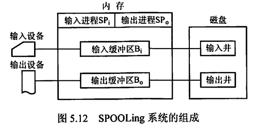
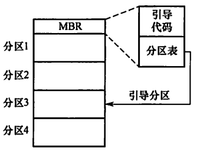

# 输入输出（I/O）管理

## 5.1 I/O管理概述

### I/O设备

#### 设备分类

按照**信息交换**的单位分：

- **块设备：**以数据块作为信息交换的单位，属于有结构型设备
- **字符设备：**无结构，速率低，不可寻址，常采用中断I/O方式。

按照**传输速率**分

- **低速设备：**键盘、鼠标
- **中速设备：**打印机
- **高速设备：**磁盘

#### ==IO接口==

IO接口就是<u>设备控制器</u>，位于CPU和设备之间。

- **设备控制器与CPU的接口：**包含数据线，地址线和控制线。
- **设备控制器和设备的接口：**每个接口都存在数据、控制和状态三种信号。
- **IO逻辑：**用于实现对设备的控制。

设备控制器的主要功能：

- **接受识别CPU发来的命令**
- **数据交换**
- **标识和报告设备状态**
- **地址识别、数据缓冲、差错控制**

#### IO端口

<u>指的是设备控制器中可以被CPU直接访问的寄存器。</u>

- **数据寄存器：**数据缓冲
- **状态寄存器：**获取执行结果和设备的状态信息
- **控制寄存器：**由CPU写入

为了实现CPU和IO端口的通信，有两种编制方式：；

- 独立编址：每一个端口分配一个端口号，组成端口。空间
- 统一编制：每个端口分配唯一的内存地址。

#### IO控制方式

##### 程序直接控制方式

不采用中断机制，CPU绝大部分时间在等待IO设备完成数据IO的循环测试。CPU和IO只能串行工作。

##### 中断驱动方式

允许IO设备主动打断CPU的运行并请求服务。但是数据的每个字的传输都必须经过CPU，仍然会消耗很多CPU时间。

##### ==DMA方式==

<u>在IO设备和内存之间直接开辟数据交换通路，让数据不用经过CPU寄存器，直接读到内存。</u>CPU只在传输一个或者多个数据块的开始和结束的时候才要干活。

##### 通道控制方式

DMA方式的拓展，进一步减少CPU干预。

#### ==IO软件层次结构==

1. **用户层IO软件：**实现和用户交互的接口
2. **设备独立性软件：**实现用户程序和设备驱动器的统一接口
3. **设备驱动程序：**与硬件直接相关。每类设备对应一个设备驱动程序。
4. **中断处理程序：**用于保存被中断的CPU环境，转入中断处理程序进行处理。

> 设备独立性：让程序独立于具体使用的物理设备。为此引入了逻辑设备和物理设备的概念。在应用中用逻辑设备名请求某类设备，在实际执行的时候将逻辑设备名转换为物理设备名。

## 5.2 设备独立性软件

**磁盘高速缓冲：**磁盘缓冲技术指的是<u>利用内存中的存储空间来暂存从磁盘中读取的一系列盘块中的信息。</u><u>磁盘高速缓存从逻辑上属于硬盘，物理上则是驻留在内存中的盘块</u>。有两种实现形式：一种是在内存中开辟一个单独的空间作为高速缓存，另一种是利用未被利用的空间作为缓冲池。

**缓冲区：**引入缓冲区主要为了：

- 缓和CPU和IO设备之间速度不匹配的问题。
- 减少对CPU的中断频率。
- 提高CPU和IO设备之间的并行性。

缓冲技术分为：

- 单缓冲
- 双缓冲
- 循环缓冲

> 这里应该不用详细了解具体的缓冲技术，只要知道缓冲技术大概是干什么的就可以了。

### 设备的分配和回收

有三种设备的使用方式:

- **独占式使用设备**
- **分时共享使用设备**
- **以SPOOLING方式使用外部设备**

设备分配的数据结构：（初步认为不是很重要）

- 设备控制表（DCT）：一个设备控制表就表征一个设备。控制表中的表项就是设备的各个属性
- 控制器控制表（COCT）：表征设备控制器的属性
- 系统设备表（SDT）：表征连接到系统的所有物理设备情况
- 通道控制表（CHCT)：表征一个通道

设备分配的策略：要充分发挥设备的效率，又要避免死锁。

分为**静态分配**和**动态分配**两种：静态分配就是作业在开始执行的时候就一次性申请全部资源，动态分配就是边运行边申请资源。<u>（结合死锁部分理解）</u>

从逻辑设备名到物理设备名的映射：在系统中设置一个国际设备表，将逻辑设备名映射为物理设备名。

### ==SPOOLING技术（假脱机技术）==

为了缓和CPU和IO设备之间的速度差异，引入脱机输入输出技术。**这是一项将独占设备改造成共享设备的技术。**

*简单来说，就是在磁盘上开辟一个空间，称为输入井和输出井，这俩就好玩了，输出井在CPU面前假扮IO设备，让CPU以为它已经将数据给了IO，CPU这个时候觉得哎呦不错哦，很快哦。实际上这个输出井只是默默接受CPU的输出，然后慢慢将其搞到IO上面。*

*输入井就是在IO面前扮演CPU，输入井就一直收IO的信息，收集到一定程度之后才给CPU。*                       

## 5.3 磁盘

> 需要注意的是：磁盘的额存储能力受限于最内道的最大记录密度

磁盘地址：
$$
柱面号·盘面号·扇区号
$$
扇区是最小的可寻址单位。

### 磁盘的管理

**初始化：**将磁盘划分为扇区进行数据结构的填充。一个扇区的数据结构通常包括头部，数据区域和尾部。

**分区：**

- 将磁盘划分为一个或者多个柱面组成的分区，每个分区的起始扇区和大小都记录在磁盘主引导记录中。
- 为每一个分区创建文件系统。

**引导块：**引导块的作用就是帮助系统运行，将必要的文件系统等信息载入内存。

> 这一部分的内容其实就是**文件管理**中的内容，因为磁盘本身就是文件系统的载体。

**坏块：**磁盘还会损坏并产生坏块。

### ==磁盘调度算法==

一次读写操作时间分为三个部分：寻道时间，旋转延时，传输时间

- **寻道时间$T_s$**。就是磁头移动到指定磁道所需要的时间。主要和跨越的磁道数有关，当然还包括启动磁臂的时间。

$$
T_s = m * n +s
$$

其中m是速度常数，启动时间s为常数

- **旋转延时$T_r$**

$$
T_r = \frac{1}{2r}
$$

r为磁盘旋转速度。

- **传输时间$T_t$**

$$
T_t = \frac{b}{rN}
$$

r为磁盘每秒的转数，N为一个磁道上面的字节数，b表示需要传输的字节数。

#### FCFS先来先服务

公平，接近随机调度

#### SSTF最短寻找时间优先

寻找需要与当前磁头位置距离最近的磁道的请求去执行。并不能保证总的平均寻找时间最小，但是会提供比FCFS较好的性能。会产生“饥饿”。

#### SCAN电梯调度

寻找当前移动方向上最近的磁道的请求来执行。对扫描过的部分不公平

> 磁头走到头之后折返，并不是当前方向没有了就掉头

####  循环扫描

电梯算法是折返换一个方向找，这个算法是每一次沿着单一方向走到头之后从0开始，保持方向不变然后再扫描。

> 也就是说这两个扫描算法都是严格从一端到另一端。

#### Look调度和CLook调度

改进了扫描算法，不用走到头了。

> 要注意区分这里的CLook和页面调度算法的CLOCK算法。俩个真的是不同的，名字都不一样。

### CLOCK定时器

