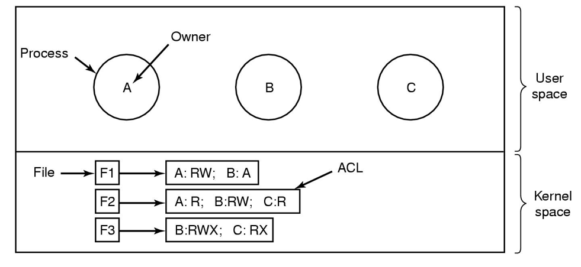

# 安全

这一部分主要是了解为主，可能出一些选择题吧，应该不是重点。

## 安全环境

| 目标       | 威胁     |
| ---------- | -------- |
| 数据机密性 | 数据暴露 |
| 数据完整性 | 数据篡改 |
| 系统可用性 | 拒绝服务 |

### 入侵者

- 非专业用户的浏览
- 内部人员的窥视
- 为了利益
- 商业军事间谍

## 操作系统安全

我们只关注有关操作系统的安全。一般来讲都将消息或者文件进行转码加密，对程序进行加固。

### 可信系统

#### 可信计算基（TCB）  

~~线程控制块也叫TCB~~

每一个可信系统的核心是最小的可信计算基，其中包含了实施所有安全规则所必须的硬件和软件。如果这些TCB根据系统规约工作，那么无论发生什么错，系统安全性都不会受到威胁。

典型的PCB：

- 大多数硬件 
- 内核的一部分
- 掌握超级权限的进程

#### 访问监视器

访问监视器接受所有与安全有关的系统请求，然后决定是否允许执行。

## 保护机制

### 保护域

Domain是一对（object,right）的组合。每一对组合指定一个对象和一些可以在上面运行的操作子集。一般来讲object相当于单个用户，right表示对某个对象的操作。

### 保护矩阵

利用保护矩阵来判断是否可以从指定的域以特定的方式访问给定的对象

#### 域的切换

使用操作enter将域本身作为对象，就可以将切换域的操作作为一种权限去执行。

### 访问控制表：按列存放

实际用的过程中保护矩阵太大、太稀疏了。所以可以按照列来存放。

列表包含所有可访问对象的域以及这些域如何访问这些对象的方法。

### 两个访问控制列表

引入角色概念，一个人可以不单单有用户ID，还可以有组ID，那么AC中就有这样的条目：UID，GID：right1；

检查的时候必须UID和GID都对的上才能访问。这样子的意义是为了避免拥有多个身份的个体在用不同身份的时候进行访问。

•Tana,*:RW     (定义权限与登录组无关）

•Virgil，*:(none);*,*RW  （除Virgil外所有的用户可以读写文件)

### 权能字

和每一个进程相关的是可访问的对象列表，以及每个对象上可以执行的操作。叫做权能字列表

权能字表必须防止用户篡改。

保护方法：

- 带标记的体系结构：用额外的标记位判断是不是包含权限字。标记位智能在核心态修改
- 在操作系统里面保存权能字列表，根据位置来引用权能字
- 加密之后放在用户空间里

可用于全部对象的普通权限：

- 复制权能字
- 复制对象
- 移除权能字
- 销毁对象

## 安全系统的形式化模型

### 保护矩阵

保护矩阵上的6种保护命令：

- create/delete  object/domain
- insert/remove  right

所有可能的矩阵被划分为授权状态集合和未授权的集合

### 多级安全

自主访问控制：DAC

强制访问控制：MAC

#### Bell-LaPadula模型

- 简易安全规则：可以读取同一密级或者更低的对象
- *规则：只能写同一密级或者更高的对象

### Biba模型

- 简单完整性规则：只能写同一等级或者更低的对象
- 完整性*规则：只能读同一等级或者更高的对象

> Bell-laPadula 和 Biba是矛盾的，注意区分

### 隐蔽通道

就像特工打摩斯密码一样，通过服务器的一些骚操作来向协作程序传递信息。

难以防范。~~除非他老是东张西望、贼眉鼠眼、手指动来动去，不然根本发现不了。。。~~

#### 隐写术：通过RGB值的低位来传递信息

## 密码学基础

### 私钥加密

### 公钥加密

### 单向函数

### 数字签名

保证信息传输的完整性、发送者的身份认证、防止交易抵赖

将文档进行散列计算，得到签名块，加密后附加在文档后面发送给接收方。接收方收到后计算散列值，然后解密，看一下对不对的上。

#### 数字证书：（用户签名、公钥、可信第三方数字签名）。认证机构CA作为可信的第三方提供签名整数，采用PKI公钥基础设施管理公钥

## 用户验证

基于以下三方面考虑

1. Something the user knows

2. Something the user has

3. Something the user is

### 输入登录名和密码

#### salt：随机数

将密码和随机数连接起来一同加密，存放加密后的东西

在文件名种存放：登录名、salt、密码+salt的加密结果。

### 智能卡

### 生物信息识别

## 软件漏洞

### 缓冲区溢出攻击

数据覆盖了返回地址的地方，所以就可以被黑客特意用一段东西让你溢出，让你特意指向一段他的代码段。

### 返回lib攻击

通过缓冲区溢出的方法让你跳回lib，获得系统功能。

### 命令注入攻击

让目标程序执行命令而没有意识到它在执行命令

## 内部攻击

### 逻辑炸弹

满足一些逻辑就会执行的程序，平时不会爆发，但是满足一些逻辑就会触发

### 后门陷阱

跳过一些正常的认证流程。

### 登录欺骗

搞一个假的登录界面让你输入账号密码

## 恶意软件

### 特洛伊木马

将恶意代码嵌入到应用程序种，让你安装。

### 病毒

能够自我复制繁殖。

- 拒绝服务
- 永久损害硬件

病毒首先先植入到别的应用种，然后感染它，潜伏然后爆发。

### 蠕虫

- 引导程序
- 蠕虫本身

## 防御

### 病毒扫描器

记录程序长度，看有没有突然变长（被感染）

其他方法：

- 完整性检查
- 行为检查
- 病毒预防
  - 好的系统
  - 只用安全软件
  - 用防病毒软件
  - 不要乱点连接
  - 频繁备份
- 从病毒种恢复