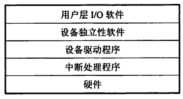

# 输入输出（I/O）管理

## 5.1 I/O管理概述

### I/O设备

#### 设备分类

按照**信息交换**的单位分：

- **块设备：**以数据块作为信息交换的单位，属于有结构型设备
- **字符设备：**无结构，速率低，不可寻址，常采用中断I/O方式。

按照**传输速率**分

- **低速设备：**键盘、鼠标
- **中速设备：**打印机
- **高速设备：**磁盘

#### ==IO接口==

IO接口就是<u>设备控制器</u>，位于CPU和设备之间。

- **设备控制器与CPU的接口：**包含数据线，地址线和控制线。
- **设备控制器和设备的接口：**每个接口都存在数据、控制和状态三种信号。
- **IO逻辑：**用于实现对设备的控制。

设备控制器的主要功能：

- **接受识别CPU发来的命令**
- **数据交换**
- **标识和报告设备状态**
- **地址识别、数据缓冲、差错控制**

#### IO端口

<u>指的是设备控制器中可以被CPU直接访问的寄存器。</u>

- **数据寄存器：**数据缓冲
- **状态寄存器：**获取执行结果和设备的状态信息
- **控制寄存器：**由CPU写入

为了实现CPU和IO端口的通信，有两种编制方式：；

- 独立编址：每一个端口分配一个端口号，组成端口。空间
- 统一编制：每个端口分配唯一的内存地址。

#### IO控制方式

##### 程序直接控制方式

不采用中断机制，CPU绝大部分时间在等待IO设备完成数据IO的循环测试。CPU和IO只能串行工作。

##### 中断驱动方式

允许IO设备主动打断CPU的运行并请求服务。但是数据的每个字的传输都必须经过CPU，仍然会消耗很多CPU时间。

##### ==DMA方式==

<u>在IO设备和内存之间直接开辟数据交换通路，让数据不用经过CPU寄存器，直接读到内存。</u>CPU只在传输一个或者多个数据块的开始和结束的时候才要干活。

##### 通道控制方式

DMA方式的拓展，进一步减少CPU干预。

#### ==IO软件层次结构==

1. **用户层IO软件：**实现和用户交互的接口
2. **设备独立性软件：**实现用户程序和设备驱动器的统一接口
3. **设备驱动程序：**与硬件直接相关。每类设备对应一个设备驱动程序。
4. **中断处理程序：**用于保存被中断的CPU环境，转入中断处理程序进行处理。

> 设备独立性：让程序独立于具体使用的物理设备。为此引入了逻辑设备和物理设备的概念。在应用中用逻辑设备名请求某类设备，在实际执行的时候将逻辑设备名转换为物理设备名。

## 5.2 设备独立性软件

#### 高速缓存与缓冲区

磁盘高速缓存：指的是利用内存中的存储空间来暂存从磁盘中读出的一系列信息。逻辑上属于磁盘，物理上是驻留在内存中的盘块。一种是在内存中开辟独立空间作为缓存，大小固定。另一种是把未利用地空间作为缓冲池。

#### 缓冲区（Buffer）

引入缓冲区主要是为了缓和CPU和IO设备速度不匹配的矛盾，减少CPU中断，提高CPU和IO的并行性。可以采用硬件缓冲器或者在内存中采用缓冲区的方式进行。

缓冲技术分为以下几种：

1. 单缓冲
2. 双缓冲
3. 循环缓冲

> 我觉得这里应该不用详细掌握各种缓冲的具体技术。

#### 设备的分配与