# 内存管理

内存管理就是对内存的划分和动态分配，其产生的原因主要是内存容量与用户进程之间的矛盾关系，不可能将所有的用户进程和系统程序与数据全部放入主存。

### 进程运行的基本原理

1. **进程的链接与装入**

进程的创建需要经过

- **编译**
- **链接**
  - 静态链接：一次性链接
  - 装入时动态链接：边装入边链接
  - ==**运行时动态链接：**==边运行边链接，没用到的不会被链接到。
- **装入内存**
  - 绝对装入：只适合单道程序环境。产生的是绝对地址。
  - 可重定位装入：将起始地址从0编程当前内存的起始位置。地址变换在进程装入时一次完成。要求一次性分配全部的内存空间，分配了也不再移动。
  - ==**动态运行重定位**：==将地址变换过程推迟到程序真正执行的时候才进行。这样可以将程序分配到不连续的存储区，运行的时候可以只装入部分代码。

2. ==**逻辑地址和物理地址**==

- 逻辑地址（相对地址）：程序中的地址，从0开始编号的。进程在运行的时候程序看到的都是逻辑地址。不同的进程可以有相同的逻辑地址。
- 物理地址：内存中物理单元的集合，是地址转化的最终地址。
- 地址重定位：将逻辑地址转换为物理地址。

3. **进程内存映像**

- 代码段：只读的代码
- 数据段：包括全局变量和静态变量，这一段和代码段在装入的时候就大小确定了。
- PCB：放在系统区
- 堆：存放动态分配的变量
- 栈：用来实现函数调用 ，这两段是动态的。

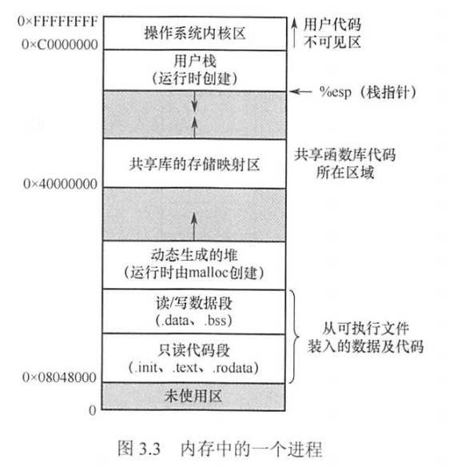

4. **内存保护**

确保每个进程都有独立的内存空间

- 上下限寄存器，判断有没有越界
- 重定位寄存器和界限寄存器：界限寄存器用来比较，重定位寄存器用来加。

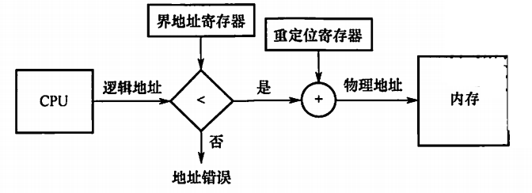

5. **内存共享**

只有只读的区域才可以共享。可重入代码（纯代码）指允许多个进程同时访问但不允许被任何进程修改的代码。

### 连续分配管理方式

连续分配是指为一个程序分配一个连续的内存空间。主要分为单一连续分配，固定分区分配，动态分区分配

1. 单一连续分配：内存分为系统去和用户区，<u>用户区由一个程序独占</u>。
2. 固定分区分配：将用户空间分为固定大小的区域，每个分区只装一个作业。分区大小可以相等和也可不相等地划分（自己想优缺点）。一般用一个分区表来维护内存的分区。

会产生内部碎片，无外部碎片。

3. 动态分区分配：根据进程实际需要，动态分配内存。系统中分区的大小和数量是可变的。用空闲分区链来维护内存分区。（涉及到链节点的合并）

会产生外部碎片，可以采用紧凑技术来解决，但是非常耗时。

**==在这种分配情况下，有以下的动态分区分配策略：==**

- First Fit：通常最好最快，但是低地址会出现很多小碎片
- Next Fit：从上一次查找结束的位置开始找：尾部产生碎片，通常比First差
- Best Fit：找到满足要求且最小的：会产生最多外部碎片
- Worst Fit：找到满足要求的最大的。一般将空闲区用优先队列存起来，每次取顶顶的。最不容易产生碎片，但会导致没有大的内存块用。

### 非连续分配管理方式

非连续分配方式根据分区大小是否固定分为==分页式==和==分段式==。在分页管理中，根据运行作业是否要把所有页面全部装入内存，分为==基本分页存储管理==和==请求分页存储管理==。

### ==基本分页存储管理==

分页思想：将主存空间划分为大小相等且固定的块，块相对较小，作为主存中的基本单位。只会在进程最后一个不完整块分配的时候产生页内碎片。

#### 分页存储的概念

##### 页面和页面大小

进程中的块为页面，内存中的块为页框。外村中直接成为块。分配就是为每一个页面分配一个页框。

##### 地址结构：页号-页内偏移

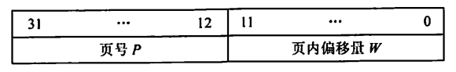

##### 页表

每个进程一个页表，记录了页面在内存中对应的物理块号，页表一般在内存中。

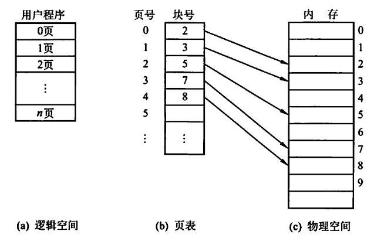

#### ==基本地址变换==

设置页表寄存器存放页表在内存的起始地址和页表长度。这两个东西存放在PCB中。

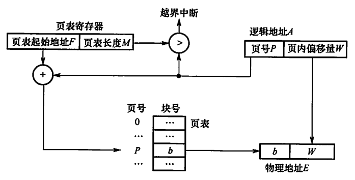

页式管理只要给出一个整数就能确定对应的物理地址。整个地址变换过程是由硬件自动完成的。

分页管理的几个问题：

- 每次访问都必须要地址转换，访问指定的内容要两次访问内存。
- 每个进程都有页表，页表会占用内存。

#### 有TLB的地址变换

先用硬件进行地址转换，将页号TLB比较，找到了就直接访问内存。如果没找到，就要访问页表，在页表找到后同时放进TLB中。

#### ==两级页表（多级）==

顶级页表最多只能有一个页面。建立多级页表的核心在建立索引，这样没用到的页表项可以不用调入主存，也不用盲目按顺序查找页表项。

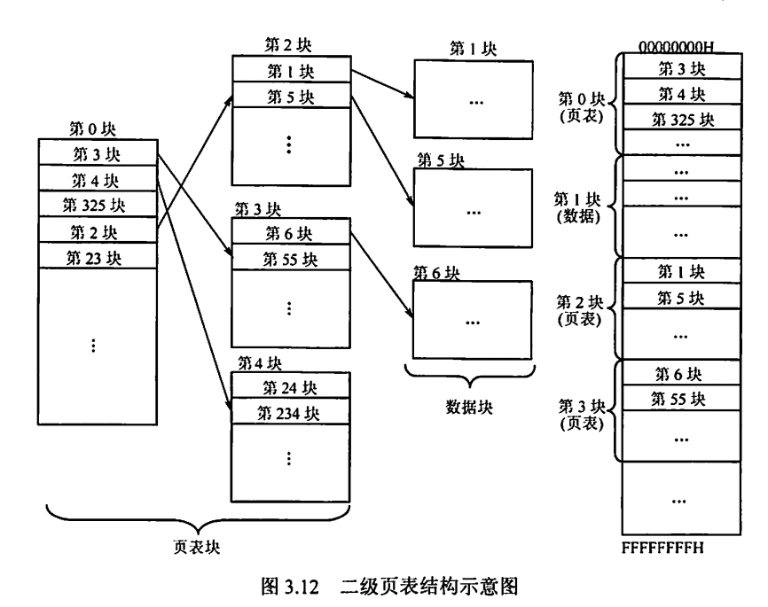

### ==基本分段存储管理==

分段管理的目的时提高内存利用率，提升计算机性能。

#### 分段

按照用户进程中的自然段划分逻辑空间。每段从0开始编制，并分配一段连续的地址空间。（段内要求连续，段之间不要求连续，所以整个地址空间时二维的）

##### ==地址结构：段号-段内偏移==

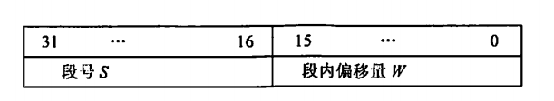

在段式系统中，段号和段内偏移必须由用户显示提供。

#### 段表

每个进程一张逻辑空间与内存空间映射的段表。段表中的段表项对应进程中的一段。

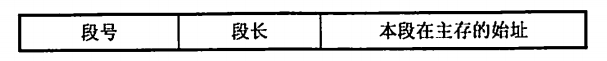

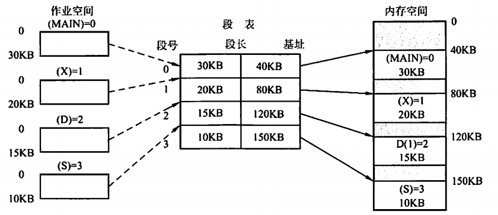

#### ==地址变换==

设置段表寄存器，存放段表起始地址F和段表长度M。

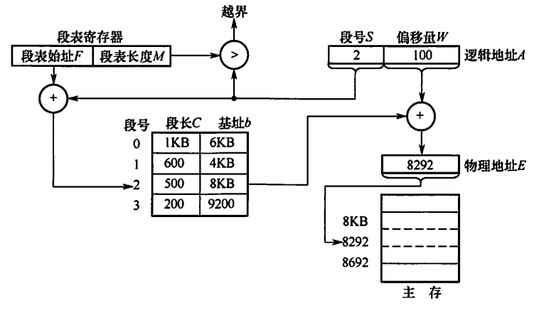

#### 段的保护和共享

段的共享是两个进程的段表中对应表项指向同一个被共享的段。段的地址越界保护既要判断段号是否越界，又要判断段内位移是否越界。

==需要注意的是：无法通过一个数就确定物理地址，因为每一段的长度不固定，所以段号和段内偏移一定要显示给出。==

### ==段页式管理==

分页式能提高内存利用率，分段式能反映程序逻辑结构并有利于段的共享和保护。

在段页式中，地址首先被分成若干逻辑段，然后每个段分为若干大小固定的页。

作业的逻辑地址分为三部分：==**段号、页号、业内偏移量**==

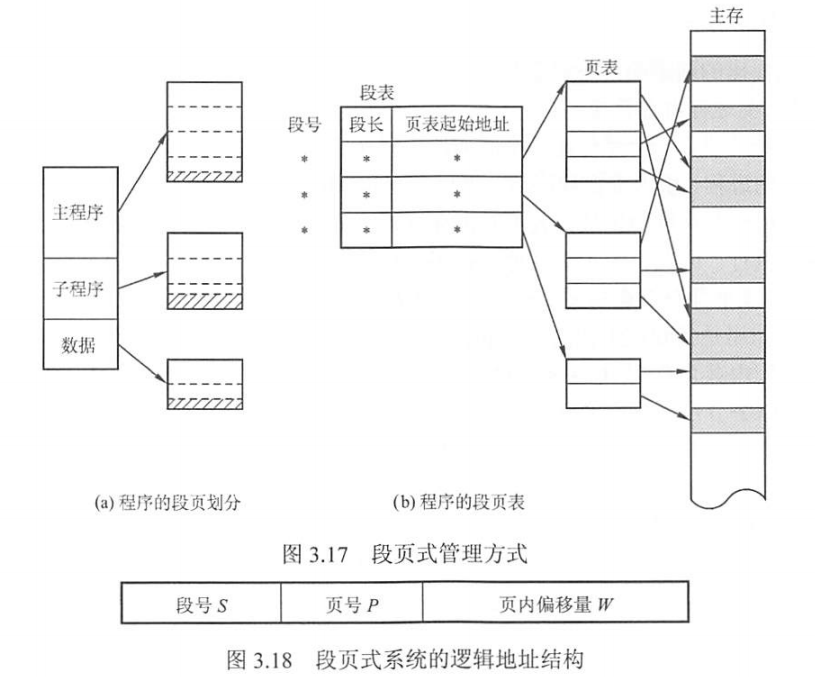

系统为每一个进程建立一个段表，每一个分段有一个页表。段表中存放段号，页表长度，页表起始地址。页表中包含页号和块号。

> 一个进程中，段表只有一个，页表可能有多个。

地址变换的时候首先根据段表访问到页表，再由页表找到物理地址，再去访问物理地址需要==三次访问内存。==

## ==虚拟内存管理==

局部性原理：

- 时间局部性：程序中的指令一旦执行，不久后可能再被执行。
- 空间局部性：一旦程序访问了某个单元，在不久后其附近的单元也将被访问。

虚拟存储器特征

- 多次行：多页被允许分为多次调入内存运行。
- 对唤性：作业无需再运行时一直常驻内存，允许暂不用的程序换到外存
- 虚拟性：从逻辑上扩充内存容量。

虚拟内存技术主要依赖于请求分页（段/段页）存储管理，需要有一定量的内外存，有页（段）表机制，有中断机构和地址变换机构的硬件支持。

### ==请求分页管理方式==

请求分页系统建立在基本分页系统的基础上。增加了请求调页和页面置换功能。

1. **页表机制**

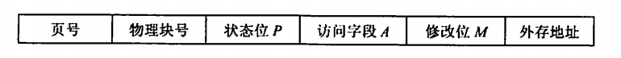

新增各种状态位，解决在不在，动过没有，有几个人动过的问题。

2. **缺页中断**

当访问的页面不在内存中的时候就产生缺页中断，将缺的页调入内存，看情况要不要淘汰。<u>由于缺页中断是在一条指令的执行期间处理的，是内部异常。</u>

3. **地址变换机构**

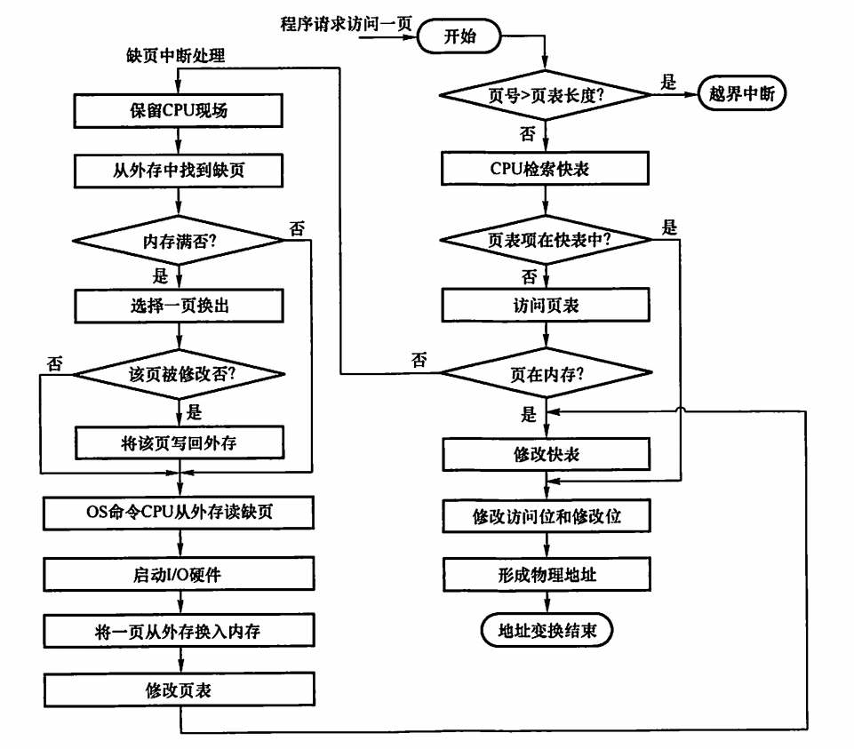

<u>这一部分需要额外注意一下TLB，页表和缺页处理之间的关系，其实不难。</u>

### 页框分配

##### 驻留集

规定给每一个进程的固定数量的页框数量。太多太少都不好。可以理解为给每个进程分配的内存大小。

##### 内存分配策略

- **固定分配局部置换：**给每个进程分配固定数量的物理块，运行期间不变。缺页就局部换出。至于每个进程分多少呢，主要有以下三种方法：
  - 平均分配：每个进程平均
  - 按比例分：进程大的分多一点
  - 优先权分配：重要和紧迫的进程分多一点
- **可变分配全局置换：**给每个进程分配的物理块在运行过程中可以适当改变。缺页的时候可以从空闲的块中抽出来分给这个进程。但是这样做会盲目增加给一个进程的物理块
- **可变分配局部置换：**一开始就给你分这么多，发现你老是缺页，才给你适当分多一点。

**页面调入的时机：**预调页策略（理论上不错，但是目前成功率不高）或者是请求调页策略

在外存中设置了一个**对换区**，对换区是连续分配的，IO速度比文件区快。对换区是用来存放和对换的页面的，也就是从内存换出来的页面。

### ==页面置换算法==

- **最佳置换算法（OPT）**

换出未来最长时间内不再被访问的页面，但其实我们并不知道未来它会不会被使用，所以这个算法只是理想算法。

- **先进先出页面置换算法（FIFO）**

优先淘汰最早进入内存的页面，只需要将调入的页面按照先后次序排成一个队列，每次从队头取一个页面换掉就好了。但是有可能会出现Belady异常。

> Belady异常：分配的物理块数增大但是缺页数不降反增。
>
> 只有FIFO会出现Belady异常。

- **最近最久未使用置换算法（LRU）**

选择最近最长时间未被访问的页面予以淘汰，依据了局部性原理。LRU算法是用堆栈实现的。

- **时钟置换算法（CLOCK）：**也可以叫最近未使用算法（NRU）、二次机会算法

  - 简单的CLOCK置换

  为每一帧设置一个访问位，当某页被装入或者访问的时候，将其访问位设置为1。设置一个循环检查指针，每一次要替换的时候，如果检查到访问位是0，就换出去，指针指到下一个，如果是1，就置为0，给他一次机会，然后继续检查。

  - 改进型CLOCK置换算法
  - 如果要替换的页面已经被修改过，就要将其写回磁盘，这样代价很大。所以改进型CLOCK不仅考虑页面情况，还增加了置换代价————修改位。优先考虑未使用的而且未经过修改的页面。这样做的话就需要多轮扫描。

#### 抖动和工作集

##### 抖动

刚换出的页面马上就要换回来，这样频繁的页面调度就是抖动。抖动的本质原因是系统中每个进程的物理块太少了，老是缺页。

##### 工作集（区分驻留集）

工作集指的是在某段时间间隔内，进程要访问的页面集合。实际中系统是用时间$t$和工作窗口大小$Δ$决定的。系统从某个时间点往前看$Δ$个页面访问请求，看访问过多少个不同的页面。通过跟踪，为进程分配大于工作及的物理块数量。落在工作集内的页面要驻留在内存中，在外面的可以换出去。

