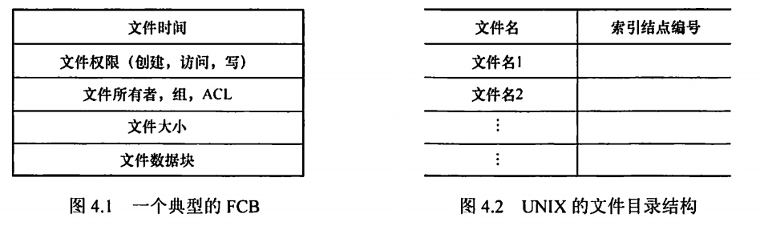
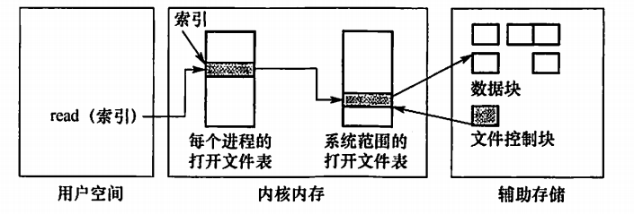
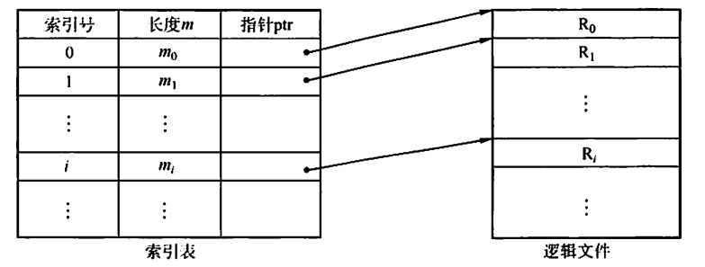

# 文件管理

## 4.1文件系统基础

**文件属性：**包括名称、类型、创建者、所有者、位置、大小、保护位，创建时间等信息。

操作系统同故宫文件控制块（FCB）来维护文件元数据

#### ==文件控制块（FCB）==

FCB用来存放控制文件需要的各种信息的数据结构，FCB的有序集合就是文件目录，一个FCB就是一个文件目录项。

FCB包含以下信息：

- **基本信息：**文件名，物理位置，逻辑结构，物理结构等信息
- **存取控制信息：**文件的存取权限等其他权限信息
- 使用信息：建立时间，上次修改时间等

#### ==索引节点（i节点）==

<u>实际上找文件都是通过名字比较的，所以找一个目录项的时候，文件的其他信息是不需要的，根本不用将其调入内存。</u>所以，可以将文件名和文件描述分开存放。**让文件描述信息单独形成一个称为索引节点的数据结构（i节点）。**在文件目录中每个目录项仅由文件名和指向该文件的i节点的指针构成。

1. **磁盘索引节点**

指存放在磁盘上的索引节点，每个文件有一个唯一的磁盘索引节点，主要包含以下内容：

- 文件主标识符
- 类型、长度、物理地址
- 存取权限
- 链接计数
- 最近存取时间

2. 内存索引节点

指存放在内存中的索引节点。文件被打开之后，要将磁盘的索引节点复制到内存的索引节点中。在内存的索引节点中增加以下内容：

- 索引节点编号、状态
- 访问计数
- 逻辑设备号
- 链接指针

> 我的理解：每一个文件都有一个FCB，但是调入内存的文件才有内存索引节点。内存索引节点是调入内存的文件的索引节点。内存索引节点的个数应该是有限的。

### 文件的操作

##### 基本操作

1. 创建文件：分配外存空间，创建PCB
2. 写文件：系统调用
3. 读文件：系统调用
4. 重定位文件：将当前位置指针重新定位给一个定值
5. 删除文件：找到目录项，删掉，删目录
6. 截断文件：允许文件所有属性不变，删除文件内容，长度置为0并释放空间

##### 文件打开与关闭

文件的打开操作实际上是通过调用open，根据文件名搜索目录，然后将找到的文件的属性信息和物理位置复制到内存的打开文件表中，然后将表的编号返回给用户。

之后的文件操作请求就在打开文件表中找文件信息，这样可以节约搜索目录的开销。

文件不用的时候就用close操作关闭它，系统会从打开文件表中删除这个目录。

**二级表**：分为每个进程表和整个系统表。每个进程表根据它打开的所有文件，表中存的是进程对文件的使用信息。系统打开文件表包含文件相关信息。有进程打开文件，系统打开文件表有包含这个文件的表项，进程表增加一个条目并指向这个系统表的对应条目。

通常还设置及数据，记录多少进程打开了该文件。当所有进程都没有打开一个文件了，就可以从系统打开文件表中删除了。

> 二级表的含义是说进程表指向系统表，形成访问的二级关系

#### 文件保护

文件保护通过口令保护、加密保护和访问控制等方式实现。<u>口令和加密是为了防止被他人窃取，访问控制用于控制用户对文件的访问形式。</u>

**访问类型：**读、写、执行、添加、删除、列表清单

**访问控制：**基于身份访问（访问控制信息是放在FCB中的）

**口令：**指的是在创建文件的时候在FCB中附上口令访问的时候必须提供口令。但是这样的口令直接存放到系统内部，不安全。

**密码：**对文件进行加密，访问的时候要用密钥。但是编码和解码要花费时间。

### 文件的逻辑结构

逻辑结构是指从用户观点看到的文件组织形式，和存储介质特性无关。实际上指的是数据在逻辑上是如何组织起来的。

1. 无结构文件（流式文件）：以字节为单位，访问只能穷举搜索。

2. 有结构文件（记录式文件）

   1. 顺序文件：指的是记录一个接着一个排列，并不代表记录时排序过的。对批量操作很友好，但是随机访问性能差。
   2. 索引文件：对每一个记录设置一个表项，包含指向变长记录的指针和记录长度。但是还是要从头开始比较索引号的，并不是直接散列的关系。

   

   3. 索引顺序文件：索引顺序文件时顺序文件和索引文件的结合。将顺序文件分为若干组，为每一个组建立一个索引。

   

   4. 直接文件或散列文件（Hash File):通过给定的散列转换直接找到物理地址，但是这种结构没有顺序的特性.

### 文件的物理结构

文件的物理结构就是研究文件的实现，也就是文件数据在物理存储设备上时如何分布和组织的。分为文件的分配方式和文件存储空间管理。需要注意和逻辑结构的区别。

1. 连续分配
2. 链接分配
3. 索引分配

