# 文件管理

## 4.1文件系统基础

**文件属性：**包括名称、类型、创建者、所有者、位置、大小、保护位，创建时间等信息。

操作系统同故宫文件控制块（FCB）来维护文件元数据

#### ==文件控制块（FCB）==

FCB用来存放控制文件需要的各种信息的数据结构，FCB的有序集合就是文件目录，一个FCB就是一个文件目录项。

FCB包含以下信息：

- **基本信息：**文件名，物理位置，逻辑结构，物理结构等信息
- **存取控制信息：**文件的存取权限等其他权限信息
- 使用信息：建立时间，上次修改时间等

#### ==索引节点（i节点）==

<u>实际上找文件都是通过名字比较的，所以找一个目录项的时候，文件的其他信息是不需要的，根本不用将其调入内存。</u>所以，可以将文件名和文件描述分开存放。**让文件描述信息单独形成一个称为索引节点的数据结构（i节点）。**在文件目录中每个目录项仅由文件名和指向该文件的i节点的指针构成。

1. **磁盘索引节点**

指存放在磁盘上的索引节点，每个文件有一个唯一的磁盘索引节点，主要包含以下内容：

- 文件主标识符
- 类型、长度、物理地址
- 存取权限
- 链接计数
- 最近存取时间

2. **内存索引节点**

指存放在内存中的索引节点。文件被打开之后，要将磁盘的索引节点复制到内存的索引节点中。在内存的索引节点中增加以下内容：

- 索引节点编号、状态
- 访问计数
- 逻辑设备号
- 链接指针

> 我的理解：每一个文件都有一个FCB，但是调入内存的文件才有内存索引节点。内存索引节点是调入内存的文件的索引节点。内存索引节点的个数应该是有限的。

### 文件的操作

##### 基本操作

1. 创建文件：分配外存空间，创建PCB
2. 写文件：系统调用
3. 读文件：系统调用
4. 重定位文件：将当前位置指针重新定位给一个定值
5. 删除文件：找到目录项，删掉，删目录
6. 截断文件：允许文件所有属性不变，删除文件内容，长度置为0并释放空间

##### 文件打开与关闭

文件的打开操作实际上是通过调用open，根据文件名搜索目录，然后将找到的文件的属性信息和物理位置复制到内存的打开文件表中，然后将表的编号返回给用户。

之后的文件操作请求就在打开文件表中找文件信息，这样可以节约搜索目录的开销。

文件不用的时候就用close操作关闭它，系统会从打开文件表中删除这个目录。

**二级表**：分为每个进程表和整个系统表。每个进程表根据它打开的所有文件，表中存的是进程对文件的使用信息。系统打开文件表包含文件相关信息。有进程打开文件，系统打开文件表有包含这个文件的表项，进程表增加一个条目并指向这个系统表的对应条目。

通常还设置及数据，记录多少进程打开了该文件。当所有进程都没有打开一个文件了，就可以从系统打开文件表中删除了。

> 二级表的含义是说进程表指向系统表，形成访问的二级关系

#### 文件保护

文件保护通过口令保护、加密保护和访问控制等方式实现。<u>口令和加密是为了防止被他人窃取，访问控制用于控制用户对文件的访问形式。</u>

**访问类型：**读、写、执行、添加、删除、列表清单

**访问控制：**基于身份访问（访问控制信息是放在FCB中的）

**口令：**指的是在创建文件的时候在FCB中附上口令访问的时候必须提供口令。但是这样的口令直接存放到系统内部，不安全。

**密码：**对文件进行加密，访问的时候要用密钥。但是编码和解码要花费时间。

### 文件的逻辑结构

逻辑结构是指从用户观点看到的文件组织形式，和存储介质特性无关。实际上指的是数据在逻辑上是如何组织起来的。

1. **无结构文件（流式文件）：**以字节为单位，访问只能穷举搜索。

2. **有结构文件（记录式文件）**

   1. **顺序文件：**指的是记录一个接着一个排列，<u>并不代表记录时排序过的</u>。对批量操作很友好，但是随机访问性能差。
   2. **索引文件：**对每一个记录设置一个表项，包含指向变长记录的指针和记录长度。但是还是要从头开始比较索引号的，<u>并不是直接散列的关系。</u>

   

   3. **索引顺序文件：**索引顺序文件时顺序文件和索引文件的结合。将顺序文件分为若干组，为每一个组建立一个索引。

   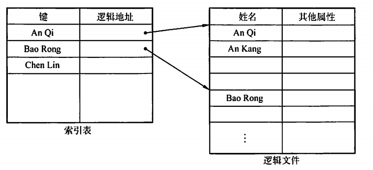

   4. **直接文件或散列文件（Hash File):**通过给定的散列转换直接找到物理地址，但是这种结构没有顺序的特性.

### 文件的物理结构

文件的物理结构就是研究文件的实现，也就是文件数据在物理存储设备上时如何分布和组织的。分为文件的分配方式和文件存储空间管理。需要注意和逻辑结构的区别。

1. **连续分配：**逻辑文件的记录顺序存储在相邻的块中。地址字段应该包含文件第一块首地址和块的长度。<u>长度不易动态增加。会产生外部碎片。</u>

2. **链接分配：**

   1. **隐式链接：**每个盘块有指向下一个块的指针。这样可以动态分配，但是必须顺序访问，而且中间断了就完了。
   2. **显式连接：**将隐式链接存的内容全部存在一个链接表（文件分配表FAT）中。

   > 用FAT还可以记录磁盘的空闲关系。FAT在系统启动的时候会读入内存，检索在内存中进行。

3. **索引分配**

之前的必须顺序访问，或者式要维护一个FAT，其实没有必要。<u>索引分配将每个文件所有盘块号都集中放在一个索引块中。</u>

将文件分为很多的块，分布在磁盘不同位置存放，然后将每一块的地址放在索引块中。每一个文件有一个索引块。

4. **==混合索引==**

用混合索引的方式照顾不同大小的文件。

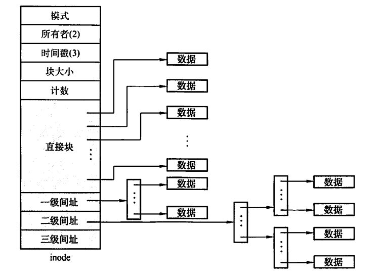

> 考察最大可以存放多大的文件，根据能存放多少索引信息和每个块的大小进行计算。

## 4.2 目录

目录提供文件名到文件的映射，控制访问。

#### 目录结构

- **单级目录结构：**按名存取，不允许重名
- **两级目录结构：**主目录存放记录用户名以及相应用户文件目录所在的存储位置。相应解决了多用户文件重名问题
- **树形目录结构：**用分隔符“/”链接而成。
- 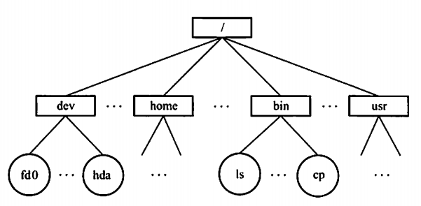

> **绝对路径：**从根目录出发的路径
>
> **相对路径：**从当前目录（工作目录）开始的路径

- **无环图目录结构：**为了方便文件共享，在树形目录的基础上添加一些指向同一节点的有向边。共享文件不同于文件拷贝，共享文件看到的是原件。

### 目录的操作

- 搜索
- 创建文件
- 删除文件
- 创建目录
- 删除目录：分为不删除非空目录和可删除非空目录
- 移动目录
- 显示目录
- 修改目录

### 目录的实现

1. **线性列表：**可以采用链表的形式。查找比较费时
2. **哈希表：**查找非常块，但是要避免冲突

### 文件共享

1. 基于索引节点的共享方式。**（硬链接）**

   利用count来统计有多少个目录项指向了它，只要有超过1人指向它，就不能被删除。

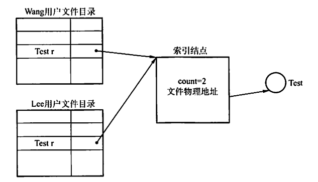

2. 利用符号链实现文件共享**（软链接）**

创建一个<u>LINK类型</u>的文件，取相同的名字，放在用户B的目录，F中存放链接文件F的路径名，要访问就通过这个路径名去访问。

> 硬链接直接指向索引节点，而软链接只指向路径，要根据路径去找文件。<u>硬链接比软链接快。</u>

## 文件系统

### 文件系统结构

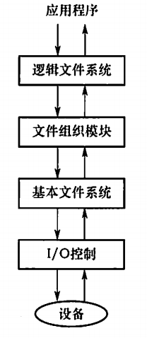

- **I/O控制**
- **基本文件系统：**
- **文件组织模块：**将逻辑地址转换为物理块地址。
- **逻辑文件系统：**管理目录结构

### ==文件系统布局==

#### ==在磁盘中的结构==

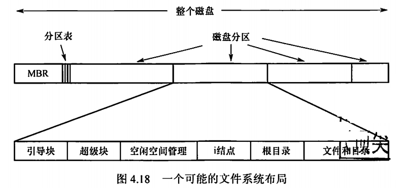

磁盘分为多个区，每个区有一个独立的文件系统。

1. **主引导记录（MBR)**:MBR后面跟着分区表。BIOS读入MBR，确定活动分区
2. **引导块：**每一个分区的第一个块。
3. **超级块：**包含文件系统的所有关键信息，包含分区块数量，块大小，空闲块数量和指针，空闲的FCB和指针等
4. **空闲空间管理：**用位图或者指针链接形式给出，后面跟着i节点。

#### ==在内存中的结构==

内存中的信息用来管理文件系统并提供缓存来提高性能。内容具体包括：

- **安装表：**包含每个已经安装文件系统的分区的有关信息
- **目录结构缓存：**包含最近访问的目录信息
- **整个系统的打开文件表**
- **每个进程的打开文件表**

#### 外存空闲空间管理

涉及空闲块的组织、分配和回收。

1. **空闲表法**

<u>属于连续分配方式</u>。系统为所有空闲区建立一张空闲盘块表，每一个空闲区对应一个表项，包括表项序号，空闲区的第一个盘块号，空闲块数。

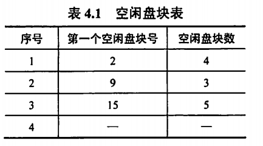

> 空闲盘块的分配和内存的分配类似，有那四种分配方式。

2. **空闲链表法**
   1. **空闲盘块法**：以盘块为单位链接起来，每次要分配的时候就从链头一次取合适数量的东东出来。但是这样分配多的话要摘很多次，很麻烦。
   2. **空闲盘区链**：将空闲盘区链接起来，每个盘区要指明大小。通常采用首次适配算法。
3. **位图法**

每一个块用一个二进制位来表示，0是空闲，1是已分配。

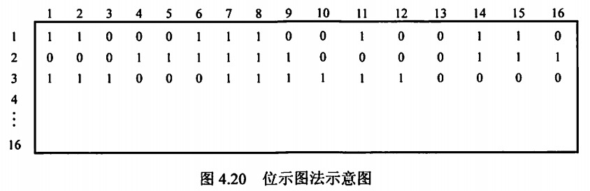

> 空闲表法和空闲链表法都不适用于大型文件系统，因为表或者链表太大。

4. ==**成组链接法**==

克服了表太长的缺点。

<u>用来存放一组空闲盘块号的盘块成为成组链块。将顺序n个空闲盘块号保存在一个成组链块中，最后一个空闲盘块用于保存另一组空闲盘块号。</u>

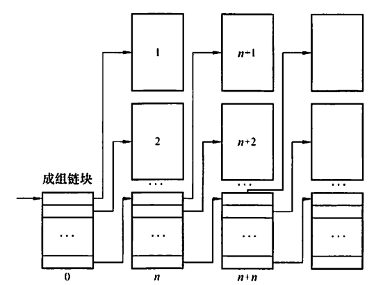

> 这里设计到空闲盘块的分配和回收的具体细节，这里不展开，好想。

### ==虚拟文件系统==

为用户提供文件系统操作的统一接口，屏蔽不同文件系统的差异和操作细节。

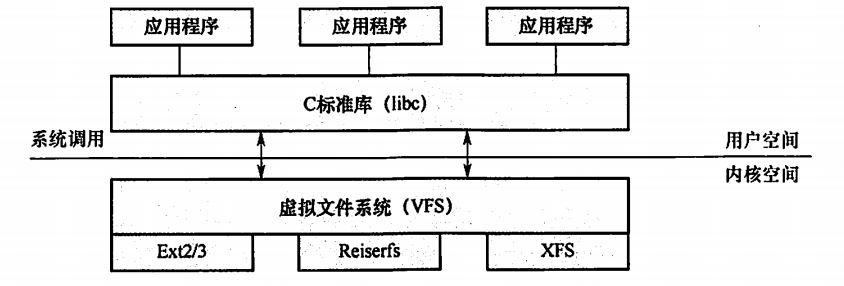

抽象的四个对象：

- **超级快对象：**表示一个已安装的特定文件系统。
- **索引结点对象**：表示一个特定的文件。
- 目录项对象：表示一个特定的目录。
- **文件对象：**表示一个与进程相关的已打开文件。

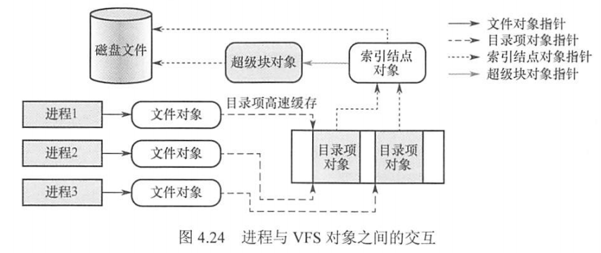
