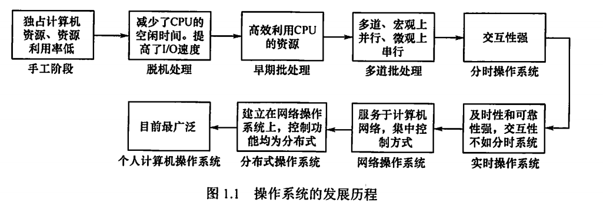
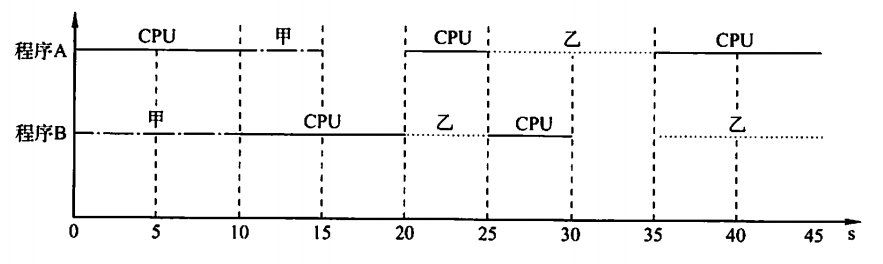
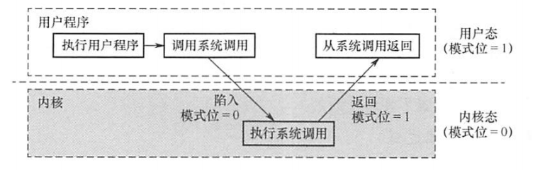
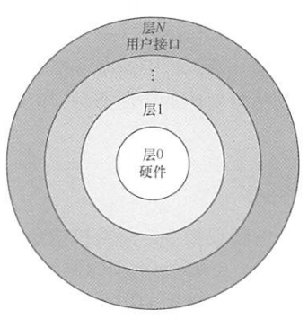
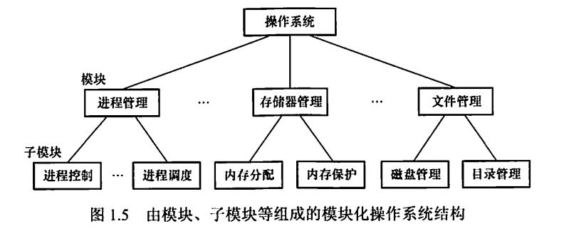
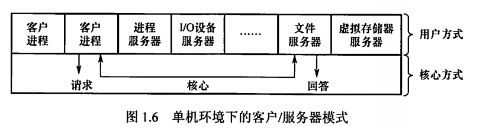
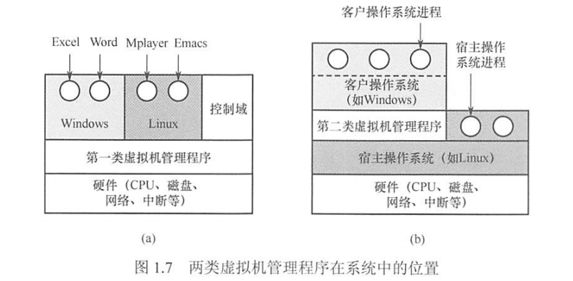

# 1.计算机系统概述

## 1.1 操作系统的基本概念

操作系统是控制和管理整个计算机系统的硬件和软件资源（<u>注意计算机资源包括硬件和软件</u>），合理地组织，调度计算机工作与资源的分配，进而为用户和其他软件提供方便接口与环境的程序集合。

**操作系统的特征：** 并发、共享、虚拟、异步。==并发和共享是操作系统的两个最基本特征。==，两者互为存在条件。

**操作系统的功能和目标**

1. 操作系统作为<u>计算机系统资源管理者</u>。管理处理机、存储器管理、文件管理、设备管理。
2. 操作系统作为用户和计算机硬件系统之间的<u>接口</u>，提供命令接口和程序接口（系统调用）。
3. 操作系统实现了<u>对计算机资源的扩充</u>

>  shell是命令解析器，属于命令接口。广义指令就是系统调用指令。

==**多道程序设计**==

- 制约性：多道程序之间的竞争形成相互制约。

- 间断性：多道程序的执行是断续的。

- 共享性：多道程序执行共享了资源。

  > 没有了封闭性和顺序性，顺序性是单道程序设计的基本特征。

## 1.2 操作系统发展历程（关注不同系统的各自优缺点）

### 手工操作阶段

用户独占全机，资源利用率低。

### 批处理阶段（操作系统开始出现）

**单道批处理系统**：自动性、顺序性、单道性。

**多道批处理系统**：宏观上并行，微观上串行。

理解批处理的概念，就是脱机大批处理一些作业，不交互。（优缺点）

### 分时操作系统：让多个用户同时使用计算机

将处理器的运行时间分成很短的时间片，按<u>时间片轮流</u>分给各个联机作业使用。

分时系统<u>可以实现人机交互</u>，这一点上不同于多道批处理系统。

主要特征：

- 同时性（多路性）：允许多个终端用户同时使用一台计算机。
- 交互性。用户能方便和系统进行人机对话。
- 独立性。多个用户可以彼此独立的进行操作。
- 及时性。用户能在很短的时间内获得相应。

### 实时操作系统

硬实时系统：某个动作必须绝对地在规定时间内发生。

软实时系统：能接受偶尔违反时间规定且并不会引起任何永久性损害。

主要特点：<u>及时性，可靠性</u>，通常采用*抢占式的优先级高者优先算法*，可靠性高，相应及时但是资源利用率低。

### 分布式计算机系统

分布性和并行性。可以将任何工作都分布在几个计算机上，由他们并行工作，协同完成。

### 操作系统发展历程

> 注意区分<u>多任务操作系统是能实现并行</u>的，不同于单处理机的多道程序设计的概念。

甘特图：

## 1.3 操作系统运行环境

**处理器运行模式**：==用户态、内核态。==

**特权指令：**指不允许用户直接使用的指令。

**内核包含的内容：**

- 时钟管理
- 中断机制
- 原语：处于OS最底层，具有<u>原子性</u>，操作一气呵成（关闭中断）
- 系统控制的数据结构以及处理
  - 进程管理
  - 存储器管理
  - 设备管理

#### ==中断和异常==

在用户态和内核态之间建立一个门，让用户态能进入到内核态。利用中断或者异常来实现。

**中断（外中断）**：来自CPU执行指令外部的事件，包括时间中断。<u>==外部中断处理中PC由中断隐指令自动保存，不需要操作系统保存。==</u>

**异常（内中断）**：来自CPU执行指令内部的时间，其实就是错误。

**分类：可屏蔽中断、不可屏蔽中断**

<u>中断处理中最重要的两个寄存器是PC（程序断点）和程序状态字寄存器（PSW）</u>，其中子程序调用只需要保存程序断点。中断处理两个都要保存

#### **==系统调用==**

重点关注：内核态和用户态的切换。

**执行系统调用的过程：**

1. 正在运行的进程先传递系统调用参数
2. 由trap指令陷入内核
3. 执行对应服务程序
4. 返回用户态

**由用户态转换到核心态的例子：**

- 系统调用
- 中断
- 产生错误状态（异常）
- 用户想要执行特权指令

> **访管指令**是程序从用户态切换到内核态会用到的指令，在用户态下运行，不是特权指令。在内核态下，CPU可以执行指令系统中的任何指令，但不能执行访管指令，其在用户态下使用。

**注意：==计算机通过硬件中断机制来实现用户态到核心态的转换。==**

## 1.4 操作系统结构

#### 分层法

优点：

- 便于系统调试与验证
- 易扩充，易维护

缺点

- 各层定义困难
- 效率差（服务要穿越多层）

#### 模块化

特点：提高了可维护性，和适应性，开发容易。但是各模块的接口规定很难满足对接口的实际需求。

#### 宏内核：Windows等等有名的都是

将系统的主要功能模块都作为一个紧密联系的整体运行在核心态。有可能会臃肿

#### 微内核：

将最基本的功能保存在内核，将不需要在核心态运行的功能放到用户态执行。操作系统中绝大部分功能都放在微内核外的一组服务器中实现，用微内核进行消息传递。一个模块的崩溃不会让整个代码崩溃。

特点：

- **拓展性**和**灵活性**很好，因为功能都从内核抽离出来了。
- **可靠性安全性**都不错，不会全局崩掉。
- **可移植性**不错，功能都抽离了，模块化了，移植方便。
- 分布式计算

<u>但是用户态和核心态之间的切换变得更为频繁，这样会==影响性能==。</u>小是小了，进进出出的让系统没有宏内核高效。

**微内核中应该放什么？———越低级的越要放进来，比如低级I/O，低级进程管理与调度；越频繁用到的越要放进来，比如进程调度，中断和陷入处理**

#### 外核

<u>为虚拟机分配资源，并检查这些请求是否合法。</u>外核做的就是保证多个虚拟机彼此之间不发生冲突。

## 1.5 操作系统引导

1. 激活CPU，读取ROM中的boot程序，开始执行BIOS的第一条语句
2. 硬件自检
3. 加载带有操作系统的硬盘
4. 加载主引导记录MBR，MBR告诉CPU应该去硬盘的哪一个主分区找操作系统
5. 扫描硬盘分区表
6. 加载分区引导记录PBR，寻找并激活用于引导操作系统的程序
7. 加载启动管理器
8. 加载操作系统

### 1.6 虚拟机

为用户提供抽象的，统一的，模拟的计算环境。虚拟化方法分两类：

**第一类虚拟机管理程序**就像一个操作系统，是唯一运行在最高特权的程序。向上提供若干个虚拟机，让每一个虚拟机的操作系统都以为自己在内核态运行，实际上其在用户态进行。每一个虚拟机就是一个进程。

**第二类虚拟机管理程序**依赖于一个宿主操作系统，在这个系统上面运行一个进程。

