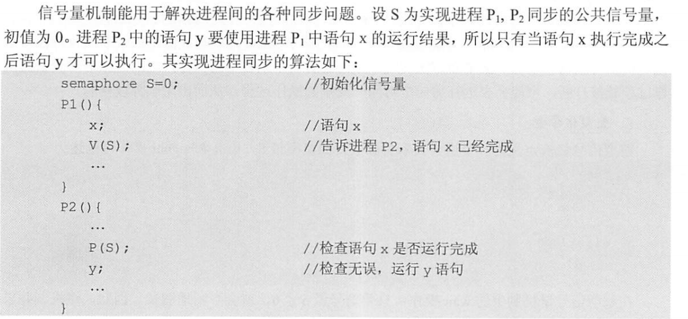

# 进程与线程

## 2.1 进程与线程

**进程的概念**：进程就是程序运行中的实例，是进程实体的运行过程，是系统进行资源调配的独立单位。系统用进程控制块（PCB）来描述进程的基本状况和运行状态。<u>PCB是进程存在的唯一标志。</u>创建进程就是创建进程实体中的PCB。

> 有了进程之后程序失去了封闭性。封闭性指的是执行结果之取决与进程本身，但是现在进程走走停停，对某一些共享数据的操作会由于速度的差异带来结果的不同。

**进程的特征**：动态性、并发性、独立性、异步性。

==**进程状态和转换**==

状态：运行态、就绪态、阻塞态、创建态、结束态。

进程从运行态到阻塞态是主动行为，而从阻塞态到就绪态是被动行为。

#### 进程的组织

由三部分组成：PCB、程序段、数据段

==**PCB**：==常驻内存，是进程存在的唯一标志。包含进程描述信息，进程控制和管理信息，资源分配信息和处理机相关信息等。

PCB常用组织方式：链接和索引。链接就是将同一个状态的PCB链接成一个队列。索引就是将同一个状态的进程组织带一个索引表中。

#### 进程控制：用的都是原语

##### 进程创建

1. 为进程分配唯一进程标识号，并申请空白PCB（PCB是有限的）
2. 为进程分配资源：内存，文件，I/O，CPU时间等，可以从操作系统中获得也可以从父进程获得。
3. 初始化PCB，各种分配的信息填进去。
4. 放到就绪队列中等待调度。

##### 进程终止：正常结束、异常结束和外界干预

1. 根据标识符，检索出PCB，读取进程状态
2. 如果是运行态，立刻终止并将CPU给其他进程
3. 如果由子孙进程，子孙进程也终止
4. 将其拥有的全部资源还给父进程或者操作系统
5. 删掉PCB

##### 进程阻塞

1. 找到PCB

2. 如果是运行态，就保护现场，转换为阻塞态，停止运行
3. 将PCB插入阻塞序列

##### 阻塞唤醒

1. 找到PCB
2. 从阻塞队列中移除，设置状态为就绪态
3. 将PCB插入就绪队列

### 进程的通信

PV操作是低级的通信方式，高级通信方式由以下三类：

- **共享存储**，进程之间存在一块可以直接访问的共享空间，通过对这片共享空间进行读写操作实现进程的信息交换。在<u>读写过程中要用同步和互斥工具</u>。

> 简单来说就是甲乙之间有一个大布袋，他们交换物品是通过大布袋进行的，甲将东西放到布袋中，乙拿走。

- **消息传递：**进程间的数据交换以格式化的消息（Message)为单位，使用发送消息和接收消息原语实现数据交换。

> 简单来说就是甲要和乙通信，就要写信，让邮政送给乙。

- **管道通信：**管道就是连接一个读进程和一个写进程以实现他们之间的通信的一个共享文件（pipe)文件。管道限制了大小，其实管道就是一个固定大小的缓冲区，会有类似生产者消费者的现象。而且<u>管道是半双工通信，某一时刻只能单向传输</u>。想要全双工就要两个管道。

### 线程和多线程模型

==线程：轻量级进程。==是一个基本的CPU执行单元，也是程序执行流的最小单位。同一个进程的线程共享资源，<u>共享地址空间</u>。引入线程后，进程只作为CPU外的系统资源分配单元，线程作为处理机的分配单元（其他资源线程之间共享）。

> <u>引入进程是为了多道程序并发执行，引入线程是为了煎炒程序在并发执行的时空开销。</u>

每个线程都有唯一的标识符和一个线程控制块（TCB），线程同样有状态的转换。

线程控制块（TCB）：包括线程标识符，程序计数器，状态字寄存器，通用寄存器，运行状态，优先级，专有存储区，堆栈指针

> 也就是TCB中没有资源分配清单，没有除了状态信息和优先级之外的控制和管理信息。只要理解线程是不拥有资源的，就行了。

#### 线程实现方式

##### 用户级线程（ULT）

有关线程管理的工作全部在用户空间完成，内核感受不到线程的存在。此时线程切换不用转到内核，节约了开销。但是当一个线程被阻塞的时候，系统就会将整个进程阻塞。而且不能发挥多处理机的优势，同一时间每个进程只能有一个线程运行。

##### 内核级线程（KLT）

线程管理的所有工作在内核空间实现。这样能都发挥多处理机的优势，不会过分阻塞，线程切换比较快。但是同一个进程的线程切换需要从用户态转到内核态进行，开销比较大。

##### 组合方式

内核支持多个内核级线程的建立，调度和管理；同时允许用户程序搞用户级线程。一些内核级线程对应多个用户级线程。用户级线程通过时分多路复用内核线程。

##### 多线程模型：组合方式中的线程对应关系

- 多对一：线程管理在用户空间进行，效率高。但是一个阻塞，全家阻塞。
- 一对一：一个线程阻塞，对其他没影响。到那时需要创建很多内核线程，开销大。
- 多对多：综合了以上的优点。

## 2.2 处理机调度

#### 调度的层次

1. 高级调度（作业调度）：内存与赋存之间的调度，每个作业只调入一次，调出一次。

2. 中级调度（内存调度）：将暂时不能运行的进程调到外存等待，将其挂起。具备运行条件之后再调回来。

3. **低级调度（进程调度）**：从就绪队列中选取一个进程，并将处理机分配给它。

#### ==调度目标==

- **CPU利用率**

$$
CPU的利用率 = \frac{CPU有效工作时间}{CPU有效工作时间+CPU空闲等待时间}
$$

- **系统吞吐量：**单位时间CPU完成作业的数量
- **==周转时间：==**作业从提交到完成所经历的时间。

$$
周转时间 = 作业完成时间 - 作业提交时间
$$

平均周转时间：
$$
平均周转时间 = （作业1周转时间+...+作业n周转时间） / n
$$
带权周转时间：
$$
带权周转时间 = \frac{作业周转时间}{作业实际运行时间}
$$
平均带权周转时间（好理解，不打公式了）

- **等待时间：**处于等待处理机的时间之和。
- **响应时间：**用户提交请求到系统首次响应的时间。

#### 调度的实现

**不能进行调度的情况：**

- 处理中断过程中
- 进程在操作系统内核临界区中
- 其他需要完全屏蔽系统中断的原子操作过程中。

**进程调度方式**：

- **非抢占式调度**，即使有更为紧迫的进程进入就绪队列，也要让当前正在执行的进程继续执行
- **抢占式调度**：更紧迫的进程来了，当前进程必须让位。

> 闲逛进程：系统中没有就绪进程了，就会调度闲逛进程运行，并在执行过程中测试中断。

### ==典型的调度算法==

1. **先来先服务（FCFS）**

属于不可剥夺算法，表面上看是公平的，但是后来的短作业要等好久，所以不能作为分时系统和实时系统的主要调度策略。对短作业不利，有利于CPU繁忙型作业，不利于I/O繁忙型作业。

2. **短作业优先（SJF）**

从后背队列中选择运行时间最短的作业来循行。对长作业不利，如果有持续的短作业，会产生==**饥饿**。**SJF的平均等待时间、平均周转时间最少。**==

3. **优先级调度算法**

选择优先级做高的作业运行，分为抢占式调度和非抢占式调度。<u>按优先级可否改变可以分为静态优先级和动态优先级。</u>静态优先级的优先级从创建确定开始一直不变，动态优先级可以动态变化。

4. **高响应比优先调度算法**

选择每个作业中相应比做高的作业运行。
$$
响应比R_p = \frac{等待时间 + 要求服务时间}{要求服务时间}
$$

- 等待时间相同，服务时间越短，响应比越高，类似SJF。
- 服务时间相同，等待时间越长，响应比越高，类似FCFS。

==**结合了FCFS和SJF，克服了饥饿。**==

5. **时间片轮转调度**

将所有的就绪进程按照FCFS策略排成就绪队列，然后轮流用时间片。

6. **多级队列调度**

设置多个就绪队列，每个队列可以实时不同的调度算法。同一个队列可以设置内部优先级，队列间也可以设置优先级。

7. **多级反馈队列调度**：*反正它最屌就是了*

设置多个就绪队列，每个队列有不同的优先级。，<u>赋予各个队列的时间片大小不同。优先级越高的队列时间片越小。每个队列都用FCFS，轮到该进程执行时，用完了时间片就将其移到下一级队列中等待。</u>按照优先级调度，当第1优先级为空才运行第2优先级。

优势：终端型用户短作业优先，短批处理作业用户周转时间较短，长批处理作业用户不会长期得不到处理。

**进程切换**

上下文切换：上下文指的是某一时刻CPU寄存器和程序计数器的内容。上下文切换是计算密集型的，需要很多CPU时间。

>  进程调度和切换的区别：调度是一种决策行为，切换是一种执行行为。

## ==同步与互斥==

重点在用PV操作解决进程之间的同步和互斥。

**临界资源**：一次只允许一个进程使用的资源。对临界资源的使用必须互斥地进行。

**临界区**：访问临界资源的那一段代码

**访问临界资源的过程分为四个部分：**

1. 进入区：在这里检查是否可以进入临界区，可以的话要设置标志禁止其他进程进入
2. 临界区：访问临界资源的代码
3. 退出区：将临界区标志清除
4. 剩余区：代码剩余的部分

**同步**：直接制约关系。指的是为了完成某种任务建立地多个简称之间要相互协调而产生的制约关系。

**互斥**：间接制约关系。一个进程进入临界区另一个进程必须等待。

#### 实现临界区互斥的基本方法

##### 软件实现方法

1. **单标志法：**设置公共变量turn，指示被允许进入临界区的进程编号。进程轮流进入临界区。很容易造成资源浪费。

2. **双标志法先检查：**进去临界区之前先检查是否正在被访问，如果是就等待。设置数据$flag[i]$,如果第i个元素值为$FALSE$，则表示$P_i$未进入临界区.。==这样做可以不用交叉进入，但是可能同时进入临界区。==

3. **双标志法后检查：**先将自己的标志设置为$TRUE$,再检测对方的状态标志。==这样虽然不会一起进去，但会大家都因为相互谦让而一起饿死。==

4. **Peterson‘s 算法：**为了防止进入饿死，又设置了一个变量turn，每个进程设置自己的标志之后再设置turn标志。然后同时检查另一个进程状态标志和turn。

> 我的理解中turn就是在相互谦让的两个中也指定一个轮转顺序，属于是算法1和算法3的结合。

动手模拟是重点

##### 硬件实现方法

1. 中断屏蔽方法：效率低而且把中断权力交给用户不太好
2. 硬件指令方法：

- TestAndSet指令：读标志并把标志设置为真。可以为每一个临界资源设置一个共享布尔变量lock，利用TAS指令检查lock，若没有进程在临界区就可以进入，设置为true。若有就循环检查。

- Swap指令：交换两个字的内容。为每个临界资源设置一个共享bool变量lock，初值为false，每个进程设置一个局部变量key，用于与lock交换信息。进入临界区前，swap交换lock和key，然后检查key的状态

硬件方法有点是简单容易验证，缺点是要耗费处理机时间，有的进程可能一直饥饿（随机选的）

#### ==互斥锁（mutex lock）==

进入临界区的时候获得锁，退出的时候释放锁。每个锁有一个变量表示锁是否可用，当一个进程试图获取不可用的锁的时候，会被阻塞，知道锁被释放。

必须是原子操作。会造成忙等待，浪费CPU周期。

#### ==信号量==

P操作：wait（S） ；  V操作：signal（S）

**整型信号量：**被定义为一个用于表示资源数目的整形量S，执行wait的时候，只要$S<=0$,就会不断测试。

**记录型信号量：**不存在忙等的同步机制。用一个代表资源数目的整形变量value表示信号量，再增加一个进程链表L，用于链接所有等待该资源的进程。

##### 用信号量实现<u>同步</u>

##### 用信号量实现<u>互斥</u>

> 注意区别同步和互斥的概念

##### 总结

- 在同步问题中，<u>某个行为要用到某种资源，就要先P以下这个资源，某个行为会提供某种资源，就在用完之后V以下这个资源。</u>
- 在互斥问题中，<u>用P和V前后夹住这个互斥资源。</u>而且要加紧，不能有多余代码。

##### 利用信号量解决前驱问题

为每一条边设置一个信号量，每一个节点运行前先P以下指向它的边，完成之后V以下从它走出来的边。

#### 管程

管程的特性保证了进程互斥，无需自己实现互斥。管程定义了一个数据结构和能为并发进程所执行的一系列操作，这些操作能同步进程和改变管程中的数据。

**条件变量：**条件变量和信号量类似，都有PV操作，但是条件变量是没有值的，仅实现了排队等待功能。信号量是有值的信号量的值反应了剩余资源数。

#### ==经典IPC问题==

##### 生产者-消费者问题

==对于empty和full的P操作必须放在mutex前面，否则会产生死锁==。V操作先释放哪一个都无所谓。

##### 读者写者问题

**读者优先：**设置count计数器记录读者的数量，用mutex保证count的互斥访问，用rw保证读者写者的互斥访问。

**写者优先：**增加一个PV操作，让有写进程请求的时候进制后续读进程的请求。

##### 哲学家进餐问题

定义互斥信号量对筷子进行互斥访问。想办法让他一次拿走两个筷子，不要一个一个拿。

### ==死锁==

#### 产生死锁的原因

1. 系统资源的竞争
2. 进程申请和释放资源的顺序不当
3. ==产生死锁的必要条件==
   1. 互斥条件
   2. 不可剥夺条件
   3. 请求并保持条件
   4. 循环等待条件

#### 死锁的处理策略

1. 死锁预防：破坏四个必要条件
2. 死锁避免：在资源分配的过程中防止系统进入不安全状态
3. 死锁检测和接触

#### 死锁预防

1. 破坏互斥条件
2. 破坏不可剥夺条件
3. 破坏请求并保持条件
4. 破坏循环等待条件：==顺序资源分配法。==

#### 死锁避免

1. **系统安全状态**

安全状态就是指系统能按照某种进程推进的顺序为每个进程分配其所需要的资源，让每个进程都可以顺序完成，这个时候进程的顺序序列就是安全序列。找到安全序列系统就处于安全状态。

2. ==**银行家算法**==

- 可用资源矩阵Available：表示系统现有资源的可用个数
- 最大需求矩阵Max：表示进程需要的资源最大数量
- 分配矩阵Allocation：表示当前已经分配给进程的资源数量
- 需求矩阵：Need：表示每个 进程接下来还需要多少资源。

$$
Need = Max - Allocation
$$

银行家算法描述：

3. **==安全性算法：==**解决的是一种多个资源的死锁检测

<u>请注意一定要区分银行家算法和安全性算法的本质区别。</u>安全性算法找的是安全序列，是一次分配完的，但是银行家算法是判定某一种资源申请是不是安全的，这个申请不一定是申请所需的全部资源，有可能是之申请其中一部分。

#### 死锁检测和解除

##### ==资源分配图==

- 圆圈表示进程
- 框表示一种资源
- 从进程到资源的有向边是请求边
- 从资源到进程的边为分配边

**==死锁状态检测：消去能够满足的进程的请求边和分配边，发生死锁的时候当且仅当分配图中还有边最终没有被消掉。==**

##### 死锁解除

- 资源剥夺法
- 撤销进程法
- 进程回退法
