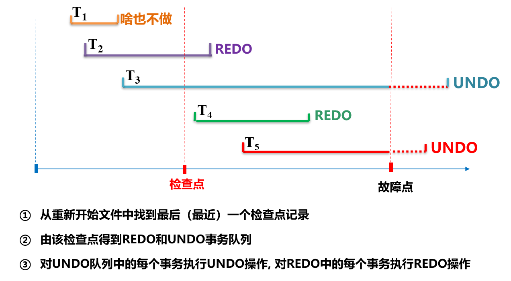

# 数据库恢复

## 恢复的主要概念

### 数据保护的类型==（记背）==

- **安全性保护**
- **完整性保护**
- **并发控制**
- **数据库恢复**

### 事务

事务是用户定义的一个数据库**操作序列**，这些操作**要么全做**，**要么全部不做**，是**不可分割**的工作单位。

==事务是恢复和并发控制的基本单位==

#### 定义事务

- **隐式方式：**DBMS自动划分事务
- **显示方式：**

~~~
BEGIN TRANSACTION     
   SQL 语句1            
   SQL 语句2      
   。。。。。
   SQL 语句n
   COMMIT（ROLLBACK）       
~~~

#### 结束事务

- **COMMIT：**事务正常结束，提交所有操作，对数据库永久性更新
- **ROLLBACK：**事务异常终止，回滚所有操作，到开始时候的状态

#### 事务的ACID特性

- **原子性（Atomicity）:**一个事务要么都做，要么都不做，十五必须以Commit或者Rollback结束
- **一致性(Consistency):**使数据库从一个一致性状态到另一个一致性状态。
- **隔离性（Isolation）：**一个事务的执行不被其他事务干扰，并发不影响事务的执行。
- **持续性（Durability）：**一个事务一旦提交，对数据库的改变是永久的。

### 故障的种类和恢复策略

#### 事务故障

某一个事务在运行过程中由于各种原因未运行到正常的终点。

**策略：**==利用日志文件撤销（UNDO）这个事务已经对数据库进行的修改。==系统自动完成，是通过<u>反向扫描文件日志</u>的方式实现的。

#### 系统故障

整个系统的正常运行被破坏，所有正在运行的事务都被终止，内存中数据缓冲区数据全部丢失。

**策略：**==UNDO故障发生时未完成的事务，REDO已经完成的事务。==系统自动完成，是通过<u>正向扫描文日志</u>文件实现的。

#### 介质故障

数据库硬件故障让存储在外存中的数据丢失。

策略：重新装入发生介质故障钱某个时刻的副本，重做从那个时间点开始的所有成功事务。

##数据库恢复技术

基本原理：利用存储在系统其他地方的冗余数据来重建数据库中已经被破坏或者不正确的那部分数据。

### 实现技术

1. **建立冗余数据**
   1. **数据备份**（静态备份、动态备份、完全备份、差异备份）
   2. **==日志文件：==**以流水的昂视记录每一个事务对数据库的每一个操作和操作顺序。
2. **利用这些冗余数据来实现数据库的恢复**

> **日志文件的内容:**各个事物的开始标记和结束标记,各个事务的所有更新操作(包括更新前的值和更新后的值),与事务有关的内部更新操作。
>
> 日志文件的记录**次序**严格按照并行事务执行的时间次序。
>
> **必须先写日志文件,后写数据库。**

#### 静态备份（冷备份）

在系统中无运行事务的时候进行备份，备份期间不允许对数据库进行任何操作。

#### 动态备份（热备份）

备份操作和用户事务并发进行，备份期间允许对数据库进行操作。

#### 完全备份（海量备份）

每次备份整个数据库

#### 差异备份（增量备份）

只备份上次备份后更新过的数据

## 提升恢复效率的技术

### ==具有检查点的恢复技术==

搜索日志耗费大量时间，REDO耗费大量时间。所以可以在日志文件中增加检查点记录，增加重新开始文件，恢复子系统在登录日志文件期间动态维护日志。

### 检查点技术

- 检查点记录的内容
  - 建立检查点时刻所有正在执行的事务清单
  - 这些事务最近一个日志记录的地址
- 重新开始文件的内容
  - 记录各个检查点记录在日志文件中的地址

### 检查点主要工作内容

- 将当前日志缓冲区中的所有日志记录写入磁盘的日志文件上
- 在日志文件中写入一个检查点记录（定时或者事件触发）
- 将当前数据缓冲区的所有记录数据写入磁盘的数据库中
- 把检查点记录在日志文件中的地址写入一个重新开始文件中。

### 利用检查点的恢复策略

### 镜像技术

DBMS自动把整个数据库或者其中的关键数据复制到另一个磁盘上，并自动保证镜像数据与主数据的一致性。

- 当出现介质故障的时候自动利用镜像磁盘数据进行数据库的恢复，不需要关闭系统或者重装数据库副本。

- 没有故障的时候可以用于并发操作，一个用户对数据库进行修改，其他用户可以读取镜像上的数据。
