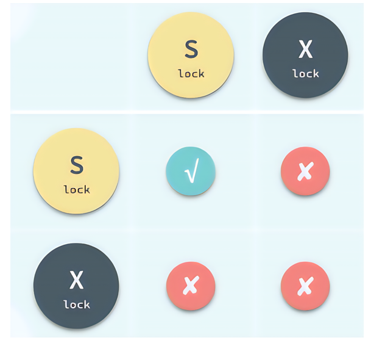
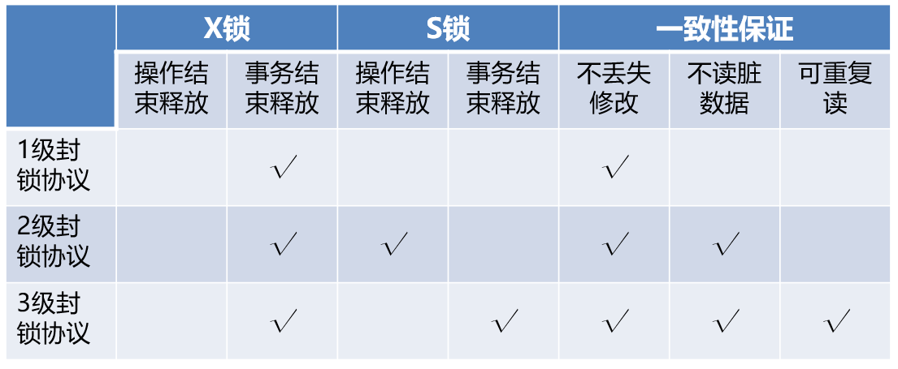
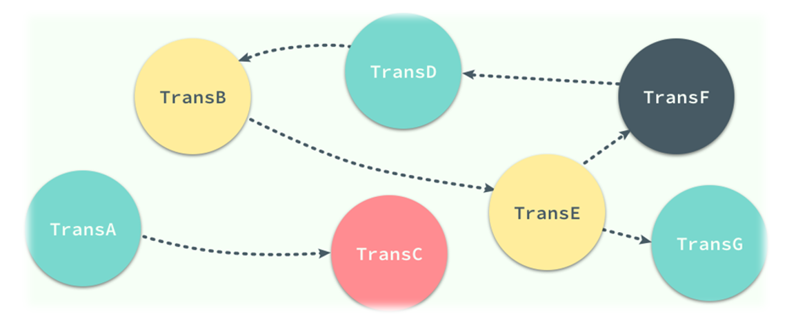
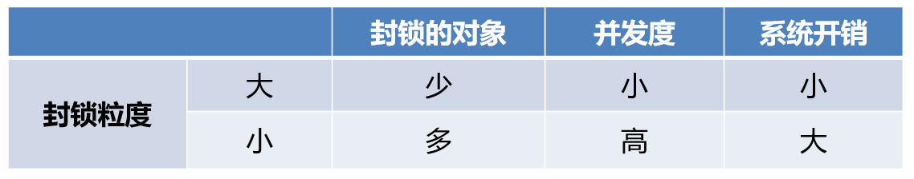
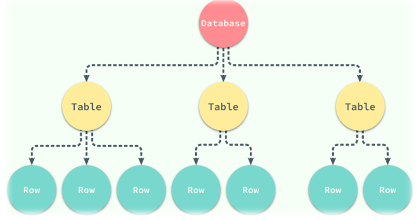
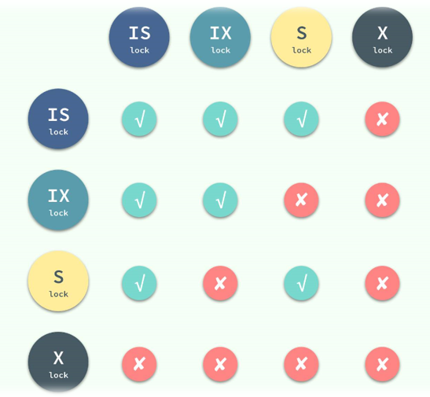

# 数据库并发控制

## 并发控制概述

### 事务并发执行带来的问题

- 存取和存储不正确的数据
- 破坏事务的隔离性和数据库的一致性

### 三种数据不一致性

- **丢失修改：**指的是事务A和实物B读入同一个数据并修改，事务B的提交结果破坏了事务A提交的结果，导致事务A的修改被丢失。
- **不可重复读：**指的是事务A读取数据后，事务B执行更新操作，使事务A无法再现前一次读取的结果。

> 三种不可重复读：
>
> 1.更新了 2.删掉了 3.增加了
>
> 2和3成为幻影现象

- **读脏数据：**事务B修改某一数据，并将其写回磁盘。事务A读取同一数据后，事务B由于某种原因撤消已修改过的数据恢复原值，事务A读到的数据就与数据库中的数据不一致，是不正确的数据，又称为“脏”数据。

## 封锁协议

### 封锁

封锁就是在事务T在对某个数据对象操作之前，先想系统发出请求，对其加锁。在释放锁之前其他事务不能更新此数据对象。

### 基本封锁类型==（重要）==

- 排他锁（X锁）：只允许T读取和修改A，其他任何事务都不能再对A加任何类型的锁，直到T释放锁
- 共享锁（S锁）：若事务T对数据对象A加上S锁，则其他事务只能再对A加S锁，而不能加X锁，直到T释放A上的S锁。

### 封锁协议：三级封锁协议==（十分重要）==

#### 1级封锁协议

事务在修改数据之前必须对其加X锁，直到事务结束才释放

> 1级协议可以防止数据丢失修改，但是如果是读数据的话，是不需要加锁的，所以它不能保证可重复读和不读“脏”数据。
>
> 意思就是说其实这个锁只是防止别人同时修改，但是你在修改的时候别人还是可以读的。所以才会出现读取脏数据和不可重复读的问题。

#### 2级封锁协议

在1级的基础上，事务T在读取数据前必须先加S锁，读取完成之后释放。

2级协议可以防止读取脏数据

> 其实就是别人在修改的时候禁止了读取数据而已。

#### 3级封锁协议

在1级的基础上，事务T在读取数据R之前必须加S锁，直到事务结束才释放,3级就可以防止不可重复读了

>说白了就是不能在别人查询的周期中修改别人可能需要的数据。

## 活锁和死锁据查询语言DQL

封锁可能会带来活锁或者死锁的问题。

避免活锁：先来先服务

死锁预防：

- 一次封锁法：一次性将需要使用的数据全部加锁
- 顺序封锁法：规定封锁顺序，按照顺序执行封锁

> 操作系统上的预防死锁策略其实并不适合数据库，更广泛采用的方法是诊断并解除死锁。

### 检测死锁的方法：

- 超时法：实现简单，但是可能误判或者不能即使发现
- 等待图法：用节点表示正在运行的事务，用边来表示事务的等待情况。如果T1等待T2，则连一个从T1到T2的有向边。如果出现回路，则出现了死锁。

### 死锁解除

选择一个代价最小的事务，将其撤销，释放这个事务的所有锁。

一般选择最迟交付的事务、获得锁最少的事务、回退代价最小的事务。

## 封锁粒度==（应该不是很重点）==

封锁的对象可大可小，封锁对象的大小就是封锁的粒度。

### 多粒度封锁

#### 选择封锁粒度的原则：

- 需要处理多个关系的大量元组的用户事务：以**数据库**为封锁单位；
- 需要处理大量元组的用户事务：以**关系**为封锁单元；
- 只处理少量元组的用户事务：以**元组**为封锁单位

#### 用树形结构来表示多级封锁粒度

对一个节点加锁意味着其后裔节点也加锁，由此分为显式封锁和隐式封锁

- **显式封锁：**直接加到数据对象上的锁
- **隐式封锁：**由于上级节点加锁而使该数据对象加了锁

#### 加锁时系统检查的内容

- **对该对象：**有没有和显式封锁冲突
- **对上级节点：**看是否与隐式封锁冲突
- **对下级节点：**看有没有和下级节点的显示封锁冲突

#### 意向锁：提高加锁检查效率

- **对任一节点加基本锁，必须先对其上层节点加意向锁**
- **对任何一个节点加意向锁，说明该节点下层节点正在被加锁**

#### 相容矩阵

## 并发调度的可串行性

并发调度中不同的调度可能会产生不一样的执行结果，当并发的时候必须保证并行操作的正确性。

### 两段锁协议（2PL）==（重要）==

- **在对任何数据进行读、写操作之前，事务首先要获得对该数据的封锁。（拓展阶段）**
- **在释放一个封锁之后，事务不在获得任何其他封锁。（收缩阶段）**

> 也就是说，如果你要释放了，你之后就不能再申请了，所以你必须在释放之前申请完所有你需要的。

遵循了2PL，则对事务的所有并行调度策略都是可以串行化的，其并行执行的结果一定是正确的。

==事务遵守2PL知识可串行的充分条件，不是必要条件。==

