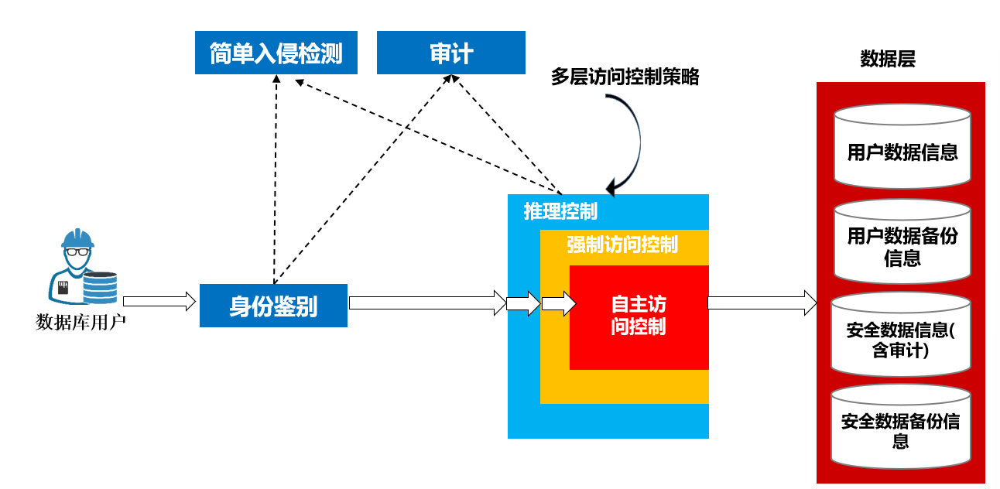
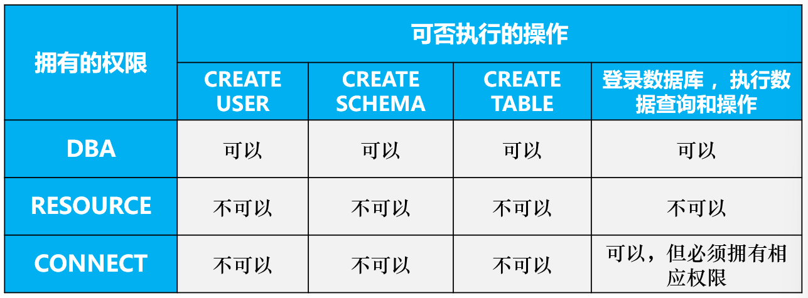
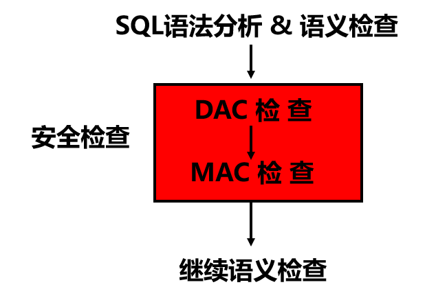

# 数据库安全性

数据库中的不安全因素：

- 非授权用户对数据库的恶意存取和破坏

措施:用户身份鉴别，存取控制、视图

- 数据库中重要或者敏感的数据被泄露

措施：强制存取控制，数据加密存储、加密传输

- 安全环境的脆弱性。

## 数据库安全控制

安全措施是一级一级设置的。

安全控制模型：

存取控制流程：

1. 身份鉴别，防止不可信用户进入系统
2. 在SQL处理层进行自处存取控制和强制存取控制，进一步可以进行推理控制
3. 对访问行为进行审计，对异常用户进行入侵检测。

### 安全性控制常用方法

1. 用户表示和鉴定
2. 存取控制
3. 视图
4. 审计
5. 数据加密

#### 用户标识和鉴定

用户表示：由用户名和用户表示号组成。

身份鉴别方法：静态口令、动态口令、生物特征、智能卡

#### 存取控制

定义用户权限并登记在数据字典中欧给，用户发出存取请求的时候就进行合法性检查。

存取控制方式分为自主存取控制和强制存取控制。

> 自主存取控制：用户和数据之间的权限关系是自主的，权限可以转交
>
> 强制存取控制：每个对象有一个密级，每一个用户有一个分等级的许可证。只有拥有合法许可证的用户才可以存取对应对象。

#### **自主存取控制方式**：GRANT 和 REVOKE。

##### CREATE USER 语句

~~~
CREATE USER语句格式：
    CREATE  USER  <username> 
    [WITH][DBA|RESOURCE|CONNECT]
~~~

用户由三种权限：CONNECT、RESOURCE和DBA

#### 强制存取控制方式

划分主体和客体，主体就是用户或者进程，客体就是文件、表等。

对主题和客体标记敏感度，主体敏感度称为许可证级别，客体敏感度称为密级。

禁止拥有高许可证的主体更新低密级的数据对象。

想要实现强制存取控制必须先实现自主存取控制。

### 角色

角色是权限的集合，为了简化授权而搞的。

- 角色的创建和授权

~~~
CREATE  ROLE  <角色名>        --角色创建

GRANT  <权限>[,<权限>]…        --角色授权
 ON <对象类型>对象名  
 TO <角色>[,<角色>]…
~~~

可以将角色授予别的角色或者用户。

## 视图机制

##审计加密等安全性

