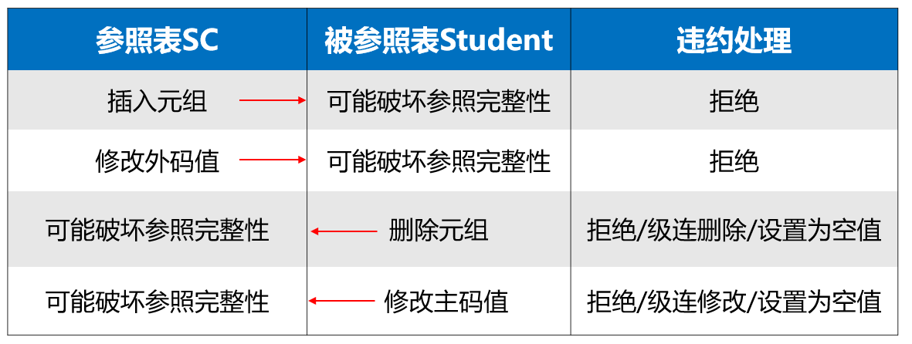

# 数据库完整性

数据库完整性这一个章节其实就是设置各种约束，包括主键约束，外键约束和自定义的约束。然后在数据的增删改的收检查看一下有没有违反这些约束，如果违反的话有相应的处理方法，主要是拒绝修改。

数据库的完整性是说防止数据库中存在不符合语义的数据，也就是防止数据库中存在不正确的数据。

完整的完整性检查机制分为三个阶段

- 提供定义完整性的约束机制（前）
- 提供检查完整性的方法（中）
- 提供违约处理的机制（后）

## 实体完整性

指的就是PRIMARY KEY 的定义。

### 实体完整性的定义

可以在列级定义主码：Sno CHAR(9) PRIMARY KEY

可以在表级定义主码：PRIMARY KEY (Sno)

可以定义属性组合为主码：PRIMARY KEY (Sno，Cno)

### 实体完整性的检查和违约处理

触发动作：在插入行或者对主码列进行更新的时候

检查内容：主码是否唯一，主码各个属性是否为空

检查方法：全表扫描（缺点就是耗时，所以应该在主码上建立索引）

## 参照完整性

指的就是FOREIGN KEY的定义

### 参照完整性定义

可以在行级定义外码：

~~~
CREATE TABLE SC
( Sno  CHAR(9)  NOT NULL REFERENCES Student(Sno)，  
  Cno  CHAR(4)  NOT NULL REFERENCES Course(Cno) ，  
  Grade    SMALLINT，
  PRIMARY KEY (Sno， Cno))
~~~

可以在表级定义参照完整性：

~~~
CREATE TABLE SC
(Sno    CHAR(9)  NOT NULL， 
 Cno     CHAR(4)  NOT NULL，  
 Grade    SMALLINT，
 PRIMARY KEY (Sno， Cno)，   /*在表级定义实体完整性*/
 /*在表级定义参照完整性*/
 FOREIGN KEY (Sno) REFERENCES Student(Sno)，  
 FOREIGN KEY (Cno) REFERENCES Course(Cno) )
~~~

### 参照完整性检查和违约处理

由于参照完整性将两个表中的对应元组都联系在了一起，所以对参照表和被参照表的增删改操作都有可能破坏参照完整性，必须进行检查。

有三种违约处理策略：

1. NO ACTION:拒绝处理
2. CASCADE(级联）:级联操作就是被参照列改了之后参照列也跟着改，删了也跟着删。
3. SET-NULL

#### 显式说明参照完整性的违约处理

~~~
CREATE TABLE SC
(Sno   CHAR(9)  NOT NULL，
 Cno   CHAR(4)  NOT NULL，
 Grade  SMALLINT，
 PRIMARY KEY（Sno，Cno）， 				
 FOREIGN KEY (Sno) REFERENCES Student(Sno) 
     ON DELETE CASCADE     /*级联删除SC表中相应的元组*/
     ON UPDATE CASCADE， /*级联更新SC表中相应的元组*/
 FOREIGN KEY (Cno) REFERENCES Course(Cno) 	             
     ON DELETE NO ACTION 	
     /*当删除course 表中的元组造成了与SC表不一致时拒绝删除*/
     ON UPDATE CASCADE   
     /*当更新course表中的cno时，级联更新SC表中相应的元组*/
)

~~~

## 用户定义的完整性

用户定义的完整性式针对某一具体应的数据必须满足语义要求。

### 属性上的约束条件

- NOT NULL:如果在表级定义了实体完整性，则隐含了不允许取空值。
- UNIQUE
- CHECK

### 元组上的约束条件

在创建表的时候可以用CHECK短语定义元组上的约束条件。也就是元组级的限制。这样的定义可以设置不同属性之间的取值的相互约束条件。

~~~
CREATE TABLE Student
 (Sno    CHAR(9)， 
  Sname  CHAR(8) NOT NULL，
  Idate    datetime,
  PRIMARY KEY (Sno)，
  CHECK (Bdate < Idate )
  /*定义了元组中Bdate和 Idate两个属性值之间的约束条件*/  )
~~~

#### 约束检查和违约处理

插入元组或者修改属性的值的时候会检查，如果不满足就拒绝执行

## 完整性约束命名字

~~~
CONSTRAINT <完整性约束条件名><完整性约束条件>
<完整性约束条件>包括：NOT NULL、UNIQUE、PRIMARY KEY短语、FOREIGN KEY短语、CHECK短语等
~~~

举个例子：

~~~
CREATE TABLE Student
( Sno  NUMERIC(6)
  CONSTRAINT C1 CHECK (Sno BETWEEN 90000 AND 99999),
  Sname  CHAR(20)  
  CONSTRAINT C2 NOT NULL,
  Sage  NUMERIC(3)
  CONSTRAINT C3 CHECK (Sage < 30),
  Ssex  CHAR(2)
  CONSTRAINT C4 CHECK (Ssex IN ( ‘男’, ‘女’)),
  CONSTRAINT StudentKey PRIMARY KEY(Sno) )
~~~

后期可以用ALTER TABLE语句来修改表中的完整性约束。

举个例子：

~~~
ALTER TABLE Student  DROP CONSTRAINT C4
~~~

## 触发器（Trigger）

==触发器不考的==

触发器就是用编程的方式实现一般数据完整性约束不能实现的复杂规则。

触发器不需要用户调用，是在操作时自动触发的。