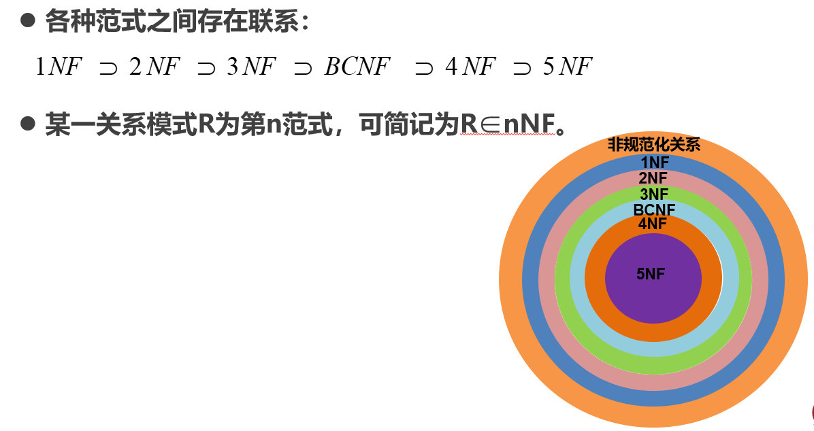
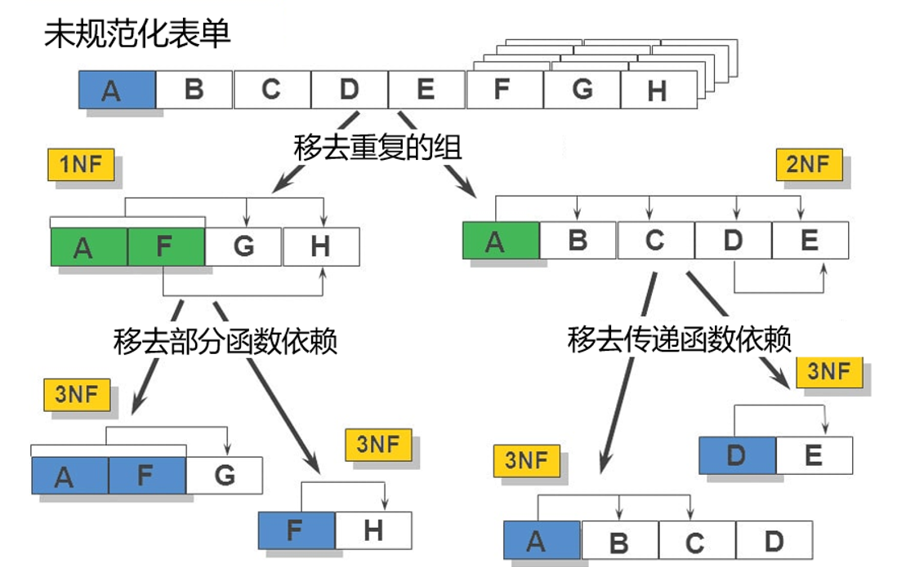

# 关系数据理论

### 数据依赖的类型

- 函数依赖：唯一确定的关系
- 多值依赖：不能唯一确定的关系

### 数据依赖对关系模式的影响

好的关系模式不会发生插入异常、删除异常、更新异常，而且数据冗余尽可能少。

不好的模式是由于模式中存在不合理的数据依赖，所以我们要通过分解关系模式来消除其中不合适的数据依赖（规范化）。

## 函数依赖

若对于R(U)的任意一个可能的关系r，r中不可能存在两个元组在X上的属性值相等， 而在Y上的属性值不等， 则称 “X函数确定Y”或 “Y函数依赖于X”，记作X→Y；

- 若X→Y，并且Y→X,则记为X←→Y。

### 平凡函数依赖与非平凡函数依赖

- 如果$X→Y$，但$Y\nsubseteq X$，则称$X→Y$是非平凡的函数依赖
- 如果$X→Y$，但$Y\subseteq X$,则称$X→Y$是平凡的函数依赖

举例：

~~~
在关系SC(Sno, Cno, Grade)中，
非平凡函数依赖： (Sno, Cno) → Grade
平凡函数依赖：     (Sno, Cno) → Sno      (Sno, Cno) → Cno
~~~

> 我的理解是不自己依赖于自己

### 完全函数依赖与部分函数依赖

- 定义：在关系模式$R(U)$中，如果$X→Y$，并且对于X的任何一个真子集X’，都有$X’ \rightarrow Y$,则称Y完全函数依赖于X，记作$X \stackrel{F}{\rightarrow} Y$。

- 若$X→Y$，但Y不完全函数依赖于X，则称Y部分函数依赖于X，记作

    $X \stackrel{P}{\rightarrow} Y$  。

> 我的理解是不可再分

### 传递函数依赖

在关系模式R(U)中，如果$X→Y$，$Y→Z$，且$Y\subsetneq X$，$Y\nrightarrow X$，则称Z传递函数依赖于X。

举例：

~~~
在关系Std(Sno，Sdept，Mname)中，有：
      Sno → Sdept，Sdept → Mname
      Mname传递函数依赖于Sno
~~~

### 候选码

k是关系模式的一个属性或者属性组合，如果$K\stackrel{f}{\rightarrow}U$,则K是R的一个候选码（Candidate Key)。如果关系模式中有多个候选码，则选其中一个作为主码。

- **主属性：**候选码中包含的属性
- **非主属性：**不包含在任何一个候选码中的属性
- **全码：**整个属性组都是码
- **外部码：**R中的属性或者属性组X并非R的码，但是X是另一个关系模式的码，则X是R的外部吗

## 范式

### 1NF

- **关系模式中所有属性都是不可再分的基本数据项**

### 2NF

- **每一个非主属性都完全函数依赖与R的码**

可以采用投影法将一个1NF的关系分解为多个2NF的关系，这样可以一定程度上减轻1NF关系中存在的问题。但是并不能完全消除各种异常和冗余。

### 3NF

- **每一个非主属性不传递函数依赖与候选码**

采用投影法将一个2NF关系分解为多个3NF关系，可以一定程度解决2NF存在的问题。但是不能完全消除。

### BCNF

- ==每个属性==都不部分依赖与候选码也不传递依赖于候选码。

**性质：**

- 所有**非主属性**都完全函数依赖与每个候选码
- 所有**主属性**都完全函数依赖与每个**不包含**它的候选码
- 没有**任何属性**完全函数依赖与非码的任何一组属性
- 在**函数依赖范畴内**，BCNF为最高范式

> 如果关系R是BCNF，则R一定是3NF
>
> 如果R是3NF，而且R只有一个候选码，则R一定属于BCNF

### 规范化过程

### 总结

规范化的本质就是要提高数据的独立性，解决增删改异常和数据冗余的问题。用规范化的思想来解决数据依赖中不合适的部分。

- 1NF的目标：确保每列的原子性
- 2NF的目标：确保每列都和候选键相关
- 3NF的目标：确保每列都和候选键列直接相关，而不是间接相关

> 但是并不一定非要满足范式要求，有时候违背一下的设计反而更好。这种好是对于数据查询来讲要好。

### 快速求候选码

属性划分：

–**L**类：**仅出现在F的函数依赖**左部的属性。

–**R**类：**仅出现在F的函数依赖**右部的属性。

–**N**类：**在F的函数依赖**左部和右部均未出现的属性。

–**LR**类：**在F的函数依赖**左部和右部两部均出现的属性。

定理：

- 定理1：若X(X∈R)是L类属性，则X必为R的任一候选码的成员。
  - 推论1：若X(X∈R)是L类属性，且X+包含了R的全部属性， 则X必为R的唯一候选码。
- 定理2：若X(X∈R)是R类属性，则X不在任何候选码中。
- 定理3：如果X是R的N类属性，则X必包含在R的任一候选码中。
  - 推论2：如果X是R的N类和L类组成的属性集，且X+包含了R的所有属性，则X是R的唯一候选码。