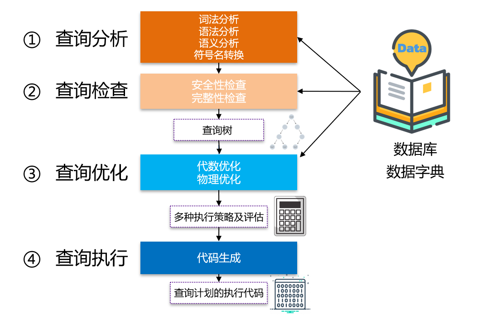
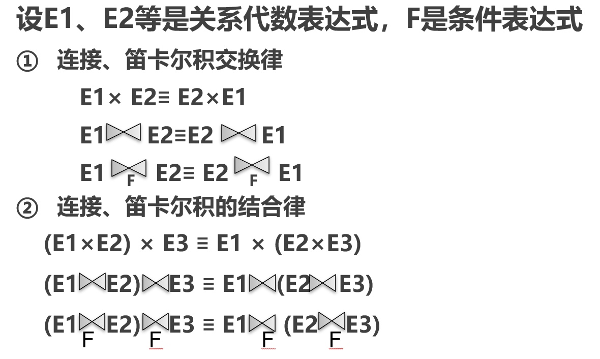
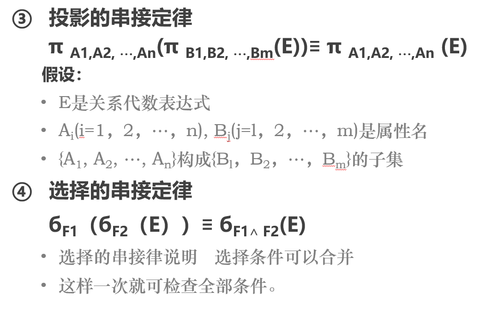
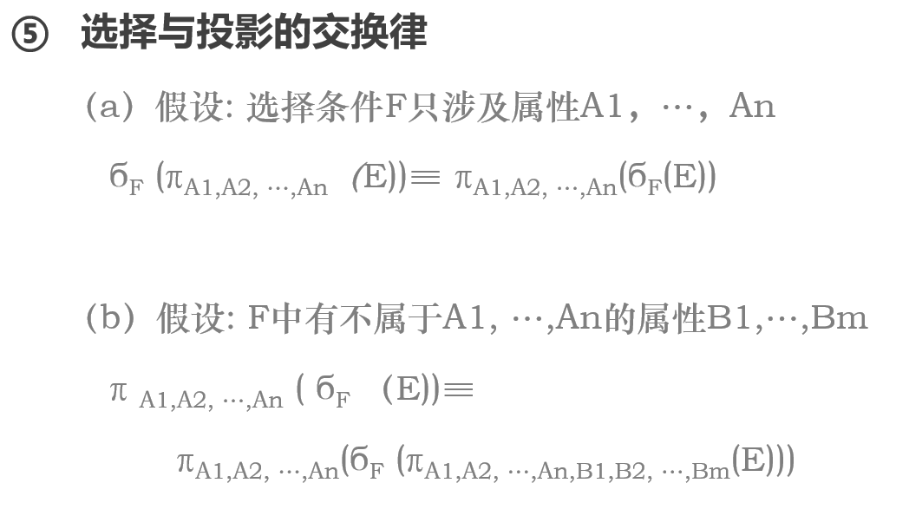
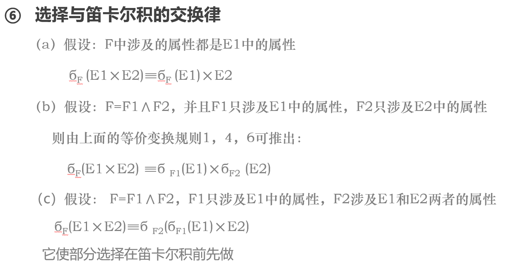
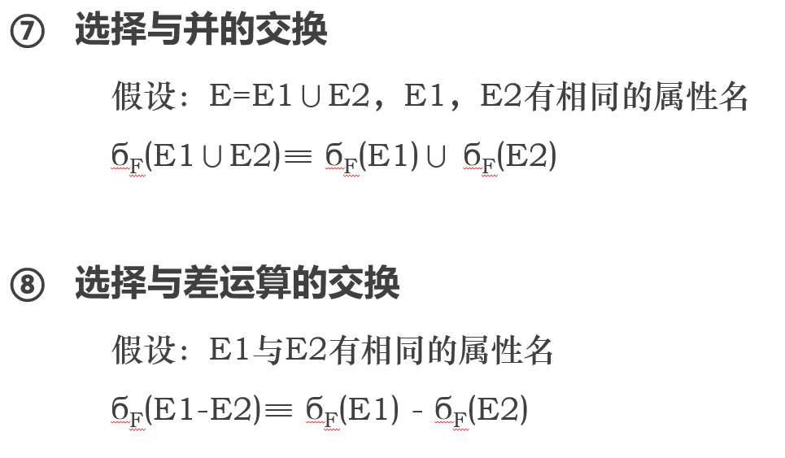
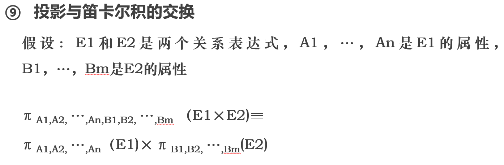
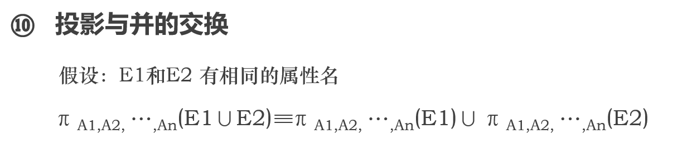

# 查询优化

### 查询处理的阶段  ==(记背)==

### 查询优化：选择一个高效的执行查询处理策略

查询优化分类：

- **代数优化：**指关系代数表达式的优化
- **物理优化：**指存取路径和底层操作算法的选择

查询优化的方法：

- **基于规则**
- **基于代价**
- **基于语义**

### **选择操作的**实现

- **全表扫描**
- **索引扫描**（B+树索引或者Hash索引）

### 连接操作的实现

连接操作是最耗时的操作之一，连接操作主要有以下的实现方法

- **嵌套循环：**对外层的每一个元组，检索内层循环中的每一个元组，检查两个元组 是否在连接属性上相等。
- **排序-合并：**先对两个表按照链接属性排序，然后合并输出
- **索引连接：**通过连接属性将两张表的值连接起来。
- **Hash连接：**将连接属性作为Hash码，用同一个hash函数将两个表元组散列到同一个hash文件中。

## 代数优化：构建语法树

### 查询优化一般准则：==（记背）==

- **选择运算应该尽可能先做**（减少中间关系）
- **再执行连接操作之前对关系适当进行预处理**
  - 按照连接属性排序
  - 在连接属性上建立索引
- **投影运算和选择运算同时做**（避免重复扫描）
- **将投影运算与其前面或者后面的双目运算结合**（减少扫描遍数）
- **某些选择运算+在其前面的笛卡尔积$\rightarrow$连接运算**

### ==关系代数等价变换规则==

等价变化就是用相同的关系代替原本的关系，得到的结果是相同的。

### 关系代数表达式的优化算法

- **分解选择运算**
- **通过交换选择、投影运算，将其尽可能移到叶子端。**
- **合并串接的选择和投影运算，放在一起执行。**
- **对内节点分组。**
- **生成程序**

## 物理优化

物理优化就是要选择合理高效的操作算法或者存取路径。

### 基于启发式规则

#### 选择操作的启发式规则

小关系，就全表顺序索引，大关系就看选择条件是不是主码，如果是的话可以采用主码索引。如果是非主属性的查询，要估算查询的比例占表的多少，较少（<10%)的时候用索引，否则还是全表扫。

#### 连接操作的启发式规则

如果两个表都已经按照属性排序了，就用排序合并方法。如果有表在连接属性上建立了索引，就用索引连接方法。如果其中一个表比较小，就用Hash连接。一定要用嵌套循环的时候将表小的放在外层循环。

### 基于代价估算的优化

简单来讲就是数据字典中已经有了表的一些统计信息，你就可以用类似估计复杂度的方法来估算代价。选择估计代价最小的方法来执行。

全表扫描代价：

- cost = B
- 码 = 值，cost = B/2

索引扫描代价：

- 码 = 值，cost = L+1
- 涉及非码属性：cost = L + s
- 比较条件是>,>=等：cost = L + Y/2 + B/2;

## 优化步骤

1. **将查询转换成某种内部表示**
2. **进行代数优化，将语法树转换成标准形式**
3. **物理优化，选择底层的存取路径**
4. **生成查询计划，选择代价最小的**

## SQL优化

==这一部分大纲里面没有写，暂时不整理，后面复习看情况有必要的时候再整理。==