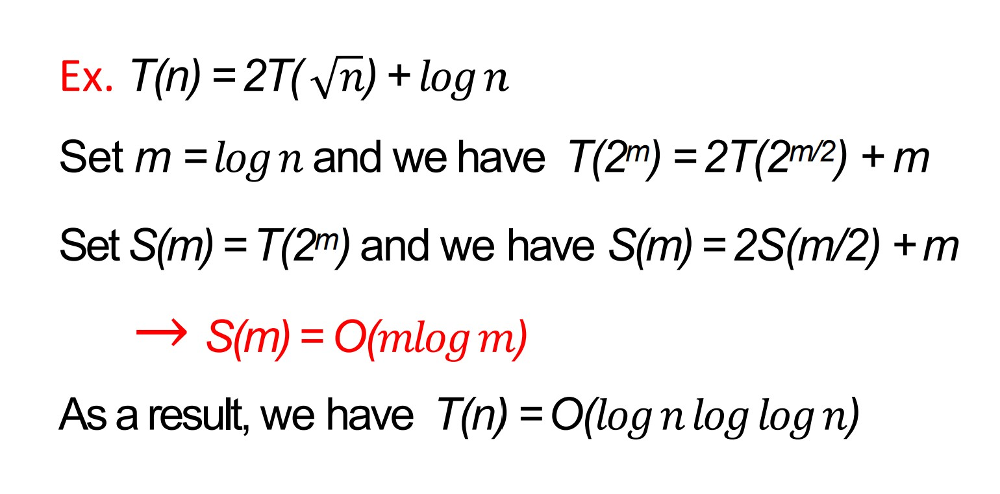
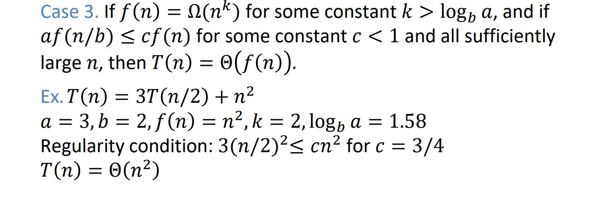

### 重点（根据老师的reviewPPT进行的归纳）
题型：6-7题，一道选择题,其他是大题

### *最好将所有tutorial的题目全部做一遍*
### 算法分析（上界、下界）maybe选择题
方法：求极限、根据定义证明

### 大题：
#### 1、递归
  - 归纳法：证明T(0)成立，假设T(n-1)成立，证明T(N)是否成立
  - 代替法
  - 递归树
  - 主定理
#### 2、merge—sort归并排序的过程
#### 3、贪心：间隔调度 最大相容工作集（最早完成时间）、分配教室（最早开始时间）、单源最短路径Dijkstra、最小生成树MST两种kruskal&prim(有源)
#### 4、动态：带权区间调度、背包问题、最短路径（带负权重）、最长公共子序列&字符串匹配
#### 5、利用单纯形法求解线性规划问题（必考一题）化为标准型、单纯形表、图解法
#### 6、回溯法：0-1背包问题（画出回溯树）、TSP旅行商问题、船装载问题、填色问题

### 算法分析（上界、下界）maybe选择题
方法：求极限、根据定义证明

### 大题：
#### 1、递归
  - 归纳法：证明T(0)成立，假设T(n-1)成立，证明T(N)是否成立
    
  - 代替法

  - 递归树

  - 主定理
   
 

   
 

    

    
#### 2、merge—sort归并排序的过程

#### 3、贪心

- 间隔调度 最大相容工作集（最早完成时间）

 - 分配教室（最早开始时间）

 - 单源最短路径Dijkstra、最小生成树MST两种kruskal&prim(有源)

#### 4、动态：

- 带权区间调度

- 背包问题

- 最短路径（带负权重）

  
- 最长公共子序列&字符串匹配

#### 5、利用单纯形法求解线性规划问题（必考一题）化为标准型、单纯形表、图解法

#### 6、回溯法：0-1背包问题（画出回溯树）、TSP旅行商问题、船装载问题、填色问题

