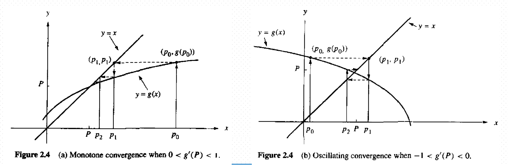

# 非线性方程和非线性方程组的数值解

求解$f(x)=0$的根，当函数为非线性方程，无一般的解析解解法可用，在满足一定精度要求下，求出方程的近似根

## 对分法

- 对分法定义：

  - 首先取区间$[a,b]$的中点$x_1=\frac{a+b}{2}$，将区间对分成小区间，$[a,x_1],[x_1,b]$
    - 如果$f(a)\cdot f(x_1)<0$，令$a_1=a,b_1=x_1$
    - 如果$f(b)\cdot f(x_1)<0$，令$a_1=x_1,b_1=b$
  - 重复此过程，得到每次长度减半的有根区间序列

- 对分法适合求有根区间的单实数根或奇重实根

  - 设$f(x)$在$[a,b]$上连续，$f(a)\cdot f(b)<0$，根据连续函数介值定理，区间内至少存在一点$\xi$，使得$f(\xi)=0$

- 收敛性分析

  - 当$k$足够大，有根区间$[a_k,b_k]$长度趋于零，区间内任意一点可作为根的近似值
    $$
    |x_k-\xi|\le\frac{1}{2}({b_k-a_k})=\frac{1}{2^{k+1}}(b-a) \\
    k\rightarrow\infty,x_k收敛于\xi
    $$

  - 收敛速度慢，不能求出偶重根（根两边函数值同号）

## 迭代法

- 迭代法定义：给定方程$f(x)=0$，用多种方法构造等价方程$x=\varphi(x)$，取定根的近似值$x_0$，构造序列
  $$
  x_{k+1}=\varphi(x_k)
  $$

  - 若$\{x_k\}$收敛，并且$\varphi(x)$连续，则有
    $$
    \lim\limits_{k\rightarrow \infty}x_{k+1}
    =\lim\limits_{k\rightarrow \infty}\varphi(x_k)
    =\varphi(\lim\limits_{k\rightarrow \infty}x_k)
    $$
    收敛序列的极限$x^*$是方程$x=\varphi(x)$的根，也是$f(x)$的根

  - 若$\{x_k\}$发散，迭代法失败

- 迭代法的几何意义
  $$
  \left\{
  \begin{array}{**lr**}
  y=x\\
  y=\varphi(x)\\
  \end{array}
  \right.
  $$
  求解方程和直线的交点的横坐标$x^*$

  

- 迭代法收敛条件

  - 定义：在根$x^*$的某个邻域$R:|x-x^*|\le \delta$中，对任意的$x_0\in R$，迭代公式$x_{k+1}=\varphi{(x_k)}$收敛，则称迭代在$x^*$附近局部收敛

  - 定理：设$x^*=\varphi(x^*)$，$\varphi '(x)$在$x^*$的某个邻域$R$内连续，并且$|\varphi '(x)|\le q,q<1$是常量，则

    - 对任意$x_0\in R$，由迭代公式$x_{k+1}=\varphi(x_k)$决定的序列$\{x_k\}$收敛于$x^*$

    - $|x_k-x^*|\le\frac{q^k}{1-q}|x_1-x_0|$

      证明：

    $$
    拉格朗日中值定理有\\
    x_k-x^*=\varphi(x_{k-1})-\varphi(x^*)=\varphi'(\xi)(x_{k-1}-x^*)\\
    递推得到\\
    |x_k-x^*|\le q|x_{k-1}-x^*|\le\cdots\le q^k|x_0-x^*|\\
    \lim\limits_{k\rightarrow \infty}|x_k-x^*|
    =\lim\limits_{k\rightarrow \infty}q^k|x_0-x^*|=0
    $$

    

    - $|x_k-x^*|\le\frac{1}{1-q}|x_{k+1}-x_k|$

      证明：

    $$
    x_k-x^*=x_k-x_{k+1}+x_{k+1}-x^*
    =x_k-x_{k+1}+\varphi'(\xi)(x_k-x^*)\\
    \therefore |x_k-x^*|\le|x_k-x_{k+1}|+q|x_k-x^*|\\
    (1-q)|x_k-x^*|\le|x_k-x_{k+1}|\\
    \therefore |x_k-x^*|\le \frac{1}{1-q}|x_{k+1}-x_k|\\
    又\because
    |x_{k+1}-x_k|\le q|x_k-x_{k-1}|\le \cdots\le q^k{|x_1-x_0|}|x_1-x_0|\\
    \Longrightarrow \\
    |x_k-x^*|\le\frac{q^k}{1-q}|x_1-x_0|
    $$

  - 定理：给定迭代方程$x=\varphi(x)$，若迭代方程满足：

    - 对任意的$x\in[a,b]$，有$\varphi(x)\in C[a,b]$
    - 对任意的$x,y\in [a,b]$，有$|\varphi(x)-\varphi(y)|\le q|x-y|,0\le q<1$

    则对任意的$x_0\in[a,b]$，迭代公式生成的序列收敛于$x=\varphi(x)$的根$x^*$

    证明：
    $$
    |x_k-x^*|\le q|x_{k-1}-x^*|\le q^k|x_1-x_0|\rightarrow0
    $$

- 迭代法的加速

  迭代公式收敛时，收敛速度取决于$|\varphi '(x)|$的大小，越接近1，收敛速度越慢

  松弛法：已知$\varphi(x_k)$和$x_k$是$x^*$的近似值，两个近似值的加权平均
  $$
  x_{k+1}=(1-w_k)x_k+w_k\varphi(x_k)\\
  x=(1-w)x+w\varphi(x)=\phi(x)\\
  $$
  令$\phi '(x)=1-w+w\varphi'(x)=0$，当$\varphi'(x) \ne 1$得到
  $$
  w=\frac{1}{1-\varphi'(x)}
  $$
  
  取$w_k=\frac{1}{1-\varphi '(x_k)}，1-w_k=\frac{-\varphi '(x_k)}{1-\varphi '(x_k)}$可以获得较好的加速效果
  
- 埃特金方法

  松弛法要计算导数$\varphi '(x_k)$，不方便。设$x^*$是准确解，$x_0$是近似根，取$x_1=\varphi(x_0),x_2=\varphi(x_1)$
  $$
  x^*=x_2+x^*-x_2=x_2+\varphi'(\xi)(x^*-x_1)\\
  用差商\\
  \frac{x_2-x_1}{x_1-x_0}=\frac{\varphi(x_1)-\varphi(x_0)}{x_1-x_0}\\
  代替\varphi'(\xi)，得到\\
  x^*\approx x_2+\frac{x_2-x_1}{x_1-x_0}(x^*-x_1)\\
  x^*\approx x_2-\frac{(x_2-x_1)^2}{x_2-2x_1+x_0}\\
  $$
  埃特金迭代公式
  $$
  \left\{
  \begin{array}{**lr**}
  x_k^{(1)}=\varphi(x_k)\\
  x_k^{(2)}=\varphi(x_k^{(1)})\\
  x_{k+1}= x^{(2)}_k-\frac{(x^{(2)}_k-x^{(1)}_k)^2}{x^{(2)}_k-2x^{(1)}_k+x_k}
  \end{array}
  \right.
  $$
  

## 牛顿法

由于$f(x)=0$是非线性方程，将非线性问题线性化，采用线性化的方法求解，将$f(x)$在$x_0$处泰勒展开
$$
f(x)=f(x_0)+f'(x_0)(x-x_0)+\frac{f''(\xi)}{2!}(x-x_0)^2
$$
用$p(x)=f(x_0)+f'(x_0)(x-x_0)=0$来近似$f(x)=0$，将曲线$f(x)$和X轴交点的横坐标近似为$p(x)$和X轴交点的横坐标，求得横坐标：
$$
x=x_0-\frac{f(x_0)}{f'(x_0)}
$$
牛顿法实质是一般迭代法用松弛法加速
$$
f(x)=0\Leftrightarrow x=x+f(x)=\varphi(x)\\
使用松弛法\varphi '(x)=1+f'(x)\\
w_k=\frac{1}{1-\varphi'(x_k)}=-\frac{1}{f'(x_k)}\\
推得牛顿法公式\\
x_{k+1}=x_k-\frac{f(x_k)}{f'(x_k)}
$$
牛顿法的收敛性质

- $p$阶收敛定义：设序列$\{x_k\}$收敛于$x^*$，令$\varepsilon_k=x^*-x_k$，设$k\rightarrow \infty$，有
  $$
  \frac{|\varepsilon_{k+1}|}{|\varepsilon_k|^p}\rightarrow c
  $$
  则称序列$p$阶收敛

  - $p=1$，线性收敛
  - $p=2$，二阶收敛
  - $1<p<2$，超线性收敛

- 定理：设$x^*=\varphi(x^*)$，在$x^*$的某个邻域内$\varphi^{(p)}(x)$连续，$p>1$是常量，并且满足
  $$
  \varphi^{(l)}(x^*)=0 \\
  \varphi^{(p)}(x^*)\ne 0
  $$
  则由$x_{k+1}=\varphi(x_k)$生成的序列$\{x_k\}$收敛于$x^*$，并且$p$阶收敛

  证明：

  $$
  \because \varphi '(x^*)=0,\therefore \{x_k\}收敛于x^* \\
  然后泰勒展开，\xi\in(x_k,x^*)\\
  x_{k+1}=\varphi(x_k)=\varphi(x^*)+\varphi'(x^*)(x_k-x^*)\\
  +\cdots+\frac{\varphi^{(p-1)}(x^*)}{(p-1)!}(x_k-x^*)^{p-1}+
  \frac{\varphi^{(p)}(\xi)}{p!}(x_k-x^*)^p\\
  又\because \varphi^{(1)}(x^*)=\varphi^{(2)}(x^*)=\cdots=\varphi^{(p-1)}(x^*)=0 \\
  \therefore |x_{k+1}-x^*|=|x_{k+1}-\varphi(x^*)|=|x_k-x^*|^p\frac{\varphi^{(p)}(\xi)}{p!}
  $$
  当$k\rightarrow \infty,x_k\rightarrow x^*$，从而$\xi_k\rightarrow x^*$，定理成立

牛顿法的收敛速度
$$
x=x-\frac{f(x)}{f'(x)}=\varphi(x),\varphi'(x)=\frac{f(x)f''(x)}{[f'(x)]^2}
$$
当$f'(x^*)\ne 0$时，$\varphi'(x^*)=0$，即牛顿法在单根附近至少二阶收敛，而在重根附近，牛顿法是线性收敛的

## 牛顿法求重根

设$f(x)=(x-x^*)^mg(x),g(x^*)\ne 0$，则$x^*$是函数的重根，此时$f(x^*)=f'(x^*)=\cdots f^{(m-1)}(x^*)=0,f^{(p)}(x^*)\ne 0$
$$
\varphi(x)=x-\frac{f(x)}{f'(x)}=x-\frac{(x-x^*)g(x)}{mg(x)+(x-x^*)g'(x)}\\
\varphi'(x^*)=1-\frac{1}{m}\ne 0，因此线性收敛
$$
此外，还能构造$\mu(x)=\frac{f(x)}{f'(x)}$，取代$f(x)$，具有二阶收敛

## 割线法

已知$f(x)=0$的近似根$x_k,x_{k-1}$，过两点$(x_{k-1},f(x_{k-1})),(x_{k},f(x_{k}))$作一条直线，写出直线方程
$$
\frac{y-f(x_k)}{x-x_k}=\frac{f(x_k)-f(x_{k-1})}{x_k-x_{k-1}}
$$
割线法：将曲线$f(x)=0$的横坐标近似求割线和X轴交点的横坐标
$$
x_{k+1}=x_k-\frac{f(x_k)}{f(x_k)-f(x_{k-1})}
$$
割线法需要两个初值$x_0,x_1$，也成为双点割线法

单点割线法：
$$
x_{k+1}=x_k-\frac{f(x_k)}{f(x_k)-f(x_0)}(x_k-x_0)
$$

## 解非线性方程组

三道大题

填空题10分 

计算题 7道题，每张一道 80分 第一第三10 其他12分

最后证明10分

2.3-2.7不考

拟合最小而成

正交多项不考

积分4.7 4.8不考

第五章 都靠

迭代法 迭代公式证明收敛性，

第七章：证明几节收敛，
