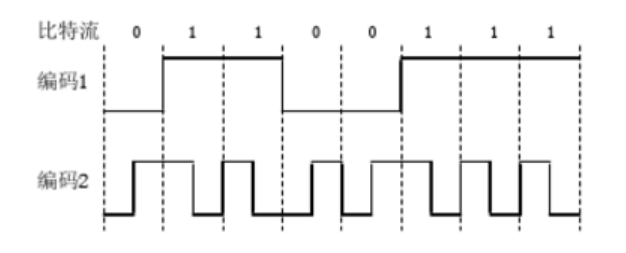

## 第1章概述

文章目录 [[隐藏目录](https://www.mymuke.com/123799.html?rand=64892922ecaf4#)]

- [第1章概述](https://www.mymuke.com/123799.html?rand=64892922ecaf4#1)
- [第2章物理层](https://www.mymuke.com/123799.html?rand=64892922ecaf4#2)
- [第3章数据链路层](https://www.mymuke.com/123799.html?rand=64892922ecaf4#3)
- [第4章介质访问控制子层](https://www.mymuke.com/123799.html?rand=64892922ecaf4#4)
- [第5章网络层上](https://www.mymuke.com/123799.html?rand=64892922ecaf4#5)
- [第5章网络层下](https://www.mymuke.com/123799.html?rand=64892922ecaf4#5-2)
- [第6章传输层](https://www.mymuke.com/123799.html?rand=64892922ecaf4#6)
- [第7章应用层](https://www.mymuke.com/123799.html?rand=64892922ecaf4#7)

### 第1章测试

1、单选题：
‌按照地理范围大小递增的顺序，给计算机网络排名。‌
选项：
A: PAN, LAN, MAN, WAN
B: LAN, PAN, WAN, MAN
C: WAN, MAN, LAN, PAN
D: PAN, LAN, WAN, MAN
答案: 【 PAN, LAN, MAN, WAN】

2、单选题：
‏1500 字节的用户消息（信息）通过一个链路发送，在网络层和数据链路层分别使用 IP 和以太网协议，每层都有 20 字节的报头（其它层忽略不计）。协议报头开销占总带宽的比例是多少？‏
选项：
A: 2.6%
B: 3.3%
C: 1.7%
D: 1.3%
答案: 【 2.6%】

3、单选题：
‌消息 M 是由 UDP、IP 和以太网协议封装，以此顺序沿着协议栈向下。使用U、I、 E 、 M 分别表示 UDP数据段、IP分组、以太帧、消息（信息）。以它们被发送的顺序来写，最左边为最先发送。问：在数据链路层上，协议数据单元（PDU），是怎样的？‍
选项：
A: EIUM
B: IUM
C: UIEM
D: MUIE
答案: 【 EIUM】

4、单选题：
‌下列哪个选项是一个标准协议的参考模型（顶端到底部）？‎
选项：
A: 应用层, 传输层, 网络层, 网络接入层
B: HTTP, TCP, 以太网, IP
C: 应用层, 会话层, 网络层, 链路层，物理层
D: HTTP, TCP, IP, 802.11
答案: 【 应用层, 传输层, 网络层, 网络接入层】

5、单选题：
​下面哪种拓扑是极其可靠，但同时也是极耗费成本的？‏
选项：
A: 星型拓扑
B: 总线拓扑
C: 环型拓扑
D: 全连通拓扑
答案: 【 全连通拓扑】

6、单选题：
‏关于对等通信，也即虚拟通信，错误的说法是：​
选项：
A: 数据分组从发方的网络层流到收方的网络层
B: 数据帧从发方的数据链路层流到收方的数据链路层
C: 数据段从发方的传输层流到收方的传输层
D: 其他说法都不对
答案: 【 其他说法都不对】

7、单选题：
​假设“线”上有一个传入帧 ABC ，由协议进行多路解编和处理 （A、 B 和 C 代表各协议及相应的报头，他们都按接收到他们的顺序给出）。传递到协议 B是什么消息，协议 B 又传递给谁什么消息？‍
选项：
A: 协议 B 从协议A获取 BC，并传递C到协议 C
B: 协议 B 从协议A获取 AB，并传递BC到协议 C
C: 协议 B 从协议A获取 ABC，并传递BC到协议 C
D: 协议 B 从协议C获取 ABC，并传递ABC到协议 C
答案: 【 协议 B 从协议A获取 BC，并传递C到协议 C】

8、单选题：
‍数据链路层的协议数据单元（Protocol Data Unit，PDU）是什么？‍
选项：
A: 帧（Frame）
B: 比特流（Bits）
C: 分组（Packet）
D: 数据段（Segment）
答案: 【 帧（Frame）】

9、单选题：
‏协议数据单元（PDU）包含哪两个部分？‎
选项：
A: 控制信息和用户数据
B: 接口信息和用户数据
C: 接口信息和控制信息
D: 控制信息和校验信息
答案: 【 控制信息和用户数据】

10、单选题：
‎在OSI参考模型中，第k层与它之上的第k+1层的关系是什么？‎
选项：
A: 第k层为第k+1层提供服务。
B: 1层将从第k层接收的报文添加一个报头。
C: 第k层与第k+1层相互没有影响
D: 第k层使用第k+1层提供的服务
答案: 【 第k层为第k+1层提供服务。】

11、单选题：
‌使用 HTTP、 TCP、 IP 和以太网协议栈的网络发送一个1000字节的用户消息。每个协议头是 20 个字节长。使用此消息将使网络带宽的使用率达到多少？‎
选项：
A: 6%
B: 94%
C: 7%
D: 93% 
答案: 【 93% 】

12、单选题：
​客户端和服务器使用卫星网络，与在 22,500 km高度的卫星进行通信。由客户端 （或服务器） 发送一条消息给卫星，然后卫星再传递此消息到服务器 （或客户端）。​​客户端发送 对服务器的请求后，需要多长时间等待来自服务器的响应？假定信号在客户端和服务器端处理不消耗时间，且以光速传播。（提示： 光速是 300,000,000 米/秒.)​​​
选项：
A: 15ms
B: 150ms
C: 30ms
D: 300ms
答案: 【 300ms】

13、单选题：
‌OSI-7层参考模型和TCP/IP-4层参考模型都具有的功能类似的层是哪个？（选择最恰当的一个）‌
选项：
A: 应用层
B: 表示层
C: 接入层
D: 网络层和传输层
答案: 【 网络层和传输层】

14、单选题：
‎下列选项中，不属于物理层接口规范定义范畴的是：‌
选项：
A: 接口形状
B: 引脚功能
C: 物理地址
D: 信号电平
答案: 【 物理地址】

15、单选题：
​OSI参考模型的第5层（自下而上）完成的主要功能是：‍
选项：
A: 差错控制
B: 路由选择
C: 会话管理
D: 数据表示转换
答案: 【 会话管理】

16、单选题：
‏吞吐量的基本单位是什么？‍
选项：
A: Bps(Byte per second)
B: bps(bit per second)
C: Byte
D: bits
答案: 【 bps(bit per second)】

17、判断题：
‏实通信是对等实体之间进行通信‍
选项：
A: 正确
B: 错误
答案: 【 错误】

18、判断题：
‌每次通信，总是从发方的解封装开始。​
选项：
A: 正确
B: 错误
答案: 【 错误】

19、判断题：
‍中国的网民人数位居全球第一。‏
选项：
A: 正确
B: 错误
答案: 【 正确】

20、判断题：
​吞吐量和数字带宽这两个概念的内涵是一样的，都可以用来表征网络的运行状况。‍
选项：
A: 正确
B: 错误
答案: 【 错误】

21、判断题：
‎协议和服务是完全分离的‎
选项：
A: 正确
B: 错误
答案: 【 正确】

## 第2章物理层

### 第2章测试

1、单选题：
‎在一根有传播延迟为5 ms 的4Mbps链路上发送2000字节的消息，此消息从发送到传播至目的地的延迟共有多少？（延迟=发送时间+传播延迟）‎
选项：
A: 5ms
B: 1ms
C:  9ms
D: 6ms
答案: 【 9ms】

2、单选题：
‍在一个传播延迟为2ms的 5 Mbps 互联网访问链路上，传输数据量最大可以是多少？‏
选项：
A: 20Bytes
B: 25KB
C: 10000bits
D: 2500Bytes
答案: 【 10000bits】

3、单选题：
‌一种使用 8个 电压级别的调制方案，分别对应 0 到 7。每个电压等级用为3 位表示，例如，电压等级 3 表示为"0 1 1"。请选出位序列010010001111表示的电压等级？‌
选项：
A:  8233
B: 1117
C: 010101
D: 2217
答案: 【 2217】

4、单选题：
‏8 级信号级别方案被用在一个 10 MHz频率波段中发送信息，数据传输最大比特率是多少？不考虑噪声。‏
选项：
A: 60 Mbps
B: 10 Mbps
C: 20 Mbps
D: 30 Mbps
答案: 【 60 Mbps】

5、单选题：
​32 个用户共享 2.048 Mbps 链路，使用FDM（频分多路复用）。每个用户实际使用多少带宽？‍
选项：
A:  由于统计复用，超过 64 kbps。
B: 64 kbps （所有时间）
C: 2.048 Mbps （1/32 秒）
D: 64 kbps （1/32 秒）
答案: 【 64 kbps （所有时间）】

6、单选题：
​32 个用户共享 2.048 Mbps 链路，使用TDM（时分多路复用）。当每个用户轮流使用时，以全速度发送8位。用户需要多长时间才能发送一次？‎
选项：
A: 4 us
B: 125 us
C: 任何阶段都可被使用
D: 4 ms
答案: 【 125 us】

7、单选题：
‌在局域网中，连接用户终端设备的常用的传输介质是哪种？‍
选项：
A: 非屏蔽双绞线
B: 屏蔽双绞线
C: 单模光纤
D: 多模光纤
答案: 【 非屏蔽双绞线】

8、单选题：
‍以下面哪种方式，报文的内容不是按顺序到达目的节点的？‎
选项：
A: 电路交换
B: 报文交换
C: 虚电路交换
D: 数据包交换
答案: 【 数据包交换】

9、单选题：
‏当数字信号在模拟传输系统中传送时，在发送端和接收端分别需要什么设备？‌
选项：
A: 调制器和解调器
B: 解调器和调制器
C: 编码器和解码器
D: 解码器和编码器
答案: 【 调制器和解调器】

10、单选题：
‎下面哪种传输介质具有高带宽、不受电磁干扰、重量轻等优势？‎
选项：
A: 同轴电缆
B: 屏蔽双绞线
C: 光纤
D: 卫星
答案: 【 光纤】

11、单选题：
‌为了在1 MHz带宽的信道上得到 4 Mbps 的比特率，信噪比需要达到多少？‍
选项：
A: 15dB
B: 15
C: 11.76
D: 1.18dB
答案: 【 15】

12、单选题：
‎下面哪个设备属于物理层（OSI参考模型的第1层）设备？‌
选项：
A: 集线器
B: 交换机
C: 路由器
D: 网关
答案: 【 集线器】

13、单选题：
‌下面哪种设备的使用可以导致冲突域扩大？‌
选项：
A: 路由器
B: 集线器
C: 交换机
D:  网桥
答案: 【 集线器】

14、单选题：
‎单模光纤的内径约是多大？‌
选项：
A: 62.5 µm
B: 125 µm
C: 8~10 µm
D: 上面答案都不对
答案: 【 8~10 µm】

15、单选题：
‌与多模光纤相比，单模光纤的主要特点是什么？‍‌‍
选项：
A: 高速度、短距离、高成本、粗芯线
B: 高速度、长距离、低成本、粗芯线
C: 高速度、短距离、低成本、细芯线
D: 高速度、长距离、高成本、细芯线
答案: 【 高速度、长距离、高成本、细芯线】

16、单选题：
‎一个调制解调器综合使用了幅移键控和相移键控。在波特率是1000波特的情况下数据速率达到3000bps，若采用0，90，180，270四种相位，则每种相位有几个不同的幅度值？‎
选项：
A: 1
B: 2
C: 3
D: 4
答案: 【 2】

17、单选题：
‌有10 个信号，每个需要4000 Hz 带宽，现在用FDM（频分多路复用） 将它们复用在一条信道上。试问对于被复用的信道，需要的最小带宽是多少?假设保护带为400 Hz宽。‌
选项：
A: 43600HZ
B: 44000HZ
C: 39600HZ
D: 40000HZ
答案: 【 43600HZ】

18、单选题：
‏假设一个CDMA系统有3个工作站，码片序列由4位构成，三个工作站A、B 和 C的码片序列分别是： (1,1,1,1),(1,-1,1,-1) and (1,1,-1,-1)。如果工作站 C 连续收到了一个复用信号： (2,0,2,0,0,-2,0,-2,0,2,0,2)，请用计算结果回答：工作站C从工作站A收到了什么信号？‏
选项：
A: 101
B: 010
C: 100
D: 001
答案: 【 101】

19、单选题：
‎一个调制解调器采用QAM-64的调制方案，其中的一半信号点被用来检查错误，波特率是1200，请问，可以达到多大的传输速率？​
选项：
A: 7200bps
B: 3600bps
C: 6000bps
D: 3000bps
答案: 【 6000bps】

20、单选题：
‌在无噪声情况下，若某通信链路的带宽为3kHz，采用4个相位，每个相位具有4种振幅的QAM调制技术，则该通信链路的最大数据传输速率是多少？​
选项：
A: 12 kbps
B: 24 kbps
C: 48 kbps
D: 96 kbps
答案: 【 24 kbps】

21、单选题：
​若某通信链路的数据传输速率为2400bps，采用4相位调制，则该链路的波特率是多少？‌
选项：
A: 600波特
B: 1200波特
C: 4800波特
D: 9600波特
答案: 【 1200波特】

22、单选题：
‏在物理层接口特性中，用于描述完成每种功能的事件发生顺序的是哪个？​
选项：
A: 机械特性
B: 功能特性
C: 过程特性
D: 电气特性
答案: 【 过程特性】

23、单选题：

‏使用两种编码方案对比特流01100111进行编码的结果如下图所示，编码1和编码2分别是什么？

‌

‌选项：
A: NRZ和曼彻斯特编码
B: NRZ和差分曼彻斯特编码
C: NRZI和曼彻斯特编码
D: NRZI和差分曼彻斯特编码
答案: 【 NRZ和曼彻斯特编码】

24、单选题：
‍若连接R2和R3链路的频率带宽为8kHz，信噪比为30dB，该链路实际数据传输速率约为理论最大数据传输速率的50%，则该链路的实际数据传输速率约是多少？‎
选项：
A: 8kbps
B: 20kbps
C: 40kbps
D: 80kbps
答案: 【 40kbps】

25、单选题：
‎公共电话交换网络（PSTN）主要由下面哪几部分构成？‎
选项：
A: 交换局
B: 本地回路
C: 干线
D: 其余三个答案都是
答案: 【 其余三个答案都是】

26、判断题：
​物理层主要提供透明的比特流传输，不关心比特携带的任何信息‍
选项：
A: 正确
B: 错误
答案: 【 正确】

27、判断题：
‎信号的传输占据了传输介质从零到最大值之间的全部频率。是有线传输介质普遍采用的一种方法，这就是通带传输。‌
选项：
A: 正确
B: 错误
答案: 【 错误】是基带传输

28、判断题：
‍波分多路复用技术（WDM）是一种全新的复用技术，完全不同于频分多路复用技术。‏
选项：
A: 正确
B: 错误
答案: 【 错误】

29、判断题：
​目前，我国计算机网络的干线上大量使用了粗同轴电缆，比细缆提供了更高的带宽。‍
选项：
A: 正确
B: 错误
答案: 【 错误】

30、判断题：
‎北美和日本主要采用T系列线路标准；我国则采用E系列线路标准。‍
选项：
A: 正确
B: 错误
答案: 【 正确】

31、判断题：
‌集线器是星型拓扑的中心，方便用户接入以太网，且成本低廉，所以现在还大量使用。‎
选项：
A: 正确
B: 错误
答案: 【 错误】

## 第3章数据链路层

### 第3章测试

1、单选题：
​系统采用带位填充的帧界标记法，收方从网络接收到一个字符串是 11101111100。那么，发送方发送的原始字符串是什么？‌
选项：
A: 111011111000
B:  111111110
C: 11101111100
D: 1110111110
答案: 【 1110111110】

2、单选题：
‎有一个字符串1001011，采用j奇校验进行检错。试计算应追加到字符串后的校验位是什么？‎
选项：
A: 1
B: 4
C: 10010110
D: 0
答案: 【 1】

3、单选题：
​系统采用纠1位错的海明码，码字总长度是 7 位（n=7）。 假设7 位码字由 A B C D E F G代表，问这些位中，哪些位置是校验位？‏
选项：
A:  A B D
B:  A B C D
C:  E F G
D: C E F G
答案: 【 A B D】

4、单选题：
‌下列关于停-等ARQ协议，正确的描述是？​
选项：
A: 超时可防止丢帧和丢失ACKs
B: 帧和 ACKs没有必要携带序列号。
C: 仅当当前帧的 ACK 落入 * received *（接收窗口），发送方发送下一帧。
D: 仅当当前帧的 ACK 落入 *sent *（发送窗口），发送方发送下一帧。
答案: 【 仅当当前帧的 ACK 落入 *sent *（发送窗口），发送方发送下一帧。】

5、单选题：
‍使用滑动窗口，每个窗口10 个数据包， RTT 为100 ms ，假设有 1250 字节数据包，最大吞吐量是多少？（注意 1250 字节数据包是 10000 位。要找出最大的吞吐量，假设网络容量不是一个限制因素，忽略数据包丢失)‌
选项：
A: 1 Mbps （兆比特每秒）
B: 125 kbps (千比特每秒）
C:  2 Mbps （兆比特每秒）
D:  1 MBps (每秒兆字节数）
答案: 【 1 Mbps （兆比特每秒）】

6、单选题：
‍若数据链路层的发送窗口尺寸W=4，在发送3号帧、并收到2号帧的确认帧后，发送方还可以连续发送多少个帧？（采用累计确认）‌
选项：
A: 2
B: 3
C: 4
D:  1
答案: 【 3】

7、单选题：
‎在回退n帧协议中，当帧序号为5比特，发送窗口的最大尺寸是多少？​
选项：
A: 29
B: 30
C: 31
D: 32
答案: 【 31】

8、单选题：
‏在选择性重传协议中，当帧序号为4比特，并且发送窗口和接收窗口尺寸相同时，发送窗口的最大尺寸是多少？​
选项：
A: 4
B:  6
C: 8
D: 15
答案: 【 8】

9、单选题：
‍数据链路层采用了回退n帧协议（GBN），发送方已经发送了编号为0~7的帧，当计时器超时时，若发送方只收到0、2、3号帧的确认，则发送方需要重发多少帧？​
选项：
A: 2
B: 3
C: 4
D: 7
答案: 【 4】

10、单选题：
‏系统采用纠1位错的海明码，码字总长度是 11 位（n=8）。 假设8 位码字由 A B C D E F G H I J K 代表，问这些位中，哪些位置是数据位？‎
选项：
A: A B D H
B: A B C D I J K
C: E F G I J K 
D: C E F G I J K
答案: 【 C E F G I J K】

11、单选题：
‍采用比特填充的比特标记法，对0111 1100 0111 1110 组帧后，对应的比特串是多少？‌
选项：
A: 01111100 00111110 10 
B:  01111100 01111101 01111110
C: 01111100 01111101 0 
D: 01111100 01111110 01111101
答案: 【 01111100 00111110 10 】

12、单选题：
​系统采用的码字分别是 0000，0011， 1100， 1111（分别对应待传送的码 00， 01， 10 和 11）。请使用海明距离判断：该系统可以检测出多少位错误？‎
选项：
A: 4
B: 3
C: 2
D: 1
答案: 【 1】

13、单选题：
‍数据链路层采用选择重传协议（SR）传输数据，发送方已发送了0~3号数据帧，现已收到1号帧的确认，而0、2号帧依次超时，则此时需要重传的帧数是多少？‌
选项：
A: 1
B: 2
C: 3
D: 4
答案: 【 2】

14、单选题：
‎系统采用纠1位错的海明码，现在要传输的数据是7位，问需要的冗余位至少是几位？​
选项：
A: 2
B: 3
C: 4
D: 5
答案: 【 4】

15、单选题：
‏系统采用纠1位错的海明码，待传输的数据是：10101111，校验集合采用偶校验，编码后的码字是下面哪一个？‏
选项：
A: 101001001111
B: 011101011111
C: 101101001111
D: 101001011111
答案: 【 101001001111】

16、单选题：
‎一个采用了纠1位错海明码的系统，传输数据位数7位，冗余位4位，现在接收方收到了码字如下：00111000100,下面哪个说法是正确的？‌
选项：
A: 这个码字的传输没有发生错误
B: 这个码字传输有错，正确的码字应该是00111000101
C: 这个码字传输有错，正确的码字应该是10111000100
D: 这个码字传输有错，正确的码字应该是00101000100
答案: 【 这个码字传输有错，正确的码字应该是00111000101】

17、单选题：
‍一个系统采用了循环冗余校验检错码。如果生成多项式是G(x)= x^3+ x^2+ 1，待传送的原始码字分别是1111，请计算采用CRC编码后的码字是多少？‎
选项：
A: 1111111
B: 1111000
C: 1111101
D: 1111110
答案: 【 1111111】

18、单选题：
‏一个系统采用了循环冗余校验检错码。如果生成多项式是G(x)= x^3+ x^2+ 1，接收方收到的码字是1100101，关于这个码字，下面哪个说法是正确的？‎
选项：
A: 正确的，传输的原始码字是0101
B: 正确的，传输的原始码字是1100
C: 错误的
D: 正确的，传输的原始码字是1101
答案: 【 正确的，传输的原始码字是1100】

19、单选题：
‏主机甲和主机乙之间使用后退N帧协议（GBN）传输数据，甲的发送窗口尺寸为1000，数据帧长为1000字节，信道为100Mbps，乙每收到一个数据帧立即利用一个短帧（忽略其传输延迟）进行确认。若甲乙之间的单向传播延迟是50ms，则甲可以达到的最大平均传输速率约是哪一个？‏
选项：
A: 10Mnps
B: 20Mbps
C: 80Mbps
D: 100Mbps
答案: 【 80Mbps】

20、单选题：
​从滑动窗口的角度来看，当发送窗口SW=1，接收窗口RW=1的时候，相当于下面的哪种工作方式？‎
选项：
A: 选择性重传   
B: 回退n帧
C: 停-等工作
D: 连续工作
答案: 【 停-等工作】

21、单选题：
‌数据传输过程中，出现的差错类型主要要两类：突发错误和下面哪个？‌
选项：
A: 计算差错
B: 奇偶校验差错
C: 随机错误
D: 互联网校验错
答案: 【 随机错误】

22、单选题：
‎在采用检错码的系统中，接收端如果发现了错误，通常采用下面哪个措施？‎
选项：
A: 自动纠错 
B: 报告上层协议处理
C: 反馈重发
D: 重新生成原始数据
答案: 【 反馈重发】

23、判断题：
‍一个系统中的码字的海明距离是5，能够纠正4位错误。‏
选项：
A: 正确
B: 错误
答案: 【 错误】

24、判断题：
‎一个系统中的码字的海明距离是5，能够检查出4位错误。‎
选项：
A: 正确
B: 错误
答案: 【 正确】

25、判断题：
‍出错率比较低的局域网传输编码中，常采用纠错码，比如以太网。​
选项：
A: 正确
B: 错误
答案: 【 错误】

26、判断题：
‍肯定确认重传技术中，启用重传定定时器的主要目的是为了防止死锁。‎
选项：
A: 正确
B: 错误
答案: 【 正确】

27、判断题：
‏捎带确认的主要作用是：将确认嵌入到外发的数据帧中，而不需要单独发帧，提高了信道的利用率。‌
选项：
A: 正确
B: 错误
答案: 【 正确】

28、判断题：
​点到点协议PPP的两种认证方式中，PAP不仅简单，而且也解决了拒绝服务攻击和明文传输的问题。​
选项：
A: 正确
B: 错误
答案: 【 错误】

## 第4章介质访问控制子层

### 第4章测试

1、单选题：
‌假设一个经典的以太网站点正试图发送一个帧，在它要传输这个帧之前已有两个连续冲突。此时，可供该站点选择的随机等待时隙有多少个？‌
选项：
A: 2
B: 4
C: 8
D: 16
答案: 【 4】

2、单选题：
‌以下关于MAC地址的描述中，错误的是：‎
选项：
A: 目的地址与源地址分别表示帧的接收主机与发送主机的硬件地址
B: 硬件地址通常称为“物理地址”或“MAC地址”
C: 源地址可以是单播、多播或广播地址
D: MAC地址长度为48bit
答案: 【 源地址可以是单播、多播或广播地址】

3、单选题：
‏一台交换机具有24个100Mbps的全双工端口和2个1000Mbps的全双工端口，如果所有的端口都工作在全双工状态，那么交换机总带宽等于:‍
选项：
A: 4.4Gbps
B:  6.4Gbps
C:  6.8Gbps
D: 8.8Gbps
答案: 【 8.8Gbps】

4、单选题：
​以下关于CSMA/CD发送流程的描述中，错误的是:‍
选项：
A: 先听后发
B: 先发后听 
C: 边发边听
D: 延迟重发
答案: 【 先发后听 】

5、单选题：
‏以下关于交换机“逆向地址学习”方法的描述中，错误的是:
选项：
A: 交换机检查帧的源地址与进入交换机端口号对应关系
B: 对应关系不存在，交换机就将该对应关系加入端口转发表
C: 每次加入或更新转发表时，加入或更改的表项被赋予一个IP地址
D: 通过不断删除过时的、已经不使用的表项，交换机能够维护一个动态的端口转发表
答案: 【 每次加入或更新转发表时，加入或更改的表项被赋予一个IP地址】

6、单选题：
​以下关于生成树协议作用的描述中，错误的是:
选项：
A: 生成树协议是一种路由选择协议
B: 使得任意两个网桥或交换机之间只有一条有效帧传输路径
C:  能够自动控制局域网系统的拓扑，形成一个无环路的逻辑结构
D: 当局域网拓扑发生变化时，能够重新计算并形成新的无环路的结构
答案: 【 生成树协议是一种路由选择协议】

7、单选题：
‍考虑一个与主机 A 和 B 连接的交换机 （其他端口是空的）。交换机刚刚开始启动和运作。A发送一帧到B，然后B回复一帧到A。检查下列所有语句，当第二个帧 （从 B 发送给 A） 被交换机处理时，哪些是正确的？‎
选项：
A: 交换机通过广播帧到达 A.
B: 交换机将帧直接转发到 A。
C:  交换机不会学习 B的端口
D:  该交换机不学习任何新的东西。
答案: 【 交换机将帧直接转发到 A。】

8、单选题：
‎在二进制指数后退算法中，N次碰撞之后，站点会在0~（）个时隙中选择一个随机时间来等待。‎
选项：
A: 2^10-1
B: 2^15-1
C:  2^16-1
D: 上面都是错误的
答案: 【 上面都是错误的】

9、单选题：
‎以太网的MAC协议提供的是什么服务？‏
选项：
A: 无连接不可靠的服务
B:  无连接可靠的服务
C: 面向链接的无可靠的服务
D: 面向链接的可靠的服务
答案: 【 无连接不可靠的服务】

10、单选题：
‏下面哪个用来分隔广播域？‌
选项：
A:  生成树（Spanning Tree ，STP)
B:  IEEE802.1D
C:  虚拟局域网（Virtual LAN）
D: 上述答案都不对
答案: 【 虚拟局域网（Virtual LAN）】

11、单选题：
‎以下关于介质访问控制基本概念的描述中，错误的是：‌
选项：
A: 连接多台计算机的传输介质叫做“共享介质”
B: 多个主机利用共享介质发送和接收数据叫做“多路访问”
C: 同时有多台主机在一条共享介质上发送数据的现象称作“冲突”
D: 只有共享总线的Ethernet网需要研究解决冲突的“介质访问控制方法”
答案: 【 只有共享总线的Ethernet网需要研究解决冲突的“介质访问控制方法”】

12、单选题：
‌以下关于IEEE 802协议类型的描述中，错误的是：‎
选项：
A: IEEE 802.1标准：定义了局域网体系结构、网络互连、网络管理与性能测试
B: IEEE 802.2标准：定义了逻辑链路控制LLC子层功能与服务
C: 定义了ADSL等不同一系列的接入技术标准
D: 定义了IEEE 802.3等一系列的标准
答案: 【 定义了ADSL等不同一系列的接入技术标准】

13、单选题：
‍下面哪种以太网采用了光纤?‍
选项：
A: 10Base5
B: 10base2
C: 10base-F
D: 10base-T
答案: 【 10base-F】

14、单选题：
‎一个通过以太网传送的IP分组长60字节，其中包括头部。如果没有使用LLC，则以太网帧需要填充多少字节？​
选项：
A: 4 bytes
B: 1440 bytes
C: 0 bytes
D: 64 bytes
答案: 【 0 bytes】

15、单选题：
‏网卡实现的主要是哪一层的功能？​‏​
选项：
A: 物理层和数据链路层
B: 数据链路层和网络层
C: .物理层和网络层
D: 数据链路层和应用层
答案: 【 物理层和数据链路层】

16、单选题：
‎下面哪种以太网定义了以集线器（hub）为中心的星型拓扑结构，且采用了非屏蔽双绞线UTP连接工作站和中心？‏
选项：
A: 10BASE5
B: 10BASE2
C: 10BASE-T
D: 其它三个选项都不对
答案: 【 10BASE-T】

17、单选题：

‏下图中，有多少个广播域？有多少个冲突域？

‏1003103018 最新慕课完整章节测试答案-mymuke学习网_files/FB0CBD6EABC75F9651A3269BBFC2BDE8.png)

‏

选项：
A: 2、7
B: 3、3
C: 2、8
D: 3、11
E: 2、11
答案: 【 2、7】

18、判断题：
​以太帧的长度只有下限，没有上限。‎
选项：
A: 正确
B: 错误
答案: 【 错误】

19、判断题：
‏IEEE802.3以太网和DIX以太网完全一样，毫无差别‏
选项：
A: 正确
B: 错误
答案: 【 错误】

20、判断题：
‌每个帧到达交换机，交换机都会执行广播、转发和过滤三个动作‏
选项：
A: 正确
B: 错误
答案: 【 错误】

21、判断题：
‌分隙ALOHA协议不再是想发就发，而是通过规定必须在时隙的起始处发帧，降低了冲突危险期，从而提高了信道的利用率​
选项：
A: 正确
B: 错误
答案: 【 正确】

## 第5章网络层上

### 第5章测试

1、单选题：
​给出前缀地址 10.0.0.0/18，下列陈述哪个是正确的？‌
选项：
A: 前缀长度是 18 ，剩余的 14 位可以表示 1003103018 最新慕课完整章节测试答案-mymuke学习网_files/NxP-WoEInQUAJlKx94e0TQ==_6608638828004120539.png)个此前缀的 IP 地址。
B: 此前缀的IP 地址共享低 14 位。
C:

前缀长度是 14，剩余的 14 位可以表示1003103018 最新慕课完整章节测试答案-mymuke学习网_files/NxP-WoEInQUAJlKx94e0TQ==_6608638828004120539.png)个此前缀的的 IP 地址。
D:

前缀长度是 14，剩余的 18 位可以表示1003103018 最新慕课完整章节测试答案-mymuke学习网_files/0kjnKWd1oJS29sPLqJks2g==_6631763756560964263.png) 个此前缀的的 IP 地址。
答案: 【 前缀长度是 18 ，剩余的 14 位可以表示 1003103018 最新慕课完整章节测试答案-mymuke学习网_files/NxP-WoEInQUAJlKx94e0TQ==_6608638828004120539.png)个此前缀的 IP 地址。】

2、单选题：
​一个A类网络地址25.0.0.0，其划分了子网之后，子网掩码是255.192.0.0，请问这些子网中的第一个子网的网络地址是什么？‎
选项：
A: 25.0.0.0
B: 25.64.0.0
C: 25.128.0.0
D: 25.192.0.0 
答案: 【 25.0.0.0】

3、单选题：
‏一个网络的网络地址是：115 . 25 . 0 . 0，其子网掩码是2 5 5 . 2 5 5 . 2 2 4 . 0，下面的哪一个是合法的主机地址？‍
选项：
A: 115.25.0.0
B: 115.25.31.255
C: 115.25.0.255
D: 以上都不是
答案: 【 115.25.0.255】

4、单选题：
​192.168.0.0/22表示的合法IP地址有多少个？‏
选项：
A: 1024
B: 1022
C: 2048
D: 2046
答案: 【 1022】

5、单选题：
‍以下关于IPv4分组结构特征的描述中，错误的是​
选项：
A: IPv4分组由两个部分组成：分组头和数据
B: 分组头长度以4字节为单位来表示
C: 分组头选项最大长度为60字节
D: 分组头的基本长度是20字节
答案: 【 分组头选项最大长度为60字节】

6、单选题：
‌IPv6地址的二进制位数是多少？‏
选项：
A: 32
B: 48
C: 64
D: 80
E: 128
答案: 【 128】

7、单选题：
​如果采用前缀表示法表示子网掩码255.255.255.224，应该选哪个？‌
选项：
A: /25
B: /26
C: /27
D: /28
答案: 【 /27】

8、单选题：
​IPv6分组中的跳数限制字段的含义跟IPv4分组中的哪个字段类似？​
选项：
A: 生存时间
B: 用户协议
C: 头部长度
D: 分片偏移
答案: 【 生存时间】

9、单选题：
‎某网络的IP地址空间为192.168.5.0/24，采用定长子网划分，子网掩码为255.255.255.248，则该网络的最大子网个数、每个子网内的最大可分配地址个数是多少？‎
选项：
A: 32，8
B: 32，6
C: 8，32
D: 8，30
答案: 【 32，6】

10、单选题：
‎一条MTU是1000字节的链路，假设每个数据分组有 20字节的头部信息,传输有效载荷为1980字节所需数据分组的最小数目是多少？假设先前的数据分组是最大尺寸，那么最后一个数据分组的大小是多少？‌
选项：
A: 3 个数据包，第三个数据分组大小为 48 字节
B: 3 个数据包，第三个数据分组大小为 28 字节
C: 2 个数据包，第二个数据分组大小为 976 字节
D: 2 个数据包，第二个数据分组大小为 980 字节
答案: 【 3 个数据包，第三个数据分组大小为 48 字节】

11、单选题：
‌以下不属于IPv6分组基本头部的是哪个？‏
选项：
A: 流标签 
B: Protocol（协议）
C: 下一个头
D: 净荷长度
答案: 【 Protocol（协议）】

12、单选题：
‎有一个未简写的IPv6地址是0000:0000:0000:1234:6678:9101:0000:34AB，它的冒分十六进制简写形式应该是哪个？‍
选项：
A: ::1234:6678:9101:0:34AB
B: ::1234:6678:9101::34AB
C: 0::1234:6678:9101:0:34AB
D: 上述答案都不对
答案: 【 ::1234:6678:9101:0:34AB】

13、单选题：
‍IPv4 地址、IPv6 地址和MAC地址分别用多少二进制位表示？​
选项：
A: 32，128，48
B: 32，64，48
C: 32，128，64
D: 32，128，32
答案: 【 32，128，48】

14、单选题：
​子网掩码255.255.255.192采用前缀表示法表示应该选哪个？‎
选项：
A: /25
B: /26
C: /27
D: /28
答案: 【 /26】

15、单选题：
​下面的IPv4地址，哪些属于私有地址？​
选项：
A: 192.0.2.3
B: 172.15.1.9
C: 172.33.9.6
D: 10.10.10.10
答案: 【 10.10.10.10】

16、单选题：
‎一台设备有两个IP地址，这台设备可能是以下哪个？‏
选项：
A: 计算机
B: 路由器
C: 网关
D: 上面都是
答案: 【 上面都是】

17、判断题：
‎子网的网络地址可以出现在分组的目的地址中​
选项：
A: 正确
B: 错误
答案: 【 错误】

18、判断题：
‏目的地址是泛洪广播地址255.255.255.255的分组，会被送给互联网上的每一台主机。‌
选项：
A: 正确
B: 错误
答案: 【 错误】

19、判断题：
‏组播地址可出现在分组头部的源地址字段中‍
选项：
A: 正确
B: 错误
答案: 【 错误】

20、判断题：
​IPv4地址中的私人地址不具备全球唯一性。‎
选项：
A: 正确
B: 错误
答案: 【 正确】

21、判断题：
‎IPv4分组头部中的头部长度的值是“0101”，表明分组头部长度是5字节‏
选项：
A: 正确
B: 错误
答案: 【 错误】

## 第5章网络层下

### 第5章测试下

1、单选题：

‎下图所示的网络中，采用了OSPF来配置路由器。如果要从Net A到达Net B，应该选择哪条路径？

‌

‎1003103018 最新慕课完整章节测试答案-mymuke学习网_files/1944e28e-c7a9-4919-b08c-3fa7ed0be7b3.png)

‌选项：
A: R1, R2, R5, R7
B: R1, R3, R5, R7
C: R1, R3, R6, R7
D: R1, R4, R6, R7
E: R1, R3, R5, R6, R7
答案: 【 R1, R3, R5, R7】

2、单选题：
‌假设一个网络运行着距离矢量路由选择协议。如果路由器A和路由器B、路由器C之间的链路开销为分别为1、3。某个时刻，路由器A收到了从B发送过来的距离矢量，列出了B与A,B,C,D之间的开销依次是（1,0,1,5）；A同时收到了C发送过来的距离矢量（3,1,0,1）。A更新了自己的距离矢量，可能是下面哪一个？‌
选项：
A: （0,1,2,4）
B: （0,1,3,1）
C: （0,1,2,1）
D: （2,1,2,4）
答案: 【 （0,1,2,4）】

3、单选题：
‏某自治系统内采用 RIP 协议，若该自治系统内的路由器 R1 收到其邻居路由器 R2 的距离矢量中包含的信 息<net1，16>，则可能得出的结论是?‏
选项：
A: R2 可以通过R1到达net1 ,代价是17
B: R2 可以到达 net1，代价是 16
C: R1 可以通过R2到达 net1，代价是17
D: R1 不能通过R2到达net1
答案: 【 R1 不能通过R2到达net1】

4、单选题：
‍下列哪个答案最能说明由节点A泛洪发送的链路状态数据包（LSA/LSP）所代表的信息。‎
选项：
A:  所有从A到其相邻路由器的链路成本。
B: 所有与A相连的邻居路由的标识。
C: 所有与A直接相连的邻居路由的标识以及到他们之间的链路成本
D: 所有网络中的路由器的标识以及估计的到达这些路由器的最小开销。
答案: 【 所有与A直接相连的邻居路由的标识以及到他们之间的链路成本】

5、单选题：
‎下列关于NAT（网络地址翻译转换）的语句中，哪个是错误的？‍
选项：
A:  创建一个新的 NAT 表项，产生一个不包含私人地址的输出数据包。
B: 不同的 NAT 表项可以包含不同的外部 IP 地址。
C: 可能单一的内部 IP, Port对，有多个 NAT 表项。
D: 可能单一的内部 IP地址，有多个 NAT 表项。
E: 不同的 NAT 表项可以包含不同的内部 IP 地址。
F: 可能单一的外部 IP地址，有多个 NAT 表项。
G: 一个不包含匹配的外部IP:Port 对的输入数据包，将会被丢弃。
答案: 【 可能单一的内部 IP, Port对，有多个 NAT 表项。】

6、单选题：
‎以下关于ICMP报文特点的描述中，错误的是？‍
选项：
A: ICMP报文分为两类：差错报告报文与信息报文
B: 不同的差错报告报文对应不同的代码值
C: ICMP报文封装在IP数据分组中
D: ICMP报头中有2B校验字段
答案: 【 不同的差错报告报文对应不同的代码值】

7、单选题：
‏以下关于地址解析的描述中，错误的是‍
选项：
A: 已知的IP地址找出对应MAC地址的映射过程称为“正向地址解析”
B: 地址解析协议是ARP
C: 已知的MAC地址找出对应IP地址的映射过程称为“反向地址解析”
D: 反向地址解析协议是DNS
答案: 【 反向地址解析协议是DNS】

8、单选题：
‌下面哪一种动态路由选择协议用作连接不同的互联网服务商自治系统间的协议？‎
选项：
A: BGP
B: IS-IS
C: OSPF
D: RIP
答案: 【 BGP】

9、单选题：
‌下列关于IP路由器功能的描述中，正确的是（  ）。（2012考研真题）)I. 运行路由选择协议，及设置路由表。II. 当拥塞发生的时候，合理丢包。III. 检查分组头部的错误，所以可以确保没有分组丢失。IV. 根据目的IP地址，将分组转发到合适的线路上去。‌
选项：
A: 仅 III 和 IV
B: 仅 I ，II 和 III
C:  仅 I ，II 和 IV
D: 仅 I ，II ， III 和 IV
答案: 【 仅 I ，II 和 IV】

10、单选题：
​下列网络设备中，能够抑制广播风暴的是（ ）。（2010考研真题）)I．Repeater（中继器）  II. Hub（集线器）  III. Bridge（网桥）  IV. Router（路由器）‌
选项：
A:  仅 I 和 II
B:  仅 III
C:  仅 III 和 IV
D:  仅 IV
答案: 【 仅 IV】

11、单选题：
‎若路由器R因为拥塞丢弃IP分组，则此时R可向发出该IP分组的源主机发送的ICMP报文的类型是（）。（2010考研真题）​
选项：
A: 重定向
B:  目的不可达
C: 源抑制
D:  超时
答案: 【 源抑制】

12、单选题：
‎什么时候路由器会丢掉一个traceroute 分组? (From CCNA)‎
选项：
A:  当路由器接收到ICMP超时消息时
B: 当RTT值等于0时
C: 当主机用ICMP回声应答消息回应时
D: 当TTL-1的值等于0时
E: 当回声请求和回声应答的值都等于0时
答案: 【 当TTL-1的值等于0时】

13、多选题：
‌动态路由路由选择协议的两个主要任务是什么？ (选二个)​
选项：
A: 发现主机
B: 更新和维护路由表
C: 传播主机的缺省路由
D: 网络发现
E: 分配IP地址
答案: 【 更新和维护路由表;
网络发现】

14、多选题：
‎路由和转发的主要区别是什么？（多选）‌
选项：
A: 它们是同一个意思。
B: 路由是基于最短路径，而转发是基于生成树。
C: 路由是寻找路径的过程，转发是沿路径发送分组的过程。
D: 路由是涉及整个网络的过程，转发是本地操作。
答案: 【 路由是寻找路径的过程，转发是沿路径发送分组的过程。;
路由是涉及整个网络的过程，转发是本地操作。】

15、多选题：
‌考虑一个令牌产生速率为 R ，大小为 B 的令牌桶，使用它来整形一个流。下列陈述哪是正确的？‏
选项：
A: 如果网络中没有交叉通信，流的长期速度可以超过 R
B:  发送大小 B 一次突发量后， 流必须保持空闲，直到令牌桶重新完全地装满。
C: 在短时间内流的带宽速率可以超过 R
D:  如果一个流在长时间内处于空闲状态，它可以使用累积的令牌发送一次超过 B 字节的突发量
答案: 【 在短时间内流的带宽速率可以超过 R;
 如果一个流在长时间内处于空闲状态，它可以使用累积的令牌发送一次超过 B 字节的突发量】

16、多选题：
‌一个ISP（Internet Service Provider，互联网服务提供商）想要为一个公司提供中转路由服务，即外部互联网可访问这个公司，公司也可以访问外部互联网，那么这个ISP应该怎么做？（多选）‏
选项：
A: 它应该将外部互联网的其他地址前缀宣告给外部互联网。
B: 它应该只将这个公司的网络地址前缀宣告给这个公司。
C: 它应该将这家公司的网络地址前缀通告给外部互联网。
D: 它应该将外部互联网的网络地址前缀通告这家公司。
答案: 【 它应该将这家公司的网络地址前缀通告给外部互联网。;
它应该将外部互联网的网络地址前缀通告这家公司。】

17、判断题：
‍DHCP用于获取上网所需的IP地址，一次获取，终身受用。‏
选项：
A: 正确
B: 错误
答案: 【 错误】

18、判断题：
‌为了缩减路由表的规模，采用了无类域间路由CIDR技术，通过路由聚合达到目的。‍
选项：
A: 正确
B: 错误
答案: 【 正确】

19、判断题：
‍RARP用来解析定位目的机所必须的MAC地址。‍
选项：
A: 正确
B: 错误
答案: 【 错误】

20、判断题：
‍traceroute（tracert）可以追踪从源到目的途径的中间路由器信息，它主要利用的是ICMP超时消息。‏
选项：
A: 正确
B: 错误
答案: 【 正确】

## 第6章传输层

### 第6章测试

1、单选题：
‌考虑一个RTT 为 20 ms的 TCP 连接。假设网络容量是 10 Mbps ，数据段长是 1000 Bytes。如果要充分利用网络容量，所需的滑动窗口大小是多少？​
选项：
A: 200 kilobits
B: 25000 packets
C: 400 packets
D: 400 kilobits
答案: 【 200 kilobits】

2、单选题：
‎考虑一个在有 20 millisecs 往返时间路径上的TCP流。假设它处于超过阈值的增大阶段，在时间 t = 100ms与 t = 120ms 间传送10个数据段。流在t =  140ms和 t = 160ms之间传输的数据段预期有多少（假设在此阶段没有数据段丢失）？‍
选项：
A: 12
B: 20
C: 40
D: 11
答案: 【 12】

3、单选题：
‎SYN 数据段占用多少单位 （或字节） 的序列号空间？（也就是说，以下哪一个序列号的增量是SYN的）？‏
选项：
A: 2
B: 最大段大小
C: 1
D: 0
答案: 【 1】

4、单选题：
‏设x 和 y 是接收端发送的两个连续的数据段携带的累积ACKs，x 在 y 之前发送。设与这两个数据段相关联的数据有效载荷的大小为 s。以下陈述中哪个是正确的？‌
选项：
A: y < = x + s
B: y > = x + s
C: x < = y
D: x < y
答案: 【 x < = y】

5、单选题：
‍TCP和UDP的著名端口号的范围是多少?‏
选项：
A: 0 to 255
B: 0 to 1023
C: 256 to 1023
D: 1024 to 49151
答案: 【 0 to 1023】

6、单选题：
​当 TCP 接收端获得一个有效载荷大小 是1000和序列号为8000 的数据段时，有效载荷中的最后一个字节相关联的序列号是多少？‏
选项：
A: 7999
B: 9000
C: 8999
D: 8000
答案: 【 8999】

7、单选题：
‏假设一个 TCP 流在慢启动阶段，k 个数据段在 t 与 t + RTT 之间被发送。假设仍然保持在慢启动阶段，预期有多少个数据段在 t + RTT 和t + 2 * RTT 发送？‎
选项：
A: 1003103018 最新慕课完整章节测试答案-mymuke学习网_files/_FERaO8srW4EqFXkJxS0Lw==_6608732286492058466.png)
B: k+1
C: k
D: 2k
答案: 【 2k】

8、单选题：
‎主机甲向主机乙发出一个(SYN，seq=11220)的TCP段，期望与主机乙建立TCP连接，若主机乙接受该连接请求，则主机乙向主机甲发送的正确的TCP段可能是：‏
选项：
A: （SYN=0，ACK=0，seq=11221，ack=11221）
B: （SYN=1，ACK=1，seq=11220，ack=11220）
C: （SYN=1，ACK=1，seq=11221，ack=11221）
D: （SYN=0，ACK=0，seq=11220，ack=11220）
答案: 【 （SYN=1，ACK=1，seq=11221，ack=11221）】

9、单选题：
‎主机甲与主机乙之间建立了一个TCP连接，主机甲向主机乙发送了3个连续的TCP段，分别包含300B，400B和500B的有效载荷，第3个段的序号为900，若主机乙仅正确收到第1和第3个段，则主机乙发送给主机甲的确认序号是多少？‌
选项：
A: 300
B: 500
C: 1200
D: 1400
答案: 【 500】

10、单选题：
‌假设 TCP 接收端发送一个10000 的 ACK ，WIN字段设置为 4000。下列哪个选项最好地描述了接收端状态？‍
选项：
A: 接收端预期的下一个数据是 10000 序列号，并且它具有的缓冲空间可以用来接收到包括 13999 序列号的数据  
B: 接收端告诉发送端，当它接收到消息时它可能会发送多于 4000 字节的数据 （按序列号顺序）
C: 接收端在序列空间（12000~15999)的任何位置都可接收4000字节的 新数据
D: 接收端的缓冲空间可以用来接收到序列号4000的数据
答案: 【 接收端预期的下一个数据是 10000 序列号，并且它具有的缓冲空间可以用来接收到包括 13999 序列号的数据  】

11、单选题：
‌客户端程序由下面哪项定义？‍
选项：
A:  临时端口号
B: IP地址
C: 知名端口号
D: 物理地址
答案: 【 临时端口号】

12、单选题：
‏下面哪一项唯一地标识了一个运行的应用程序？‎
选项：
A:  IP地址
B: 主机
C: NIC（网卡）
D:  socket
答案: 【 socket】

13、单选题：
‍一个值为1000的确认号（TCP段）意味着下面哪项？​‍​
选项：
A: 999字节已经被成功接收
B: 1000字节已经被成功接收
C: 1001字节已经被成功接收
D: 其它三项都不正确
答案: 【 其它三项都不正确】

14、单选题：
​UDP数据段中的源端口号定义了下面哪个？​
选项：
A: 发送计算机
B: 接收计算机
C: 发送计算机的应用程序
D: 接收机算机的应用程序
答案: 【 发送计算机的应用程序】

15、多选题：
​下列哪个信息不是TCP端点发送的数据段头部中的一部分？‎
选项：
A: 端点接收到的数据段中的目标端口
B: 目的地 IP 地址 
C: 在 TCP 流中接收数据的端点中的可用缓冲空间
D: 数据段大小
答案: 【 目的地 IP 地址 ;
数据段大小】

16、多选题：
‏下列哪些关于TCP 报头的陈述不准确？‏
选项：
A: TCP 段头允许接收端标记到目前为止接收了什么数据和可达的缓冲空间
B: TCP 段头被用来确定数据段应被传递到的套接字
C: TCP 段头包含确定TCP 数据段的源端口和目的地端口
D: TCP 段头不包含数据段总长度有关的信息
E: TCP 段头有校验位，用来保护有效载荷
答案: 【 TCP 段头允许接收端标记到目前为止接收了什么数据和可达的缓冲空间;
TCP 段头被用来确定数据段应被传递到的套接字;
TCP 段头有校验位，用来保护有效载荷】

17、判断题：
‍UDP提供了无连接的数据传输服务，不可靠，一般情况下不使用。‎
选项：
A: 正确
B: 错误
答案: 【 错误】

18、判断题：
‌TCP提供了面向连接的数据传输服务，保证了每一个字节的绝对可靠。​
选项：
A: 正确
B: 错误
答案: 【 错误】

19、判断题：
‏传输层可以让数据段到达正确的主机。‎
选项：
A: 正确
B: 错误
答案: 【 错误】

20、判断题：
‏为了处理零窗口尺寸可能带来的死锁，启用重传定时器。​
选项：
A: 正确
B: 错误
答案: 【 错误】

## 第7章应用层

### 第7章测试

1、单选题：
‎DNS解析是什么？‌
选项：
A: 将 IP 地址映射为一个 DNS 名称的过程
B: 将域名映射为一个 IP 地址 （或其他请求的资源） 的过程。
C: 将DNS 命名空间映射到 DNS 区域的过程
D: 查找域名服务器的DNS名称的过程
答案: 【 将域名映射为一个 IP 地址 （或其他请求的资源） 的过程。】

2、单选题：
‌下列哪一项是通用顶级域名（TLD）的例子？‍
选项：
A: .bu  
B: .uw.edu  
C: .tv  
D: .museum
答案: 【 .museum】

3、单选题：
‎对于电话服务，以下哪一个服务质量要求是不必要的？‌
选项：
A: 低丢包
B: 低抖动
C: 低延时
D: 高带宽
答案: 【 高带宽】

4、单选题：
‌万维网（WWW）是资源的网络，它主要由哪些部分构成？‎
选项：
A: 资源、统一资源定位符和传输协议。
B: HTML、URL和HTTP
C: 静态/动态页面、HTTP和JSP
D: HTTP、ASP和JSP
答案: 【 资源、统一资源定位符和传输协议。】

5、单选题：
‏DNS工作在哪个传输层协议上？‏
选项：
A: 仅UDP
B: 仅TCP
C: UDP和TCP
D: RTP
答案: 【 UDP和TCP】

6、单选题：
‍下列哪个选项是音频的格式？‎
选项：
A: AVI
B: MIDI
C: WMV
D: MP4
答案: 【 MIDI】

7、单选题：
​当Web服务器采用多线程或多台服务器时，由前端（Front End）进行HTTP请求和应答转发，为了缓解前端的压力，可以采用哪种最恰当的方法？‏
选项：
A: 代理服务器
B: TCP移交
C: 负载均衡
D: 没有办法解决
答案: 【 TCP移交】

8、单选题：
‍FTP客户和服务器间传递FTP命令时，使用的连接是？‏
选项：
A: 建立在TCP之上的控制连接
B: 建立在TCP之上的数据连接
C: 建立在UDP之上的控制连接
D: 建立在UDP之上的数据连接
答案: 【 建立在TCP之上的控制连接】

9、单选题：
‏电子邮件的最后投递使用的协议是哪个？‏
选项：
A: SMTP
B: POP3
C: MIME
D: RFC822
答案: 【 POP3】

10、单选题：
​FTP客户和服务器间传递文件数据时，使用的连接是？‍
选项：
A: 建立在TCP之上的控制连接
B: 建立在TCP之上的数据连接
C: 建立在UDP之上的控制连接
D: 建立在UDP之上的数据连接
答案: 【 建立在TCP之上的数据连接】

11、单选题：
‌用于 IPv6 地址的DNS 资源记录的类型是什么？‌
选项：
A:  A  
B:  IP6 
C:  MX  
D:  AAAA
答案: 【 AAAA】

12、单选题：
‌电子邮件系统主要由哪些部分构成？‏
选项：
A: POP3和SMTP
B: UA和MTA
C: POP3和IMAP
D: MIME和SMTP
答案: 【 UA和MTA】

13、单选题：
‎文件传输FTP应用的服务器端工作在哪个端口号？‍
选项：
A: 20
B: 21
C: 22
D: 20和21
答案: 【 20和21】

14、单选题：
‏如果本地域名服务器无缓存，当采用递归解析另一个网络域名时，用户主机和本地域名服务器发送的域名请求条数分别为多少？‍
选项：
A:  1，1
B:  1，>1（more than 1）
C:  >1，1
D:  >1，>1
答案: 【 1，1】

15、单选题：
​由新启动的域名服务器对www.cs.washington.edu进行迭代解析，解析后，该域名服务器缓存了哪一些域名服务器的域名相关信息？​
选项：
A: www.cs.washington.edu, cs.washington.edu, washington.edu, 和 .edu 
B: www.cs.washington.edu, 和 cs.washington.edu  
C: cs.washington.edu, washington.edu, 和 .edu
D: www.cs.washington.edu
答案: 【 cs.washington.edu, washington.edu, 和 .edu】

16、判断题：
‍远程登陆Telnet是传统古老的应用，现在已经完全消失了。‎
选项：
A: 正确
B: 错误
答案: 【 错误】

17、判断题：
‍域名解析出来的信息只有IP地址。‌
选项：
A: 正确
B: 错误
答案: 【 错误】

18、判断题：
‎资源记录中的A类型对应的值是IPv6地址。‏
选项：
A: 正确
B: 错误
答案: 【 错误】

19、判断题：
‍缓存中的资源记录可能不正确。‎
选项：
A: 正确
B: 错误
答案: 【 正确】