# 网络层

## 网络层概述

重点掌握路由选择算法、IPv4、路由协议

### 网络层的主要功能

> 主要功能就是：将分组从源机⼀路送到⽬的机

### 网络层提供的服务

- ⾯向连接的服务：X.25, ATM

  虚电路⼦⽹（Virtual-circuit subnet）

  - 在连接建⽴的时候选路（Select a path）
  - 每个分组携带⼀个连接号（connection-number）
  - 当通信完成后，连接拆除

- ⽆连接的服务：IP

  数据报⼦⽹（Datagram subnet）

  - 每个数据报携带⽬的地址
  - 每个报⽂独⽴寻径

**两种通信子网的比较**

虚电路⼦⽹

- 通过路径选择后建⽴连接
- 到终点后毋需重新排序
- 每个分组不需带⽬的地址，但带虚电路号（较短）
- 主机⼯作量少，差错检查、流量控制对⽤户透明。

数据报⼦⽹

- ⼦⽹⼯作简单，通信费⽤低。
- 每个分组分别选择最佳路径，健壮性较好
- 到终点后需重新排序
- 差错控制和排序⼯作由协议⾼层（主机）完成
- 每个分组必须带⽬的地址，路径选择灵活。

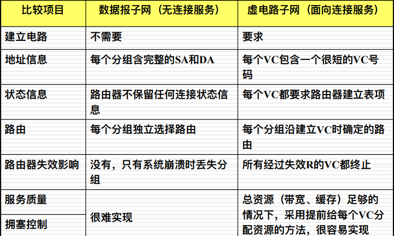

### 路由选择协议概述

**路由表的建立**

静态路由

- 由管理员⼿⼯配置的：ip route

动态路由

路由选择算法

- 距离⽮量路由选择（D-V）
- 链路状态路由选择（L-S）

**选择路由算法的度量参数**

- 路径⻓度：由⽹络管理员定义每条⽹络链路的代价(cost)，从源到宿的代价总和为路径⻓度，**hop (跳数)**
- 可靠性：链路数据传输的可靠性（误码率）
- 延迟：数据包从源到宿需要花费的传输时间
- **带宽**：链路的最⼤传输能⼒以及⽹络流量
- 负载 ：⽹络资源（例如路由器的CPU）的使⽤率
- 通信代价：占⽤通信线路的费⽤

**最优化原理（ Optimization principle** 

- 如果⼀个路由器 **J 处在路由器I到路由器K的最优路径上**，那么，从路由器J到路由器K的最优路径也在同样的这条路径上。

- 沉落树（ sink tree ）：从所有的源到⼀个给定的⽬的的最优路径形成的⼀棵树，**树根是⽬的**。

**沉落树/汇集树（Sink tree）**

- 汇集树不必是唯⼀的。
- 所有**路由算法的目的**就是：为所有的路由器发现和使⽤汇集树。
- 最短路径路由选择
  Dijkstra 算法（1959）：使⽤权重（P282）计算通信线路中的最短（优，代价最⼩）路径。

#### **扩散/泛洪法（Flooding)** 

- 每个到达分组都被从除了到达端⼝外的所有其它端⼝转发出去(不计算路径，有路就⾛)
- 例如，从节点5 到节点 4：packet from 5→1,2；2→3,6；3→6,4；6→3,7；7→4
- 问题：**重复分组**，例如 3，6

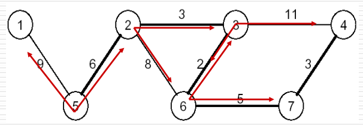

**解决办法：**

- 在分组头增加⼀个**计数器（counter）**，每经过⼀个节点，计算器减 1 ，当计数器变为零时，报⽂被丢弃。

- 每个节点设⽴⼀个**登记表**，当分组第⼆次到达时，被丢弃。

- **选择性扩散**

缺点：重复分组太多，浪费带宽
优点：可靠性⾼、路径最短/优，常⽤于军事

## DV算法（RIP）

- 距离矢量路由选择：每个路由器维护一张表，**表中列出了当前已知的到每个目标的最佳距离**，以及为了到达那个目标，应该从哪个目**标转发的线路（端口）**

- D-V 算法是动态的和分布式的，它常被用于小型网络，RIP是一个典型的 DV
  - RIP：Routing information protocol，路由选择信息协议，1988，RFC1058

### **DV的工作原理**

- 每个路由器（节点）**维护**两个向量， **Di 和 Si** ，分别表示从该路由器到所有其它路由器的**距离**及相应的**下一跳（next hop）**
- 在邻居路由器之间**交换**路由信息（矢量）
- 每个路由器（节点）根据收到的矢量信息，**更新**自己的路由表

>di1：从节点i到节点1的度量（代价）
>Si1 ：沿着从节点i到节点1的最优路径上的下一跳
>n ：网络中的节点数

**更新路由表**

当邻居间交换了矢量信息之后：

更新距离： dij= Min[dix+ dxj] ( x ∈A )

- A—节点i的邻居集合

  - dij—从节点 i 到节点 j 的最短距离

  - dix—从节点 i 到节点 x 的最短距离

  - dxj—从节点 x 到节点 j 的最短距离

- 更新下一跳： Sij= x

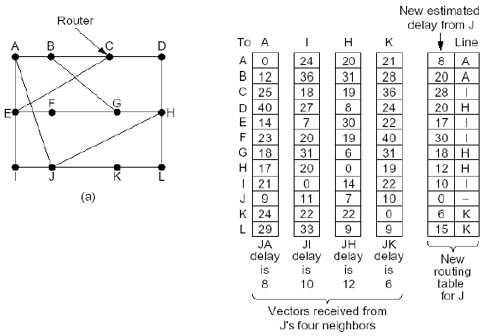

**D-V算法的特点**

优点

- 简单

缺点

- 交换的信息太大了
- 路由信息传播慢，可能导致路径信息不一致
- 收敛慢，度量计数到无穷
- 不适合大型的网络

**RIP的主要特点**

- RIP 是一种典型的 D-V 路由选择协议
- RIP 采用了**跳数（hop）**作为量度（ metric）
- 当量度超过 15 跳，目的被认为不可达
- 默认地，每30秒钟交换一次矢量/向量信息（全部路由表）

### RIP的工作原理

**RIP的主要缺陷** 

- 不能到达量度超过15跳的目标网络
- RIP的度量（代价）是跳数，即沿途经过的路由器的个数，有时候，并不合理，不能真正反映网络的状况
- 实际运行中，会遇到度量计数到无穷、收敛慢等问题

### **DV路由的问题**

问题表现

- 路由环路（ routing loop）
- 计数到无穷问题（ Count to infinite）
- 收敛慢的问题（ slow Convergence ）

原因

- 相信错误的路由信息导致

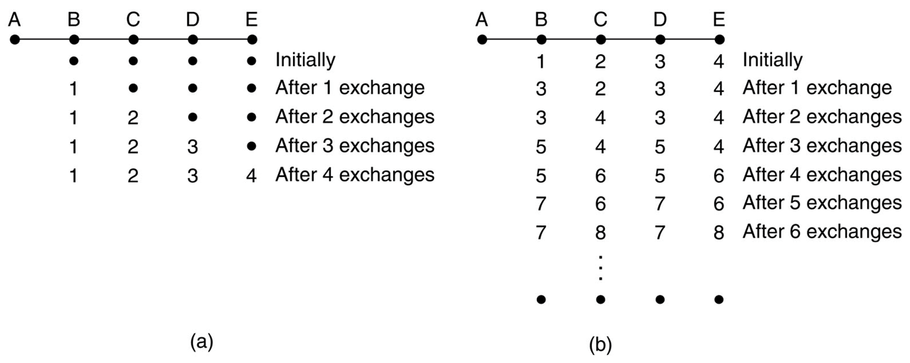

>好消息跑得快，坏消息传得慢

错误路由消息的传播

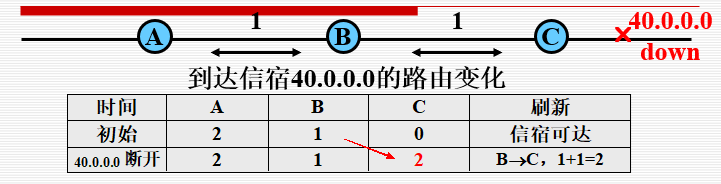

>B向C传播了一条过时的错误信息

路由环并计数到无穷

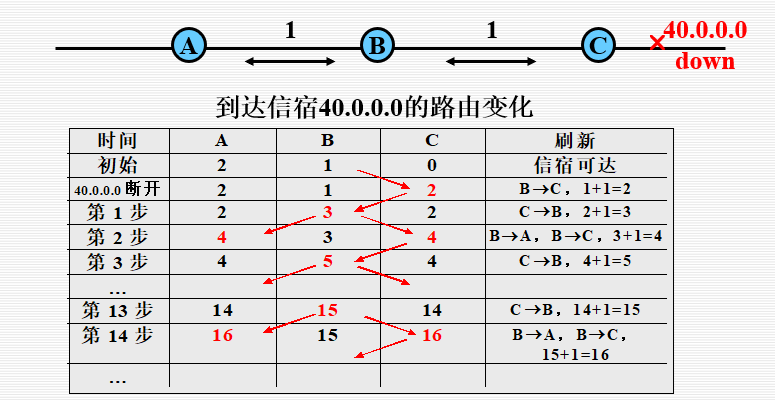

>这条错误的路由信息在C与B之间不断复制和修改，并在网络中传播（殃及A），形成路径传播的环路。

### **解决办法** 

- 定义路径度量（代价）的最大值

  

  >到达信宿40.0.0.0的路由变化（定义Hop最大值为16）

- 提高收敛速度

  - 水平分割（ Split Horizon）

    - 分析路径环产生的原因

      B向C提供了一条过时的、错误的路由信息。

    - 能否避免事件发生？

      B必须经由C方可到达网络40.0.0.0，B不可能向C提供任何有价值的路由信息。

      修改B对C提供的路由，禁止B向C提供关于此信宿的路由信息。

    - 解决办法

      B告诉C一条在正常情况下不真实的消息：网络40.0.0.0不可达（距离为无穷）。

      

  - 毒性逆转（Poison Reverse）

    - 方法

      当C发现网络40.0.0.0发生故障时，主动将到达信宿的距离改为无穷。

    - 结果

      如果无其他到达信宿的路径，算法迅速收敛为信宿不可达。

      如果存在其他到达信宿的路径，C根据传播过来的信息再做修改。

      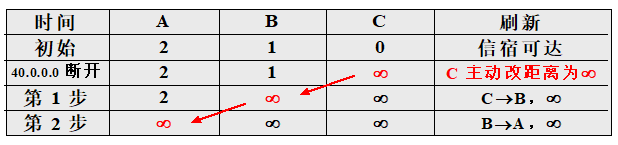

  - 抑制定时器（ Hold-Down Timers）

    - 当C发现网络40.0.0.0发生故障时，启动抑制计时器

    - 在抑制计时期间内，C的策略

      如果网络状态转变，down -> up，关闭计时器，保留原有路由信息；

      如果收到来自B的关于信宿的路由信息，且路径比原有路径短，则关闭计时器，更新路由信息；

      如果无上述两种情况发生，计时器到时，更新路由为信宿不可达。

      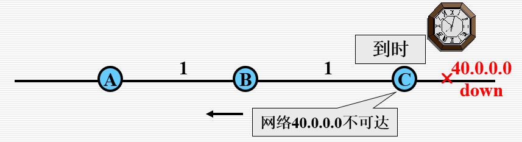

  - 触发更新（Triggered Updates ）

    - 当C发现网络40.0.0.0发生故障时，不等下一刷新周期到来，立刻更改路由为“信宿不可达”

    - 引起全网的连锁反映，迅速刷新

      

## LS算法（OSPF）

### 链路状态路由Link State

链路状态路由的主要思想包括如下5个部分：

- **发现它的邻居节点**们，了解它们的网络地址
- **设置**到它的每个邻居的成本度量
- **构造一个分组**，包含它所了解到的所有信息
- **发送这个分组**给所有其他的路由器
- **计算**到每个路由器的最短路径

#### 发现邻居节点

- 当一个路由器启动的时候，在每个点到点的线路发送一个特别的**HELLO分组**

- 收到HELLO分组的路由器应该**回送一个应答**，应答中有它自己的名字 （采用一个全球唯一的名字 globally unique name）

- 当两个或更多的路由器被一个LAN连接起来，这个LAN被看作一个节点

  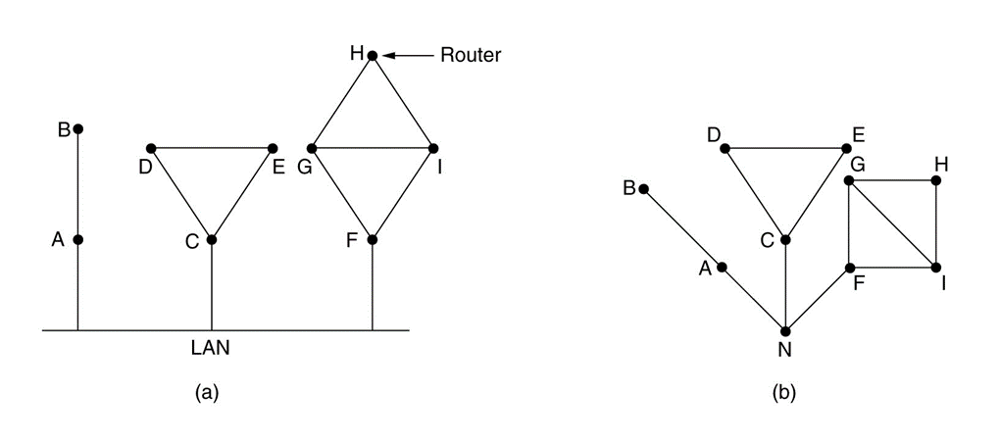

#### 设置链路成本 

- 为了决定线路的开销，路由器发送一个特别的 ECHO 分组，**另一端立刻回送一个应答**	
- 通过测量往返时间（round-trip time） ，发送路由器可以获得一个合理的延迟估计值
  - 为了得到更好的结果，可多次测量，取均值

- 一种常用的选择
  - 与链路带宽成反比

#### 构造链路状态分组

- 链路状态分组构造后被发送给其他的路由器，分组中包含这些信息：

  - 发送方的标识（ID of the sender）

  - 序列号（sequence number ）

  - 年龄（age ）

  - 邻居列表（list of neighbors ）

  - 到邻居的成本/量度（delay to each neighbor ）

- 应该什么时候构造分组?

  周期性地构造和发送，或者有特别的事件发生时构造，比如某条线路或邻居down掉了

  

#### 发布链路状态分组

基本算法：

- 每个分组都包含一个**序列号**，序列号随着新分组产生而递增

- 路由器记录下他看见的所有 (**源路由器，序列号**)对 

- 当一个的新的分组到达时，路由器根据它的记录：

  - 如果该分组是新的，就被从除了来线路外的所有其他线路转发出去 ( **flooding，泛洪**)

  - 如果是重复分组，即被**丢弃(喜新厌旧)**

  - 如果该分组的序列号比对应的源路由器发送的**到过此地的分组的最大序列号还小**，则该分组被当作过时的信息而被拒绝

一些改进让基本算法更加健壮：

- 当一个链路状态分组到达某个路由器时，它首先被放到一个**保留区**中等待一段时间

- 如果来自相同路由器的另一个分组到达了，这两个分组的序列号会被比较：

  - **如果相等，是重复分组，丢弃**

  - **如果不相等，旧的那个被丢弃**

- 为了防止路由器到路由器的线路发生错误，所有的链路状态分组**都要被确认**

- 当一条线路空闲的时候，路由器扫描保留区，以便选择一个分组或确认，并将其发送出去

  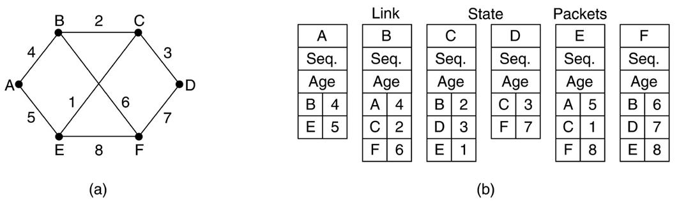

  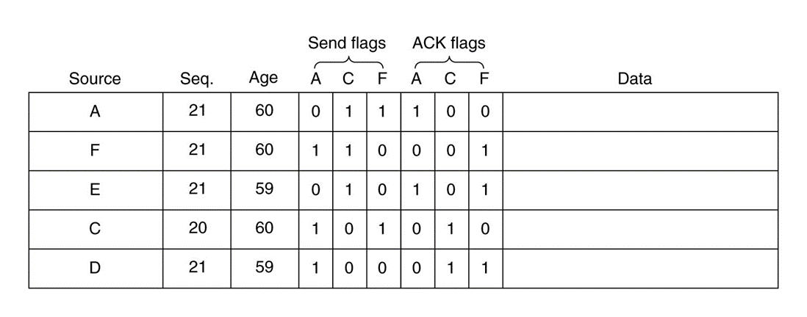

#### 计算新的路由路径

- 一旦一个路由器获得了全部的链路状态分组就可以构造出**全网络图**来了（Graph）
- 现在，可以使用 最短路径算法来计算路由器之间的最短路径了
- 计算结果一棵树，会形成相应的路由，安装在路由表中，引导数据分组的转发

### L-S 路由算法的特点

- 优点

  - 每个路由器的认识一致

  - 收敛快

  - 适合在大型网络里使用

- 缺点

  - 每个路由器需要较大的存储空间

  - 计算负担很大

### OSPFP

- 开放的路径优先（Open shortest path first）

- 使用图（graph）来表述真实的网络

  - 每个路由器/Lan都是一个节点

  - 测量代价/量度（metric）

- 计算最短路径

  

#### **OSFP概述**

- OSPF是一种基于开放标准的链路状态路由协议，是目前IGP中应用最广、性能最优的一个协议 
- OSPF可以在大型网络中使用
- 无路由自环 
- OSPF支持VLSM
- 使用带宽作为度量值（108/BW）
- 收敛速度快
- 通过分区实现高效的网络管理

- LSDB非常庞大，占用大量存储空间

- 计算最小生成树耗时增加，CPU负担很重

  - 一点变化都会引发从头重新计算

- 网络拓扑结构经常发生变化，网络经常处于“动荡”之中

  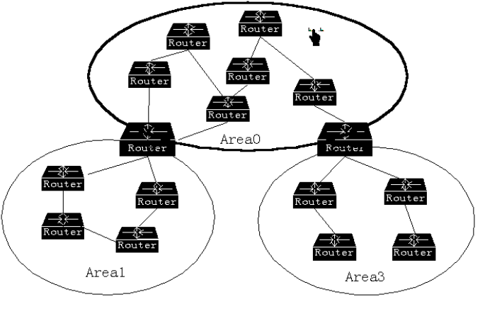

  > **OSPF划分区域，分而治之**

  - ABR只转发主要路由信息

  - 更改，不需要重新计算，只需相应增删

  - ABR采用**聚合路由策略**，弱化拓扑变化带来的影响，如：

    - 10.1.0.0

    - 10.2.0.0

    - 10.3.0.0。。。。。。

    - 聚合为10.0.0.0/8

  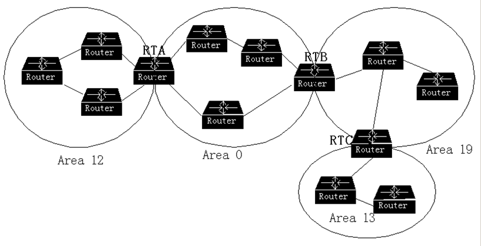

  >虚连接避免路由环路

**单区域OSPF**

- RouterID：一个32位的无符号整数，是一台路由器的唯一标识，在整个自治系统内唯一

- 协议号：IP头中代表OSPF报文的协议号是89

  

- TTL=1：通常OSPF报文不转发，只被传递一条，即在IP报头的TTL值被设为1，但虚联接除外

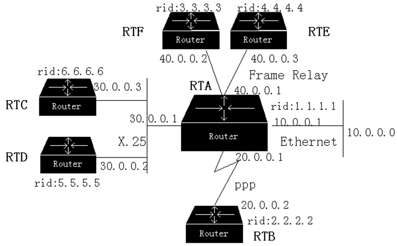

#### **OSPF消息(packet)类型** 

| OSPF数据包类型               | 描述                                           |
| ---------------------------- | ---------------------------------------------- |
| Type  1－Hello               | 与邻居建立和维护毗邻关系。                     |
| Type  2－数据库描述包（DD）  | 描述一个OSPF路由器的链路状态数据库内容。       |
| Type  3－链路状态请求（LSR） | 请求相邻路由器发送其链路状态数据库中的具体条目 |
| Type  4－链路状态更新（LSU） | 向邻居路由器发送链路状态通告                   |
| Type  5－链路状态确认（LSA） | 确认收到了邻居路由器的LSU                      |

**OSPF的运行步骤**

- 建立路由器毗邻关系

  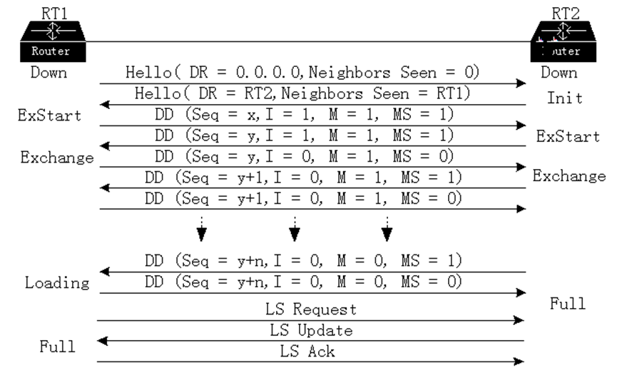

- 选举DR和BDR

- 发现路由

- 选择最佳路由

- 维护路由信息

#### **OSPF 状态**

- Down
- Init（初始）
- Two-way（双向）
- ExStart（准启动）
- Exchange（交换）
- Loading（加载）
- Full adjacency（全毗邻） 

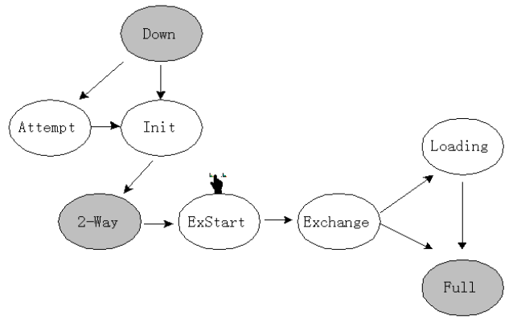

#### DR选举

**为什么要选举DR和BDR？**

> DR：指定路由器
>
> BDR：备份指定路由器

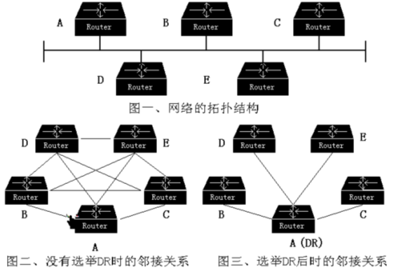

**DR选举中的指导思想**

- 选举制
  - DR是路由器选出来的，而非人工指定的
- 终身制
  - DR一旦当选，除非路由器故障，否则不会更换
- 世袭制
  - DR选出的同时，也选出BDR，DR故障后，由BDR接替DR成为新的DR

**DR带来的变化**

- 同步的次数减少了**（O（n））**，减少了带宽的利用
- 路由器的角色：DR、BDR、DROther
- 路由器间的关系：Unknown、Neighbor、Adjacent

**选择最佳路由**

- SPF算法（Dijkstra算法）
- 负载均衡

**为什么说OSPF克服了了路由自环？**

- 每一条LSA都标记了生成者（用生成该LSA的路由器的RouterID标记），其他路由器只负责传输，这样不会在传输的过程中发生对该信息的改变和错误理解。
- 路由计算的算法是SPF，计算的结果是一棵树，路由是树上的叶子节点，从根节点到叶子节点是单向不可回复的路径。
- 区域之间通过规定骨干区域避免

**OSFP路由器种类**

- 内部路由器  --- 路由器所有接口都在一个区
- 主干路由器 ---  所有接口都在主干区域的路由器
- 区域边界路由器(ABR) ---路由器接口分属不同区域
- 自治域边界路由器 (ASBR) --- 路由器至少有一个接口不属于本自治域/OSPF. 

### **比较 DV 和 LS**

| 距离矢量路由               | 链路状态路由               |
| -------------------------- | -------------------------- |
| 从邻居看网络               | 整个网络的拓扑             |
| 在路由器间累加距离         | 计算最短路径               |
| 频繁、周期更新：慢收敛     | 事件触发更新：快收敛       |
| 在路由器间传递路由表的拷贝 | 在路由器间传递链路状态更新 |

### BGP

>BGP（border gateway protocol）（边界网关协议）
>
>不同的协议 - BGP (Border Gateway Protocol)运行在AS之间

- 外部网关路由器的典型路由策略涉及政治 political, 安全security, 或经济方面 economic 的考虑

- 根据BGP对于中转流量的兴趣，网络被分成三类：

  - stub 自治系统

  - 多连接自治系统

  - 穿越自治系统

- BGP 路由器对之间通过TCP连接来相互通信
- 从根本上来说，BGP 是一个**DV路由协议**，但是它又不同于一般的DV协议，比如 RIP
  - **BGP 路由器记录下全路径信息**，而不仅仅是路径代价（ keeps track of the exact path）

## 其他路由算法

- 分级/层次路由（Hierarchical routing）

  

  > 减少路由表规模

- 广播路由（Broadcast routing）

  - 可能的应用： 

    天气预报发布、股票行情更新、现场直播节目等 

  - 广播路由实现的5种可能的方法：

    - **给每个目标单播**每一个分组

    - 扩散法（Flooding）

    - 使用**多目标路由**（ multi-destination routing）

    - 使用**汇集树/生成树**（sink tree / spanning tree) 来引导分发分组

    - 使用**逆向路径**转发来控制扩散（flood）

      基本思想：当一个广播分组到达某个路由器的时候，如果它是从该路由器到广播源的通常线路上到达的，那么它被分发到所有的出口（**除了来的那个口**），否则被丢弃。

- 组播路由（Multicast routing）

  - IP支持组播，使用 D 类地址

  - 每个 D 类地址标识了一组主机

    - 可以有 28 地址用来表示组，所有 228个组(224~239)

  - IP组播的重要组成：

    - 成员管理 (IGMP/MLD)

    - 组播路由表 (DM/SM)

  - IP组播必须要有特别的组播路由器的参与才能实现

    - 应用层组播（Application-layer multicast） 

- 选播/任播路由（Anycast routing）

  - 目的是一组节点，只需要发送到最近的那个。

  - 典型应用：DNS

    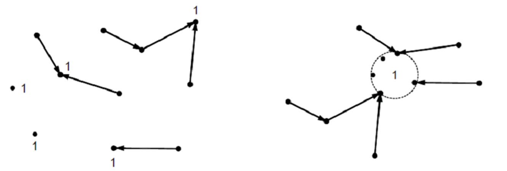

-  移动主机的路由（Mobile routing）

  >移动主机包括两类：
  >迁移主机（ migratory host） ，从一个地方移动到另一个地方，但是物理连上网络才能上网（如笔记本电脑）
  >漫游主机（roaming hosts ）在移动中计算，当他们移动的时候，仍然保持与网络的连接

  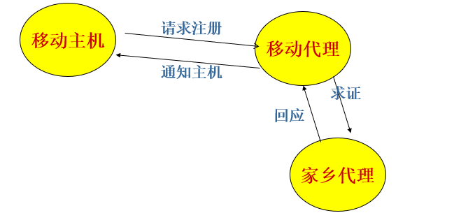

  - 每个外部代理（foreign agent）周期性地广播一个分组，宣布它的存在和地址
  - 移动主机（mobile host）向外部代理请求注册，提供它的主/家乡地址，当前的数据链路层地址，以及一些安全信息
  - 外部代理（foreign agent） 与移动主机的本地/家乡代理联系，告诉它，你的一个主机正在这里
  - 家乡代理（home agent）检查外部代理提供的主机安全信息，如果一切都正确，则通知外部代理可以继续
  - 当外部代理得到家乡代理的确认，它在本地表上增加一个表项，并通知移动主机，注册完成（registered）
  - 当一个移动主机离开区域时，它应该宣布它的离开（ de-registrate ）

-  移动自组网路由（Ad hoc routing） 

  > Ad hoc网络 (or MANETs, Mobile Ad hoc NETworks) 中，主机和路由器都在移动
  > 在 ad hoc 网络中，拓扑一直在改变，它的路由和固定网络中的路由截然不同

-  对等网络节点查询（P2P）

  - 对等网络

  - P2P网依赖于参与者的计算能力和带宽，而不是将控制力集中在少数的几个服务器

  - P2P网络是分布式的，所有的节点都是对称的，没有中心控制，也没有层次组织

  - 其应用完全不同于C/S和B/S

  - 所有的参与节点都提供资源，包括带宽、存储空间和计算能力
  - P2P网络的分布特性增加了健壮性（robustness）

## 拥塞控制

什么是拥塞? 

>当一个子网或子网的一部分出现太多分组的时候，网络的性能急剧下降，这就是拥塞（ Congestion ）

**导致拥塞的因素**

- 输入流量速度大于输出线路的容量
- 慢速的处理器也可能引起拥塞，如线路容量充足，但处理器来不及处理
- 线路容量和处理器能力需要平衡

**拥塞控制和流控** 

- 拥塞控制（Congestion control）

  - 任务：确保子网能够承载所到达的流量

  - 这是个全局的问题，涉及到主机、路由器，存储转发的过程等方方面面的问题

- 流控（Flow control）

  - 只与特定的发送方和接收方之间的点到点流量有关

  - 确保一个快速的发送方不会持续地以超过接受方接收能力的速率传输数据

### 拥塞控制方法

- 拥塞根源：负载  > 资源

- 增加资源

  - 在某些点之间使用**更多的通道增加带宽**（比如：广深）

  - 把流量**分散到多条路径**

  - 启用**空闲或备份**的路由器

- 降低负载

  - **拒绝为某些用户**提供服务（比如：春节车票提价，限行）

  - 给某些用户的**服务降低等级**（比如：黄金周旅游）

  - 让用户更有**预见性地安排**他们的需求（比如：年假制）

### **流量整形**

- 调节数据传输的平均速率（和突发数据流）

- 算法

  - #### 漏桶（leaky bucket）

    

    - 算法描述

      - 每个主机连接到网络的接口中都有一个**漏桶，即一个优先长度的内部队列**

      - 当桶中有分组的时候，输出速率是恒定的，当桶空的时候，输出速率是0

      - 当一个分组到达满的桶的时候，分组将被丢弃（满则溢）

      - 每个时钟嘀嗒( **tick** )，仅允许一个分组或固定数量的分组发送出去

        >数据产生速率：25MBps
        >路由器的工作速率：2MBps
        >数据突发时间持续：40ms
        >漏桶输出速率： 2MBps
        >漏桶容量：1MB

        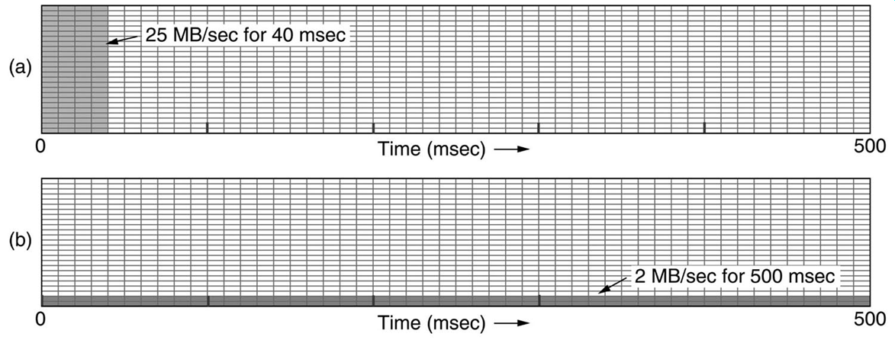

    - 算法效果

      - 主机内用户进程产生的分组流往往是一个**不稳定的流**，漏桶可以让**它输出到网络时变成一个稳定流**，抹平了突发尖峰，极大地减少了发生拥塞的机会

    - 漏桶的缺点

      - 当漏桶满了之后，数据将被丢弃
      - 不能大量地突发数据
      - 改进：令牌桶

  - #### 令牌桶（token bucket）

    

    > https://zhangjun075.github.io/learning/limiting/

    - **当大量数据突发的时候，令牌桶**算法允许输出加快到某种程度

    - 令牌桶**拥有令牌（tokens）**，且以每△T秒产生一个令牌的速度往桶中输入令牌

    - 一个分组要发送的时候，它必要从桶中**取出和获取**到一个令牌

    - 令牌桶算法**允许累积令牌**，但最多可以累积n（令牌桶的容量）个令牌

    - > 计算最大突发时间
      > 突发时间： S 秒
      > 令牌桶容量： B字节
      > 令牌到达的速率： R 字节/秒
      > 最大输出速率： M 字节/秒

      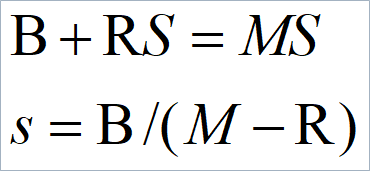

    - 和漏桶算法相比：

      - 令牌桶允许突发，但是最大突发受制于令牌桶容量的限制

      - 当桶满的时候，令牌桶算法**丢掉的是令牌（不是分组）**

  - 其它：资源预留、准入控制、分组调度等

### **网络互联**

网络可以通过不同的设备联接起来：

- 物理层 - repeaters or hubs
- 数据链路层 - bridges and switches
  - 可能作小小的协议转换，如从Ethernet 到 FDDI 或到 802.11
- 网络层 – routers
  - 多协议路由器
- 传输层 - transport gateways
  - 传输层连接之间的接口，如允许TCP连接和SNA连接粘结起来，分组可畅通无阻
- 应用层 - application gateways
  - 翻译消息语义，如不同的email格式转换

>IP是现代网络的基础

**隧道技术**

隧道（Tunneling） --一种通用的特殊的网络互连方式

- 源和目的都处于同种网络，但是中途经过不同类型的网络

- 中间的WAN部分可被看成一个大的隧道，从一个多协议路由器延伸到另一个多协议路由器

#### 互联网路由

- 互联网路由类似于单个子网内部的路由，但是，前者比后者更加复杂一些

- 两级路由算法

  - 每个网络内部采用内部网关协议（IGP， interior gateway protocol ）

  - 网络之间使用外部网关协议（BGP， exterior gateway protocol ）

  - 互联网上的每个网络都是独立于所有其他的网络，所以每个网络通常称作一个自治系统（ Autonomous System ，AS）

- 互联网路由和网络内部路由的差别是：

  - 互联网路由可能需要跨越国际边界，不同的法律可能会介入进来

#### 分段

分段（Fragmentation）是将一个分组切分成几个小的分组，已通过网络

- 透明分段
  - 分段行为对其他网络来说是不可见的，换句话说，在该网络分段的分组，在离开这个网络的时候需要将它重组恢复
  - 遇到的问题
    - 出口的网关必须知道什么时候它收到了全部的分片
    - 所有的分组都必须从同一个网关离开
    - 进行分段和重组需要消耗资源，如果不断通过一系列的 “小”网络，开销会很巨大
- 非透明分段
  - 每个网络遇到不能承载的分组即对其进行分段，不负责重组恢复，**目的机**收到分割后的分组，完成重组恢复
  - 遇到的问题
    - 要求每个主机有重组功能
    - 总开销增大，因为分片都需要头部信息

**分段编号的方法**

- 定义一个足够小的基本分片长度值，以便基本的分片能通过每一个网络（IPv6是这样做的，发前试探）

- 当原始分组被分割的时候，所有的分片的长度等于基本长度值，只除了最后一个分片（更短）

- 一个互联网分组可能包含多个分片，所以，在分片的头部必须提供这些信息：

  - 初始的分组号

  - 第一个基本分片的编号

  - 一个位（bit），表明该分片是否是原始分组分割后的最后一个分片

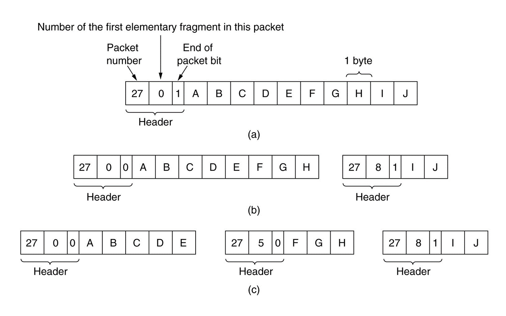

## IP协议

**互联网和网络层**

- 在网络层上，可将整个互联网看作一组互联的子网络和自治系统
- 将整个互联网粘合起来的正是网络层协议：IP (Internet Protocol).
- IP的任务是提供一种尽力传送（ Best-Efforts ）的方法，将数据报从源传送到目的

> IP的胶水/粘合作用

**MAC寻址和IP寻址**

- 适用的网络范围不同，MAC寻址只适合于小型网络；
- 所依赖的地址结构不同，MAC是平面地址，IP是结构化、层次化地址，其本身携带了位置信息；
- 所处的OSI模型层数不同；
- 地址数目的限制，IP地址正在耗尽，而MAC地址暂无耗尽的危险；
- 两种地址的格式不一样。

### 路由器的主要功能

- 路由器处理接到一个分组后：

  - 打开分组（de-encapsulation）

  - 确定目标网络，查找路由表

  - 重新封装，转发

- 主要功能

  - Routing

  - Forward

  - other

**路由表**

- 主要包括 网络地址network address, 接口interface, 代价metric (f.g. hop),子网掩码subnet mask, 网关gateway, 等等。
- 除了路由表，路由器内部有一张**ARP表**
  - 所有子网设备的IP-MAC映射（包括网关）
- 路由表可能因厂家的不同而不同

### IP协议

>IP 旨在提供一种尽力而为（即不保证）将数据报（数据包）从源传输到目标的方式

#### IP分组格式

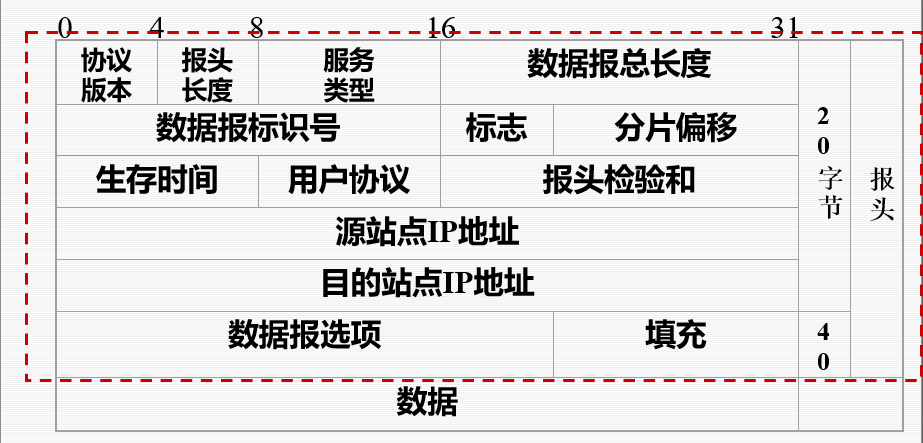

- 协议版本

  - 4 bits.

  - 标明IP协议的版本号

    - IPv4 : 0100

    - IPv6 : 0110 

- 报头长度
  - 4 bits.
  - IP 头长度：以32bit为单位标明报文长度 (4 bytes)，可指向数据开始处

- 服务类型

  - 8 bits

  - TOS

    上层协议表明该分组的重要程度

    - Precedence.      

    - Reliability.      

    - ECN.

- 数据报总长度
  - 16 bits.
  - 指明整个数据分组的总长度，包括数据头和数据。单位“字节”

- 数据报标识号
  - 16 bits.
  - 标识当前数据报的序列号
  - 由发送者分配，以便接收方可以依据来做重组

- 标志
  - 3比特和13比特
  - 分组是否分片
  - 帮助收方重组

- 分片偏移

  - **数据封装提出的问题**

    - 数据报长度的限制

      - 硬件限制
        - 物理网络对帧的最大字节数限制，由硬件决定，称为最大传输单元（MTU）。

      - 软件限制： IPv4的最大值2^16

    - 如何选择数据报长度实现数据封装？

      - 数据报长度=网络中最小的MTU
        - 在MTU较大的网络传输会造成硬件能力浪费

      - 数据报长度=网络中最大的MTU
        - 在MTU较小的网络不能实现数据报到帧的封装

  - **适应不同MTU的解决方案**

    - 数据报长度的定义原则

      - 与硬件无关

      - 以“方便”为原则

        - 以不超过IP版本规定的数据报总长度为前提

        - 取信源机所在物理网络的MTU为数据报长度

    - 定义分片机制

      - ​	在数据报长度大于网络MTU的情况下，将其分成若干较小的部分传输，每部分为“片”。

      

  - **片的重组**

    - 重组只在信宿机完成

      - 减轻网关（gateway）负担，简化路由协议

      - 简单、高效，体现“尽力传递”设计思想

    - 在接收端设置重组计时器

      - 接收到数据报的第一片时立即启动计时；

      - 如果在规定时间内未收到全部分片，则放弃整个数据报，向信源机发送出错信息。

- 生存时间

  - 8 bits.

  - Time-to-Live(TTL)维护一个计数器，递减为零时，数据报被丢弃，防止分组在网络中无限循环

- 用户协议
  - 8 bits.
  - 用来指定传输层协议.17(UDP) or 6(TCP)

- 报头校验和
  - 16 bits.
  - 针对头部计算校验和，验证分组头部的正确性

- IP地址
  - 源和目的地址都是32位（IPv4）

- 数据报选项
  - 可变长字段
  - 允许IP支持多种选项

- 填充
  - 确保IP头是32位的整数

#### IP地址和它的分类

IP地址：网络号和主机号

- 唯一的

- 每个主机至少有一个

IP地址的二进制表示32bit

- 缺点：难于记忆

- IPv4地址的点分十进制表示

  - 表示方法：

    - 32位被分成了4个 8位组

    -  每个8位组之间用“.”分隔

    - 每个8位组转换成十进制数，从0到255

IP地址的层次结构

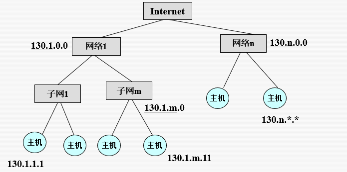

**IP地址的分离**

- A类地址

  - 前1字节标识网络地址部分，后3字节标识主机地址部分

  - 每个网络最多可容纳 （2^24  -2）台主机

  - 第1字节用十进制表示的取值范围为“0－127”

  - 具有A类地址特征的网络总数为2^7个

- B类地址

  - 前2字节标识网络地址部分，后2字节标识主机地址部分

  - 每个网络最多可容纳 （2^16-2）台主机

  - 第1字节用十进制表示的取值范围为“128－191”

  - 具有B类地址特征的网络总数为 2^14 个

- C类地址

  - 前3字节标识网络地址部分，后1字节标识主机地址部分

  - 每个网络最多可容纳（2^8-2）台主机

  - 第1字节用十进制表示的取值范围为“192－223”

  - 具有C类地址特征的网络总数为 2^21 个

### 保留的IPv4地址空间

保留的地址空间：

- D类（224.0.0.0~239.0.0.0）和E类（240.0.0.0~254.0.0.0）
- 网络地址：主机部分全为“0”的 IP 地址；
- 广播地址：主机部分全为“1”的 IP 地址。

**特殊的IP地址**

- 32位全为0，0.0.0.0  （P346）

  - 这个主机、这个网络
  - Cisco路由器指定的默认路由

- 32位全为1，255.255.255.255  Flood Broadcast

  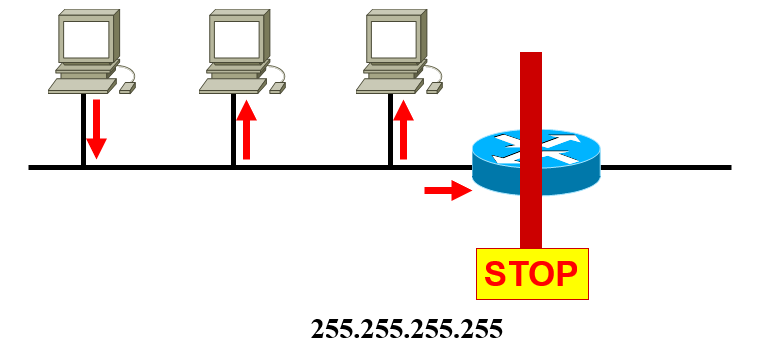

- 主机部分全为0，如172.16.0.0  网络地址

- 主机部分全为1，如172.16.255.255  Direct Broadcast

  

- 127.0.0.0  Lookback Network

- 127.0.0.1 Lookback test

- 169.254.x.x，非正常地址

**共有地址和私人地址**

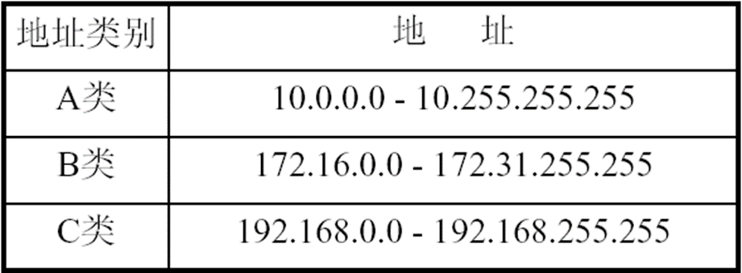

> A: 10.0.0.0- 10.0.255.255（1个A）
> B: 172.16.0.0-172.31.255.255（16个B）, 
> C: 192.168.0.0- 192.168.255.255（256个C） 

### 子网和子网规划

**子网**

- 局域网不断增长，越来越难于管理，必须将它分割成子网
- 一个网络被分隔成几个部分（子网），但是在外界看来，**该网络仍被看成一个整体** (体现在路由表例上，就是外部的路由器只对应一条路由）
- 这也允许**不同的子网在一个组织内部**连接起来

#### **子网掩码**

- 路由器使用**子网掩码决定分组**往哪个子网转发
- 子网掩码可用**点分十进制**表示（1表示网络位，0表示主机位），也可用“/网络位数+子网位数”表示
  - 255.255.255.224
  - 202.10.23.102/27
- 路由器采用**“AND ”操作（目的IP和子网掩码）**，得到目的网络地址
- 使用这种机制，路由器不必记录全部主机的IP地址，缩减了路由器的规模

> 缺省的子网掩码
> A：255.0.0.0  （8位网络位）
> B：255.255.0.0 （16位网络位）
> C：255.255.255.0 （24位网络位）

**网络地址、广播地址和主机地址**

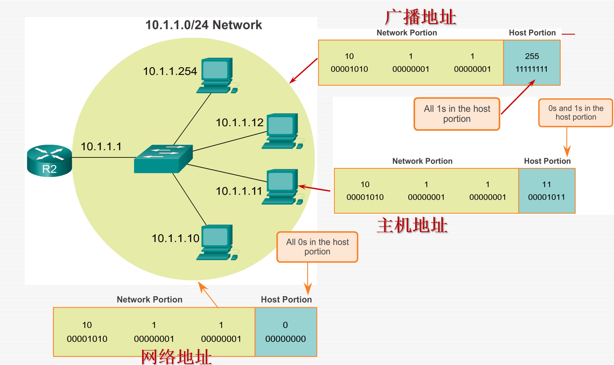

#### **子网规划**

>划分子网实际上建立了一个由网络、子网和主机构成的三级层次结构，从而降低了路由器的表空间

- 构建子网是通过从网络地址的主机部分借位来进行

- 子网规划将导致IP地址空间的损失

  - 例：一个C类IP地址202.38.197.0，没有划分子网的情况下，可以有256个IP地址，其中254个可用的IP.

  - 如果借2位主机位创建子网，可以有4个子网，但只有两个可用，每个子网可容纳64个IP，但只有62个可用，总可用IP数量为，2*62=124。

    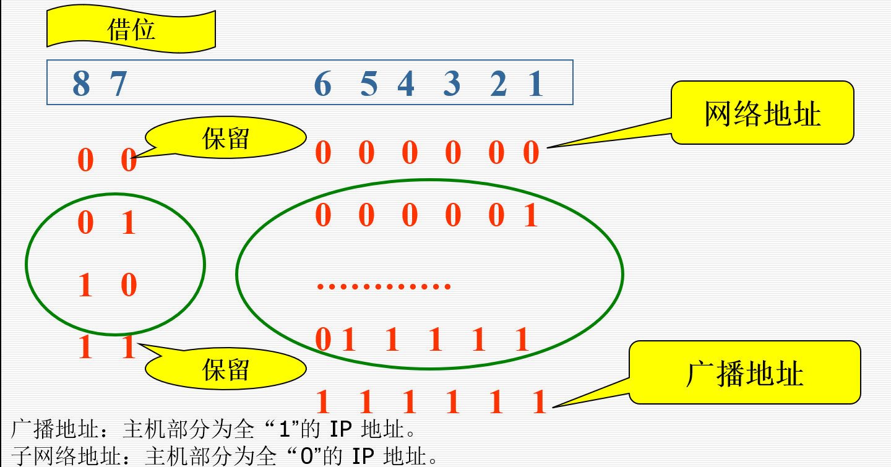

- 子网规划：将大网络分割成小网络

- 规划子网时需要考虑两个因素：

  - 所需的子网数量
  - 所需主机地址的数量
    - 确定可用主机数量的公式 2n-2
      - 2^n  (其中n为剩余的主机位的数量) 用于计算主机数量
      - -2  在每个子网中不能使用子网ID和广播地址 

- 借位原则

  - 从主机域的高位开始借位；

  - 至少借 2 位；

  - 主机域至少保留 2 位。

#### **可变长子网掩码 (VLSM)**

- 传统子网划分——为每个子网分配相同数量的地址。需要较少地址的子网中存在未使用（浪费）的地址。例如，链路只需要2个地址。

- **VLSM**允许将网络空间分为**大小不等的部分**。
- 子网掩码将依据为**特定子网**所借用的位数而**变化**。 
- 先**对网络划分**子网，然后再将**子网进一步划分**子网。
- 根据需要重复此过程，以创建**不同大小的子网**。

## IPv6协议

IPv4危机

**IPv6基本属于**

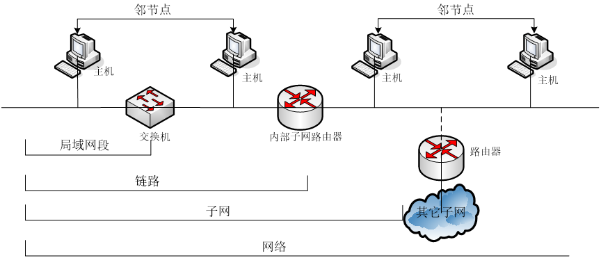

**IPv6地址表示**

v6地址与v4地址表示方法有所不同

- 点分十进制->冒分十六进制
- 用十六进制表示，如：　FE08:….
- 4位一组，中间用“:”隔开，如：　2001:12FC:….
- 若以零开头可以省略，全零的组可用“::”表示，如：　1:2::ACDR:….
- 地址前缀长度用“/xx”来表示，如：　1::1/64

>以下是同一个地址不同表示法的例子：
>0001:0123:0000:0000:0000:ABCD:0000:0001/96
>1:123:0:0:0:ABCD::1/96
>1:123::ABCD:0:1/96

**IPv6地址分类**

- 单播地址（Unicast Address）
  - 链路-本地（Link- Local） 
    - 用在单一链路上 
    - 带有链路-本地源或目的地址的数据包不转发到其它链路 
    - 如：FE80：：20C：76FF：FE0A：9A7C 
  - 站点-本地（Site- Local）  
    - 用于单一站点 
    - 带有站点-本地源或目的地址的数据包不转发到其它站点
    - 应用与RFC 1918 类似 
    - 如：FEC0：：20C：76FF：FE0A：9A7C 
  - 全球 （Global）  
    - 全球唯一地址
    - 带有全球地址的数据包可被转发到全球网络的任何部分
    - 如：3FFE：321F：0：CE：：1 
- 组播地址（Multicast Address）
- 任播地址（Anycast Address）
  - 用于标识一组网络接口
  - 目标地址为任播地址的数据报将发送给最近的一个接口
  - 适合于One to One-of-Many的通讯场合
- 特殊地址

IPv6地址子网规划

- IPv4 子网划分是管理地址稀缺性，
- IPv6 子网划分是根据路由器的数量及它们所支持的网络来构建寻址分层结构。 

**IPv6报头**

- IPv6基本头（固定头）

  - 修改的
    - Addresses increased 32 bits -> 128 bits
    - Time to Live -> Hop Limit（跳数限制）
    - Protocol -> Next Header
    - Type of Service -> Traffic Class（流量类别）

  - 删掉的
    - Fragmentation fields moved out of base header(主头部)
    - IP options moved out of base header
    - Header Checksum eliminated
    - Header Length field eliminated
    - Length field excludes IPv6 header

  - 增加的
    - Flow Label field added

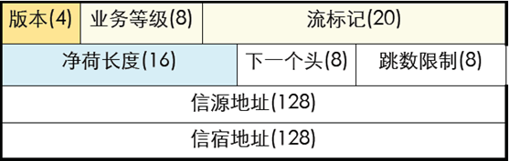

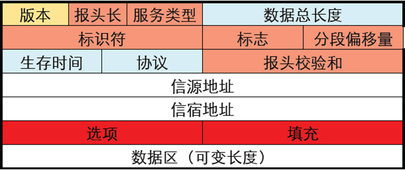

- IPv6扩展头

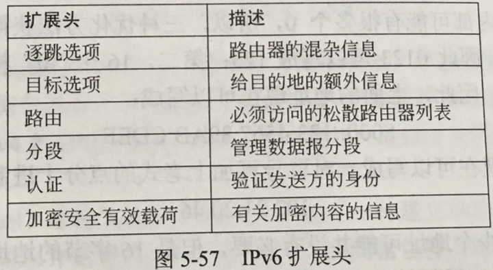

## 其他技术和协议

### CIDR

- Classless InterDomain Routing
- 缓解了地址枯竭的趋势；控制甚至缩减了路由表的开销
- CIDR的基本思想描述在 RFC 1519 中
  - 分配IP地址的时候不再以类别来分，而是按照可变长的地址块来分配
    - 如：某用户需要 2000 个地址

### CIDR路由

- 路由表必须扩展，增加一个 32-bit 的子网掩码

- 每个路由表有一个三元组 (IP address, subnet mask, outgoing line)

- 当一个分组到来到的时候

  -  分组中的目标IP地址（ Destination IP ）被检查

  - 目标IP和子网掩码进行与操作，获得目标网络地址，以查找路由表.

  - 如果路由表中有多个表项匹配 (这些表项有不同的子网掩码) ，使用子网掩码最长的那个表项

    >最长地址前缀：选择子网掩码长的匹配项

### 路由聚合

- 缩减路由表规模
- 隔离路由翻动

>怎样聚合呢？计算不变的位数！

### NAT/PAT

**NAT概述**

- NAT：net address translate NAT
  - 私有IP地址和公有IP地址之间的转换。
    - 内部网络使用私人地址，当内网需要和外网通信的时候，**私人地址转换成合法的global 的地址**
    - 由NAT**转换器（盒子）**完成这种转换；NAT转换器能够转换并且维护一个地址转换表，以便回来的分组找到它的去处
    - 当回来的分组到达NAT转换器的时候，它查找地址转换表（以源端口作索引），获得目标机的私人地址，并转换地之后发往目标机
- PAT：port address translate（超载）
  - 将多个私有IP地址影射到同一个公有IP地址的不同端口
- Private IP address：不可路由的地址、也可用于广域网链路上

**NAT带来的问题**

- NAT违背了IP的结构模型 –每个IP地址唯一地标识了一台机器
- NAT将互联网改变成了“面向连接”的网络，NAT转换器维护着连接的状态，一旦它崩溃，连接也没有了
- NAT违背了最基本的协议分层原则

**NAT/PAT小结**

- 优点
  - 节省了公有IP地址；
  - 提供了内部网访问外网的灵活性；
  - 有一定的保密性。
- 缺点 
  - 影响了部分协议和应用的通信；
  - 增加了网络延时；
  - NAT转换设备的性能可能成为网络的瓶颈；
  - 影响了路由追踪工具的使用。

### ICMP

> 用来报告意外的事件或测试互联网

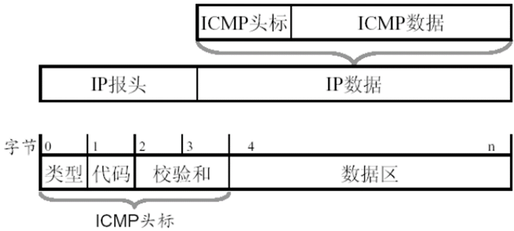

**应用 1：ping的工作原理**

- 使用ping命令（即调用ping过程）时，将向目的站点发送一个ICMP回声请求报文（包括一些任选的数据），
- 如目的站点接收到该报文，必须向源站点发回一个ICMP回声应答报文，源站点收到应答报文（且其中的任选数据与所发送的相同），则认为目的站点是可达的，否则为不可达。
  - 测试TCP/IP是否正常工作：ping 127.0.0.1
  - 网络设备是否正确：ping 本机IP地址
  - 检查对外连接的路由器：ping 默认网关IP
  - 检查与某台设备的畅通情况：ping IP
  - 检查DNS设置：如ping www.scut.edu.cn
  - 执行DNS反向查询，ping –a IP地址

**应用 2：tracert命令**

- tracert过程是通过ICMP数据报超时报文来得到一张途经的路由器列表

- 源主机向目的主机发一个IP报文，并置TTL为1，到达第一个路由器时，TTL减1，为0，则该路由器回发一个ICMP数据报超时报文，源主机取出路由器的IP地址即为途经的第一个路由端口地址

- 接着源主机再向目的主机发第二个IP报文，并置TTL为2，然后再发第三个、第四个IP数据报，……直至到达目的主机

  

**应用 3：PMTU**  

- 发数据包，分段标记DF=1，尝试1400，1200，900，直到到达目的机

- 结果：MTU=900

  

### 主要的地址解析协议

#### ARP 

（地址解析协议）

- Address Resolution Protocol

- IP 地址->MAC 地址

- ARP 的任务是找到一个给定IP地址所对应的MAC地址

- ARP的优化措施：

  - 缓存 ARP 结果
  - 在ARP请求中包括源机的 IP-to-MAC 地址的映射
  - 每台机器在启动的时候，广播它的IP-MAC地址对

- 免费ARP

  - 当一台主机启动时，发送要给一个免费ARP，（如果意外收到一个应答，即是IP地址发生了冲突）
  - 当一个接口（interface）的配置发生了改变，会发送一个免费ARP

- 代理ARP

  - 当源设备需要的目的地址与自己不在同一个网络时，如果源不知道目的MAC地址，它必须使用路由器的服务使它的数据达到目的，当路由器在这种方式下使用时，称为缺省网关。
  - 缺省网关是与源设备所处的网段相连的路由器接口上的IP地址

- ARP表

  - IP地址到MAC地址的映射表，储存在存储器（RAM）中，自动维护。（掉电消失）
  - 为了减少ARP请求的次数，每个设备拥有自己的ARP表，包括路由器。
  - 自动维护ARP表
    - 通过广播ARP请求中的源设备信息添加更新表；
    - 利用自己的ARP请求之应答信息来添加、更新表；
    - 删除超过一定时限的信息

- ARP欺骗

  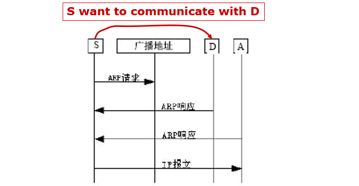

  - 静态ARP
  - 不马上写ARP缓存
  - 设置ARP服务器
  - 硬件屏蔽，如路由器采用静态ARP且作全权代理

#### RARP 

（逆向地址解析协议）

- Reserve Address Resolution Protocol

- MAC 地址->IP 地址 

### IP地址分配方式

- 静态分配
- 动态分配
  - 给定一个MAC地址，如何得到对应的IP地址?
    - RARP (Reverse Address Resolution Protocol) 用来获取本机MAC地址对应的IP地址
    - BOOTP （缺点：需要手工配置）
    - DHCP (Dynamic Host Configuration Protocol)
      - Dynamic Host Configure Protocol
        可以灵活分配IP地址，节约IP地址的使用
      - 使一台主机迅速并动态地获取一个IP地址
      - 通过DHCP获取的 IP是租来的，可能会过期
      - DHCP过程
        - 初始化状态
        - 选择状态
        - 请求状态
        - 绑定状态

# 传输层

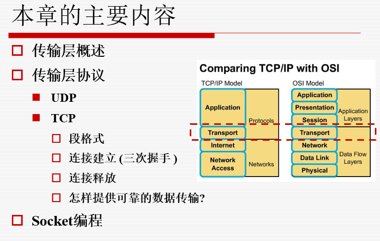

## 参考资料

[tcp三次握手和各个字段的含义](https://blog.csdn.net/weixin_48684274/article/details/108263608)

## 传输层概述

**传输层是整个协议栈**(TCP/IP)的核心

> 传输层的任务是提供**可靠的、高效的**数据传输

### **传输层的地位**

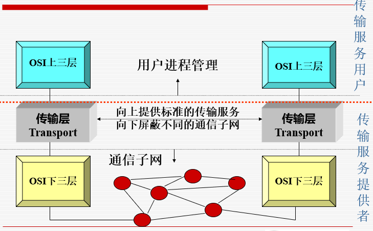

传输层在应用层和网络层之间提供了无缝接口
下四层被看作传输服务提供者，而上三层是传输服务使用者

**传输层的最终目标**是向它的用户（应用层）提供**高效、可靠和性价比高**的服务
完成这项工作的硬件或软件被称为**传输实体**（ transport entity）

**传输实体可能位于：**

- 操作系统内核
- 独立的用户进程中
- 绑定在网络应用中的链接库
- 网络接口卡

### **传输层服务**

有两种传输层服务：

- 面向连接的服务
- 无连接的服务Connectionless

这和网络层提供的服务相似，那为什么需要两个独立的不同的层？

- **网络层运行在由承运商操作的路由器上**，因此用户无法真正控制到网络层
- 把另一层放在网络层之上，可以让用户能够**控制到服务质量（some control）**.
- **传输层原语独立于网络层原语**，而网络层原语会因为网络的不同而不同

### **传输层提供的功能**

1. 端点标识

2. 传输服务

   **面向连接**		  L4与L2的比较
   端到端的连接管理

   - **建立连接**
   - **数据传输**
   - **释放连接**
   - 流控制
   - 差错控制

   **无连接**

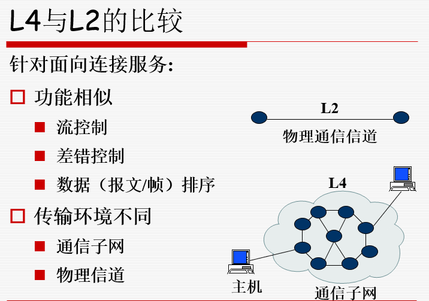

作用范围比较

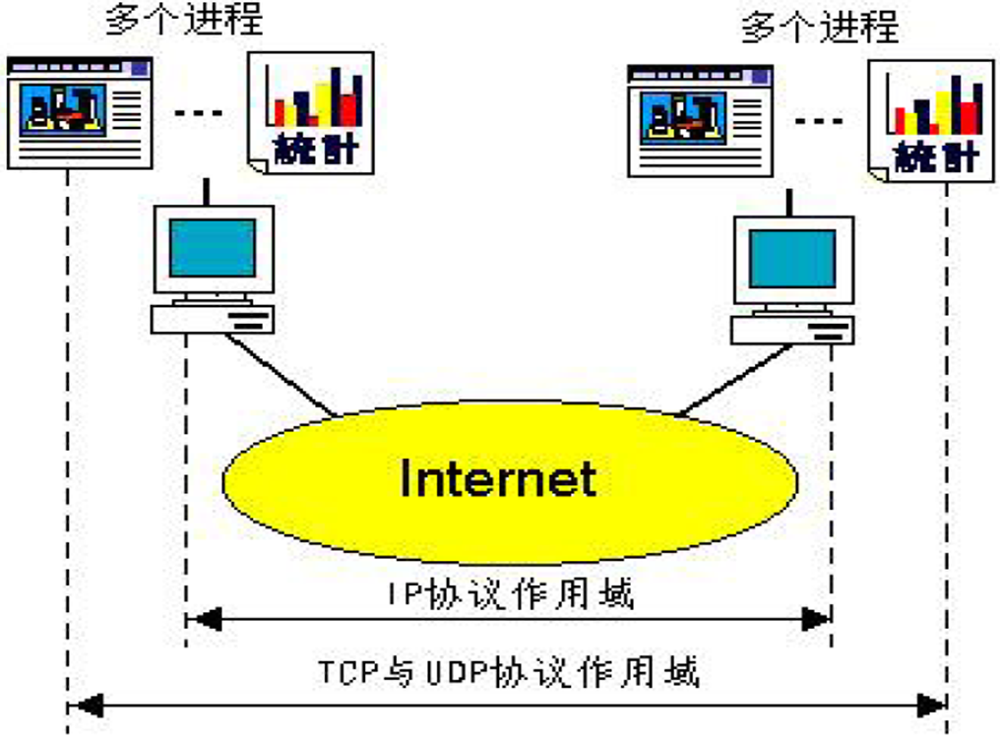

### **传输服务原语**

**传输服务原语让应用程序**可以有途径访问到传输服务

传输服务和网络服务的两个主要差别是：

- **网络服务试图按照实际网络提供的服务来建模**（不可靠的）；而面向连接的传输服务是可靠的
- 网络服务仅被传输实体所使用；而**传输服务直接被应用程序所使用**，必须方便易用

**传输服务原语的一个例子**

连接建立：

- **服务器调用 LISTEN 原语**，阻塞该服务器，直到有客户来连接

- **当一个客户想和服务器通信**，它调用 CONNECT 原语，阻塞该客户，且发送一个分组（封装了传输消息）
- **当分组到达服务器端**，传输实体检查看是否服务器阻塞在 LISTEN 调用中，然后，他解除阻塞，并向客户发回一个CONNECT ACCEPT数据段
- **当这个数据段到达客户端的时候**，客户端解除阻塞，连接建立

数据交换

- 任何一方都可以**执行阻塞的 RECEIVE 原语**，以等待另一方执行SEND原语
- **当数据数据段**（ TPDU）到达时，接收方解除阻塞，并对这个数据段进行处理，发回一个应答
- **只要双方对数据的认识有统一的认识**，这种机制可以工作得很好
- **每个发出的分组都要被确认**，利用网络层的服务；这些确认、定时器、重传等，由传输实体使用网络层协议来管理，**对传输层的用户来说，这些都是不可见的**

连接释放

- **非对称的释放：** 任何一方都可执行 DISCONNECT原语，将 DISCONNECT数据段发给对端的传输实体，数据段到达另一端，连接被释放
- **对称的释放：** 当一方执行 DISCONNECT原语的时候，这意味着它没有更多的数据要发了，但是仍然希望接收数据，只有当双方都执行 DISCONNECT原语后，一个连接才真正被释放

## 传输层协议

### UDP

UDP 是一个**无连接的（connectionless）**的传输层协议
**UDP传输数据段，无须建立连接**
UDP 在 RFC 768中描述
很多C/S应用(如： **DNS**)，都使用UDP发送一个请求，  然后对方应答

**端口（port）定义** 

16 位，共有 216 个端口
端口范围：0~65535

- <1023 : 用于公共应用（保留，全局分配，用于标准服务器），IANA分配；
- 1024~49151 :用户端口，注册端口；
- \>49152 : 动态端口，私人端口。

自由端口(Free port)

- 本地分配
- 动态的随机端口

**注意**

如果收方的校验和为全1，传输无错

二进制反码求和

- 从低位到高位逐列计算
- 0和0相加是0，0和1相加是1，1和1相加是0，但产生进位
- 最高位相加产生进位，该位为1

检错能力较弱，但简单快速

使用协议地址，破坏了分层原则

**UDP小结**

- 提供端点标识，端到端的数据传输

- 不提供差错检测和可靠传输。但**简洁高效**

### TCP

**传输控制协议**

- TCP (Transmission Control Protocol) 是专门为了**在不可靠的互联网络上提供可靠的端到端**字节流而设计的
- TCP必须**动态地适应**不同的拓扑、带宽、延迟、分组大小和其它的参数，并且当有错误的时候，能够**足够健壮**

**TCP 服务模型**

要想获得TCP服务，发送方和接收方必须创建一种称为**套接字（ sockets ）的端点（ end points）**

每个套接字是包含一个IP地址和一个16位的端口（ port ） 

通信进程的全球唯一标识

- 三元组：协议、本地地址、本地端口号
- **五元组：**协议、本地地址、本地端口号、远端地址、远端端口号

**TCP 服务模型**

- 所有的 TCP 连接是**全双工的**(同时双向传输)和**端到端**的(每条连接只有两个端点) 

- TCP **不支持组播和广播**

- TCP连接是**字节流**而不是消息流

#### **TCP 数据段头  **

**源端口 和 目的端口** 字段标明了一个连接的两个端点

- 用来跟踪同一时间内通过网络的不同会话。一般每个端口对应一个应用程序

**序列号** – 字节号 (32 位)

- 初始序列号ISNs(initial sequence numbers )：随机产生的
- SYN: 携带了ISNs 和SYN 控制位的数据段

**确认号** – 期望接收的字节号 (32位)

**TCP 段头长度** – TCP段头长度，**单位32位（4字节）**

保留域/字段

**PSH** 表示这是带有PUSH标志的数据

- 接收方收到这样的数据，应该立刻送到上层，而不需要缓存它

**RST** 被用来重置一个已经混乱的连接

**SYN** 用在连接建立的过程

- **当SYN=1，ACK=0， 连接请求**
- **当SYN=1，ACK=1， 连接接受**

**FIN** 被用来释放连接，它表示发送方已经没有数据要传输了，但是可以继续接收数据.

TCP中的流控(**Flow control**)使用一个可变长的滑动窗口来完成的 

**Window size** – 告诉对方可以发送的数据字节数（从确认字节号开始（**决定于接收方**）

Checksum –提供额外的可靠性

- 校验的范围包括头部、数据和概念性的伪头部

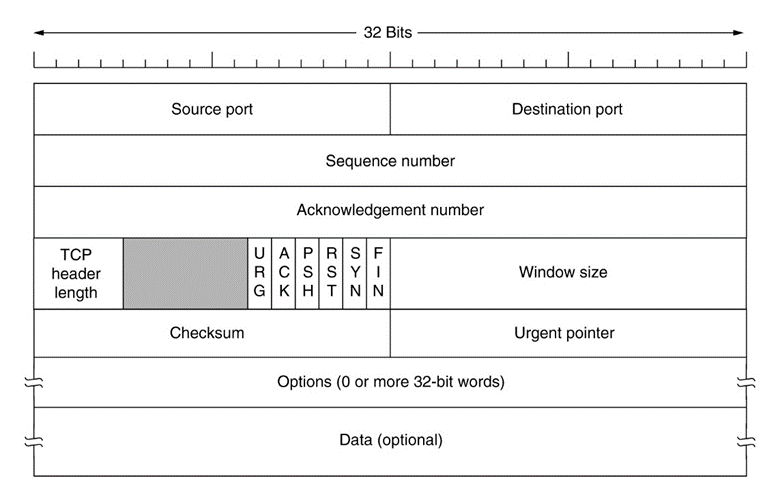

#### TCP连接和释放

**TCP连接的建立**

采用三次握手建立连接

- 一方（server）被动地**等待一个进来的连接请求**
- 另一方（the client）**通过发送连接请求**，设置一些参数
- 服务器方**回发确认应答**，
- 应答到达请求方，请求方最后确认，连接建立

**重复连接请求CR**

SYN泛洪导致DoS攻击（伪造源IP）

数据传输开始后可能有两个原因导致阻塞

- 快的机器向慢的机器发送数据

- 多台机器同时向一台机器发送数据

拥塞避免方法：确认技术、窗口技术

**TCP 连接释放**

释放连接

- **任何一方在没有数据要传送的时候**，都可以发送一个FIN置位了的 TCP 数据段finish
- 当FIN被确认的时候，**该方向的连接被关闭**
- **当双向连接都关闭了的时候，连接释放**

为了避免两军队（two-army）问题，使用定时器

- **如果一方发送了FIN数据段**出去却在一个设定的时间没有收到应答，释放连接
- **另一方最终会注意到连接的对方已经不在了**，超时后连接释放

理论上讲，如果初始DR的和重传都丢了，协议失败

- 发送者将放弃发送且释放连接，但是，另外一端却不知道这些情况，仍然处于活跃的状态
- 这种情形导致**半开放连接（half- open）**

杀死半开放连接的方式P401

- 如果在一定的时间内，**没有TPDUs 到达的话，连接自动释放**
- 如果这样，传输实体在发送一个TPDU的时候必须启动定时器，**定时器超期，将发动一个哑TPDU（dummy TPDU）**，**以免被断掉 P430**

**TCP 传输层策略**

>窗口尺寸受制于接收方

当窗口数为 0 时，发送者不能正常发送数据段，除非: 

- **Urgent数据**。比如，用户想杀掉远端机器上的进程的时候，可以发送数据
- **发送者可以发送一个字节的数据段**，以便让接收者再次发送期待接收的字节号和窗口数（避免死锁）

发送者不需要马上发送应用程序产生的数据

接收者也不需要马上发送应答（当收到数据的时候）

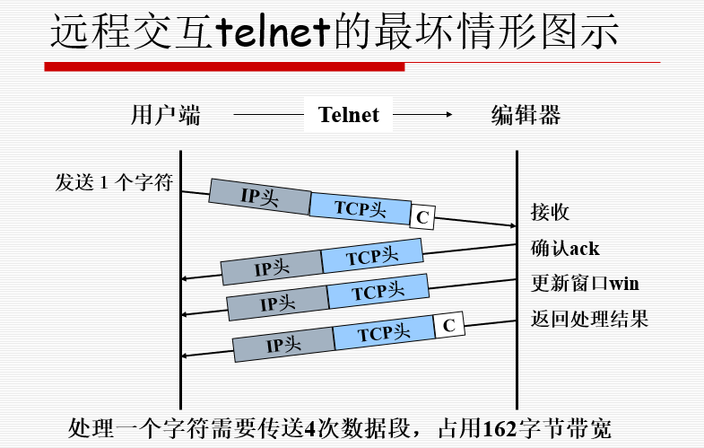

**怎样优化接收端?** 

- 接收端可以推迟500ms发送确认分组和窗口更新窗口，以便可以免费搭载在处理后的回显分组内（free ride）

**怎样优化发送端 ?** 
**Nagle's algorithm (1984):** 

- 当数据以一次一字节的速度到达的时候，只发送第一个字节，然后将后续的字节缓存起来，直到发出的字节得到确认
- 然后将缓存起来的字节在一个数据段中发出，再继续缓存，直到发出的数据得到确认
- Nagle算法在很多TCP上实现，但是有些时候最好禁用，比如：当一个X-Windows应用在互联网运行的时候，鼠标的移动事件必须发送给远程计算机，把这些移动事件收集起来一批一批发送出去，使得鼠标的移动极不连贯

Nagle’s 算法图示

**傻瓜窗口综合症** 

另一个使TCP性能退化的问题是傻瓜窗口综合症（silly window syndrome problem）：当有大块数据被传递给发送端TCP实体，但接收端的交互式应用每次只读取一个字节的时候，问题就来了

**Clark解决方案 ：**

- **阻止接收方发送只有1个字节的窗口更新**，相反，它必须等待一段时间，当有了一定数量的空间之后再告诉发送方
- 而且，**发送方不发送太小的数据段**，相反，他试着等待一段时间，直到积累足够的窗口空间以便发送一个满的数据段，或者至少包含接收方缓冲区的一半大小
- **接收方可以维护一个内部缓冲**，且阻塞上层应用的 READ 请求，直到它有大块的数据提供

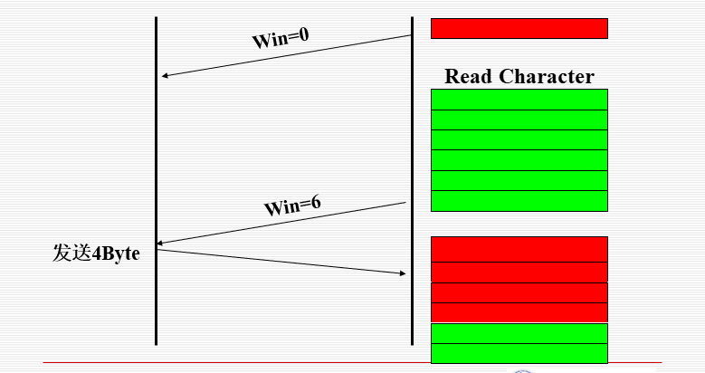

发送方（Nagle’s algorithm）

- 尽量不发送数据含量小的数据段
- 缓存应用层的数据，达到一定量再发送

接收方（Clark’s solution）

- 不请求对方发送短数据段(window size)
- 延迟窗口变更信息，使接收缓冲区足够大

#### **TCP拥塞控制**

虽然网络层也试图管理拥塞，但是，**大多数繁重的任务是由TCP来完成的，因为针对拥塞的真正解决方案是减慢数据率**

**分组守恒**：当有一个老的分组离开之后才允许新的分组注入网络

TCP希望通过动态维护窗口大小来实现这个目标

**拥塞检测Congestion detection**

- 所有的互联网TCP算法都假定超时是由拥塞引起的，并且通过监视超时的情况来判断是否出现问题

**拥塞控制Congestion prevention**

- **当一个连接建立的时候，双方选择一个合适的窗口大小**，接收方根据自己的缓冲区大小来指定窗口的大小。
- 如果发送者遵守此窗口大小的限制，则接收端不会出现缓冲区溢出的问题，**但可能由于网络内部的拥塞而发生问题**

互联网解决方案应该是认识到两个潜在的问题的：**网络容量，接收者容量**，然后单独地处理这两个问题 

为此，每个发送者维护两个窗口: 

- **接收者窗口**大小反映了目前窗口的容量 （容易控制）
- **拥塞窗口**大小反映了网络目前的容量（难于控制）
- 发送者发送的数据字节数是**两个窗口中小的**那个窗口数

**决定拥塞窗口的大小**

慢启动算法（Slow Start） (尝试的过程)：

- 当连接建立的时候，**发送者用当前使用的最大数据段长度**初始化拥塞窗口，然后发送一个最大的数据段

- **如果在定时器超期之前收到确认，则将拥塞窗口翻倍**，然后发送两个数据段。。。。。**直至超时**（或达到接收方窗口的大小）

- 确定出拥塞窗口的大小

  如：如果试图发送 4096 字节没有问题，但是发送8192字节的时候，超时没有收到应答，则拥塞窗口设为4096个字节 

> 按指数增长趋势定义拥塞窗口大小cwnd
> 初始：cwnd0 = MaxSegL（当前数据段长度）
> 增长：cwnd1 = 2 cwnd0
>                   cwnd2 = 2 cwnd1
>                    • • •
> 截止：达到接收窗口大小或超时
>
> **拥塞窗口二进制指数增长至接收窗口大小或超时**

除了使用接收者窗口和拥塞窗口，TCP拥塞控制还是用了第三个参数，**阈值（threshold）**，初始化为64K

- 当一个超时发生的时候，**阈值降为当前拥塞窗口的一半，同时将拥塞窗口设为一个最大数据段的长度**
- 然后使用**慢启动算法**来决定网络的容量，拥塞窗口增长到阈值时停止指数增长 
- 从这个点开始，每次成功的传输都会让拥塞窗口线性增长（即每次仅增长一个最大的数据段长度）

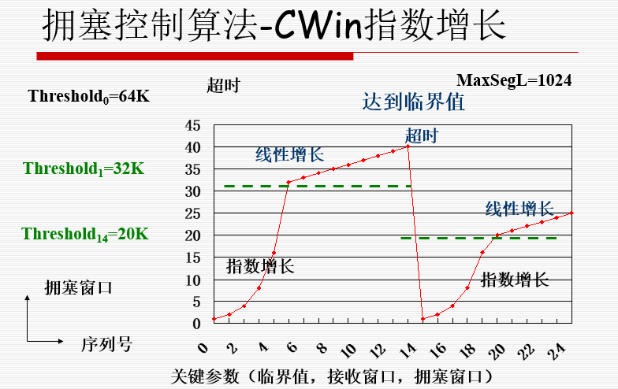

**拥塞控制算法总结**

- 定义初始拥塞窗口阈值和窗口大小

  Threshold0和cwnd0

- 初始超时

  - 拥塞窗口阈值减半：

    Threshold1 = CWND / 2

- cwnd二进制指数增长至确认超时

- cwnd线性增长至确认超时

  - 拥塞窗口值减半：Thresholdn = CWNDn / 2

  - 定义窗口大小：cwnd = cwnd0

- 重新开始慢速启动过程

#### **TCP定时器管理**

最重要的定时器是**重传定时器(**retransmission timer,Positive ackn. with retransmit） 

> 超时间隔设为多长合适呢？

持续定时器（persistence timer），用来避免如下的死锁（ deadlock ）发生 

- 接收方发送了一个窗口数为零的确认（窗口更新），告诉发送方等待

- 稍后，接收方空出了缓冲，发送更新窗口的数据段，但是，很不幸，该分组丢失啦！

- 现在，收发双方都在等待对方发送数据段过来，但永远等不到！死锁产生

**怎样防止死锁？**

- 保活定时器（keep-alive timer）用来检查连接是否存活，当一个连接空闲的时间超过保活定时器的时间，该连接将被杀掉。
- 最后一个定时器是在关闭时刻处于**TIMED WAIT** 状态中使用的定时器，它运行两倍的最大分组生存时间，以确保连接关闭之后，该连接上的所有分组都完全消失

### **TCP 和 UDP**

TCP

- 可靠传输方式
- 可让应用程序简单化，程序员可以不必进行错误检查、修正等工作

UDP

- 为了降低对计算机资源的需求，如DNS
- 应用程序本身已提供数据完整性的检查机制，勿须依赖传输层的协议来保证
- 应用程序传输的并非关键性的数据，如路由器周期性的路由信息交换
- 一对多方式，必须使用UDP（TCP限于一对一的传送），如视频传播

### 总结

UDP (数据段segment)

TCP (数据段segment)

提高可靠传输的措施 (传输策略)

- 肯定确认重传
- 窗口技术 (滑窗技术)
-  nagle 算法 和 clark方案
- 拥塞控制 (慢启动)

# **应用层**

## **应用层概述**

**主要功能**

> 最靠近用户的一层，向应用程序提供网络通信

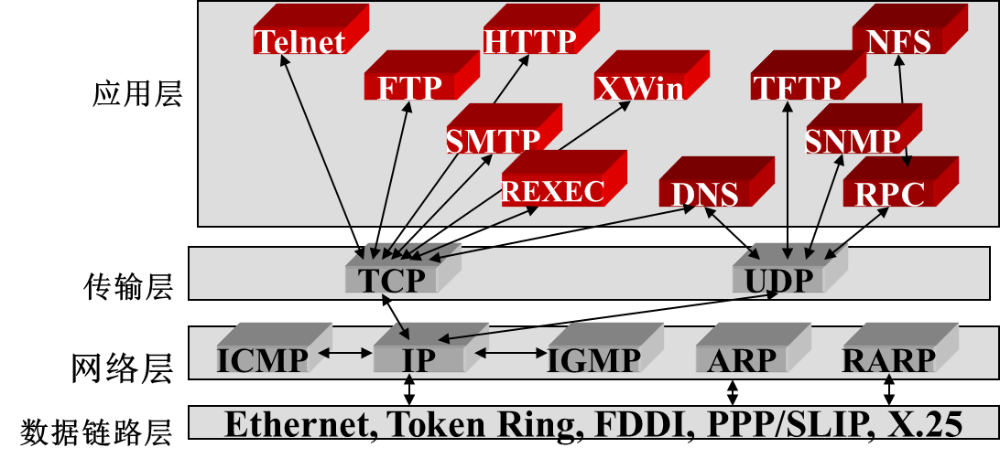

**应用层的特点**

- 没有应用层，就没有网络通信支持
- 参考模型中唯一的一层，不需为它的上层服务
- 它向参考模型之外的用户提供服务
- 网络应用程序可被分为两大类：
  - 直接网络应用程序：Browser , e-mail ,FTP , Telnet
  - 间接网络应用程序：Word , resource manager , (via Redirector)

**重定向器(Redirector)**

> 置于应用中的一种小软件
> 它是透明的

## **域名解析系统**

- DNS是**分层次的，基于域**的命名方案，且采用了**分布式数据库**系统来实现（P471）
- DNS的使用方法：
  - 为了将一个名字映射为IP地址，应用程序调用一个叫**解析器（ resolver ）**的库过程，把名字作为参数传递给这个过程 （如： gethostbyname()就是一个解析器）
  - **解析器发送一个UDP分组给本地DNS服务器**，它会负责查找该名字，然后将对应的IP地址返回给解析器
  - **解析器返回结果给应用程序**，然后应用程序即可开始工作了（封装，发送。。。。。。）

- DNS的命名空间
  - 互联网被分成200多个顶级域
    - 每个域被分成若干子域，子域还可进一步划分。。。
    - 所有这些域可以用一棵树来表示
      - 树上的叶子代表没有子域的域（但包含主机）
      - 一个叶子节点可以只包含一台主机，也可以代表一个公司，包含上千台主机
  - 顶级域有两种
    - 通用域（ generic ）
    - 国家域（ country ）

- 域名

  - 每个域的名字是：从它向上到根（未命名）的路径，各个部分间用圆点隔开
  - 域名可以是绝对的，也可以是相对的，绝对域名总是以圆点结束（如： eng.sun.com. ） 
    - 相对域名必须在一定的上下文环境中被解释出来才有意义，从而唯一地确定其真实的含义
    - 绝对域名和相对域名都引用了域名树中一个特定的节点，以及它下面的所有节点
  - 域名是大小写无关的（ case insensitive ）
  - 各组成部分的名字最多有 63 个字符长，整个路径不超过 255 个字符
  - 没有规则限制同时在两个或多个顶级域名下的注册 (如：sony.com and sony.nl)—域名抢注
  - 每个域自己控制它下面的域（子域）的划分
  - 要创建一个新的域，创建者必须得到该新域的上级域的许可，一旦创建成功，该新域可以创建子域，而无需征得上级域的同意
  - 域名遵循的是组织的边界而不是物理网络的边界

- 资源记录

  - 每个域，无论是单主机域还是顶级域，都可以有一组跟它相关联的资源记录（ Resource Records ）

  - 当一个解析器把域名传递给DNS时，DNS所返回的是与该域名相关联的资源记录。所以DNS的主要功能是将域名映射到资源记录上

  - 一个资源记录包括5个部分：

    - 域名（Domain name）

      >指出这条记录适用于哪个域

    - 生存期（Time to Live）

      >指出这条记录适用于哪个域

    - 类别（Class）

      >对于互联网信息，它总是 IN

    - 类型（Type）

      >指出了这是什么类型的记录

    - 值（Value）

- 根服务器

  - 最重要的域名服务器；存储所有顶级域名的名字和IP
  - 无论是哪个本地域名服务器，无论何时，只要它无法回答一个查询请求，它都会向根域服务器求救 (for help)
  - 全球有 13 根域服务器，它们的名字分别是a to m（前13 个字母）。

- 域名解析

  - 当一个解析器收到一个域名查询时，它将该查询传递给本地的一个域名服务器

  - **如果待查询的域名落在该名字服务器的管辖范围内**，它将返回权威资源记录

    - 一个权威资源记录（authoritative record）是指来自于管理该记录的权威机构，因此总是正确的，它和缓存的记录不同，后者可能是过期的

  - **如果被请求的域名是远程的，且本地没有关于它的信息**，那么本地名字服务器向根域服务器发送一条查询此域的消息

  - 域名解析的种类

    - **主机向本地域名服务器的查询**一般都是采用**递归查询**。如果主机所询问的本地域名服务器不知道被查询域名的 IP 地址，那么本地域名服务器就以 DNS 客户的身份，向其他根域名服务器继续发出查询请求报文。
    - **本地域名服务器向根域名服务器的查询**通常是采用**迭代查询**。当根域名服务器收到本地域名服务器的迭代查询请求报文时，要么给出所要查询的 IP 地址，要么告诉本地域名服务器：“你下一步应当向哪一个域名服务器进行查询”。然后让本地域名服务器进行后续的查询。

    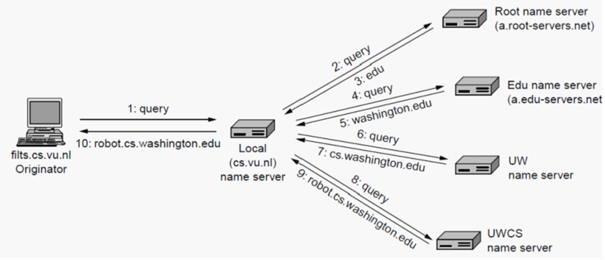

  - 优化方法

    - 高速缓存—减少查询环节，提高效率
    - 缺点：缓存中的内容不具有权威性

## **重要的应用**

### 电子邮件

- 电子邮件系统通常由两部分组成：

  - **用户代理(UA)**：让用户能够阅读和发送邮件
    - 本地程序，提供命令行或图形界面，让用户和电子邮件系统交互
    - 电子邮件阅读器
  - **消息传输代理 (MTA)**：将消息从源端送到目标端
    - 通常是系统守护进程，即运行在后台的进程，在系统中传递电子邮件

- 电子邮件体系结构

  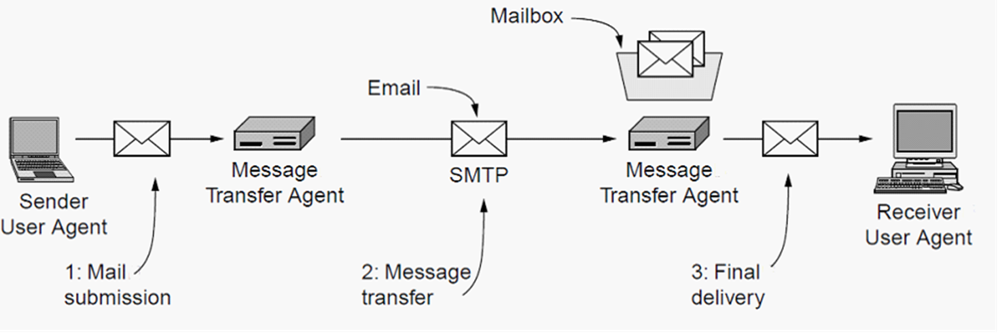

- Email 消息传输
  - 建立一个从源机器到目标机器间的传输层连接，然后传输消息
  - SMPT – Simple Mail Transfer Protocol
    - 源机与目标机（SMTP守护进程在监听）的25端口建立TCP连接
      - 连接建立 (在端口 25)
      - 数据交换
        - 客户机（作为客户）等待服务器（作为服务器）首先开始通话
        - 服务器首先发送一行文本，给出它自己的标识，并且告诉客户机是否已准备好接收邮件
          - 如果服务器没有准备好，则客户机释放连接，以后再重试
        - 如果服务器愿意接收电子邮件，则客户机申明发信人和收信人
        - 如果服务器确实存在这样的收信人，则服务器指示客户可以发送了
        - 客户发送消息，服务器回发确认
      - 连接释放
    - 如果消息不能被投递，则向消息的发送方返回一个错误报告（包含了不能投递消息的第一部分）
    - 这是一个简单的 ASCII 协议
  - 最后传递
    - 当有用户使用拨号上网，不可能一直在线的时候，上述工作模式不再运作了
    - 一种解决方案是在ISP的一台机器上运行一个消息传输代理（message transfer agent）； 这台机器可以一天24小时运行，
    - 设计一个协议POP3 (Post Office Protocol Version 3)，允许用户和消息传输代理MTA联系，然后把邮件从ISP那里拷贝到用户
      - 当用户启动邮件阅读器的时候，POP3开始工作
      - 用户呼叫ISP（除非已有一个连接），然后与MTA在110端口建立TCP连接
      - 一旦连接建立， POP3协议按顺序经历三种状态
        - 授权（Authorization）
          - 处理用户登录的过程
        - 事务（Trnsactions）
          - 用户收取电子邮件，并将邮件标记为删除
        - 更新（Update）
          - 将标为删除的电子邮件删除

### 万维网

- Web 是web网页的集合（ collection of web pages）
- 每个页面包含了指向其他页面的链接
  - 超级链接
- 浏览器 –显示阅读web页面的程序

- WWW的组成部分

  - 资源，web页面，Resource (html)

  - 统一资源定位器：URL

  - 通信协议HTTP

    >http://www.abcd.com/products.html)
    >协议：http
    >页面所在的机器的DNS 域名：www.abcd.com
    >包含web页面的文件的名字：products.html

- 页面的MIME类型，以决定如何显示该页面

- 当用户单击一个超级链接（URL）时：

  - 浏览器检查URL (读取浏览器的输入)
  - 浏览器向 DNS 服务器询问域名的IP地址
  - DNS 返回对应的 IP 地址
  - 浏览器和Web服务器建立TCP 连接（在端口 80）
  - 浏览器发送请求，要求获取文products.html
  - Web服务器返回被请求的文件
  - TCP 连接被释放
  - 浏览器解释显示下载到本地的文件

- 服务端
  - 典型的web 服务器的操作：
    - 接收来自客户的TCP连接
    - 获取所需文件的名字
    - 从本地磁盘上获取文件（静态页面）
    - 将文件返回给客户
    - 释放TCP连接
  - 改进
    - 在内存维护一个缓存，保存最近用过的 n个文件
    - 多线程服务器

- 代理服务器
  - 代理服务器(proxy server)又称为万维网高速缓存(Web cache)，它代表浏览器发出 HTTP 请求。
  - 万维网高速缓存把**最近的一些请求和响应**暂存在本地磁盘中。
  - 当与暂时存放的请求相同的新请求到达时，万维网高速缓存就把**暂存的响应**发送出去，而不需要按 URL 的地址再去因特网访问该资源。
- cookie
  - 一个小于4kB的命名串
  - 当客户请求时，web服务器除了应答外，附送一个cookie，存储在客户机磁盘
  - 客户再访问同一个web服务器时，同时发送cookie
  - 服务器辨识出该用户，并得到它关心的一些信息

### 文件传输

FTP、TFTP和NFS

- 一种可靠的面向连接的服务，采用TCP在支持FTP的系统间传输文件，它支持双向二进制文件和ASCII文件传输。
- TFTP：一种无连接的不可靠的服务，采用UDP在支持TFTP的系统间传输文件。
- FTP ：使用两条 TCP链接

### 远程登陆

- 不要求远地系统创建众多的服务器，只需为每个远程登陆用户建立一个进程，这个进程再通过创建子进程为远程登陆用户提供各种允许的服务。
- 远程登陆的另外一个优点，它提供与本地登陆几乎完全相同的用户界面
- 本地用户在本地终端对远地系统进行远程登陆，该远程登陆的内部视图实际上是一个**TCP连接**；

多媒体

多媒体相关的协议

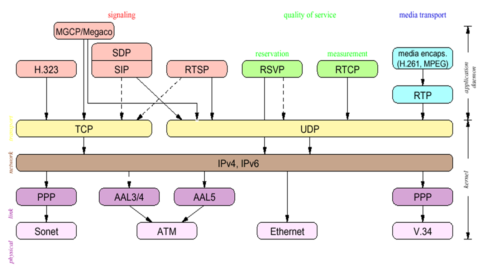

Web2.0
