# 物理层

> 物理层的功能
> 在两个网络设备之间提供透明的比特流传输。

## 基本通信理论

>两个关于介质最大传输数据速率的经典定律
>乃奎斯特定理：理想信道，无噪声信道
>香农定理：有噪声信道

### 奈奎斯特定理

### 香农定理

**波特率和比特率**

## 有线传输介质

- 磁介质，如磁带
- 双绞线
  - 非屏蔽双绞线
  - 屏蔽双绞线 
- 同轴电缆
- 电力线
- 光纤
  - 光导纤维的简称；
  - 由极细的玻璃纤维构成，把光封闭在其中并沿轴向进行传播；
  - 优点：重量轻、损耗低、不受电磁辐射干扰、传输频带宽、通信容量大
  - 缺点：昂贵、易断裂

## 数字调制与多路复用技术

- 调制机制使用信号来传输比特

  - Baseband Transmission（基带传输）：直接将数据比特转化为信号

    - Line codes （线路编码）发送 symbols（样本、符号），一个样本可传送1个或多个比特

      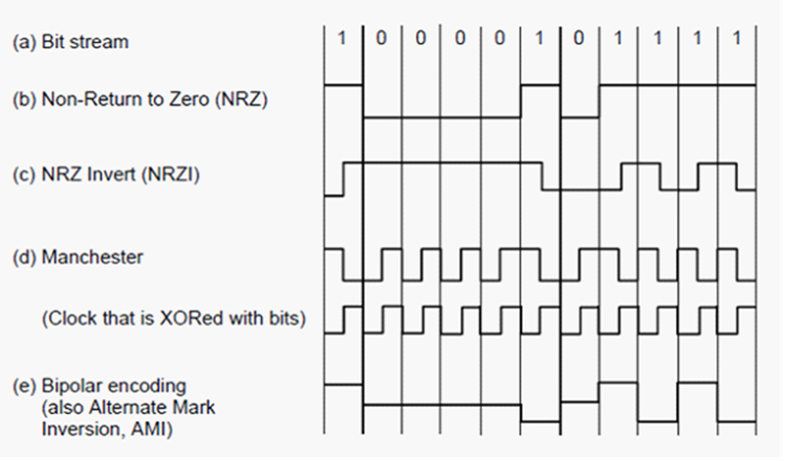

    - 时钟恢复

      - 曼彻斯特编码, 每个比特时间跳变一次，
      - 不归零逆转：1为有跳变
      - 4B/5B：4比特数据被映射为1个5比特模式

  - Passband Transmission（通带传输） ：通过调节信号的振幅、相位或频率来传输比特

    - 特点：信号占据了以载波信号频率为中心的一段频带

      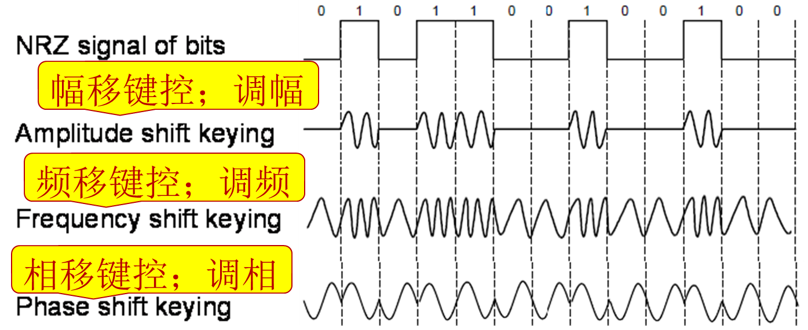

    - 信号星座

      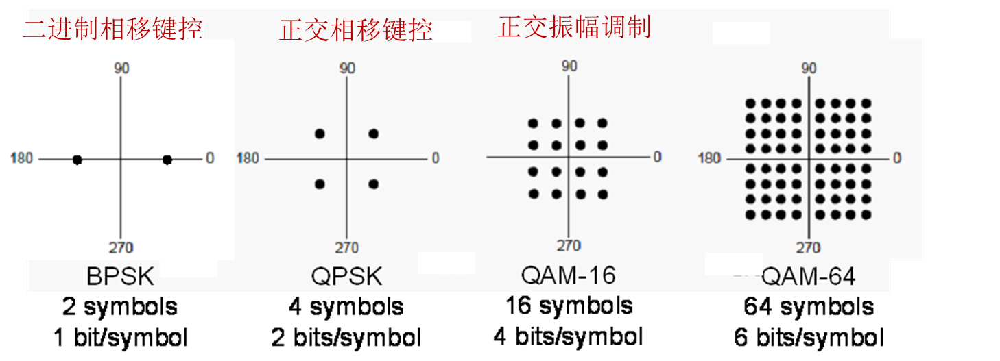

      格雷码

      > 相邻符号间只差一个比特，从一个状态变到下一个状态不会引起逻辑混乱。

       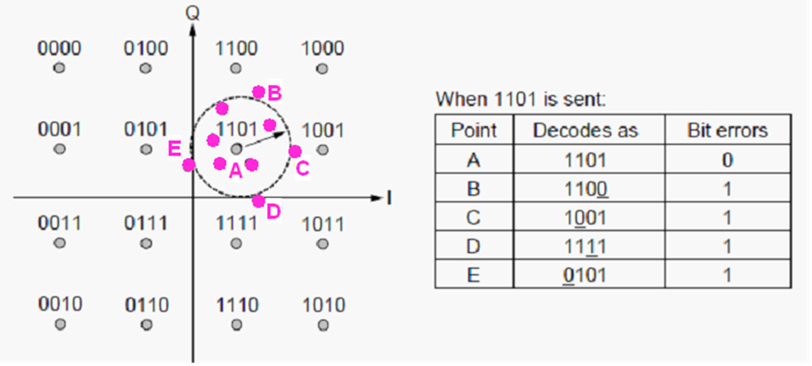

      

- 复用技术是让多用户共享同一根信道

  - 频分多路复用FDM

    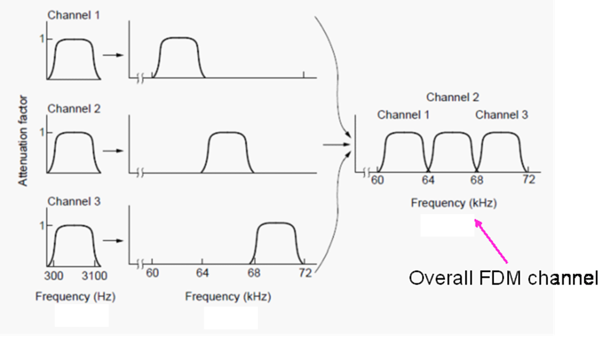

  - 波分多路复用WDM 

    - WDM (Wavelength Division Multiplexing), 本质跟 FDM一样,在光纤上复用信号

    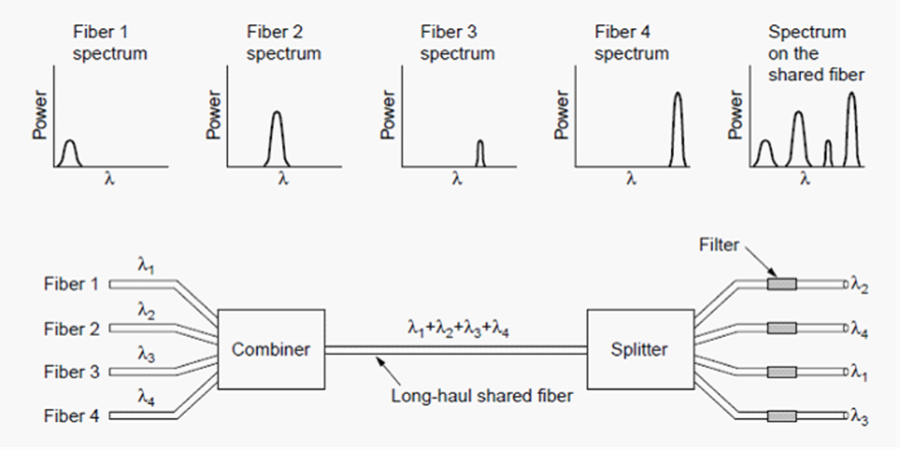

  - 时分多路复用TDM

    - 在时间上共享信道，用户轮流使用信道

    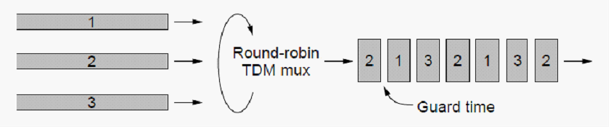

  - 统计时分多路复用技术
    - Statistic TDM（STDM）
    - 动态分配信道，不使用信道的用户不分配，分给有需要的用户使用
    - 利用率可提高2~4倍
    - 实现技术较复杂，通常只在高速远程通信中使用，如ATM
    - 用户平均使用信道的情况不适用

  - 码分多路复用

    - 每个用户拥有一个唯一码片序列
      - 码片是正交的，能够同时传输

    

    

# 数据链路层

## 可靠的DLL

### 数据链路层功能

- 为⽹络层提供服务，良好的服务接⼝
- 保证数据传输的有效、可靠：
  - 处理传输错误：差错检测和控制
  - 流量控制
    - 基于速率
    - 基于反馈

**DLL提供的服务**

- 确认：接收⽅在收到数据帧后，必须给发送⽅发回⼀个确认
- ⾯向连接：发送⽅和接收⽅在传输数据之前必须建⽴逻辑连接，传输结束后必须释放连接
- 服务种类
  - ⽆确认的⽆连接服务
    - ⽆确认是指接收⽅在收到数据帧后，毋需发回⼀个确认
    - ⽆连接服务是指在数据传输前毋需建⽴逻辑链路
    - ⽆确认并⾮不可靠，可靠性由上层协议负责
    - 局域⽹主要采⽤这种⽅式，因为：
      - 共享信道毋需建⽴连接
      - 信道较为理想，数据传输的误码率很低
      - 即使出错或丢失由上层负责恢复
    - 适⽤于实时通信
  - 有确认的⽆连接服务
    - 使⽤前不建⽴连接，即不建⽴数据链路，但每帧传输必须得到确认
    - 如果没有得到确认，将重传
    - 这在信号传播延时较⼤、线路状态不⼀定很可靠的情况下是有效的
      - 例如：⽆线通信，信道使⽤率很低但数据传输的误码率相对较⾼，确认是必要的
  - 有确认的⾯向连接服务
    - 使⽤前先建⽴连接，即先建⽴数据链路，并且每帧的传输必须得到确认
    - 有连接的服务必须在使⽤前先建⽴连接（即建⽴逻辑链路），然后使⽤，最后释放
      - 例如：电话

### 成帧的方法

- 数据链路层使⽤物理层提供的服务，物理层处理的是位流，数据链路层处理的是帧

- 将原始的位流分散到离散的帧中，叫成帧，成帧的⽅法有：

  - **字符计数法**

    {:height="50%" width="50%"}

    - 特点
      - 简单
      - 缺点：⽆法恢复
      - 已经很少使⽤

  - **带字节/字符填充的标志字节法**

    - 该⽅法考虑了错误之后重新同步的问题，让每⼀帧都⽤⼀些特殊的字节作为开始和结束
    - 标志字节（flag byte）

    

    - 缺点：
      - 容易造成帧界混淆，——增加转义字节
      - 依赖于8位字符
    - 解决⽅法
      - ⼀种⽅法是在⼆进制数中偶然出现的标志字节前插⼊⼀个转义字节。这就称为字节/字符填充法
      - 新技术的采⽤——位填充

  - **⽐特填充的⽐特标志法**

    - 这是⼀种⾯向⼆进制位的帧格式，把所有需传输的数据以⽐特位⼀字排开，并以特殊的位模式01111110作为帧标志，即⼀个帧的开始（同时标志前⼀个帧的结束）
    - 当帧内容中出现⼀个与帧标志相同的位串01111110，则在5个1后插⼊⼀个0，即变成01111101，接收⽅将⾃动删除第5 个1后的0。这称为**位填充法**，也称为透明传输。
    - 如果由于⼲扰，⼀个帧没有正确接收，则可扫描接收串，⼀旦扫描到01111110，即新的⼀帧从此开始。即可以再同步

    

  - 物理层编码违例法

    - 在曼切斯特编码中，连续⾼电平或连续低电平可⽤作帧边界
      - 采⽤冗余编码技术，如曼切斯特编码，即两个脉冲宽来表示⼀个⼆进制位
      - 数据0：低-⾼电平对
      - 数据1：⾼-低电平对
      - ⾼-⾼电平对和低-低电平对没有使⽤，可⽤作帧边界

### 纠错检错方法

**差错类型**

- 单个错误：分散在各块中
- 突发错误：集中在某个块中
- 例⼦：
  - 块⼤⼩： 1000 bits （100个块）
  - 出错率是：每个⽐特 0.001（1%0）
- 突发错误⽐单个错误更加难于纠正

#### 海明码

**海明距离**

- 码字：包含数据和校验位的n位单元。
- 海明距离
  - 两个码字(codeword)的海明距离 : 两个码字之间不同位的数⽬。
    - 如：10**001**001 和10**110**001 的海明距离为3。
  - 异或
- 全部码字的海明距离
  - 全部码字中任意两个码字之间海明距离的最⼩值。
- 海明距离的意义：如果海明距离为d，则⼀个码字需要发⽣d个1位错误才能变成另外⼀个码字

**海明距离纠错检错**

- 海明距离为d+1的编码能检测出d位差错。

  - 因为在距离为d+1的检验码中，只改变d位的值，不可能产⽣另⼀个合法码。如奇偶校验码，海明距离为2，能查出单个错。

- 海明距离为2d+1的编码，能纠正d位差错。

  - 因为此时，如果⼀个码字有d位发⽣差错，它仍然距离原来的码字距离最近，可以直接恢复为该码。

  

​			

- 随着海明距离的增加，纠错的能⼒也增加；即海明距离越⼤，纠错能⼒越强。
- 海明距离为3，可以纠正1个错误；⽽海明距离为5，可以纠正2个错误。
- 当⼀个系统中的海明距离增加的时候，合法码字就减少了；即传输效率降低

**纠正单位比特错误的冗余位下界**

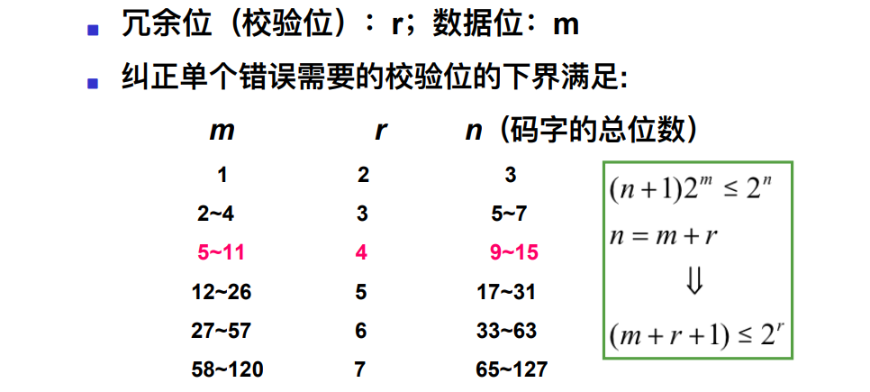

**海明码纠错码**

- 每⼀个码字从左到右编号，最左边为第1位

- 校验位和数据位

  - 凡编号为2的乘幂的位是校验位，如1、2、4、8、16、……。
  - 其余是数据位，如3、5、6、7、9、……。

- 每⼀个校验位设置根据：包括⾃⼰在内的⼀些位的集合的奇偶值(奇数或偶数)。

- 将某⼀位数据位的编号展开成2的乘幂的和，那末每⼀项所对应的位即为该数据位的校验位(收⽅使⽤)。

  ​		如： 11 = 1 + 2 + 8
  ​		29 = 1 + 4 + 8 + 16

  - 校验位1的检验集合为所有奇数位。

  - 校验位2的检验集合：2、3、6、7、10、11、…

  - 校验位4的检验集合：4、5、6、7、……

  - 校验位8的检验集合：8、9、10、11、……

    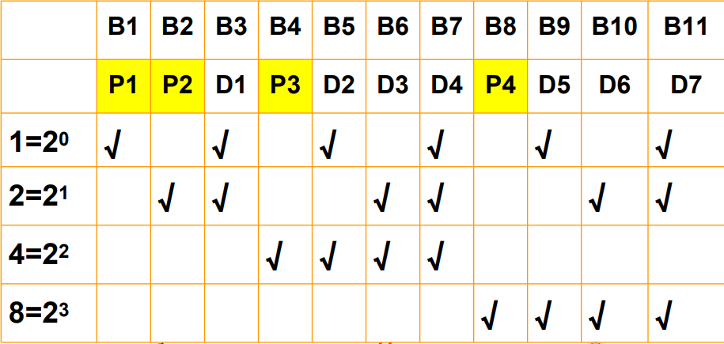

- 待发送的数据：0 0 1 1 0 0 1 0 0 **0**

  - 校验位1：P1= P1⊕ D1⊕ D2⊕ D4⊕ D5⊕ D7 =∑(0,1,0,1,0,0)=0
  - 校验位2：P2= P2⊕ D1⊕ D3⊕ D4⊕ D6⊕ D7=∑(0,1,0,1,0,0)=0
  - 校验位4：P3= P3⊕ D2⊕ D3⊕ D4=∑(0,0,0,1)=1
  - 校验位8：P4= P4⊕ D5⊕ D6⊕ D7=∑(0,0,0,0)=0

- 错误码字：0 0 1 1 0 0 1 0 0 **1**

  - 校验位1：P1= P1⊕ D1⊕ D2⊕ D4⊕ D5⊕ **D7** =∑(0,1,0,1,0,0)=1（校验错）
  - 校验位2：P2= P2⊕ D1⊕ D3⊕ D4⊕ D6⊕ **D7**=∑(0,1,0,1,0,0)=1（校验错）
  - 校验位4：P3= P3⊕ D2⊕ D3⊕ D4=∑(0,0,0,1)=1
  - 校验位8：P4= P4⊕ D5⊕ D6⊕ **D7**=∑(0,0,0,0)=1（校验错）
  - 差错计数器=1+2+8=11,即D7出错。

**海明码纠错突发错误**

- 将连续的k个码字按⾏排列成矩阵
- 发送数据时，按列发送，每列k位
- 如果⼀个突发性错误⻓度是k位，则在k个码字中，⾄多只有⼀位受到影响，正好可⽤海明码纠错改位后恢复

**检错码**

**奇偶校验码**

- ⼀个校验位（ Parity Bit）追加到数据后。
- 校验位的值取“0”还是“1”，取决于整个码字的总的“1”的个数。（奇数还是偶数）。
  - Data: 1011010
  - Even: 1011010 0 （偶校验）
  - Odd: 1011010 1 （奇校验）
- 海明距离等于 2。
  - 如果1个⽐特发⽣了跳变错误，可以检测出来。
  - 如果2个⽐特发⽣了跳变错误，接收⽅⽆法检测出错误，认为码字正确。

- 交替的N位校验，可检查出最多N位的突发错误

  - N位下的突发都可检出。

    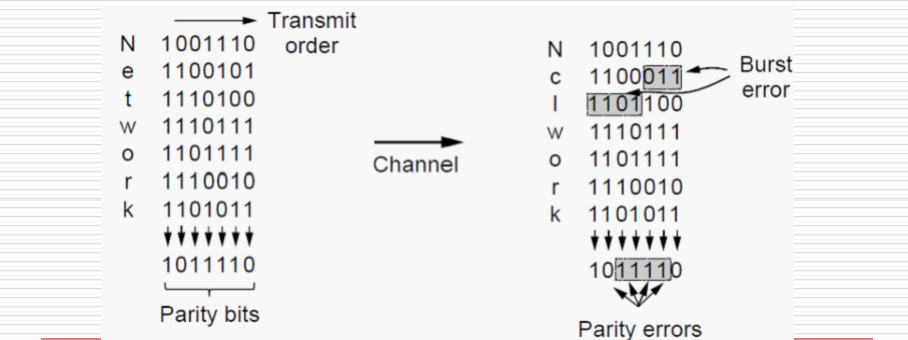

#### **校验和**

- 校验和通常是按照N位码字来进⾏模2和运算，发放将运算结果附加在数据报⽂尾部，作为校验位

- 特点:
  - ⽐奇偶检验更好的检错性能
  - 能检出⾼致N位的突发错

#### **循环冗余校验**

**发送端生成CRC**

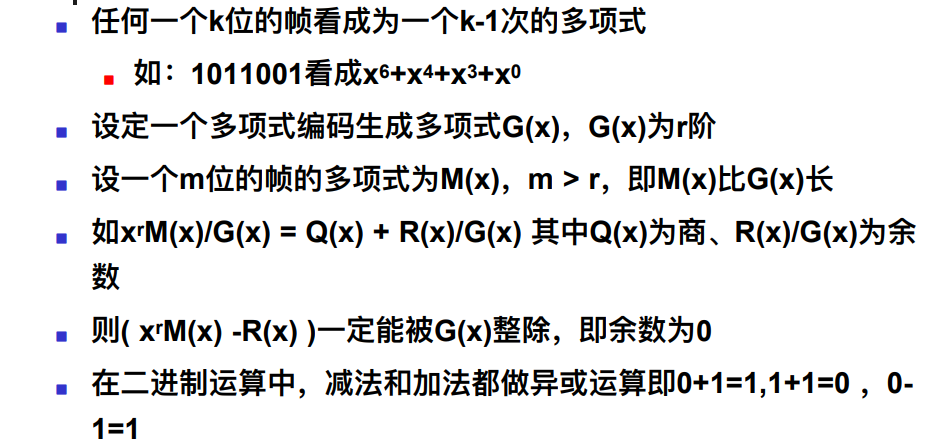

例如

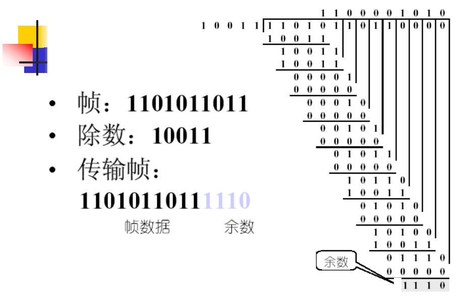

计算11010110110000/10011 得余数1110，即CRC码为11010110111110

- 如CRC码在接收端能被10011整除则说明接收正确。
- 如发送⽅发送的T(x)，接收⽅收到的是T(x)+E(x)，如果不能被整除，则被检测到已出错。

**接收端检查**

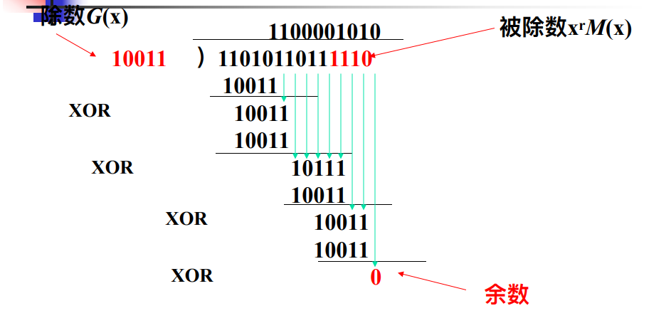

- Sender
  - 在数据帧的低端加上r个零，对应多项式为X^rM(x)
  - 采⽤模2除法，⽤G(x)去除X^rM(x)，得余数
  - 采⽤模2减法，⽤X^rM(x)减去余数，得到带CRC校验和的帧
- Receiver
  - ⽤收到的幀去除以G（x）
  - 为零：⽆错误产⽣
  - ⾮零：发⽣了错误，重传

优点

- 可以检测到所有⻓度⼩于等于r的突发错误
- ⼴泛⽤于各种⽹络，⼏乎所有的局域⽹

## 6个协议

### 无限制的单工协议

- 数据单向传送
- 收发双方的网络层都处于就绪状态（随时待命）
- 处理时间忽略不计（瞬间完成）
- 可用的缓存空间无穷大（无限空间）
- 假设DLL之间的信道永远不会损坏或者丢失帧（完美通道）
- “乌托邦”

### 单工停—等协议

- 解决如何避免收方被涌入的数据淹没，即取消“接收方允许无限量接收”的假设
- 解决方法：收方回发一个**哑帧**，接收方收到哑帧，表明收方允许接收数据，此时再次发送下一帧数据。
- 实际上是半双工协议

### 有错误信道的单工协议

- 有噪声就会产生差错，有差错就可能会引起以下这些问题： 
  - 接收方检测到错误帧，如何通知发送方？如何恢复正确帧？ 
  - 数据帧或确认帧在途中丢失将如何解决？ 
  - 有可能收到重复帧，如何解决？

- 解决方法：确认；重发；计时器；帧序号。 
  - 确认帧 
    - 接收端进行差错检查后，发确认帧送回发送端，告诉接收是否正确。 
    - 为了减少网络内的流量，**只在接收无差错时才发确认帧**，出错时不发确认帧。发送端等候计时器给定的时间后仍未收到确认帧，则知道接收出错，此时发送端重发原来的帧。
      - ARQ:automatic repeat request(自动重复请求) 
      - PAR:positive acknowledgement with retransmission（带有重传的肯定确认）
  - 重发 
    - 网络中采用检错码，无法纠正错误，由重发原来帧的方式来恢复正确的帧。 
  - 计时器 
    - 控制何时重发，防止无限期等待（死锁）。 
    - 通过发送方计时器（超时）解决。 
      - 超时（TimeOut）：在传输过程中，所发送的帧丢失，接收方根本没有收到，不可能发送确认帧（包括否定性确认），而发送方正在等待接收方的确认帧，当然也不可能等到接收方的确认。所以，发送方一旦发送一帧，就启动一计时器，在规定的时间内，一般都应收到确认，如收不到确认，则在计时器溢出时，再重发此帧。
      - 确认超时：捎带确认超时，单发确认帧
  - 帧序号 
    - 防止重发时接收端收到重复的帧，序号还用于接收时排序。 
    - 保证送给网络层的都是按序无重复的分组
    - 捎带确认
      - 进一步减少确认帧。 
      - 捎带确认：将确认暂时延迟以便可以钩到一个外发的数据帧（s.ack）
      - 如无法“捎带”，当一个控制捎带确认的计时器超时后，单独发确认帧。

**滑动窗口协议**

- 提高效率的方法
  - 传输方式：全双工（full-duplex）
  - 确认方式：捎带（piggyback）
  - 发送/接收方式：滑动窗口（sliding window）
- 滑动窗口协议
  - 协议4：n=1——引出滑动窗口的基本概念
  - 协议5：回退n帧（Go Back n）
  - 协议6：选择重传（Select Repeat）

- 滑动窗口的基本概念
  - 每个待发送帧被赋予一个序列号seq
    seq的取值范围是 0 ~ 2^n-1（n位字段）
  - 建立缓冲区
    - 发送窗口：**缓存已发送、待确认的帧**
      - 顺序接收来自网络层的分组，成帧，赋予序列号
      - 最多保存W个已经发送、等待确认的帧
      - 窗口达到最大值W时强制关闭网络层
    - 接收窗口：**缓存期待接收的帧**
      - 对进入窗口的帧顺序提交网络层，产生确认
      - 落在窗口外的帧被丢弃

### 一位的滑动窗口协议

- 滑动窗口用于控制网络中的流量。 
- **发送方和接收方接收能力**的匹配即流量控制。 
- 如接收方的处理能力低于发送方，接收方的缓冲区可能被“占满”，所以通常在接方收的缓冲区到达一定量时，应及时通知发送方，暂停发送，等候通知，这就是流量控制机制。

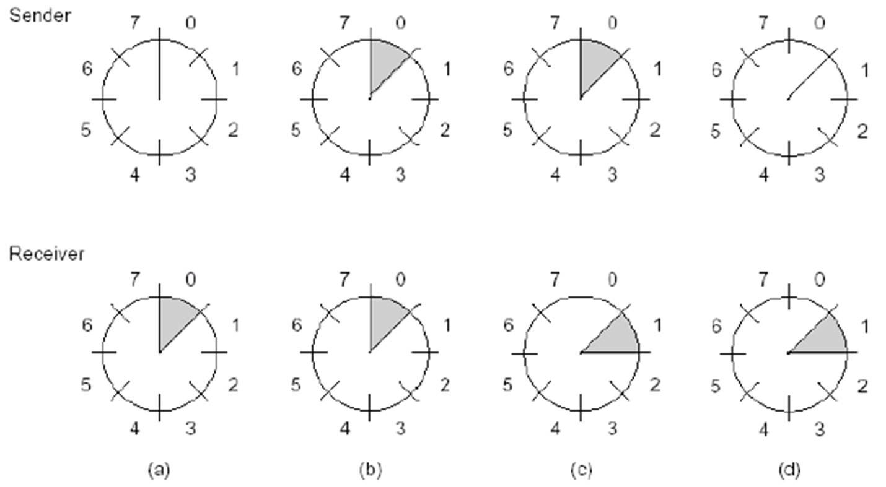

**原理**

- 接收方收到帧后，首先核对是否为预期帧号(frame_expected)，如果是的，则接收并frame_expected+1，即移动接收窗口。 
-  发送端收到应答帧，核对响应帧号next_frame_to_send，核对无误后，从网络层取新的帧，并执行next_frame_to_send+1，即移动发送窗口。如核对帧号不正确，则不移动窗口

- 窗口设置
  - 滑动窗口最大值：MAX_SEQ = 1
  - 通信双方初始值：seq =0, ack=1（期待接收seq=0）
- 窗口滑动机制
  - A首先发送数据帧（seq=0, ack=1, A0）
  - B收到A0，发送捎带确认帧（seq=0, ack=0, B0） 
  - A收到对A0的确认，滑动窗口，发送帧（seq=1, ack=0, A1）
- 特点
  - 序列号seq和确认值ack“0”“1”交替
  - 滑动窗口长度W=1，收到确认才移动窗口
  - 保证按顺序将接收到的正确帧只一次上交网络层

正常情况下发送滑动窗口机制

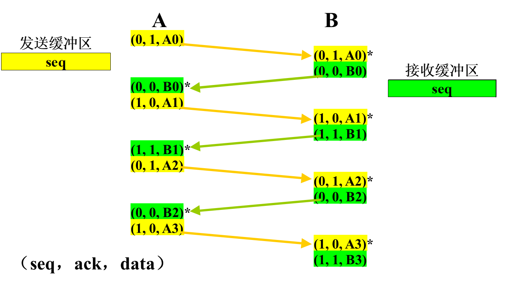

异常情况一：对重复帧的差错控制（定时器设置断了）

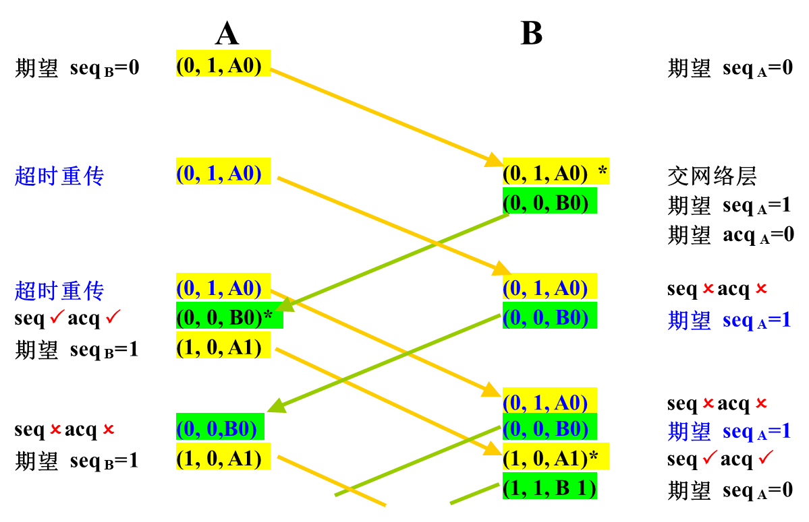

异常情况二：同步开始发送过程的差错控制（同时开始传输）

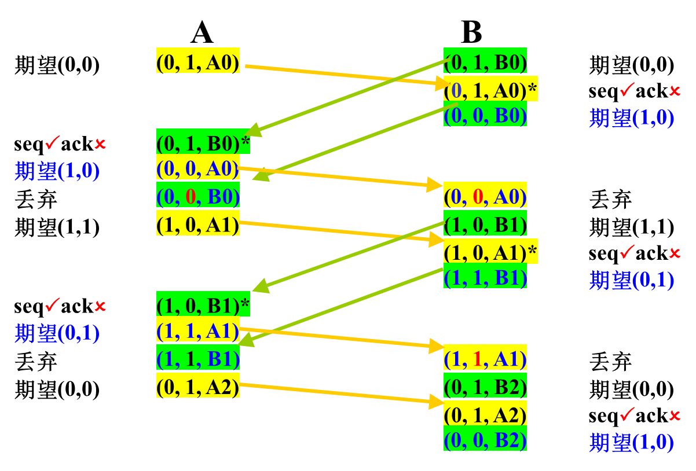

- **协议4的信道利用率**

  - 在协议4中假设:以下时间是可以忽略的：
    - 接收方处理到达帧的时间

  - 事实上，在低速信道上，来回时间（RTT：the round-trip time）可能非常大 ，发送方在这段时间处于blocked状态

  - 如果:
    - 信道传输速率是： b bps
    - 每帧的大小是： k bits
    - 来回时间是： R sec
    - 则信道的利用率是：

- **提高信道利用率的方法**

- **计算最合适的w值**

  - 信道上的容量：一帧从发送方传输到接收期间可容纳的帧数量

  - 带宽-延迟积：BD

  - 窗口值：w=2*BD+1

    实际上: w≤2*BD+1

### **回退n帧协议**

- 接收方的接收策略选择：
  - 丢弃错帧，其后续帧因不是期望接收帧也被丢弃（接收窗口为1）。
- 发送方的重传策略选择：
  - 缓存在发送窗口中的出错帧以及其后续帧全部重发。

- 基本概念
  - 定义序列号seq的取值范围和滑动窗口长度W
  - 发送方连续发送至发送窗口满
  - 接收窗口为1，对出错帧不确认（引发超时）
  - 发送方超时重传，从未被确认帧开始

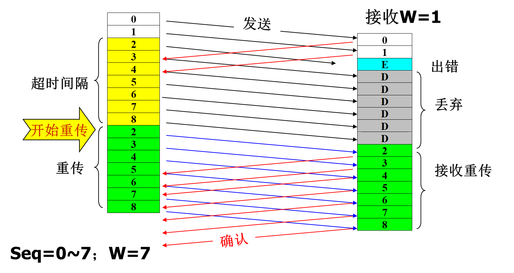

- 工作原理分析
  - 发送方
    - 正常发送
      - 对帧编号，待确认帧缓存
    - 收到确认
      - 释放确认帧所占缓冲区，滑动发送窗口
    - 差错帧超时时间到
      - 回退到超时帧（出错帧），顺序重传最后被确认帧以后的缓冲区中缓存的帧
  - 接收方
    - 收到每一个期望的正确帧
      - 上交网络层、回送确认
    - 收到出错帧或非期望帧
      - 丢弃，回送对接收的最后正确帧的确认
    - 收到重传帧（即为一个期望的正确帧）

### **选择重传协议**

- 接收方的接收策略选择：
  - 丢弃错帧，缓存后续正确接收帧；
- 发送方的重传策略选择：
  - 只重发出错帧。

- 基本概念
  - 接收窗口存储差错帧后继的所有正确帧
  - 发送方只重传差错帧
  - 接收方接收重传帧，按正确顺序将分组提交网络层

- 工作原理分析
  - 发送方
    - 正常发送
      - 对帧编号，待确认帧缓存
    - 收到确认
      - 释放确认帧所占缓冲区，滑动发送窗口
    - 差错帧超时时间到
      - **重传缓存的最后被确认帧以后的那一帧**
  - 接收方
    - 正常接收
      - 上交网络层、回送确认，滑动接收窗口
    - 收到非期望的正确帧
      - **缓存**，回送对接收的最后正确帧的确认
    - 收到重传帧
      - **将缓存帧排序上交**，回送确认，滑动接收窗口
    - 接收方缓存，乱序帧，需正确排序

- NAK的作用
  - 加快出错帧的重传
  - 对出错帧回送否定确认，使发方不再等到超时再重传

- 差错控制策略比较和滑动窗口大小的选择

  - 差错控制策略比较

    - 回退n帧
      - 发送方需要较大的缓冲区，以便重传
      - 重传帧数多，适于信道出错率较少的情况
    - 选择重传
      - 接收方需要较大的缓冲区，以便按正确顺序将分组提交网络层
      - 重传帧数少，适于信道质量不好的情况

  - 滑动窗口长度w的选择

    - 协议5（回退n帧）

      - MAX_SEQ = 7（ Seq=0～ MAX_SEQ ）

        W =  7

      - W = MAX_SEQ 

      - W = 8，异常情况

        

        W = 7

        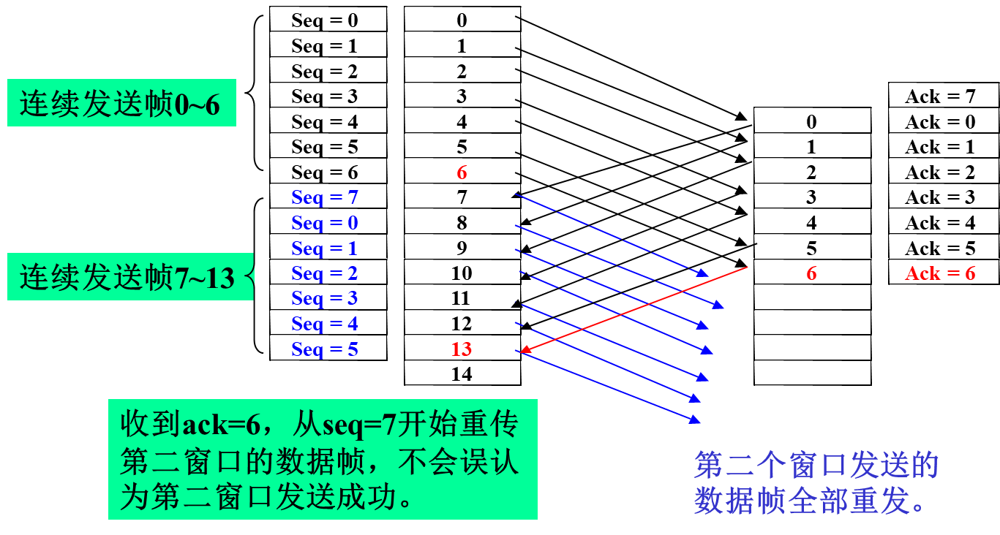

    - 协议6（选择重传）

      - MAX_SEQ =15（ Seq=0～ MAX_SEQ ）

        W = 8 

      - MAX_SEQ =7（ Seq=0～ MAX_SEQ ）

        W = 4 

      - W= (MAX_SEQ + 1) / 2

      - 保证新老窗口不重叠

        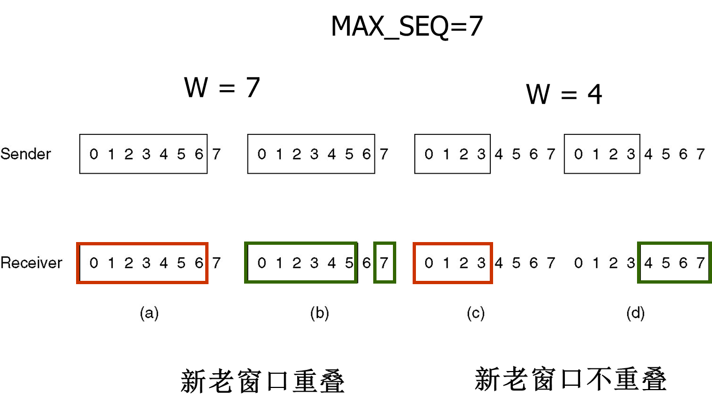

**三个协议的窗口大小**

- One-Bit sliding window（ 协议4):
  - 0 <= size of Sending window<=1
  - size of receiving window=1 
- Go-back-N (协议5)：
  - 0 <=size of Sending window<=MAX_SEQ
  - size of receiving window=1 
- Selective Repeat (协议6)：　
  - 0 <= size of Sending window<= (MAX_SEQ+1)/2
  - size of receiving window= (MAX_SEQ+1)/2

## 链路层协议实例

**面向位的数据链路协议**

- 典型协议：HDLC (High-level Data Link Control)
  - 特性：
    - 面向比特、同步传输（bit-synchronous）
  - 工作原理：数据帧的可靠传输
    - 面向连接（建立/释放逻辑连接）
    - 流控制（滑动窗口seq/ack ）
    - 差错控制（go back n / select repeat）

**面向字符的数据链路协议**

- SLIP（Serial Line IP）

  - 特点
    - 面向字符，字符填充成帧；在IP分组首尾加标识(0xC0)
  - 不足之处
    - 无任何差错控制功能；对网络层的服务只支持IP协议；双方必须拥有固定的IP地址；不提供身份认证等网络安全手段；非标准化，存在许多相互不兼容的版本

- 点到点协议PPP（Point-to-Point Protocol）

  -  对SLIP改进

  - 支持动态分配IP地址；具有差错控制和身份认证等功能

  - PPP 是一种在链路上传输分组的常用方法

    - 采用字节填充的帧界法 (0x7E)
    - “无序号幁” (无确认无连接) 用于承载IP分组
    - 采用校验和检错

  - PPP有3个主要特征: 

    - 一种成帧的方法 

      

    - 一个链路控制协议

      - LCP (Link Control Protocol). 
      - 提供了建立、配置、维护和终止点对点链接的方法 

    - 一种协商网络层选项的方式

      -  NCP (Network Control Protocol)

      

  -  PPP两种认证协议：PAP and CHAP

    - PAP是一种简单的明文验证方式。
      - NAS（Network Access Server）要求用户提供用户名和口令，
      - 这种验证方式的安全性较差，第三方可以很容易获取被传送的用户名和口令。
    - CHAP是一种加密的验证方式，能够避免
      - 建立连接时传送用户的真实密码
        NAS向远程用户发送一个挑战口令（challenge），其中包括会话ID和一个任意生成的挑战字串（arbitrary challengestring）。远程客户必须使用MD5单向哈希算法返回用户名和加密的挑战口令。

  - 点到点协议PPP的功能

    - 处理错误监测 
    - 支持多种协议（IP、IPX、DECnet等）
    -  连接时允许协商IP地址
    -  允许身份认证 

# 介质访问控制子层

## 多路访问协议

**广播网络需要解决的问题**

- 数据通信⽅式
  - 单播（unicast）：One - to - One
  - ⼴播（broadcast)：One - to - Everyone of the whole
  - 组播（multicast）：One - to - A part of the whole

- ⼴播⽹络⾯临的问题
  - 可能两个（或更多）站点同时请求占⽤信道

- 解决办法：介质的多路访问控制
  - 在多路访问信道上确定下⼀个使⽤者

**怎样分配信道（介质访问控制）？**

- 静态分配

  - 只有⼀个站/⽤户使⽤信道

  - 不⽤的就浪费了

    >频分多路复⽤FDM（Frequency Division Multiplexing）
    >时分多路复⽤TDM（Time Division Multiplexing）

  - 静态信道分配的排队模型

    

  - 信道平均延迟时间

    

  - 信道N等分
    - 问题
      - 资源分配不合理，不满⾜⽤户对资源占⽤的不同需求
      - 有资源浪费，效率低
      - 延迟时间增⼤N倍
    - 适⽤情况
      - 适于⽤户数量少且⽤户数⽬固定的情况
      - 适于通信量⼤且流量稳定的情况
      - 不适⽤于突发性业务的情况

- 动态分配

  - 信道是开放的

  - 没有预分配

  - 基本思想

    - 通过多路访问协议（ Multiple Access Protocol ）动态分配信道资源，提⾼信道利⽤率

  - 基本概念（五个关键假设， P201 ）

    - 信道争⽤模型
      - 流量独⽴（假设1）
      - 单信道（假设2）
    - 帧的发送⽅式（假设4）
    - 信道的状态与检测
      - 冲突可观察（假设3）
      - 载波侦听与否 （假设5）
        - 载波侦听（Carrier sense）：
          - 所有的站在使⽤信道前，都可检测到当前信道是否正被使⽤，如信道正忙，则等待
        - ⾮载波侦听（no Carrier sense）：
          - 所有的站在使⽤信道前，都不检测当前信道是否正被使⽤，只是盲⽬发送
    - 信道状态

    

### 多路访问协议

- **随机访问协议（Random Access）**

  - 特点：站点争⽤信道，可能出现站点之间的冲突

  - 典型的随机访问协议

    - **纯ALOHA协议**

      - 纯ALOHA (Pure ALOHA)⼯作原理

        - 任何⼀个站都可以在帧⽣成后⽴即发送（可能冲突），并通过信号的反馈，检测信道，以确定发送是否成功。如发送失败，则经随机延时后再发送。
        - 每个站点可在任意时间发送数据（不关⼼信道是否已被占⽤）；
        - 两个以上站点都在发送数据时就会发⽣冲突。

      - 纯ALOHA的数学描述

        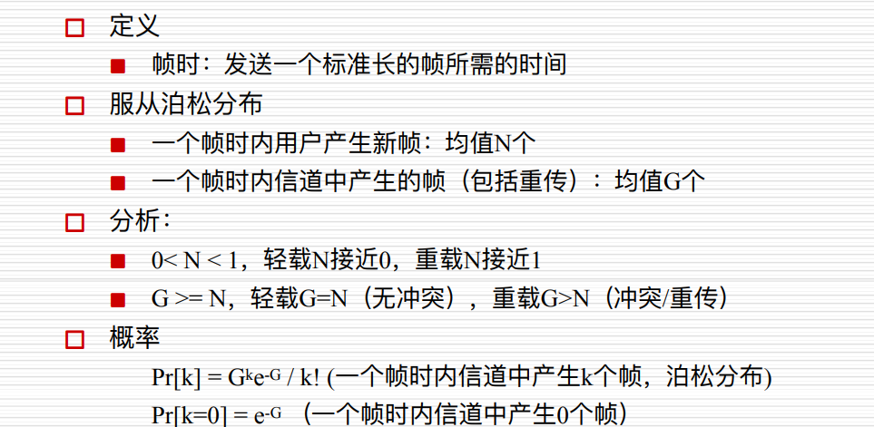

      - 性能分析

        - 吞吐率(Throughout) S
          - 在发送时间T内发送成功的平均帧数。显然，0<S<1
          - S = 1时分组⼀个接⼀个地发送出去，帧之间没有空隙。⼀般⽤S接近于1的程度来衡量信道的利⽤率。
        - 运载负载(Carried load) G，⼜称⽹络负载
          - 时间T内所有通信站总共发送的帧平均值(包括原发和重发的分组)。
          - 显然，G≧ S，只有在不发⽣冲突时G才等于S。当重负载(G>>1) 时，冲突频繁。
        - P0：P0是⼀帧发送成功(即未发⽣冲突)的概率。就是发送成功的分组在已发送分组的总数中所占
          的⽐例。
          - S=G×P0
          - P0的含义是在连续两个T的时间内都没有其它帧⽣成的概率，即连续两个T的时间内都⽣成0帧的概率(P[0])之乘积。
          - ⽣成0帧的概率(即不⽣成帧的概率)，即是将k=0代⼊上式，得：P[0] = e^-G
            - 注意：P0与P[0]是两个完全不同的概念。
          - 所以：P0= P[0]P[0] = (e^-G)^2= e^-2G

      - 纯ALOHA协议的性能

        

    - **分隙ALOHA协议**

      - 分隙ALOHA (Slotted ALOHA)⼯作原理

        - 分隙ALOHA是把时间分成时隙（时间⽚）
        - 时隙的⻓度对应⼀帧的传输时间。
        - 新帧的产⽣是随机的，但分隙ALOHA不允许随机发送，凡帧的发送必须在时隙的起点。
        - 冲突只发⽣在时隙的起点，冲突发⽣时只浪费⼀个时隙。⼀旦某个站占⽤时隙并发送成功，则在该时隙内不会出现冲突。

      - 分隙ALOHA的性能分析

        

    - **纯ALOHA和时隙ALOHA**

      - ALOHA

        - 冲突危险期
          - 时间⻓度：2t
          - ⽣成帧均值：2G
          - 不遭冲突概率：P0=e^-2G
        - 吞吐量：S=G\*P0=G*e^-2G

      - 时隙（Slotted，分隙）ALOHA

        - 以帧时t为离散间隔
        - 冲突危险期减半：t
        - 吞吐量：S=G\*P0=G*e^-G

        

    - **CSMA协议**

      - CSMA：Carrier Sense Multiple Access

      - 特点：“先听后发”

        - 改进ALOHA协议的侦听/发送策略

      - 分类

        - **⾮持续式**
          - 特点：
            1. 经侦听，如果介质空闲，开始发送。
            2. 如果介质忙，则等待⼀个随机分布的时间，然后重复步骤1。
          - 等待⼀个随机时间可以减少再次碰撞冲突的可能性。但缺点是等待时间内介质上没有数据传送，这段时间是浪费的。
        - **持续式**
          - **1-持续CSMA**
            - 特点：
              1. 经侦听，如介质空闲，则发送。
              2. 如介质忙，持续侦听，⼀旦空闲⽴即发送。
              3. 如果发⽣冲突，等待⼀个随机分布的时间再重复步骤1。
            - 持续式的延迟时间要少于⾮持续式。
            - 主要问题是：如果两个以上的站等待发送，⼀旦介质空闲就⼀定会发⽣冲突。
          - **P-持续CSMA**
            - 特点：
              1. 经侦听，如介质空闲，那么以p的概率发送，以(1–p)的概率延迟⼀个时间单元发送。
              2. 如介质忙，持续侦听，⼀旦空闲重复1。
              3. 如果发送已推迟⼀个时间单元，再重复步骤1。
            - 可⻅，1-持续式是p-持续式的特例。

      - 冲突窗口

        >发⽣冲突时间的上限，即发送站发出帧后能检测到碰撞的最⻓时间，数值上等于最远两站传播时间的两倍，即2τ

        - 冲突窗口的计算

          

    - **CSMA/CD协议**（以太⽹采⽤此协议）

      - CSMA with Collision Detection
        “先听后发、边发边听”

      - 特点：

        1. 经侦听，如介质空闲，则发送。
        2. 如介质忙，持续侦听，⼀旦空闲⽴即发送。
        3. 如果发⽣冲突，等待⼀个随机分布的时间再重复步骤1。

      - 所有⼯作站在发送的同时也接收⾃⼰的信号，监测发送的情况，⼀旦收到的信号与发出的不⼀致，就说明发⽣了冲突。

      - 发送站感知冲突后⽴即停⽌帧的发送，并且发⼀个简短的堵塞信号(称强化冲突信号，Jamming signal)，通知⽹上各站已经发⽣冲突，本站及⽹上所有站都等待⼀段随机分布的时间，然后再按CSMA/CD⽅式重发该帧。

      - 概念模型

        

        >信道的三种状态：
        >
        >传输周期：⼀个站点使⽤信道，其他站点禁⽌使⽤
        >
        >竞争周期：所有站点都有权尝试使⽤信道，争⽤时间槽
        >
        >空闲周期：所有站点都不使⽤信道

      - 冲突检测和处理

        - 冲突检测⽅法
          - ⽐较发送信号（A->B）与回复信号（A->B）的能量或脉冲宽度变化
          - 最⼤冲突检测时间（冲突窗⼝）：两个最远距离站点间的传输时间为t，则⽹络的最⼤冲突检测时间为2t。
        - 冲突检测的要求
          - 要求1：时隙宽度 = 最⼤冲突检测时间
            - 保证在⼀个时隙内能够检测到最远距离的冲突
          - 要求2：发送有效帧的时间  最⼤冲突检测时间
            - 防⽌因在发⽣冲突时已完成短帧发送⽽造成的异常情况
        - 冲突后，发送帧重传的策略

        > 先听后发，边发边听；一旦冲突，立即停发；等待时机，然后再听

- 受控访问协议（Controlled Access）

  - 特点：站点被分配占⽤信道，⽆冲突

  - 位图协议（预留协议）

    - 如有N个站点共享信道，编号为0 ~N-1，其竞争周期将分为N个时隙，每个站点占有⼀个时隙，如某站准备发送，则可在属于它的时隙内填⼊1，⼀个竞争周期后，则将按顺序发送，不会产⽣冲突

      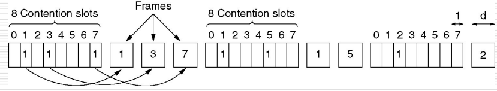

    - 位图协议效率分析

      - 假设系统中有N个⽤户，需N个时隙
      - 在低负荷条件下，如每帧的数据量为d bit，额外⽐特数为N（等待时隙），则效率为d/(d+N)
      - 在⾼负荷条件下，即所有的站都希望⼀帧接⼀帧发送，位图按平均分配给每⼀帧，⼀帧只占⼀位，则效率为d/(d+1)
      - 缺点：位图协议⽆法考虑优先级

  - 令牌

    - 抓取到令牌的⼯作站可以发送⼀帧。

    - 除了环，令牌也可以运⾏在其它拓扑上。

      

      

  - 二进制倒计数协议

    - 需要⼀个仲裁机构决定哪个站点发送

    - 基本思想

      - 把站号按相同⻓度的⼆进制数编号，需要发送的站逐个按⾼位到低位在争⽤周期开始时发送，凡低序号的站点发现有⾼序号站点也希望发送，则退出竞争，即：**高序号站点优先**

      

    - 信道效率分析

      - N个站的⼆进制编码所需位数是log2N位
      - 信道的效率为：d/(d+log2N)
      - 如果规定每个帧的帧头为发送地址，即竞争的同时也在发送。则效率为100%

- 有限竞争协议

  - 有限竞争协议（Limited Contention Protocol）

    - 在低负荷时使⽤竞争法，以减少延迟时间。
    - 在⾼负荷时，使⽤⽆冲突法，以获得⾼的信道效率。

  - 适应树搜索协议（Adaptive Tree Walk Protocol）

    

    - ⽐喻：⼆战时，美军⾎液检查病毒的⽅法
    - 在⼀次成功传输后的第⼀个竞争时隙，所有站点同时竞争。如果只有⼀个站点申请，则获得信道。否则在下⼀竞争时隙，有⼀半站点参与竞争（递归），下⼀时隙由另⼀半站点参与竞争
    - 即将所有站点构成⼀棵完全⼆叉树。对⼆叉树作深度优先搜索

- 波分多路访问协议

- 无线局域网协议

## 以太网

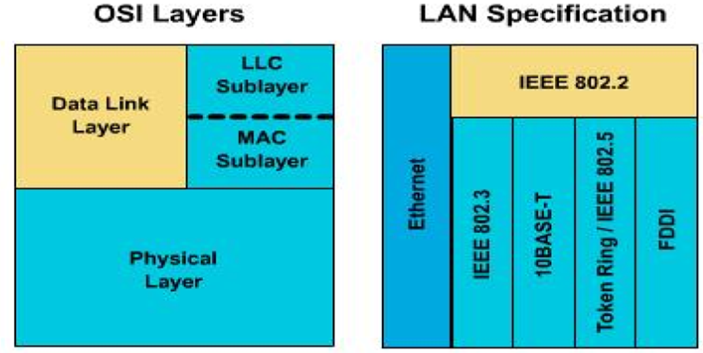

**IEEE以太网命名规则**

- 10Base2（IEEE 802.3a）
  - –10：传输带宽（单位Mbps）
  - –Base：基带传输
  - –2（或5）：支持的分段长度（100米为单位，四舍五入）
- 10Base-TX（IEEE 802.3X）
  - –T：铜制非屏蔽双绞线
  - –F：表示光缆

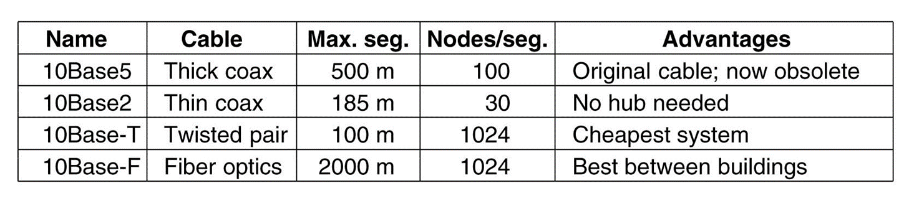

**10Base-T的拓扑结构**

- 物理连接是星型/扩展星型结构
- 逻辑上是总线结构（站点争用总线）

**10Base-T的特点**

- 与同轴电缆相比的优点
  - 安装成本大大降低
  - 即插即用，组网灵活
  - 星型结构，故障隔离
  - 适于大批量制造
  - 具有开放式标准的互操作能力
- 问题
  - 多用户共享一条10M速率信道

### **IEEE 802标准**

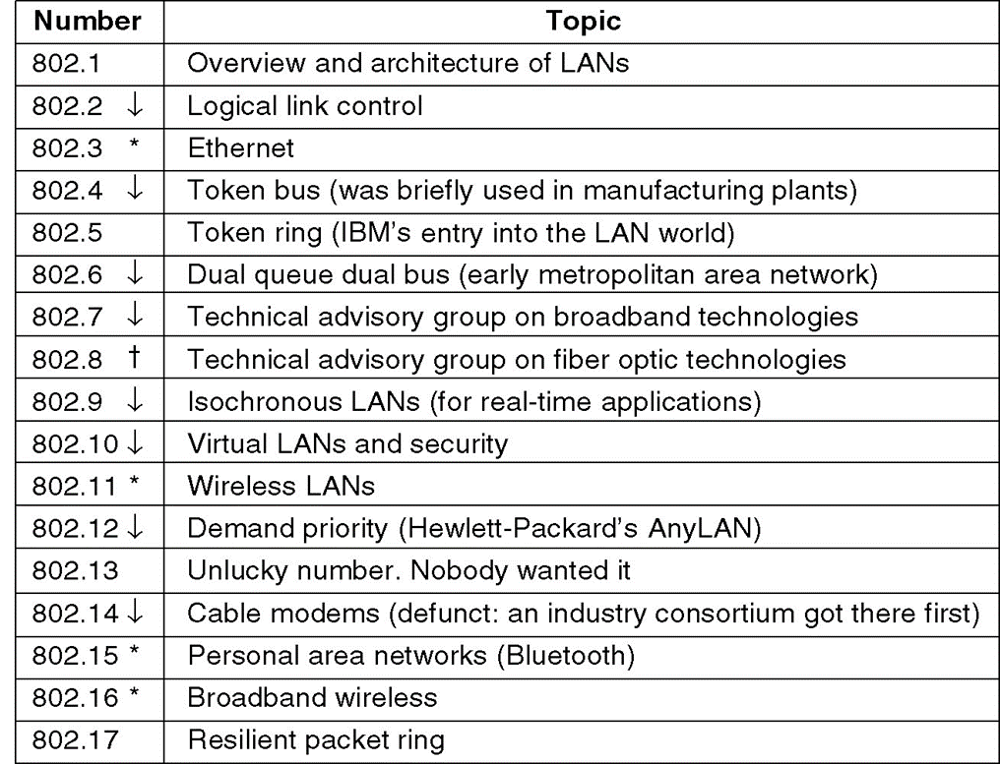

**以太网编码**

- 不采用二进制编码（NRZ）

- 以太网采用曼彻斯特编码
  - 1：高电压到低电压
  
  - 0：低电压到高电压
  
  - 电压值
    - +0.85 volt: high signal
    - -0.85 volt: low signal
    - 0 volt: DC value
    
  - 比特率b = 10 Mbps
    波特率B = 20 MHz（信号的变化频率）
    
    
  
- 差分曼彻斯特编码
  - 802.5采用

### **IEEE802.3原理**

> IEEE802.3协议描述了运行在各种介质上1 Mb/s~10 Mb/s的1-持续CSMA/CD协议的局域网标准。

### **IEEE802.3帧格式**

- 前导码与帧起始字段 
  - 前导码：7个字节，10101010…101010比特序列。 
  - 帧起始符：1字节，10101011。
- 目的地址和源地址字段 
  - 地址字段长度：2个字节或6个字节 。
  - 目的地址类型：
    - 单一结点地址（unicast address）；
    - 组播地址（multicast address）；
    - 广播地址（broadcast address）。

- 6字节的MAC地址（48位）
  - 组播标志位：第40位
  - IP组播地址：01：00：5E：XX：XX：XX
  - 组播地址只能做目的地址
  - Ethernet地址 = Manufacture ID + NIC ID=24bit

- 长度字段
  - 帧的最小长度为64字节，最大长度为1518字节，不包括前导码。
- 数据字段 
  - LLC数据字段是帧的数据字段，长度最小为46个字节，如果少于46个字节，需要填充。
- 帧校验字段 
  - 采用32位的CRC校验
  - 校验范围：目的/源地址、长度、LLC数据等字段。

**为什么有效帧长度64 Byte?** 

- CSMA/CD的要求

  - 最短帧的发送时间>=争用时隙2

- 以太网（802.3）规定，在10Mbps局域网中

  - 时隙：2t=51.2 微秒

  - 最短帧长度：10Mbps× 2t/8 = 64 Byte

    或者：（51200/100ns）/8=64Byte

**二进制指数后退算法**

- 发送方在检测到冲突后，双方（或多方）都将延时一段时间，那么这段时间到底是多长？

- 冲突检测到后，时间被分成离散的时隙

- 时隙的长度等于信号在介质上来回传输时间（51.2µs ）

  >i次冲突后时间片为：
  >0 < i <=10 时，取( 0～2^i－1) ×2τ
  >10 < i < 16 时，取（0~1023） ×2τ
  >i > 16 时，放弃发送

**经典以太网**

- 10base2

- 10base5

- 10base-T

  - 提高负载的方法

    - 提速到100M

    - 全双工

    - 交换式网络，hub->swicth

**交换式以太网**

100Mbps以太网——802.3u

- 改进10Mbps以太网

- 改变编码方式、提高传输速率
  - 100Base-T4
    - 25MHz
    - 8B/6T（8个二进制位映射到6个三进制数上）编码方案
      - 3对线携带信息呈27种组合形式，至少传送4 bit信息
      - 信道的传输速率：4bit×25MHZ = 100Mbps
      - 半双工数据传输方式
  - 100Base-TX
    - 125MHz
    - 4B/5B编码方案（源自 FDDI技术）
      - 每5个时钟周期为一组，发送4 bit信息
      - 信道的传输速率：（4bit/5）×125MHZ = 100Mbps
      - 全双工数据传输方式

千兆位以太网（吉比特以太网，GE）——802.3z

### **以太网的特点**

- 强大的生命力
- 简单性和灵活性
- 易于维护
- 支持TCP/IP，互联容易
- 善于借鉴：4B/5B，8B/10B。。。

## 数据链路层交换

**基本概念**

- 广播式网络的最大传输距离和可容纳最大站点数量决定了网络要分段。

- 用同一传输介质连接起来的站点的集合称为一个网段。

- 局域网间数据帧交换称为L2交换。

- L2交换设备是网桥/交换机

  >网桥分段可以提升网络负载

### 网桥

**透明的网桥**

- 通过透明网桥（**transparent bridges** ）将多个LAN连接起来，硬件和软件不需要做任何的变化
- 透明网桥工作在混杂模式（promiscuous mode ），它接收所有跟它相联的LAN的帧
- 当一个帧到达网桥时，它必须作出丢弃（**discard**）还是转发（ **forward** ）的决策，如果是转发，它还要知道向哪个LAN转发
- 决策是通过在网桥内部的一张地址表（**hash table**）中查找目的MAC地址而作出的

**网桥如何维护它的内部转发表？**

- 初始时，这张表是空的
- 扩散算法（泛洪算法，flooding algorithm）
  - 当网桥不知道目的地址时（表中查不到），它会将这帧从除来的LAN外的所有LAN转发出去 
- 逆向学习（backward learning）
  - 网桥从到达帧的源地址认识到源地址对应的那台机是在帧来的那个LAN上，所以，把它写入MAC地址表
- 但是拓扑是变化的，网桥怎样适应这种变化？
  - 无论何时，凡往表中加入记录，也必须同时打下时戳
  - 到达帧的源地址在表中已有记录，将时戳更新为当前时间
  - 网桥周期性地扫描表，将那些超时的记录从表中删除

#### **工作原理**

- 当一帧到达时，网桥启动如下算法：
  - 如果源LAN和目的LAN相同，则丢弃该帧；
  - 如果源LAN和目的LAN不同，则转发该帧；
  - 如果目的LAN未知，则广播该帧。
- 每当一帧到达，上述算法都将执行一遍

>一个网段，或用中继器/集线器连接的多网段，称为冲突域。
>
>二层设备可以隔离冲突域

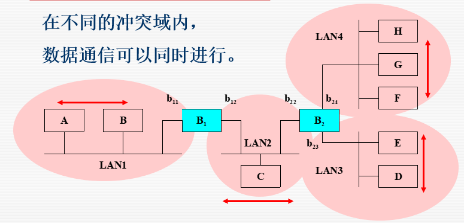

**网桥功能**

- 连接不同的LAN网段。
- 通过过滤部分交通流量，减少冲突的机会，改善网络性能。 
- 以网段分流交通，基于 MAC 地址过滤流量

**帧跨网络传输：扩散（Flooding）**
除了数据帧到来的线路以外，把收到的数据帧向所有输出线路上转发。

- 步骤1： A向H发送数据帧Fa

- 步骤2：网桥B1扩散帧Fa

  - B1从b11接收帧Fa，从b12向LAN2扩散帧Fa

  - B1从Fa的SA学到A

- 步骤3：网桥B2扩散帧Fa
- 步骤4： H向A回送数据帧Fh
- 步骤5：网桥B2 转发帧Fh

**所有站点都工作的地址表**

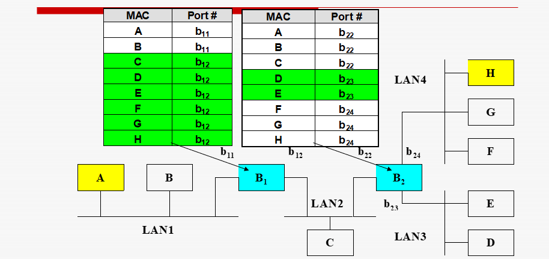

- 只有主动发送数据的站点填入表项
- 定时刷新表项，删除不活动的站点

**冗余交换拓扑**

- 为了可靠，采用冗余拓扑

- 可能带来的问题

  - 广播风暴

    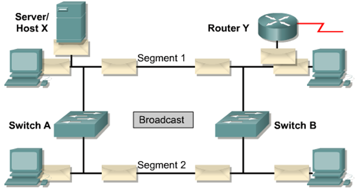

  - 多帧传送

    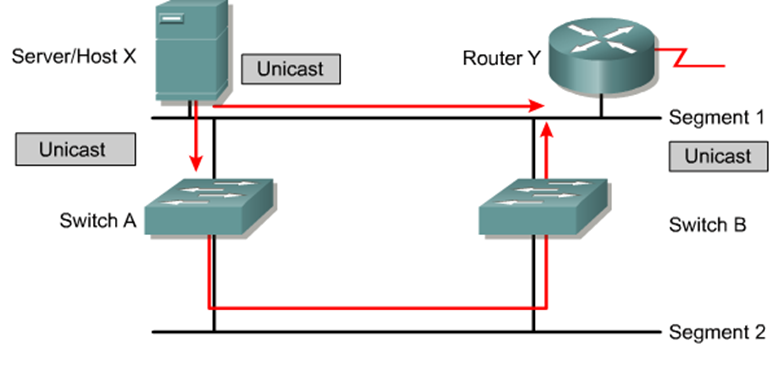

  - MAC地址库不稳定

    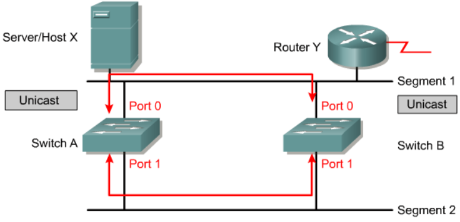

#### **生成树网桥**

- Spanning Tree Bridge
- 为了可靠，冗余结构
- 为了维护一个无环路的网络拓扑
- 透明网桥会产生无休止循环的问题，解决的办法就是将互联的网络在逻辑上构成生成树的拓扑结构。

- STP的运作

  - 每个网络一个根网桥 
  - 每个网桥一个根端口 
  - 每网段一个指定端口 
  - 非指定端口不被使用 

  

- 注意

  - 生成树算法，生成在逻辑上无回路的树，即生成树
  - 生成树算法能在有物理回路的网络中，生成一棵没有逻辑回路的生成树，但并不能保证其中的路径是最优的

**虚拟局域网（VLAN）**

**VLAN的实现**

- 基于端口

- 基于MAC地址

- 基于三层协议

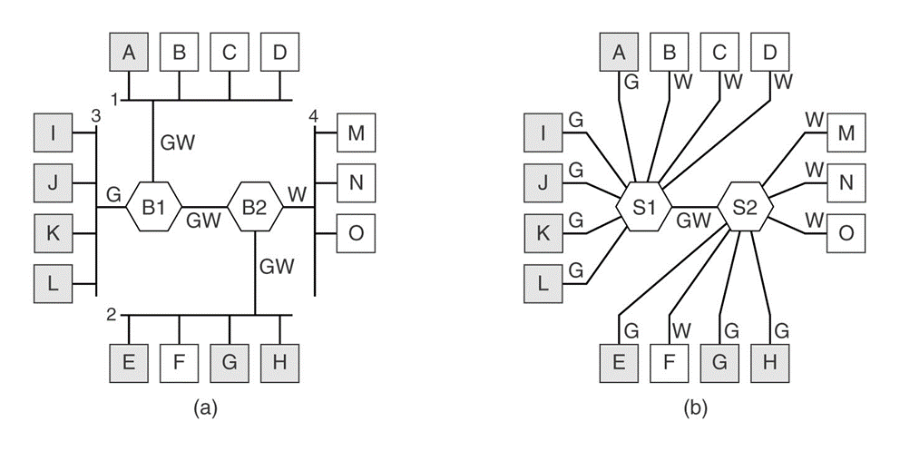

**IEEE 802.1Q 标准** 

- 一种幁标记方法：VLAN ID
- 通过trunk的时候使用
- 一个VLAN对应一个广播域
- 有了VLAN，可使用二层交换机实现广播域的分割
- 当一个VLAN跨越几个交换机的时候，使用802.1Q穿越连接交换机的干线

#### **二层设备**

> 二层（数据链路层）设备：网卡、网桥、交换机

**NIC网卡**

- Nework Interface Card
- 为主机提供介质的访问。
- MAC地址烧在网卡的 ROM中
- 功能
  - Logical link control (LLC): 和上层通信
  - Naming: 提供一个独特的 MAC 地址标识符
  - Framing: 封装过程的一部分，为传输比特流打包
  - Media Access Control (MAC): 为访问共享介质提供访问策略
  - Signaling:创建信号和与介质的接口

### 交换机

- LAN 交换机是**多端口网桥**，
- 连接 LAN 网段。
- 使用一张 MAC 表，来决定一帧转发的端口
- 交换机常被用来替换集线器（hub），以改善现有网络性能。
- 增加带宽。
- 比网桥更高的交换速度。
- 支持新的功能，如VLAN。

**LAN交换机中地址表的维护**

- 动态更新
  - 直接读取数据包中的源地址信息，存入CAM，如在CAM中没有找到所需的地址，添加到CAM中。
- 删除过时的地址记录：时间标记
  - 每增加一条记录，为它打上时间标记；
  - 每引用或找到某条记录，为它打上新的时间标记。
  - 当某条地址记录超过一定时间没被引用，则删除它。

#### **工作原理**

- oflooding --当目的地址未知或为广播地址时，桥发送帧到除源端口之外的每个端口

- olearning --通过读取每个帧的源地址和对应源端口来学习连在网段上的每个设备的地址

- forwarding --对于已学到的目的地址，桥将直接发送帧到对应的目的设备所在端口

- filtering --如果目的地址和源地址在同一端口，桥将丢掉帧

**交换机的作用**

- 使网络段处于无冲突环境
- LAN交换机利用现有硬件设备
- 使配置和管理更加灵活方便

#### **交换模式**

- 存储转发
- 直通交换（贯穿）
- 无分片交换

**无冲突域**

- 微分段：LAN被交换机分隔开的网段，在 一个大的冲突域中产生无冲突域。
- 虚拟线路：在交换机内部把段连接成一个 虚拟网络的电路，只在需要时才成立

# 网络层

## 网络层概述

### 网络层的主要功能

> 主要功能就是：将分组从源机⼀路送到⽬的机

### 网络层提供的服务

- ⾯向连接的服务：X.25, ATM

  虚电路⼦⽹（Virtual-circuit subnet）

  - 在连接建⽴的时候选路（Select a path）
  - 每个分组携带⼀个连接号（connection-number）
  - 当通信完成后，连接拆除

- ⽆连接的服务：IP

  数据报⼦⽹（Datagram subnet）

  - 每个数据报携带⽬的地址
  - 每个报⽂独⽴寻径

**两种通信子网的比较**

虚电路⼦⽹

- 通过路径选择后建⽴连接
- 到终点后毋需重新排序
- 每个分组不需带⽬的地址，但带虚电路号（较短）
- 主机⼯作量少，差错检查、流量控制对⽤户透明。

数据报⼦⽹

- ⼦⽹⼯作简单，通信费⽤低。
- 每个分组分别选择最佳路径，健壮性较好
- 到终点后需重新排序
- 差错控制和排序⼯作由协议⾼层（主机）完成
- 每个分组必须带⽬的地址，路径选择灵活。

### 路由选择协议概述

**路由表的建立**

静态路由

- 由管理员⼿⼯配置的：ip route

动态路由

路由选择算法

- 距离⽮量路由选择（D-V）
- 链路状态路由选择（L-S）

**选择路由算法的度量参数**

- 路径⻓度：由⽹络管理员定义每条⽹络链路的代价(cost)，从源到宿的代价总和为路径⻓度，**hop (跳数)**
- 可靠性：链路数据传输的可靠性（误码率）
- 延迟：数据包从源到宿需要花费的传输时间
- **带宽**：链路的最⼤传输能⼒以及⽹络流量
- 负载 ：⽹络资源（例如路由器的CPU）的使⽤率
- 通信代价：占⽤通信线路的费⽤

**最优化原理（ Optimization principle** 

- 如果⼀个路由器 **J 处在路由器I到路由器K的最优路径上**，那么，从路由器J到路由器K的最优路径也在同样的这条路径上。

- 沉落树（ sink tree ）：从所有的源到⼀个给定的⽬的的最优路径形成的⼀棵树，**树根是⽬的**。

**沉落树/汇集树（Sink tree）**

- 汇集树不必是唯⼀的。
- 所有**路由算法的目的**就是：为所有的路由器发现和使⽤汇集树。
- 最短路径路由选择
  Dijkstra 算法（1959）：使⽤权重（P282）计算通信线路中的最短（优，代价最⼩）路径。

#### **扩散/泛洪法（Flooding)** 

- 每个到达分组都被从除了到达端⼝外的所有其它端⼝转发出去(不计算路径，有路就⾛)
- 例如，从节点5 到节点 4：packet from 5→1,2；2→3,6；3→6,4；6→3,7；7→4
- 问题：**重复分组**，例如 3，6

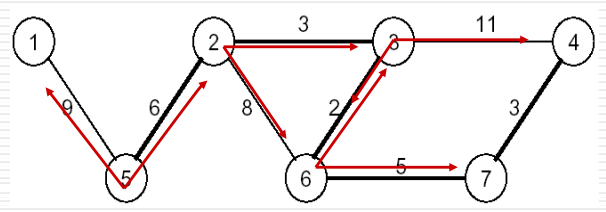

**解决办法：**

- 在分组头增加⼀个**计数器（counter）**，每经过⼀个节点，计算器减 1 ，当计数器变为零时，报⽂被丢弃。

- 每个节点设⽴⼀个**登记表**，当分组第⼆次到达时，被丢弃。

- **选择性扩散**

缺点：重复分组太多，浪费带宽
优点：可靠性⾼、路径最短/优，常⽤于军事

## DV算法（RIP）

- 距离矢量路由选择：每个路由器维护一张表，**表中列出了当前已知的到每个目标的最佳距离**，以及为了到达那个目标，应该从哪个目**标转发的线路（端口）**

- D-V 算法是动态的和分布式的，它常被用于小型网络，RIP是一个典型的 DV
  - RIP：Routing information protocol，路由选择信息协议，1988，RFC1058

### **DV的工作原理**

- 每个路由器（节点）**维护**两个向量， **Di 和 Si** ，分别表示从该路由器到所有其它路由器的**距离**及相应的**下一跳（next hop）**
- 在邻居路由器之间**交换**路由信息（矢量）
- 每个路由器（节点）根据收到的矢量信息，**更新**自己的路由表

>di1：从节点i到节点1的度量（代价）
>Si1 ：沿着从节点i到节点1的最优路径上的下一跳
>n ：网络中的节点数

**更新路由表**

当邻居间交换了矢量信息之后：

更新距离： dij= Min[dix+ dxj] ( x ∈A )

- A—节点i的邻居集合

  - dij—从节点 i 到节点 j 的最短距离

  - dix—从节点 i 到节点 x 的最短距离

  - dxj—从节点 x 到节点 j 的最短距离

- 更新下一跳： Sij= x

**D-V算法的特点**

优点

- 简单

缺点

- 交换的信息太大了
- 路由信息传播慢，可能导致路径信息不一致
- 收敛慢，度量计数到无穷
- 不适合大型的网络

**RIP的主要特点**

- RIP 是一种典型的 D-V 路由选择协议
- RIP 采用了**跳数（hop）**作为量度（ metric）
- 当量度超过 15 跳，目的被认为不可达
- 默认地，每30秒钟交换一次矢量/向量信息（全部路由表）

### RIP的工作原理

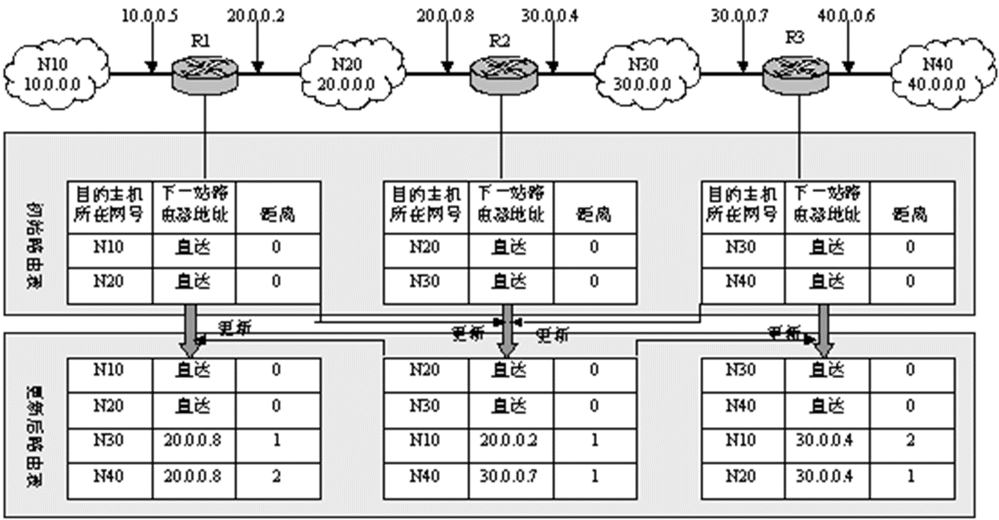

**RIP的主要缺陷** 

- 不能到达量度超过15跳的目标网络
- RIP的度量（代价）是跳数，即沿途经过的路由器的个数，有时候，并不合理，不能真正反映网络的状况
- 实际运行中，会遇到度量计数到无穷、收敛慢等问题

### **DV路由的问题**

问题表现

- 路由环路（ routing loop）
- 计数到无穷问题（ Count to infinite）
- 收敛慢的问题（ slow Convergence ）

原因

- 相信错误的路由信息导致

>好消息跑得快，坏消息传得慢

错误路由消息的传播

>B向C传播了一条过时的错误信息

路由环并计数到无穷

>这条错误的路由信息在C与B之间不断复制和修改，并在网络中传播（殃及A），形成路径传播的环路。

### **解决办法** 

- 定义路径度量（代价）的最大值

  

  >到达信宿40.0.0.0的路由变化（定义Hop最大值为16）

- 提高收敛速度

  - 水平分割（ Split Horizon）

    - 分析路径环产生的原因

      B向C提供了一条过时的、错误的路由信息。

    - 能否避免事件发生？

      B必须经由C方可到达网络40.0.0.0，B不可能向C提供任何有价值的路由信息。

      修改B对C提供的路由，禁止B向C提供关于此信宿的路由信息。

    - 解决办法

      B告诉C一条在正常情况下不真实的消息：网络40.0.0.0不可达（距离为无穷）。

      

  - 毒性逆转（Poison Reverse）

    - 方法

      当C发现网络40.0.0.0发生故障时，主动将到达信宿的距离改为无穷。

    - 结果

      如果无其他到达信宿的路径，算法迅速收敛为信宿不可达。

      如果存在其他到达信宿的路径，C根据传播过来的信息再做修改。

      

  - 抑制定时器（ Hold-Down Timers）

    - 当C发现网络40.0.0.0发生故障时，启动抑制计时器

    - 在抑制计时期间内，C的策略

      如果网络状态转变，down -> up，关闭计时器，保留原有路由信息；

      如果收到来自B的关于信宿的路由信息，且路径比原有路径短，则关闭计时器，更新路由信息；

      如果无上述两种情况发生，计时器到时，更新路由为信宿不可达。

      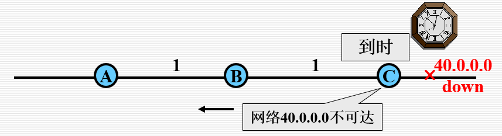

  - 触发更新（Triggered Updates ）

    - 当C发现网络40.0.0.0发生故障时，不等下一刷新周期到来，立刻更改路由为“信宿不可达”

    - 引起全网的连锁反映，迅速刷新

      

## LS算法（OSPF）

### 链路状态路由Link State

链路状态路由的主要思想包括如下5个部分：

- **发现它的邻居节点**们，了解它们的网络地址
- **设置**到它的每个邻居的成本度量
- **构造一个分组**，包含它所了解到的所有信息
- **发送这个分组**给所有其他的路由器
- **计算**到每个路由器的最短路径

#### 发现邻居节点

- 当一个路由器启动的时候，在每个点到点的线路发送一个特别的**HELLO分组**

- 收到HELLO分组的路由器应该**回送一个应答**，应答中有它自己的名字 （采用一个全球唯一的名字 globally unique name）

- 当两个或更多的路由器被一个LAN连接起来，这个LAN被看作一个节点

  

#### 设置链路成本 

- 为了决定线路的开销，路由器发送一个特别的 ECHO 分组，**另一端立刻回送一个应答**	
- 通过测量往返时间（round-trip time） ，发送路由器可以获得一个合理的延迟估计值
  - 为了得到更好的结果，可多次测量，取均值

- 一种常用的选择
  - 与链路带宽成反比

#### 构造链路状态分组

- 链路状态分组构造后被发送给其他的路由器，分组中包含这些信息：

  - 发送方的标识（ID of the sender）

  - 序列号（sequence number ）

  - 年龄（age ）

  - 邻居列表（list of neighbors ）

  - 到邻居的成本/量度（delay to each neighbor ）

- 应该什么时候构造分组?

  周期性地构造和发送，或者有特别的事件发生时构造，比如某条线路或邻居down掉了

  

#### 发布链路状态分组

基本算法：

- 每个分组都包含一个**序列号**，序列号随着新分组产生而递增

- 路由器记录下他看见的所有 (**源路由器，序列号**)对 

- 当一个的新的分组到达时，路由器根据它的记录：

  - 如果该分组是新的，就被从除了来线路外的所有其他线路转发出去 ( **flooding，泛洪**)

  - 如果是重复分组，即被**丢弃(喜新厌旧)**

  - 如果该分组的序列号比对应的源路由器发送的**到过此地的分组的最大序列号还小**，则该分组被当作过时的信息而被拒绝

一些改进让基本算法更加健壮：

- 当一个链路状态分组到达某个路由器时，它首先被放到一个**保留区**中等待一段时间

- 如果来自相同路由器的另一个分组到达了，这两个分组的序列号会被比较：

  - **如果相等，是重复分组，丢弃**

  - **如果不相等，旧的那个被丢弃**

- 为了防止路由器到路由器的线路发生错误，所有的链路状态分组**都要被确认**

- 当一条线路空闲的时候，路由器扫描保留区，以便选择一个分组或确认，并将其发送出去

  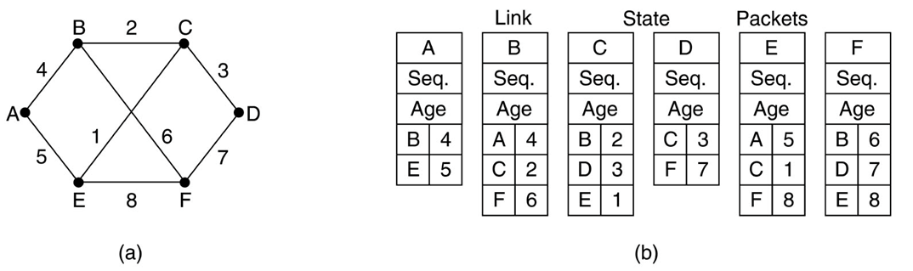

  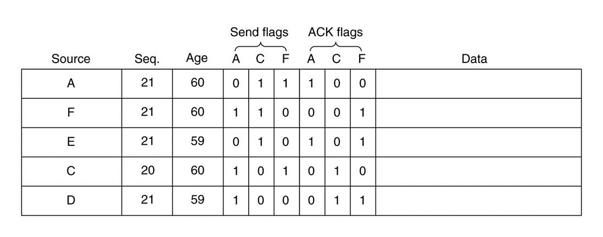

#### 计算新的路由路径

- 一旦一个路由器获得了全部的链路状态分组就可以构造出**全网络图**来了（Graph）
- 现在，可以使用 最短路径算法来计算路由器之间的最短路径了
- 计算结果一棵树，会形成相应的路由，安装在路由表中，引导数据分组的转发

### L-S 路由算法的特点

- 优点

  - 每个路由器的认识一致

  - 收敛快

  - 适合在大型网络里使用

- 缺点

  - 每个路由器需要较大的存储空间

  - 计算负担很大

### OSPFP

- 开放的路径优先（Open shortest path first）

- 使用图（graph）来表述真实的网络

  - 每个路由器/Lan都是一个节点

  - 测量代价/量度（metric）

- 计算最短路径

  

#### **OSFP概述**

- OSPF是一种基于开放标准的链路状态路由协议，是目前IGP中应用最广、性能最优的一个协议 
- OSPF可以在大型网络中使用
- 无路由自环 
- OSPF支持VLSM
- 使用带宽作为度量值（108/BW）
- 收敛速度快
- 通过分区实现高效的网络管理

- LSDB非常庞大，占用大量存储空间

- 计算最小生成树耗时增加，CPU负担很重

  - 一点变化都会引发从头重新计算

- 网络拓扑结构经常发生变化，网络经常处于“动荡”之中

  

  > **OSPF划分区域，分而治之**

  - ABR只转发主要路由信息

  - 更改，不需要重新计算，只需相应增删

  - ABR采用**聚合路由策略**，弱化拓扑变化带来的影响，如：

    - 10.1.0.0

    - 10.2.0.0

    - 10.3.0.0。。。。。。

    - 聚合为10.0.0.0/8

  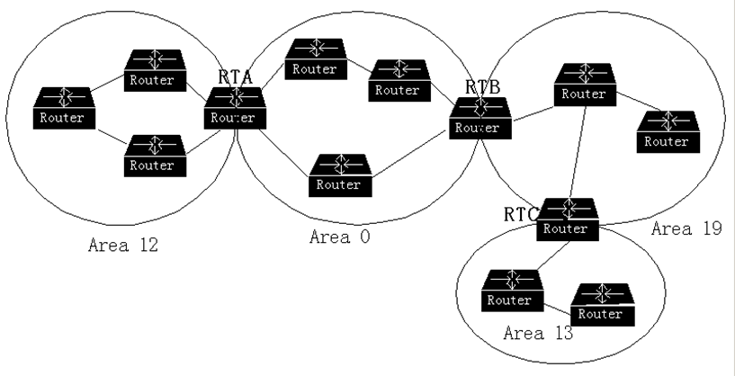

  >虚连接避免路由环路

**单区域OSPF**

- RouterID：一个32位的无符号整数，是一台路由器的唯一标识，在整个自治系统内唯一

- 协议号：IP头中代表OSPF报文的协议号是89

  

- TTL=1：通常OSPF报文不转发，只被传递一条，即在IP报头的TTL值被设为1，但虚联接除外

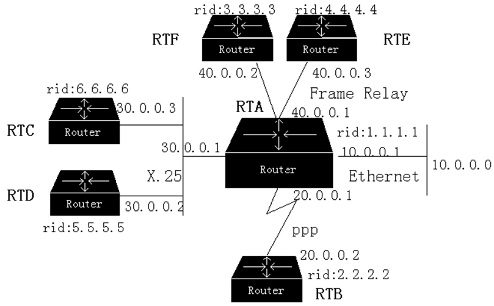

#### **OSPF消息(packet)类型** 

| OSPF数据包类型               | 描述                                           |
| ---------------------------- | ---------------------------------------------- |
| Type  1－Hello               | 与邻居建立和维护毗邻关系。                     |
| Type  2－数据库描述包（DD）  | 描述一个OSPF路由器的链路状态数据库内容。       |
| Type  3－链路状态请求（LSR） | 请求相邻路由器发送其链路状态数据库中的具体条目 |
| Type  4－链路状态更新（LSU） | 向邻居路由器发送链路状态通告                   |
| Type  5－链路状态确认（LSA） | 确认收到了邻居路由器的LSU                      |

**OSPF的运行步骤**

- 建立路由器毗邻关系

  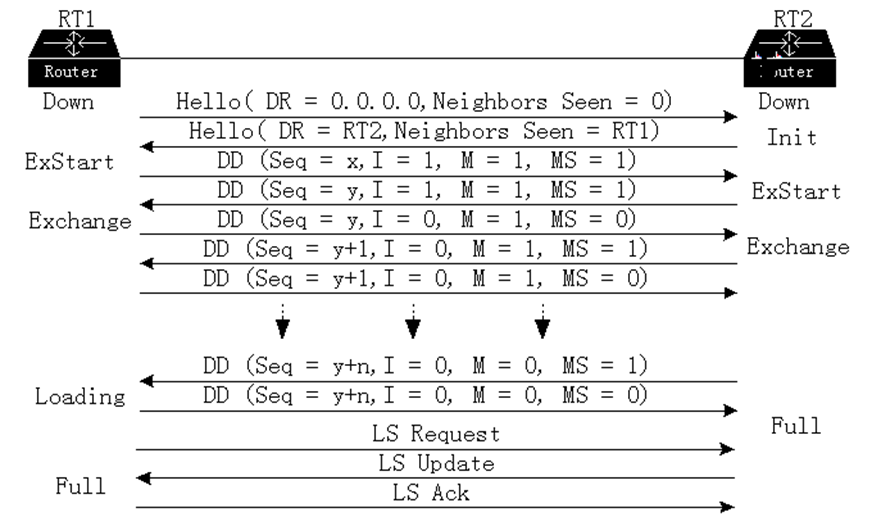

- 选举DR和BDR

- 发现路由

- 选择最佳路由

- 维护路由信息

#### **OSPF 状态**

- Down
- Init（初始）
- Two-way（双向）
- ExStart（准启动）
- Exchange（交换）
- Loading（加载）
- Full adjacency（全毗邻） 

#### DR选举

**为什么要选举DR和BDR？**

> DR：指定路由器
>
> BDR：备份指定路由器

**DR选举中的指导思想**

- 选举制
  - DR是路由器选出来的，而非人工指定的
- 终身制
  - DR一旦当选，除非路由器故障，否则不会更换
- 世袭制
  - DR选出的同时，也选出BDR，DR故障后，由BDR接替DR成为新的DR

**DR带来的变化**

- 同步的次数减少了**（O（n））**，减少了带宽的利用
- 路由器的角色：DR、BDR、DROther
- 路由器间的关系：Unknown、Neighbor、Adjacent

**选择最佳路由**

- SPF算法（Dijkstra算法）
- 负载均衡

**为什么说OSPF克服了了路由自环？**

- 每一条LSA都标记了生成者（用生成该LSA的路由器的RouterID标记），其他路由器只负责传输，这样不会在传输的过程中发生对该信息的改变和错误理解。
- 路由计算的算法是SPF，计算的结果是一棵树，路由是树上的叶子节点，从根节点到叶子节点是单向不可回复的路径。
- 区域之间通过规定骨干区域避免

**OSFP路由器种类**

- 内部路由器  --- 路由器所有接口都在一个区
- 主干路由器 ---  所有接口都在主干区域的路由器
- 区域边界路由器(ABR) ---路由器接口分属不同区域
- 自治域边界路由器 (ASBR) --- 路由器至少有一个接口不属于本自治域/OSPF. 

### **比较 DV 和 LS**

| 距离矢量路由               | 链路状态路由               |
| -------------------------- | -------------------------- |
| 从邻居看网络               | 整个网络的拓扑             |
| 在路由器间累加距离         | 计算最短路径               |
| 频繁、周期更新：慢收敛     | 事件触发更新：快收敛       |
| 在路由器间传递路由表的拷贝 | 在路由器间传递链路状态更新 |

### BGP

>BGP（border gateway protocol）（边界网关协议）
>
>不同的协议 - BGP (Border Gateway Protocol)运行在AS之间

- 外部网关路由器的典型路由策略涉及政治 political, 安全security, 或经济方面 economic 的考虑

- 根据BGP对于中转流量的兴趣，网络被分成三类：

  - stub 自治系统

  - 多连接自治系统

  - 穿越自治系统

- BGP 路由器对之间通过TCP连接来相互通信
- 从根本上来说，BGP 是一个**DV路由协议**，但是它又不同于一般的DV协议，比如 RIP
  - **BGP 路由器记录下全路径信息**，而不仅仅是路径代价（ keeps track of the exact path）

## 其他路由算法

- 分级/层次路由（Hierarchical routing）

  

  > 减少路由表规模

- 广播路由（Broadcast routing）

  - 可能的应用： 

    天气预报发布、股票行情更新、现场直播节目等 

  - 广播路由实现的5种可能的方法：

    - **给每个目标单播**每一个分组

    - 扩散法（Flooding）

    - 使用**多目标路由**（ multi-destination routing）

    - 使用**汇集树/生成树**（sink tree / spanning tree) 来引导分发分组

    - 使用**逆向路径**转发来控制扩散（flood）

      基本思想：当一个广播分组到达某个路由器的时候，如果它是从该路由器到广播源的通常线路上到达的，那么它被分发到所有的出口（**除了来的那个口**），否则被丢弃。

- 组播路由（Multicast routing）

  - IP支持组播，使用 D 类地址

  - 每个 D 类地址标识了一组主机

    - 可以有 28 地址用来表示组，所有 228个组(224~239)

  - IP组播的重要组成：

    - 成员管理 (IGMP/MLD)

    - 组播路由表 (DM/SM)

  - IP组播必须要有特别的组播路由器的参与才能实现

    - 应用层组播（Application-layer multicast） 

- 选播/任播路由（Anycast routing）

  - 目的是一组节点，只需要发送到最近的那个。

  - 典型应用：DNS

    

-  移动主机的路由（Mobile routing）

  >移动主机包括两类：
  >迁移主机（ migratory host） ，从一个地方移动到另一个地方，但是物理连上网络才能上网（如笔记本电脑）
  >漫游主机（roaming hosts ）在移动中计算，当他们移动的时候，仍然保持与网络的连接

  

  - 每个外部代理（foreign agent）周期性地广播一个分组，宣布它的存在和地址
  - 移动主机（mobile host）向外部代理请求注册，提供它的主/家乡地址，当前的数据链路层地址，以及一些安全信息
  - 外部代理（foreign agent） 与移动主机的本地/家乡代理联系，告诉它，你的一个主机正在这里
  - 家乡代理（home agent）检查外部代理提供的主机安全信息，如果一切都正确，则通知外部代理可以继续
  - 当外部代理得到家乡代理的确认，它在本地表上增加一个表项，并通知移动主机，注册完成（registered）
  - 当一个移动主机离开区域时，它应该宣布它的离开（ de-registrate ）

-  移动自组网路由（Ad hoc routing） 

  > Ad hoc网络 (or MANETs, Mobile Ad hoc NETworks) 中，主机和路由器都在移动
  > 在 ad hoc 网络中，拓扑一直在改变，它的路由和固定网络中的路由截然不同

-  对等网络节点查询（P2P）

  - 对等网络

  - P2P网依赖于参与者的计算能力和带宽，而不是将控制力集中在少数的几个服务器

  - P2P网络是分布式的，所有的节点都是对称的，没有中心控制，也没有层次组织

  - 其应用完全不同于C/S和B/S

  - 所有的参与节点都提供资源，包括带宽、存储空间和计算能力
  - P2P网络的分布特性增加了健壮性（robustness）

## 拥塞控制

什么是拥塞? 

>当一个子网或子网的一部分出现太多分组的时候，网络的性能急剧下降，这就是拥塞（ Congestion ）

**导致拥塞的因素**

- 输入流量速度大于输出线路的容量
- 慢速的处理器也可能引起拥塞，如线路容量充足，但处理器来不及处理
- 线路容量和处理器能力需要平衡

**拥塞控制和流控** 

- 拥塞控制（Congestion control）

  - 任务：确保子网能够承载所到达的流量

  - 这是个全局的问题，涉及到主机、路由器，存储转发的过程等方方面面的问题

- 流控（Flow control）

  - 只与特定的发送方和接收方之间的点到点流量有关

  - 确保一个快速的发送方不会持续地以超过接受方接收能力的速率传输数据

### 拥塞控制方法

- 拥塞根源：负载  > 资源

- 增加资源

  - 在某些点之间使用**更多的通道增加带宽**（比如：广深）

  - 把流量**分散到多条路径**

  - 启用**空闲或备份**的路由器

- 降低负载

  - **拒绝为某些用户**提供服务（比如：春节车票提价，限行）

  - 给某些用户的**服务降低等级**（比如：黄金周旅游）

  - 让用户更有**预见性地安排**他们的需求（比如：年假制）

### **流量整形**

- 调节数据传输的平均速率（和突发数据流）

- 算法

  - #### 漏桶（leaky bucket）

    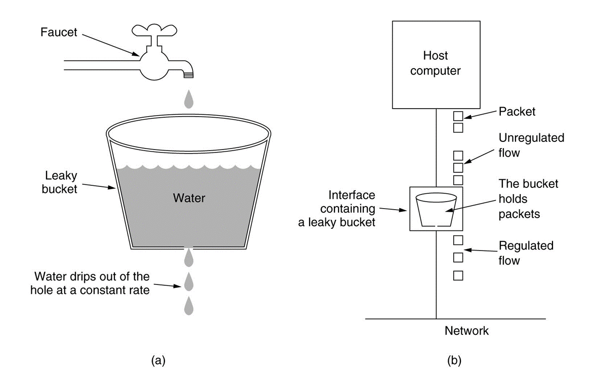

    - 算法描述

      - 每个主机连接到网络的接口中都有一个**漏桶，即一个优先长度的内部队列**

      - 当桶中有分组的时候，输出速率是恒定的，当桶空的时候，输出速率是0

      - 当一个分组到达满的桶的时候，分组将被丢弃（满则溢）

      - 每个时钟嘀嗒( **tick** )，仅允许一个分组或固定数量的分组发送出去

        >数据产生速率：25MBps
        >路由器的工作速率：2MBps
        >数据突发时间持续：40ms
        >漏桶输出速率： 2MBps
        >漏桶容量：1MB

        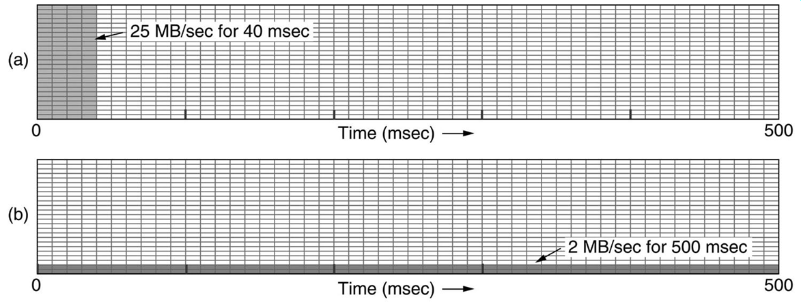

    - 算法效果

      - 主机内用户进程产生的分组流往往是一个**不稳定的流**，漏桶可以让**它输出到网络时变成一个稳定流**，抹平了突发尖峰，极大地减少了发生拥塞的机会

    - 漏桶的缺点

      - 当漏桶满了之后，数据将被丢弃
      - 不能大量地突发数据
      - 改进：令牌桶

  - #### 令牌桶（token bucket）

    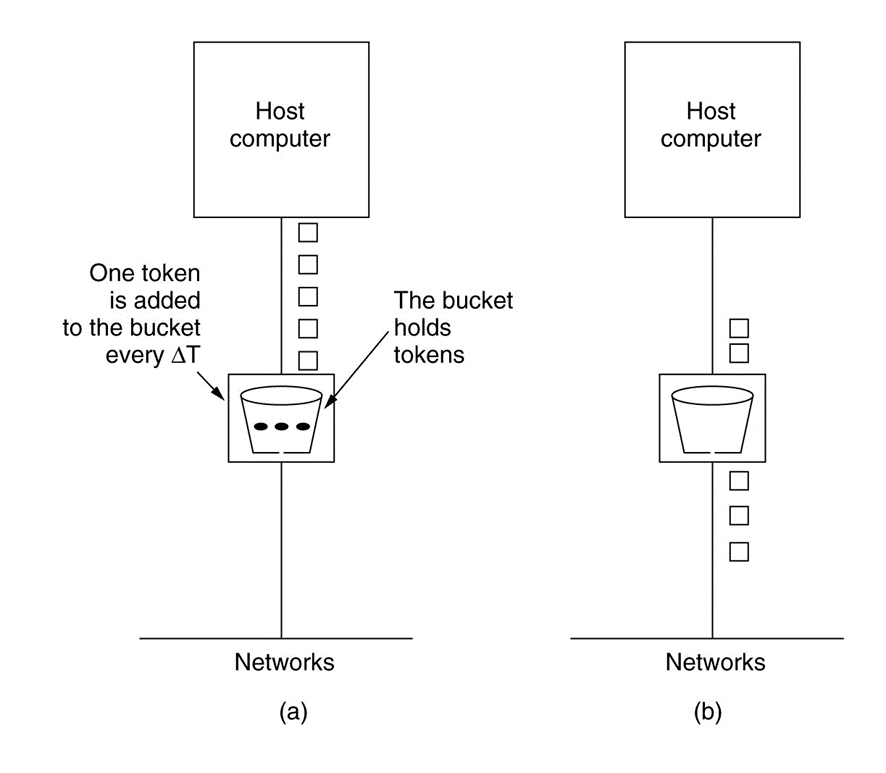

    > https://zhangjun075.github.io/learning/limiting/

    - **当大量数据突发的时候，令牌桶**算法允许输出加快到某种程度

    - 令牌桶**拥有令牌（tokens）**，且以每△T秒产生一个令牌的速度往桶中输入令牌

    - 一个分组要发送的时候，它必要从桶中**取出和获取**到一个令牌

    - 令牌桶算法**允许累积令牌**，但最多可以累积n（令牌桶的容量）个令牌

    - > 计算最大突发时间
      > 突发时间： S 秒
      > 令牌桶容量： B字节
      > 令牌到达的速率： R 字节/秒
      > 最大输出速率： M 字节/秒

      

    - 和漏桶算法相比：

      - 令牌桶允许突发，但是最大突发受制于令牌桶容量的限制

      - 当桶满的时候，令牌桶算法**丢掉的是令牌（不是分组）**

  - 其它：资源预留、准入控制、分组调度等

### **网络互联**

网络可以通过不同的设备联接起来：

- 物理层 - repeaters or hubs
- 数据链路层 - bridges and switches
  - 可能作小小的协议转换，如从Ethernet 到 FDDI 或到 802.11
- 网络层 – routers
  - 多协议路由器
- 传输层 - transport gateways
  - 传输层连接之间的接口，如允许TCP连接和SNA连接粘结起来，分组可畅通无阻
- 应用层 - application gateways
  - 翻译消息语义，如不同的email格式转换

>IP是现代网络的基础

**隧道技术**

隧道（Tunneling） --一种通用的特殊的网络互连方式

- 源和目的都处于同种网络，但是中途经过不同类型的网络

- 中间的WAN部分可被看成一个大的隧道，从一个多协议路由器延伸到另一个多协议路由器

#### 互联网路由

- 互联网路由类似于单个子网内部的路由，但是，前者比后者更加复杂一些

- 两级路由算法

  - 每个网络内部采用内部网关协议（IGP， interior gateway protocol ）

  - 网络之间使用外部网关协议（BGP， exterior gateway protocol ）

  - 互联网上的每个网络都是独立于所有其他的网络，所以每个网络通常称作一个自治系统（ Autonomous System ，AS）

- 互联网路由和网络内部路由的差别是：

  - 互联网路由可能需要跨越国际边界，不同的法律可能会介入进来

#### 分段

分段（Fragmentation）是将一个分组切分成几个小的分组，已通过网络

- 透明分段
  - 分段行为对其他网络来说是不可见的，换句话说，在该网络分段的分组，在离开这个网络的时候需要将它重组恢复
  - 遇到的问题
    - 出口的网关必须知道什么时候它收到了全部的分片
    - 所有的分组都必须从同一个网关离开
    - 进行分段和重组需要消耗资源，如果不断通过一系列的 “小”网络，开销会很巨大
- 非透明分段
  - 每个网络遇到不能承载的分组即对其进行分段，不负责重组恢复，**目的机**收到分割后的分组，完成重组恢复
  - 遇到的问题
    - 要求每个主机有重组功能
    - 总开销增大，因为分片都需要头部信息

**分段编号的方法**

- 定义一个足够小的基本分片长度值，以便基本的分片能通过每一个网络（IPv6是这样做的，发前试探）

- 当原始分组被分割的时候，所有的分片的长度等于基本长度值，只除了最后一个分片（更短）

- 一个互联网分组可能包含多个分片，所以，在分片的头部必须提供这些信息：

  - 初始的分组号

  - 第一个基本分片的编号

  - 一个位（bit），表明该分片是否是原始分组分割后的最后一个分片

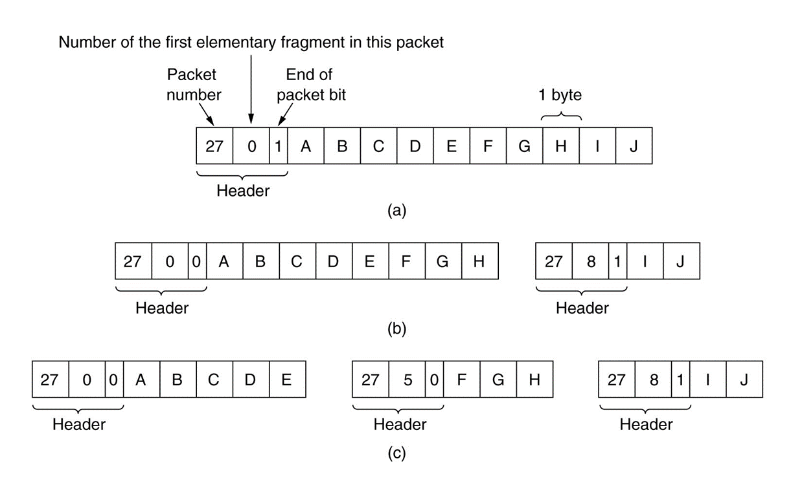

## IP协议

**互联网和网络层**

- 在网络层上，可将整个互联网看作一组互联的子网络和自治系统
- 将整个互联网粘合起来的正是网络层协议：IP (Internet Protocol).
- IP的任务是提供一种尽力传送（ Best-Efforts ）的方法，将数据报从源传送到目的

> IP的胶水/粘合作用

**MAC寻址和IP寻址**

- 适用的网络范围不同，MAC寻址只适合于小型网络；
- 所依赖的地址结构不同，MAC是平面地址，IP是结构化、层次化地址，其本身携带了位置信息；
- 所处的OSI模型层数不同；
- 地址数目的限制，IP地址正在耗尽，而MAC地址暂无耗尽的危险；
- 两种地址的格式不一样。

### 路由器的主要功能

- 路由器处理接到一个分组后：

  - 打开分组（de-encapsulation）

  - 确定目标网络，查找路由表

  - 重新封装，转发

- 主要功能

  - Routing

  - Forward

  - other

**路由表**

- 主要包括 网络地址network address, 接口interface, 代价metric (f.g. hop),子网掩码subnet mask, 网关gateway, 等等。
- 除了路由表，路由器内部有一张**ARP表**
  - 所有子网设备的IP-MAC映射（包括网关）
- 路由表可能因厂家的不同而不同

### IP协议

>IP 旨在提供一种尽力而为（即不保证）将数据报（数据包）从源传输到目标的方式

#### IP分组格式

- 协议版本

  - 4 bits.

  - 标明IP协议的版本号

    - IPv4 : 0100

    - IPv6 : 0110 

- 报头长度
  - 4 bits.
  - IP 头长度：以32bit为单位标明报文长度 (4 bytes)，可指向数据开始处

- 服务类型

  - 8 bits

  - TOS

    上层协议表明该分组的重要程度

    - Precedence.      

    - Reliability.      

    - ECN.

- 数据报总长度
  - 16 bits.
  - 指明整个数据分组的总长度，包括数据头和数据。单位“字节”

- 数据报标识号
  - 16 bits.
  - 标识当前数据报的序列号
  - 由发送者分配，以便接收方可以依据来做重组

- 标志
  - 3比特和13比特
  - 分组是否分片
  - 帮助收方重组

- 分片偏移

  - **数据封装提出的问题**

    - 数据报长度的限制

      - 硬件限制
        - 物理网络对帧的最大字节数限制，由硬件决定，称为最大传输单元（MTU）。

      - 软件限制： IPv4的最大值2^16

    - 如何选择数据报长度实现数据封装？

      - 数据报长度=网络中最小的MTU
        - 在MTU较大的网络传输会造成硬件能力浪费

      - 数据报长度=网络中最大的MTU
        - 在MTU较小的网络不能实现数据报到帧的封装

  - **适应不同MTU的解决方案**

    - 数据报长度的定义原则

      - 与硬件无关

      - 以“方便”为原则

        - 以不超过IP版本规定的数据报总长度为前提

        - 取信源机所在物理网络的MTU为数据报长度

    - 定义分片机制

      - ​	在数据报长度大于网络MTU的情况下，将其分成若干较小的部分传输，每部分为“片”。

      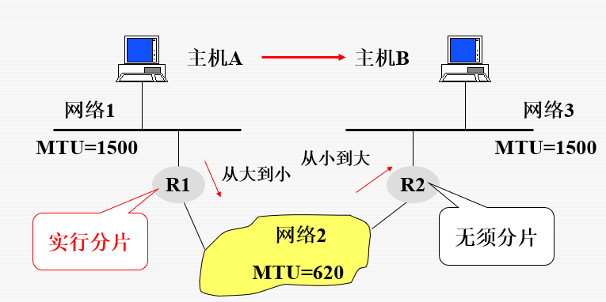

  - **片的重组**

    - 重组只在信宿机完成

      - 减轻网关（gateway）负担，简化路由协议

      - 简单、高效，体现“尽力传递”设计思想

    - 在接收端设置重组计时器

      - 接收到数据报的第一片时立即启动计时；

      - 如果在规定时间内未收到全部分片，则放弃整个数据报，向信源机发送出错信息。

- 生存时间

  - 8 bits.

  - Time-to-Live(TTL)维护一个计数器，递减为零时，数据报被丢弃，防止分组在网络中无限循环

- 用户协议
  - 8 bits.
  - 用来指定传输层协议.17(UDP) or 6(TCP)

- 报头校验和
  - 16 bits.
  - 针对头部计算校验和，验证分组头部的正确性

- IP地址
  - 源和目的地址都是32位（IPv4）

- 数据报选项
  - 可变长字段
  - 允许IP支持多种选项

- 填充
  - 确保IP头是32位的整数

#### IP地址和它的分类

IP地址：网络号和主机号

- 唯一的

- 每个主机至少有一个

IP地址的二进制表示32bit

- 缺点：难于记忆

- IPv4地址的点分十进制表示

  - 表示方法：

    - 32位被分成了4个 8位组

    -  每个8位组之间用“.”分隔

    - 每个8位组转换成十进制数，从0到255

IP地址的层次结构

**IP地址的分离**

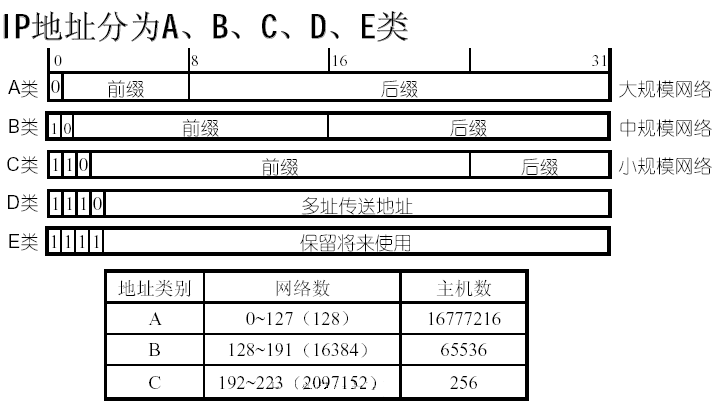

- A类地址

  - 前1字节标识网络地址部分，后3字节标识主机地址部分

  - 每个网络最多可容纳 （2^24  -2）台主机

  - 第1字节用十进制表示的取值范围为“0－127”

  - 具有A类地址特征的网络总数为2^7个

- B类地址

  - 前2字节标识网络地址部分，后2字节标识主机地址部分

  - 每个网络最多可容纳 （2^16-2）台主机

  - 第1字节用十进制表示的取值范围为“128－191”

  - 具有B类地址特征的网络总数为 2^14 个

- C类地址

  - 前3字节标识网络地址部分，后1字节标识主机地址部分

  - 每个网络最多可容纳（2^8-2）台主机

  - 第1字节用十进制表示的取值范围为“192－223”

  - 具有C类地址特征的网络总数为 2^21 个

### 保留的IPv4地址空间

保留的地址空间：

- D类（224.0.0.0~239.0.0.0）和E类（240.0.0.0~254.0.0.0）
- 网络地址：主机部分全为“0”的 IP 地址；
- 广播地址：主机部分全为“1”的 IP 地址。

**特殊的IP地址**

- 32位全为0，0.0.0.0  （P346）

  - 这个主机、这个网络
  - Cisco路由器指定的默认路由

- 32位全为1，255.255.255.255  Flood Broadcast

  

- 主机部分全为0，如172.16.0.0  网络地址

- 主机部分全为1，如172.16.255.255  Direct Broadcast

  

- 127.0.0.0  Lookback Network

- 127.0.0.1 Lookback test

- 169.254.x.x，非正常地址

**共有地址和私人地址**

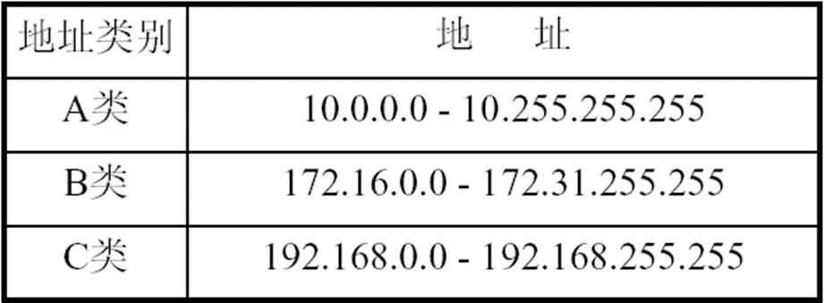

> A: 10.0.0.0- 10.0.255.255（1个A）
> B: 172.16.0.0-172.31.255.255（16个B）, 
> C: 192.168.0.0- 192.168.255.255（256个C） 

### 子网和子网规划

**子网**

- 局域网不断增长，越来越难于管理，必须将它分割成子网
- 一个网络被分隔成几个部分（子网），但是在外界看来，**该网络仍被看成一个整体** (体现在路由表例上，就是外部的路由器只对应一条路由）
- 这也允许**不同的子网在一个组织内部**连接起来

#### **子网掩码**

- 路由器使用**子网掩码决定分组**往哪个子网转发
- 子网掩码可用**点分十进制**表示（1表示网络位，0表示主机位），也可用“/网络位数+子网位数”表示
  - 255.255.255.224
  - 202.10.23.102/27
- 路由器采用**“AND ”操作（目的IP和子网掩码）**，得到目的网络地址
- 使用这种机制，路由器不必记录全部主机的IP地址，缩减了路由器的规模

> 缺省的子网掩码
> A：255.0.0.0  （8位网络位）
> B：255.255.0.0 （16位网络位）
> C：255.255.255.0 （24位网络位）

**网络地址、广播地址和主机地址**

#### **子网规划**

>划分子网实际上建立了一个由网络、子网和主机构成的三级层次结构，从而降低了路由器的表空间

- 构建子网是通过从网络地址的主机部分借位来进行

- 子网规划将导致IP地址空间的损失

  - 例：一个C类IP地址202.38.197.0，没有划分子网的情况下，可以有256个IP地址，其中254个可用的IP.

  - 如果借2位主机位创建子网，可以有4个子网，但只有两个可用，每个子网可容纳64个IP，但只有62个可用，总可用IP数量为，2*62=124。

    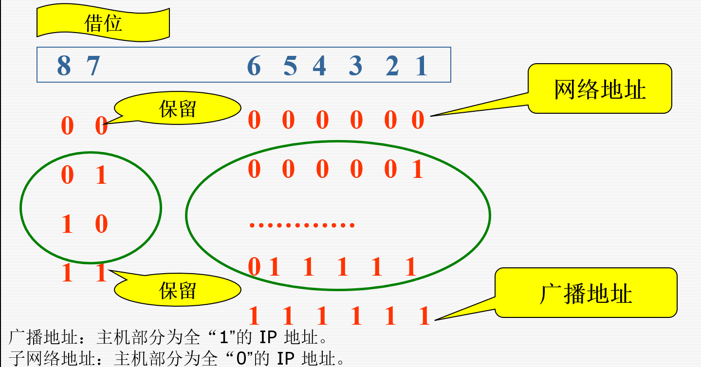

- 子网规划：将大网络分割成小网络

- 规划子网时需要考虑两个因素：

  - 所需的子网数量
  - 所需主机地址的数量
    - 确定可用主机数量的公式 2n-2
      - 2^n  (其中n为剩余的主机位的数量) 用于计算主机数量
      - -2  在每个子网中不能使用子网ID和广播地址 

- 借位原则

  - 从主机域的高位开始借位；

  - 至少借 2 位；

  - 主机域至少保留 2 位。

#### **可变长子网掩码 (VLSM)**

- 传统子网划分——为每个子网分配相同数量的地址。需要较少地址的子网中存在未使用（浪费）的地址。例如，链路只需要2个地址。

- **VLSM**允许将网络空间分为**大小不等的部分**。
- 子网掩码将依据为**特定子网**所借用的位数而**变化**。 
- 先**对网络划分**子网，然后再将**子网进一步划分**子网。
- 根据需要重复此过程，以创建**不同大小的子网**。

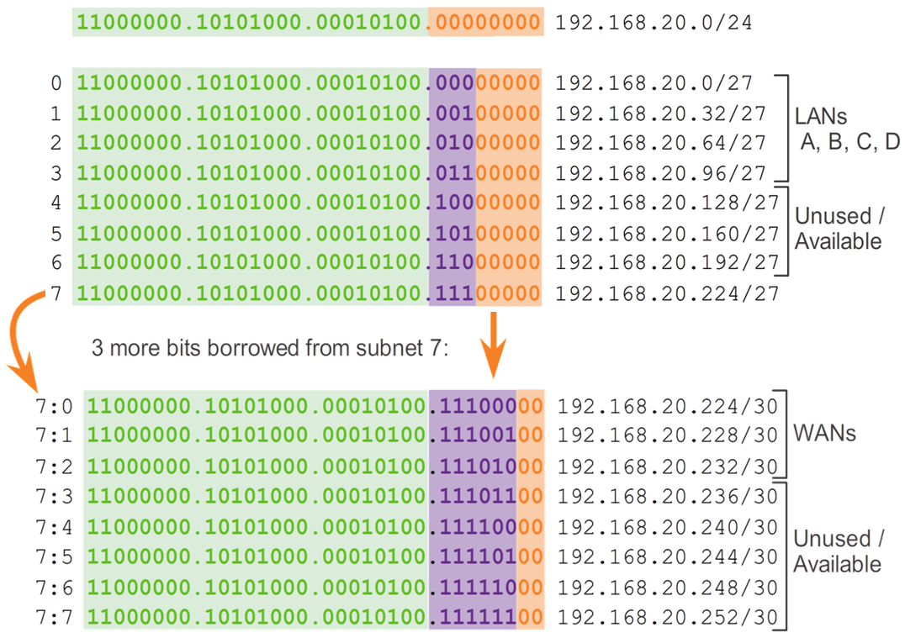

## IPv6协议

IPv4危机

**IPv6基本属于**

**IPv6地址表示**

v6地址与v4地址表示方法有所不同

- 点分十进制->冒分十六进制
- 用十六进制表示，如：　FE08:….
- 4位一组，中间用“:”隔开，如：　2001:12FC:….
- 若以零开头可以省略，全零的组可用“::”表示，如：　1:2::ACDR:….
- 地址前缀长度用“/xx”来表示，如：　1::1/64

>以下是同一个地址不同表示法的例子：
>0001:0123:0000:0000:0000:ABCD:0000:0001/96
>1:123:0:0:0:ABCD::1/96
>1:123::ABCD:0:1/96

**IPv6地址分类**

- 单播地址（Unicast Address）
  - 链路-本地（Link- Local） 
    - 用在单一链路上 
    - 带有链路-本地源或目的地址的数据包不转发到其它链路 
    - 如：FE80：：20C：76FF：FE0A：9A7C 
  - 站点-本地（Site- Local）  
    - 用于单一站点 
    - 带有站点-本地源或目的地址的数据包不转发到其它站点
    - 应用与RFC 1918 类似 
    - 如：FEC0：：20C：76FF：FE0A：9A7C 
  - 全球 （Global）  
    - 全球唯一地址
    - 带有全球地址的数据包可被转发到全球网络的任何部分
    - 如：3FFE：321F：0：CE：：1 
- 组播地址（Multicast Address）
- 任播地址（Anycast Address）
  - 用于标识一组网络接口
  - 目标地址为任播地址的数据报将发送给最近的一个接口
  - 适合于One to One-of-Many的通讯场合
- 特殊地址

IPv6地址子网规划

- IPv4 子网划分是管理地址稀缺性，
- IPv6 子网划分是根据路由器的数量及它们所支持的网络来构建寻址分层结构。 

**IPv6报头**

- IPv6基本头（固定头）

  - 修改的
    - Addresses increased 32 bits -> 128 bits
    - Time to Live -> Hop Limit（跳数限制）
    - Protocol -> Next Header
    - Type of Service -> Traffic Class（流量类别）

  - 删掉的
    - Fragmentation fields moved out of base header(主头部)
    - IP options moved out of base header
    - Header Checksum eliminated
    - Header Length field eliminated
    - Length field excludes IPv6 header

  - 增加的
    - Flow Label field added

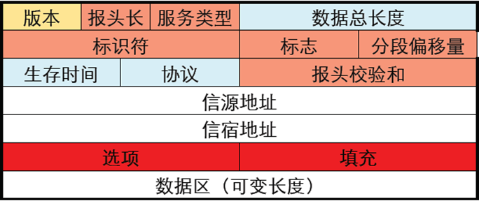

- IPv6扩展头

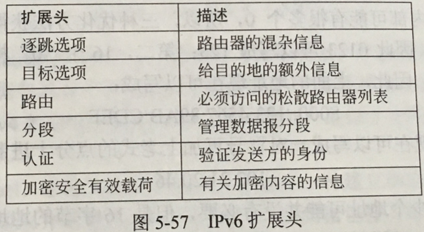

## 其他技术和协议

### CIDR

- Classless InterDomain Routing
- 缓解了地址枯竭的趋势；控制甚至缩减了路由表的开销
- CIDR的基本思想描述在 RFC 1519 中
  - 分配IP地址的时候不再以类别来分，而是按照可变长的地址块来分配
    - 如：某用户需要 2000 个地址

### CIDR路由

- 路由表必须扩展，增加一个 32-bit 的子网掩码

- 每个路由表有一个三元组 (IP address, subnet mask, outgoing line)

- 当一个分组到来到的时候

  -  分组中的目标IP地址（ Destination IP ）被检查

  - 目标IP和子网掩码进行与操作，获得目标网络地址，以查找路由表.

  - 如果路由表中有多个表项匹配 (这些表项有不同的子网掩码) ，使用子网掩码最长的那个表项

    >最长地址前缀：选择子网掩码长的匹配项

### 路由聚合

- 缩减路由表规模
- 隔离路由翻动

>怎样聚合呢？计算不变的位数！

### NAT/PAT

**NAT概述**

- NAT：net address translate NAT
  - 私有IP地址和公有IP地址之间的转换。
    - 内部网络使用私人地址，当内网需要和外网通信的时候，**私人地址转换成合法的global 的地址**
    - 由NAT**转换器（盒子）**完成这种转换；NAT转换器能够转换并且维护一个地址转换表，以便回来的分组找到它的去处
    - 当回来的分组到达NAT转换器的时候，它查找地址转换表（以源端口作索引），获得目标机的私人地址，并转换地之后发往目标机
- PAT：port address translate（超载）
  - 将多个私有IP地址影射到同一个公有IP地址的不同端口
- Private IP address：不可路由的地址、也可用于广域网链路上

**NAT带来的问题**

- NAT违背了IP的结构模型 –每个IP地址唯一地标识了一台机器
- NAT将互联网改变成了“面向连接”的网络，NAT转换器维护着连接的状态，一旦它崩溃，连接也没有了
- NAT违背了最基本的协议分层原则

**NAT/PAT小结**

- 优点
  - 节省了公有IP地址；
  - 提供了内部网访问外网的灵活性；
  - 有一定的保密性。
- 缺点 
  - 影响了部分协议和应用的通信；
  - 增加了网络延时；
  - NAT转换设备的性能可能成为网络的瓶颈；
  - 影响了路由追踪工具的使用。

### ICMP

> 用来报告意外的事件或测试互联网

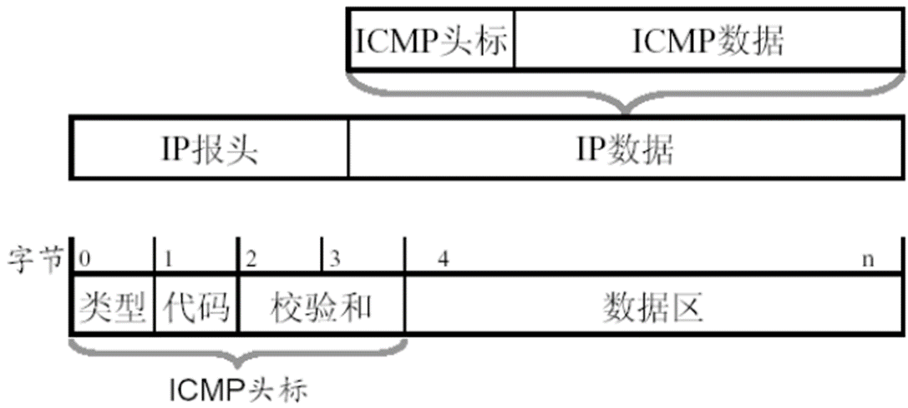

**应用 1：ping的工作原理**

- 使用ping命令（即调用ping过程）时，将向目的站点发送一个ICMP回声请求报文（包括一些任选的数据），
- 如目的站点接收到该报文，必须向源站点发回一个ICMP回声应答报文，源站点收到应答报文（且其中的任选数据与所发送的相同），则认为目的站点是可达的，否则为不可达。
  - 测试TCP/IP是否正常工作：ping 127.0.0.1
  - 网络设备是否正确：ping 本机IP地址
  - 检查对外连接的路由器：ping 默认网关IP
  - 检查与某台设备的畅通情况：ping IP
  - 检查DNS设置：如ping www.scut.edu.cn
  - 执行DNS反向查询，ping –a IP地址

**应用 2：tracert命令**

- tracert过程是通过ICMP数据报超时报文来得到一张途经的路由器列表

- 源主机向目的主机发一个IP报文，并置TTL为1，到达第一个路由器时，TTL减1，为0，则该路由器回发一个ICMP数据报超时报文，源主机取出路由器的IP地址即为途经的第一个路由端口地址

- 接着源主机再向目的主机发第二个IP报文，并置TTL为2，然后再发第三个、第四个IP数据报，……直至到达目的主机

  

**应用 3：PMTU**  

- 发数据包，分段标记DF=1，尝试1400，1200，900，直到到达目的机

- 结果：MTU=900

  

### 主要的地址解析协议

#### ARP 

（地址解析协议）

- Address Resolution Protocol

- IP 地址->MAC 地址

- ARP 的任务是找到一个给定IP地址所对应的MAC地址

- ARP的优化措施：

  - 缓存 ARP 结果
  - 在ARP请求中包括源机的 IP-to-MAC 地址的映射
  - 每台机器在启动的时候，广播它的IP-MAC地址对

- 免费ARP

  - 当一台主机启动时，发送要给一个免费ARP，（如果意外收到一个应答，即是IP地址发生了冲突）
  - 当一个接口（interface）的配置发生了改变，会发送一个免费ARP

- 代理ARP

  - 当源设备需要的目的地址与自己不在同一个网络时，如果源不知道目的MAC地址，它必须使用路由器的服务使它的数据达到目的，当路由器在这种方式下使用时，称为缺省网关。
  - 缺省网关是与源设备所处的网段相连的路由器接口上的IP地址

- ARP表

  - IP地址到MAC地址的映射表，储存在存储器（RAM）中，自动维护。（掉电消失）
  - 为了减少ARP请求的次数，每个设备拥有自己的ARP表，包括路由器。
  - 自动维护ARP表
    - 通过广播ARP请求中的源设备信息添加更新表；
    - 利用自己的ARP请求之应答信息来添加、更新表；
    - 删除超过一定时限的信息

- ARP欺骗

  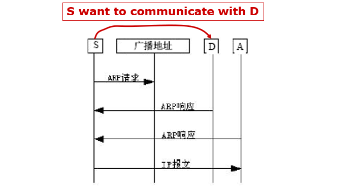

  - 静态ARP
  - 不马上写ARP缓存
  - 设置ARP服务器
  - 硬件屏蔽，如路由器采用静态ARP且作全权代理

#### RARP 

（逆向地址解析协议）

- Reserve Address Resolution Protocol

- MAC 地址->IP 地址 

### IP地址分配方式

- 静态分配
- 动态分配
  - 给定一个MAC地址，如何得到对应的IP地址?
    - RARP (Reverse Address Resolution Protocol) 用来获取本机MAC地址对应的IP地址
    - BOOTP （缺点：需要手工配置）
    - DHCP (Dynamic Host Configuration Protocol)
      - Dynamic Host Configure Protocol
        可以灵活分配IP地址，节约IP地址的使用
      - 使一台主机迅速并动态地获取一个IP地址
      - 通过DHCP获取的 IP是租来的，可能会过期
      - DHCP过程
        - 初始化状态
        - 选择状态
        - 请求状态
        - 绑定状态

# 传输层

## 参考资料

tcp三次握手和各个字段的含义

https://blog.csdn.net/weixin_48684274/article/details/108263608

## 传输层概述

**传输层是整个协议栈**(TCP/IP)的核心

> 传输层的任务是提供**可靠的、高效的**数据传输

### **传输层的地位**

传输层在应用层和网络层之间提供了无缝接口
下四层被看作传输服务提供者，而上三层是传输服务使用者

**传输层的最终目标**是向它的用户（应用层）提供**高效、可靠和性价比高**的服务
完成这项工作的硬件或软件被称为**传输实体**（ transport entity）

**传输实体可能位于：**

- 操作系统内核
- 独立的用户进程中
- 绑定在网络应用中的链接库
- 网络接口卡

### **传输层服务**

有两种传输层服务：

- 面向连接的服务
- 无连接的服务Connectionless

这和网络层提供的服务相似，那为什么需要两个独立的不同的层？

- **网络层运行在由承运商操作的路由器上**，因此用户无法真正控制到网络层
- 把另一层放在网络层之上，可以让用户能够**控制到服务质量（some control）**.
- **传输层原语独立于网络层原语**，而网络层原语会因为网络的不同而不同

### **传输层提供的功能**

1. 端点标识

2. 传输服务

   **面向连接**		  L4与L2的比较
   端到端的连接管理

   - **建立连接**
   - **数据传输**
   - **释放连接**
   - 流控制
   - 差错控制

   **无连接**

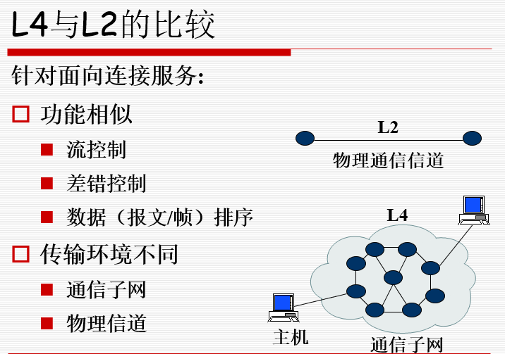

作用范围比较

### **传输服务原语**

**传输服务原语让应用程序**可以有途径访问到传输服务

传输服务和网络服务的两个主要差别是：

- **网络服务试图按照实际网络提供的服务来建模**（不可靠的）；而面向连接的传输服务是可靠的
- 网络服务仅被传输实体所使用；而**传输服务直接被应用程序所使用**，必须方便易用

**传输服务原语的一个例子**

连接建立：

- **服务器调用 LISTEN 原语**，阻塞该服务器，直到有客户来连接

- **当一个客户想和服务器通信**，它调用 CONNECT 原语，阻塞该客户，且发送一个分组（封装了传输消息）
- **当分组到达服务器端**，传输实体检查看是否服务器阻塞在 LISTEN 调用中，然后，他解除阻塞，并向客户发回一个CONNECT ACCEPT数据段
- **当这个数据段到达客户端的时候**，客户端解除阻塞，连接建立

数据交换

- 任何一方都可以**执行阻塞的 RECEIVE 原语**，以等待另一方执行SEND原语
- **当数据数据段**（ TPDU）到达时，接收方解除阻塞，并对这个数据段进行处理，发回一个应答
- **只要双方对数据的认识有统一的认识**，这种机制可以工作得很好
- **每个发出的分组都要被确认**，利用网络层的服务；这些确认、定时器、重传等，由传输实体使用网络层协议来管理，**对传输层的用户来说，这些都是不可见的**

连接释放

- **非对称的释放：** 任何一方都可执行 DISCONNECT原语，将 DISCONNECT数据段发给对端的传输实体，数据段到达另一端，连接被释放
- **对称的释放：** 当一方执行 DISCONNECT原语的时候，这意味着它没有更多的数据要发了，但是仍然希望接收数据，只有当双方都执行 DISCONNECT原语后，一个连接才真正被释放

## 传输层协议

### UDP

UDP 是一个**无连接的（connectionless）**的传输层协议
**UDP传输数据段，无须建立连接**
UDP 在 RFC 768中描述
很多C/S应用(如： **DNS**)，都使用UDP发送一个请求，  然后对方应答

**端口（port）定义** 

16 位，共有 216 个端口
端口范围：0~65535

- <1023 : 用于公共应用（保留，全局分配，用于标准服务器），IANA分配；
- 1024~49151 :用户端口，注册端口；
- \>49152 : 动态端口，私人端口。

自由端口(Free port)

- 本地分配
- 动态的随机端口

**注意**

如果收方的校验和为全1，传输无错

二进制反码求和

- 从低位到高位逐列计算
- 0和0相加是0，0和1相加是1，1和1相加是0，但产生进位
- 最高位相加产生进位，该位为1

检错能力较弱，但简单快速

使用协议地址，破坏了分层原则

**UDP小结**

- 提供端点标识，端到端的数据传输

- 不提供差错检测和可靠传输。但**简洁高效**

### TCP

**传输控制协议**

- TCP (Transmission Control Protocol) 是专门为了**在不可靠的互联网络上提供可靠的端到端**字节流而设计的
- TCP必须**动态地适应**不同的拓扑、带宽、延迟、分组大小和其它的参数，并且当有错误的时候，能够**足够健壮**

**TCP 服务模型**

要想获得TCP服务，发送方和接收方必须创建一种称为**套接字（ sockets ）的端点（ end points）**

每个套接字是包含一个IP地址和一个16位的端口（ port ） 

通信进程的全球唯一标识

- 三元组：协议、本地地址、本地端口号
- **五元组：**协议、本地地址、本地端口号、远端地址、远端端口号

**TCP 服务模型**

- 所有的 TCP 连接是**全双工的**(同时双向传输)和**端到端**的(每条连接只有两个端点) 

- TCP **不支持组播和广播**

- TCP连接是**字节流**而不是消息流

#### **TCP 数据段头  **

**源端口 和 目的端口** 字段标明了一个连接的两个端点

- 用来跟踪同一时间内通过网络的不同会话。一般每个端口对应一个应用程序

**序列号** – 字节号 (32 位)

- 初始序列号ISNs(initial sequence numbers )：随机产生的
- SYN: 携带了ISNs 和SYN 控制位的数据段

**确认号** – 期望接收的字节号 (32位)

**TCP 段头长度** – TCP段头长度，**单位32位（4字节）**

保留域/字段

**PSH** 表示这是带有PUSH标志的数据

- 接收方收到这样的数据，应该立刻送到上层，而不需要缓存它

**RST** 被用来重置一个已经混乱的连接

**SYN** 用在连接建立的过程

- **当SYN=1，ACK=0， 连接请求**
- **当SYN=1，ACK=1， 连接接受**

**FIN** 被用来释放连接，它表示发送方已经没有数据要传输了，但是可以继续接收数据.

TCP中的流控(**Flow control**)使用一个可变长的滑动窗口来完成的 

**Window size** – 告诉对方可以发送的数据字节数（从确认字节号开始（**决定于接收方**）

Checksum –提供额外的可靠性

- 校验的范围包括头部、数据和概念性的伪头部

#### TCP连接和释放

**TCP连接的建立**

采用三次握手建立连接

- 一方（server）被动地**等待一个进来的连接请求**
- 另一方（the client）**通过发送连接请求**，设置一些参数
- 服务器方**回发确认应答**，
- 应答到达请求方，请求方最后确认，连接建立

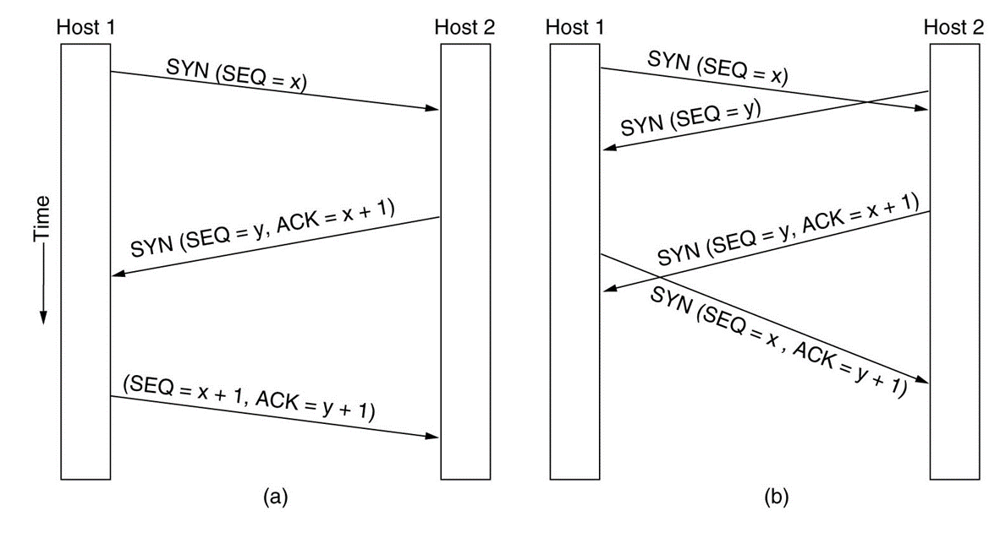

**重复连接请求CR**

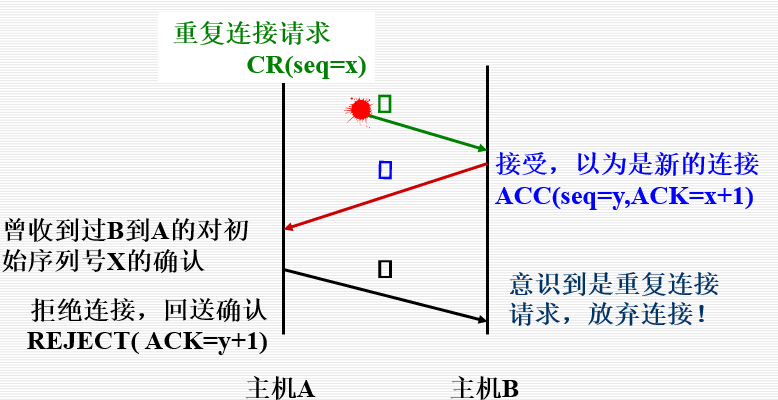

SYN泛洪导致DoS攻击（伪造源IP）

数据传输开始后可能有两个原因导致阻塞

- 快的机器向慢的机器发送数据

- 多台机器同时向一台机器发送数据

拥塞避免方法：确认技术、窗口技术

**TCP 连接释放**

释放连接

- **任何一方在没有数据要传送的时候**，都可以发送一个FIN置位了的 TCP 数据段finish
- 当FIN被确认的时候，**该方向的连接被关闭**
- **当双向连接都关闭了的时候，连接释放**

为了避免两军队（two-army）问题，使用定时器

- **如果一方发送了FIN数据段**出去却在一个设定的时间没有收到应答，释放连接
- **另一方最终会注意到连接的对方已经不在了**，超时后连接释放

理论上讲，如果初始DR的和重传都丢了，协议失败

- 发送者将放弃发送且释放连接，但是，另外一端却不知道这些情况，仍然处于活跃的状态
- 这种情形导致**半开放连接（half- open）**

杀死半开放连接的方式P401

- 如果在一定的时间内，**没有TPDUs 到达的话，连接自动释放**
- 如果这样，传输实体在发送一个TPDU的时候必须启动定时器，**定时器超期，将发动一个哑TPDU（dummy TPDU）**，**以免被断掉 P430**

**TCP 传输层策略**

>窗口尺寸受制于接收方

当窗口数为 0 时，发送者不能正常发送数据段，除非: 

- **Urgent数据**。比如，用户想杀掉远端机器上的进程的时候，可以发送数据
- **发送者可以发送一个字节的数据段**，以便让接收者再次发送期待接收的字节号和窗口数（避免死锁）

发送者不需要马上发送应用程序产生的数据

接收者也不需要马上发送应答（当收到数据的时候）

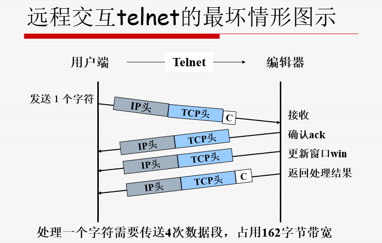

**怎样优化接收端?** 

- 接收端可以推迟500ms发送确认分组和窗口更新窗口，以便可以免费搭载在处理后的回显分组内（free ride）

**怎样优化发送端 ?** 
**Nagle's algorithm (1984):** 

- 当数据以一次一字节的速度到达的时候，只发送第一个字节，然后将后续的字节缓存起来，直到发出的字节得到确认
- 然后将缓存起来的字节在一个数据段中发出，再继续缓存，直到发出的数据得到确认
- Nagle算法在很多TCP上实现，但是有些时候最好禁用，比如：当一个X-Windows应用在互联网运行的时候，鼠标的移动事件必须发送给远程计算机，把这些移动事件收集起来一批一批发送出去，使得鼠标的移动极不连贯

Nagle’s 算法图示

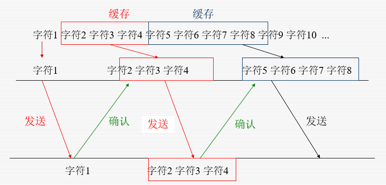

**傻瓜窗口综合症** 

另一个使TCP性能退化的问题是傻瓜窗口综合症（silly window syndrome problem）：当有大块数据被传递给发送端TCP实体，但接收端的交互式应用每次只读取一个字节的时候，问题就来了

**Clark解决方案 ：**

- **阻止接收方发送只有1个字节的窗口更新**，相反，它必须等待一段时间，当有了一定数量的空间之后再告诉发送方
- 而且，**发送方不发送太小的数据段**，相反，他试着等待一段时间，直到积累足够的窗口空间以便发送一个满的数据段，或者至少包含接收方缓冲区的一半大小
- **接收方可以维护一个内部缓冲**，且阻塞上层应用的 READ 请求，直到它有大块的数据提供

发送方（Nagle’s algorithm）

- 尽量不发送数据含量小的数据段
- 缓存应用层的数据，达到一定量再发送

接收方（Clark’s solution）

- 不请求对方发送短数据段(window size)
- 延迟窗口变更信息，使接收缓冲区足够大

#### **TCP拥塞控制**

虽然网络层也试图管理拥塞，但是，**大多数繁重的任务是由TCP来完成的，因为针对拥塞的真正解决方案是减慢数据率**

**分组守恒**：当有一个老的分组离开之后才允许新的分组注入网络

TCP希望通过动态维护窗口大小来实现这个目标

**拥塞检测Congestion detection**

- 所有的互联网TCP算法都假定超时是由拥塞引起的，并且通过监视超时的情况来判断是否出现问题

**拥塞控制Congestion prevention**

- **当一个连接建立的时候，双方选择一个合适的窗口大小**，接收方根据自己的缓冲区大小来指定窗口的大小。
- 如果发送者遵守此窗口大小的限制，则接收端不会出现缓冲区溢出的问题，**但可能由于网络内部的拥塞而发生问题**

互联网解决方案应该是认识到两个潜在的问题的：**网络容量，接收者容量**，然后单独地处理这两个问题 

为此，每个发送者维护两个窗口: 

- **接收者窗口**大小反映了目前窗口的容量 （容易控制）
- **拥塞窗口**大小反映了网络目前的容量（难于控制）
- 发送者发送的数据字节数是**两个窗口中小的**那个窗口数

**决定拥塞窗口的大小**

慢启动算法（Slow Start） (尝试的过程)：

- 当连接建立的时候，**发送者用当前使用的最大数据段长度**初始化拥塞窗口，然后发送一个最大的数据段

- **如果在定时器超期之前收到确认，则将拥塞窗口翻倍**，然后发送两个数据段。。。。。**直至超时**（或达到接收方窗口的大小）

- 确定出拥塞窗口的大小

  如：如果试图发送 4096 字节没有问题，但是发送8192字节的时候，超时没有收到应答，则拥塞窗口设为4096个字节 

> 按指数增长趋势定义拥塞窗口大小cwnd
> 初始：cwnd0 = MaxSegL（当前数据段长度）
> 增长：cwnd1 = 2 cwnd0
>                   cwnd2 = 2 cwnd1
>                    • • •
> 截止：达到接收窗口大小或超时
>
> **拥塞窗口二进制指数增长至接收窗口大小或超时**

除了使用接收者窗口和拥塞窗口，TCP拥塞控制还是用了第三个参数，**阈值（threshold）**，初始化为64K

- 当一个超时发生的时候，**阈值降为当前拥塞窗口的一半，同时将拥塞窗口设为一个最大数据段的长度**
- 然后使用**慢启动算法**来决定网络的容量，拥塞窗口增长到阈值时停止指数增长 
- 从这个点开始，每次成功的传输都会让拥塞窗口线性增长（即每次仅增长一个最大的数据段长度）

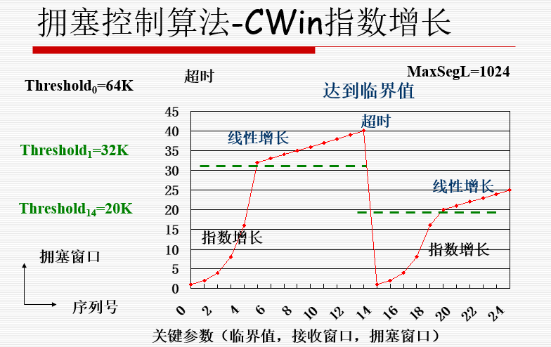

**拥塞控制算法总结**

- 定义初始拥塞窗口阈值和窗口大小

  Threshold0和cwnd0

- 初始超时

  - 拥塞窗口阈值减半：

    Threshold1 = CWND / 2

- cwnd二进制指数增长至确认超时

- cwnd线性增长至确认超时

  - 拥塞窗口值减半：Thresholdn = CWNDn / 2

  - 定义窗口大小：cwnd = cwnd0

- 重新开始慢速启动过程

#### **TCP定时器管理**

最重要的定时器是**重传定时器(**retransmission timer,Positive ackn. with retransmit） 

> 超时间隔设为多长合适呢？

持续定时器（persistence timer），用来避免如下的死锁（ deadlock ）发生 

- 接收方发送了一个窗口数为零的确认（窗口更新），告诉发送方等待

- 稍后，接收方空出了缓冲，发送更新窗口的数据段，但是，很不幸，该分组丢失啦！

- 现在，收发双方都在等待对方发送数据段过来，但永远等不到！死锁产生

**怎样防止死锁？**

- 保活定时器（keep-alive timer）用来检查连接是否存活，当一个连接空闲的时间超过保活定时器的时间，该连接将被杀掉。
- 最后一个定时器是在关闭时刻处于**TIMED WAIT** 状态中使用的定时器，它运行两倍的最大分组生存时间，以确保连接关闭之后，该连接上的所有分组都完全消失

### **TCP 和 UDP**

TCP

- 可靠传输方式
- 可让应用程序简单化，程序员可以不必进行错误检查、修正等工作

UDP

- 为了降低对计算机资源的需求，如DNS
- 应用程序本身已提供数据完整性的检查机制，勿须依赖传输层的协议来保证
- 应用程序传输的并非关键性的数据，如路由器周期性的路由信息交换
- 一对多方式，必须使用UDP（TCP限于一对一的传送），如视频传播

### 总结

UDP (数据段segment)

TCP (数据段segment)

提高可靠传输的措施 (传输策略)

- 肯定确认重传
- 窗口技术 (滑窗技术)
-  nagle 算法 和 clark方案
- 拥塞控制 (慢启动)

# **应用层**

## **应用层概述**

**主要功能**

> 最靠近用户的一层，向应用程序提供网络通信

**应用层的特点**

- 没有应用层，就没有网络通信支持
- 参考模型中唯一的一层，不需为它的上层服务
- 它向参考模型之外的用户提供服务
- 网络应用程序可被分为两大类：
  - 直接网络应用程序：Browser , e-mail ,FTP , Telnet
  - 间接网络应用程序：Word , resource manager , (via Redirector)

**重定向器(Redirector)**

> 置于应用中的一种小软件
> 它是透明的

## **域名解析系统**

- DNS是**分层次的，基于域**的命名方案，且采用了**分布式数据库**系统来实现（P471）
- DNS的使用方法：
  - 为了将一个名字映射为IP地址，应用程序调用一个叫**解析器（ resolver ）**的库过程，把名字作为参数传递给这个过程 （如： gethostbyname()就是一个解析器）
  - **解析器发送一个UDP分组给本地DNS服务器**，它会负责查找该名字，然后将对应的IP地址返回给解析器
  - **解析器返回结果给应用程序**，然后应用程序即可开始工作了（封装，发送。。。。。。）

- DNS的命名空间
  - 互联网被分成200多个顶级域
    - 每个域被分成若干子域，子域还可进一步划分。。。
    - 所有这些域可以用一棵树来表示
      - 树上的叶子代表没有子域的域（但包含主机）
      - 一个叶子节点可以只包含一台主机，也可以代表一个公司，包含上千台主机
  - 顶级域有两种
    - 通用域（ generic ）
    - 国家域（ country ）

- 域名

  - 每个域的名字是：从它向上到根（未命名）的路径，各个部分间用圆点隔开
  - 域名可以是绝对的，也可以是相对的，绝对域名总是以圆点结束（如： eng.sun.com. ） 
    - 相对域名必须在一定的上下文环境中被解释出来才有意义，从而唯一地确定其真实的含义
    - 绝对域名和相对域名都引用了域名树中一个特定的节点，以及它下面的所有节点
  - 域名是大小写无关的（ case insensitive ）
  - 各组成部分的名字最多有 63 个字符长，整个路径不超过 255 个字符
  - 没有规则限制同时在两个或多个顶级域名下的注册 (如：sony.com and sony.nl)—域名抢注
  - 每个域自己控制它下面的域（子域）的划分
  - 要创建一个新的域，创建者必须得到该新域的上级域的许可，一旦创建成功，该新域可以创建子域，而无需征得上级域的同意
  - 域名遵循的是组织的边界而不是物理网络的边界

- 资源记录

  - 每个域，无论是单主机域还是顶级域，都可以有一组跟它相关联的资源记录（ Resource Records ）

  - 当一个解析器把域名传递给DNS时，DNS所返回的是与该域名相关联的资源记录。所以DNS的主要功能是将域名映射到资源记录上

  - 一个资源记录包括5个部分：

    - 域名（Domain name）

      >指出这条记录适用于哪个域

    - 生存期（Time to Live）

      >指出这条记录适用于哪个域

    - 类别（Class）

      >对于互联网信息，它总是 IN

    - 类型（Type）

      >指出了这是什么类型的记录

    - 值（Value）

- 根服务器

  - 最重要的域名服务器；存储所有顶级域名的名字和IP
  - 无论是哪个本地域名服务器，无论何时，只要它无法回答一个查询请求，它都会向根域服务器求救 (for help)
  - 全球有 13 根域服务器，它们的名字分别是a to m（前13 个字母）。

- 域名解析

  - 当一个解析器收到一个域名查询时，它将该查询传递给本地的一个域名服务器

  - **如果待查询的域名落在该名字服务器的管辖范围内**，它将返回权威资源记录

    - 一个权威资源记录（authoritative record）是指来自于管理该记录的权威机构，因此总是正确的，它和缓存的记录不同，后者可能是过期的

  - **如果被请求的域名是远程的，且本地没有关于它的信息**，那么本地名字服务器向根域服务器发送一条查询此域的消息

  - 域名解析的种类

    - **主机向本地域名服务器的查询**一般都是采用**递归查询**。如果主机所询问的本地域名服务器不知道被查询域名的 IP 地址，那么本地域名服务器就以 DNS 客户的身份，向其他根域名服务器继续发出查询请求报文。
    - **本地域名服务器向根域名服务器的查询**通常是采用**迭代查询**。当根域名服务器收到本地域名服务器的迭代查询请求报文时，要么给出所要查询的 IP 地址，要么告诉本地域名服务器：“你下一步应当向哪一个域名服务器进行查询”。然后让本地域名服务器进行后续的查询。

    

  - 优化方法

    - 高速缓存—减少查询环节，提高效率
    - 缺点：缓存中的内容不具有权威性

## **重要的应用**

### 电子邮件

- 电子邮件系统通常由两部分组成：

  - **用户代理(UA)**：让用户能够阅读和发送邮件
    - 本地程序，提供命令行或图形界面，让用户和电子邮件系统交互
    - 电子邮件阅读器
  - **消息传输代理 (MTA)**：将消息从源端送到目标端
    - 通常是系统守护进程，即运行在后台的进程，在系统中传递电子邮件

- 电子邮件体系结构

  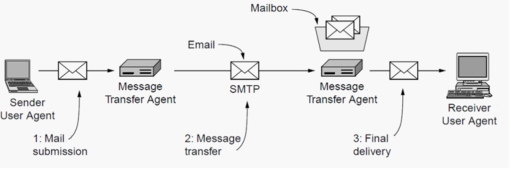

- Email 消息传输
  - 建立一个从源机器到目标机器间的传输层连接，然后传输消息
  - SMPT – Simple Mail Transfer Protocol
    - 源机与目标机（SMTP守护进程在监听）的25端口建立TCP连接
      - 连接建立 (在端口 25)
      - 数据交换
        - 客户机（作为客户）等待服务器（作为服务器）首先开始通话
        - 服务器首先发送一行文本，给出它自己的标识，并且告诉客户机是否已准备好接收邮件
          - 如果服务器没有准备好，则客户机释放连接，以后再重试
        - 如果服务器愿意接收电子邮件，则客户机申明发信人和收信人
        - 如果服务器确实存在这样的收信人，则服务器指示客户可以发送了
        - 客户发送消息，服务器回发确认
      - 连接释放
    - 如果消息不能被投递，则向消息的发送方返回一个错误报告（包含了不能投递消息的第一部分）
    - 这是一个简单的 ASCII 协议
  - 最后传递
    - 当有用户使用拨号上网，不可能一直在线的时候，上述工作模式不再运作了
    - 一种解决方案是在ISP的一台机器上运行一个消息传输代理（message transfer agent）； 这台机器可以一天24小时运行，
    - 设计一个协议POP3 (Post Office Protocol Version 3)，允许用户和消息传输代理MTA联系，然后把邮件从ISP那里拷贝到用户
      - 当用户启动邮件阅读器的时候，POP3开始工作
      - 用户呼叫ISP（除非已有一个连接），然后与MTA在110端口建立TCP连接
      - 一旦连接建立， POP3协议按顺序经历三种状态
        - 授权（Authorization）
          - 处理用户登录的过程
        - 事务（Trnsactions）
          - 用户收取电子邮件，并将邮件标记为删除
        - 更新（Update）
          - 将标为删除的电子邮件删除

### 万维网

- Web 是web网页的集合（ collection of web pages）
- 每个页面包含了指向其他页面的链接
  - 超级链接
- 浏览器 –显示阅读web页面的程序

- WWW的组成部分

  - 资源，web页面，Resource (html)

  - 统一资源定位器：URL

  - 通信协议HTTP

    >http://www.abcd.com/products.html)
    >协议：http
    >页面所在的机器的DNS 域名：www.abcd.com
    >包含web页面的文件的名字：products.html

- 页面的MIME类型，以决定如何显示该页面

- 当用户单击一个超级链接（URL）时：

  - 浏览器检查URL (读取浏览器的输入)
  - 浏览器向 DNS 服务器询问域名的IP地址
  - DNS 返回对应的 IP 地址
  - 浏览器和Web服务器建立TCP 连接（在端口 80）
  - 浏览器发送请求，要求获取文products.html
  - Web服务器返回被请求的文件
  - TCP 连接被释放
  - 浏览器解释显示下载到本地的文件

- 服务端
  - 典型的web 服务器的操作：
    - 接收来自客户的TCP连接
    - 获取所需文件的名字
    - 从本地磁盘上获取文件（静态页面）
    - 将文件返回给客户
    - 释放TCP连接
  - 改进
    - 在内存维护一个缓存，保存最近用过的 n个文件
    - 多线程服务器

- 代理服务器
  - 代理服务器(proxy server)又称为万维网高速缓存(Web cache)，它代表浏览器发出 HTTP 请求。
  - 万维网高速缓存把**最近的一些请求和响应**暂存在本地磁盘中。
  - 当与暂时存放的请求相同的新请求到达时，万维网高速缓存就把**暂存的响应**发送出去，而不需要按 URL 的地址再去因特网访问该资源。
- cookie
  - 一个小于4kB的命名串
  - 当客户请求时，web服务器除了应答外，附送一个cookie，存储在客户机磁盘
  - 客户再访问同一个web服务器时，同时发送cookie
  - 服务器辨识出该用户，并得到它关心的一些信息

### 文件传输

FTP、TFTP和NFS

- 一种可靠的面向连接的服务，采用TCP在支持FTP的系统间传输文件，它支持双向二进制文件和ASCII文件传输。
- TFTP：一种无连接的不可靠的服务，采用UDP在支持TFTP的系统间传输文件。
- FTP ：使用两条 TCP链接

### 远程登陆

- 不要求远地系统创建众多的服务器，只需为每个远程登陆用户建立一个进程，这个进程再通过创建子进程为远程登陆用户提供各种允许的服务。
- 远程登陆的另外一个优点，它提供与本地登陆几乎完全相同的用户界面
- 本地用户在本地终端对远地系统进行远程登陆，该远程登陆的内部视图实际上是一个**TCP连接**；

多媒体

多媒体相关的协议

Web2.0
