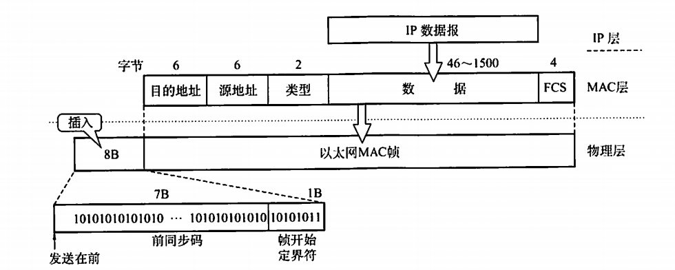
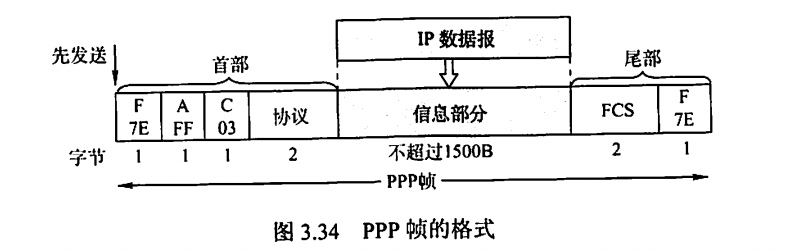

# 数据链路层

## 功能

- **为网络层提供服务：**将原机器来自网络层的数据传输到目标机器的网络层，提供除了无确认面向连接的服务之外的三种服务。
- **链路管理：**点对点通信，主要指的是面向连接的服务。什么建立连接，维持连接和释放连接等等。
- **帧定界、同步和透明传输：**三种成帧方式
- **流量控制：**集中传输协议
- **差错控制：**ARQ，海明码、循环冗余检测。

## 成帧

- **字符计数法：**太辣鸡不用了
- **字符填充的首尾定界法：**用特殊控制字符表示帧开始和结束。中间用转义字符实现特殊字符的传输。
- **==零比特填充的首尾标志法：==**用“01111110”标志帧的开始和结束。**五个1后面加一个0**

## 差错控制

### 检错编码

- **奇偶校验码**
- **循环冗余检测码：**$M(x)$看做多项式，找一个另外找一个r阶多项式$G(x)$，后面加上r个0，计算余数，加上余数，发出去。

### 纠错编码

- **海明码**（$n + k \leq 2^k -1$),将数字二进制分解，校验。

## 流量控制

- **停等协议**
- **可靠传输机制：自动请求重传（ARQ）**
- **滑动窗口协议**
  - **单帧滑动窗口与停等协议**：seq表示当前收到的编号，ack表示确认的编号，同时暗含希望收到哪一个编号的帧。
  - **多帧活动窗口的后退N帧协议（GBN）**：发送方的窗口大小为（$1\leq窗口大小\leq 2^n-1$）
  - **选择重传（SR)：**（$1\leq 窗口大小 \leq 2^{n-1}$),可以是无序接受。累计确认。

## 介质访问控制（MAC）

为使用介质的每一个节点隔离来自同一个信道上其他节点传送的信号。

### 信道划分介质访问控制

硬隔离，从空间或者时间上

- **频分多路复用（FDM)**
- **时分多路复用（TMD）**
- **波分多路复用（WDM）**
- **==码分多路复用（CDM）==：正交码片**

### 随机访问介质访问控制

通过争用的思想占领整个信道。

- **==ALOHA协议：==**自由发帧，没收到确认就等待一段时间重传

- **时隙ALOHA协议：**将时间划分为一个个时间片，只能在时隙开始的时候发帧，其他和ALOHA一样。

- **==CSMA（==**载波侦听协议）

  在节点要发送数据的时候侦听信道，空闲就发，被占用就等。

  - **1-坚持CSMA：**检测到空闲立刻发
  - **非坚持CSMA：**检测到忙就不听了，<u>随机等一段时间再听，</u>直到检测到空闲就立刻发送
  - **P-坚持CSMA：**听，检测到空闲就<u>以概率P发出去，以1-P的概率下一个时隙再说。</u>

- **==CSMA/CD协议：==**发之前侦听，发的时候进行碰撞检测。

  - **争用期：**2t，在争用期内就可以确定是不是产生碰撞
  - **最小帧长：**争用期*数据传输速率（以太网是64B），小于最小帧长的帧是碰撞的产物，非法的，要丢弃。
  - 结合**二进制指数后退算法**，当第k次产生冲突，就随机等待0到$2^k-1$个时间片，超过16次冲突就放弃发送。

- CSMA/CA协议：面向无线连接的协议，知道就行。

- 令牌传递协议：适用于环形网络，拥有令牌的可以发

- 位图协议：在时隙总如果想要发送就在属于他的时隙里登记，然后后面就会按照顺序发送

- 二进制倒计数协议：高序号站点有限

## 局域网（以太网）

数据链路层被分为逻辑链路控制（LLC）和媒体介入控制（MAC）子层。

### IEEE 802.3 标准

**使用CSMA/CD进行介质访问控制。采用无连接的工作方式。使用曼彻斯特编码**

**传输介质：**

- 10BASE5：粗线缆，总线型
- 10BASE2：细线缆，总线型
- 10BASET：双绞线，星型
- 10BASEF：光纤，点对点

### 以太网的MAC帧

**==mac地址：6字节，12个十六进制数。==**

**mac帧不用帧结束符，因为以太网在传输帧的时候帧之间要有一定的间隙。**

**==最小帧长64B==**，必要的时候进行字节填充。

## 广域网

广域网由一些节点交换机以及链路组成。交换机负责分组储存并转发。<u>节点之间都是点对点连接的。</u>

协议：PPP、HDLC

### PPP：面向字节的协议，用于点对点连接。

从SLIP协议的基础上发展起来，通过拨号或者专线的方式创建点对点连接，然后传输数据。由于是点对点的连接，所以不需要源地址和目的地址。也不用采用CSMA/CD协议。

### HDLC：面向比特的协议

## 硬件

- **NIC网卡：**网卡有一个独一无二的MAC地址，工作在数据链路层，也有部分工作在物理层。

- **网桥：**连接不同的LAN网段，实现流量过滤。可以隔离冲突域，避免广播风暴
- **交换机：**多端口网桥。

> 二层设备可以隔离冲突域（网卡，网桥，交换机）

### 数据链路层交换

每个站点所容纳的数量是有限的，最大传输距离也有限，所以网络要分段。同一个传输介质连接起来的站点集合就是网段。

网桥连接网段，用转发表来维护帧的转发或者丢弃。

**维护转发表：**

- 如果转发表中没有目的MAC地址的时候，向所有端口转发。
- 如果源地址不在转发表中，就将源地址进行登记
- 登记的时候记录时间戳，定期扫描将超时的记录删掉

**工作原理：**

- 目的地址和源地址相同，丢弃
- 两个地址不同，转发
- 目的地址端口未知，广播

为了整个链路的可靠，避免冗余，一般采用无环路的网络拓扑结构**（生成树算法）**