# 物理层

物理层的功能：在两个网络设备之间提供透明的比特流传输。

## 基本通信理论

#### 奈奎斯特定理：理想信道，无噪声信道

$ 最大传输速率 = 2Blog_2(V)$

#### 香农定理：有噪声信道

$ 最大传输速率 = Blog_2(1+\frac{S}{N})$

$分贝值 = 10log_{10}(\frac{S}{N})$

#### 波特率：每秒钟信号变化的次数

#### 比特率（数据传输速率）

$C = B * log_2n$

## 有线传输介质

- 磁介质，如磁带

- 双绞线

  - 非屏蔽双绞线
  - 屏蔽双绞线 

- 同轴电缆

- 电力线

- 光纤

  - 光导纤维的简称；
  - 由极细的玻璃纤维构成，把光封闭在其中并沿轴向进行传播；
  - 优点：重量轻、损耗低、不受电磁辐射干扰、传输频带宽、通信容量大
  - 缺点：昂贵、易断裂

  多模光纤适合短距离传输，单模光纤适合长距离传输。

## 数字调制与多路复用技术

**将数据变成模拟信号的过程叫调制，将数据变成数字信号的过程叫做编码**

- **将数据转换为数字信号**

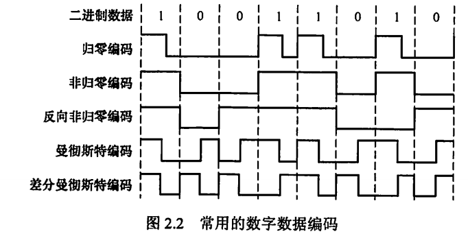

>  重点看曼彻斯特编码（以太网使用的编码）

4B/5B编码，将数据每4位作为一组，将其转换为5位码，32种组合中16种对应4位码，剩下的作为控制码。

- 将数据转换成模拟信号

  - 幅移键控（ASK)
  - 频移键控(FSK)
  - 相移键控(PSK)

  

  - 正交振幅调制(QAM)

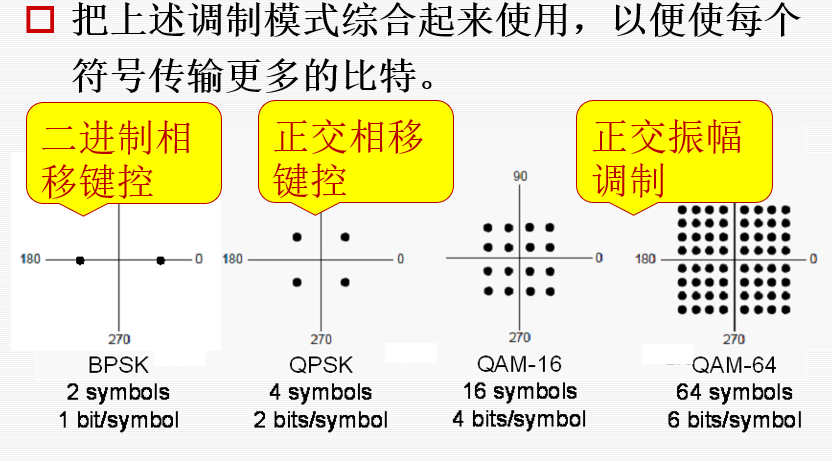

# 数据链路层

## 功能

- **为网络层提供服务：**将原机器来自网络层的数据传输到目标机器的网络层，提供除了无确认面向连接的服务之外的三种服务。
- **链路管理：**点对点通信，主要指的是面向连接的服务。什么建立连接，维持连接和释放连接等等。
- **帧定界、同步和透明传输：**三种成帧方式
- **流量控制：**集中传输协议
- **差错控制：**ARQ，海明码、循环冗余检测。

## 成帧

- **字符计数法：**太辣鸡不用了
- **字符填充的首尾定界法：**用特殊控制字符表示帧开始和结束。中间用转义字符实现特殊字符的传输。
- **==零比特填充的首尾标志法：==**用“01111110”标志帧的开始和结束。**五个1后面加一个0**

## 差错控制

### 检错编码

- **奇偶校验码**
- **循环冗余检测码：**$M(x)$看做多项式，找一个另外找一个r阶多项式$G(x)$，后面加上r个0，计算余数，加上余数，发出去。

### 纠错编码

- **海明码**（$n + k \leq 2^k -1$),将数字二进制分解，校验。

## 流量控制

- **停等协议**
- **可靠传输机制：自动请求重传（ARQ）**
- **滑动窗口协议**
  - **单帧滑动窗口与停等协议**：seq表示当前收到的编号，ack表示确认的编号，同时暗含希望收到哪一个编号的帧。
  - **多帧活动窗口的后退N帧协议（GBN）**：发送方的窗口大小为（$1\leq窗口大小\leq 2^n-1$）
  - **选择重传（SR)：**（$1\leq 窗口大小 \leq 2^{n-1}$),可以是无序接受。累计确认。

## 介质访问控制（MAC）

为使用介质的每一个节点隔离来自同一个信道上其他节点传送的信号。

### 信道划分介质访问控制

硬隔离，从空间或者时间上

- **频分多路复用（FDM)**
- **时分多路复用（TMD）**
- **波分多路复用（WDM）**
- **==码分多路复用（CDM）==：正交码片**

### 随机访问介质访问控制

通过争用的思想占领整个信道。

- **==ALOHA协议：==**自由发帧，没收到确认就等待一段时间重传

- **时隙ALOHA协议：**将时间划分为一个个时间片，只能在时隙开始的时候发帧，其他和ALOHA一样。

- **==CSMA（==**载波侦听协议）

  在节点要发送数据的时候侦听信道，空闲就发，被占用就等。

  - **1-坚持CSMA：**检测到空闲立刻发
  - **非坚持CSMA：**检测到忙就不听了，<u>随机等一段时间再听，</u>直到检测到空闲就立刻发送
  - **P-坚持CSMA：**听，检测到空闲就<u>以概率P发出去，以1-P的概率下一个时隙再说。</u>

- **==CSMA/CD协议：==**发之前侦听，发的时候进行碰撞检测。

  - **争用期：**2t，在争用期内就可以确定是不是产生碰撞
  - **最小帧长：**争用期*数据传输速率（以太网是64B），小于最小帧长的帧是碰撞的产物，非法的，要丢弃。
  - 结合**二进制指数后退算法**，当第k次产生冲突，就随机等待0到$2^k-1$个时间片，超过16次冲突就放弃发送。

- CSMA/CA协议：面向无线连接的协议，知道就行。

- 令牌传递协议：适用于环形网络，拥有令牌的可以发

- 位图协议：在时隙总如果想要发送就在属于他的时隙里登记，然后后面就会按照顺序发送

- 二进制倒计数协议：高序号站点有限

## 局域网（以太网）

数据链路层被分为逻辑链路控制（LLC）和媒体介入控制（MAC）子层。

### IEEE 802.3 标准

**使用CSMA/CD进行介质访问控制。采用无连接的工作方式。使用曼彻斯特编码**

**传输介质：**

- 10BASE5：粗线缆，总线型
- 10BASE2：细线缆，总线型
- 10BASET：双绞线，星型
- 10BASEF：光纤，点对点

### 以太网的MAC帧

**==mac地址：6字节，12个十六进制数。==**

**mac帧不用帧结束符，因为以太网在传输帧的时候帧之间要有一定的间隙。**

**==最小帧长64B==**，必要的时候进行字节填充。

## 广域网

广域网由一些节点交换机以及链路组成。交换机负责分组储存并转发。<u>节点之间都是点对点连接的。</u>

协议：PPP、HDLC

### PPP：面向字节的协议，用于点对点连接。

从SLIP协议的基础上发展起来，通过拨号或者专线的方式创建点对点连接，然后传输数据。由于是点对点的连接，所以不需要源地址和目的地址。也不用采用CSMA/CD协议。

### HDLC：面向比特的协议

## 硬件

- **NIC网卡：**网卡有一个独一无二的MAC地址，工作在数据链路层，也有部分工作在物理层。

- **网桥：**连接不同的LAN网段，实现流量过滤。可以隔离冲突域，避免广播风暴
- **交换机：**多端口网桥。

> 二层设备可以隔离冲突域（网卡，网桥，交换机）

### 数据链路层交换

每个站点所容纳的数量是有限的，最大传输距离也有限，所以网络要分段。同一个传输介质连接起来的站点集合就是网段。

网桥连接网段，用转发表来维护帧的转发或者丢弃。

**维护转发表：**

- 如果转发表中没有目的MAC地址的时候，向所有端口转发。
- 如果源地址不在转发表中，就将源地址进行登记
- 登记的时候记录时间戳，定期扫描将超时的记录删掉

**工作原理：**

- 目的地址和源地址相同，丢弃
- 两个地址不同，转发
- 目的地址端口未知，广播

为了整个链路的可靠，避免冗余，一般采用无环路的网络拓扑结构**（生成树算法）**

# 网络层

## 功能

- 实现异构网络物联，向上提供无连接的数据包服务。
- 路由选择与转发：路由选择是控制层的事情，转发是数据层的事情
- 拥塞控制

## 路由选择算法

- 静态路由算法：网络管理员手工配置，用于简单小型网络

- DV路由算法（RIP）

  - 定期将自己的路由表转发给所有与之相邻的节点
  - 根据从别人收到的转发表更新自己的转发表

  RIP：使用跳数作为代价，最多15跳。每30s广播一次更新信息。是应用层协议，使用UDP。

- LS路由算法（OSPF）：

  - 每个人测试自己邻接节点的状态
  - 将相邻节点的状态广播给所有的节点
  - 节点根据从别人那里获得的状态集合用SPF(最小生成树算法)生成转发表

  OSPF：用泛洪法发送信息，是网络层协议

- 层次路由

  - 将互联网划分成许多自治子系统
  - 每个系统内部有自己的路由选择协议（IGP）。
  - 每个系统之间有外部网关协议（BGP）。是应用层协议，基于TCP

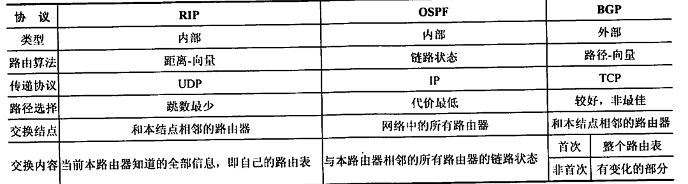

## IP协议

IP协议定义数据传输的基本单元————IP分组和其确切的数据格式，也包含一套规则，讲明白分组应该如何处理，戳五如何控制。

## IPV4

### 分组格式

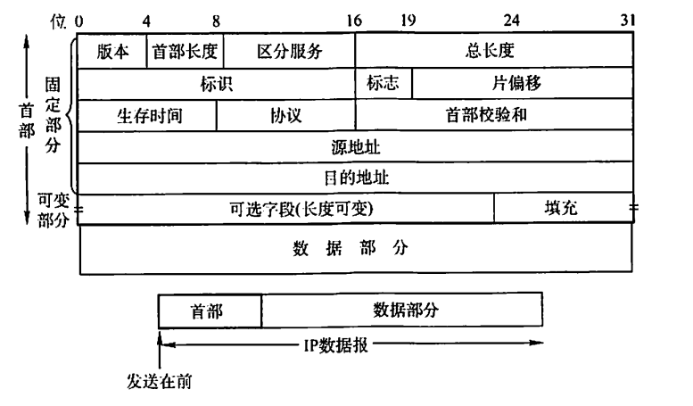

#### 三种长度：

- 首部长度：4位，单位是4B，表示首部长度最大为60B
- 总长度：16位，单位1B，表示总长度最大65535B
- 片偏移：13位，单位8B，每一个分片长度必须是8B的整数倍

#### 与分片有关的：

- 标志：占3位，MF表示是否后面还有分片，DF表示是否不允许分片。
- 片偏移
- 标识：同一个分组的片有同样的标识。

#### 与协议相关：

- 版本：表示使用什么IP协议版本
- 协议：表示上层应该交付给什么协议，6表示TCP，17表示UDP

#### 与传输相关

- 源地址
- 目的地址
- 生存时间

### 数据报分片

为了不超过MTU（1500B），对数据包进行分片处理。每一个分片都必须要有首部。每个分片的长度都是8B的整数倍。目的网络层接收到分片根据标识、片偏移和标志进行数据报的重组。

### IPv4地址

32位，划分为网络号和主机号。以网络号为单位进行分配。

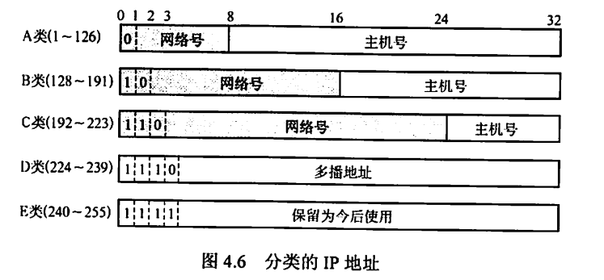

特殊的地址：

- 主机号全为0：表示网络本身
- 主机号全为1：本网络广播地址
- 127.x：回环自检地址
- 32位全为0：本网络上的本主机
- 32位全为1：受限广播地址

使用范围：

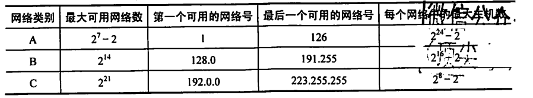

### NAT（网络地址变换）

划分出一些专用网络地址，可在不同LAN中重用。NAT将专用网络地址转换为公用地址。

私有IP地址网段：

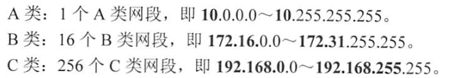

NAT路由器存放着NAT转换表，实现{本地IP地址：端口}到{全球IP地址：端口}的映射。可以让多个私有地址映射到一个全球的IP地址。

**工作在传输层**

### 子网划分

从主机号中借用一些bit来作为子网号，将二级IP地址划分为三级IP地址。{网络号，子网号，主机号}。子网划分是一个网络内部的事情，传输的时候还是根据网络号进行转发的。

#### 子网掩码

与IP地址相对应的，长度位32位的二进制串，1对应网络号以及子网号，0表示主机号。通过掩码和IP地址的与运算，就可以得到对应子网的网络地址。

#### CIDR（无分类编址）

斜线记法：例如：128.14.32.5/20表示掩码是20个连续的1和12个连续的0。

超网：将网络前缀都相同的IP资质组成CIDR地址块，一个CIDR地址块就可以表示很多地址。

因为有了这种无分类编址的概念，就需要使用==最长前缀匹配==的方法来确定向哪一个路由器转发。

### ARP（地址解析协议）

虽然网络层是用IP进行寻址，但是在实际链路的传输中还是要用MAC地址进行寻址。ARP提供了IP地址向MAC地址的映射。用ARP动态维护一个ARP表

- 先看ARP表中有没有下一跳的IP地址，如果有就查出MAC地址，将其填入MAC帧之中发送出去。
- 如果没有就广播一个ARP请求分组，等对方回应，然后将得到的信息写入ARP表

### DHCP（动态主机配置协议）

基于UDP，是应用层协议

- 客户机广播DHCP发现消息，找服务器
- 服务器收到请求，广播DHCP提供消息，提供IP地址
- 客户机收到提供消息，接收的话就要广播DHCP请求
- 服务器广播确认消息

### ICMP（网络控制报文协议）

- ICMP差错报告报文
- ICMP询问报文

常用场景就是PING，用来测试两台主机之间的连通性。PING工作在应用层，直接使用网络层中的ICMP

## IPv6

- 128位。
- 首部长度是8B的整数倍
- 不允许分片
- 书写格式可以紧凑缩写。

### IP组播

- 仅用于UDP，主机在组播的时候仅发送一份数据。
- 使用IGMP协议（因特网组管理协议）
- 使用D类地址
- 以组的方式管理

### 移动IP

移动IP指的就是移动节点以固定的网络IP地址实现跨越不同网段的漫游。

- 移动节点：具有永久IP地址的移动节点
- 归属代理：移动节点的永久性居所
- 外部代理：在外部网络中帮助移动节点完成移动管理功能的实体。

基本通信流程：

- 移动节点向本地代理注册当前地址（转交地址）
- 本地代理建立到转交地址的隧道，将获取的分组通过隧道转给转交地址
- 在转交地址处解除封装，就可以获得到分组
- 移动节点在外网通过外网的路由器向通信放发送IP数据包

# 传输层

## 功能

- 为运行在不同主机上的进程提供逻辑通信（端到端）。
- 提供复用和分用。发送方复用，接收方分用。
- 进行差错控制。
- 提供面向连接的TCP和无连接的UDP

## 端口

### 作用

端口对应进程。就好像IP在网络层的作用和MAC地址在数据链路层的作用。

### 端口号

- 熟知端口号：0~1023（分派给最重要的一些进程，大家都知道的进程）
- 登记端口号：1024~49151（给没有熟知端口号的进程使用的，需要等级）
- 临时端口：给客户进程运行的时候动态选择，通信结束之后不复存在。

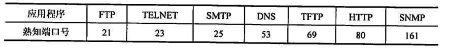

### 套接字

$$
Socket = (IP地址： 端口号)
$$

唯一表示网络中的一个主机和其上的一个应用。TCP是建立在两个套接字上面的。

## UDP

在IP数据包服务的基础上增加两个基本功能：复用、分用和差错检测。

特点：

- 无连接，没有连接时延
- 不用跟踪维护连接状态
- 首部只有8B
- 没有拥塞控制
- 不保证可靠交付，面向报文

### UDP数据报

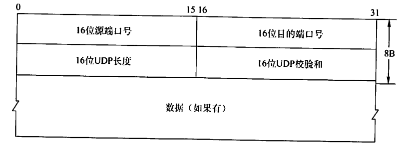

### UDP检验

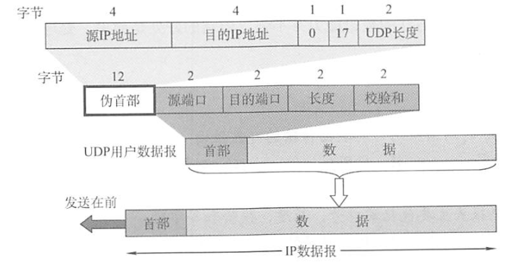

利用伪首部进行校验和的计算。伪首部用二进制反码求和。

> 二进制反码求和指的是正常求和，然后高位多出来的进位累加到原来的数字上。求和之后取反码，就是校验和。

## TCP

特点：

- 面向连接，是一条逻辑上的连接
- 每个TCP连接只能有两个断电，每一条连接都是端到端。
- TCP提供可靠交付，保证数据无差错，不丢失，不重复而且有序
- TCP全双工，设置有缓冲区
- 面向字节流，将数据看做字节流来处理

### TCP报文段

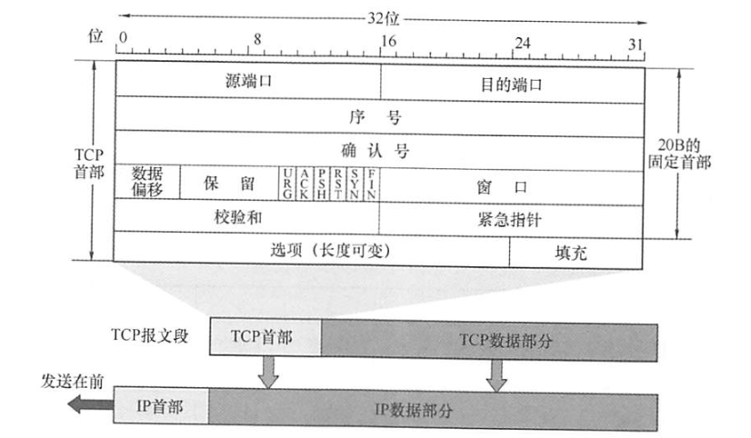

和协议相关的：

- 源端口和目的端口
- 数据偏移：单位是4B，就是首部长度
- 保留位：目前全部为0
- 校验和

和控制相关的：

- URG：表示紧急位，要和紧急指针一起工作，紧急指针标志有多少字节的数据是紧急的
- ACK：确认标志，1的时候表示确认号有用
- PSH：推送位，表示立马发出去，不要缓存了
- RST：为1的时候表示要释放连接然后重连
- SYN：同步位，1的时候表示是连接请求或者连接接受报文
- FIN：终止位：1的时候用来释放连接

和可靠传输相关的：

- 序号：表示发的数据的第一个字节的编号
- 确认号：表示下一个想要接收到的字节序号，表示前面的序号已经全部接受了。
- 窗口：表示对方还能接受多少

### TCP连接

### 建立连接：三次握手

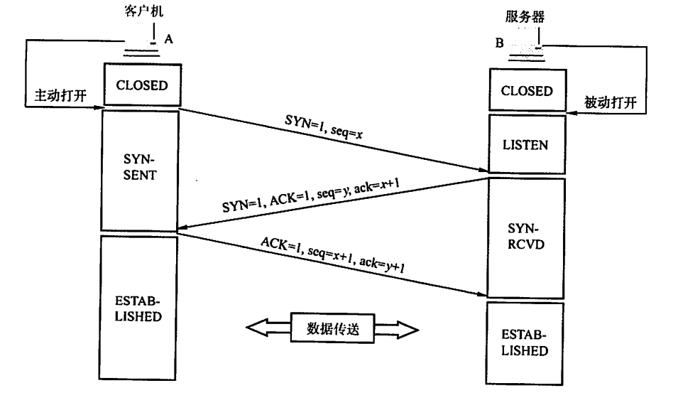

### 释放连接：四次握手

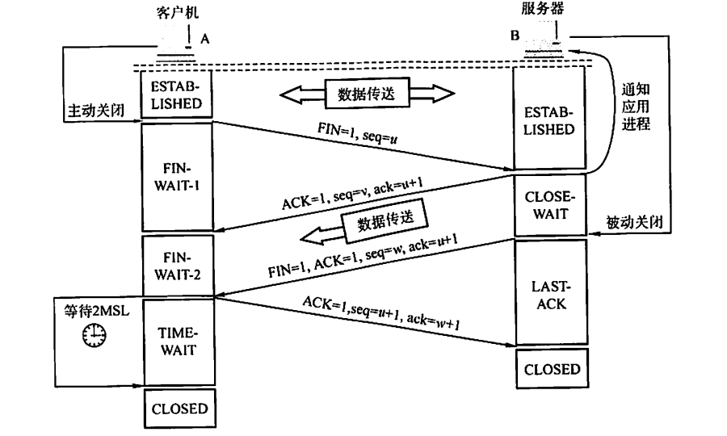

### TCP可靠传输

- 超时：计算加权RTT，动态调整超时时间
- 冗余ACK：如果发送12345,2丢了，345到了，就发三次1的ack。对方受到了多次1的ack，就知道出事了，立马==快速重传==2。

### 两个窗口：接受窗口rwnd、拥塞窗口cwnd

- 接收方根据自己的缓存大小，动态调整发送方的发送窗口大小，在TCP报文中填写“窗口”字段。

- 发送方根据自己估算的网络拥塞程度而设置的窗口值，反映当前网络的容量。

发送窗口的上限值取两个创窗口的最小值。

### 拥塞控制

#### 慢开始、拥塞避免

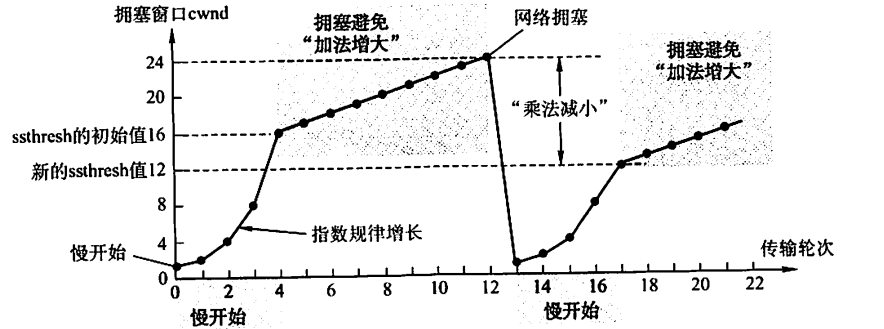

#### 快重传和快恢复

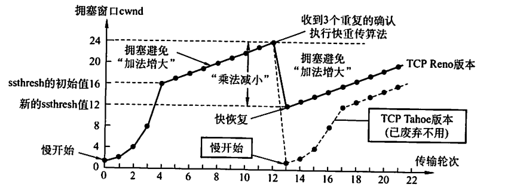

有两种状态表示网络拥塞，第一种是超时，超时用的就是普通的将cwnd降到1；第二种就是冗余ack，这个时候用快重传，快恢复

# 应用层

## DNS

用特定含义的主机名来代替IP地址作为输入，提供主机名到IP地址的映射。

### 层次域名空间

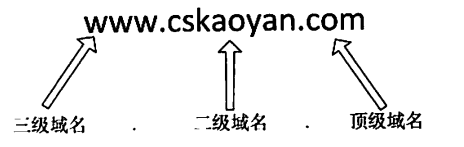

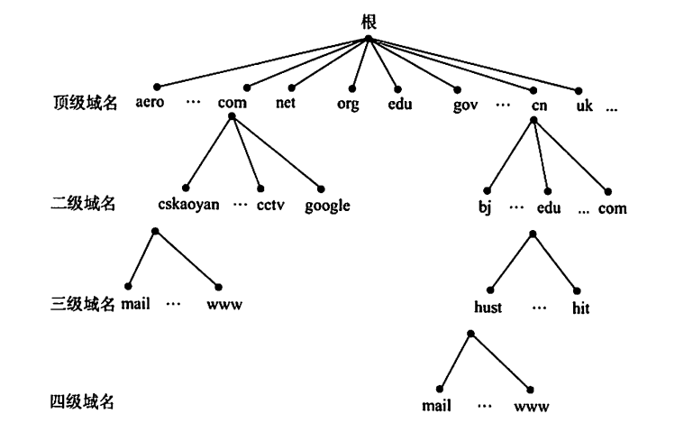

### 域名服务器

- 根域名服务：最高层次的域名服务器，存在所有顶级域名服务器的IP地址
- 顶级域名服务器：存放在本顶级域名服务器注册的所有二级域名
- 授权域名服务器：存放具体主机的IP地址（最终在这里找到要找的解析）
- 本地域名服务器

### 域名解析

- 递归查询
- 递归和迭代结合

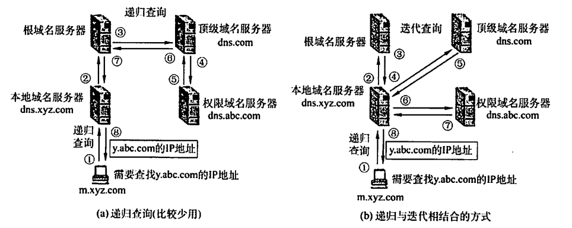

## 文件传输协议（FTP）

- 控制进程：用来接受数据传送的请求，并启动数据传送进程
- 数据传输进程：用来进行实际的数据传输。

## 电子邮件

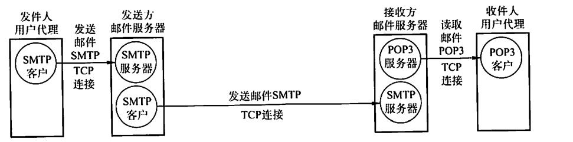

发邮件用SMTP协议，读取邮件用的是POP协议

### 电子邮件格式

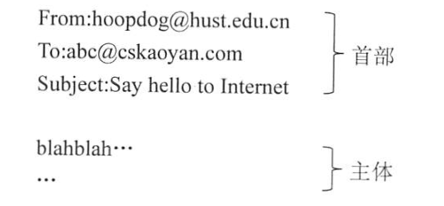

#### MIME

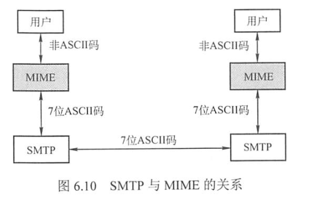

#### SMTP

- 建立俩姐
- 邮件发送
- 连接释放

#### POP3和IMAP

从邮件服务器上拉取用户邮箱中的数据。

pop3提供“下载并保留”和“下载并删除”两种方式，IMAP更为复杂，提供文件夹功能，和只读取邮件部分内容。

## 万维网（WWW）

#### 统一资源定位符（URL）：整个万维网上唯一表示一个资源。

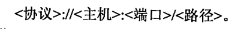

#### 超文本传输协议（HTTP）

提供持久连接或者非持久连接。

- 持久连接：发送响应后仍然保持这条连接
- 非持久连接：对网页的每一元素对象都要单独建立TCP连接进行传输。

http是没有记忆的，一般用cookies和数据库的方式来保存访问信息

- 客户访问服务器，服务器给他分配一个唯一的cookies
- 客户拿到自己对于这个网站的cookies，存起来。
- 用户以后访问的时候就加上这个cookies，告诉服务器自己是谁
- 服务器查一下自己的数据库，找到对应cookies的访问历史记录，做出对应的反应。

#### HTTP报文结构

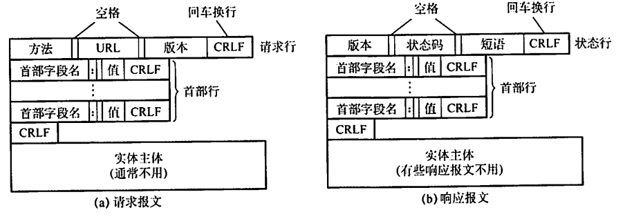

