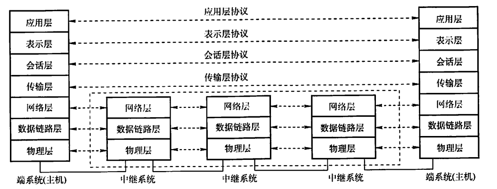
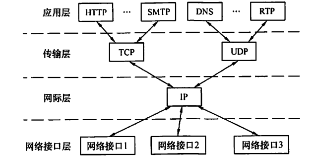

# 计算机网络体系结构

## 计算机网络概述

从组成部分上看，计算机网络由硬件、软件和协议组成。协议是计算机网络的核心。

从工作方式上看，可以分为边缘部分（用户使用的主机）和核心部分（网络和路由器）

从功能组成上看，可以分为通信子网和资源子网，

### 计算机网络功能

- 数据通信
- 资源共享
- 分布式处理
- 提高可靠性
- 负载均衡

### 计算机网络分类

#### 按照分布范围分类

- 广域网：采用交换技术
- 城域网
- 局域网：采用广播技术
- 个人区域网

#### 按照传输技术分类

- 广播式网络:发生在数据链路层
- 点对点网络

#### 按照拓扑结构分类

- 总线型
- 星型：局域网
- 环形：局域网
- 网状型：广域网

### 性能指标

- 带宽（b/s）
- 时延

$$
总时延 = 发送时延 + 传播时延 + 处理时延 + 排队时延
$$

- 时延带宽积

$$
时延带宽积 = 传播时延 + 信道带宽
$$

- 往返时延（RTT）：从发送一个分组到收到确认的时延。
- 吞度量
- 信道利用率
- 速率

ARPAnet是最早的网络

## OSI参考模型

| 层         | 传输单位       | 任务                           | 协议                   |
| ---------- | -------------- | ------------------------------ | ---------------------- |
| 物理层     | 比特           | 传输比特流                     | EIA-232C等             |
| 数据链路层 | 帧             | 将IP数据包封装成帧             | SDLC、HDLC、PPP、STP等 |
| 网络层     | 数据报         | 将分组从源传到目的             | IP、ICMP、IGMP、ARP等  |
| 传输层     | 报文段、数据段 | 为端到端提供通信               | TCP、UDP               |
| 会话层     |                | 让不同主机的进程进行通信       |                        |
| 表示层     |                | 处理不同系统交换信息的表示方式 |                        |
| 应用层     |                | 为特定的应用提供网络控制       | FTP、SMTP、HTTP        |

## TCP/IP模型

网络接口层对应物理层和数据链路层。

### 两个模型的比较

相同点：

- 分层
- 基于独立的协议栈概念
- 都可以结构网络异构问题

不同点：

- OSI明确定义服务、协议和接口，而TCPIP没有明确区分
- OSI先于协议被创造，TCP后于协议被创造
- TCPIP对于异构问题更友好
- OSI在网络层支持无连接和有连接，但是在传输层只有面向连接的通信。TCP/IP在网络层只有无连接，传输层支持无连接和有连接。（重点区别）

