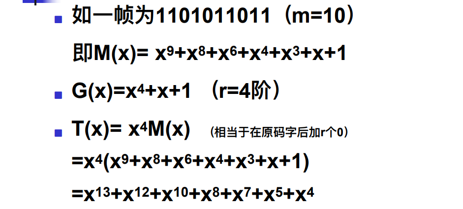

# 数据链路层

## 可靠的DLL

### 数据链路层功能

在物理层的基础上向网络层提供服务。加强物理层传输原始比特流的特性，将物理层可能出错的物理连接改造成逻辑上无差错的数据链路。

提供以下功能：

- 链路管理
- 成帧：三种成帧方法
- 流量控制：六种协议
- 差错控制：纠错检错码（海明码、循环冗余检测码）

**DLL提供的服务**

- 确认：接收⽅在收到数据帧后，必须给发送⽅发回⼀个确认
- ⾯向连接：发送⽅和接收⽅在传输数据之前必须建⽴逻辑连接，传输结束后必须释放连接
- 服务种类
  - ⽆确认的⽆连接服务
    - ⽆确认是指接收⽅在收到数据帧后，毋需发回⼀个确认
    - ⽆连接服务是指在数据传输前毋需建⽴逻辑链路
    - ⽆确认并⾮不可靠，可靠性由上层协议负责
    - 局域⽹主要采⽤这种⽅式，因为：
      - 共享信道毋需建⽴连接
      - 信道较为理想，数据传输的误码率很低
      - 即使出错或丢失由上层负责恢复
    - 适⽤于实时通信
  - 有确认的⽆连接服务
    - 使⽤前不建⽴连接，即不建⽴数据链路，但每帧传输必须得到确认
    - 如果没有得到确认，将重传
    - 这在信号传播延时较⼤、线路状态不⼀定很可靠的情况下是有效的
      - 例如：⽆线通信，信道使⽤率很低但数据传输的误码率相对较⾼，确认是必要的
  - 有确认的⾯向连接服务
    - 使⽤前先建⽴连接，即先建⽴数据链路，并且每帧的传输必须得到确认
    - 有连接的服务必须在使⽤前先建⽴连接（即建⽴逻辑链路），然后使⽤，最后释放
      - 例如：电话

### 成帧的方法

> 之所以要组帧，是为了在出错的时候只重传出错的帧，不必重发所有帧。

- 数据链路层使⽤物理层提供的服务，物理层处理的是位流，数据链路层处理的是帧

- 将原始的位流分散到离散的帧中，叫成帧，成帧的⽅法有：

  - **字符计数法**

    

    - 特点
      - 简单
      - 缺点：⽆法恢复
      - 已经很少使⽤

  - **带字节/字符填充的标志字节法**

    - 该⽅法考虑了错误之后重新同步的问题，让每⼀帧都⽤⼀些特殊的字节作为开始和结束
    - 标志字节（flag byte）

    

    - 缺点：
      - 容易造成帧界混淆，——增加转义字节
      - 依赖于8位字符
    - 解决⽅法
      - ⼀种⽅法是在⼆进制数中偶然出现的标志字节前插⼊⼀个转义字节。这就称为字节/字符填充法
      - 新技术的采⽤——位填充

  - **==⽐特填充的⽐特标志法==**

    - 这是⼀种⾯向⼆进制位的帧格式，把所有需传输的数据以⽐特位⼀字排开，并以特殊的位模式01111110作为帧标志，即⼀个帧的开始（同时标志前⼀个帧的结束）
    - 当帧内容中出现⼀个与帧标志相同的位串01111110，则在5个1后插⼊⼀个0，即变成01111101，接收⽅将⾃动删除第5 个1后的0。这称为**位填充法**，也称为透明传输。
    - 如果由于⼲扰，⼀个帧没有正确接收，则可扫描接收串，⼀旦扫描到01111110，即新的⼀帧从此开始。即可以再同步

    

  - 物理层编码违例法

    - 在曼切斯特编码中，连续⾼电平或连续低电平可⽤作帧边界
      - 采⽤冗余编码技术，如曼切斯特编码，即两个脉冲宽来表示⼀个⼆进制位
      - 数据0：低-⾼电平对
      - 数据1：⾼-低电平对
      - ⾼-⾼电平对和低-低电平对没有使⽤，可⽤作帧边界

### 纠错检错方法

**差错类型**

- 单个错误：分散在各块中
- 突发错误：集中在某个块中
- 例⼦：
  - 块⼤⼩： 1000 bits （100个块）
  - 出错率是：每个⽐特 0.001（1%0）
- 突发错误⽐单个错误更加难于纠正

#### 海明码

**海明距离**

- 码字：包含数据和校验位的n位单元。
- 海明距离
  - 两个码字(codeword)的海明距离 : 两个码字之间不同位的数⽬。
    - 如：10**001**001 和10**110**001 的海明距离为3。
  - 异或
- 全部码字的海明距离
  - 全部码字中任意两个码字之间海明距离的最⼩值。
- 海明距离的意义：如果海明距离为d，则⼀个码字需要发⽣d个1位错误才能变成另外⼀个码字

**海明距离纠错检错**

- 海明距离为d+1的编码能检测出d位差错。

  - 因为在距离为d+1的检验码中，只改变d位的值，不可能产⽣另⼀个合法码。如奇偶校验码，海明距离为2，能查出单个错。

- 海明距离为2d+1的编码，能纠正d位差错。

  - 因为此时，如果⼀个码字有d位发⽣差错，它仍然距离原来的码字距离最近，可以直接恢复为该码。

  

			

- 随着海明距离的增加，纠错的能⼒也增加；即海明距离越⼤，纠错能⼒越强。
- 海明距离为3，可以纠正1个错误；⽽海明距离为5，可以纠正2个错误。
- 当⼀个系统中的海明距离增加的时候，合法码字就减少了；即传输效率降低

**纠正单位比特错误的冗余位下界**

**海明码纠错码**

- 每⼀个码字从左到右编号，最左边为第1位

- 校验位和数据位

  - 凡编号为2的乘幂的位是校验位，如1、2、4、8、16、……。
  - 其余是数据位，如3、5、6、7、9、……。

- 每⼀个校验位设置根据：包括⾃⼰在内的⼀些位的集合的奇偶值(奇数或偶数)。

- 将某⼀位数据位的编号展开成2的乘幂的和，那末每⼀项所对应的位即为该数据位的校验位(收⽅使⽤)。

  		如： 11 = 1 + 2 + 8
  		29 = 1 + 4 + 8 + 16

  - 校验位1的检验集合为所有奇数位。

  - 校验位2的检验集合：2、3、6、7、10、11、…

  - 校验位4的检验集合：4、5、6、7、……

  - 校验位8的检验集合：8、9、10、11、……

    

- 待发送的数据：0 0 1 1 0 0 1 0 0 **0**

  - 校验位1：P1= P1⊕ D1⊕ D2⊕ D4⊕ D5⊕ D7 =∑(0,1,0,1,0,0)=0
  - 校验位2：P2= P2⊕ D1⊕ D3⊕ D4⊕ D6⊕ D7=∑(0,1,0,1,0,0)=0
  - 校验位4：P3= P3⊕ D2⊕ D3⊕ D4=∑(0,0,0,1)=1
  - 校验位8：P4= P4⊕ D5⊕ D6⊕ D7=∑(0,0,0,0)=0

- 错误码字：0 0 1 1 0 0 1 0 0 **1**

  - 校验位1：P1= P1⊕ D1⊕ D2⊕ D4⊕ D5⊕ **D7** =∑(0,1,0,1,0,0)=1（校验错）
  - 校验位2：P2= P2⊕ D1⊕ D3⊕ D4⊕ D6⊕ **D7**=∑(0,1,0,1,0,0)=1（校验错）
  - 校验位4：P3= P3⊕ D2⊕ D3⊕ D4=∑(0,0,0,1)=1
  - 校验位8：P4= P4⊕ D5⊕ D6⊕ **D7**=∑(0,0,0,0)=1（校验错）
  - 差错计数器=1+2+8=11,即D7出错。

**海明码纠错突发错误**

- 将连续的k个码字按⾏排列成矩阵
- 发送数据时，按列发送，每列k位
- 如果⼀个突发性错误⻓度是k位，则在k个码字中，⾄多只有⼀位受到影响，正好可⽤海明码纠错改位后恢复

**检错码**

**奇偶校验码**

- ⼀个校验位（ Parity Bit）追加到数据后。
- 校验位的值取“0”还是“1”，取决于整个码字的总的“1”的个数。（奇数还是偶数）。
  - Data: 1011010
  - Even: 1011010 0 （偶校验）
  - Odd: 1011010 1 （奇校验）
- 海明距离等于 2。
  - 如果1个⽐特发⽣了跳变错误，可以检测出来。
  - 如果2个⽐特发⽣了跳变错误，接收⽅⽆法检测出错误，认为码字正确。

- 交替的N位校验，可检查出最多N位的突发错误

  - N位下的突发都可检出。

    

#### **校验和**

- 校验和通常是按照N位码字来进⾏模2和运算，发放将运算结果附加在数据报⽂尾部，作为校验位

- 特点:
  - ⽐奇偶检验更好的检错性能
  - 能检出⾼致N位的突发错

#### **循环冗余校验**

**发送端生成CRC**

例如

计算11010110110000/10011 得余数1110，即CRC码为11010110111110

- 如CRC码在接收端能被10011整除则说明接收正确。
- 如发送⽅发送的T(x)，接收⽅收到的是T(x)+E(x)，如果不能被整除，则被检测到已出错。

**接收端检查**

- Sender
  - 在数据帧的低端加上r个零，对应多项式为X^rM(x)
  - 采⽤模2除法，⽤G(x)去除X^rM(x)，得余数
  - 采⽤模2减法，⽤X^rM(x)减去余数，得到带CRC校验和的帧
- Receiver
  - ⽤收到的幀去除以G（x）
  - 为零：⽆错误产⽣
  - ⾮零：发⽣了错误，重传

优点

- 可以检测到所有⻓度⼩于等于r的突发错误
- ⼴泛⽤于各种⽹络，⼏乎所有的局域⽹

> 通俗一点，就是将原数据m位进行二进制分解。规定一个r阶多项式，将原数据后面加上r个零，然后除这个多项式，将得到的余数加到数据上，然后传出去。接收到的人同样进行除法，如果余数为0就是没有差错。

## 6个协议

### 无限制的单工协议

- 数据单向传送
- 收发双方的网络层都处于就绪状态（随时待命）
- 处理时间忽略不计（瞬间完成）
- 可用的缓存空间无穷大（无限空间）
- 假设DLL之间的信道永远不会损坏或者丢失帧（完美通道）
- “乌托邦”

### 单工停—等协议

- 解决如何避免收方被涌入的数据淹没，即取消“接收方允许无限量接收”的假设
- 解决方法：收方回发一个**哑帧**，接收方收到哑帧，表明收方允许接收数据，此时再次发送下一帧数据。
- 实际上是半双工协议

### 有错误信道的单工协议

- 有噪声就会产生差错，有差错就可能会引起以下这些问题： 
  - 接收方检测到错误帧，如何通知发送方？如何恢复正确帧？ 
  - 数据帧或确认帧在途中丢失将如何解决？ 
  - 有可能收到重复帧，如何解决？

- 解决方法：确认；重发；计时器；帧序号。 
  - 确认帧 
    - 接收端进行差错检查后，发确认帧送回发送端，告诉接收是否正确。 
    - 为了减少网络内的流量，**只在接收无差错时才发确认帧**，出错时不发确认帧。发送端等候计时器给定的时间后仍未收到确认帧，则知道接收出错，此时发送端重发原来的帧。
      - ARQ:automatic repeat request(自动重复请求) 
      - PAR:positive acknowledgement with retransmission（带有重传的肯定确认）
  - 重发 
    - 网络中采用检错码，无法纠正错误，由重发原来帧的方式来恢复正确的帧。 
  - 计时器 
    - 控制何时重发，防止无限期等待（死锁）。 
    - 通过发送方计时器（超时）解决。 
      - 超时（TimeOut）：在传输过程中，所发送的帧丢失，接收方根本没有收到，不可能发送确认帧（包括否定性确认），而发送方正在等待接收方的确认帧，当然也不可能等到接收方的确认。所以，发送方一旦发送一帧，就启动一计时器，在规定的时间内，一般都应收到确认，如收不到确认，则在计时器溢出时，再重发此帧。
      - 确认超时：捎带确认超时，单发确认帧
  - 帧序号 
    - 防止重发时接收端收到重复的帧，序号还用于接收时排序。 
    - 保证送给网络层的都是按序无重复的分组
    - 捎带确认
      - 进一步减少确认帧。 
      - 捎带确认：将确认暂时延迟以便可以钩到一个外发的数据帧（s.ack）
      - 如无法“捎带”，当一个控制捎带确认的计时器超时后，单独发确认帧。

**滑动窗口协议**

- 提高效率的方法
  - 传输方式：全双工（full-duplex）
  - 确认方式：捎带（piggyback）
  - 发送/接收方式：滑动窗口（sliding window）
- 滑动窗口协议
  - 协议4：n=1——引出滑动窗口的基本概念
  - 协议5：回退n帧（Go Back n）
  - 协议6：选择重传（Select Repeat）

- 滑动窗口的基本概念
  - 每个待发送帧被赋予一个序列号seq
    seq的取值范围是 0 ~ 2^n-1（n位字段）
  - 建立缓冲区
    - 发送窗口：**缓存已发送、待确认的帧**
      - 顺序接收来自网络层的分组，成帧，赋予序列号
      - 最多保存W个已经发送、等待确认的帧
      - 窗口达到最大值W时强制关闭网络层
    - 接收窗口：**缓存期待接收的帧**
      - 对进入窗口的帧顺序提交网络层，产生确认
      - 落在窗口外的帧被丢弃

### 一位的滑动窗口协议

- 滑动窗口用于控制网络中的流量。 
- **发送方和接收方接收能力**的匹配即流量控制。 
- 如接收方的处理能力低于发送方，接收方的缓冲区可能被“占满”，所以通常在接方收的缓冲区到达一定量时，应及时通知发送方，暂停发送，等候通知，这就是流量控制机制。

**原理**

- 接收方收到帧后，首先核对是否为预期帧号(frame_expected)，如果是的，则接收并frame_expected+1，即移动接收窗口。 
-  发送端收到应答帧，核对响应帧号next_frame_to_send，核对无误后，从网络层取新的帧，并执行next_frame_to_send+1，即移动发送窗口。如核对帧号不正确，则不移动窗口

- 窗口设置
  - 滑动窗口最大值：MAX_SEQ = 1
  - 通信双方初始值：seq =0, ack=1（期待接收seq=0）
- 窗口滑动机制
  - A首先发送数据帧（seq=0, ack=1, A0）
  - B收到A0，发送捎带确认帧（seq=0, ack=0, B0） 
  - A收到对A0的确认，滑动窗口，发送帧（seq=1, ack=0, A1）
- 特点
  - 序列号seq和确认值ack“0”“1”交替
  - 滑动窗口长度W=1，收到确认才移动窗口
  - 保证按顺序将接收到的正确帧只一次上交网络层

正常情况下发送滑动窗口机制

异常情况一：对重复帧的差错控制（定时器设置断了）

异常情况二：同步开始发送过程的差错控制（同时开始传输）

- **协议4的信道利用率**

  - 在协议4中假设:以下时间是可以忽略的：
    - 接收方处理到达帧的时间

  - 事实上，在低速信道上，来回时间（RTT：the round-trip time）可能非常大 ，发送方在这段时间处于blocked状态

  - 如果:
    - 信道传输速率是： b bps
    - 每帧的大小是： k bits
    - 来回时间是： R sec
    - 则信道的利用率是：

- **提高信道利用率的方法**

- **计算最合适的w值**

  - 信道上的容量：一帧从发送方传输到接收期间可容纳的帧数量

  - 带宽-延迟积：BD

  - 窗口值：w=2*BD+1

    实际上: w≤2*BD+1

### **回退n帧协议**

- 接收方的接收策略选择：
  - 丢弃错帧，其后续帧因不是期望接收帧也被丢弃（接收窗口为1）。
- 发送方的重传策略选择：
  - 缓存在发送窗口中的出错帧以及其后续帧全部重发。

- 基本概念
  - 定义序列号seq的取值范围和滑动窗口长度W
  - 发送方连续发送至发送窗口满
  - 接收窗口为1，对出错帧不确认（引发超时）
  - 发送方超时重传，从未被确认帧开始

- 工作原理分析
  - 发送方
    - 正常发送
      - 对帧编号，待确认帧缓存
    - 收到确认
      - 释放确认帧所占缓冲区，滑动发送窗口
    - 差错帧超时时间到
      - 回退到超时帧（出错帧），顺序重传最后被确认帧以后的缓冲区中缓存的帧
  - 接收方
    - 收到每一个期望的正确帧
      - 上交网络层、回送确认
    - 收到出错帧或非期望帧
      - 丢弃，回送对接收的最后正确帧的确认
    - 收到重传帧（即为一个期望的正确帧）

### **选择重传协议**

- 接收方的接收策略选择：
  - 丢弃错帧，缓存后续正确接收帧；
- 发送方的重传策略选择：
  - 只重发出错帧。

- 基本概念
  - 接收窗口存储差错帧后继的所有正确帧
  - 发送方只重传差错帧
  - 接收方接收重传帧，按正确顺序将分组提交网络层

- 工作原理分析
  - 发送方
    - 正常发送
      - 对帧编号，待确认帧缓存
    - 收到确认
      - 释放确认帧所占缓冲区，滑动发送窗口
    - 差错帧超时时间到
      - **重传缓存的最后被确认帧以后的那一帧**
  - 接收方
    - 正常接收
      - 上交网络层、回送确认，滑动接收窗口
    - 收到非期望的正确帧
      - **缓存**，回送对接收的最后正确帧的确认
    - 收到重传帧
      - **将缓存帧排序上交**，回送确认，滑动接收窗口
    - 接收方缓存，乱序帧，需正确排序

- NAK的作用
  - 加快出错帧的重传
  - 对出错帧回送否定确认，使发方不再等到超时再重传

- 差错控制策略比较和滑动窗口大小的选择

  - 差错控制策略比较

    - 回退n帧
      - 发送方需要较大的缓冲区，以便重传
      - 重传帧数多，适于信道出错率较少的情况
    - 选择重传
      - 接收方需要较大的缓冲区，以便按正确顺序将分组提交网络层
      - 重传帧数少，适于信道质量不好的情况

  - 滑动窗口长度w的选择

    - 协议5（回退n帧）

      - MAX_SEQ = 7（ Seq=0～ MAX_SEQ ）

        W =  7

      - W = MAX_SEQ 

      - W = 8，异常情况

        

        W = 7

        

    - 协议6（选择重传）

      - MAX_SEQ =15（ Seq=0～ MAX_SEQ ）

        W = 8 

      - MAX_SEQ =7（ Seq=0～ MAX_SEQ ）

        W = 4 

      - W= (MAX_SEQ + 1) / 2

      - 保证新老窗口不重叠

        

**三个协议的窗口大小**

- One-Bit sliding window（ 协议4):
  - 0 <= size of Sending window<=1
  - size of receiving window=1 
- Go-back-N (协议5)：
  - 0 <=size of Sending window<=MAX_SEQ
  - size of receiving window=1 
- Selective Repeat (协议6)：　
  - 0 <= size of Sending window<= (MAX_SEQ+1)/2
  - size of receiving window= (MAX_SEQ+1)/2

## 链路层协议实例

**面向位的数据链路协议**

- 典型协议：HDLC (High-level Data Link Control)
  - 特性：
    - 面向比特、同步传输（bit-synchronous）
  - 工作原理：数据帧的可靠传输
    - 面向连接（建立/释放逻辑连接）
    - 流控制（滑动窗口seq/ack ）
    - 差错控制（go back n / select repeat）

**面向字符的数据链路协议**

- SLIP（Serial Line IP）

  - 特点
    - 面向字符，字符填充成帧；在IP分组首尾加标识(0xC0)
  - 不足之处
    - 无任何差错控制功能；对网络层的服务只支持IP协议；双方必须拥有固定的IP地址；不提供身份认证等网络安全手段；非标准化，存在许多相互不兼容的版本

- 点到点协议PPP（Point-to-Point Protocol）

  -  对SLIP改进

  - 支持动态分配IP地址；具有差错控制和身份认证等功能

  - PPP 是一种在链路上传输分组的常用方法

    - 采用字节填充的帧界法 (0x7E)
    - “无序号幁” (无确认无连接) 用于承载IP分组
    - 采用校验和检错

  - PPP有3个主要特征: 

    - 一种成帧的方法 

      

    - 一个链路控制协议

      - LCP (Link Control Protocol). 
      - 提供了建立、配置、维护和终止点对点链接的方法 

    - 一种协商网络层选项的方式

      -  NCP (Network Control Protocol)

      

  -  PPP两种认证协议：PAP and CHAP

    - PAP是一种简单的明文验证方式。
      - NAS（Network Access Server）要求用户提供用户名和口令，
      - 这种验证方式的安全性较差，第三方可以很容易获取被传送的用户名和口令。
    - CHAP是一种加密的验证方式，能够避免
      - 建立连接时传送用户的真实密码
        NAS向远程用户发送一个挑战口令（challenge），其中包括会话ID和一个任意生成的挑战字串（arbitrary challengestring）。远程客户必须使用MD5单向哈希算法返回用户名和加密的挑战口令。

  - 点到点协议PPP的功能

    - 处理错误监测 
    - 支持多种协议（IP、IPX、DECnet等）
    -  连接时允许协商IP地址
    -  允许身份认证 