# 介质访问控制子层

## 多路访问协议

**广播网络需要解决的问题**

- 数据通信⽅式
  - 单播（unicast）：One - to - One
  - ⼴播（broadcast)：One - to - Everyone of the whole
  - 组播（multicast）：One - to - A part of the whole

- ⼴播⽹络⾯临的问题
  - 可能两个（或更多）站点同时请求占⽤信道

- 解决办法：介质的多路访问控制
  - 在多路访问信道上确定下⼀个使⽤者

**怎样分配信道（介质访问控制）？**

- 静态分配

  - 只有⼀个站/⽤户使⽤信道

  - 不⽤的就浪费了

    >频分多路复⽤FDM（Frequency Division Multiplexing）
    >时分多路复⽤TDM（Time Division Multiplexing）

  - 静态信道分配的排队模型

    

  - 信道平均延迟时间

    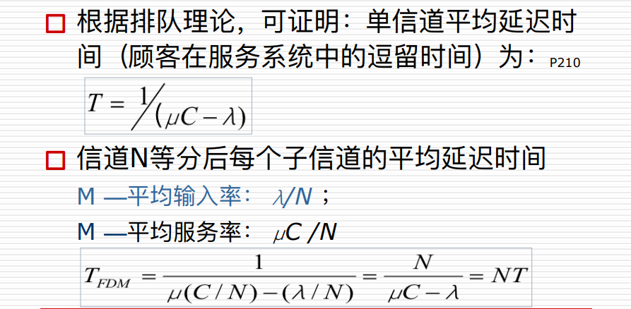

  - 信道N等分
    - 问题
      - 资源分配不合理，不满⾜⽤户对资源占⽤的不同需求
      - 有资源浪费，效率低
      - 延迟时间增⼤N倍
    - 适⽤情况
      - 适于⽤户数量少且⽤户数⽬固定的情况
      - 适于通信量⼤且流量稳定的情况
      - 不适⽤于突发性业务的情况

- 动态分配

  - 信道是开放的

  - 没有预分配

  - 基本思想

    - 通过多路访问协议（ Multiple Access Protocol ）动态分配信道资源，提⾼信道利⽤率

  - 基本概念（五个关键假设， P201 ）

    - 信道争⽤模型
      - 流量独⽴（假设1）
      - 单信道（假设2）
    - 帧的发送⽅式（假设4）
    - 信道的状态与检测
      - 冲突可观察（假设3）
      - 载波侦听与否 （假设5）
        - 载波侦听（Carrier sense）：
          - 所有的站在使⽤信道前，都可检测到当前信道是否正被使⽤，如信道正忙，则等待
        - ⾮载波侦听（no Carrier sense）：
          - 所有的站在使⽤信道前，都不检测当前信道是否正被使⽤，只是盲⽬发送
    - 信道状态

    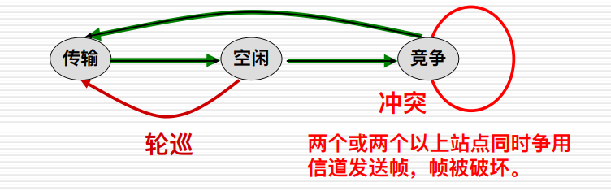

### 多路访问协议

- **随机访问协议（Random Access）**

  - 特点：站点争⽤信道，可能出现站点之间的冲突

  - 典型的随机访问协议

    - **纯ALOHA协议**

      - 纯ALOHA (Pure ALOHA)⼯作原理

        - 任何⼀个站都可以在帧⽣成后⽴即发送（可能冲突），并通过信号的反馈，检测信道，以确定发送是否成功。如发送失败，则经随机延时后再发送。
        - 每个站点可在任意时间发送数据（不关⼼信道是否已被占⽤）；
        - 两个以上站点都在发送数据时就会发⽣冲突。

      - 纯ALOHA的数学描述

        

      - 性能分析

        - 吞吐率(Throughout) S
          - 在发送时间T内发送成功的平均帧数。显然，0<S<1
          - S = 1时分组⼀个接⼀个地发送出去，帧之间没有空隙。⼀般⽤S接近于1的程度来衡量信道的利⽤率。
        - 运载负载(Carried load) G，⼜称⽹络负载
          - 时间T内所有通信站总共发送的帧平均值(包括原发和重发的分组)。
          - 显然，G≧ S，只有在不发⽣冲突时G才等于S。当重负载(G>>1) 时，冲突频繁。
        - P0：P0是⼀帧发送成功(即未发⽣冲突)的概率。就是发送成功的分组在已发送分组的总数中所占
          的⽐例。
          - S=G×P0
          - P0的含义是在连续两个T的时间内都没有其它帧⽣成的概率，即连续两个T的时间内都⽣成0帧的概率(P[0])之乘积。
          - ⽣成0帧的概率(即不⽣成帧的概率)，即是将k=0代⼊上式，得：P[0] = e^-G
            - 注意：P0与P[0]是两个完全不同的概念。
          - 所以：P0= P[0]P[0] = (e^-G)^2= e^-2G

      - 纯ALOHA协议的性能

        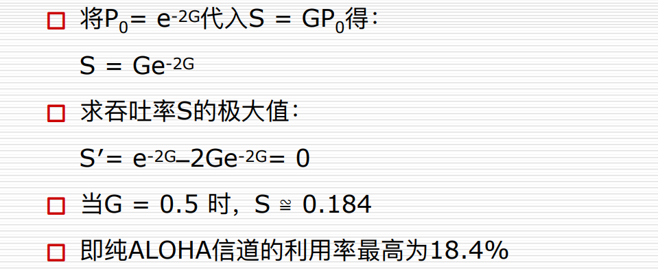

    - **分隙ALOHA协议**

      - 分隙ALOHA (Slotted ALOHA)⼯作原理

        - 分隙ALOHA是把时间分成时隙（时间⽚）
        - 时隙的⻓度对应⼀帧的传输时间。
        - 新帧的产⽣是随机的，但分隙ALOHA不允许随机发送，凡帧的发送必须在时隙的起点。
        - 冲突只发⽣在时隙的起点，冲突发⽣时只浪费⼀个时隙。⼀旦某个站占⽤时隙并发送成功，则在该时隙内不会出现冲突。

      - 分隙ALOHA的性能分析

        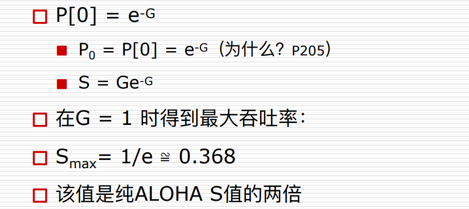

    - **纯ALOHA和时隙ALOHA**

      - ALOHA

        - 冲突危险期
          - 时间⻓度：2t
          - ⽣成帧均值：2G
          - 不遭冲突概率：P0=e^-2G
        - 吞吐量：S=G\*P0=G*e^-2G

      - 时隙（Slotted，分隙）ALOHA

        - 以帧时t为离散间隔
        - 冲突危险期减半：t
        - 吞吐量：S=G\*P0=G*e^-G

        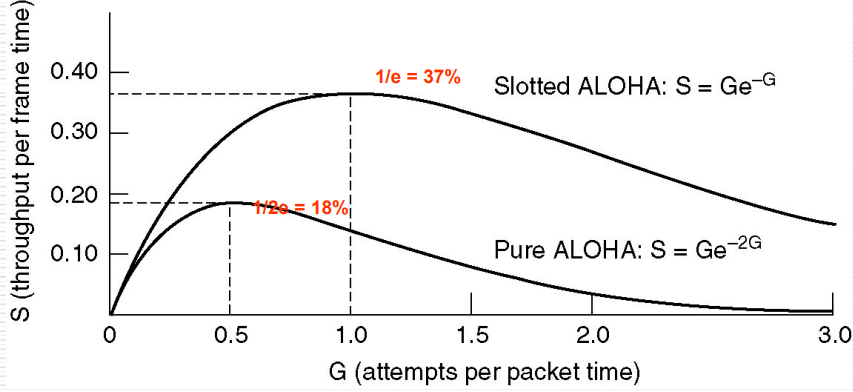

    - **CSMA协议**

      - CSMA：Carrier Sense Multiple Access

      - 特点：“先听后发”

        - 改进ALOHA协议的侦听/发送策略

      - 分类

        - **⾮持续式**
          - 特点：
            1. 经侦听，如果介质空闲，开始发送。
            2. 如果介质忙，则等待⼀个随机分布的时间，然后重复步骤1。
          - 等待⼀个随机时间可以减少再次碰撞冲突的可能性。但缺点是等待时间内介质上没有数据传送，这段时间是浪费的。
        - **持续式**
          - **1-持续CSMA**
            - 特点：
              1. 经侦听，如介质空闲，则发送。
              2. 如介质忙，持续侦听，⼀旦空闲⽴即发送。
              3. 如果发⽣冲突，等待⼀个随机分布的时间再重复步骤1。
            - 持续式的延迟时间要少于⾮持续式。
            - 主要问题是：如果两个以上的站等待发送，⼀旦介质空闲就⼀定会发⽣冲突。
          - **P-持续CSMA**
            - 特点：
              1. 经侦听，如介质空闲，那么以p的概率发送，以(1–p)的概率延迟⼀个时间单元发送。
              2. 如介质忙，持续侦听，⼀旦空闲重复1。
              3. 如果发送已推迟⼀个时间单元，再重复步骤1。
            - 可⻅，1-持续式是p-持续式的特例。

      - 冲突窗口

        >发⽣冲突时间的上限，即发送站发出帧后能检测到碰撞的最⻓时间，数值上等于最远两站传播时间的两倍，即2τ

        - 冲突窗口的计算

          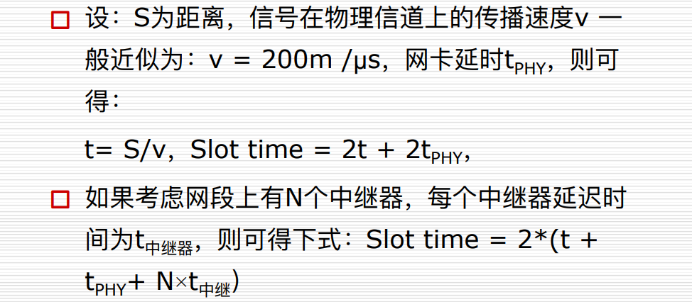

    - **CSMA/CD协议**（以太⽹采⽤此协议）

      - CSMA with Collision Detection
        “先听后发、边发边听”

      - 特点：

        1. 经侦听，如介质空闲，则发送。
        2. 如介质忙，持续侦听，⼀旦空闲⽴即发送。
        3. 如果发⽣冲突，等待⼀个随机分布的时间再重复步骤1。

      - 所有⼯作站在发送的同时也接收⾃⼰的信号，监测发送的情况，⼀旦收到的信号与发出的不⼀致，就说明发⽣了冲突。

      - 发送站感知冲突后⽴即停⽌帧的发送，并且发⼀个简短的堵塞信号(称强化冲突信号，Jamming signal)，通知⽹上各站已经发⽣冲突，本站及⽹上所有站都等待⼀段随机分布的时间，然后再按CSMA/CD⽅式重发该帧。

      - 概念模型

        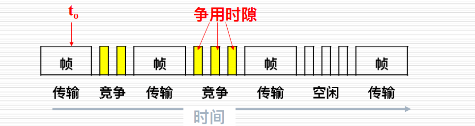

        >信道的三种状态：
        >
        >传输周期：⼀个站点使⽤信道，其他站点禁⽌使⽤
        >
        >竞争周期：所有站点都有权尝试使⽤信道，争⽤时间槽
        >
        >空闲周期：所有站点都不使⽤信道

      - 冲突检测和处理

        - 冲突检测⽅法
          - ⽐较发送信号（A->B）与回复信号（A->B）的能量或脉冲宽度变化
          - 最⼤冲突检测时间（冲突窗⼝）：两个最远距离站点间的传输时间为t，则⽹络的最⼤冲突检测时间为2t。
        - 冲突检测的要求
          - 要求1：时隙宽度 = 最⼤冲突检测时间
            - 保证在⼀个时隙内能够检测到最远距离的冲突
          - 要求2：发送有效帧的时间  最⼤冲突检测时间
            - 防⽌因在发⽣冲突时已完成短帧发送⽽造成的异常情况
        - 冲突后，发送帧重传的策略

        > 先听后发，边发边听；一旦冲突，立即停发；等待时机，然后再听

- 受控访问协议（Controlled Access）

  - 特点：站点被分配占⽤信道，⽆冲突

  - 位图协议（预留协议）

    - 如有N个站点共享信道，编号为0 ~N-1，其竞争周期将分为N个时隙，每个站点占有⼀个时隙，如某站准备发送，则可在属于它的时隙内填⼊1，⼀个竞争周期后，则将按顺序发送，不会产⽣冲突

      

    - 位图协议效率分析

      - 假设系统中有N个⽤户，需N个时隙
      - 在低负荷条件下，如每帧的数据量为d bit，额外⽐特数为N（等待时隙），则效率为d/(d+N)
      - 在⾼负荷条件下，即所有的站都希望⼀帧接⼀帧发送，位图按平均分配给每⼀帧，⼀帧只占⼀位，则效率为d/(d+1)
      - 缺点：位图协议⽆法考虑优先级

  - 令牌

    - 抓取到令牌的⼯作站可以发送⼀帧。

    - 除了环，令牌也可以运⾏在其它拓扑上。

      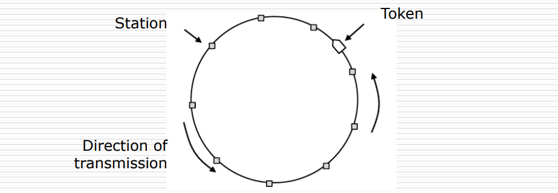

      

  - 二进制倒计数协议

    - 需要⼀个仲裁机构决定哪个站点发送

    - 基本思想

      - 把站号按相同⻓度的⼆进制数编号，需要发送的站逐个按⾼位到低位在争⽤周期开始时发送，凡低序号的站点发现有⾼序号站点也希望发送，则退出竞争，即：**高序号站点优先**

      

    - 信道效率分析

      - N个站的⼆进制编码所需位数是log2N位
      - 信道的效率为：d/(d+log2N)
      - 如果规定每个帧的帧头为发送地址，即竞争的同时也在发送。则效率为100%

- 有限竞争协议

  - 有限竞争协议（Limited Contention Protocol）

    - 在低负荷时使⽤竞争法，以减少延迟时间。
    - 在⾼负荷时，使⽤⽆冲突法，以获得⾼的信道效率。

  - 适应树搜索协议（Adaptive Tree Walk Protocol）

    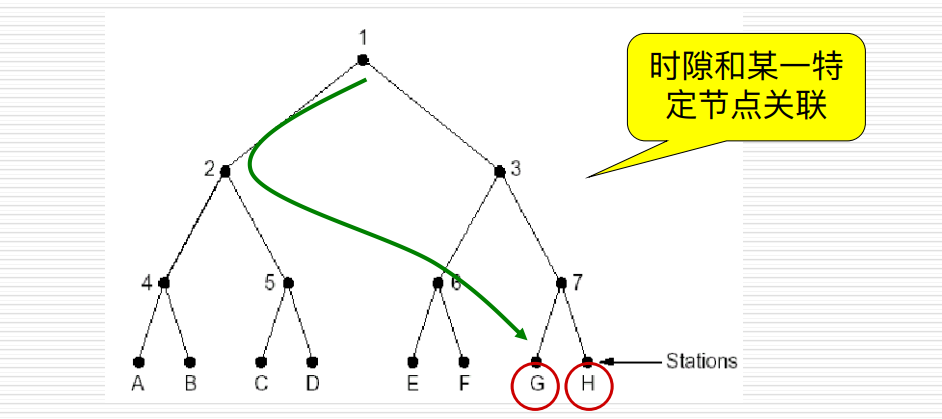

    - ⽐喻：⼆战时，美军⾎液检查病毒的⽅法
    - 在⼀次成功传输后的第⼀个竞争时隙，所有站点同时竞争。如果只有⼀个站点申请，则获得信道。否则在下⼀竞争时隙，有⼀半站点参与竞争（递归），下⼀时隙由另⼀半站点参与竞争
    - 即将所有站点构成⼀棵完全⼆叉树。对⼆叉树作深度优先搜索

- 波分多路访问协议

- 无线局域网协议

## 以太网

**IEEE以太网命名规则**

- 10Base2（IEEE 802.3a）
  - –10：传输带宽（单位Mbps）
  - –Base：基带传输
  - –2（或5）：支持的分段长度（100米为单位，四舍五入）
- 10Base-TX（IEEE 802.3X）
  - –T：铜制非屏蔽双绞线
  - –F：表示光缆

**10Base-T的拓扑结构**

- 物理连接是星型/扩展星型结构
- 逻辑上是总线结构（站点争用总线）

**10Base-T的特点**

- 与同轴电缆相比的优点
  - 安装成本大大降低
  - 即插即用，组网灵活
  - 星型结构，故障隔离
  - 适于大批量制造
  - 具有开放式标准的互操作能力
- 问题
  - 多用户共享一条10M速率信道

### **IEEE 802标准**

**以太网编码**

- 不采用二进制编码（NRZ）

- 以太网采用曼彻斯特编码
  - 1：高电压到低电压
  
  - 0：低电压到高电压
  
  - 电压值
    - +0.85 volt: high signal
    - -0.85 volt: low signal
    - 0 volt: DC value
    
  - 比特率b = 10 Mbps
    波特率B = 20 MHz（信号的变化频率）
    
    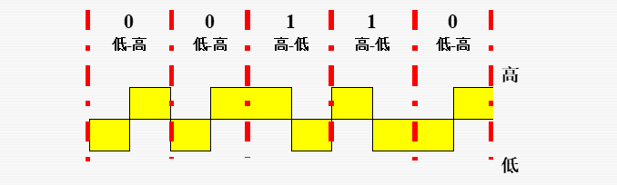
  
- 差分曼彻斯特编码
  - 802.5采用

### **IEEE802.3原理**

> IEEE802.3协议描述了运行在各种介质上1 Mb/s~10 Mb/s的1-持续CSMA/CD协议的局域网标准。

### **IEEE802.3帧格式**

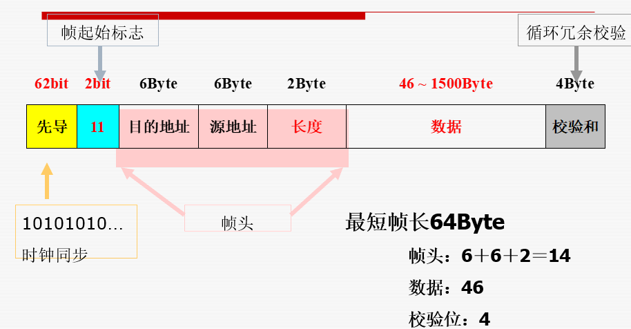

- 前导码与帧起始字段 
  - 前导码：7个字节，10101010…101010比特序列。 
  - 帧起始符：1字节，10101011。
- 目的地址和源地址字段 
  - 地址字段长度：2个字节或6个字节 。
  - 目的地址类型：
    - 单一结点地址（unicast address）；
    - 组播地址（multicast address）；
    - 广播地址（broadcast address）。

- 6字节的MAC地址（48位）
  - 组播标志位：第40位
  - IP组播地址：01：00：5E：XX：XX：XX
  - 组播地址只能做目的地址
  - Ethernet地址 = Manufacture ID + NIC ID=24bit

- 长度字段
  - 帧的最小长度为64字节，最大长度为1518字节，不包括前导码。
- 数据字段 
  - LLC数据字段是帧的数据字段，长度最小为46个字节，如果少于46个字节，需要填充。
- 帧校验字段 
  - 采用32位的CRC校验
  - 校验范围：目的/源地址、长度、LLC数据等字段。

**为什么有效帧长度64 Byte?** 

- CSMA/CD的要求

  - 最短帧的发送时间>=争用时隙2

- 以太网（802.3）规定，在10Mbps局域网中

  - 时隙：2t=51.2 微秒

  - 最短帧长度：10Mbps× 2t/8 = 64 Byte

    或者：（51200/100ns）/8=64Byte

**二进制指数后退算法**

- 发送方在检测到冲突后，双方（或多方）都将延时一段时间，那么这段时间到底是多长？

- 冲突检测到后，时间被分成离散的时隙

- 时隙的长度等于信号在介质上来回传输时间（51.2µs ）

  >i次冲突后时间片为：
  >0 < i <=10 时，取( 0～2^i－1) ×2τ
  >10 < i < 16 时，取（0~1023） ×2τ
  >i > 16 时，放弃发送

**经典以太网**

- 10base2

- 10base5

- 10base-T

  - 提高负载的方法

    - 提速到100M

    - 全双工

    - 交换式网络，hub->swicth

**交换式以太网**

100Mbps以太网——802.3u

- 改进10Mbps以太网

- 改变编码方式、提高传输速率
  - 100Base-T4
    - 25MHz
    - 8B/6T（8个二进制位映射到6个三进制数上）编码方案
      - 3对线携带信息呈27种组合形式，至少传送4 bit信息
      - 信道的传输速率：4bit×25MHZ = 100Mbps
      - 半双工数据传输方式
  - 100Base-TX
    - 125MHz
    - 4B/5B编码方案（源自 FDDI技术）
      - 每5个时钟周期为一组，发送4 bit信息
      - 信道的传输速率：（4bit/5）×125MHZ = 100Mbps
      - 全双工数据传输方式

千兆位以太网（吉比特以太网，GE）——802.3z

### **以太网的特点**

- 强大的生命力
- 简单性和灵活性
- 易于维护
- 支持TCP/IP，互联容易
- 善于借鉴：4B/5B，8B/10B。。。

## 数据链路层交换

**基本概念**

- 广播式网络的最大传输距离和可容纳最大站点数量决定了网络要分段。

- 用同一传输介质连接起来的站点的集合称为一个网段。

- 局域网间数据帧交换称为L2交换。

- L2交换设备是网桥/交换机

  >网桥分段可以提升网络负载

### 网桥

**透明的网桥**

- 通过透明网桥（**transparent bridges** ）将多个LAN连接起来，硬件和软件不需要做任何的变化
- 透明网桥工作在混杂模式（promiscuous mode ），它接收所有跟它相联的LAN的帧
- 当一个帧到达网桥时，它必须作出丢弃（**discard**）还是转发（ **forward** ）的决策，如果是转发，它还要知道向哪个LAN转发
- 决策是通过在网桥内部的一张地址表（**hash table**）中查找目的MAC地址而作出的

**网桥如何维护它的内部转发表？**

- 初始时，这张表是空的
- 扩散算法（泛洪算法，flooding algorithm）
  - 当网桥不知道目的地址时（表中查不到），它会将这帧从除来的LAN外的所有LAN转发出去 
- 逆向学习（backward learning）
  - 网桥从到达帧的源地址认识到源地址对应的那台机是在帧来的那个LAN上，所以，把它写入MAC地址表
- 但是拓扑是变化的，网桥怎样适应这种变化？
  - 无论何时，凡往表中加入记录，也必须同时打下时戳
  - 到达帧的源地址在表中已有记录，将时戳更新为当前时间
  - 网桥周期性地扫描表，将那些超时的记录从表中删除

#### **工作原理**

- 当一帧到达时，网桥启动如下算法：
  - 如果源LAN和目的LAN相同，则丢弃该帧；
  - 如果源LAN和目的LAN不同，则转发该帧；
  - 如果目的LAN未知，则广播该帧。
- 每当一帧到达，上述算法都将执行一遍

>一个网段，或用中继器/集线器连接的多网段，称为冲突域。
>
>二层设备可以隔离冲突域

**网桥功能**

- 连接不同的LAN网段。
- 通过过滤部分交通流量，减少冲突的机会，改善网络性能。 
- 以网段分流交通，基于 MAC 地址过滤流量

**帧跨网络传输：扩散（Flooding）**
除了数据帧到来的线路以外，把收到的数据帧向所有输出线路上转发。

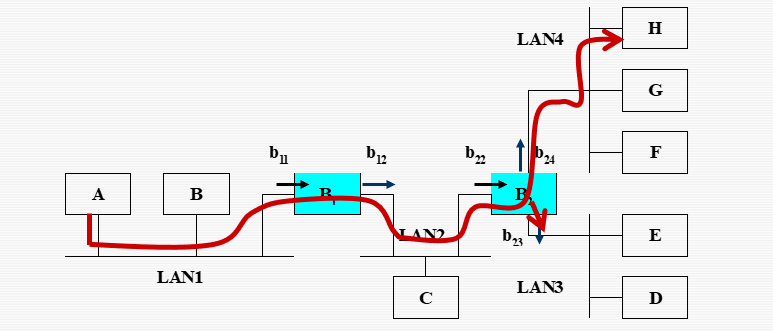

- 步骤1： A向H发送数据帧Fa

- 步骤2：网桥B1扩散帧Fa

  - B1从b11接收帧Fa，从b12向LAN2扩散帧Fa

  - B1从Fa的SA学到A

- 步骤3：网桥B2扩散帧Fa
- 步骤4： H向A回送数据帧Fh
- 步骤5：网桥B2 转发帧Fh

**所有站点都工作的地址表**

- 只有主动发送数据的站点填入表项
- 定时刷新表项，删除不活动的站点

**冗余交换拓扑**

- 为了可靠，采用冗余拓扑

- 可能带来的问题

  - 广播风暴

    

  - 多帧传送

    

  - MAC地址库不稳定

    

#### **生成树网桥**

- Spanning Tree Bridge
- 为了可靠，冗余结构
- 为了维护一个无环路的网络拓扑
- 透明网桥会产生无休止循环的问题，解决的办法就是将互联的网络在逻辑上构成生成树的拓扑结构。

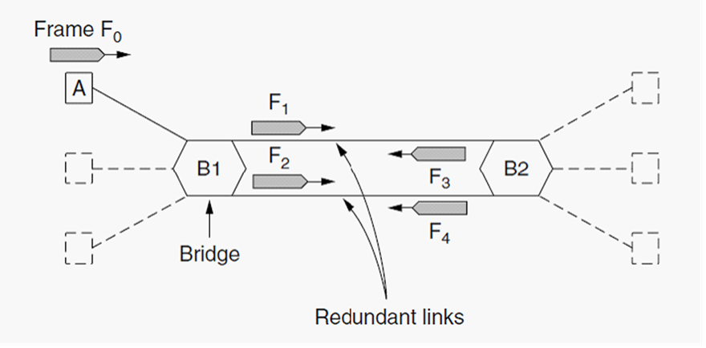

- STP的运作

  - 每个网络一个根网桥 
  - 每个网桥一个根端口 
  - 每网段一个指定端口 
  - 非指定端口不被使用 

  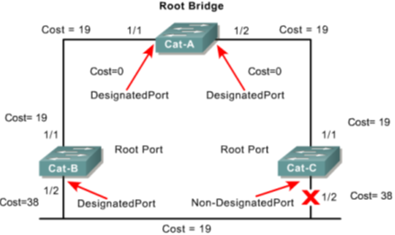

- 注意

  - 生成树算法，生成在逻辑上无回路的树，即生成树
  - 生成树算法能在有物理回路的网络中，生成一棵没有逻辑回路的生成树，但并不能保证其中的路径是最优的

**虚拟局域网（VLAN）**

**VLAN的实现**

- 基于端口

- 基于MAC地址

- 基于三层协议

**IEEE 802.1Q 标准** 

- 一种幁标记方法：VLAN ID
- 通过trunk的时候使用
- 一个VLAN对应一个广播域
- 有了VLAN，可使用二层交换机实现广播域的分割
- 当一个VLAN跨越几个交换机的时候，使用802.1Q穿越连接交换机的干线

#### **二层设备**

> 二层（数据链路层）设备：网卡、网桥、交换机

**NIC网卡**

- Nework Interface Card
- 为主机提供介质的访问。
- MAC地址烧在网卡的 ROM中
- 功能
  - Logical link control (LLC): 和上层通信
  - Naming: 提供一个独特的 MAC 地址标识符
  - Framing: 封装过程的一部分，为传输比特流打包
  - Media Access Control (MAC): 为访问共享介质提供访问策略
  - Signaling:创建信号和与介质的接口

### 交换机

- LAN 交换机是**多端口网桥**，
- 连接 LAN 网段。
- 使用一张 MAC 表，来决定一帧转发的端口
- 交换机常被用来替换集线器（hub），以改善现有网络性能。
- 增加带宽。
- 比网桥更高的交换速度。
- 支持新的功能，如VLAN。

**LAN交换机中地址表的维护**

- 动态更新
  - 直接读取数据包中的源地址信息，存入CAM，如在CAM中没有找到所需的地址，添加到CAM中。
- 删除过时的地址记录：时间标记
  - 每增加一条记录，为它打上时间标记；
  - 每引用或找到某条记录，为它打上新的时间标记。
  - 当某条地址记录超过一定时间没被引用，则删除它。

#### **工作原理**

- oflooding --当目的地址未知或为广播地址时，桥发送帧到除源端口之外的每个端口

- olearning --通过读取每个帧的源地址和对应源端口来学习连在网段上的每个设备的地址

- forwarding --对于已学到的目的地址，桥将直接发送帧到对应的目的设备所在端口

- filtering --如果目的地址和源地址在同一端口，桥将丢掉帧

**交换机的作用**

- 使网络段处于无冲突环境
- LAN交换机利用现有硬件设备
- 使配置和管理更加灵活方便

#### **交换模式**

- 存储转发
- 直通交换（贯穿）
- 无分片交换

**无冲突域**

- 微分段：LAN被交换机分隔开的网段，在 一个大的冲突域中产生无冲突域。
- 虚拟线路：在交换机内部把段连接成一个 虚拟网络的电路，只在需要时才成立