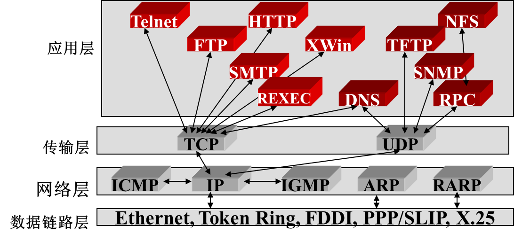
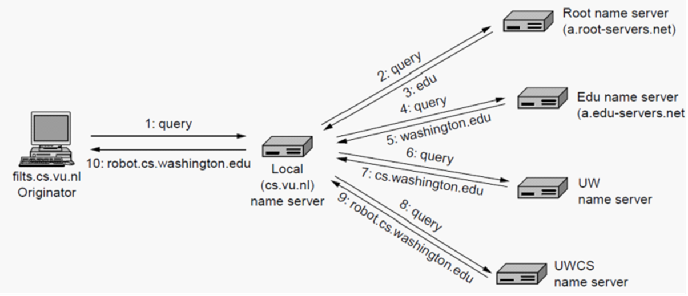
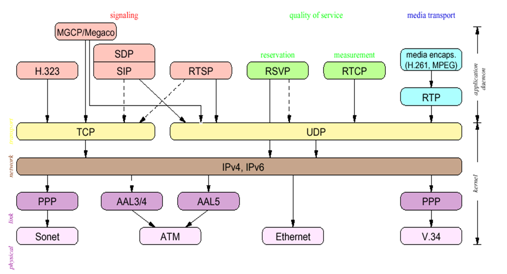

# **应用层**

## **应用层概述**

**主要功能**

> 最靠近用户的一层，向应用程序提供网络通信

**应用层的特点**

- 没有应用层，就没有网络通信支持
- 参考模型中唯一的一层，不需为它的上层服务
- 它向参考模型之外的用户提供服务
- 网络应用程序可被分为两大类：
  - 直接网络应用程序：Browser , e-mail ,FTP , Telnet
  - 间接网络应用程序：Word , resource manager , (via Redirector)

**重定向器(Redirector)**

> 置于应用中的一种小软件
> 它是透明的

## **域名解析系统**

- DNS是**分层次的，基于域**的命名方案，且采用了**分布式数据库**系统来实现（P471）
- DNS的使用方法：
  - 为了将一个名字映射为IP地址，应用程序调用一个叫**解析器（ resolver ）**的库过程，把名字作为参数传递给这个过程 （如： gethostbyname()就是一个解析器）
  - **解析器发送一个UDP分组给本地DNS服务器**，它会负责查找该名字，然后将对应的IP地址返回给解析器
  - **解析器返回结果给应用程序**，然后应用程序即可开始工作了（封装，发送。。。。。。）

- DNS的命名空间
  - 互联网被分成200多个顶级域
    - 每个域被分成若干子域，子域还可进一步划分。。。
    - 所有这些域可以用一棵树来表示
      - 树上的叶子代表没有子域的域（但包含主机）
      - 一个叶子节点可以只包含一台主机，也可以代表一个公司，包含上千台主机
  - 顶级域有两种
    - 通用域（ generic ）
    - 国家域（ country ）

- 域名

  - 每个域的名字是：从它向上到根（未命名）的路径，各个部分间用圆点隔开
  - 域名可以是绝对的，也可以是相对的，绝对域名总是以圆点结束（如： eng.sun.com. ） 
    - 相对域名必须在一定的上下文环境中被解释出来才有意义，从而唯一地确定其真实的含义
    - 绝对域名和相对域名都引用了域名树中一个特定的节点，以及它下面的所有节点
  - 域名是大小写无关的（ case insensitive ）
  - 各组成部分的名字最多有 63 个字符长，整个路径不超过 255 个字符
  - 没有规则限制同时在两个或多个顶级域名下的注册 (如：sony.com and sony.nl)—域名抢注
  - 每个域自己控制它下面的域（子域）的划分
  - 要创建一个新的域，创建者必须得到该新域的上级域的许可，一旦创建成功，该新域可以创建子域，而无需征得上级域的同意
  - 域名遵循的是组织的边界而不是物理网络的边界

- 资源记录

  - 每个域，无论是单主机域还是顶级域，都可以有一组跟它相关联的资源记录（ Resource Records ）

  - 当一个解析器把域名传递给DNS时，DNS所返回的是与该域名相关联的资源记录。所以DNS的主要功能是将域名映射到资源记录上

  - 一个资源记录包括5个部分：

    - 域名（Domain name）

      >指出这条记录适用于哪个域

    - 生存期（Time to Live）

      >指出这条记录适用于哪个域

    - 类别（Class）

      >对于互联网信息，它总是 IN

    - 类型（Type）

      >指出了这是什么类型的记录

    - 值（Value）

- 根服务器

  - 最重要的域名服务器；存储所有顶级域名的名字和IP
  - 无论是哪个本地域名服务器，无论何时，只要它无法回答一个查询请求，它都会向根域服务器求救 (for help)
  - 全球有 13 根域服务器，它们的名字分别是a to m（前13 个字母）。

- 域名解析

  - 当一个解析器收到一个域名查询时，它将该查询传递给本地的一个域名服务器

  - **如果待查询的域名落在该名字服务器的管辖范围内**，它将返回权威资源记录

    - 一个权威资源记录（authoritative record）是指来自于管理该记录的权威机构，因此总是正确的，它和缓存的记录不同，后者可能是过期的

  - **如果被请求的域名是远程的，且本地没有关于它的信息**，那么本地名字服务器向根域服务器发送一条查询此域的消息

  - 域名解析的种类

    - **主机向本地域名服务器的查询**一般都是采用**递归查询**。如果主机所询问的本地域名服务器不知道被查询域名的 IP 地址，那么本地域名服务器就以 DNS 客户的身份，向其他根域名服务器继续发出查询请求报文。
    - **本地域名服务器向根域名服务器的查询**通常是采用**迭代查询**。当根域名服务器收到本地域名服务器的迭代查询请求报文时，要么给出所要查询的 IP 地址，要么告诉本地域名服务器：“你下一步应当向哪一个域名服务器进行查询”。然后让本地域名服务器进行后续的查询。

    

  - 优化方法

    - 高速缓存—减少查询环节，提高效率
    - 缺点：缓存中的内容不具有权威性

## **重要的应用**

### 电子邮件

- 电子邮件系统通常由两部分组成：

  - **用户代理(UA)**：让用户能够阅读和发送邮件
    - 本地程序，提供命令行或图形界面，让用户和电子邮件系统交互
    - 电子邮件阅读器
  - **消息传输代理 (MTA)**：将消息从源端送到目标端
    - 通常是系统守护进程，即运行在后台的进程，在系统中传递电子邮件

- 电子邮件体系结构

  

- Email 消息传输
  - 建立一个从源机器到目标机器间的传输层连接，然后传输消息
  - SMPT – Simple Mail Transfer Protocol
    - 源机与目标机（SMTP守护进程在监听）的25端口建立TCP连接
      - 连接建立 (在端口 25)
      - 数据交换
        - 客户机（作为客户）等待服务器（作为服务器）首先开始通话
        - 服务器首先发送一行文本，给出它自己的标识，并且告诉客户机是否已准备好接收邮件
          - 如果服务器没有准备好，则客户机释放连接，以后再重试
        - 如果服务器愿意接收电子邮件，则客户机申明发信人和收信人
        - 如果服务器确实存在这样的收信人，则服务器指示客户可以发送了
        - 客户发送消息，服务器回发确认
      - 连接释放
    - 如果消息不能被投递，则向消息的发送方返回一个错误报告（包含了不能投递消息的第一部分）
    - 这是一个简单的 ASCII 协议
  - 最后传递
    - 当有用户使用拨号上网，不可能一直在线的时候，上述工作模式不再运作了
    - 一种解决方案是在ISP的一台机器上运行一个消息传输代理（message transfer agent）； 这台机器可以一天24小时运行，
    - 设计一个协议POP3 (Post Office Protocol Version 3)，允许用户和消息传输代理MTA联系，然后把邮件从ISP那里拷贝到用户
      - 当用户启动邮件阅读器的时候，POP3开始工作
      - 用户呼叫ISP（除非已有一个连接），然后与MTA在110端口建立TCP连接
      - 一旦连接建立， POP3协议按顺序经历三种状态
        - 授权（Authorization）
          - 处理用户登录的过程
        - 事务（Trnsactions）
          - 用户收取电子邮件，并将邮件标记为删除
        - 更新（Update）
          - 将标为删除的电子邮件删除

### 万维网

- Web 是web网页的集合（ collection of web pages）
- 每个页面包含了指向其他页面的链接
  - 超级链接
- 浏览器 –显示阅读web页面的程序

- WWW的组成部分

  - 资源，web页面，Resource (html)

  - 统一资源定位器：URL

  - 通信协议HTTP

    >http://www.abcd.com/products.html)
    >协议：http
    >页面所在的机器的DNS 域名：www.abcd.com
    >包含web页面的文件的名字：products.html

- 页面的MIME类型，以决定如何显示该页面

- 当用户单击一个超级链接（URL）时：

  - 浏览器检查URL (读取浏览器的输入)
  - 浏览器向 DNS 服务器询问域名的IP地址
  - DNS 返回对应的 IP 地址
  - 浏览器和Web服务器建立TCP 连接（在端口 80）
  - 浏览器发送请求，要求获取文products.html
  - Web服务器返回被请求的文件
  - TCP 连接被释放
  - 浏览器解释显示下载到本地的文件

- 服务端
  - 典型的web 服务器的操作：
    - 接收来自客户的TCP连接
    - 获取所需文件的名字
    - 从本地磁盘上获取文件（静态页面）
    - 将文件返回给客户
    - 释放TCP连接
  - 改进
    - 在内存维护一个缓存，保存最近用过的 n个文件
    - 多线程服务器

- 代理服务器
  - 代理服务器(proxy server)又称为万维网高速缓存(Web cache)，它代表浏览器发出 HTTP 请求。
  - 万维网高速缓存把**最近的一些请求和响应**暂存在本地磁盘中。
  - 当与暂时存放的请求相同的新请求到达时，万维网高速缓存就把**暂存的响应**发送出去，而不需要按 URL 的地址再去因特网访问该资源。
- cookie
  - 一个小于4kB的命名串
  - 当客户请求时，web服务器除了应答外，附送一个cookie，存储在客户机磁盘
  - 客户再访问同一个web服务器时，同时发送cookie
  - 服务器辨识出该用户，并得到它关心的一些信息

### 文件传输

FTP、TFTP和NFS

- 一种可靠的面向连接的服务，采用TCP在支持FTP的系统间传输文件，它支持双向二进制文件和ASCII文件传输。
- TFTP：一种无连接的不可靠的服务，采用UDP在支持TFTP的系统间传输文件。
- FTP ：使用两条 TCP链接

### 远程登陆

- 不要求远地系统创建众多的服务器，只需为每个远程登陆用户建立一个进程，这个进程再通过创建子进程为远程登陆用户提供各种允许的服务。
- 远程登陆的另外一个优点，它提供与本地登陆几乎完全相同的用户界面
- 本地用户在本地终端对远地系统进行远程登陆，该远程登陆的内部视图实际上是一个**TCP连接**；

多媒体

多媒体相关的协议

Web2.0
