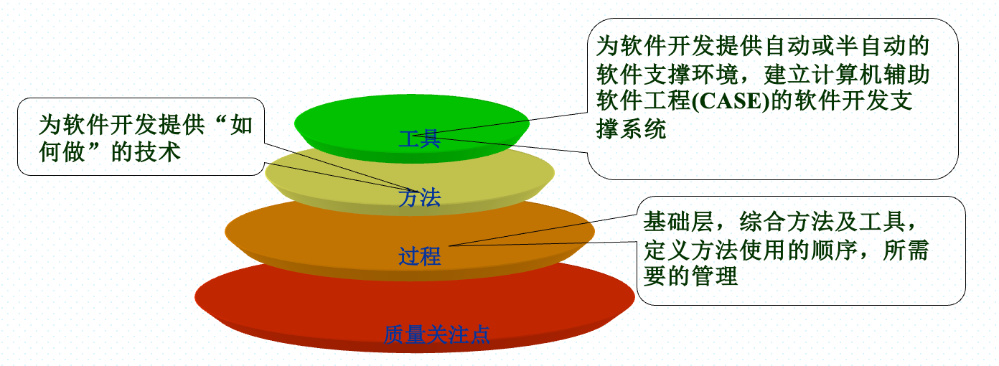

# 第一章：软件与软件工程的概念

## 软件的含义

> 软件是一系列按照特定顺序组织的`计算机数据`和`指令`的集合

软件被划分为：`编程语言`、`系统软件`、`应用软件`、`中介软件`（中间件）

与计算机程序相关的文档也被认为是软件。

>软件是包括`程序`、`数据`、及其相关`文档`在内的完整集合

- 程序是按照事先设计的功能和性能要求执行的指令序列
- 数据是让程序能够正常操作信息的数据结构
- 文档是与程序开发，维护与使用相关的图文材料

## 软件工程的背景（软件危机的出现）

> `软件危机`是指`落后的软件生产方式`无法满足`迅速增长的计算机软件需求`，从而导致软件开发与维护过程中出现一系列严重问题的现象。

### 软件危机的典型表现

- 对软件开发成本和进度估计不准确
- 用户对“已完成”的软件系统不满意
- 软件产品质量靠不住
- 软件不可维护
- 软件没有适当的文档资料
- 软件成本所占比例逐年上升
- 软件开发速度跟不上硬件发展速度以及软件普及速度

### 软件危机产生的原因

- 与软件本身特点有关
- 与软件开发人员有关
    - 缺乏软件开发经验积累
    - 与用户存在交流障碍，需求不充分理解
    - 软件开发过程不规范
    - 没有严格科学的多人协作分工管理
    - 缺乏有效软件评测手段

### 解决软件危机的办法

- 彻底消除“软件就是程序”的错误观念
- 充分认识到软件开发是一个组织良好，管理严密，然元协同配合共同完成的工程项目
- 推广和使用在实践中总结的开发软件的成功技术方法和工具
- 按照工程化的原则和方法组织软件开发工作

## 软件工程的产生

软件工程（学）因为软件危机的出现而产生

### 什么是软件工程

软件工程是指导计算机软件开发和维护的工程学科。将经过实践证明正确的管理技术和当前能够得到的最好的技术方法结合起来，以经济地开发出高质量的软件并有效维护它。

软件工程主要研究软件生产的客观规律性，建立与系统化软件生产有关的概念、原则、方法、技术和工具。

总之：

**`软件工程`是应用计算机科学、数学及管理科学等原理开发软件的工程。它借鉴传统工程的原则、方法，以提高质量，降低成本为目的。**

### 软件工程的总目标

软件工程的`目标`是:在给定成本、进度的前提下，开发出具有适用性、有效性、可修改性、可靠性、可维护性、可重用性、可移植性、满足用户需求的软件产品

### 软件工程关键概念

**软件工程`三要素`：`方法`、`工具`和`过程`**

- `方法`：产生某些结果的形式化过程
- `工具`：用更好的方式完成某件事情的设备或者自动化系统
- `过程`：生产特定产品的工具和技术的结合
- `范型`：构造软件的特定方式或哲学

## 软件生存期

软件生存期分为三个时期：`软件定义`、`软件开发`、`运行维护`

## 软件质量和过程建模

McCall质量模型

评价软件的衡量指标：

