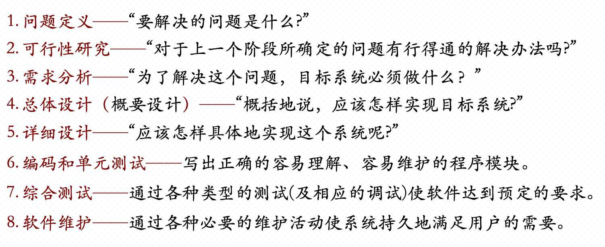
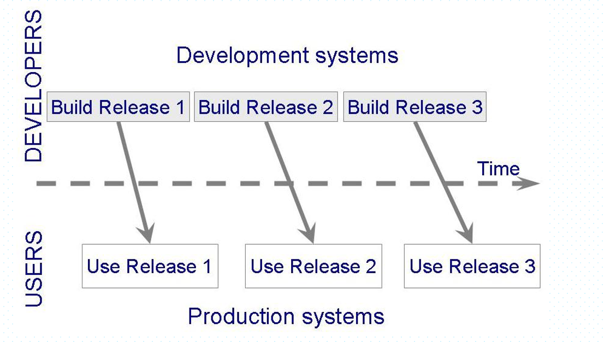
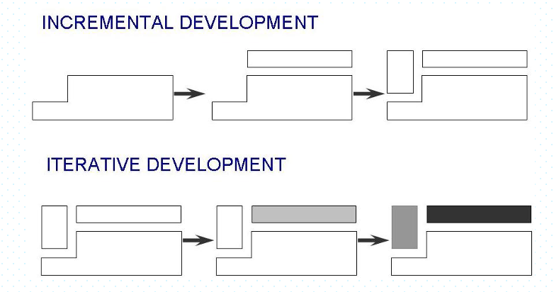

# 第二章 软件过程及其建模

## 软件过程

软件过程是整个软件生命周期中一系列有序的软件生产活动的流程。

### 软件过程模型：过程建模的原因

## 软件生存期

### 可行性研究

- 任务：了解用户要求和现实环境，从技术、经济、市场等方面研究并论证开发该软件系统的可行性
- 阶段性产品：`可行性论证报告`、`初步项目开发计划`

### 需求分析

- 任务：确定用户对待开发软件系统的功能需求、非功能性需求，运行环境约束。
- 阶段性产品：`软件需求规格说明书SRS`

### 概要设计

- 任务：根据SRS建立目标软件系统总体结构、设计全局数据库和数据结构，规定设计约束，制定继承测试计划等等
- 阶段性产品：`概要设计规格说明书`、数据库或数据结构设计说明书、继承测试计划

### 详细设计

- 任务：细化概要设计生成的各个模块，并详细描述程序模块的内部细节，形成可编程的程序模块，制定单元测试计划。
- 阶段性产品：`详细设计规格说明书`、单元测试计划

### 实现阶段

- 任务：根据详细设计规格说明书编写源程序，进行调试和单元测试，验证程序与详细设计文档的一致性。
- 阶段性产品：`源程序代码`

### 集成测试

- 任务：根据`概要设计规格说明书`，将通过单元测试的木块逐步进行集成和测试
- 阶段性产品：生成满足概要设计要求、`可运行的系统源程序和系统集成测试报告`

### 确认测试

- 任务：根据软件`需求规格说明书`，测试软件系统是否满足用户需求
- 阶段性产品：`可供使用的软件产品`（文档、源程序）

### 软件维护

- 任务：对使用后的软件进行维护（修正错误，增加新功能，环境迁移）
- 阶段性产品：`新版本的软件产品`

## 软件过程模型

将软件活动框架用模型表示出来就是软件过程模型。软件过程模型是软件开发全部过程、活动和任务的结构框架

### 瀑布模型：由文档驱动的模型

特点：

- 采用结构化方法
- 阶段之间有顺序性和依赖性，强调每一个阶段的顺序
- 推迟实现的观点
- 没有循环

优点：采用规范的方法；严格规定每个阶段提交的文档；要求每个阶段交出的产品必须经过验证。适合用户需求完整，无重大变化的开发。

缺点：对开发中的变化没有提供指导，没有迭代，到有成果需要等待很长时间。

#### 原型化瀑布模型

### V模型：瀑布模型的变种

- 用单元测试验证程序设计
- 用系统测试验证系统设计
- 用验收设计验证需求

### 原型化模型

认为探索型原型、实验型原型和演化型原型

- 允许需求或设计反复调查，减少开发中的风险和不确定性

存在的问题：

- 为了让原型尽快工作，没有考虑软件的总体质量和长期可维护性
- 为了掩饰，可能选取一些不理想的组成部分，然后这些部分成为了系统的一部分
- 开发过程不便于管理

建造原型仅仅是为了定义需求，之后被抛弃。

### 可操作规格说明

早开发过程早期检查需求及其隐含意义，功能和设计可以合并。

### 可转换模型

- 减少主要开发步骤
- 应用一系列的转换将需求规格说明变成一个可交付使用的系统
- 形式化开发记录
- 形式化规格说明

### 阶段化开发：增量和迭代

- 减少循环时间
- 系统一部分一部分交付
- 有产品系统和开发系统，可以并行

#### 增量模型

#### 增量与迭代：

### 螺旋模型

围绕四个主要活动，在六个象限上螺旋旋转：

- 用户通信
- 计划
- 确定目标、可选方案、约束
- 评估可选方案和风险
- 开发和测试
- 用户评估

优点：有利于软件冲用，减少了过多的测试或者测试不足，维护和开发没有本质区别。

特点：奉贤区懂，适合内部开发的大规模软件项目，随着迭代次数增加，工作量加大，成本上升。

### 喷泉模型

特点：主要用于支持面向对象开发过程。

### 敏捷方法：主打一个快

建立及时的反馈机制，强调人与人之间的直接沟通，轻文档，重合作，专注于对变化的适应

### 极限编程（XP）

强化沟通，简化设计，迅速反馈。

四个核心要点：交流、简单、反馈、勇气

