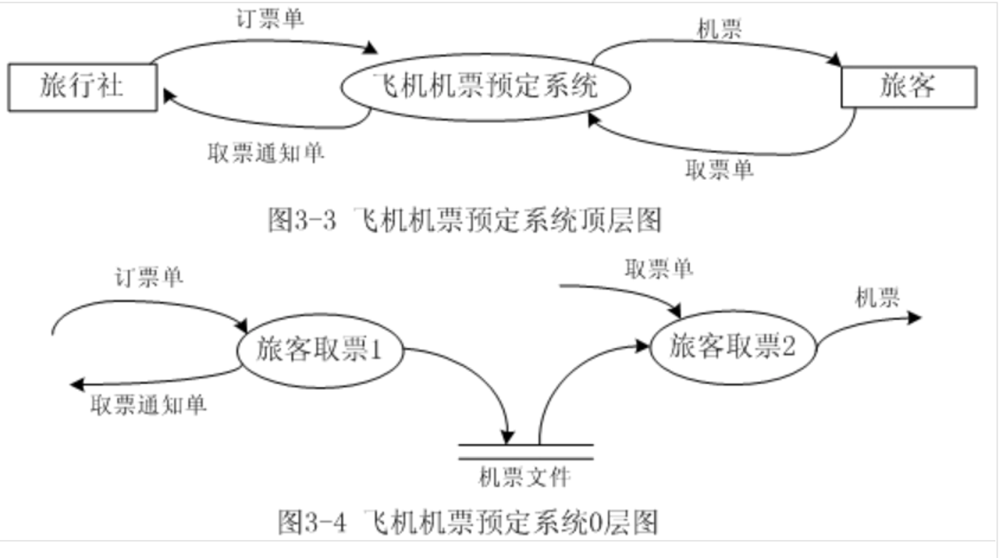
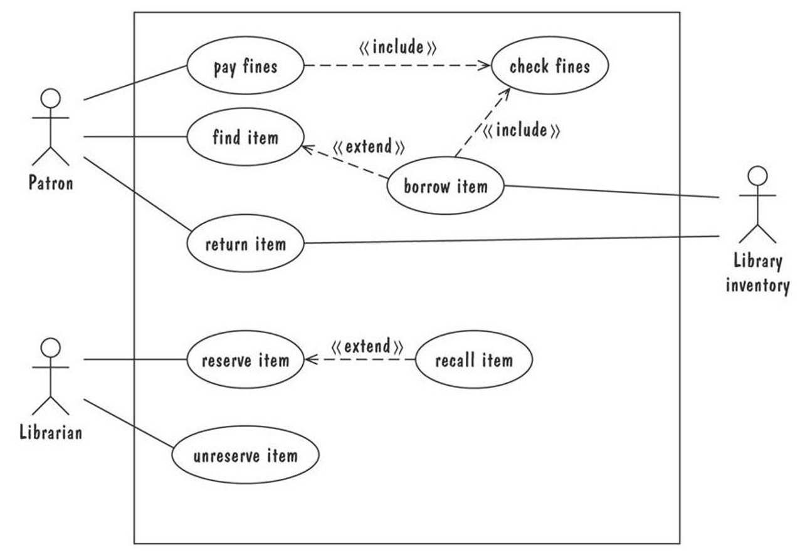

# 第三章：需求分析概述

## 需求分析概述

需求的重要性：需求不明确会在多方面导致项目的失败，如果早期没有检测到并修复需求错误，会造成很高的代价。

需求分析的任务：集终于用户的需要，搞清楚用户想要什么样的行为

需求分析的结果：软件需求规格说明书

### 需求的三个层次

- 业务需求：高层次的目标要求（公司层面）
- 用户需求：具体用户使用软件的需求（用户层面）
- 功能需求：对用户需求提炼出来之后的需求（开发层面）

### 需求类型

- 需求定义：用户想要得到的每一件事情的完整列表
- 需求规格说明：将需求重新陈述为关于要构建的系统将如何运转的规格说明

### 需求类型

- 功能需求：根据要求的活动描述需求行为
- 质量需求（非功能需求）：描述软件必须拥有的质量特征
    - 性能要求、界面要求
    - 易用性、安全性、完整性、可靠性
    - 可移植性、可拓展性、可维护性
- 设计约束：已经做出的设计决策或对问题解决方案集的限制的设计决策
- 过程约束：对于构建系统的技术和资源的限制

## 需求建模

建模能帮助彻底理解需求。刚开始的建模从ER图开始。ER图关注需求中实体和实体之间的关系。

### ER图

ER图提供了解决问题的总体概况，当问题的需求变化的时候，视图相对稳定。

### UML类图

> UML:统一建模语言。

- 对象：类似于实体，按照继承层次的类进行组织
- 方法：在对象的变量上执行的动作

- 属性和操作是和类相关联的，而不是与类的实例相关联的。
- 类范围属性是用带下划线的属性表示，是被类的所有实例共享的数据值
- 类范围操作书写为带下划线的操作，是被抽象类执行的操作，不是类实例执行的操作。
- 关系标记为实体之间的连线
- 聚合关联表示涉及关联的类中对象的相互作用或事件
- 组装关联是一种特殊聚合

### 事件跟踪：关注“行为”

- 垂直线：不同实体的时间线，实体名字出现在线的顶部
- 水平线：两个实体之间的一个事件或者交互
- 时间从上往下

### 消息时序图：扩充的事件跟踪表示法

- 实体：竖线
- 消息：发送实体到接受实体的箭头
- 动作：位于实体执行线上带标记的矩形
- 条件：用标记的六边形表示，是一个实体演化的重要状态

### 状态机

状态机在表示动态行为方面，以及描述在响应已经发生的历史事件时行为将如何变化方面很有用。

- 点（状态）：表示存在于事件发生之间的一个稳定的条件集合
- 边（转移）：表示由于一个事件的发生而产生的行为或条件的变化

### UML状态图

描述了一个UML类中的对象的动态行为。UML类图没有说明实体时如何运转的，行为时如何变化的。UML状态图就展现了状态变化的动态行为。

### 数据流图（DFD）

建模功能以及从一个功能到另一个功能的数据流，从数据的角度描述系统

- 泡泡：加工
- 箭头：数据流
- 平行线：输出存储（库或者信息库）
- 矩形：表示参与者（提供输入和输出的实体）

### 用例

数据流图演变成UML的用例图。用例并不一定建模系统的全部，而是用于说明用户对重要系统行为的观察

- 大的方框：系统边界
- 方框外的小人：参与者，人或者系统
- 方框内的椭圆：用例，表示必须的主要功能及其变种
- 参与者与用例之间的连线：参与者参与了该用例

### UML

包括：

- 用例图（高层DFD）
- 类图（ER图）
- 时序图（事件跟踪）
- 协作图（事件跟踪）
- 状态图（状态机模型）

### 原型化需求

- 抛弃型原型：搞定完需求分析就可以抛弃
- 演化型原型：不仅完成需求分析，还要演变成最终产品

**原型化用来回答用户的问题，建模则是快速回答事件将要发生的顺序的约束问题，活动的同步问题。**

## 需求文档

需求文档的目标和内容

- 概述系统总体目的和范围
- 描述开发背景和理由
- 描述一个可接受的解决方案的基本特征
- 描述系统运行的环境
- 概述客户对解决问题的提议
- 列出对环境作出的假设
- 详细描述输入输出
- 根据接口的输入输出重新陈述要求的功能
- 对用户的质量需求，设计适配标准

## 需求工程

需求工程指应用已证实有效的原理、方法，通过合适的工具和记号，系统描述待开发系统及其行为特征和相关约束。

包含两个过程域：

- 需求开发：重点在于开发出高质量的需求规格说明
- 需求管理：重点在确保开发的软件满足需求

5个独立的阶段：

- 需求获取
- 需求建模
- 形成需求规格
- 需求验证
- 需求管理