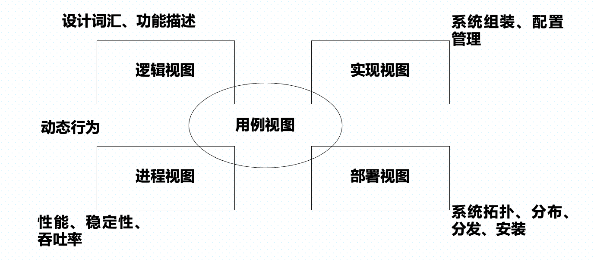
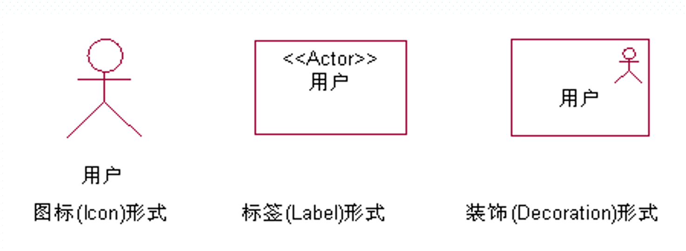
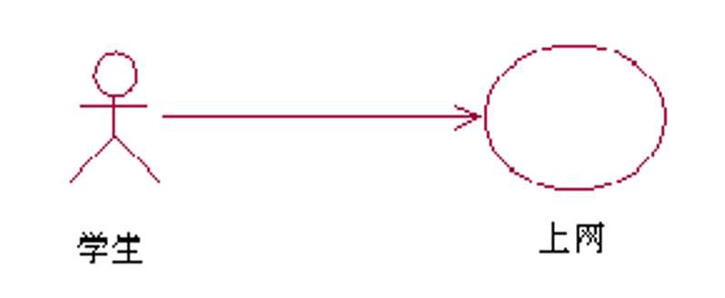
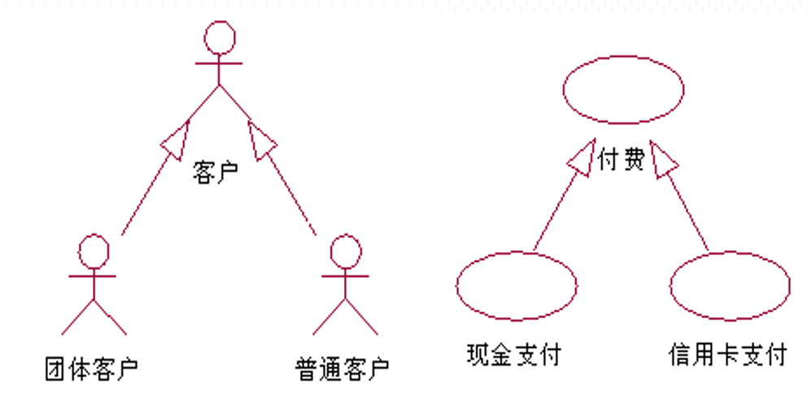
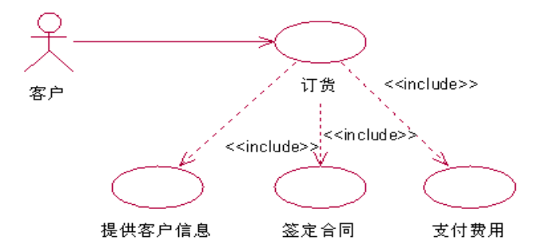
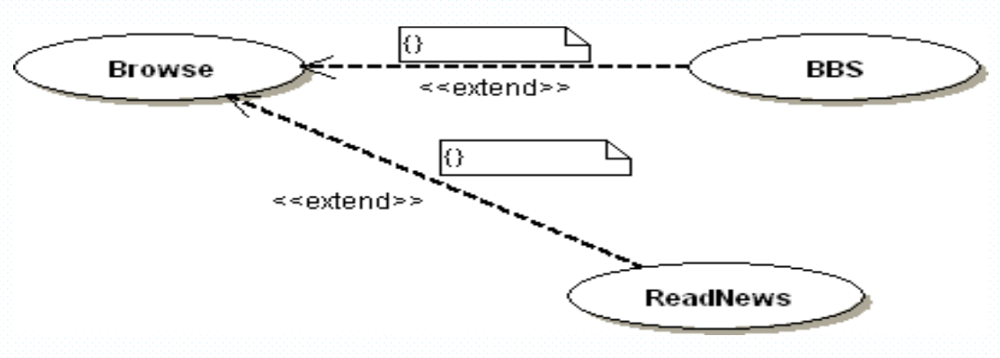
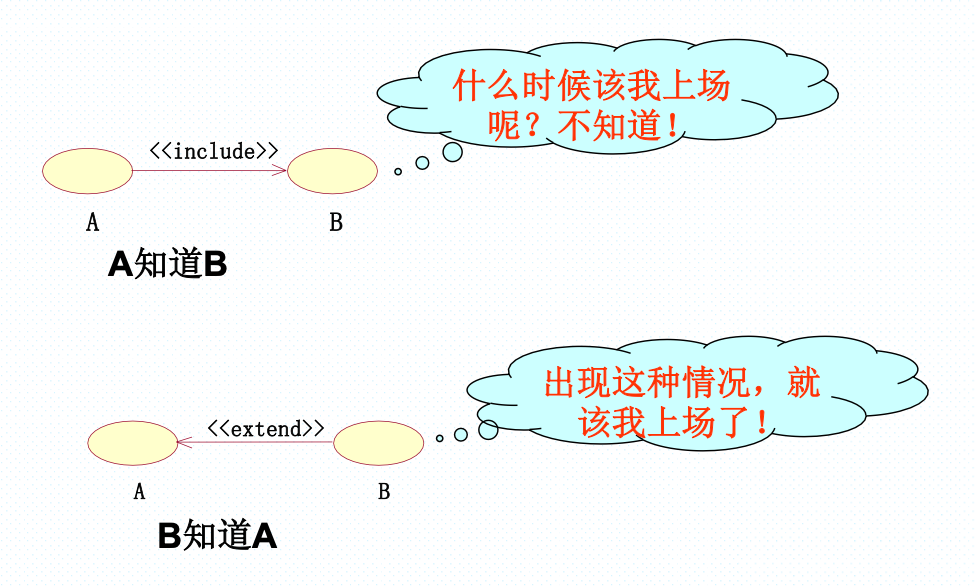

# 第4章：UML及用例图

## UML

>UML(统一建模语言)是为软件系统的制品进行描述、可视化、构造、文档化的一种语言。

UML是一种建模语言，并不是建模方法

建模方法 = 建模语言 + 建模过程

### UML的构成

- UML基本图素
- UML模型图
- UML建模规则

## UML的4+1视图

每个视图关注软件开发的某一个侧面，视图由模型图组成。模型图描述了构成视图的基本模型元素以及其相互关系。

- 用例视图
- 设计视图（逻辑视图）
- 进程视图
- 实现视图
- 分布视图

### 用例视图

描用来支持软件系统的需求分析，定义系统边界，关注于系统的外部功能描述。从系统使用者的角度，描述系统外部的静态功能和动态行为。

对应的模型图：交互图（顺序图和协作图）、状态图、活动图

### 逻辑视图

定义系统的实现逻辑，描述为了实现用例图描述的功能，在对软件设计时候所产生的设计概念（设计词汇）。逻辑视图定义了设计词汇的逻辑结构，之间的语意关系。

对应的模型图：类图、对象图、交互图、状态图、活动图

### 实现视图

定义了逻辑结构的物理实现，包括设计元素对应的源代码文件，物理文件之间的关系等。

对应模型图：部件图、交互图状态图、活动图

### 部署视图

描述软件产品在计算机硬件系统和网络上的安装、分发和分布。

对应的模型图：静态特性：部署图。动态特性：交互图、状态图、活动图。

## UML的9种图形

- 类图
- 对象图
- 用例图
- 序列图
- 协同图
- 状态图
- 活动图
- 组件图
- 分布图

## 用例图

### 什么是用例

用例：对（用户）所关心的事情的描述。

场景：用户与系统之间的一个交互过程，也就是实现这次交互所要经历的一系列步骤。

用例就是一组场景，用以共同描述用户的某个特定的目标。客户，开发人员，其他人员都对用例模型很关心。

#### 用例分析的意义：

任何方法的首要问题是了解需求。所以需要进行用例分析

1. 描述和决定系统的功能需求，帮助客户和开发人员形成一致意见
2. 给出系统应该做什么且与内容一致的可视化描述
3. 在软件测试阶段作为系统测试的基础。

#### 用例的特点

- 用来描述系统功能（外部使用者看到的系统功能），不反映功能的实现方式
- 描述用户提出的一些可见需求，对应一个具体的用户目标
- 反应系统与用户的一次交互过程，具有交互的信息的传递。

### 用例图中的模型元素

- 系统边界：提供用例所需要的功能的的黑盒子。系统的外部特性由系统功能来定义，系统功能用一组用例来描述。
- 执行者：需要使用系统的任何外部实体
- 用例：用客户或客户语言和词汇来描述一个系统的完整功能。
- 关联：连接执行者和用例。表示执行者所表示的系统外部实体和该用例所描述的系统需求有关
- 包含：用例A连向用例B，表示A使用了B的行为或功能
- 拓展：用例A连向用例B，表示B描述了一项基本需求，而A则描述了该基本需求的特殊情况。

#### 参与者（活动者、执行者）

参与者是外部需要与系统交互的事物，分为人、设备和外部系统

#### 用例间的关系

1. 关联关系

（参与者与用例之间的关系），表示参与者与用例之间具有使用，交互信息的关联。

2. 泛化关系

参与者与参与者之间，用例与用例之间的关系。被泛化的时候，表示其可以定义为一个更为抽象的参与者或者用例

3. 包含关系

    两个用例之间，一个用例（基本用例）的行为包含了另一个用例（包含用例）的行为。包含关系用依赖关系的<<include>>构造型来表示。

    

    需要注意包含关系的正确使用，不要用它来描述功能，应该要描述对象。

4. 拓展关系

拓展关系表示基本用例在拓展点要增加的新的行为或功能，以拓展到新用例。用依赖关系的<<extend>>构造型表示。

拓展用例可以在基用例上添加新的行为，但是基用例必须生命某些特定的拓展点，并且拓展用例只能在这些拓展点上拓展新的行为。<u>拓展用例的目的是在不改变某个已经存在的用例的前提下为其增添新的行为。</u>

**包含与拓展关系**

## 建立用例模型

### 主要工作流程

-   定义系统
-   找出执行者
-   找出用例
-   描述用例
-   用例的整理与加工
-   验证模型

### 定义系统

-   系统名：软硬件以及业务流程都是系统，应该有名字
-   系统边界：确定哪些任务由系统完成，系统的边界在哪里，系统有什么功能，复杂程度怎么样

系统定义应该明确基本功能，语言准确，描述准确，架构优良

### 找出执行者

-   主要角色与次要角色
-   主动执行者与被动执行者

执行者与系统之间的交流是通过信息的收发。执行者主要是业务的客户。执行者是类，所以可以用类名及其属性和行为来描述一个执行者，必要的时候添加注释来说明。

### 找出用例并描述用例

-   确定各参与者所希望的系统行为

-   命名用例，确定用例之间的关系
-   绘制用例图，编写用例说明
-   对异常流程确定单独用例
-   优化用例图，解决冲突和重复
