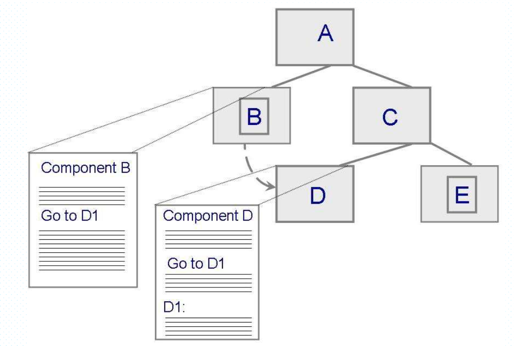
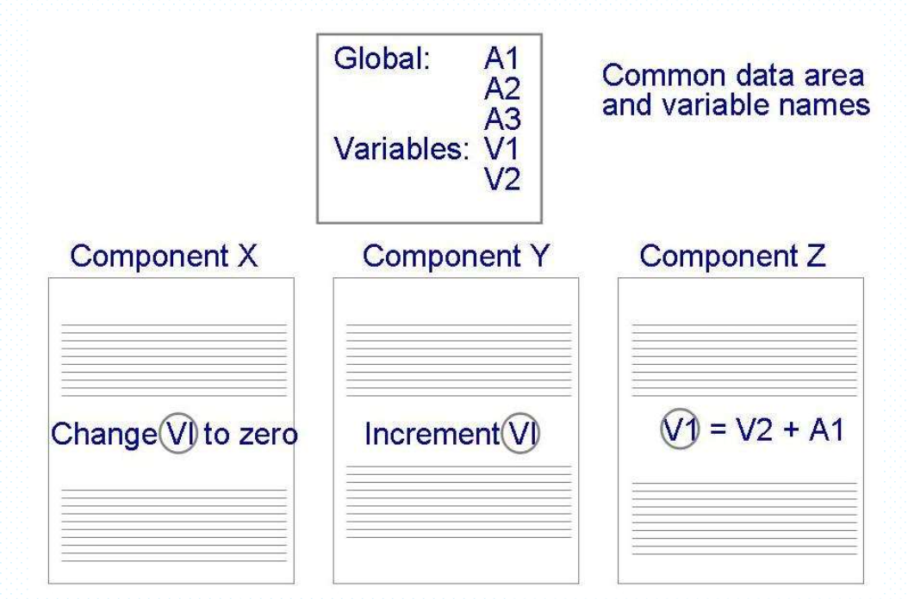
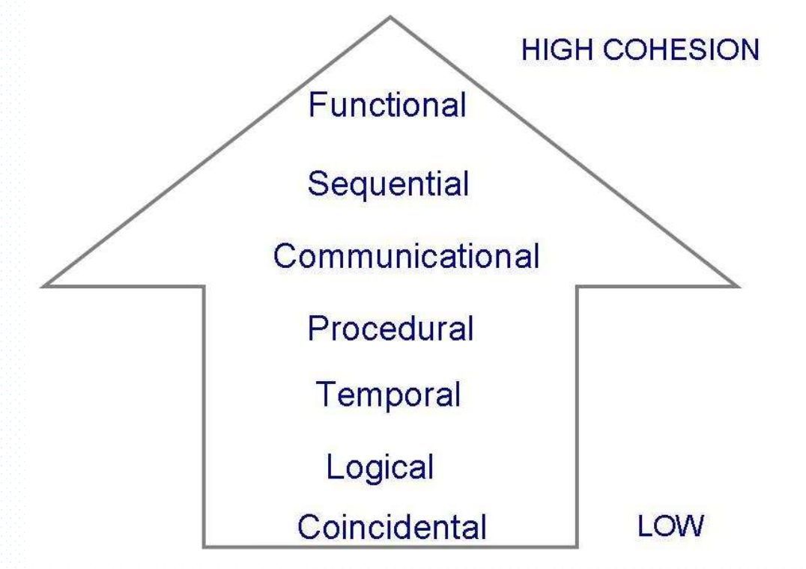
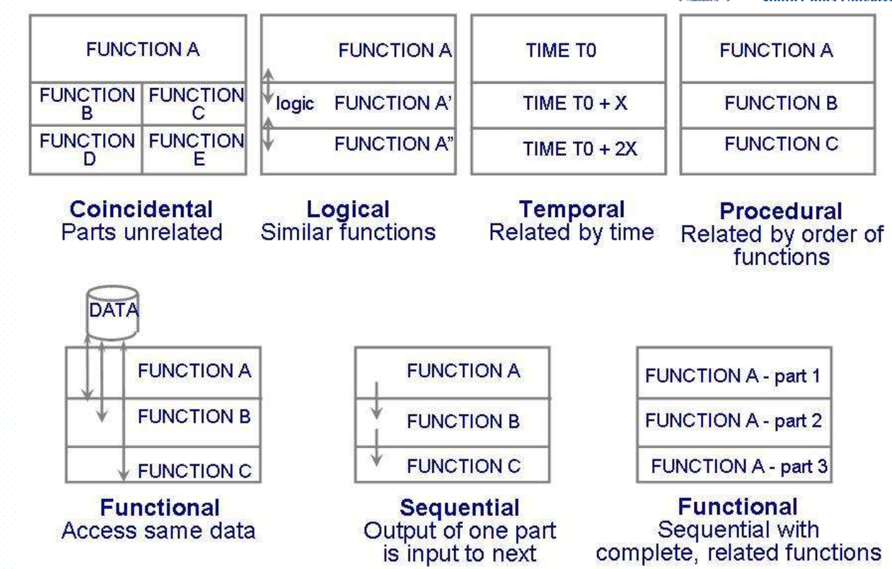

# 第5章：系统设计

## 系统设计概述

系统设计是一个两部分的迭代过程：

-   概要设计：设计软件的结构，把软件按照一定的原则分解为模块层次，赋予每个模块一定的任务，并确定模块间的调用关系和接口。得到软件结构图或者架构图
-   详细设计：对概要设计的一个细化，详细设计每个模块实现算法，将功能描述变为精确的、结构化的过程描述。得到详细设计说明书

## 好的设计的特征

### 耦合度

-   高度耦合：两个构件之间有大量依赖关系的时候
-   松散耦合：两个构件具有某种程度的依赖，但他们的相互连接比较弱
-   非耦合：构件之间不存在相互连接

#### 耦合度的类型

-   内容耦合：当一个构件修改了另一个构件的内部数据项的时候，或者一个构件内的分支转移到另一个构件中的时候，可能出现内容耦合。
-   公共耦合：对公共数据的改变

### 内聚

如果构件的所有元素都是直接面向执行同一个任务的并且必须的，那么该构件是内聚的。

内聚的类型：

## 改善设计的方法

-   降低复杂性
-   按合同设计
-   原型化设计：详细见需求分析中提及的原型化的优点
-   故障树分析：标识可能的失败，构造图，用节点表示失败，边表示节点之间的关系。
-   文档化设计：设计合理性，系统架构的描述，用户如何与系统进行交互。

