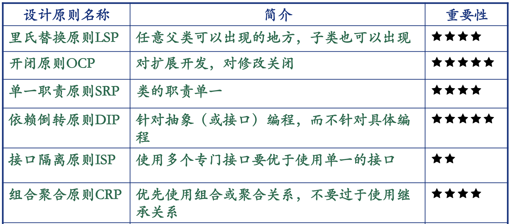

# 第13章： 面向对象设计原则

面向对象贼拉好，主要就是可以实现可维护性的复用。

重点掌握面向对象的一些基本设计原则

## LSP：里氏替换原则

>   任何父类出现的地方，子类都可以出现

子类对象必须可以替换基类对象，但是反过来不成立

只要有可能，就应该从抽象类中继承，不要从具体类中继承。

## OCP：开闭原则

>   对拓展开放，对修改关闭

-   对拓展开放：模块的行为可拓展
-   对修改关闭：对模块行为拓展的时候，不必改动模块的源代码或者二进制代码。

也就是说OCP原则认为应该试图去设计出永远都不用改变的模块，其关键在于抽象。

可以看课件中手开门开冰箱的例子。

## SRP：单一职责原则

对于一个类，应该仅有一个引起它变化的原因。

-   一个类承担的职责越多，其被复用的可能性越小。因为承担的职责过多就相当于将职责耦合在一起。
-   类的职责包括：
    -   数据职责：通过属性体现
    -   行为职责：通过方法体现
-   SRP体现“高内聚，低耦合”

>    增加新的类，让每一个类只有一个职责

上面的图中表示的类职责过多，耦合在了一起，违反了SRP原则，用SRP进行重构之后得到以下的类图

## ISP：接口隔离原则

-   客户不应该依赖他们用不到的方法，只给每个用户它所需要的接口
-   以一个类实现多个接口，而客户仅仅获知必须的接口

### ISP的本质

-   使用多个专门的接口比使用单一的接口好。
-   一个类对另一个类的依赖性应当是建立在最小的接口上
-   避免接口污染

下图中2比1好，因为客户仅获取了其需要的接口

## DIP：依赖倒置原则

-   高层模块不应该依赖于低层模块，而是都应该依赖于抽象
-   抽象不应该依赖于细节，细节应该依赖于抽象
-   针对接口编程，而不要针对实现编程

总的来说，依赖倒转就是：代码要依赖于抽象的类，不要依赖具体的类；要针对接口或对象编程，而不是针对具体编程。

DIP是实现OCP的一种主要手段。

### 启发式原则

-   任何变量都不应该拥有指向具体类的指针或者引用
-   任何类都不应该从具体类派生
-   任何方法都不应该改写其任何基类中已经实现的方法

### 针对接口编程

-   不将变量声明为某个特定的具体类的实例对象，而让其遵从抽象类定义的接口。实现类仅实现接口，不添加方法。

### 依赖于抽象

-   任何变量都不应该持有一个指向具体类的指针或者引用
-   任何类都不应该从具体类派生
-   任何方法都不应该覆写它的任何基类中已经实现的方法

## 组合复用原则

-   优先使用（对象）组合，而非（类）继承

实现复用的方法：

-   继承复用：实现简单，易于拓展。破坏系统的封闭性，从基类继承而来的实现是静态的，不能在运行时动态改变，缺乏灵活性（白盒复用）
-   组合复用：耦合度较低，可以灵活选择成员对象的操作，可以在运行时动态改变。（黑盒复用）

### 组合的优点和缺点

优点

-   仅通过被包含的对象的接口来对其进行访问
-   内部实现细节不可见
-   相互依赖小
-   每个类只专注于一个任务
-   通过获取指向其他的具有相同类型的对象引用，可以在运行期间动态定义组合

缺点

-   导致系统中对象过多
-   为了能将多个对象组合使用，必须仔细定义接口

### 继承的优点和缺点

优点

-   容易进行新的实现
-   易于修改和拓展被复用的实现

缺点

-   破坏了封装性
-   白盒复用，内部细节可见
-   父类更改了，子类不得不更改
-   从父类继承来的实现不能在运行期间改变

