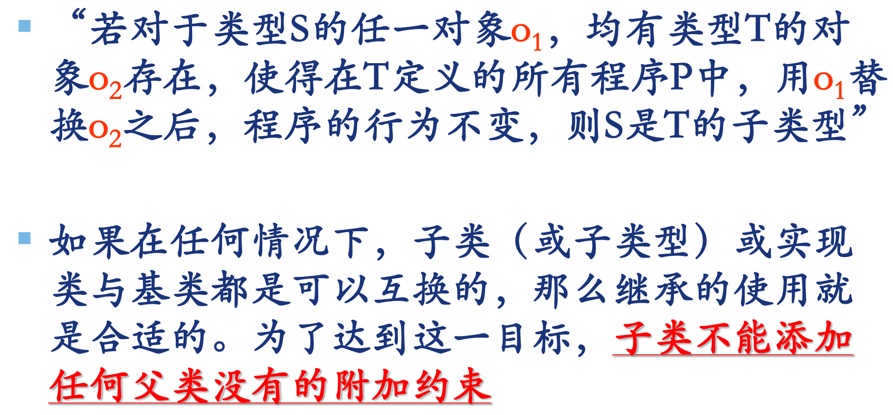

# 第13章： 面向对象设计原则

面向对象贼拉好，主要就是可以实现可维护性的复用。

重点掌握面向对象的一些基本设计原则

## LSP：里氏替换原则

>   任何父类出现的地方，子类都可以出现

子类对象必须可以替换基类对象，但是反过来不成立

只要有可能，就应该从抽象类中继承，不要从具体类中继承。

## OCP：开闭原则

>   对拓展开放，对修改关闭

-   对拓展开放：模块的行为可拓展
-   对修改关闭：对模块行为拓展的时候，不必改动模块的源代码或者二进制代码。

也就是说OCP原则认为应该试图去设计出永远都不用改变的模块，其关键在于抽象。

可以看课件中手开门开冰箱的例子。