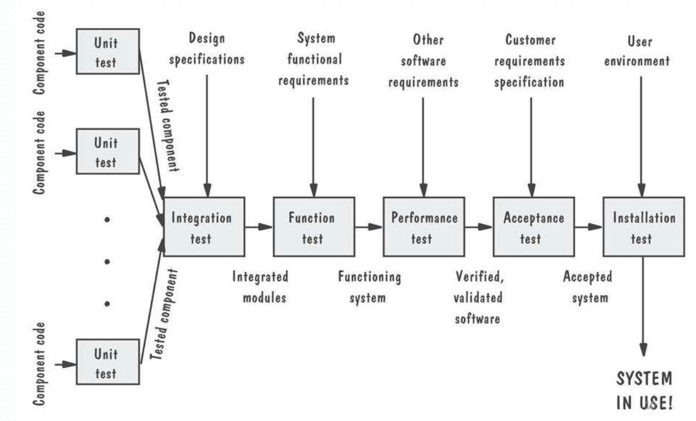
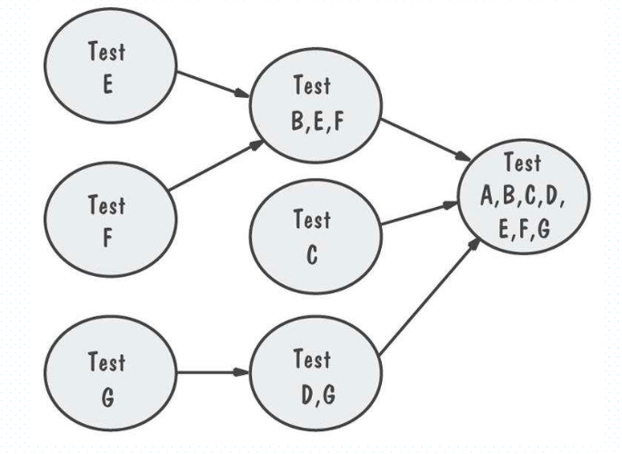
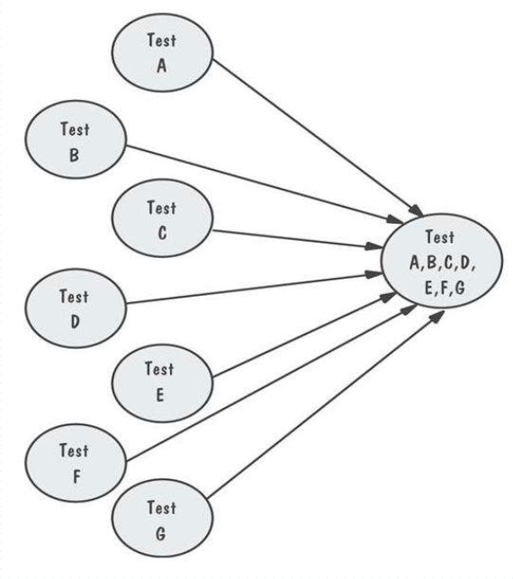
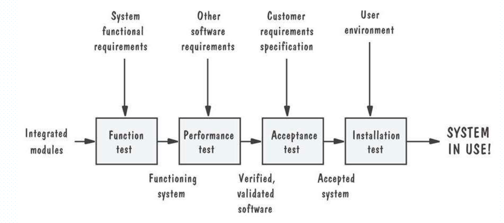

# 第14章： 软件测试

## 软件故障和失效

### 软件失效的原因

-   错误的需求
-   遗漏了需求
-   需求不可能实现
-   错误的系统设计
-   编码故障
-   程序代码错误

### 测试目的

测试目的：发现错误

只有当发现了错误，测试才被认为是成功的

-   故障识别：确定是哪一个故障引起失效
-   故障改正：修改系统去除故障

### 故障类型

-   `算法故障`：由于处理步骤中的错误，导致给定输入没有产生适当的输出。。
-   `计算故障、精度故障`：一个公式的实现是错误的
-   `文档故障`：文档与程序实际做的不一致
-   `能力或者边界错误`：系统活动达到极限，系统性能不可接受
-   `计时故障或协调故障`
-   `性能故障`：系统不能按照需求规格的速度执行
-   `标准和过程故障`

### 验证和确认

-   验证是指确保软件正确实现某一特定功能的一系列活动（我们是否在正确构造产品）
-   确认指的是确保开发的软件可追溯到客户需求的另一系列活动（我们够早的产品是否正确）

### 测试的组织与步骤

#### 测试的组织

-   模块测试、构建测试、单元测试
-   集成测试
-   功能测试
-   性能测试
-   验收测试
-   安装测试
-   Alpha测试和Beta测试

#### 测试的步骤

我们要对测试秉承一种忘我的态度，脱离个人情感。让独立的测试小组来测试，避免冲突，保持客观性。测试和编码要并行进行。

### 测试对象的视图

-   闭盒或黑盒：测试对象的功能。优点是免于受到内部结构的约束，但测试不完备。
-   开盒或白盒：测试对象的结构

## 单元测试

测试的完整性

-   语句测试
-   分支测试
-   路径测试
-   定义使用的路径测试
-   所有使用的测试
-   所有谓词使用/部分计算使用的测试
-   所有计算使用/部分谓词使用的测试

## 集成测试

### 集成测试的分类

-   自底向上的测试：测试序列和它们之间的关系

-   自顶向下的测试：只有顶部的测试是独立的

-   一次性测试

    -   构建驱动程序：调用特定构建并向其传递测试用例的程序
    -   桩：用于模拟缺少构件时的活动

    

-   三明治测试：将系统看作三层

-   改进的自顶向下测试

-   改进的三明治测试

## 测试计划

测试计划的组成

-   构建测试目标
-   设计测试用例
-   编写测试用例
-   测试测试用例
-   执行测试
-   评估测试结果

测试计划就是回答两个问题：计划的目的和计划的内容

计划的目的：

-   谁来测试、为什么测试、怎样测试（what，why，how）
-   测试的进度安排（when）

测试的内容

-   测试的目的，怎样测试，用什么标准确定测试完成与否

### 测试过程

软件故障在需求分析，系统设计，程序设计，程序实现，单元测试，系统测试、维护等步骤中都会出现的。

测试过程分为：

-   功能测试：是否按照规格说明书执行了它的功能
-   性能测试：是否满足非功能需求
-   验收测试：系统时客户期望的吗
-   安装测试：系统能在客户端运行吗

