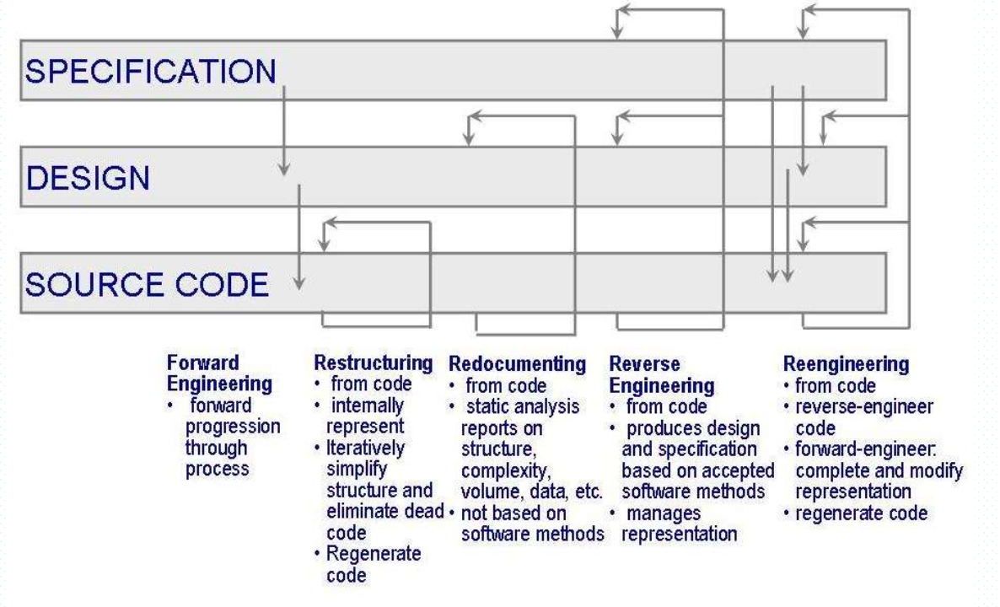

# 第15章：软件维护

## 软件维护的目的

### 软件演化法则

-   持续的变化：逐渐变得不可用
-   递增的复杂性：结构恶化
-   程序演化的法则：随着统计的确定趋势和不变性自我调节
-   组织稳定性的守恒：编程项目的总体互动性不变
-   熟悉程度的守恒：发布的内容是不变的

## 软件维护的类型

### 维护活动的类型

-   `改正性`：维护对日常的系统功能的控制
-   `适应性`：维护对系统修改的控制
-   `完善性`：完善现有系统
-   `预防性`：防止系统性能下降到不可接受的程度。

### 执行维护的人

-   单独的维护小组：更加客观，更容易将一个系统应该如何运转与其实际是如何运转区分开
-   开发人员：用易于维护的方式来构建系统，但有的时候过于自信自己对系统的理解，不愿意更新文档。

### 影响维护方法的因素

-   失效的类型
-   失效的关键性或者严重性
-   需要进行的改变的难度
-   要改变的构建的复杂性
-   必须进行的改变所处的物理地点的数目

### 影响工作量的因素

-   应用类型、系统新颖度
-   人员更替和维护人员的可用度
-   系统声明周期的跨度，对变化环境的依赖度
-   硬件特性，设计、代码、文档和测试的质量

## 软件再生

-   文档重构：对源代码进行静态分析，给出更多的信息
-   重组：改变代码结构
-   逆向工程：根据代码重新创建设计和规格说明信息
-   再工程：对现有工程进行逆向工程，接着再改变规格说明和设计以完成逻辑模型；然后，根据修改的规格说明和设计生成新的系统。

