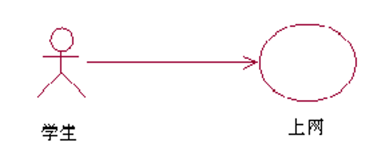
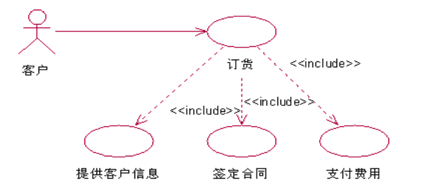
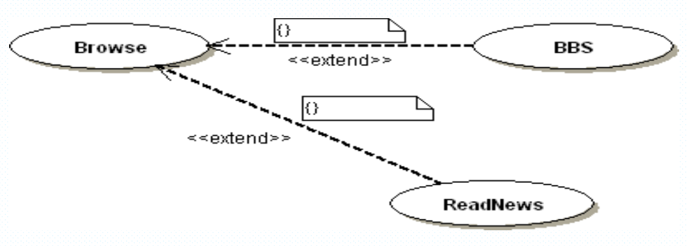
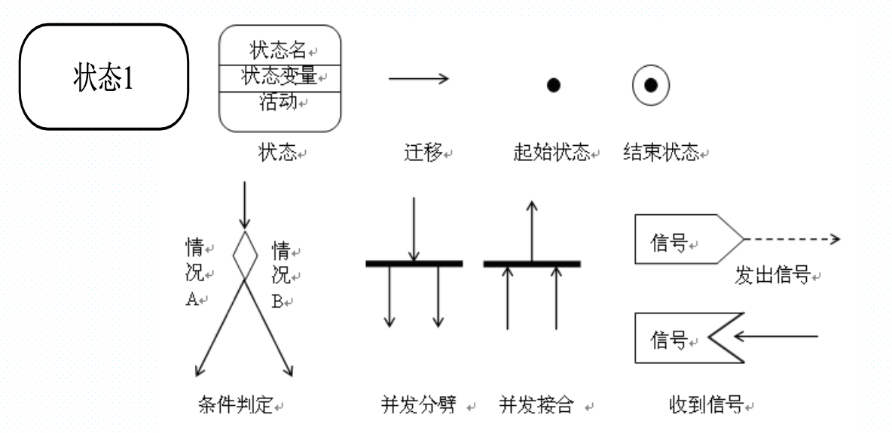
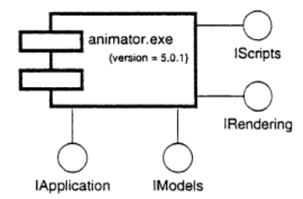

[TOC]

# 软件工程概述

## 1.什么是软件？

是一系列按照`特定顺序组织`的计算机`数据`和`指令`的集合，包括`程序、数据和文档`。

>   重点是软件还包含数据以及文档，不只有程序

## 2.什么是软件危机，其内容主要是指什么？

`软件危机`是指`落后的软件生产方式`无法满足`迅速增长的计算机软件需求`，从而导致软件开发与维护过程中出现一系列严重问题的现象。

主要内容：

-   `项目超时和超预算`：对项目预期没有良好的估计
-   `软件质量低下`：错误频发，缺乏有效质量保证和测试标准
-   `维护困难，维护成本不断提高`：设计的时候短视，编码低效率
-   `缺乏通用标准和方法论`

>   就想象一下自己编程遇到的问题，突然发现做不完了，钱不够了，写出了垃圾代码，自己都看不懂，改不了，也不知道怎么评价一个程序好坏。

## 3.什么是软件工程？

>   软件工程因为软件危机的产生而出现

**软件工程是应用计算机科学、数学及管理科学等原理开发软件的工程。它借鉴传统工程的原则、方法，以提高质量，降低成本为目的。**

软件工程是一个涉及软件的`开发`、`维护`、`管理`和`设计`的工程学科。它应用工程原则于软件的开发中，以确保软件是高效、可靠、可维护、符合成本效益和满足用户需求的。

## 4.软件工程的目标及其组成部分

软件工程的**目标**是：在给定`成本`、`进度`的前提下，开发出具有`适用性`、`有效性`、`可修改性`、`可靠性`、`可理解性`、`可维护性`、`可重用性`、`可移植性`、`可追踪性`、`可互操作性`和`满足用户需求`的软件产品。

>   目标就是：保证软件质量，满足客户需求，成本控制得住，软件可以维护，还能按时交付（单押！！！）

**组成部分：**

**软件工程`三要素`：`方法`、`工具`和`过程`**

- `方法`：产生某些结果的形式化过程
- `工具`：用更好的方式完成某件事情的设备或者自动化系统
- `过程`：生产特定产品的工具和技术的结合
- `范型`：构造软件的特定方式或哲学

## 5.软件开发方法的定义

`软件开发方法`就是从`技术上`为构建软件提供解决方法（如何做），涉及`沟通、需求分析，设计建模，编程，测试和技术支持`等方面。

## 6.好的软件的一些主要衡量指标（例如McCall 的质量模型）

衡量指标：

`对不对：`正确性，可靠性，完整性

`好不好：`效率，可使用性

`测试维护能力：`可测试性、可维护性、灵活性

`拓展能力：`可移植性、可复用性、互联性

McCall质量模型：

# 过程和生命周期建模

## 1.什么是软件生命周期？主要分为哪些阶段？各个阶段的主要任务及产生的主要制品？区分软件工程和软件过程。

### 软件生命周期

软件孕育、诞生、成长、成熟和衰亡的生存过程，我们称这个过程为软件生命周期或软件生存期。

可行性研究

- 任务：了解用户要求和现实环境，从技术、经济、市场等方面研究并论证开发该软件系统的可行性
- 阶段性产品：`可行性论证报告`、`初步项目开发计划`

需求分析

- 任务：确定用户对待开发软件系统的功能需求、非功能性需求，运行环境约束。
- 阶段性产品：`软件需求规格说明书SRS`

概要设计

- 任务：根据SRS建立目标软件系统总体结构、设计全局数据库和数据结构，规定设计约束，制定继承测试计划等等
- 阶段性产品：`概要设计规格说明书`、数据库或数据结构设计说明书、继承测试计划

详细设计

- 任务：细化概要设计生成的各个模块，并详细描述程序模块的内部细节，形成可编程的程序模块，制定单元测试计划。
- 阶段性产品：`详细设计规格说明书`、单元测试计划

实现阶段

- 任务：根据详细设计规格说明书编写源程序，进行调试和单元测试，验证程序与详细设计文档的一致性。
- 阶段性产品：`源程序代码`

集成测试

- 任务：根据`概要设计规格说明书`，将通过单元测试的木块逐步进行集成和测试
- 阶段性产品：生成满足概要设计要求、`可运行的系统源程序和系统集成测试报告`

确认测试

- 任务：根据软件`需求规格说明书`，测试软件系统是否满足用户需求
- 阶段性产品：`可供使用的软件产品`（文档、源程序）

软件维护

- 任务：对使用后的软件进行维护（修正错误，增加新功能，环境迁移）
- 阶段性产品：`新版本的软件产品`

### 软件工程与软件过程的区别：

-   **范围**：软件工程是一个更广泛的领域，包括软件过程、项目管理、技术实践等多方面内容。软件过程更专注于开发过程本身。
-   **焦点**：软件工程关注整个软件开发生命周期的所有方面，包括技术和管理。软件过程主要关注开发活动的组织和管理。
-   **目的**：软件工程的目标是提供高质量的软件，确保项目的成功。软件过程着重于定义和改进开发软件的步骤和方法。

## 2.可行性研究及需求分析的定义

上面有，这里进一步补充：

可行性分析：

-   技术可行性
-   经济可行性
-   操作可行性
-   社会可行性

>   理论上能不能做，够不够钱做，实际上能不能做，社会给不给做

需求分析：

-   功能性需求
-   非功能性需求
-   运行环境约束

>   功能性就是具体的功能点，非功能性就是功能的具体表现形式，比如运行实现要短，运行环境约束就比如必须要用国产平台系统等等。

## 3.典型的软件开发过程模型的特点（优缺点、文档评审和里程碑等）及要求，特别是原型法、瀑布模型、螺旋模型、增量和迭代等。

### 瀑布模型：由文档驱动的模型（重点）

特点：

- 采用结构化方法
- 阶段之间有顺序性和依赖性，强调每一个阶段的顺序
- 推迟实现的观点
- 没有循环

优点：采用规范的方法；严格规定每个阶段提交的文档；要求每个阶段交出的产品必须经过验证。适合用户需求完整，无重大变化的开发。

缺点：对开发中的变化没有提供指导，没有迭代，到有成果需要等待很长时间。

### 原型化模型

也就是快速开发一个软件的初步版本，这个版本称之为原型，这样早期就能看到并体验软件的部分功能

- 允许需求或设计反复调查，减少开发中的风险和不确定性

优点：提高用户满意度，用户直接参与开发过程，有利于早点发现需求并解决

存在的问题：

- 为了让原型尽快工作，没有考虑软件的总体质量和长期可维护性
- 为了掩饰，可能选取一些不理想的组成部分，然后这些部分成为了系统的一部分
- 开发过程不便于管理

建造原型仅仅是为了定义需求，之后被抛弃。

### 阶段化开发：增量和迭代

- 减少循环时间
- 系统一部分一部分交付
- 有产品系统和开发系统，可以并行

#### 增量模型

#### 增量与迭代：（重点）

增量：将系统分为多个块，每次增量地开发一个块

迭代：先搭好框架，然后逐步填充，但是每一次出来的都是可用的

优点：灵活，即使，用户参与，逐步交付，易于测试

缺点：对框架设计提出高要求，整体一致性问题等

### 螺旋模型（重点）

围绕四个主要活动，在六个象限上螺旋旋转：

- 用户通信
- 计划
- 确定目标、可选方案、约束
- 评估可选方案和风险
- 开发和测试
- 用户评估

优点：有利于软件冲用，减少了过多的测试或者测试不足，维护和开发没有本质区别。

特点：风险驱动，适合内部开发的大规模软件项目，随着迭代次数增加，工作量加大，成本上升。

### 喷泉模型

特点：主要用于支持面向对象开发过程。

## 4. 原型法的特点以及分类：探索型原型、实验型原型和演化型。

### 原型法的特点

1.  **快速反馈和迭代**：通过快速开发原型，可以及时获得用户反馈，并在此基础上进行迭代改进。
2.  **用户参与**：用户直接参与原型的评估，有助于确保产品符合他们的实际需求。
3.  **需求澄清和验证**：原型有助于在开发早期澄清和验证需求，避免需求误解。
4.  **风险降低**：通过提前揭示设计问题和需求不一致，有助于减少开发后期的风险。
5.  **灵活性**：原型法提供了修改设计的灵活性，以更好地适应用户的需求变化。

### 原型法的分类

1.  **探索型原型（Exploratory Prototyping）**：需求都不知道
    -   **目的**：主要用于帮助理解用户的需求和期望。
    -   **特点**：在需求定义不清晰的早期阶段使用，帮助开发团队和用户一起探索需求。
    -   **应用场景**：适用于新领域的软件开发，或者用户和开发者都不太清楚具体需求的情况。
2.  **实验型原型（Experimental Prototyping）**：需求知道了，看行不行对不对
    -   **目的**：用于测试某些软件设计或概念的可行性。
    -   **特点**：重点是验证技术选择、算法、策略等是否可行。
    -   **应用场景**：适用于技术创新或需要验证新技术的项目。
3.  **演化型原型（Evolutionary Prototyping）**：后面还能用
    -   **目的**：原型不仅用于需求的收集和验证，而且是最终产品的一部分。
    -   **特点**：原型在整个项目生命周期中不断演化，直到成为最终产品。
    -   **应用场景**：适用于需求频繁变更或需要持续用户参与的项目。

## 5.敏捷开发方法和极限编程的特点，基本原则有哪些。

### 敏捷方法：主打一个快

建立及时的反馈机制，强调人与人之间的直接沟通，轻文档，重合作，专注于对变化的适应

特点：

1.  **迭代和增量开发**：敏捷方法强调短周期的迭代和逐步的软件交付。
2.  **客户合作**：密切与客户合作，迅速响应客户需求的变化。
3.  **适应性强**：能够快速适应需求和环境的变化。
4.  **人本主义**：重视个人和团队交流，而非过度依赖工具和流程。
5.  **持续改进**：鼓励团队成员不断反思并改善开发过程。

>   短期有成效，重视客户的合作，重视团队沟通，对变化适应性强

基本原则：

1.  **客户满意度优先**：通过持续交付有价值的软件来确保客户满意。
2.  **欢迎变化**：即使在开发后期也能适应需求变更。
3.  **频繁交付软件**：定期交付可以工作的软件版本。
4.  **紧密合作**：业务人员和开发者必须在项目中日常合作。
5.  **支持和信任**：建立团队的自组织和动力。
6.  **面对面沟通**：直接沟通是效率最高的信息传递方式。
7.  **可持续开发**：保持开发速度以确保可持续性。
8.  **关注技术卓越**：持续追求技术改进和优良的设计。
9.  **简洁**：最大化不做工作的艺术。
10.  **自我组织团队**：团队具有自我组织和调整的能力。
11.  **反思调整**：定期反思并调整行为以提高效率。

>   就是多和甲方沟通，甲方是爸爸，甲方需求变了我也能满足，频繁交付给甲方
>
>   自己内部多沟通多合作，大家互相信任，形成一个好的团队，还会反思
>
>   追求好的技术，希望可持续开发，追求简洁
>
>   

### 极限编程（XP）

强化沟通，简化设计，迅速反馈。

四个核心要点：交流、简单、反馈、勇气

特点：

1.  **代码质量**：强调编写清晰、简洁且可维护的代码。
2.  **持续集成**：代码频繁且定期地集成到主分支。
3.  **测试驱动开发**（TDD）：先编写测试，然后编写能通过测试的代码。
4.  **配对编程**：两名程序员共同在一台计算机上工作，提高代码质量和团队协作。
5.  **简单设计**：采用最简单但可行的设计方案。
6.  **重构**：不断重构代码以提高其结构和可维护性。

基本原则：

1.  **沟通**：项目成功的关键在于团队成员之间的有效沟通。
2.  **简单性**：选择最简单的解决方案。
3.  **反馈**：通过测试和用户反馈来调整开发方向。
4.  **勇气**：敢于面对挑战和变化，即使是重构现有系统。
5.  **尊重**：团队成员之间相互尊重，共同推动项目成功。

>   就是一个敢说一个敢做，情绪稳定，经常有反馈。还真能有成果，真的太勇了！

## 6. CMM/CMMI及其层次划分。

### CMM（能力成熟度模型）

1.  **初始级（Initial）**：研0菜狗啥也不会瞎搞
    -   过程通常是不可预测的、不受控制的和反应式的。
    -   项目经常超时和超预算。
2.  **可重复级（Repeatable）**：有经验了，可以复现论文了
    -   已建立基本的项目管理过程。
    -   可以重复早期成功的项目。
3.  **已定义级（Defined）**：懂得写论文的规范了
    -   组织已经建立了一套标准的软件过程。
    -   所有项目都遵循这套标准过程。
4.  **可管理级（Managed）**：开始用数据写论文了
    -   组织收集详细的度量信息。
    -   过程和产品的质量受到量化控制。
5.  **优化级（Optimizing）**：还懂得论文润色了
    -   不断改进过程。
    -   强调过程效率和持续改进。

### CMMI（集成能力成熟度模型）

1.  **初始级（Initial）**
2.  **管理级（Managed）**
3.  **已定义级（Defined）**
4.  **量化管理级（Quantitatively Managed）**
5.  **优化级（Optimizing）**

# 需求分析

## 1.了解需求的重要性及需求分析阶段的目标及主要产物。

需求的`重要性`：需求不明确会在多方面导致项目的失败，如果早期没有检测到并修复需求错误，会造成很高的代价。

需求分析的`任务`：集中于用户的需要，搞清楚用户想要什么样的行为

需求分析的`结果`：`软件需求规格说明书`

## 2. 需求工程包括哪些方面？

包括：需求开发和需求管理

五个阶段：

-   `需求获取：`通过与用户的交流，对现有系统的观察及对任务进行分析，从而开发、捕获和修订用户的需求；

-   `需求建模：`为最终用户所看到的系统建立一个概念模型，作为对需求的抽象描述，并尽可能多的捕获现实世界的语义；

-   `形成需求规格：`生成需求模型构件的精确的形式化的描述，作为用户和开发者之间的一个协约；

-   `需求验证：`以需求规格说明为输入，通过符号执行、模拟或快速原型等途径，分析需求规格的正确性和可行性，包含有效性检查，一致性检查，可行性检查和确认可验证性；	
-   `需求管理：`支持系统的需求演进，如需求变化和可跟踪性问题。

## 3.需求的类型：功能需求、非功能需求或质量需求、设计约束、过程约束。

- `功能需求：`根据要求的活动描述需求行为
- `质量需求（非功能需求）`：描述软件必须拥有的质量特征
    - 性能要求、界面要求
    - 易用性、安全性、完整性、可靠性
    - 可移植性、可拓展性、可维护性
- `设计约束：`已经做出的设计决策或对问题解决方案集的限制的设计决策
- `过程约束：`对于构建系统的技术和资源的限制

## 4. 两种需求文档：需求定义文档和需求规格说明书。

`需求定义文档：`用户想要的每一件事情的完整列表

`需求规格说明：`将需求重新表述为系统如何运转的规格说明

## 5. 需求规格说明书的主要内容。

第3点中的内容

功能需求、质量需求、设计约束和过程约束

## 6. 常用的需求建模表示方法：ER图、事件跟踪、状态机、Petri网、数据流图、PERT图、用例图和原型法。

### ER图

ER图提供了解决问题的总体概况，当问题的需求变化的时候，视图相对稳定。

### 事件跟踪：关注“行为”

- 垂直线：不同实体的时间线，实体名字出现在线的顶部
- 水平线：两个实体之间的一个事件或者交互
- 时间从上往下

### 状态机

状态机在表示动态行为方面，以及描述在响应已经发生的历史事件时行为将如何变化方面很有用。

- 点（状态）：表示存在于事件发生之间的一个稳定的条件集合
- 边（转移）：表示由于一个事件的发生而产生的行为或条件的变化

### 数据流图（DFD）

建模功能以及从一个功能到另一个功能的数据流，从数据的角度描述系统

- 泡泡：加工
- 箭头：数据流
- 平行线：输出存储（库或者信息库）
- 矩形：表示参与者（提供输入和输出的实体）

### 用例图

数据流图演变成UML的用例图。用例并不一定建模系统的全部，而是用于说明用户对重要系统行为的观察

- 大的方框：系统边界
- 方框外的小人：参与者，人或者系统
- 方框内的椭圆：用例，表示必须的主要功能及其变种
- 参与者与用例之间的连线：参与者参与了该用例

### Petri网（ppt没有，大纲有）

1.  **位置（Places）**：通常用圆圈表示，代表系统中的状态或者资源。
2.  **变迁（Transitions）**：用矩形或条表示，代表系统中的事件或活动。
3.  **令牌（Tokens）**：放在位置内的黑点，表示某种资源的数量或状态的存在。
4.  **弧（Arcs）**：连接位置和变迁，表示活动和状态之间的关系。

人工智能里面的知识表示法中也有这个Petri网

### Pert图（ppt没有，大纲有）

1.  **节点**：在PERT图中，节点（通常是圆形或矩形）代表项目中的任务或事件。每个节点通常包含有关任务的信息，如任务编号、名称、开始和结束日期。
2.  **箭头**：箭头表示任务之间的依赖关系。一条箭头从一个任务指向另一个任务，表示第一个任务必须完成后第二个任务才能开始。
3.  **关键路径**：关键路径是从项目开始到完成的最长持续时间路径。它表明了项目完成日期的最早可能时间，任何关键路径上的延迟都会延迟整个项目。

### 原型法

构造原型，快速弄清楚用户需求，具体看前面

## 7. 程序流图的主要内容（包括环路复杂度、独立路径等） 。

根据程序流程图，完成：

 (1) 画出相应的程序控制流图； 

(2) 给出控制流图的邻接矩阵；

 (3) 计算 McCabe 环形复杂度；

 (4) 找出程序的一个独立路径集合。

1. 画出相应的程序控制流图

一个小判断就是一个节点，比如第一个and就分为两个节点

2. 给出控制流图的邻接矩阵

3. 计算 McCabe 环形复杂度

V(G) = m - n + 2p 

◌ m 是 G 的边数目 

◌ n 是 G 的顶点数目

 ◌ p 是 G 的连通分支数

V(G) = m - n + 2 = 10 – 7 + 2 = 5

4. 找出程序的一个独立路径集合

独立路径：至少沿一条新的边移动的路径。对所有独立路径的遍历使得程序 中的所有语句至少被执行一次。

5条独立的基本路径：

-   1-2-3-4-5-6-7
-   1-3-4-5-6-7
-   1-2-4-5-6-7
-   1-2-3-4-7
-   1-2-3-4-5-7

# UML图形

## 1.UML的作用

UML是为软件系统的制品进行描述（specifying）、可视化（visualizing）、构造（constructing）、文档化（documenting）的一种语言。

## 2.UML中的4＋1视图：用例视图，设计视图，进程视图，实现视图， 分布视图。

每个视图关注软件开发的某一个侧面，视图由模型图组成。模型图描述了构成视图的基本模型元素以及其相互关系。

- 用例视图
- 设计视图（逻辑视图）
- 进程视图
- 实现视图
- 分布视图

### 用例视图

描用来支持软件系统的需求分析，定义系统边界，关注于系统的外部功能描述。从系统使用者的角度，描述系统外部的静态功能和动态行为。

对应的模型图：交互图（顺序图和协作图）、状态图、活动图

### 逻辑视图

定义系统的实现逻辑，描述为了实现用例图描述的功能，在对软件设计时候所产生的设计概念（设计词汇）。逻辑视图定义了设计词汇的逻辑结构，之间的语意关系。

对应的模型图：类图、对象图、交互图、状态图、活动图

### 实现视图

定义了逻辑结构的物理实现，包括设计元素对应的源代码文件，物理文件之间的关系等。

对应模型图：部件图、交互图状态图、活动图

### 部署视图

描述软件产品在计算机硬件系统和网络上的安装、分发和分布。

对应的模型图：静态特性：部署图。动态特性：交互图、状态图、活动图。

## 3.UML中所包含的9种图形及各自的作用。

1.  **用例图（Use Case Diagram）**：
    -   描述系统的功能及其外部用户（即参与者）。
    -   用于捕获系统的功能性需求。
2.  **类图（Class Diagram）**：
    -   展示系统中的类、类的属性、方法以及类之间的关系。
    -   用于描述系统的静态结构。
3.  **对象图（Object Diagram）**：
    -   类图的一个实例，显示系统中对象的关系和属性。
    -   用于理解类图中定义的结构在特定情况下的具体表现。
4.  **状态图（State Diagram）**：
    -   描述对象可能的状态以及导致状态变化的事件。
    -   用于展示对象或系统的行为。
5.  **活动图（Activity Diagram）**：
    -   描述业务流程或操作的工作流。
    -   用于展示系统的动态行为，特别是业务和工作流程。
6.  **顺序图（Sequence Diagram）**：
    -   展示对象间交互的时间顺序。
    -   用于描述对象如何协作完成特定的任务。
7.  **协作图（Communication Diagram）**：
    -   与顺序图相似，但强调对象间的关系而非时间顺序。
    -   用于展示对象间的交互及其关系。
8.  **组件图（Component Diagram）**：
    -   展示系统的物理组件（如软件模块、数据库、中间件等）及其组织和依赖关系。
    -   用于描述系统的物理构造。
9.  **部署图（Deployment Diagram）**：
    -   描述系统的物理部署，包括硬件和软件的配置。
    -   用于描述系统如何在硬件上分布，包括节点和连接。

## 4.用例图的作用。

需求捕获、定义系统边界，展示系统交互

## 5.用例图的主要构成部分。

- 系统边界：提供用例所需要的功能的的黑盒子。系统的外部特性由系统功能来定义，系统功能用一组用例来描述。
- 执行者：需要使用系统的任何外部实体
- 用例：用客户或客户语言和词汇来描述一个系统的完整功能。
- 关联：连接执行者和用例。表示执行者所表示的系统外部实体和该用例所描述的系统需求有关
- 包含：用例A连向用例B，表示A使用了B的行为或功能
- 拓展：用例A连向用例B，表示B描述了一项基本需求，而A则描述了该基本需求的特殊情况。

#### 参与者（活动者、执行者）

参与者是外部需要与系统交互的事物，分为人、设备和外部系统

#### 用例间的关系

1. 关联关系

（参与者与用例之间的关系），表示参与者与用例之间具有使用，交互信息的关联。

2. 泛化关系

参与者与参与者之间，用例与用例之间的关系。被泛化的时候，表示其可以定义为一个更为抽象的参与者或者用例

3. 包含关系

    两个用例之间，一个用例（基本用例）的行为包含了另一个用例（包含用例）的行为。包含关系用依赖关系的<<include>>构造型来表示。

    

    需要注意包含关系的正确使用，不要用它来描述功能，应该要描述对象。

4. 拓展关系

拓展关系表示基本用例在拓展点要增加的新的行为或功能，以拓展到新用例。用依赖关系的<<extend>>构造型表示。

拓展用例可以在基用例上添加新的行为，但是基用例必须生命某些特定的拓展点，并且拓展用例只能在这些拓展点上拓展新的行为。<u>拓展用例的目的是在不改变某个已经存在的用例的前提下为其增添新的行为。</u>

**包含与拓展关系**

## 

## 6.类图的主要作用

类图是描述类、接口及其他们之间关系的图，显示了系统中各个类的静态结构，是一种静态模型。

## 7.了解类之间的各种关系：关联、依赖、继承或泛化、组合/聚合等。

### 关联

关联表示类的对象之间的结构关系，在代码中表现为一个类以属性的形式包含对另一个类的对象的引用。

**表示方法：**

-   用`无向线段`表示，表示双向关系
-   用`有向线段`表示：是一种单向关系

**二元关联：**两个类之间的关联

### 泛化

泛化关系（继承关系）定义类和包之间的一般元素和特殊元素之间的分类关系。

如果一个类A(父类)的属性和操作能被另一个类B(子类)所继承，则类B不仅可以包含A的属性和操作，还可以添加自己独有的属性和操作，这就是泛化。

### 聚合和组合

#### 聚合

聚合表示类和类之间的“整体——部分”关系，用空心菱形表示。聚合表示一个类拥有另一个类的对象。

当整体类不存在时，部分类仍可能存在。部分类销毁的时候，整体类也将能够存在。

#### 组合

组合表示聚合的一种特殊情形，用实心菱形表示。一个部分类最多只能够属于一个整体类，当整体类不存在的时候，部分类将同时被销毁。

#### 聚合和组合的区别：

-   组合：整体端的重数必须是1，部分类的重数是任意的
-   聚合：整体端的重数可以大于1，部分类的重数是任意的

#### 关联和聚合的区别：

-   关联：涉及的两个类是在同一个层次上的
-   聚合：涉及的两个类处在不平等的层次上，一个表示整体，一个表示部分。

### 依赖

依赖表示一个类以某种形式依赖于其他类。当两个类处于依赖关系中时，其中一个类的改变可能会影响另一个类。比如说一个类将另一个类的对象作为自己的某个参数或者局部变量。

只要一个类用到了另一个类，但是和另一个类的关系不是太明显的时候，就可以把这种关系看成是依赖。

## 8.了解类图的基本建模步骤。

>   先从原始需求文档中找出所有的名词，合并同类项，将没有动作作用的名字当作类，剩下的作为属性，然后补充完整属性，定义类操作，然后画图，画类之间的关系图。

## 9. 接口和抽象类的定义及各自的特点。

## 抽象类

抽象类指的是那些不具有任何对象的类，其作用是为其他的类描述他们的公共属性和行为。

表示：

-   用斜体字表示抽象元素的名称
-   用{abstract}约束来表示

用abstract修饰的方法叫做抽象方法，由adstract修饰的类叫做抽象类

## 接口

接口是一组没有实现的操作的集合。接口只提供操作的声明，不提供任何相应的功能代码。具体的功能代码由使用该接口的类实现，叫做实现关系。

类和接口不同，一个类可以有其形态的真实实例，但是一个接口必须至少有一个类来实现它。

表示：

-   接口中只包含普通函数，不包含构造函数
-   接口中只提供方法的格式声明，而不能包含方法的实现
-   接口中的所有函数都是共有的，不需要添加可见性

要实现接口，就必须在类名后包括接口，然后提供接口的每一个成员实现。

在接口成员的声明中不用写可见性，在类中相应接口成员实现定义中都用public。

#### 接口的拓展

可以通过继承来对接口进行组合并拓展。

### 抽象类和接口的相同与不同

相同：

-   接口和抽象类都不能实例化
-   都位于继承的顶端，用于被其他实现或继承
-   都包含抽象方法，其子类都必须覆写这些抽象方法。

区别：

-   抽象类中可以有自己的数据成员也可以有抽象的成员方法。接口中的方法只能有静态的不能被修改的数据成员，方法都是抽象的。
-   抽象类表示的是一种继承关系，一个类只能使用一次继承关系，但是一个类却可以实现多个接口。
-   抽象类中的方法可以有默认行为，但接口中的方法不能有默认行为。

-   行为模型应该尽量选用接口。
-   需要定义子类的行为而且又要为子类提供通用的行为的时候采用抽象类。

## 

## 10.交互图的分类：顺序图和协作图。这两种图形各自的优缺点。注意UML 2.0中协作图改称通信图。

交互图描述对象之间的动态合作关系以及合作过程中的行为次序。通常用来描述一个用例的行为，显示该用例中所涉及的对象及其之间的消息传递情况。

交互模型建模：

-   顺序图：主要描述对象之间信息交换时的时间顺序
-   协作图：用来描述系统对象间如何协作共同完成系统功能的要求

### 顺序图

顺序图强调的是消息发送的时间的先后顺序。在考察系统对象的交互的时候，从顺序图开始，然后将顺序图转换为协同图，分析系统在结构方面应该具备的特点。

顺序图组成部分：

-   对象：用对象框（短式）表示，对象名要带<u>下划线</u>，消亡的时候在生存线上用一个❌表示。
-   生存线：对象框下面画的一条垂直虚线
-   激活期：对象生存线上的一个细长方形框，表示该对象的激活时间段。
-   消息：对象之间消息的发送和接受用两个对象生存线之间的消息箭头线表示。

越靠近上面的消息越先发送。

优点：

1.  **时间顺序清晰**
2.  **易于理解**
3.  **适合时间相关的分析**

缺点：

1.  **不适合复杂的场景**：对于复杂的系统或应用，顺序图可能难以展现所有重要的交互。

## 协作图

协作图是交互图的另一种表现形式，在语义上和交互图是等价的。协作图描述对象之间的连接关系，侧重说明那些对象之间有消息传递。协作图中对象用对象图符表示，箭头表示消息发送的方向，编号表明消息的执行顺序。

协作图的构成

-   对象
-   连接：对象之间的语义联系，用对象之间相连的直线表示
-   在连接上面传递的消息：用带箭头的直线表示

优点：

1.  **展示对象间关系**：协作图很好地展示了对象间的关系和它们如何相互作用。
2.  **适合复杂交互**：对于展示复杂的对象交互和关系，协作图可能更有优势。
3.  **更灵活的布局**：协作图的布局比较灵活，可以根据需要调整。

缺点：

1.  **时间顺序不明显**：协作图不强调时间顺序，可能难以理解交互的顺序。
2.  **可能存在歧义**：没有清晰的时间轴，某些交互的顺序可能产生歧义。

### 顺序图和通信图的区别

## 11. 状态图和活动图各自的作用。注意活动图中泳道的作用。

### 状态图

状态图描述了一个对象或交互过程在其生命周期中对一系列外界激励所呈现出的不同状态及其相应的响应和活动。

#### 状态图的基本组成

状态图符、迁移图符、起始状态、终止状态、条件判定、发出信号、接受信号和并发等等。

### 活动图

>   活动图是一种特殊形式的状态机，用于对计算流程和工作流程建模

-   活动图的状态表示计算过程中所处的各种状态，而不是普通对象的状态。

>   用来为非反映型对象建模的状态机被称为**活动图**

**活动图的作用**

-   为业务流程建模
    -   用泳道表示不同的业务部门，用活动表示不同的业务步骤
    -   根据泳道的划分，确立相应的协同
    -   利用交互和交互图对软件的动态行为
-   为对象的特定操作建模
    -   对操作的动态行为进行说明、可视化、建档、建造。
    -   活动图可以看作交互图的细化，用交互图定义对象之间的配合，活动图定义这些配合的实现。

## 

### 泳道

在语义上的相互关联的活动状态的子集的划分是用泳道来实现的。

-   泳道是活动图里对其中的活动按照其职责上的关联进行的划分。泳道在活动图中是一系列的垂直的隔断。
-   每个活动都属于且只属于一个泳道
-   泳道之间可以有变迁的传递
-   泳道可以有名字

## 12.组件图的作用以及组件与接口间的关系。

### 组件图的作用

-   为可执行文件和库文件建模

-   为数据表、文件和文档建模

-   为软件系统建模

    -   为程序API建模

    

    -   为源代码建模

    

### 组件和接口

组件化可以替换，让边界更加清晰，便于维护和升级。组件化的系统可以分布式。

组件和接口之间的联系：

-   实现关系：一个组件实现了一个接口，输出接口。被一个组件实现的接口是该组件的实现接口
-   依赖关系：一个组件使用了另一个组件实现的接口所提供的服务。是输入接口

## 13. 部署图的作用以及节点的分类。

### 部署图的作用

一个UML部署图描述了一个运行时的硬件结点，以及在这些节点上运行的软件组件的静态视图。

部署图显示了系统的硬件，安装在硬件上的软件以及用于连接异构的机器之间的中间件。

创建一个部署模型能够：

-   探究系统投产的相关问题
-   探究你的系统和生产环境中其他系统的依赖关系
-   描述一个商业应用主要的部署结构
-   设计一个嵌入系统的硬件和软件结构
-   描述一个组织的硬件/网络基础结构

### 节点分类

-   处理器：具备计算功能
-   设备：不具备计算功能

# 系统设计

## 1.系统设计的两个阶段划分。

-   概要设计：
-   详细设计：

## 2. 概要设计的主要任务及输出物。

概要设计：设计软件的结构，把软件按照一定的原则分解为模块层次，赋予每个模块一定的任务，并确定模块间的调用关系和接口。得到软件结构图或者架构图

## 3. 详细设计的主要任务及输出物。

详细设计：对概要设计的一个细化，详细设计每个模块实现算法，将功能描述变为精确的、结构化的过程描述。得到详细设计说明书

## 4. 好的设计的衡量：内聚和耦合。

### 耦合度

-   高度耦合：两个构件之间有大量依赖关系的时候
-   松散耦合：两个构件具有某种程度的依赖，但他们的相互连接比较弱
-   非耦合：构件之间不存在相互连接

### 内聚

如果构件的所有元素都是直接面向执行同一个任务的并且必须的，那么该构件是内聚的。

## 5. 常用的内聚和耦合度类型。

#### 耦合度的类型

-   内容耦合：当一个构件修改了另一个构件的内部数据项的时候，或者一个构件内的分支转移到另一个构件中的时候，可能出现内容耦合。
-   公共耦合：对公共数据的改变

### 内聚的类型：

## 6. 软件体系结构或架构设计的含义及作用。

软件体系结构 = 构件+连接件+约束 。

其中，连接件是一类特殊的构件，是将构件连接在一起的软件构造体。约束是指按照什么标准或要求将构件连接起来。三者的关系可以表述为：按照系统的性能约束或者功能约束，用连接件将构件组装成软件系统。

作用：
    软件体系结构的作用犹如建筑工程中的“施工图纸”，或者称之为“蓝图”。没有图纸，不能开工。同样地，没有软件体系结构，就无法构造复杂的软件系统。由此可见，软件体系结构的重要性。

# 系统测试

## 1. 测试的目标和衡量标准。

目的：验证和确认，发现错误，保证质量，风险管理

衡量标准：缺陷密度、缺陷发生率等等

## 2. 测试的分类（或组织）。各种类型的测试的主要任务及所依赖的文档。

-   单元测试：测试各个模块（源代码）
-   集成测试：测试模块组合行为（设计文档）
-   功能测试：测一下功能是否正确完整（需求说明书）
-   性能测试：测试系统性能（设计规格）
-   验收测试：让用户测试（用户需求文档）
-   安装测试：在用户环境安装并测试（系统配置规格）

## 3. 黑盒测试和白盒测试的思想，了解白盒测试中的基本路径测试等方法。

黑盒测试：测试功能，不了解逻辑和结构

白盒测试：测结构测逻辑

-   基本路径测试：用控制流图识别执行路径，并全部检测
-   代码覆盖：确保各个代码都测了

## 4. 单元测试的主要内容。什么是冒烟测试。如何划分等价类。

单元测试：测一个函数或者一个方法

-   功能正确性测试
-   边界条件测试
-   异常处理测试
-   路径覆盖测试

#### 冒烟测试

一种快速测试方法，确保软件基本功能正常，没有严重错误，足够稳定，不涉及深入的功能

#### 划分等价类

用于黑盒测试，减少测试用例

-   定义等价类
-   有效等价类
-   无效等价类
-   创建策四用例

## 5. 集成测试的类型及主要的测试策略。

主要类型：逐步集成和一次性集成

-   自底向上的测试：测试序列和它们之间的关系

-   自顶向下的测试：只有顶部的测试是独立的

-   一次性测试

    -   构建驱动程序：调用特定构建并向其传递测试用例的程序
    -   桩：用于模拟缺少构件时的活动

    

-   三明治测试：将系统看作三层

-   改进的自顶向下测试

-   改进的三明治测试

## 6. 确认测试的内容。

验证之前发现的缺陷是否被修复，确保没有新的问题引入，让用户验收。

## 7. 了解测试计划的主要内容。

测试计划定义了测试的范围、方法、资源和计划执行的各项活动

## 8. 测试系统中的测试过程：功能测试、性能测试、验收（或确认）测试、安装测试， alpha和Beta测试，及它们的内容。

-   功能测试：是否按照规格说明书执行了它的功能
-   性能测试：是否满足非功能需求
-   验收测试：系统时客户期望的吗
-   安装测试：系统能在客户端运行吗

-   alpha&Beta测试：属于验收测试。alpha是内测，beta是公测

# 系统维护

## 1. 维护活动的类型

改正性、适应性、完善性、预防性。

## 2. 各种维护活动的主要内容和目标。

-   `改正性`：维护对日常的系统功能的控制
-   `适应性`：维护对系统修改的控制
-   `完善性`：完善现有系统
-   `预防性`：防止系统性能下降到不可接受的程度。

## 3. 软件再生：文档重构、重组、逆向工程、再工程，以及它们各自的内容和含义。

-   文档重构：对源代码进行静态分析，给出更多的信息
-   重组：改变代码结构
-   逆向工程：根据代码重新创建设计和规格说明信息
-   再工程：对现有工程进行逆向工程，接着再改变规格说明和设计以完成逻辑模型；然后，根据修改的规格说明和设计生成新的系统。

# 面向对象设计原则

## 1.主要的面向对象设计原则及各自的原理

## LSP：里氏替换原则

>   任何父类出现的地方，子类都可以出现

子类对象必须可以替换基类对象，但是反过来不成立

只要有可能，就应该从抽象类中继承，不要从具体类中继承。

## OCP：开闭原则

>   对拓展开放，对修改关闭

-   对拓展开放：模块的行为可拓展
-   对修改关闭：对模块行为拓展的时候，不必改动模块的源代码或者二进制代码。

也就是说OCP原则认为应该试图去设计出永远都不用改变的模块，其关键在于抽象。

可以看课件中手开门开冰箱的例子。

## SRP：单一职责原则

对于一个类，应该仅有一个引起它变化的原因。

-   一个类承担的职责越多，其被复用的可能性越小。因为承担的职责过多就相当于将职责耦合在一起。
-   类的职责包括：
    -   数据职责：通过属性体现
    -   行为职责：通过方法体现
-   SRP体现“高内聚，低耦合”

>    增加新的类，让每一个类只有一个职责

上面的图中表示的类职责过多，耦合在了一起，违反了SRP原则，用SRP进行重构之后得到以下的类图

## ISP：接口隔离原则

-   客户不应该依赖他们用不到的方法，只给每个用户它所需要的接口
-   以一个类实现多个接口，而客户仅仅获知必须的接口

### ISP的本质

-   使用多个专门的接口比使用单一的接口好。
-   一个类对另一个类的依赖性应当是建立在最小的接口上
-   避免接口污染

下图中2比1好，因为客户仅获取了其需要的接口

## DIP：依赖倒置原则

-   高层模块不应该依赖于低层模块，而是都应该依赖于抽象
-   抽象不应该依赖于细节，细节应该依赖于抽象
-   针对接口编程，而不要针对实现编程

总的来说，依赖倒转就是：代码要依赖于抽象的类，不要依赖具体的类；要针对接口或对象编程，而不是针对具体编程。

DIP是实现OCP的一种主要手段。

## 组合复用原则

-   优先使用（对象）组合，而非（类）继承

实现复用的方法：

-   继承复用：实现简单，易于拓展。破坏系统的封闭性，从基类继承而来的实现是静态的，不能在运行时动态改变，缺乏灵活性（白盒复用）
-   组合复用：耦合度较低，可以灵活选择成员对象的操作，可以在运行时动态改变。（黑盒复用）

### 组合的优点和缺点

优点

-   仅通过被包含的对象的接口来对其进行访问
-   内部实现细节不可见
-   相互依赖小
-   每个类只专注于一个任务
-   通过获取指向其他的具有相同类型的对象引用，可以在运行期间动态定义组合

缺点

-   导致系统中对象过多
-   为了能将多个对象组合使用，必须仔细定义接口

### 继承的优点和缺点

优点

-   容易进行新的实现
-   易于修改和拓展被复用的实现

缺点

-   破坏了封装性
-   白盒复用，内部细节可见
-   父类更改了，子类不得不更改
-   从父类继承来的实现不能在运行期间改变

### 最少知识原则（LoD）

限制交互，只和直接朋友通信，避免过度关心

# 其他

## 1. 白盒测试主要包括哪几种？各自的测试内容是什么？

语句覆盖（Statement Coverage）

-   **测试内容**：确保程序中的每个语句至少执行一次。
-   **目的**：验证代码中的每一行都没有错误。

分支覆盖（Branch Coverage）

条件覆盖（Condition Coverage）

路径覆盖（Path Coverage）

循环测试（Loop Testing）

## 2.软件项目管理中用于估计工作量的指标主要包括哪些？

代码行数、功能点、案例点、人月等等

## 3. 判定表、数据字典、IPO图、PDL、DFD图、甘特图等常用的图形的主要作用是什么？哪些经常在结构化方法中使用？

判定表

-   用于复杂决策
-   需求分析阶段

数据字典

-   用于记录数据定义和描述
-   整个软件开发过程

IPO图

-   展示程序输入、处理和输出
-   系统设计阶段

PDL图

-   伪代码描述
-   程序设计阶段

DFD图

-   系统内数据流动和处理过程
-   系统分析阶段，设计阶段

甘特图

-   用于项目管理，现实任务、持续时间、时间线
-   跟踪项目进度

## 4. 软件过程、软件生命周期、软件工程、瀑布模型、原型法、里程碑等基本概念。

里程碑：表示项目时间线上的重要事件或者阶段。

## 5.常用的质量保障措施和方法有哪些？

指定标准和指南、代码审查、自动化测试、持续集成、配置管理等
